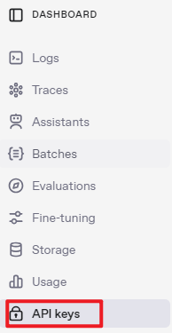
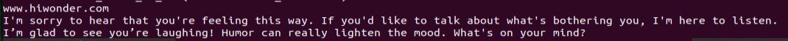
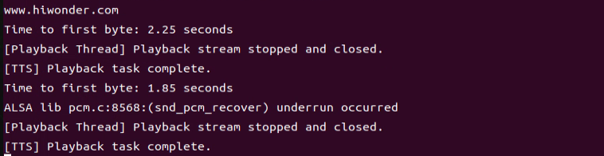
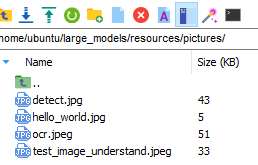
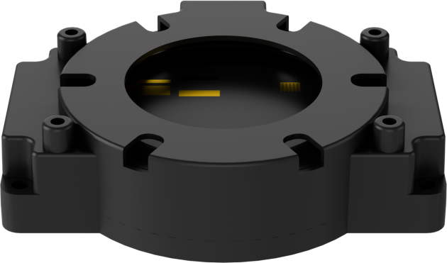
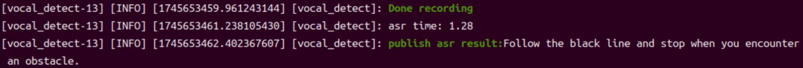
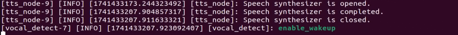
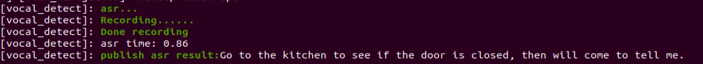

# 10 Large AI Model Courses

## 10.1 Large Models Basic Courses

### 10.1.1 Large Language Model Courses

* **Overview of Large Language Model**

A Large Language Model (LLM) is an advanced artificial intelligence model developed to comprehend and generate human language.


(1) Basic Concept

A Large Language Model (LLM) is a deep learning model trained on extensive text data, designed to either generate natural language text or comprehend the meaning of language. LLM is capable of performing various natural language tasks, such as text classification, question answering, and dialogue, making them a crucial step toward achieving advanced artificial intelligence. Unlike smaller models, LLM leverages a similar Transformer architecture and pretraining objectives (like Language Modeling), but are distinguished by their larger model size, greater training data, and enhanced computational resources.

(2) Features

**Massive Scale:** LLM are characterized by their vast parameter sizes, often reaching billions or even trillions of parameters. This immense scale allows them to capture a wealth of linguistic knowledge and complex syntactic structures.

**Pretraining and Fine-tuning:** LLM utilize a two-stage learning process: pretraining and fine-tuning. Initially, they are pretrained on large-scale, unlabeled text data, learning general language representations and knowledge. Subsequently, they are fine-tuned using labeled data to specialize in specific tasks, allowing them to excel across a wide range of NLP applications.

**Contextual Awareness:** LLM demonstrate exceptional contextual awareness, with their ability to understand and generate language deeply dependent on preceding text. This enables them to perform exceptionally well in tasks like dialogue, article generation, and contextual comprehension.

**Multilingual Capabilities:** LLM support multiple languages, extending beyond just English. This multilingual proficiency enables them to power cross-lingual and cross-cultural applications, enhancing their versatility and global reach.

**Multimodal Support:** Some LLMs have expanded to handle multimodal data, including text, images, and speech. This capability allows them to understand and generate content across various media types, opening up more diverse application possibilities.

**Emergent Properties:** LLM exhibit remarkable emergent properties, where performance improvements become apparent in large models but are absent in smaller ones. This makes them adept at handling more complex tasks and challenges.

**Cross-domain Applications:** LLM have been widely adopted across numerous fields, including text generation, machine translation, information retrieval, summarization, chatbots, and virtual assistants. Their influence is profound, impacting both daily life and work in significant ways.

**Ethical and Risk Considerations:** While LLM showcase impressive capabilities, they also raise important ethical and risk-related concerns, such as the potential generation of harmful content, privacy violations, and cognitive biases. As such, the development and deployment of LLM must be approached with careful consideration and caution.

(3) Working Principle

Large Language Model (LLM) are built on deep learning principles and are trained using massive datasets and substantial computational resources to develop neural networks with billions of parameters. Through iterative training and parameter optimization, these models learn to perform a wide range of tasks with high accuracy. The "**large**" in LLM reflects their immense scale—encompassing a vast number of parameters, extensive training data, and significant computational demands. This scale enables advanced models to achieve superior generalization capabilities and deliver increasingly accurate results, even in highly specialized domains.

Today, some of the most popular applications revolve around generative AI, such as language generation tools (e.g., ChatGPT) and image generation platforms (e.g., Midjourney). At the core of these applications is the concept of generation—the model's ability to predict and produce coherent content based on a given input.

(4) Application Scenarios

① Text Generation

Large Language Models are capable of generating diverse types of text, including news articles, stories, poems, and more. These capabilities make them well-suited for applications in content creation, creative writing, and automated storytelling.

② Text Classification

Large Language Models can classify text into various categories, such as sentiment analysis and topic identification. These capabilities are especially valuable in scenarios like public opinion analysis, information retrieval, and content moderation.

③  Machine Translation

Large Language Models excel at machine translation, enabling the conversion of text from one language to another. These capabilities are essential for cross-language communication, localization, and global collaboration.

④ Question-Answering Systems

Large Language Models can be used to build question-answering systems that respond to user queries. These applications are particularly valuable in areas such as intelligent customer support, knowledge retrieval, and information lookup.

<p id="anchor_34_1_1_2"></p>

* **Large Language Model Deployment**

:::{Note}

This section outlines the steps to register on the official OpenAI website and obtain the API key for the Large Language Model.

:::

(1) OpenAI Account Registration and Setup

① Copy the following URL: <https://platform.openai.com/docs/overvie>

Open the OpenAI website and click on the "**Sign Up**" button in the top right corner.


② Follow the prompts to register and log in using your Google, Microsoft, or Apple account.


③ Click on the settings icon, then select Billing, followed by Payment Methods, to link your payment method. Recharge your account to purchase tokens.


④ After completing the setup, click on API Keys, then select Create New Secret Key. Follow the prompts to fill in the required information. Once the key is created, make sure to save it for future use.




⑤ With these steps, the large model has been successfully created and deployed. You can now use the API in the upcoming lessons.

(2) OpenRouter Account Registration and Setup

① Copy the following URL: https://openrouter.ai/

Open the webpage in your browser and click "**Sign In**". Register using your Google account or another available login option.


② After logging in, click the icon in the top-right corner and select **"Credits"** to link your payment method.


③ To create an API key, go to **"API Keys"**, then click **"Create Key"**. Follow the prompts to complete the process. Once the key is generated, make sure to save it for future use.


④ At this point, the large model is successfully created and deployed. You can now use the API in the upcoming lessons.

<p id="anchor_34_1_1_3"></p>

* **Large Language Model Accessing**

:::{Note}

To proceed with this section, you will need to register on the appropriate website and obtain the API key for the large model (please refer to the file [10.1.1 Large Language Model Courses -> Large Language Model Deployment](#anchor_34_1_1_2)).

:::

It is important to ensure a stable network connection for the development board. For optimal performance, we also recommend connecting the main controller to a wired network for enhanced stability.


(1) Environment Configuration

:::{Note}

If you have purchased a robot from our company with built-in large model functionality, the environment is already pre-configured in the robot's image. You can directly proceed to Section 3 of this document to configure the API key.

:::

Install Vim and Gedit by running the corresponding commands. Install the necessary software packages and audio libraries required for PyAudio.

```
sudo apt update
```

```
sudo apt install vim
```

```
sudo apt install gedit
```

```
sudo apt install python3 python3-pip python3-all-dev python3-pyaudio portaudio34.dev libsndfile1
```


(2) Importing the Large Model Program Directory

① In this section, locate the [Appendix -> Source Code](resources_download.md) folder within the same directory as this tutorial document.


② Using the MobaXterm remote connection tool (as outlined in the '5.5 Remote Access and File Transfer' tutorial), drag the folder into the root directory of the main controller. The software installation package can be found in the [Appendix -\> Remote Access and File Transfer](resources_download.md) directory.


③ Next, execute the command to navigate to the **'speech_pkg' directory**.

```
cd ~/large_models/speech_pkg/
```

④ Execute the following commands to install the necessary third-party libraries.

```
pip3 install -r requirements.txt --break-system-packages
```

```
pip3 install dashscope --break-system-packages
```

```
pip3 install opencv-python --break-system-packages
```

```
pip3 install sympy==1.13.1 --break-system-packages
```

```
pip3 install torch --break-system-packages
```

⑤ Then, use the command in the terminal to navigate to the **'speech'** directory.

```
cd ~/large_models/speech_pkg/speech
```

⑥ Run the command to list the files in the **'speech'** directory.

```
ls
```


⑦ Depending on the type of main controller and Python version you're using, switch to the appropriate folder for packaging and distribution. This tutorial uses the Jetson Orin controller as an example.

| **Type of main controller** | **Python version** |
| --------------------------- | ------------------ |
| jetson_nano                 | 3.6                |
| jetson_orin                 | 3.10               |
| rpi5                        | 3.11               |
| rpi5_docker                 | 3.8                |

⑧ Execute the following command to navigate to the Jetson Orin folder.

```
cd jetson_orin/
```

⑨ Enter the command to copy the 'speech.so' file to the parent directory.

```
cp -r speech.so ..
```

⑩ Enter the command to navigate to the parent directory.

```
cd ../..
```

⑪ Execute the command to package the speech file for the Python environment.

```
pip3 install .
```

⑫ Enter the command to install and update the OpenAI Python library.

```
pip3 install openai -U
```

(3) Key Configuration

① Open the terminal and enter the following command to navigate to the directory for configuring the large model keys:

```
cd ~/large_models
```

② Then, open the configuration file by running:

```
vim config.py
```

③ Once the file is open, configure the OpenAI and OpenRouter keys by filling in the llm_api_key and vllm_api_key parameters, respectively (you can obtain these keys from the '[10.1.1 Large Language Model Courses -> Large Language Model Deployment](#anchor_34_1_1_2)' course).


For instance, copy the key created in Section 1.2 of this chapter and paste it into the appropriate field. To paste the key, place the cursor between the quotation marks, hold the **"Shift"** key, right-click, and select **"Paste"** .

:::{Note}

Do not mix keys from different models, as this may cause the functionality to malfunction

:::


④  After pasting, press the **'Esc'** key, then type the following command and press Enter to save the file:

```
:wq
```

(4) Running the Demo Program

Once the keys are configured, you can run the demo program (openai_llm_demo.py) to experience the text generation capabilities of the large model. For example, the program's prompt might be: 'Write a 50-word article about how technology is changing life.'


① To run the demo, enter the following command in the terminal:

```
python3 openai_llm_demo.py
```

② After running the program, the output will appear as shown in the image below.


* **Semantic Understanding with Large Language Model**

Before starting this section, make sure you have completed the API key configuration outlined in the file [10.1.1 Large Language Model Courses ->  Large Language Model Accessing](#anchor_34_1_1_3).

In this lesson, we'll use a large language model to analyze and summarize short passages of text.

(1) Start by opening a new terminal window, then navigate to the large model project directory:

```
cd large_models/
```

(2) Next, run the demo program with the following command:

```
python3 openai_llm_nlu_demo.py
```

(3) As shown in the output, the model demonstrates strong summarization abilities.


(4) The result matches the prompt defined in the program — where a passage of text is provided to the model, and it generates a concise summary.


* **Emotional Perception with Large Language Model**

To proceed with this section, ensure that you have completed the API key configuration as described in the file [10.1.1 Language Model Courses -> Large Language Model Accessing](#anchor_34_1_1_3).

In this lesson, we will use a large language model to assess its ability to perceive emotions based on descriptive words. We'll provide the model with emotional expressions and evaluate its response.

(1) Start by opening a new terminal window, then navigate to the large model project directory:

```
cd large_models/
```

(2) Next, run the demo program with the following command:

```
python3 openai_llm_er_demo.py
```

(3) From the output, you will see that the model successfully identifies and understands the emotions conveyed, providing a text-based response accordingly.



(4) In this program, we send two emotional expressions to the model: the first is an expression of sadness, **"So Sad".** After the model responds, we then send an expression of happiness, "**Ha Ha**", and observe how the model reacts.


### 10.1.2 Large Speech Model Courses

* **Overview of Large Speech Model**

(1) What is a Large Speech Model?

A Speech Large Model (LSM) refers to a machine learning model that uses deep learning techniques to process and understand speech data. These models can be applied in a variety of tasks, such as speech recognition, speech synthesis, speech translation, and emotional analysis of speech. The design and training of these models typically require large amounts of speech data and substantial computational resources, which is why they are referred to as "**large models**".

(2) Why Do We Need Large Speech Model?

With the advancement of artificial intelligence and deep learning, traditional speech processing methods face many limitations. Large models leverage vast amounts of data and deep neural networks to learn and understand the complex features within speech, thereby improving the accuracy and naturalness of speech recognition and generation.

Their advantages include:

① High Accuracy: They maintain a high recognition rate even in noisy environments and with various accents.

② Naturalness: Speech generated by synthesis models is more natural, closely resembling human speech.

③ Versatility: These models support a wide range of languages and tasks, such as multilingual speech recognition, speech-to-text (STT), text-to-speech (TTS), and emotion recognition.

(3) Development of Speech Recognition Technology

Word-Level Speech Recognition: At this stage, speech recognition systems could only recognize individual words

Phrase-Level Speech Recognition: With the expansion of data and advancements in algorithms, speech recognition systems gradually gained the ability to recognize longer phrases, such as "**Please turn on my computer**".

Sentence-Level Speech Recognition: In recent years, with the emergence of AI large models, speech recognition systems have become capable of recognizing entire sentences and understanding their underlying meaning.

(4) Differences Between Large Speech Model and Traditional Speech Processing Technologies

① Processing Methods

Traditional Speech Processing Technologies: These typically rely on manual feature extraction and shallow models, such as Gaussian Mixture Models (GMM) and Hidden Markov Models (HMM), to process speech signals.

Large Speech Model: These use end-to-end learning, directly mapping raw speech waveforms to target outputs (such as text or another speech signal), reducing the reliance on manual feature extraction. They are typically based on deep learning architectures, such as Convolutional Neural Networks (CNN), Recurrent Neural Networks (RNN), and Transformers.

② Model Complexity

Traditional Speech Processing Technologies: These models are relatively simple, with fewer parameters.

Large Speech Model: These models have complex structures and a large number of parameters, enabling them to capture more subtle speech features and contextual information.

③ Recognition Capability

Traditional Speech Processing Technologies: These are highly adaptable to specific scenarios and conditions, but their recognition capability is limited when encountering new, unseen data.

Large Speech Model: Due to their large number of parameters and powerful learning ability, they offer superior recognition capabilities and can adapt to a wider variety of speech data and environments.

④Training Data Requirements

Traditional Speech Processing Technologies: These typically require less data for training, but the data must be highly annotated and of high quality.

Large Speech Model: These require vast amounts of training data to fully learn the complexities of speech, often necessitating large quantities of annotated data or the use of unsupervised/self-supervised learning methods.

(5) Core Technologies of Speech Large Model

① Automatic Speech Recognition (ASR)

ASR is the technology that converts human speech into text. The core steps of a speech recognition system include feature extraction, acoustic modeling, and language modeling.

② Text-to-Speech (TTS)

TTS is the technology that converts text into speech. Common speech synthesis models include the Tacotron series, FastSpeech, and VITS.

③ Speech Enhancement and Noise Reduction

Speech enhancement techniques are used to improve the quality of speech signals, typically for eliminating background noise and echoes. This is crucial for speech recognition applications in noisy environments.

(6) Applications of Speech Large Model

Intelligent Voice Assistants: For instance, Amazon Alexa and Google Home, which engage with users through voice interactions.

Customer Service Chatbots: In the customer service sector, speech large models assist businesses in enhancing service efficiency by swiftly processing customer inquiries through speech recognition technology, enabling 24/7 support.

Healthcare: Helping doctors with medical record-keeping, thus improving work efficiency.

Speech-to-Text: Speech large models excel in converting speech to text, offering accurate recognition and transcription in a variety of contexts. They are widely used in applications such as meeting transcription and subtitle generation.

* **Voice Device Introduction and Testing**

(1) Device Overview

① WonderEchoPro

Introduction：

WonderEcho Pro, also known as the AI Voice Interaction Box, is equipped with a high-performance noise-canceling microphone and a high-fidelity speaker. It utilizes a USB-to-audio module, making it plug-and-play with no drivers required, and is compatible with multiple operating systems for both playback and recording.

Integrating various voice processing technologies, WonderEcho Pro features advanced noise suppression algorithms that effectively filter background noise from the environment. It supports a complete voice interaction process—from wake-up to recognition and response. With its modular design, each functional component (e.g., wake word detection, sound detection, speech recognition, and synthesis) can be developed and tested independently.

Features and Specifications：

Built-in microphone and speaker interface, supporting both audio input and output

Driver-free, plug-and-play functionality compatible with Windows, macOS, Linux, Android, and more

Standard USB 2.0 interface

Control interface: USB

Voice chip model: CL1302

Speaker output: 3.0W per channel (4Ω BTL)

Power supply voltage: 5V

② 6-Microphone Circular Array

Introduction：

The 6-Microphone Circular Array is a high-sensitivity, high signal-to-noise ratio microphone board. It features six analog silicon microphones arranged in a circular pattern. When paired with a main control board, it supports high-performance Acoustic Echo Cancellation (AEC), environmental noise reduction, and factory-level voice pickup from up to 10 meters.


Features and Specifications：

**Operating Voltage:** 3.3V (typical)

**Operating Current:** 0.8mA (typical)

**Operating Temperature:** -20°C (min), 25°C (typical), 70°C (max)

**Operating Humidity:** Up to 95% relative humidity (max)

(1) Recording and Playback Test

The following demonstration uses the Raspberry Pi 5 as an example. The connection and testing steps are also applicable to other compatible devices such as the Jetson series:

① Connection Illustration and Detection


If the main controller is a Raspberry Pi, you can use VNC remote desktop access (refer to the appendix: Remote Access and File Transfer) to log into the Raspberry Pi system. Once connected, check the upper right corner of the desktop for microphone and speaker icons. As shown in the image below, the presence of these icons indicates a successful connection.


If you're using a NVIDIA Jetson device, you can connect via the NoMachine remote access tool. After logging in, check the upper right corner of the system interface for the speaker icon to confirm successful detection.


② Recording Test

Next, open a new terminal window and enter the following command to check the available recording devices. Note that the -l option is a lowercase "**L**". You should see the card number (card) listed—for example, card 0. This is just an example; please refer to your actual query result.

```
arecord -l
```


Then, use the following command to start recording. Replace the red-marked card number (hw:0,0) with the actual number you found in the previous step:

```
arecord -D hw:0,0 -f S16_LE -r 16000 -c 2 test.wav
```

This will create a test.wav audio file in the current directory.

You can record a short 5-second sample, then press Ctrl + C to stop the recording.

③ Playback Test

After the recording is complete, you can check whether the audio file was successfully created by listing the contents of the current directory:

```
ls
```


If test.wav appears in the list, the recording was successful. To play back the recording, use the following command:

```
aplay test.wav
```

* **Voice Wake-Up**

In this lesson, we'll learn how to use a large speech model to activate the voice device by speaking a predefined wake word through a program.

(1) WonderEcho Pro Wake-Up

Device Check：

To proceed, we need to identify the USB device name assigned to the connected WonderEcho Pro or Circular Microphone Array (hereafter referred to as the voice device). Please follow the steps below carefully. 

:::{Note}

Do not connect any other USB devices during this process to avoid confusion.

:::

① First, disconnect the voice device, then open a terminal and run the following command:

```
ll /dev | grep USB
```

② Next, reconnect the voice device to the USB port on your main board and run the same command again:

```
ll /dev | grep USB
```

③ You should now see a newly listed USB port, such as ttyCH341USB1.  

Please take note of this device name—it may vary depending on the main controller being used.


Wake-Up Test：

① To begin, update the port number used in the program by editing the script. You'll also need to uncomment the line for the port you're using and comment out any unused ports.

```
vim wakeup_demo.py
```

Press i to enter edit mode and make the necessary changes as shown below (update the port number accordingly and adjust comments as needed).


Once the changes are complete, press ESC, then type :wq and press Enter to save and exit the editor.

② Next, return to the system interface and run the wake-up demo using the command below. Speak the wake word **"HELLO HIWONDER"** clearly toward the WonderEcho Pro voice device.  

If the output includes **"keyword detect"**, it indicates that the firmware has been successfully flashed and the wake word is functioning correctly.

```
python3 ~/large_models/wakeup_demo.py
```


(2) 6-Microphone Circular Array

As with the WonderEcho Pro, you can connect the 6-Microphone Circular Array to your main board (Raspberry Pi or NVIDIA Jetson) using a Type-C to USB cable.

Device Check:

For Jetson users, connect to the Jetson system using the NoMachine remote access tool. Once connected, check the desktop interface.  

If the 6-Microphone Circular Array icon appears on the left side of the desktop, it indicates the device has been successfully recognized.

Wake-Up Test:

① Open a new terminal window and run the following command to edit the wakeup_demo.py script:

```
vim ~/large_models/wakeup_demo.py
```

② Press i to enter edit mode.

③ Update the port to match the device port number you previously identified. Comment out the WonderEcho Pro configuration (add \# at the beginning of the corresponding line), and uncomment the line using the circular microphone array on line 11 as the input device (see red box in the referenced image).


④ Press ESC to return to command mode, then type :wq and press Enter to save and exit.


⑤ In the terminal, run the wake-up program with the following command:

```
python3 ~/large_models/wakeup_demo.py
```

⑥ After about 30 seconds of initialization, speak the wake word **"hello hiwonder"** to test the device.


(3) Brief Program Overview

This is a Python-based wake word detection script that utilizes the speech module to process audio input and detect a specific wake word (e.g., "**HELLO_HIWONDER**").

Source Code Path: [/home/ubuntu/large_models/wakeup_demo.py](../_static/source_code/ros1/large_models.zip)

Importing Required Modules

{lineno-start=5}

```
import os
import time
from speech import awake
```

`os`: Used for handling file paths and executing system-level commands.

`time`: Provides delay functions to prevent overly frequent detection attempts.

`speech`: The core module responsible for processing audio input and detecting the wake word.

Initializing the wonderecho Class

{lineno-start=9}

```
port = '/dev/ttyUSB0'
kws = awake.WonderEchoPro(port)
```

Attempts to Turn Off the Cooling Fan on Raspberry Pi 5

{lineno-start=13}

```
try:  # If a fan is present, it's recommended to turn it off before detection to reduce interference(如果有风扇，检测前推荐关掉减少干扰)
    os.system('pinctrl FAN_PWM op dh')
except:
    pass
```

Purpose: Attempts to turn off the cooling fan by executing the system command `pinctrl FAN_PWM op dh`. This helps minimize background noise from the fan that could interfere with wake word detection.

Error Handling: If the command fails (e.g., due to unsupported hardware), the program catches the exception and continues running without interruption.

Main Wake Word Detection Loop

{lineno-start=18}

```
kws.start() # Start detection(开始检测)
print('start...')
```

The program starts the wake word detection thread using kws.start().

It prints start... to indicate that detection has been successfully initiated.

Main Program Logic

{lineno-start=20}

```
while True:
    try:
        if kws.wakeup(): # Wake-up detected(检测到唤醒)
            print('hello hiwonder')
        time.sleep(0.02)
    except KeyboardInterrupt:
        kws.exit() # Cancel processing (关闭处理)
        try:
            os.system('pinctrl FAN_PWM a0')
        except:
            pass
        break
```

During each iteration, the program checks whether the wake word has been detected. If the wake word is detected, it prints keyword detected.

The detection frequency is controlled using `time.sleep(0.02)` to prevent excessive CPU usage.

Pressing Ctrl+C triggers a KeyboardInterrupt, which gracefully exits the detection loop.

Upon exit, the program calls `kws.exit()` to stop the wake word detection process.

The fan is then restored to its original state (if applicable).

(4) Extended Functionality

Modifying the Wake-Up Response Text

In this section, you'll learn how to change the message that appears after a successful wake word detection.

① For example, if the wake word "**HELLO_HIWONDER**" is detected, and you'd like the program to print "**hello**" instead of the default message, follow the steps below. Navigate to the large_models directory and open the script with:

```
vim wakeup_demo.py
```

② Press i to enter INSERT mode (you'll see -- INSERT -- at the bottom of the screen). Locate the line '**print('hello hiwonder')**', and modify it to 'print('hello')'

```
i
```


③ Press ESC, then type **:wq** and press Enter to save and exit.

```
:wq
```

④ Finally, run the program with:

```
python3 wakeup_demo.py
```

(5) Creating Custom Firmware for WonderEchoPro

If you'd like to create more advanced or customized wake words and voice commands, please refer to the document titled:  

"[Appendix →  Firmware Flashing Tool → Creating Firmware for WonderEchoPro](resources_download.md)".

* **Speech Recognition**

(1) What is Speech Recognition?

Speech Recognition (Speech-to-Text, STT) is a technology that converts human speech signals into text or executable commands. In this course, we will implement speech recognition functionality using Alibaba OpenAI's Speech Recognition API.

(2) How It Works

The wave library is used to extract audio data. The extracted audio is then sent to OpenAI's ASR (Automatic Speech Recognition) model. The recognized text returned by the ASR model is stored in speech_result for use in subsequent processes.

(3) Preparation Before the Experiment

Before proceeding, refer to the course "[10.1.1 Large Language Models Courses -> Large Language Models Deployment](#anchor_34_1_1_2)" to obtain your API key, and make sure to add it into the configuration file (config).

(4) Experiment Steps

① Power on the device and connect to it using MobaXterm.  

(For detailed instructions, please refer to [Appendix ->Remote Connection Tools and Instructions](resources_download.md).)

② Navigate to the program directory by entering the following command:

```
cd large_models/
```

③ Open the configuration file to input your API Key by entering the command below. Press i to enter INSERT mode and enter your API Key. Once finished, press Esc, type :wq, and hit Enter to save and exit.

```
vim config.py
```


④ Run the speech recognition program with:

```
python3 openai_asr_demo.py
```

(5) Function Realization

After the program starts, the microphone will recognize the recorded audio content from the user and print the converted text output.


(6) Brief Program Analysis

This program implements a speech recognition system by calling OpenAI's Speech-to-Text API to convert audio files into text.

The program source code is located at: [/home/ubuntu/large_models/openai_asr_demo.py](../_static/source_code/ros1/large_models.zip)

① Module Import

{lineno-start=6}

```
from speech import speech
```

The speech module encapsulates ASR (Automatic Speech Recognition) functionalities, such as connecting to an external ASR service.

② Define ASR Class

{lineno-start=11}

```
asr = speech.RealTimeOpenAIASR()
```

asr = speech.RealTimeOpenAIASR()

This line creates a real-time speech recognition object named asr. The RealTimeOpenAIASR class is used to interact with the speech recognition service.

③ Speech Recognition Functionality

{lineno-start=13}

```
asr.update_session(model='whisper-1', language='en', threshold=0.2, prefix_padding_ms=300, silence_duration_ms=800) 
```

An ASR client object is created to prepare for invoking the speech recognition service.

The asr.asr() method is called to send the audio file (wav) to the ASR service for recognition.

The recognized result (typically text) is printed to the console.

(7) Function Extension

You can modify the model name to enable speech recognition in various languages, such as Chinese, English, Japanese, and Korean.

① Enter the following command to edit the script:

```
vim openai_asr_demo.py
```

② Press the i key to enter INSERT mode, and update the model setting. For example, modify it to use the gpt-4o-transcribe model.

```
i
```


③ Then, run the program with the command:

```
python3 openai_asr_demo.py
```

④ Record a sample sentence such as "**Hello, can you hear me clearly?**", and the recognized text will be printed on the console.


* **Speech Synthesis**

(1) What is Speech Synthesis?

Speech synthesis (SS) is a technology that converts written text into intelligible spoken audio. It enables computers to generate natural, human-like speech for communication or information delivery.

In this course, we will run a program that processes text using a large language model and generates corresponding audio.

(2) How It Works

The program first sends the text to the OpenAI TTS (Text-to-Speech) model. The model returns the generated audio data, which is saved as a file named tts_audio.wav for playback or storage.

(3) Preparation Before the Experiment

Refer to the course "[10.1.1 Large Language Models Courses -> Large Language Models Deployment](#anchor_34_1_1_2)" to obtain your API key, and update the configuration file accordingly.

(4) Experiment Steps

① Power on the device and connect to it using MobaXterm (refer to the [appendix -> Remote Connection Tools and Instructions](resources_download.md) for detailed guidance).

② Navigate to the program directory by entering the following command:

```
cd large_models/
```

③ Open the configuration file to enter your API Key. After editing, press Esc, type :wq, and hit Enter to save and exit:

```
vim config.py
```


④ Finally, run the program with the following command:

```
python3 openai_tts_demo.py
```

(5) Function Realization

Upon running the program, it will play an audio message saying "**Hello, Can I Help You**", and simultaneously save the audio file with the same content to the following directory: `/home/ubuntu/large_models/resources/audio/`


(6) Brief Program Analysis

This program is a speech synthesis system based on OpenAI's Text-to-Speech (TTS) API, capable of converting text into audio files. It supports input text and outputs audio in formats like PCM, WAV, FLAC, AAC, Opus, and MP3. By specifying the desired text, the program sends the request to the API and returns the synthesized audio, which can be played or saved locally.

The source code for this program is located at:  [/home/ubuntu/large_models/openai_tts_demo.py](../_static/source_code/ros1/large_models.zip)

① Module Import

{lineno-start=5}

```
from config import *
from speech import speech  
```

speech: This module encapsulates the TTS functionalities.

② Definition for TTS Class

{lineno-start=8}

```
tts = speech.RealTimeOpenAITTS()
tts.tts("Hello, Can I help you?") # https://platform.openai.com/docs/guides/text-to-speech
tts.tts("Hello, Can I help you?", model="tts-1", voice="onyx", speed=1.0, instructions='Speak in a cheerful and positive tone.')
tts.save_audio("Hello, Can I help you?", model="gpt-4o-mini-tts", voice="onyx", speed=1.0, instructions='Speak in a cheerful and positive tone.', audio_format='wav', save_path="./resources/audio/tts_audio.wav")
```

`speed`: Specifies the playback speed; the default value is 1.

For intelligent real-time applications, it is recommended to use the gpt-4o-mini-tts model. 

Other available models include tts-1 and tts-1-hd. tts-1 offers lower latency but with slightly reduced quality compared to tts-1-hd.

Voice Options: nova, shimmer, echo, onyx, fable, alloy, ash, sage, coral.

For more details, you can refer to the OpenAI documentation:

https://platform.openai.com/docs/guides/text-to-speech

③ Function Extension

To change the voice, follow these steps:

Step1 : Open the program by entering the command:

```
vim openai_tts_demo.py
```

Step2 : Press i on your keyboard to enter INSERT mode. Locate the line voice="**onyx**" and modify it to voice="**nova**".

```
i
```


Step3 : Press Esc, then type :wq and hit Enter to save and exit.

```
:wq
```


Step4 : Execute the program with the following command:

```
python3 openai_tts_demo.py
```



Once the program starts, the speaker will play the synthesized audio using the newly selected voice style.

* **Voice Interaction**

(1) What is Voice Interaction?

Voice Interaction (VI) refers to a method of communication between humans and computers or devices through spoken language. It integrates speech recognition and speech synthesis, enabling devices to both understand user commands and respond naturally, creating true two-way voice communication. To achieve natural voice interaction, factors such as semantic understanding and sentiment analysis must also be considered, allowing the system to accurately interpret user intent and provide appropriate responses.

This approach can be used as the foundation for developing our own AI assistant features.

(2) How It Works

First, the wake word detection module listens for a specific wake-up word. Once detected, it initiates audio recording. After recording, Automatic Speech Recognition (ASR) converts the audio into text, which is then sent to a Large Language Model (LLM) to generate an appropriate response. The generated text is subsequently converted into speech through a Text-to-Speech (TTS) module and played back to the user. This entire process enables seamless and natural interaction between the user and the voice assistant.

(3) Experiment Steps

① Power on the device and connect to it via MobaXterm (refer to Appendix "**5.1 Remote Connection Tools and Instructions**" for connection guidance).

② To check the microphone's port number, first disconnect the microphone and run the command. Then reconnect the microphone and run the command again to determine the port number (Note: do not connect any other USB devices during this process).

```
ll /dev | grep USB
```

After disconnecting the microphone, no USB device should appear.


Upon reconnecting the microphone, a USB port (e.g., ttyCH341USB1) will be listed (make sure to note this device name). The device name may vary depending on the main controller.

③ Navigate to the program directory:

```
cd large_models/
```

④ Open the configuration file to enter your API Key. After editing, press Esc, then type :wq and hit Enter to save and exit:

```
vim config.py
```


⑤ Enter the port number you obtained and modify the corresponding microphone port settings for either WonderEcho Pro or the six-microphone setup. Uncomment the configuration for the port you intend to use and comment out the settings for any unused ports.

```
vim openai_interaciton_demo.py
```

If you are using the WonderEcho Pro, modify the corresponding section:

If you are using the 6-Microphone Array, modify the relevant section:


⑥ Run the program:

```
python3 openai_interaciton_demo.py
```

⑦ To stop the program at any time, simply press Ctrl+C.

(4) Function Realization

After successful execution, the voice device will announce 'I'm ready.' Then, upon hearing the wake-up word 'HELLO_HIWONDER,' the device will respond with 'I'm here,' indicating that the assistant has been successfully awakened. You can now ask the AI assistant any questions:

For example: 'What are some fun places to visit in New York?'


(5) Brief Program Analysis

The program integrates voice recognition, speech synthesis, and intelligent response functionalities to create a voice assistant. Interaction is initiated through the wake-up word (HELLO_HIWONDER). Users can converse with the assistant via voice commands, and the assistant will respond using text-to-speech technology. The overall structure is clear, with distinct modules that are easy to expand and maintain.

The source code for this program is located at: [/home/ubuntu/large_models/openai_interaction_demo.py](../_static/source_code/ros1/large_models.zip)

(1) Module Import

{lineno-start=5}

```
import os
import time
from config import *
from speech import awake
from speech import speech
```

`time`: Used to control the interval between program executions.

`speech`: The core module, integrating wake-up word detection, speech activity detection, speech recognition, TTS, and LLM.

(2) Definition of Audio File Paths

{lineno-start=11}

```
wakeup_audio_path = './resources/audio/en/wakeup.wav'
start_audio_path = './resources/audio/en/start_audio.wav'
no_voice_audio_path = './resources/audio/en/no_voice.wav'
```

This section configures the audio file paths used by various functional modules, such as wake-up sounds, recording storage paths, and prompt sounds.

The text-to-speech (TTS) module is initialized to convert LLM responses into speech.

(3) Main Functional Logic

{lineno-start=33}

```
def main():
    kws.start()
    while True:
        try:
            if kws.wakeup(): # Wake word detected(检测到唤醒词)
                speech.play_audio(wakeup_audio_path)  # Play wake-up sound(唤醒播放)
                asr_result = asr.asr() # Start voice recognition(开启录音识别)
                print('asr_result:', asr_result)
                if asr_result:
                    # Send the recognition result to the agent for a response(将识别结果传给智能体让他来回答)
                    response = client.llm(asr_result, model='gpt-4o-mini')
                    print('llm response:', response)
                    tts.tts(response)
                else:
                    speech.play_audio(no_voice_audio_path)
            time.sleep(0.02)
        except KeyboardInterrupt:
            kws.exit() 
            try:
                os.system('pinctrl FAN_PWM a0')
            except:
                pass
            break
        except BaseException as e:
            print(e)
```

`Wake-up Detection`: Continuously monitors for the wake-up word. Once detected, it stops the wake-up detection and plays the wake-up prompt sound.

`Voice Processing`: Records and recognizes the user's speech, uses the language model to generate a response, and then converts the response into speech for playback.

`Error Handling`: Catches exit signals and runtime errors to ensure the program exits safely and releases resources.

### 10.1.3 Vision Language Model Courses

* **Overview of Vision Language Model**

Vision Language Model (VLM) integrate visual recognition capabilities into traditional Language Model (LLM), enabling more powerful interactions between vision and language through multimodal inputs.

(1) Basic Concept

Vision Language Model (VLM) are a type of artificial intelligence model that leverages deep learning techniques to learn from and process large-scale visual data. These models often adopt convolutional neural network (CNN) architectures, enabling them to extract rich visual features from images or video streams and perform various tasks such as image classification, object detection, and facial recognition. In theory, VLM possess powerful capabilities in feature extraction and pattern recognition, making them widely applicable in fields like autonomous driving, facial recognition, and medical imaging analysis.

(2) Features

**Multimodal Input and Output**: VLM can process both images and text as input and generate various forms of output, including text, images, charts, and more.

**Powerful Visual-Semantic Understanding**: With extensive knowledge accumulated from large-scale visual datasets, VLMsexcel at tasks such as object detection, classification, and image captioning.

**Visual Question Answering (VQA):** VLM can engage in natural language conversations based on the content of input images, accurately answering vision-related questions.

**Image Generation:** Some advanced VLM are capable of generating simple image content based on given conditions.

**Deep Visual Understanding:** These models can recognize intricate details within images and explain underlying logical and causal relationships.

**Cross-Modal Reasoning:** VLM can leverage visual and linguistic information together, enabling reasoning across modalities, such as inferring from language to vision and vice versa.

**Unified Visual and Language Representation Space:** By applying attention mechanisms, VLM establish deep connections between visual and semantic information, achieving unified multimodal representations.

**Open Knowledge Integration:** VLM can integrate both structured and unstructured knowledge, enhancing their understanding of image content.

(3) How It Works

The working principle of Vision Language Model is primarily based on deep learning techniques, particularly Convolutional Neural Networks (CNNs) and Transformer architectures. Through multiple layers of neurons, these models perform feature extraction and information processing, enabling them to automatically recognize and understand complex patterns within images.

In a VLM, the input image first passes through several convolutional layers, where local features such as edges, textures, and shapes are extracted. Each convolutional layer is typically followed by an activation function (e.g., ReLU) to introduce non-linearity, allowing the model to learn more complex representations. Pooling layers are often used to reduce the dimensionality of the data while preserving important information, helping to optimize computational efficiency.

As the network deepens, it gradually transitions from extracting low-level features (like edges and corners) to higher-level features (such as objects and scenes). For classification tasks, the final feature vector is passed through fully connected layers to predict the probability of different target categories. For tasks like object detection and segmentation, the model outputs bounding boxes or masks to indicate the location and shape of objects within the image.

Transformer-based VLM divide images into small patches, treating them as sequential data, and apply self-attention mechanisms to capture global relationships within the image. This approach is particularly effective at modeling long-range dependencies, enabling VLM to excel at understanding complex visual scenes.

Training VLM typically requires large-scale labeled datasets. Through backpropagation, the model optimizes its parameters to minimize the loss between predictions and ground-truth labels. Pretraining on massive datasets allows the model to acquire general-purpose visual features, while fine-tuning on specific tasks further improves performance for specialized applications.

Thanks to this design, Visual Language Models are able to process and understand visual data effectively, and are widely used in applications like image classification, object detection, and image segmentation, driving rapid progress in the field of computer vision.

(4) Application Scenarios

① Image Captioning

VLM can automatically generate textual descriptions based on input images. This capability is particularly valuable for social media platforms, e-commerce websites, and accessibility technologies, such as providing visual content descriptions for visually impaired users.

② Visual Question Answering

Users can ask questions related to an image, such as "**What is in this picture?**" or "**What color is the car?**" The model analyzes the image content and provides accurate, natural-language responses, making it highly applicable in fields such as education, customer support, and information services.

③ Image Retrieval

In image search engines, users can perform searches using text descriptions, and Vision Language Model (VLM) can understand the descriptions and return relevant images. This capability is especially important on e-commerce platforms, where it allows users to find desired products more intuitively.

④ Augmented Reality (AR)

Vision Language Model (VLM) can provide real-time visual feedback and language-based explanations in augmented reality applications. When users view real-world scenes through a device's camera, the system can overlay relevant information or guidance, enhancing the overall user experience.

⑤ Content Creation and Editing

In design and creative tools, Vision Language Model (VLM) can generate relevant text content or suggestions based on a user's visual input (such as sketches or images), helping users complete creative work more efficiently.

⑥ Social Media Interaction

On social media platforms, VLM can generate appropriate comments or tags based on user-uploaded images, enhancing engagement and interaction.

⑦ Medical Imaging Analysis

In the healthcare field, VLM can be used to analyze medical images (such as X-rays and CT scans) and generate diagnostic reports or recommendations, assisting doctors in making more accurate decisions.

<p id="anchor_34_1_3_2"></p>

* **Vision Language Model Accessing**

:::{Note}

* This section requires the configuration of the API key in "[10.1.1 Large Language Model Courses -> Large Language Model Deployment](#anchor_34_1_1_2)" before proceeding. Additionally, ensure that the images to be used in this section are imported.

* This experiment requires either an Ethernet cable or Wi-Fi connection to ensure the main control device can access the network properly.

:::

(1) Experiment Steps

Execute the following command to navigate to the directory of Large Model.

```
cd large_models/
```

Run the program:

```
python3 openai_vllm_understand.py
```

(2) Function Realization

After running the program, the output printed matches our request of "**Describe the image**".


* **Vision Language Model: Object Detection**

:::{Note}

* This section requires the configuration of the API key in "[10.1.1 Large Language Model Courses -> Large Language Model Deployment](#anchor_34_1_1_2)" before proceeding. Additionally, ensure that the images to be used in this section are imported.

* This experiment requires either an Ethernet cable or Wi-Fi connection to ensure the main control device can access the network properly.

* In this course, we will use a program to transmit an image to the large model for recognition, which will then identify and locate the objects within the image by drawing bounding boxes around them.

:::

(1) Experiment Steps

① Execute the following command to navigate to the directory of Large Model.

```
cd large_models/
```

② Run the program:

```
python3 qwen_vllm_detect_demo.py
```

(2) Function Realization

After running the program, the positions of the fruits in the image will be circled.


(3) Function Expansion

We can switch the image and change the large model to experience different functionalities of various models.

Change Pictures:

① Click on the path box to navigate to the following directory: [/home/ubuntu/large_models/resources/pictures/](../_static/source_code/ros1/large_models.zip)

Here, you can drag in other images, for example, in the apples.png format.




② Then, input the command:

```
vim large_models/qwen_vllm_detect_demo.py
```

③ Press the "**i**" key on your keyboard, which will display **"INSERT"** at the bottom.

```
i
```


④ Change the image recognition path from: `./resources/pictures/test_image_understand.jpeg`

To: `image = cv2.imread('./resources/pictures/apples.png')`


⑤ Next, input the following command and execute the program again to see the results

```
python3 qwen_vllm_detect_demo.py
```


* **Vision Language Model: Scene Understanding**

:::{Note}
* This section requires the configuration of the API key in "[10.1.1 Large Language Model Courses -> Large Language Model Deployment](#anchor_34_1_1_2)" before proceeding. Additionally, ensure that the images to be used in this section are imported.

* This experiment requires either an Ethernet cable or Wi-Fi connection to ensure the main control device can access the network properly.


In this course, we will use a program to send an image to the large model for recognition and generate a description of the content within the image.
:::

(1) Experiment Steps

① Execute the following command to navigate to the directory of Large Model.

```
cd large_models/
```

② Run the program:

```
python3 openai_vllm_understand.py
```

(2) Function Realization

After running the program, the output printed matches our request of "**Describe the image**".


(3) Function Expansion

If you need to recognize your own image, you should place the image in the corresponding path and modify the image path in the program.

① First, drag your image directly into the `~/large_models/resources/pictures/` path using MobaXterm, and rename the image to test.png.


② Then, open the scene understanding script by entering the following command in the terminal:

```
vim ~/large_models/vllm_understand.py
```

③ Change the image path in the code to reflect the name of your image (e.g., test.png).


④ Run the program:

```
python3 ~/large_models/openai_vllm_understand.py
```


* **Vision Language Model: Optical Character Recognition** 

:::{Note}

* This section requires the configuration of the API key in "[10.1.1 Large Language Model Courses -> Large Language Model Deployment](#anchor_34_1_1_2)" before proceeding. Additionally, ensure that the images to be used in this section are imported.

* This experiment requires either an Ethernet cable or Wi-Fi connection to ensure the main control device can access the network properly.

* In this course, we use a program to transmit an image to the large model for recognition, extracting and identifying the text within the image.


:::

(1) Experiment Steps

① Execute the following command to navigate to the directory of Large Model.

```
cd large_models/
```

② Run the program:

```
python3 openai_vllm_ocr.py
```

(2) Function Realization

After running the program, the output printed will be consistent with the content of the image sent.


(3) Function Expansion

We can switch the image and change the large model to experience different functionalities of various models.

Change Pictures：

① Drag the image directly into the `~/large_models/resources/pictures/` path using MobaXterm. Here, we can drag in the image named 'ocr1.png' as an example, and let the program recognize the text 'COME ON'.


② Then, input the command:

```
vim ~/large_models/openai_vllm_ocr.py
```

③ Press the **"i"** key on your keyboard, which will display **"INSERT"** at the bottom.

```
i
```


④ Change the image recognition path from: ./resources/pictures/ocr.jpeg

To: image = cv2.imread('./resources/pictures/ocr1.png')

```
image = cv2.imread('./resources/pictures/ocr1.png)
```

⑤ Run the program:

```
python3 ~/large_models/openai_vllm_ocr.py
```


### 10.1.4 Multimodal Model Basic Courses

* **Overview of Multimodal Model**

The emergence of Multimodal Model is built upon continuous advancements in the fields of Large Language Model (LLM) and Vision Language Model (VLM).

(1) Basic Concept

As LLM continue to improve in language understanding and reasoning capabilities, techniques such as instruction tuning, in-context learning, and chain-of-thought prompting have become increasingly widespread. However, despite their strong performance on language tasks, LLM still exhibit notable limitations in perceiving and understanding visual information such as images. At the same time, VLM have made significant strides in visual tasks such as image segmentation and object detection, and can now be guided by language instructions to perform these tasks, though their reasoning abilities still require further enhancement.

(2) Features

The core strength of Multimodal Model lies in their ability to understand and manipulate visual content through language instructions. Through pretraining and fine-tuning, these models learn the associations between different modalities—such as how to generate descriptions from images or how to identify and classify objects in visual data. Leveraging self-attention mechanisms from deep learning, Multimodal Model can effectively capture relationships across modalities, allowing them to synthesize information from multiple sources during reasoning and decision-making processes.

**Multimodal Fusion Capability:** Multimodal Model can process and understand multiple types of data simultaneously, including text, images, and audio. This fusion ability enables the models to build connections across modalities, leading to a more comprehensive understanding of information. For instance, a model can generate natural language descriptions based on an image or identify specific objects within an image based on a text query.

**Enhanced Contextual Understanding:** By integrating information from different modalities, Multimodal Model excel at contextual understanding. They can not only recognize content within a single modality but also combine clues from multiple sources to make more accurate judgments and decisions in complex tasks.

**Flexible Interaction Methods:** Users can interact with Multimodal Model through natural language instructions, making communication with the models more intuitive without requiring knowledge of complex programming or operations. For example, users can simply ask about details in an image, and the model can provide relevant answers.

**Scalability:** The architecture and training methods of Multimodal Model allow them to adapt to new modalities and tasks. As technology evolves, additional types of data—such as videos or sensor readings—can be incorporated, expanding their range of applications and capabilities.

**Strong Generative Capabilities:** Similar to large language models, Multimodal Model perform exceptionally well in generating both textual and visual content. They can produce natural language descriptions, summaries, and even create novel visual outputs, meeting a wide variety of application needs.

**Improved Reasoning Abilities:** Although challenges remain, Multimodal Model demonstrate significantly enhanced reasoning capabilities compared to traditional single-modality models. By integrating multimodal information, they can reason effectively in more complex scenarios, supporting advanced tasks such as logical reasoning and sentiment analysis.

**Adaptability and Personalization:** Multimodal Model can be fine-tuned to meet user-specific needs and preferences, enabling highly personalized services. This adaptability offers great potential for applications in fields such as education, entertainment, and customer service.

(3) How It Works

The working principle of Multimodal Model is built upon advanced deep learning and neural network technologies, with a core focus on fusing data from different modalities to understand and tackle complex tasks. At the foundation, Multimodal Model often adopt architectures similar to Transformers, which are highly effective at capturing relationships between different parts of input data. During training, these models are exposed to massive amounts of multimodal data—such as images, text, and audio—and leverage large-scale unsupervised learning for pretraining. Through this process, the models learn the commonalities and differences across modalities, enabling them to grasp the intrinsic connections between various types of information.

In practice, incoming text and visual data are first embedded into a shared representation space. Text inputs are transformed into vectors using word embedding techniques, while images are processed through methods like Convolutional Neural Networks (CNNs) to extract visual features. These vectors are then fed into the model's encoder, where self-attention mechanisms analyze the relationships across modalities, identifying and focusing on the most relevant information.

After encoding, the model generates a multimodal contextual representation that blends both the semantic information of the text and the visual features of the image. When a user provides a natural language instruction, the MLLM parses the input and interprets the intent by leveraging the contextual representation. This process involves reasoning and generation capabilities, allowing the model to produce appropriate responses based on its learned knowledge, or to perform specific actions in visual tasks.

Finally, the Multimodal Model's decoder translates the processed information into outputs that users can easily understand—such as generating textual descriptions or executing targeted visual operations. Throughout this process, the emphasis is on the fusion and interaction of information across different modalities, enabling Multimodal Model to excel at handling complex combinations of natural language and visual content. This integrated working mechanism empowers Multimodal Model with powerful functionality and flexibility across a wide range of application scenarios.

(4) Application Scenarios

① Education

Multimodal Model can be used to create personalized learning experiences. By combining text and visual content, the model can provide students with rich learning materials—for example, explaining scientific concepts through a mix of images and text to enhance understanding. Additionally, in online courses, the model can dynamically adjust content based on the learner's performance, offering customized learning suggestions in real time.

② Healthcare

Multimodal Model can assist doctors in diagnosis and treatment decisions. By analyzing medical images (such as X-rays or MRIs) alongside relevant medical literature, the model helps doctors access information more quickly and provides evidence-based recommendations. This application improves diagnostic accuracy and efficiency.

③ Entertainment

Multimodal Model can be used for content generation, such as automatically creating stories, scripts, or in-game dialogues. By incorporating visual elements, the model can provide rich scene descriptions for game developers, enhancing immersion. Additionally, on social media platforms, Multimodal Model can analyze user-generated images and text to help recommend suitable content.

④ Advertising and Marketing

Multimodal Model can analyze consumer behavior and preferences to generate personalized advertising content. By combining text and images, ads can better capture the attention of target audiences and improve conversion rates.

Finally, Multimodal Model also play a role in scientific research. By processing large volumes of literature and image data, the model can help researchers identify trends, generate hypotheses, or summarize findings, accelerating scientific discovery.

* **Agent Behavior Orchestration**

:::{Note}

* This section requires the configuration of the API key in "[10.1.1 Large Language Model Courses -> Large Language Model Deployment](#anchor_34_1_1_2)" before proceeding. Additionally, ensure that the images to be used in this section are imported.

* This experiment requires either an Ethernet cable or Wi-Fi connection to ensure the main control device can access the network properly.

* The purpose of this course experiment is to obtain data in a specified format returned by the large model based on the prompt words set in the model. During development, you can use the returned data for further tasks.

:::

(1) Experiment Steps

① To check the microphone's port number, first disconnect the microphone and run the command. Then reconnect the microphone and run the command again to determine the port number (Note: do not connect any other USB devices during this process).

```
ll /dev | grep USB
```

After disconnecting the microphone, no USB device should appear.


Upon reconnecting the microphone, a USB port (e.g., ttyCH341USB1) will be listed (make sure to note this device name). The device name may vary depending on the main controller.

② Execute the following command to navigate to the directory of Large Model.

```
cd large_models/
```

③ Open the configuration file to enter your API Key. After editing, press Esc, then type :wq and hit Enter to save and exit:

```
vim config.py
```


④ Fill in the detected port number and update the corresponding microphone port settings for either the WonderEcho Pro or the Six-channel Microphone.  

Uncomment the port you wish to use and comment out the settings for any unused ports.

```
vim openai_agent_demo.py
```

Modify the settings as follows. For WonderEcho Pro, update the corresponding configuration


For 6-channel Microphone, update the respective settings:


⑤ Run the program:

```
python3 openai_agent_demo.py
```

⑥ The program will print the prompts configured for the large model. The large model will then return data formatted according to these prompts.


(2) Function Realization

① After running the program, the voice device will announce, **"I'm ready".** At this point, say **"HELLO_HIWONDER"** to the device to activate the agent.  

When the device responds with "**I'm here**". it indicates that the agent has been successfully awakened. To modify the wake word. For the Six-channel Microphone, refer to [ Voice Wake-Up – 2. 6-Microphone Circular Array]() for instructions on customizing the wake word. For WonderEcho Pro, refer to Section "[Appendix->Firmware Flashing Tool -\> WonderEchoPro Firmware Generation](resources_download.md)".

② After updating the wake word, you can say: "**Take two steps forward, turn left and take one step back**". The agent will respond according to the format we have defined.


<p id="anchor_34_2"></p>

## 10.2 Deployments of Multimodal Large Model

### 10.2.1 Voice Control with Multimodal Large Model

* **Brief Overview of Operation**

Once the program starts running, the Six-Microphone Circular Array will announce **"I'm Ready"**, hereafter called the voice device. To activate the voice device, speak the designated wake words: **"Hello Hiwonder."** Upon successful activation, the voice device will respond with **"I'm Here."** Following activation, the robot can be controlled through voice commands. Example commands include: **"Move forward, backward, turn left, turn right, sideways, and then drift."** The voice device will process the instruction, announce the corresponding response, and execute the specified action.

* **Getting Started**

(1) Version Confirmation

Before starting this feature, verify that the correct microphone configuration is set in the system.

① Log in to the machine remotely via NoMachine. Then click the desktop icon  to access the configuration interface.

② First, verify the system language setting.


③ For the Six-Microphone Circular Array, select `xf` as the microphone type as shown in the figure.


④ After making the appropriate selection, click **Save**.


⑤ A **"Save Success"** message will confirm that the configuration has been stored in the system environment.


⑥ Then, click **Quit** to close the interface.


(2) Configuring the Large Model API-KEY

Open a new command-line terminal and enter the following command to access the configuration file.

```
vim /home/ubuntu/ros2_ws/src/large_models/large_models/large_models/config.py
```

Refer to the tutorial under [10. AI Large Language Model Course -> 10.1 Large Model Basic Courses -> 10.1.1 Large Language Model Courses -> Large Language Model Deployment]() to obtain the API keys. For the vision language model, acquire the API key from the [OpenRouter official website]() and assign it to the `vllm_api_key` variable. For the large language model, obtain the API key from the [OpenAI official website]() and assign it to the `llm_api_key` variable. Ensure that the keys are inserted in the designated positions, as indicated by the red boxes in the reference image.


* **Enabling and Disabling the Feature**

:::{Note}
* Command input is case-sensitive and space-sensitive.
* The robot must be connected to the Internet, either in STA (LAN) mode or AP (direct connection) mode via Ethernet.
:::

(1) Open the command line terminal from the left side of the system interface. In the terminal window, enter the following command and press Enter to stop the auto-start service.

```
sudo systemctl stop start_app_node.service
```

(2) Enter the following command and press Enter to launch the voice control feature.

```
ros2 launch large_models_examples llm_control_move.launch.py
```

(3) When the terminal displays output shown in the figure and the Circular Microphone Array announces **"I'm ready"**, the device has completed initialization. Then, you can say the wake words: **"Hello Hiwonder"**.


(4) When the terminal displays the corresponding output shown in the figure and the device responds with **"I'm here"**, it indicates successful activation. The system will begin recording the user's voice command.


(5) When the terminal displays the next output as the reference image, it shows the recognized speech transcribed by the device.


(6) Upon receiving user input shown in the figure, the terminal will display output indicating that the cloud-based large language model has been successfully invoked. The model will interpret the command, generate a language response, and execute a corresponding action based on the meaning of the command.

:::{Note}
The response is automatically generated by the model. While the semantic content is accurate, the wording and structure may vary due to randomness in language generation.
:::


(7) When the terminal shows the output shown in the figure indicating the end of one interaction cycle, the system is ready for the next round. To initiate another interaction, repeat step 4 by speaking the wake words again.


(8) To exit the feature, press **Ctrl+C** in the terminal. If the feature does not shut down immediately, press **Ctrl+C** multiple times. If it still fails to exit, open a new terminal window and run the following command to terminate all active ROS processes and related programs.

```
~/.stop_ros.sh
```


* **Project Outcome**

Once the feature is activated, feel free to give commands in your own words. For instance, **"Move forward, backward, turn left, turn right, sideways, and then drift."** The robot will move forward and backward, shift left and right, and then perform a turning drift motion.

* **Program Brief Analysis**

(1) Launch File Analysis

File Path: [/home/ubuntu/ros2_ws/src/large_models_examples/large_models_examples/llm_control_move.launch.py]()

① Import Libraries

Import the required modules for operating PuppyPi, including those for control services, large language model integration, and voice processing.

{lineno-start=1}
```python
import os
from ament_index_python.packages import get_package_share_directory

from launch_ros.actions import Node
from launch.substitutions import LaunchConfiguration
from launch import LaunchDescription, LaunchService
from launch.launch_description_sources import PythonLaunchDescriptionSource
from launch.actions import IncludeLaunchDescription, DeclareLaunchArgument, OpaqueFunction
```

`os`: used for handling file paths and operating system-related functions.

`ament_index_python.packages.get_package_share_directory`: retrieves the share directory path of ROS 2 package.

`launch_ros.actions.Node`: used to define ROS 2 nodes.

`launch.substitutions.LaunchConfiguration`: retrieves parameter values defined in the Launch file.

`LaunchDescription`, `LaunchService`: used to define and start the Launch file.

`launch_description_sources PythonLaunchDescriptionSource`: enables the inclusion of other Launch files.

`launch.actions.IncludeLaunchDescription`, `DeclareLaunchArgument`, `OpaqueFunction`: used to define actions and arguments within the Launch file.

② Definition of the `launch_setup` Function

{lineno-start=10}
```python
def launch_setup(context):
    mode = LaunchConfiguration('mode', default=1)
    mode_arg = DeclareLaunchArgument('mode', default_value=mode)

    controller_package_path = get_package_share_directory('controller')
    large_models_package_path = get_package_share_directory('large_models')

    controller_launch = IncludeLaunchDescription(
        PythonLaunchDescriptionSource(
            os.path.join(controller_package_path, 'launch/controller.launch.py')),
    )

    large_models_launch = IncludeLaunchDescription(
        PythonLaunchDescriptionSource(
            os.path.join(large_models_package_path, 'launch/start.launch.py')),
        launch_arguments={'mode': mode}.items(),
    )


    llm_control_move_node = Node(
        package='large_models_examples',
        executable='llm_control_move',
        output='screen',
    )

    return [mode_arg,
            controller_launch,
            large_models_launch,
            llm_control_move_node,
            ]
```

This function is used to configure and initialize Launch actions.

`mode = LaunchConfiguration('mode', default=1)` defines a Launch argument named mode with a default value of 1.

`mode_arg = DeclareLaunchArgument('mode', default_value=mode)` declares the mode argument and includes it in the Launch description.

`Controller_path` and `large_models_package_path` represent the shared directory paths for the controller package responsible for robot movement and the large_models package.

`controller_launch` includes the Launch file `controller.launch.py` from the controller package using `IncludeLaunchDescription`.

`large_models_launch` includes the Launch file `start.launch.py` from the large_models package using `IncludeLaunchDescription` and passes the mode argument to it.

The function returns a list of all defined Launch actions.

③ Definition of the `generate_launch_description` Function

{lineno-start=41}
```python
def generate_launch_description():
    return LaunchDescription([
        OpaqueFunction(function = launch_setup)
    ])
```

This function is responsible for generating the complete Launch description.

The `launch_setup` function is incorporated using `OpaqueFunction`.

④ Main Program Entry

{lineno-start=46}
```python
if __name__ == '__main__':
    # Create a LaunchDescription object(创建一个LaunchDescription对象)
    ld = generate_launch_description()

    ls = LaunchService()
    ls.include_launch_description(ld)
    ls.run()
```

`ld = generate_launch_description()` generates the Launch description object.

`ls = LaunchService()` creates the Launch service object.

`ls.include_launch_description(ld)` adds the Launch description to the service.

`ls.run()` starts the service and execute all Launch actions.

(2) Python File Analysis

File Path: [ros2_ws/src/large_models_examples/large_models_examples/llm_control_move.py]()

① Prompt Template Definition

{lineno-start=22}
```python
if os.environ["ASR_LANGUAGE"] == 'Chinese': 
    PROMPT = '''
##角色任务
你是一辆智能小车，可以通过 x 方向和 y 方向控制线速度,单位m/s，并通过 z 方向控制角速度,单位rad/s，t控制时间单位s。需要根据输入的内容，生成对应的指令。

##要求
1.确保速度范围正确：
线速度：x, y ∈ [-1.0, 1.0]（负值表示反方向）
角速度：z ∈ [-1.0, 1.0]（逆时针为正, 顺时针为负）
2.顺序执行多个动作，输出一个 包含多个移动指令的 action 列表，仅在最后一个动作后添加 [0.0, 0.0, 0.0, 0.0] 以确保小车停止。
3.x和y默认为0.2, z默认为1, t默认为2。 
4.为每个动作序列编织一句精炼（5至10字）、风趣且变化无穷的反馈信息，让交流过程妙趣横生。
5.直接输出json结果，不要分析，不要输出多余内容。
6.格式：
{  
  "action": [[x1, y1, z1, t1], [x2, y2, z2, t2], ..., [0.0, 0.0, 0.0, 0.0]],  
  "response": "xx"  
}  
7.很强的数学计算能力

##特别注意
- "action"键下承载一个按执行顺序排列的函数名称字符串数组，当找不到对应动作函数时action输出[]。 
- "response"键则配以精心构思的简短回复，完美贴合上述字数与风格要求。 

##任务示例
输入：向前移动 2 秒，然后顺时针旋转 1 秒
输出：{"action": [[0.2, 0.0, 0.0, 2.0], [0.0, 0.0, 1.0, 1.0], [0,0, 0.0, 0.0, 0.0]], "response": "前进 2 秒，然后顺时针旋转 1 秒，出发！"}
输入：向前走1米
输出：{"action": [[0.2, 0.0, 0.0, 5.0], [0.0, 0.0, 0.0, 0.0]], "response": "好嘞"}
    '''
else:
    PROMPT = '''
**Role
You are an intelligent car that can be controlled via linear velocity on the x and y axes (in meters per second), and angular velocity on the z axis (in radians per second). The movement duration is controlled by t (in seconds).
Your job is to generate a corresponding instruction based on user input.

**Requirements
- Ensure valid velocity ranges:
Linear velocity: x, y ∈ [-1.0, 1.0] (negative values mean reverse direction)
Angular velocity: z ∈ [-1.0, 1.0] (negative: clockwise, positive: counterclockwise)
- Execute multiple actions sequentially, returning a list of movement instructions under the action field.
- Always append a stop command [0.0, 0.0, 0.0, 0.0] at the end to ensure the car halts.
- Default values:
x and y: 0.2
z: 1.0
t: 2.0
- For each action sequence, craft a short (5–10 characters), witty, and endlessly variable response to make interactions fun and engaging.
- Output only the final JSON result. No explanations, no extra output.
- Format:
{
  "action": [[x1, y1, z1, t1], [x2, y2, z2, t2], ..., [0.0, 0.0, 0.0, 0.0]],
  "response": "short response"
}
- Possess strong mathematical reasoning to interpret and compute physical quantities like distance, time, and velocity.

## Special Notes
The "action" key should contain an array of stringified movement instructions in execution order. If no valid command is found, output an empty array [].
The "response" key should contain a creatively written, concise reply that matches the required tone and length.
If the input command implies a backward-left direction, then the output values of X and Z will be negative.
If the input command implies a backward-right direction, then the output values of X will be negative and Z will be positive.

**Examples
Input: Move forward for 2 seconds, then rotate clockwise for 1 second
Output:
{
  "action": [[0.2, 0.0, 0.0, 2.0], [0.0, 0.0, 1.0, 1.0], [0.0, 0.0, 0.0, 0.0]],
  "response": "Full speed ahead, spin and go!"
}

Input: Move forward 1 meter
Output:
{
  "action": [[0.2, 0.0, 0.0, 5.0], [0.0, 0.0, 0.0, 0.0]],
  "response": "Got it!"
}
    '''
```

② Variable Initialization

{lineno-start=104}
```python
        self.action = []
        self.llm_result = ''
        self.running = True
        self.interrupt = False
        self.action_finish = False
        self.play_audio_finish = False
```

`self.action`: stores the list of actions parsed from LLM responses.

`self.llm_result`: stores the result received from the LLM.

`self.running`: a flag indicating whether the main loop is actively running.

`self.interrupt`: a flag indicating whether the current function has been interrupted or stopped.

`Self.action_finish`: a flag indicating whether the current action has been completed.

`self.play_audio_finish`: a flag indicating whether the audio playback has finished.

③ Publisher Creation

{lineno-start=112}
```python
        self.tts_text_pub = self.create_publisher(String, 'tts_node/tts_text', 1)
```

Creates a publisher that sends String messages to the topic `/tts_node/tts_text`. This topic is used to send text-to-speech (TTS) content for voice feedback.

④ Subscriber Creation

{lineno-start=113}
```python
        self.create_subscription(String, 'agent_process/result', self.llm_result_callback, 1)
        self.create_subscription(Bool, 'vocal_detect/wakeup', self.wakeup_callback, 1, callback_group=timer_cb_group)
        self.create_subscription(Bool, 'tts_node/play_finish', self.play_audio_finish_callback, 1, callback_group=timer_cb_group)
```

⑤ Timer Creation

{lineno-start=127}
```python
        self.timer = self.create_timer(0.0, self.init_process, callback_group=timer_cb_group)
```

⑥ LLM Model Configuration

{lineno-start=135}
```python
        msg = SetModel.Request()
        # msg.model = 'qwen-plus-latest'
        msg.model = llm_model
        msg.model_type = 'llm'
        msg.api_key = api_key 
        msg.base_url = base_url
        self.send_request(self.set_model_client, msg)

        msg = SetString.Request()
        msg.data = PROMPT
        self.send_request(self.set_prompt_client, msg)
```

⑦ `play_audio_finish_callback` Method:

{lineno-start=167}
```python
    def play_audio_finish_callback(self, msg):
        msg = SetBool.Request()
        msg.data = True
        self.send_request(self.awake_client, msg)
        # msg = SetInt32.Request()
        # msg.data = 1
        # self.send_request(self.set_mode_client, msg)
        self.play_audio_finish = msg.data
```

Callback function triggered after voice playback finishes, and re-enables voice wakeup functionality.

⑧ `process` Method

{lineno-start=176}
```python
    def process(self):
        while self.running:
            if self.llm_result:
                msg = String()
                if 'action' in self.llm_result:  # If a corresponding action is returned, extract and process it (如果有对应的行为返回那么就提取处理)
                    result = eval(self.llm_result[self.llm_result.find('{'):self.llm_result.find('}') + 1])
                    self.get_logger().info(str(result))
                    action_list = []
                    if 'action' in result:
                        action_list = result['action']
                    if 'response' in result:
                        response = result['response']
                    msg.data = response
                    self.tts_text_pub.publish(msg)
                    for i in action_list:
                        msg = Twist()
                        msg.linear.x = float(i[0])
                        msg.linear.y = float(i[1])
                        msg.angular.z = float(i[2])
                        self.mecanum_pub.publish(msg)
                        time.sleep(i[3])
                        if self.interrupt:
                            self.interrupt = False
                            self.mecanum_pub.publish(Twist())
                            break
                else:  # If there is no corresponding action, only respond (没有对应的行为，只回答)
                    response = self.llm_result
                    msg.data = response
                    self.tts_text_pub.publish(msg)
                self.action_finish = True 
                self.llm_result = ''
            else:
                time.sleep(0.01)
            if self.play_audio_finish and self.action_finish:
                self.play_audio_finish = False
                self.action_finish = False
                # msg = SetInt32.Request()
                # msg.data = 2
                # self.send_request(self.set_mode_client, msg)
        rclpy.shutdown()
```

The main processing loop handles instructions from the LLM, parses them, and performs corresponding robot actions. It also supports generating and broadcasting voice feedback.

⑨ `main` Function

{lineno-start=217}
```python
def main():
    node = LLMControlMove('llm_control_move')
    executor = MultiThreadedExecutor()
    executor.add_node(node)
    executor.spin()
    node.destroy_node()
```

The function initializes a ROS 2 node.

It starts a multi-threaded executor to handle callbacks.

It cleans up and destroys the node upon program exit to release resources.

### 10.2.2 Autonomous Line Following with Multimodal Large Model

* **Brief Overview of Operation**

Once the program starts running, the Six-Microphone Circular Array will announce **"I'm Ready"**, hereafter called the voice device. To activate the voice device, speak the designated wake words: **"Hello Hiwonder."** Upon successful activation, the voice device will respond with **"I'm Here."** Once activated, voice commands such as **"Follow the black line and stop when you encounter an obstacle"** can be issued. The terminal will display the recognized command, and the voice device will respond with a generated reply after processing. The robot will then follow the black line detected by the camera and stop automatically when an obstacle is detected ahead.

* **Getting Started**

(1) Version Confirmation

Before starting this feature, verify that the correct microphone configuration is set in the system.

① Log in to the machine remotely via NoMachine. Then click the desktop icon  to access the configuration interface.

② First, verify the system language setting.


③ For the Six-Microphone Circular Array, select `xf` as the microphone type as shown in the figure.




④ After making the appropriate selection, click **Save**.


⑤ A **"Save Success"** message will confirm that the configuration has been stored in the system environment.


⑥ Then, click **Quit** to close the interface.


(2) Configuring the Large Model API-KEY

Open a new command-line terminal and enter the following command to access the configuration file.

```
vim /home/ubuntu/ros2_ws/src/large_models/large_models/large_models/config.py
```


Refer to the tutorial under [10. AI Large Language Model Course -> 10.1 Large Language Model Basic Courses -> 10.1.1 Large Language Model Courses -> Large Language Model Deployment]() to obtain the API keys. For the vision language model, acquire the API key from the [OpenRouter official website]() and assign it to the `vllm_api_key` variable. For the large language model, obtain the API key from the [OpenAI official website]() and assign it to the `llm_api_key` variable. Ensure that the keys are inserted in the designated positions, as indicated by the red boxes in the reference image.


* **Enabling and Disabling the Feature**

:::{Note}
* Command input is case-sensitive and space-sensitive.
* The robot must be connected to the Internet, either in STA (LAN) mode or AP (direct connection) mode via Ethernet.
:::

(1) Open the command line terminal from the left side of the system interface. In the terminal window, enter the following command and press **Enter** to stop the auto-start service

```
sudo systemctl stop start_app_node.service
```

(2) Enter the following command and press **Enter** to launch the autonomous line following feature.

```
ros2 launch large_models_examples llm_visual_patrol.launch.py
```

(3) When the terminal displays output shown in the figure and the Circular Microphone Array announces **"I'm ready"**, the device has completed initialization. Then, you can say the wake words: **"Hello Hiwonder"**.


(4) When the terminal displays the corresponding output shown in the figure and the device responds with **"I'm here"**, it indicates successful activation. The system will begin recording the user's voice command.


(5) For example, saying **"Follow the black line and stop when you encounter an obstacle"** will trigger the voice device to process the command. Upon successful recognition by the speech recognition service of cloud-based large speech model, the parsed command will be displayed under the `publish_asr_result` output in the terminal.



(6) Upon receiving user input shown in the figure, the terminal will display output indicating that the cloud-based large language model has been successfully invoked. The model will interpret the command, generate a language response, and execute a corresponding action based on the meaning of the command.

:::{Note}
The response is automatically generated by the model. While the semantic content is accurate, the wording and structure may vary due to randomness in language generation.
:::


(7) When the terminal shows the output shown in the figure indicating the end of one interaction cycle, the system is ready for the next round. To initiate another interaction, repeat step 4 by speaking the wake words again.


(8) To exit the feature, press **Ctrl+C** in the terminal. If the feature does not exit immediately, press **Ctrl+C** multiple times.

* **Project Outcome**

Once the feature is activated, feel free to give commands in your own words. For instance, **"Follow the black line and stop when you encounter an obstacle."** The robot uses its camera to detect and follow the black line, and it will stop when an obstacle is detected in its path. The system is pre-configured to recognize four line colors: red, blue, green, and black.

* **Program Brief Analysis**

(1) Launch File Analysis

File Path: [/home/ubuntu/ros2_ws/src/large_models_examples/large_models_examples/llm_visual_patrol.launch.py]()

① Import Libraries

{lineno-start=1}
```python
import os
from ament_index_python.packages import get_package_share_directory

from launch_ros.actions import Node
from launch.substitutions import LaunchConfiguration
from launch import LaunchDescription, LaunchService
from launch.launch_description_sources import PythonLaunchDescriptionSource
from launch.actions import IncludeLaunchDescription, DeclareLaunchArgument, OpaqueFunction
```

`os`: used for handling file paths and operating system-related functions.

`ament_index_python.packages.get_package_share_directory`: retrieves the share directory path of ROS 2 package.

`launch_ros.actions.Node`: used to define ROS 2 nodes.

`launch.substitutions.LaunchConfiguration`: retrieves parameter values defined in the Launch file.

`LaunchDescription`, `LaunchService`: used to define and start the Launch file.

launch_description_sources PythonLaunchDescriptionSource: enables the inclusion of other Launch files.

launch.actions.IncludeLaunchDescription**, **DeclareLaunchArgument**, **OpaqueFunction: used to define actions and arguments within the Launch file.

② Definition of the `launch_setup` Function

{lineno-start=10}
```python
def launch_setup(context):
    mode = LaunchConfiguration('mode', default=1)
    mode_arg = DeclareLaunchArgument('mode', default_value=mode)

    app_package_path = get_package_share_directory('app')
    large_models_package_path = get_package_share_directory('large_models')

    line_following_node_launch = IncludeLaunchDescription(
        PythonLaunchDescriptionSource(
            os.path.join(app_package_path, 'launch/line_following_node.launch.py')),
        launch_arguments={
            'debug': 'true',
        }.items(),
    )

    large_models_launch = IncludeLaunchDescription(
        PythonLaunchDescriptionSource(
            os.path.join(large_models_package_path, 'launch/start.launch.py')),
        launch_arguments={'mode': mode}.items(),
    )

    llm_visual_patrol_node = Node(
        package='large_models_examples',
        executable='llm_visual_patrol',
        output='screen',
    )

    return [mode_arg,
            line_following_node_launch,
            large_models_launch,
            llm_visual_patrol_node,
            ]
```

This function is used to configure and initialize Launch actions.

`mode = LaunchConfiguration('mode', default=1)` defines a Launch argument named mode with a default value of 1.

`mode_arg = DeclareLaunchArgument('mode', default_value=mode)` declares the mode argument and includes it in the Launch description.

`large_models_package_path`: retrieves the shared directory path of the large_models package.

`waste_classification_launch`: includes the file `waste_classification_launch` using `IncludeLaunchDescription`.

`large_models_launch`: includes the Launch file `start.launch.py` from the large_models package using `IncludeLaunchDescription` and passes the mode argument to it.

`llm_vision_pratrol`: defines a ROS 2 node from the large_models package, executes the executable files from the `llm_vision_patrol`, and prints the node's output to the screen.

The function returns a list of all defined Launch actions.

③ Definition of the `generate_launch_description` Function

{lineno-start=43}
```python
def generate_launch_description():
    return LaunchDescription([
        OpaqueFunction(function = launch_setup)
    ])
```

This function is responsible for generating the complete Launch description.

The `launch_setup` function is incorporated using `OpaqueFunction`.

④ Main Program Entry

{lineno-start=48}
```python
if __name__ == '__main__':
    # Create a LaunchDescription object(创建一个LaunchDescription对象)
    ld = generate_launch_description()

    ls = LaunchService()
    ls.include_launch_description(ld)
    ls.run()
```

`ld = generate_launch_description()` generates the Launch description object.

`ls = LaunchService()` creates the Launch service object.

`ls.include_launch_description(ld)` adds the Launch description to the service.

`ls.run()` starts the service and execute all Launch actions.

(2) Python File Analysis

File Path: [/home/ubuntu/ros2_ws/src/large_models_examples/large_models_examples/llm_visual_patrol.py]()

① Import Libraries

{lineno-start=1}
```python
#!/usr/bin/env python3
# encoding: utf-8
# @Author: Aiden
# @Date: 2024/11/18
import os
import re
import time
import rclpy
import threading
from speech import speech
from rclpy.node import Node
from std_msgs.msg import String, Bool
from std_srvs.srv import Trigger, SetBool, Empty

from interfaces.srv import SetString as SetColor
from large_models.config import *
from large_models_msgs.srv import SetModel, SetString, SetInt32

from rclpy.executors import MultiThreadedExecutor
from rclpy.callback_groups import ReentrantCallbackGroup
```

② Prompt Template Definition

{lineno-start=22}
```python
if os.environ["ASR_LANGUAGE"] == 'Chinese':
    PROMPT = '''
##角色任务
你是一款智能机器人，需要根据输入的内容，生成对应的json指令。

##要求
1.用户输入的任何内容，都需要在动作函数库中寻找对应的指令，并输出对应的json指令。
2.为每个动作序列编织一句精炼（10至30字）、风趣且变化无穷的反馈信息，让交流过程妙趣横生。
3.直接输出json结果，不要分析，不要输出多余内容。
4.一共有四种颜色作为目标：红色(red)、绿色(green) 、蓝色(blue)、黑色(black)。
5.格式：{"action": ["xx", "xx"], "response": "xx"}

##特别注意
- "action"键下承载一个按执行顺序排列的函数名称字符串数组，当找不到对应动作函数时action输出[]。 
- "response"键则配以精心构思的简短回复，完美贴合上述字数与风格要求。  
 
##动作函数库
- 巡不同颜色的线：line_following('black') 

##任务示例
输入：沿着黑线走
输出：{"action": ["line_following('black')"], "response": "收到"}
'''
else:
    PROMPT = '''
**Role
You are a smart robot that generates corresponding JSON commands based on user input.

**Requirements
- For every user input, search for matching commands in the action function library and output the corresponding JSON instruction.
- For each action sequence, craft a witty and creative response (10 to 30 characters) to make interactions delightful.
- Directly return the JSON result — do not include any explanations or extra text.
- There are four target colors: red, green, blue, and black.
- Format:
{
  "action": ["xx", "xx"],
  "response": "xx"
}

**Special Notes
The "action" field should contain a list of function names as strings, ordered by execution. If no matching action is found, output an empty list: [].
The "response" field should provide a concise and charming reply, staying within the word and tone guidelines.

**Action Function Library
Follow a line of a given color: line_following('black')

**Example
Input: Follow the red line
Output:
{
  "action": ["line_following('red')"],
  "response": "Roger that!"
}
    '''
```

③ Variable Initialization

{lineno-start=82}
```python
        self.action = []
        self.stop = True
        self.llm_result = ''
        # self.llm_result = '{"action": ["line_following(\'black\')"], "response": "ok！"}'
        self.running = True
        self.action_finish = False
        self.play_audio_finish = False
```

`self.action`: stores the list of actions parsed from LLM responses.

`self.llm_result`: stores the result received from the LLM.

`self.running`: a flag indicating whether the main loop is actively running.

④ Publisher Creation

{lineno-start=91}
```python
        self.tts_text_pub = self.create_publisher(String, 'tts_node/tts_text', 1)
```

Creates a publisher that sends String messages to the topic `/tts_node/tts_text`. This topic is used to send text-to-speech (TTS) content for voice feedback.

⑤ Subscriber Creation

{lineno-start=92}
```python
        self.create_subscription(String, 'agent_process/result', self.llm_result_callback, 1)
        self.create_subscription(Bool, 'vocal_detect/wakeup', self.wakeup_callback, 1, callback_group=timer_cb_group)
        self.create_subscription(Bool, 'tts_node/play_finish', self.play_audio_finish_callback, 1, callback_group=timer_cb_group)
```

⑥ Necessary Services Creation

{lineno-start=95}
```python
        self.awake_client = self.create_client(SetBool, 'vocal_detect/enable_wakeup')
        self.awake_client.wait_for_service()
        self.set_mode_client = self.create_client(SetInt32, 'vocal_detect/set_mode')
        self.set_mode_client.wait_for_service()

        self.set_model_client = self.create_client(SetModel, 'agent_process/set_model')
        self.set_model_client.wait_for_service()
        self.set_prompt_client = self.create_client(SetString, 'agent_process/set_prompt')
        self.set_prompt_client.wait_for_service()
        self.enter_client = self.create_client(Trigger, 'line_following/enter')
        self.enter_client.wait_for_service()
        self.start_client = self.create_client(SetBool, 'line_following/set_running')
        self.start_client.wait_for_service()
        self.set_target_client = self.create_client(SetColor, 'line_following/set_color')
        self.set_target_client.wait_for_service()
```

⑦ LLM Model Configuration

{lineno-start=119}
```python
        msg = SetModel.Request()
        msg.model = llm_model
        msg.model_type = 'llm'
        msg.api_key = api_key 
        msg.base_url = base_url
        self.send_request(self.set_model_client, msg)

        msg = SetString.Request()
        msg.data = PROMPT
        self.send_request(self.set_prompt_client, msg)
```

⑧ Enter

{lineno-start=130}
```python
        init_finish = self.create_client(Trigger, 'line_following/init_finish')
        init_finish.wait_for_service()
        self.send_request(self.enter_client, Trigger.Request())
```

⑨ Play Startup Audio

{lineno-start=133}
```python
        speech.play_audio(start_audio_path)
```

⑩ Process LLM Commands to Create Speech Feedback Messages

{lineno-start=161}
```python
    def process(self):
        while self.running:
            if self.llm_result:
                msg = String()
```

⑪ Check if the Command Contains Actions

{lineno-start=165}
```python
                if 'action' in self.llm_result: # If a corresponding action is returned, extract and process it (如果有对应的行为返回那么就提取处理)
                    result = eval(self.llm_result[self.llm_result.find('{'):self.llm_result.find('}')+1])
```

⑫ Parse the Command

{lineno-start=167}
```python
                    if 'action' in result:
                        text = result['action']
                        # Use regular expressions to extract all strings inside parentheses (使用正则表达式提取括号中的所有字符串)
                        pattern = r"line_following\('([^']+)'\)"
                        # Use re.search to find the matching result (使用re.search找到匹配的结果)
                        for i in text:
                            match = re.search(pattern, i)
                            # Extract the result (提取结果)
                            if match:
                                # Get all parameter sections, which are the contents inside parentheses (获取所有的参数部分（括号内的内容）)
                                color = match.group(1)
                                self.get_logger().info(str(color))
                                color_msg = SetColor.Request()
                                color_msg.data = color
                                self.send_request(self.set_target_client, color_msg)
                                # Start the sorting process (开启分拣)
                                start_msg = SetBool.Request()
                                start_msg.data = True 
                                self.send_request(self.start_client, start_msg)
```

⑬ Extract the Recognized Results

{lineno-start=186}
```python
                    if 'response' in result:
                        msg.data = result['response']
                else: # If there is no corresponding action, only respond (没有对应的行为，只回答)
                    msg.data = self.llm_result
                self.tts_text_pub.publish(msg)
                self.action_finish = True
                self.llm_result = ''
```

⑭ Set Target Color Request

{lineno-start=195}
```python
            if self.play_audio_finish and self.action_finish:
                self.play_audio_finish = False
                self.action_finish = False
                msg = SetBool.Request()
                msg.data = True
                self.send_request(self.awake_client, msg)
                # msg = SetInt32.Request()
                # msg.data = 2
                # self.send_request(self.set_mode_client, msg)
                self.stop = False
```

Create a `SetStringList.Request` message to specify the target for waste classification. Use the `send_request` method to send the request to the `waste_classification/set_target` service, setting the waste classification target.

⑮ Initiate and Send Request to Start Line Following

{lineno-start=207}
```python
def main():
    node = LLMColorTrack('llm_line_following')
    executor = MultiThreadedExecutor()
    executor.add_node(node)
    executor.spin()
    node.destroy_node()
```

Create a `SetBool.Request` message to enable the waste classification transport feature. Use the `send_request` method to send a request to the `waste_classification/enable_transport` service, starting the waste classification transport.

⑯ `main` Function

The function initializes a ROS 2 node.

It starts a multi-threaded executor to handle callbacks.

It cleans up and destroys the node upon program exit to release resources.

### 10.2.3 Color Tracking with Multimodal Large Model

* **Brief Overview of Operation**

Once the program starts running, the Six-Microphone Circular Array will announce **"I'm Ready"**, hereafter called the voice device. To activate the voice device, speak the designated wake words: **"Hello Hiwonder."** Upon successful activation, the voice device will respond with **"I'm Here."** Once activated, voice commands such as **"Follow the red object"** can be issued. The terminal will display the recognized command, and the voice device will respond with a generated reply after processing. The robot will then autonomously identify the red object captured by its camera and begin tracking it.

* **Getting Started**

(1) Version Confirmation

Before starting this feature, verify that the correct microphone configuration is set in the system.

① Log in to the machine remotely via NoMachine. Then click the desktop icon  to access the configuration interface.

② First, verify the system language setting.


③ For the Six-Microphone Circular Array, select `xf` as the microphone type as shown in the figure.


④ After making the appropriate selection, click **Save**.


⑤ A **"Save Success"** message will confirm that the configuration has been stored in the system environment.


⑥ Then, click **Quit** to close the interface.


(2) Configuring the Large Model API-KEY

Open a new command-line terminal and enter the following command to access the configuration file.

```
vim /home/ubuntu/ros2_ws/src/large_models/large_models/large_models/config.py
```

Refer to the tutorial under [10. AI Large Language Model Course -> 10.1 Large Language Model Basic Courses -> 10.1.1 Large Language Model Courses ->  Large Language Model Deployment]() to obtain the API keys. For the vision language model, acquire the API key from the [OpenRouter official website]() and assign it to the `vllm_api_key` variable. For the large language model, obtain the API key from the [OpenAI official website]() and assign it to the `llm_api_key` variable. Ensure that the keys are inserted in the designated positions, as indicated by the red boxes in the reference image.


* **Enabling and Disabling the Feature**

:::{Note}
* Command input is case-sensitive and space-sensitive.
* The robot must be connected to the Internet, either in STA (LAN) mode or AP (direct connection) mode via Ethernet.
:::

(1) Open the command line terminal from the left side of the system interface. In the terminal window, enter the following command and press Enter to stop the auto-start service

```
sudo systemctl stop start_app_node.service
```

(2) Enter the following command and press Enter to launch the color tracking feature.

```
ros2 launch large_models_examples llm_color_track.launch.py
```

(3) When the terminal displays output shown in the figure and the Circular Microphone Array announces **"I'm ready"**, the device has completed initialization. Then, you can say the wake words: **"Hello Hiwonder"**.


(4) After the program has loaded successfully, the camera feed will appear on screen.


(5) When the terminal displays the corresponding output shown in the figure and the device responds with **"I'm here"**, it indicates successful activation. The system will begin recording the user's voice command.


(6) Speak the command **"Follow the red object"** to the voice device.

Upon successful recognition by the speech recognition service of cloud-based large speech model, the parsed command will be displayed under the `publish_asr_result` output in the terminal.


(7) Upon receiving user input shown in the figure, the terminal will display output indicating that the cloud-based large language model has been successfully invoked. The model will interpret the command, generate a language response, and execute a corresponding action based on the meaning of the command.

:::{Note}
The response is automatically generated by the model. While the semantic content is accurate, the wording and structure may vary due to randomness in language generation.
:::


(8) Then, the robot will detect the red object in its camera feed and begin tracking it in real time.


(9) When the terminal shows the output shown in the figure indicating the end of one interaction cycle, the system is ready for the next round. To initiate another interaction, repeat step 4 by speaking the wake words again.


(10) To exit the feature, press **Ctrl+C** in the terminal. If the feature does not shut down immediately, press **Ctrl+C** multiple times. If it still fails to exit, open a new terminal window and run the following command to terminate all active ROS processes and related programs.

```
~/.stop_ros.sh
```


* **Project Outcome**

Once the feature is activated, feel free to give commands in your own words. For instance, "Follow the red object." The robot will use the camera feed to identify and track the red object. Similarly, commands like "Follow the blue object" or "Follow the green object" can be used to instruct the robot to track objects of the specified colors.

* **Program Brief Analysis**

(1) Launch File Analysis

File Path: [/home/ubuntu/ros2_ws/src/large_models_examples/large_models_examples/llm_color_track.launch.py]()

① Import Libraries

{lineno-start=1}
```python
import os
from ament_index_python.packages import get_package_share_directory

from launch_ros.actions import Node
from launch.substitutions import LaunchConfiguration
from launch import LaunchDescription, LaunchService
from launch.launch_description_sources import PythonLaunchDescriptionSource
from launch.actions import IncludeLaunchDescription, DeclareLaunchArgument, OpaqueFunction
```

`os`: used for handling file paths and operating system-related functions.

`ament_index_python.packages.get_package_share_directory`: retrieves the share directory path of ROS 2 package.

`launch_ros.actions.Node`: used to define ROS 2 nodes.

`launch.substitutions.LaunchConfiguration`: retrieves parameter values defined in the Launch file.

`LaunchDescription`, `LaunchService`: used to define and start the Launch file.

`launch_description_sources PythonLaunchDescriptionSource`: enables the inclusion of other Launch files.

`launch.actions.IncludeLaunchDescription`, `DeclareLaunchArgument`, `OpaqueFunction`: used to define actions and arguments within the Launch file.

② Definition of the `launch_setup` Function

{lineno-start=10}
```python
def launch_setup(context):
    mode = LaunchConfiguration('mode', default=1)
    mode_arg = DeclareLaunchArgument('mode', default_value=mode)

    app_package_path = get_package_share_directory('app')
    large_models_package_path = get_package_share_directory('large_models')

    object_tracking_node_launch = IncludeLaunchDescription(
        PythonLaunchDescriptionSource(
            os.path.join(app_package_path, 'launch/object_tracking_node.launch.py')),
        launch_arguments={
            'debug': 'true',
        }.items(),
    )

    large_models_launch = IncludeLaunchDescription(
        PythonLaunchDescriptionSource(
            os.path.join(large_models_package_path, 'launch/start.launch.py')),
        launch_arguments={'mode': mode}.items(),
    )

    llm_color_track_node = Node(
        package='large_models_examples',
        executable='llm_color_track',
        output='screen',
    )

    return [mode_arg,
            object_tracking_node_launch,
            large_models_launch,
            llm_color_track_node,
            ]
```

This function is used to configure and initialize Launch actions.

`mode = LaunchConfiguration('mode', default=1)` defines a Launch argument named mode with a default value of 1.

`mode_arg = DeclareLaunchArgument('mode', default_value=mode)` declares the mode argument and includes it in the Launch description.

`objet_sorting_launch`: includes the Launch file `object_sorting_node.launch.py` from the large_models package using `IncludeLaunchDescription` and passes the mode argument to it.

`large_models_launch`: includes the file `start.launch.py` from the large_models package using `IncludeLaunchDescription` and passes the mode argument to it.

`llm_color_track_node`: defines a ROS 2 node from the large_models package, executes the executable files from the `llm_color_track`, and prints the node's output to the screen.

The function returns a list of all defined launch actions.

③ Definition of the `generate_launch_description` Function

{lineno-start=43}
```python
def generate_launch_description():
    return LaunchDescription([
        OpaqueFunction(function = launch_setup)
    ])
```

This function is responsible for generating the complete Launch description.

The `launch_setup` function is incorporated using `OpaqueFunction`.

④ Main Program Entry

{lineno-start=48}
```python
if __name__ == '__main__':
    # Create a LaunchDescription object(创建一个LaunchDescription对象)
    ld = generate_launch_description()

    ls = LaunchService()
    ls.include_launch_description(ld)
    ls.run()
```

`ld = generate_launch_description()` generates the Launch description object.

`ls = LaunchService()` creates the launch service object.

`ls.include_launch_description(ld)` adds the Launch description to the service.

`ls.run()` starts the service and execute all Launch actions.

(2) Python File Analysis

File Path: [/home/ubuntu/ros2_ws/src/large_models_examples/large_models_examples/llm_color_track.py]()

① Import Libraries

{lineno-start=1}
```python
#!/usr/bin/env python3
# encoding: utf-8
# @Author: Aiden
# @Date: 2025/03/06
import os
import re
import time
import rclpy
import threading
from rclpy.node import Node
from std_msgs.msg import String, Bool
from std_srvs.srv import Trigger, SetBool, Empty

from speech import speech
from interfaces.srv import SetString as SetColor
from large_models.config import *
from large_models_msgs.srv import SetModel, SetString, SetInt32

from rclpy.executors import MultiThreadedExecutor
from rclpy.callback_groups import ReentrantCallbackGroup
```

② Prompt Template Definition

{lineno-start=22}
```python
if os.environ["ASR_LANGUAGE"] == 'Chinese':
    PROMPT = '''
#角色任务
你是一款智能陪伴机器人，需要根据输入的内容，生成对应的json指令。

##要求
1.用户输入的任何内容，都需要在动作函数库中寻找对应的指令，并输出对应的json指令。
2.为每个动作序列编织一句精炼（10至30字）、风趣且变化无穷的反馈信息，让交流过程妙趣横生。
3.直接输出json结果，不要分析，不要输出多余内容。
4.格式：{"action": ["xx", "xx"], "response": "xx"}

##特别注意:
- "action"键下承载一个按执行顺序排列的函数名称字符串数组，当找不到对应动作函数时action输出[]。 
- "response"键则配以精心构思的简短回复，完美贴合上述字数与风格要求。  
 
##动作函数库
- 追踪不同颜色的物体：color_track('red') 

##任务示例
输入：跟踪绿色物体
输出：{"action": ["color_track('green')"], "response": "收到"}
    '''
else:
    PROMPT = '''
**Role
You are an intelligent companion robot. Your job is to generate corresponding JSON commands based on the user's input.

**Requirements
- For every user input, search the action function library for matching commands and return the corresponding JSON instruction.
- Craft a witty, ever-changing, and concise response (between 10 to 30 characters) for each action sequence to make interactions lively and fun.
- Output only the JSON result — do not include explanations or any extra text.
- Output format:{"action": ["xx", "xx"], "response": "xx"}

**Special Notes
The "action" key holds an array of function name strings arranged in execution order. If no match is found, return an empty array [].
The "response" key must contain a cleverly worded, short reply (10–30 characters), adhering to the tone and length guidelines above.

**Action Function Library
Track an object of a specific color: color_track('red')

**Example
Input: Track a green object
Output:
{"action": ["color_track('green')"], "response": "Got it!"}
    '''
```

③ Variable Initialization

{lineno-start=73}
```python
        self.action = []
        self.stop = True
        self.llm_result = ''
        # self.llm_result = '{"action": ["color_track(\'blue\')"], "response": "ok！"}'
        self.running = True
        self.action_finish = False
        self.play_audio_finish = False
```

`self.action`: stores the list of actions parsed from LLM responses.

`self.llm_result`: stores the result received from the LLM.

`self.running`: a flag indicating whether the main loop is actively running.

④ Publisher Creation

{lineno-start=82}
```python
        self.tts_text_pub = self.create_publisher(String, 'tts_node/tts_text', 1)
```

Creates a publisher that sends String messages to the topic `/tts_node/tts_text`. This topic is used to send text-to-speech (TTS) content for voice feedback.

⑤ Subscriber Creation

{lineno-start=83}
```python
        self.create_subscription(String, 'agent_process/result', self.llm_result_callback, 1)
        self.create_subscription(Bool, 'vocal_detect/wakeup', self.wakeup_callback, 1, callback_group=timer_cb_group)
        self.create_subscription(Bool, 'tts_node/play_finish', self.play_audio_finish_callback, 1, callback_group=timer_cb_group)
```

⑥ Necessary Services Creation

{lineno-start=86}
```python
        self.awake_client = self.create_client(SetBool, 'vocal_detect/enable_wakeup')
        self.awake_client.wait_for_service()
        self.set_mode_client = self.create_client(SetInt32, 'vocal_detect/set_mode')
        self.set_mode_client.wait_for_service()
        
        self.set_model_client = self.create_client(SetModel, 'agent_process/set_model')
        self.set_model_client.wait_for_service()
        self.set_prompt_client = self.create_client(SetString, 'agent_process/set_prompt')
        self.set_prompt_client.wait_for_service()
        self.enter_client = self.create_client(Trigger, 'object_tracking/enter')
        self.enter_client.wait_for_service()
        self.start_client = self.create_client(SetBool, 'object_tracking/set_running')
        self.start_client.wait_for_service()
        self.set_target_client = self.create_client(SetColor, 'object_tracking/set_color')
        self.set_target_client.wait_for_service()
```

⑦ LLM Model Configuration

{lineno-start=110}
```python
        msg = SetModel.Request()
        msg.model = llm_model
        msg.model_type = 'llm'
        msg.api_key = api_key 
        msg.base_url = base_url
        self.send_request(self.set_model_client, msg)

        msg = SetString.Request()
        msg.data = PROMPT
        self.send_request(self.set_prompt_client, msg)
```

⑧ Sending Prompt Service

{lineno-start=121}
```python
        init_finish = self.create_client(Trigger, 'object_tracking/init_finish')
        init_finish.wait_for_service()
        self.send_request(self.enter_client, Trigger.Request())
```

⑨ Play Startup Audio

{lineno-start=124}
```python
        speech.play_audio(start_audio_path)
```

⑩ `process` Method

{lineno-start=152}
```python
    def process(self):
        while self.running:
            if self.llm_result:
                msg = String()
                if 'action' in self.llm_result: # If a corresponding action is returned, extract and process it (如果有对应的行为返回那么就提取处理)
                    result = eval(self.llm_result[self.llm_result.find('{'):self.llm_result.find('}')+1])
                    if 'action' in result:
                        text = result['action']
                        # Use regular expressions to extract all strings inside parentheses (使用正则表达式提取括号中的所有字符串)
                        pattern = r"color_track\('([^']+)'\)"
                        # Use re.search to find the matching result (使用re.search找到匹配的结果)
                        for i in text:
                            match = re.search(pattern, i)
                            # Extract the result (提取结果)
                            if match:
                                # Get all parameter sections, which are the contents inside parentheses (获取所有的参数部分（括号内的内容）)
                                color = match.group(1)
                                self.get_logger().info(str(color))
                                color_msg = SetColor.Request()
                                color_msg.data = color
                                self.send_request(self.set_target_client, color_msg)
                                # Start the sorting process (开启分拣)
                                start_msg = SetBool.Request()
                                start_msg.data = True 
                                self.send_request(self.start_client, start_msg)
                    if 'response' in result:
                        msg.data = result['response']
                else: # If there is no corresponding action, only respond (没有对应的行为，只回答)
                    msg.data = self.llm_result
                self.tts_text_pub.publish(msg)
                self.action_finish = True
                self.llm_result = ''
            else:
                time.sleep(0.01)
            if self.play_audio_finish and self.action_finish:
                self.play_audio_finish = False
                self.action_finish = False
                # msg = SetInt32.Request()
                # msg.data = 1
                # self.send_request(self.set_mode_client, msg)
                msg = SetBool.Request()
                msg.data = True
                self.send_request(self.awake_client, msg)
                self.stop = False
```

The method acts as the main loop responsible for handling commands from the LLM, interpreting them, and executing corresponding actions.

If a new command is received:

A String message is created to deliver voice feedback.

If the command includes an 'action' field:

The JSON data within the command is parsed using `eval`.

The `send_request` method is called to send a request to the `object_sorting/set_target` service, specifying the object sorting target.

The `send_request` method is also called to send a request to the `object_sorting/enable_sorting` service, enabling the object sorting function.

If the command includes a 'response' field, voice feedback is sent.

If the command does not include an 'action', only voice feedback is provided.

The `self.llm_result` field is then cleared to prepare for the next command.

If no new command is received, the system waits for 10 milliseconds.

When `self.running` is set to False, the loop exits and the ROS 2 node is shut down.

⑪ `main` Function

{lineno-start=198}
```python
def main():
    node = LLMColorTrack('llm_color_track')
    executor = MultiThreadedExecutor()
    executor.add_node(node)
    executor.spin()
    node.destroy_node()
```

The function initializes a ROS 2 node.

It starts a multi-threaded executor to handle callbacks.

It cleans up and destroys the node upon program exit to release resources.

## 10.3 Embodied AI Applications

### 10.3.1 Overview of Embodied Intelligence

As Artificial Intelligence continues to advance at a rapid pace, there is a growing expectation for AI to move beyond the virtual realm and engage meaningfully with the physical world. Embodied Intelligence represents a critical pathway toward this goal. It enables intelligent agents to possess a "body" that can sense and interact with the environment, allowing them to learn and evolve through continuous real-world interaction.

* **What Is Embodied Intelligence?**

An embodied intelligent agent can be a physical robot or a virtual avatar. it perceives its surroundings by using multimodal sensors, such as vision, hearing, and touch sensors. Then, through motors, joints, or other actuators, it can move, manipulate objects, or produce sound. Intelligence, in this context, is no longer confined to cloud-based models, but becomes a closed-loop capability rooted in the real world.


* **Core Components of Embodied Intelligence**

Core Components:

| Component | Description |
|:---|:---|
| Embodiment | The agent has a physical or virtual "body" capable of mechanical interaction with its environment. |
| Perception | Sensors such as RGB-D cameras, microphone arrays, Lidar, and others enable the agent to sense the world. |
| Action | Includes wheeled or legged movement , object manipulation with robotic arms, and speech generation. |
| Interaction | Ongoing communication with humans or other agents through language, gestures, and collaborative tasks. |
| Learning | Adaptive mechanisms such as reinforcement learning, imitation learning, and planning with language models. |

* **The Importance of Embodied Intelligence**

Embodied Intelligence is considered one of the key pathways toward achieving Artificial General Intelligence (AGI). Here's why it matters:

**Deeper Understanding**: By interacting directly with the physical world, intelligent agents gain a more profound grasp of physical laws, cause-and-effect relationships, and human behavior patterns, which is far beyond what static data analysis alone can offer.

**Greater Adaptability**: Embodied agents can adjust their behavior based on changes in the environment and their own experiences, demonstrating stronger robustness and adaptability.

**Natural Human-AI Interaction**: Embodied agents can engage with humans in more intuitive and human-like ways—through gestures, speech, and body language—leading to more natural communication.

**Solving Complex Tasks**: Embodied Intelligence shows great promise in areas like home assistance, healthcare support, industrial automation, and disaster response—fields where traditional AI often struggles with real-world complexity.

* **Research Directions in Embodied Intelligence**

Research in Embodied Intelligence spans multiple disciplines, including:

**Robotics**: Hardware design, dynamic control systems, and dexterous robotic hands.

**Vision and Multimodal Perception**: From object detection (e.g., YOLO) to integrating touch and visual data.

**Natural Language Processing**: Enabling agents to understand and generate human language for more natural interactions.

**Reinforcement Learning**: Continuous improvement through closed-loop learning in both simulated and real environments.

**Simulated Environments**: Creating realistic virtual worlds for training and testing embodied agents.

**Human-AI Interaction**: Designing more natural and efficient interfaces that foster better collaboration between humans and intelligent agents.

### 10.3.2 Real-Time Detection in Embodied AI Applications

The large model used in this lesson operates online, requiring a stable network connection for the main controller in use.

* **Brief Overview of Operation**

Once the program starts running, the Six-Microphone Circular Array will announce **"I'm Ready"**, hereafter called the voice device. To activate the voice device, speak the designated wake words: **"Hello Hiwonder."** Upon successful activation, the voice device will respond with **"I'm Here."** After activation, the robot can be controlled via voice commands. For example, saying **"Tell me what you saw"** will prompt the system to print the recognized speech on the terminal. The voice device will then announce the generated response after processing, and the robot will autonomously interpret the camera feed and describe the visual content.

* **Getting Started**

(1) Version Confirmation

Before starting this feature, verify that the correct microphone configuration is set in the system.

① Log in to the machine remotely via NoMachine. Then click the desktop icon  to access the configuration interface.

② First, verify the system language setting.


③ For the Six-Microphone Circular Array, select `xf` as the microphone type as shown in the figure.


④ After making the appropriate selection, click **Save**.


⑤ A **"Save Success"** message will confirm that the configuration has been stored in the system environment.


⑥ Then, click **Quit** to close the interface.


(2) Configuring the Large Model API-KEY

Open a new command-line terminal and enter the following command to access the configuration file.

```
vim /home/ubuntu/ros2_ws/src/large_models/large_models/large_models/config.py
```

Refer to the tutorial under [10.1.1 Large Language Model Courses ->  Large Language Model Deployment]() to obtain the API keys. For the vision language model, acquire the API key from the [OpenRouter official website]() and assign it to the `vllm_api_key` variable. For the large language model, obtain the API key from the [OpenAI official website]() and assign it to the `llm_api_key` variable. Ensure that the keys are inserted in the designated positions, as indicated by the red boxes in the reference image.


* **Enabling and Disabling the Feature**

(1) Open the command line terminal from the left side of the system interface. In the terminal window, enter the following command and press Enter to stop the auto-start service

```
sudo systemctl stop start_app_node.service
```

(2) Enter the following command and press Enter to launch the feature.

```
ros2 launch large_models_examples vllm_with_camera.launch.py
```

(3) When the terminal displays output shown in the figure and the Circular Microphone Array announces **"I'm Ready"**, the device has completed initialization. Then, you can say the wake words: **"Hello Hiwonder"**.


(4) When the terminal displays the corresponding output shown in the figure and the device responds with **"I'm Here"**, it indicates successful activation. The system will begin recording the user's voice command.


(5) When the terminal displays the next output as the reference image, it shows the recognized speech transcribed by the device.

The system will begin recording the user's voice command, and you can say the command **"Tell me what you saw"** and wait for the large model to process the input.

(6) Upon successful recognition by the speech recognition service of cloud-based large speech model, the parsed command will be displayed under the `publish_asr_result` output in the terminal.


(7) Upon receiving user input shown in the figure, the terminal will display output indicating that the cloud-based large language model has been successfully invoked. The model will interpret the command and generate a language response.


:::{Note}
The response is automatically generated by the model. While the semantic content is accurate, the wording and structure may vary due to randomness in language generation.
:::

(8) When the terminal shows the output shown in the figure indicating the end of one interaction cycle, the system is ready for the next round. To initiate another interaction, repeat step 4 by speaking the wake words again.



(9) To exit the feature, press **Ctrl+C** in the terminal. If the feature does not exit immediately, press **Ctrl+C** multiple times.

* **Project Outcome**

Once the feature is active, speaking a command such as **"Tell me what you saw"** prompts the robot to autonomously analyze its visual environment and describe the current scene based on its observations.

* **Program Brief Analysis**

(1) Launch File Analysis

File Path: [/home/ubuntu/ros2_ws/src/large_models_examples/large_models_examples/vllm_with_camera.launch.py]()

① Import Libraries

{lineno-start=1}
```python
import os
from ament_index_python.packages import get_package_share_directory

from launch_ros.actions import Node
from launch.substitutions import LaunchConfiguration
from launch import LaunchDescription, LaunchService
from launch.launch_description_sources import PythonLaunchDescriptionSource
from launch.actions import IncludeLaunchDescription, DeclareLaunchArgument, OpaqueFunction
```

`os`: used for handling file paths and operating system-related functions.

`ament_index_python.packages.get_package_share_directory`: retrieves the share directory path of ROS 2 package.

`launch_ros.actions.Node`: used to define ROS 2 nodes.

`launch.substitutions.LaunchConfiguration`: retrieves parameter values defined in the Launch file.

`LaunchDescription`, `LaunchService`: used to define and start the Launch file.

`launch_description_sources PythonLaunchDescriptionSource`: enables the inclusion of other Launch files.

`launch.actions.IncludeLaunchDescription`, `DeclareLaunchArgument`, `OpaqueFunction`: used to define actions and arguments within the Launch file.

② Definition of the `launch_setup` Function

{lineno-start=10}
```python
def launch_setup(context):
    mode = LaunchConfiguration('mode', default=1)
    mode_arg = DeclareLaunchArgument('mode', default_value=mode)

    camera_topic = LaunchConfiguration('camera_topic', default='depth_cam/rgb/image_raw')
    camera_topic_arg = DeclareLaunchArgument('camera_topic', default_value=camera_topic)

    controller_package_path = get_package_share_directory('controller')
    peripherals_package_path = get_package_share_directory('peripherals')
    large_models_package_path = get_package_share_directory('large_models')

    controller_launch = IncludeLaunchDescription(
        PythonLaunchDescriptionSource(
            os.path.join(controller_package_path, 'launch/controller.launch.py')),
    )
    
    depth_camera_launch = IncludeLaunchDescription(
        PythonLaunchDescriptionSource(
            os.path.join(peripherals_package_path, 'launch/depth_camera.launch.py')),
    )

    large_models_launch = IncludeLaunchDescription(
        PythonLaunchDescriptionSource(
            os.path.join(large_models_package_path, 'launch/start.launch.py')),
        launch_arguments={'mode': mode, 'camera_topic': camera_topic}.items(),
    )

    vllm_with_camera_node = Node(
        package='large_models_examples',
        executable='vllm_with_camera',
        output='screen',
        parameters=[{"camera_topic": camera_topic}],
    )

    return [mode_arg,
            camera_topic_arg,
            controller_launch,
            depth_camera_launch,
            large_models_launch,
            vllm_with_camera_node,
            ]
```

This function is used to configure and initialize Launch actions.

`mode = LaunchConfiguration('mode', default=1)` defines a Launch argument named mode with a default value of 1.

`mode_arg = DeclareLaunchArgument('mode', default_value=mode) `declares the mode argument and includes it in the Launch description.

`depth_camera_launch` includes the Launch file `depth_camera.launch.py` from the large_models package using `IncludeLaunchDescription` and passes the mode argument to it.

`sdk_launch` includes the Launch file `jetarm_sdk.launch.py` from the large_models package using `IncludeLaunchDescription` and passes the mode argument to it.

`large_models_launch`: includes the Launch file `start.launch.py` from the large_models package using `IncludeLaunchDescription` and passes the mode argument to it.

`vllm_with_camera` defines a ROS 2 node from the large_models package, executes the executable files from the `vllm_with_camera`, and prints the node's output to the screen.

The function returns a list of all defined launch actions.

③ Definition of the `generate_launch_description` Function

{lineno-start=52}
```python
def generate_launch_description():
    return LaunchDescription([
        OpaqueFunction(function = launch_setup)
    ])
```

This function is responsible for generating the complete launch description.

The `launch_setup` function is incorporated using `OpaqueFunction`.

④ Main Program Entry

{lineno-start=57}
```python
if __name__ == '__main__':
    # Create a LaunchDescription object(创建一个LaunchDescription对象)
    ld = generate_launch_description()

    ls = LaunchService()
    ls.include_launch_description(ld)
    ls.run()
```

`ld = generate_launch_description()` generates the launch description object.

`ls = LaunchService()` creates the launch service object.

`ls.include_launch_description(ld)` adds the launch description to the service.

`ls.run()` starts the service and execute all launch actions.

(2) Python File Analysis

File Path: [/home/ubuntu/ros2_ws/src/large_models_examples/large_models_examples/vllm_with_camera.py]()

① Import the necessary libraries

{lineno-start=1}
```python
#!/usr/bin/env python3
# encoding: utf-8
# @Author: Aiden
# @Date: 2024/11/18
import os
import cv2
import json
import queue
import rclpy
import threading
import numpy as np

from rclpy.node import Node
from cv_bridge import CvBridge
from sensor_msgs.msg import Image
from std_msgs.msg import String, Bool
from std_srvs.srv import Trigger, SetBool, Empty
from rclpy.executors import MultiThreadedExecutor
from rclpy.callback_groups import ReentrantCallbackGroup

from speech import speech
from large_models.config import *
from large_models_msgs.srv import SetModel, SetString, SetInt32
from servo_controller.bus_servo_control import set_servo_position
from servo_controller_msgs.msg import ServosPosition, ServoPosition
```

`cv2`: Utilized for image processing and display using OpenCV.

`time`: manages execution delays and time-related operations.

`queue`: handles image queues between threads.

`rclpy`: provides tools for creating and communicating between ROS 2 nodes.

`threading`: enables multithreading for concurrent task processing.

`config`: contains configuration file.

`numpy (np)`: supports matrix and vector operations.

`std_srvs.srv`: contains standard ROS service types, used to define standard service.

`std_msgs.msg`: contains standard ROS message types.

`sensor_msgs.msg.Image`: used for receiving image messages from the camera.

`servo_controller_msgs.msg.ServosPosition`: custom message type for controlling servo motors.

`servo_controller.bus_servo_control.set_servo_position`: function used to set the servo angle.

`rclpy.callback_groups.ReentrantCallbackGroup`: supports concurrent callback handling.

`rclpy.executors.MultiThreadedExecutor`: multithreaded executor in ROS 2 for handling concurrent tasks.

`rclpy.node`: node class in ROS 2.

`speech`: module related to large model voice interaction.

`large_models_msgs.srv`: custom service types for large models.

`large_models.config`: configuration file for large models.

② `VLLMWithCamera` Class

{lineno-start=31}
```python
class VLLMWithCamera(Node):
    def __init__(self, name):
        rclpy.init()
        super().__init__(name)
        self.image_queue = queue.Queue(maxsize=2)
        self.set_above = False
        self.vllm_result = ''
        self.running = True
        self.action_finish = False
        self.play_audio_finish = False
        self.bridge = CvBridge()
        self.client = speech.OpenAIAPI(api_key, base_url)
        self.declare_parameter('camera_topic', '/depth_cam/rgb/image_raw')
        camera_topic = self.get_parameter('camera_topic').value
        
        timer_cb_group = ReentrantCallbackGroup()
        self.joints_pub = self.create_publisher(ServosPosition, 'servo_controller', 1)
        self.tts_text_pub = self.create_publisher(String, 'tts_node/tts_text', 1)
        self.create_subscription(Image, camera_topic, self.image_callback, 1)
        self.create_subscription(String, 'agent_process/result', self.vllm_result_callback, 1)
        self.create_subscription(Bool, 'tts_node/play_finish', self.play_audio_finish_callback, 1, callback_group=timer_cb_group)
        self.awake_client = self.create_client(SetBool, 'vocal_detect/enable_wakeup')
        self.awake_client.wait_for_service()
        self.set_model_client = self.create_client(SetModel, 'agent_process/set_model')
        self.set_model_client.wait_for_service()
        self.set_mode_client = self.create_client(SetInt32, 'vocal_detect/set_mode')
        self.set_mode_client.wait_for_service()
        self.set_prompt_client = self.create_client(SetString, 'agent_process/set_prompt')
        self.set_prompt_client.wait_for_service()
        self.timer = self.create_timer(0.0, self.init_process, callback_group=timer_cb_group)
```

`display_size`: defines the size of the display window.

`rclpy.init()`: initializes the ROS 2 node.

`super().init(name)`: calls the constructor of the superclass to initialize the node with the specified name.

`self.image_queue`: creates a queue to store image data, with a maximum size of 2.

`self.vllm_result`: stores results received from the `agent_process/result` topic.

`self.running`: a flag variable used to control the running state of the program.

`timer_cb_group`: creates a reentrant callback group for managing timer callbacks.

`self.joints_pub`: a publisher is created for sending robotic arm's joint position information.

`self.tts_text_pub`: a publisher is created for sending text data to the text-to-speech node.

`self.create_subscription`: creates subscribers to receive image messages, VLLM results, and playback completion signals.

`self.awake_client` and `self.set_model_client`: creates service clients for triggering the wake-up and model configuration services.

`self.timer`: creates a timer that triggers the `init_process` function.

③ `get_node_state` Method

{lineno-start=62}
```python
    def get_node_state(self, request, response):
        return response
```

`return response`: returns a response object.

④ `init_process` Method

{lineno-start=65}
```python
    def init_process(self):
        self.timer.cancel()
        
        msg = SetModel.Request()
        msg.model_type = 'vllm'
        if os.environ['ASR_LANGUAGE'] == 'Chinese':
            msg.model = stepfun_vllm_model
            msg.api_key = stepfun_api_key
            msg.base_url = stepfun_base_url
        else:
            msg.model = vllm_model
            msg.api_key = vllm_api_key
            msg.base_url = vllm_base_url
        self.send_request(self.set_model_client, msg)

        msg = SetString.Request()
        msg.data = VLLM_PROMPT
        self.send_request(self.set_prompt_client, msg)

        set_servo_position(self.joints_pub, 1.0,
                           ((1, 500), (2, 645), (3, 135), (4, 80), (5, 500), (10, 220)))  # 设置机械臂初始位置
        speech.play_audio(start_audio_path)
        threading.Thread(target=self.process, daemon=True).start()
        self.create_service(Empty, '~/init_finish', self.get_node_state)
        self.get_logger().info('\033[1;32m%s\033[0m' % 'start')
```

`self.timer.cancel()`: stops the timer.

`setModel.Request`: creates a request message to configure the model.

`self.send_request`: sends the request to the corresponding service.

`set_servo_position`: sets the initial joint positions of the robotic arm.

`speech.play_audio`: plays an audio file.

`threading.Thread`: creates a new thread to run the process function.

`self.create_service`: registers a service to notify that the initialization process is complete.

`self.get_logger().info`: logs informational messages to the console.

⑤ `send_request` Method

{lineno-start=91}
```python
    def send_request(self, client, msg):
        future = client.call_async(msg)
        while rclpy.ok():
            if future.done() and future.result():
                return future.result()
```

`client.call_async(msg)`: makes an asynchronous service call.

`future.done()` and `future.result()`: check if the service call is complete and retrieve the result.

⑥ `vllm_result_callback` Method

{lineno-start=97}
```python
    def vllm_result_callback(self, msg):
        self.vllm_result = msg.data
```

This callback receives results from the `agent_process/result` topic and stores them in `self.vllm_result`.

⑦ `process` Method

{lineno-start=103}
```python
    def process(self):
        # box = []
        while self.running:
            image = self.image_queue.get(block=True)
            if self.vllm_result:
                msg = String()
                # self.get_logger().info('vllm_result: %s' % self.vllm_result)
                msg.data = self.vllm_result
                self.tts_text_pub.publish(msg)
                # if self.vllm_result.startswith("```") and self.vllm_result.endswith("```"):
                    # self.vllm_result = self.vllm_result.strip("```").replace("json\n", "").strip()
                # self.vllm_result = json.loads(self.vllm_result)
                # box = self.vllm_result['xyxy']
                # if box:
                    # self.get_logger().info('box: %s' % str(box))
                    # if isinstance(box[0], float):
                        # box = [int(box[0] * 640), int(box[1] * 360), int(box[2] * 640), int(box[3] * 360)]
                    # else:
                        # self.client.data_process(box, 640, 360)
                    # box[0] = int(box[0] / 640 * display_size[0])
                    # box[1] = int(box[1] / 360 * display_size[1])
                    # box[2] = int(box[2] / 640 * display_size[0])
                    # box[3] = int(box[3] / 360 * display_size[1])
                    # self.get_logger().info('box: %s' % str(box))
                self.vllm_result = ''
                self.action_finish = True
            if self.play_audio_finish and self.action_finish:
                self.play_audio_finish = False
                self.action_finish = False
                # msg = SetInt32.Request()
                # msg.data = 1
                # self.send_request(self.set_mode_client, msg)
                msg = SetBool.Request()
                msg.data = True
                self.send_request(self.awake_client, msg)
            # if box:
                # cv2.rectangle(image, (box[0], box[1]), (box[2], box[3]), (255, 0, 0), 2, 1)
            cv2.imshow('image', cv2.cvtColor(cv2.resize(image, (display_size[0], display_size[1])), cv2.COLOR_RGB2BGR))
            k = cv2.waitKey(1)
            if k != -1:
                break
            if not self.set_above:
                cv2.moveWindow('image', 1920 - display_size[0], 0)
                os.system("wmctrl -r image -b add,above")
                self.set_above = True
        cv2.destroyAllWindows()
```

`cv2.namedWindow` and `cv2.moveWindow`: create and position a window for image display.

`self.image_queue.get`: retrieves image data from the queue.

`self.vllm_result`: if a VLLM result is available, publishes it to the text-to-speech node.

`cv2.imshow`: displays the image on the screen.

`cv2.waitKey`: waits for a keyboard event.

`cv2.destroyAllWindows`: closes all OpenCV display windows.

⑧ `play_audio_callback` Method

{lineno-start=100}
```python
    def play_audio_finish_callback(self, msg):
        self.play_audio_finish = msg.data
```

It sends a request to enable the wake-up feature once audio playbook is complete.

⑨ `image_callback` Method

{lineno-start=150}
```python
    def image_callback(self, ros_image):
        cv_image = self.bridge.imgmsg_to_cv2(ros_image, "rgb8")
        rgb_image = np.array(cv_image, dtype=np.uint8)

        if self.image_queue.full():
            # If the queue is full, discard the oldest image (如果队列已满，丢弃最旧的图像)
            self.image_queue.get()
            # Put the image into the queue (将图像放入队列)
        self.image_queue.put(rgb_image)
```

It converts received ROS image messages to NumPy arrays and stores them in the queue.

⑩ `main` Method

{lineno-start=160}
```python
def main():
    node = VLLMWithCamera('vllm_with_camera')
    executor = MultiThreadedExecutor()
    executor.add_node(node)
    executor.spin()
    node.destroy_node()
```

Create an instance of the `VLLMWithCamera` node.

Use a multithreaded executor to manage the node's tasks.

Call `executor.spin()` to start processing ROS events.

Upon shutdown, the node is properly destroyed using `node.destroy_node()`.

### 10.3.3 Vision Tracking in Embodied AI Applications

The large model used in this lesson operates online, requiring a stable network connection for the main controller in use.

* **Brief Overview of Operation**

Once the program starts running, the Six-Microphone Circular Array will announce **"I'm Ready"**, hereafter called the voice device. To activate the voice device, speak the designated wake words: **"Hello Hiwonder."** Upon successful activation, the voice device will respond with **"I'm Here."** Once activated, voice commands such as **"Follow the person in white in front"** can be issued. The terminal will display the recognized command, and the voice device will respond with a generated reply after processing and execute corresponding actions.

* **Getting Started**

(1) Version Confirmation

Before starting this feature, verify that the correct microphone configuration is set in the system.

① Log in to the machine remotely via NoMachine. Then click the desktop icon  to access the configuration interface.

② First, verify the system language setting.


③ For the Six-Microphone Circular Array, select `xf` as the microphone type as shown in the figure.


④ After making the appropriate selection, click **Save**.


⑤ A **"Save Success"** message will confirm that the configuration has been stored in the system environment.


⑥ Then, click **Quit** to close the interface.


(2) Configuring the Large Model API-KEY

Open a new command-line terminal and enter the following command to access the configuration file.

```
vim /home/ubuntu/ros2_ws/src/large_models/large_models/large_models/config.py
```


Refer to the tutorial under [10.1.1 Large Language Model Courses ->  Large Language Model Deployment]() to obtain the API keys. For the vision language model, acquire the API key from the [OpenRouter official website]() and assign it to the `vllm_api_key` variable. For the large language model, obtain the API key from the [OpenAI official website]() and assign it to the `llm_api_key` variable. Ensure that the keys are inserted in the designated positions, as indicated by the red boxes in the reference image.


* **Enabling and Disabling the Feature**

:::{Note}
* Command input is case-sensitive and space-sensitive.
* The robot must be connected to the Internet, either in STA (LAN) mode or AP (direct connection) mode via Ethernet.
:::

(1) Open the command line terminal from the left side of the system interface. In the terminal window, enter the following command and press Enter to stop the auto-start service

```
sudo systemctl stop start_app_node.service
```

(2) Enter the following command and press Enter to launch the feature.

```
ros2 launch large_models_examples vllm_track.launch.py
```

(3) When the terminal displays output shown in the figure and the Circular Microphone Array announces **"I'm Ready"**, the device has completed initialization and yolov8 model will be initialized at the same time. Then, you can say the wake words: **"Hello Hiwonder"**.


(4) When the terminal displays the corresponding output shown in the figure and the device responds with **"I'm Here"**, it indicates successful activation. The system will begin recording the user's voice command.

The system will begin recording the user's voice command, and you can say the command **"Follow the person in white in front"** and wait for the large model to process the input.

(5) Upon successful recognition by the speech recognition service of cloud-based large speech model, the parsed command will be displayed under the `publish_asr_result` output in the terminal.


(6) Upon receiving user input shown in the figure, the terminal will display output indicating that the cloud-based large language model has been successfully invoked. The model will interpret the command, generate a language response, and execute a corresponding action based on the meaning of the command.

:::{Note}
The response is automatically generated by the model. While the semantic content is accurate, the wording and structure may vary due to randomness in language generation.
:::

(7) When the terminal shows the output shown in the figure indicating the end of one interaction cycle, the system is ready for the next round. To initiate another interaction, repeat step 4 by speaking the wake words again.


(8) To exit the feature, press **Ctrl+C** in the terminal. If the feature does not exit immediately, press **Ctrl+C** multiple times.

* **Project Outcome**

Once the feature is activated, natural language commands such as **"Follow the person in white in front."** can be used. The robot will identify the person wearing white in the camera view and begin following them. It will automatically stop once a certain distance has been reached.


* **Program Brief Analysis**

(1) Launch File Analysis

[Source Code]()

File Path: [/home/ubuntu/ros2_ws/src/large_models_examples/large_models_examples/vllm_track.launch.py]()

① Import Libraries

{lineno-start=1}
```python
import os
from ament_index_python.packages import get_package_share_directory

from launch_ros.actions import Node
from launch.substitutions import LaunchConfiguration
from launch import LaunchDescription, LaunchService
from launch.launch_description_sources import PythonLaunchDescriptionSource
from launch.actions import IncludeLaunchDescription, DeclareLaunchArgument, OpaqueFunction
```

`os`: used for handling file paths and operating system-related functions.

`ament_index_python.packages.get_package_share_directory`: retrieves the share directory path of ROS 2 package.

`launch_ros.actions.Node`: used to define ROS 2 nodes.

`launch.substitutions.LaunchConfiguration`: retrieves parameter values defined in the Launch file.

`LaunchDescription`, `LaunchService`: used to define and start the Launch file.

`launch_description_sources PythonLaunchDescriptionSource`: enables the inclusion of other Launch files.

`launch.actions.IncludeLaunchDescription`, `DeclareLaunchArgument`, `OpaqueFunction`: used to define actions and arguments within the Launch file.

② Definition of the `launch_setup` Function

{lineno-start=10}
```python
def launch_setup(context):
    mode = LaunchConfiguration('mode', default=1)
    mode_arg = DeclareLaunchArgument('mode', default_value=mode)
    
    slam_package_path = get_package_share_directory('slam')
    large_models_package_path = get_package_share_directory('large_models') 
    
    base_launch = IncludeLaunchDescription(
        PythonLaunchDescriptionSource(
            os.path.join(slam_package_path, 'launch/include/robot.launch.py')),
        launch_arguments={
            'sim': 'false',
            'master_name': os.environ['MASTER'],
            'robot_name': os.environ['HOST']
        }.items(),
    )

    large_models_launch = IncludeLaunchDescription(
        PythonLaunchDescriptionSource(
            os.path.join(large_models_package_path, 'launch/start.launch.py')),
        launch_arguments={'mode': mode}.items(),
    )

    vllm_track_node = Node(
        package='large_models_examples',
        executable='vllm_track',
        output='screen',
    )

    # rqt
    calibrate_rqt_reconfigure_node = Node(
        package='rqt_reconfigure',
        executable='rqt_reconfigure',
        name='calibrate_rqt_reconfigure'
    )

    return [mode_arg,
            base_launch,
            large_models_launch,
            vllm_track_node,
            # calibrate_rqt_reconfigure_node,
            ]
```

The `launch_setup` function includes the file `robot.launch.py` from the slam package, which is responsible for launching the robot's chassis control and initializing related peripheral connections with corresponding parameters.

It also includes the file `start.launch.py` from the large_models package, which launches the intelligent agent equipped with the capabilities of "seeing, listening, thinking, and speaking."

Additionally, it includes the `vllm_track` executable file from the large_models_examples package, which serves as the main node for the visual tracking functionality.

③ Definition of the `generate_launch_description` Function

{lineno-start=53}
```python
def generate_launch_description():
    return LaunchDescription([
        OpaqueFunction(function = launch_setup)
    ])
```

This function is responsible for generating the complete Launch description.

The `launch_setup` function is incorporated using `OpaqueFunction`.

④ Main Program Entry

{lineno-start=58}
```python
if __name__ == '__main__':
    # Create a LaunchDescription object(创建一个LaunchDescription对象)
    ld = generate_launch_description()

    ls = LaunchService()
    ls.include_launch_description(ld)
    ls.run()
```

`ld = generate_launch_description()` generates the Launch description object.

`ls = LaunchService()` creates the Launch service object.

`ls.include_launch_description(ld)` adds the Launch description to the service.

`ls.run()` starts the service and execute all Launch actions.

(2) Python File Analysis

[Source Code]()

File Path: [/home/ubuntu/ros2_ws/src/large_models_examples/large_models_examples/vllm_track.py]()

① Import the necessary libraries

{lineno-start=1}
```python
#!/usr/bin/env python3
# encoding: utf-8
# @Author: Aiden
# @Date: 2024/11/18
import os
import cv2
import json
import time
import queue
import rclpy
import threading
import PIL.Image
import numpy as np
import sdk.fps as fps
import message_filters
from sdk import common
from rclpy.node import Node
from sensor_msgs.msg import Image
from geometry_msgs.msg import Twist
from std_msgs.msg import String, Float32, Bool
from std_srvs.srv import Trigger, SetBool, Empty
from rcl_interfaces.msg import SetParametersResult
from rclpy.executors import MultiThreadedExecutor
from rclpy.callback_groups import ReentrantCallbackGroup

from speech import speech
from large_models.config import *
from large_models_msgs.srv import SetString, SetModel, SetInt32
from large_models_examples.track_anything import ObjectTracker
from servo_controller.bus_servo_control import set_servo_position
from servo_controller_msgs.msg import ServosPosition, ServoPosition
from large_models_examples.tracker import Tracker
import pycuda.driver as cuda
cuda.init()  # Ensure that CUDA has been initialized (确保CUDA已经初始化)
```

`cv2`: provides core functions for image processing and display using OpenCV.

`PIL.Image` and `numpy`: used for image data manipulation and numerical computations.

`rclpy`: core library for creating ROS 2 nodes and handling communication.

`message_filters:` ensures time synchronization between multi-sensor data streams, such as RGB and depth images.

`sensor_msgs`, `geometry_msgs`, `std_msgs`, `std_srvs`, `rcl_interfaces`: core message and service types used for ROS data and service exchange.

`MultiThreadedExecutor` and `ReentrantCallbackGroup`: enable concurrent callbacks and multithreaded scheduling to maintain system responsiveness and real-time performance.

② `PROMPT` String

{lineno-start=36}
```python
if language == 'Chinese':
    PROMPT = '''
你作为智能车，善于图像识别，你的能力是将用户发来的图片进行目标检测精准定位，并按「输出格式」进行最后结果的输出，然后进行跟随。
## 1. 理解用户指令
我会给你一句话，你需要根据我的话中提取「物体名称」。 **object对应的name要用英文表示**, **不要输出没有提及到的物体**
## 2. 理解图片
我会给你一张图, 从这张图中找到「物体名称」对应物体的左上角和右下角的像素坐标; 如果没有找到，那xyxy为[]。**不要输出没有提及到的物体**
【特别注意】： 要深刻理解物体的方位关系, response需要结合用户指令和检测的结果进行回答
## 输出格式（请仅输出以下内容，不要说任何多余的话)
{
    "object": "name", 
    "xyxy": [xmin, ymin, xmax, ymax],
    "response": "5到30字的中文回答"
}
    '''
else:
    PROMPT = '''
**Role
You are a smart car with advanced visual recognition capabilities. Your task is to analyze an image sent by the user, perform object detection, and follow the detected object. Finally, return the result strictly following the specified output format.

Step 1: Understand User Instructions
You will receive a sentence. From this sentence, extract the object name to be detected.
Note: Use English for the object value, do not include any objects not explicitly mentioned in the instruction.

Step 2: Understand the Image
You will also receive an image. Locate the target object in the image and return its coordinates as the top-left and bottom-right pixel positions in the form [xmin, ymin, xmax, ymax].
Note: If the object is not found, then "xyxy" should be an empty list: [], only detect and report objects mentioned in the user instruction.The coordinates (xmin, ymin, xmax, ymax) must be normalized to the range [0, 1]

**Important: Accurately understand the spatial position of the object. The "response" must reflect both the user's instruction and the detection result.

**Output Format (strictly follow this format, do not output anything else.The coordinates (xmin, ymin, xmax, ymax) must be normalized to the range [0, 1])
{
    "object": "name", 
    "xyxy": [xmin, ymin, xmax, ymax],
    "response": "reflect both the user's instruction and the detection result (5–30 characters)"
}

**Example
Input: track the person
Output:
{
    "object": "person",
    "xyxy": [0.1, 0.3, 0.4, 0.6],
    "response": "I have detected a person in a white T-shirt and will track him now."
}
    '''
```

It defines a prompt string (PROMPT) used to guide how user commands and image data are processed. It specifies the recognition task logic and expected output format.

③ `VLLMTrack` Class

{lineno-start=85}
```python
class VLLMTrack(Node):
    def __init__(self, name):
        rclpy.init()
        super().__init__(name)
        self.fps = fps.FPS() # Frame rate counter(帧率统计器)
        self.image_queue = queue.Queue(maxsize=2)
        self.vllm_result = ''
        # self.vllm_result = '''json{"object":"red cube", "xyxy":[521, 508, 637, 683]}''' (self.vllm_result = '''json{"object":"红色方块", "xyxy":[521, 508, 637, 683]}''')
        self.set_above = False
        self.running = True
        self.data = []
        self.box = []
        self.stop = True
        self.start_track = False
        self.action_finish = False
        self.play_audio_finish = False
        self.track = ObjectTracker(use_mouse=True, automatic=True, log=self.get_logger())
        
        timer_cb_group = ReentrantCallbackGroup()
        self.client = speech.OpenAIAPI(api_key, base_url)
        self.joints_pub = self.create_publisher(ServosPosition, 'servo_controller', 1)
        self.mecanum_pub = self.create_publisher(Twist, '/controller/cmd_vel', 1)  # Chassis control (底盘控制)
        self.tts_text_pub = self.create_publisher(String, 'tts_node/tts_text', 1)
        self.create_subscription(Bool, 'tts_node/play_finish', self.play_audio_finish_callback, 1, callback_group=timer_cb_group)
        self.create_subscription(String, 'agent_process/result', self.vllm_result_callback, 1)
        self.create_subscription(Bool, 'vocal_detect/wakeup', self.wakeup_callback, 1)
        
        self.awake_client = self.create_client(SetBool, 'vocal_detect/enable_wakeup')
        self.awake_client.wait_for_service()
        self.set_model_client = self.create_client(SetModel, 'agent_process/set_model')
        self.set_model_client.wait_for_service()
        self.set_mode_client = self.create_client(SetInt32, 'vocal_detect/set_mode')
        self.set_mode_client.wait_for_service()
        self.set_prompt_client = self.create_client(SetString, 'agent_process/set_prompt')
        self.set_prompt_client.wait_for_service()

        image_sub = message_filters.Subscriber(self, Image, 'depth_cam/rgb/image_raw')
        depth_sub = message_filters.Subscriber(self, Image, 'depth_cam/depth/image_raw')

        # Synchronize timestamps, allowing an error margin of up to 0.03 seconds (同步时间戳, 时间允许有误差在0.03s)
        sync = message_filters.ApproximateTimeSynchronizer([depth_sub, image_sub], 3, 0.02)
        sync.registerCallback(self.multi_callback)

        # Define PID parameters (定义 PID 参数)
        # 0.07, 0, 0.001
        self.pid_params = {
            'kp1': 0.1, 'ki1': 0.0, 'kd1': 0.00,
            'kp2': 0.002, 'ki2': 0.0, 'kd2': 0.0,
        }

        # Dynamically declare parameters (动态声明参数)
        for param_name, default_value in self.pid_params.items():
            self.declare_parameter(param_name, default_value)
            self.pid_params[param_name] = self.get_parameter(param_name).value

        self.track.update_pid([self.pid_params['kp1'], self.pid_params['ki1'], self.pid_params['kd1']],
                      [self.pid_params['kp2'], self.pid_params['ki2'], self.pid_params['kd2']])

        # Callback function for dynamic parameter updates (动态更新时的回调函数)
        self.add_on_set_parameters_callback(self.on_parameter_update)

        self.timer = self.create_timer(0.0, self.init_process, callback_group=timer_cb_group)
```

`display_size`: defines the size of the display window.

`rclpy.init()`: initializes the ROS 2 system.

`super().init(name)`: calls the initializer of the parent class (Node) to create a ROS 2 node.

`fps.FPS()`: creates an instance of a frame rate tracker.

`queue.Queue(maxsize=2)`: creates a queue with a maximum capacity of 2.

`self.vllm_result`: stores the results processed by the model.

`self.running`: a boolean flag used to control the runtime state of the program.

`self.data`: an empty list used for storing intermediate data.

`self.start_track`: a boolean flag used to control the start or stop of target tracking.

`self.track = ObjectTracker()`: instantiates an object tracker.

`timer_cb_group`: creates a reentrant callback group to allow concurrent callback execution.

`speech.OpenAIAPI()`: instantiates a speech interaction client.

`self.joints_pub`: creates a publisher for sending servo motor position commands.

`self.tts_text_pub`: a publisher is created for sending text data to the text-to-speech node.

`self.create_subscription`: subscribes to image data, speech playback completion signals, and image recognition results.

`self.create_client`: creates service clients for tasks such as wake-up control, model configuration, and motion control.

Each PID parameter in `self.pid_params` is declared as a ROS 2 dynamic parameter with a default value.

Current values are retrieved using `self.get_parameter()` and used to update `self.pid_params`.

`self.track.update_pid()`: passes the updated PID parameters to the object tracker to adjust its PID controller.

`self.pid_params`: contains the PID controller parameters used in the target tracking control logic.

`self.add_on_set_parameters_callback`: registers a callback function to handle parameter updates dynamically.

`self.timer`: creates a timer used to trigger the initialization process.

④ `on_parameter_update` Method

{lineno-start=148}
```python
    def on_parameter_update(self, params):
        """Parameter update callback (参数更新回调)"""
        for param in params:
            if param.name in self.pid_params.keys():
                self.pid_params[param.name] = param.value
        # self.get_logger().info(f'PID parameters updated: {self.pid_params}')
        # Update PID parameters (更新 PID 参数)
        self.track.update_pid([self.pid_params['kp1'], self.pid_params['ki1'], self.pid_params['kd1']],
                      [self.pid_params['kp2'], self.pid_params['ki2'], self.pid_params['kd2']])

        return SetParametersResult(successful=True)
```

`self.pid_params`: a dictionary storing PID parameters.

`self.track.update_pid`: updates the PID parameters used by the target tracking module.

⑤ `create_update_callback` Method

{lineno-start=160}
```python
    def create_update_callback(self, param_name):
        """Generate dynamic update callback (生成动态更新回调)"""
        def update_param(msg):
            new_value = msg.data
            self.pid_params[param_name] = new_value
            self.set_parameters([Parameter(param_name, Parameter.Type.DOUBLE, new_value)])
            self.get_logger().info(f'Updated {param_name}: {new_value}')
            # Update PID parameters (更新 PID 参数)

        return update_param
```

It generates a dynamic update callback function for each PID parameter.

⑥ `get_node_state` Method

{lineno-start=171}
```python
    def get_node_state(self, request, response):
        return response
```

`return response`: returns a response object.

⑦ `init_process` Method

{lineno-start=174}
```python
    def init_process(self):
        self.timer.cancel()
        
        msg = SetModel.Request()
        msg.model_type = 'vllm'
        if language == 'Chinese':
            msg.model = stepfun_vllm_model
            msg.api_key = stepfun_api_key
            msg.base_url = stepfun_base_url
        else:
            msg.api_key = vllm_api_key
            msg.base_url = vllm_base_url
            msg.model = vllm_model
        self.send_request(self.set_model_client, msg)

        msg = SetString.Request()
        msg.data = PROMPT
        self.send_request(self.set_prompt_client, msg)
        
        set_servo_position(self.joints_pub, 1.5, ((10, 300), (5, 500), (4, 100), (3, 100), (2, 750), (1, 500)))
        self.mecanum_pub.publish(Twist())
        time.sleep(1.8)
        speech.play_audio(start_audio_path)
        threading.Thread(target=self.process, daemon=True).start()
        threading.Thread(target=self.display_thread, daemon=True).start()
        self.create_service(Empty, '~/init_finish', self.get_node_state)
        self.get_logger().info('\033[1;32m%s\033[0m' % 'start')
        self.get_logger().info('\033[1;32m%s\033[0m' % PROMPT)
```

`self.timer.cancel()`: cancels the timer.

`SetModel.Request()`: creates a request message to set the model.

`SetString.Request()`: creates a request message to set the prompt string.

`set_pose_target`: sets the robot's initial position.

`self.send_request`: sends a service request.

`set_servo_position`: sets the position of servo joints.

`speech.play_audio`: plays an audio file.

`threading.Thread`: starts a new thread for image processing and tracking.

`self.create_service`: creates a service to signal the completion of initialization.

`self.get_logger().info`: prints log messages.

⑧ `send_request` Method

{lineno-start=203}
```python
    def send_request(self, client, msg):
        future = client.call_async(msg)
        while rclpy.ok():
            if future.done() and future.result():
                return future.result()
```

`client.call_async(msg)`: makes an asynchronous service call.

`future.done()` and `future.result()`: check if the service call is complete and retrieve the result.

⑨ `vllm_result_callback` Method

{lineno-start=219}
```python
    def vllm_result_callback(self, msg):
        self.vllm_result = msg.data
```

This callback receives results from the `agent_process/result` topic and stores them in `self.vllm_result`.

⑩ `Play_audio_finish_callback` Method

{lineno-start=222}
```python
    def play_audio_finish_callback(self, msg):
        self.play_audio_finish = msg.data
```

The `play_audio_finish_callback` method sends a wake-up signal after audio playback is completed.

⑪ `process` Method

{lineno-start=225}
```python
    def process(self):
        box = ''
        while self.running:
            if self.vllm_result:
                try:
                    # self.get_logger().info('vllm_result: %s' % self.vllm_result)
                    if self.vllm_result.startswith("```") and self.vllm_result.endswith("```"):
                        self.vllm_result = self.vllm_result.strip("```").replace("json\n", "").strip()
                    self.vllm_result = json.loads(self.vllm_result)
                    response = self.vllm_result['response']
                    msg = String()
                    msg.data = response
                    self.tts_text_pub.publish(msg)
                    box = self.vllm_result['xyxy']
                    if box:
                        if language == 'Chinese':
                            box = self.client.data_process(box, 640, 480)
                            self.get_logger().info('box: %s' % str(box))
                        else:
                            box = [int(box[0] * 640), int(box[1] * 480), int(box[2] * 640), int(box[3] * 480)]
                        box = [box[0], box[1], box[2] - box[0], box[3] - box[1]]
                        box[0] = int(box[0] / 640 * display_size[0])
                        box[1] = int(box[1] / 360 * display_size[1])
                        box[2] = int(box[2] / 640 * display_size[0])
                        box[3] = int(box[3] / 360 * display_size[1])
                        self.get_logger().info('box: %s' % str(box))
                        self.box = box
                except (ValueError, TypeError):
                    self.box = []
                    msg = String()
                    msg.data = self.vllm_result
                    self.tts_text_pub.publish(msg)
                self.vllm_result = ''
                self.action_finish = True
            else:
                time.sleep(0.02)
            if self.play_audio_finish and self.action_finish:
                self.play_audio_finish = False
                self.action_finish = False
                msg = SetBool.Request()
                msg.data = True
                self.send_request(self.awake_client, msg)
                # msg = SetInt32.Request()
                # msg.data = 1
                # self.send_request(self.set_mode_client, msg)
                self.stop = False
```

`while self.running`: ensures continuous data processing while the node is active.

`if self.vllm_result`: checks whether a new VLLM response has been received.

`Json.loads(self.vllm_result)`: parses the received JSON-formatted string into a dictionary for easier data extraction.

`Extracting response and xyxy`:

`response = self.vllm_result['response']`: retrieves the text message for TTS (Text-to-Speech) playback.

`box = self.vllm_result['xyxy']`: retrieves the bounding box coordinates returned from object detection.

`Processing Bounding Box Data`: If a target is detected and the box is not empty, the method calls `self.client.data_process` to normalize the coordinates using a frame size of 640 by 480. It then converts the coordinates into the format [xmin, ymin, width, height], scales them based on the display window size, and stores the result in `self.box` for tracking.

`Sending TTS Response`: A String message is created and the extracted response is sent to the TTS node for speech playback.

`Error Handling`: If a ValueError or TypeError occurs during parsing or extraction, the target info is cleared, and the original vllm_result is sent to the TTS node as plain text.

**State Updates**:

`self.vllm_result` is reset to an empty string to indicate the response has been processed.

`self.action_finish` is set to True to mark that the action has been completed.

**Loop Wait Mechanism**: If no new vllm_result is received, the loop sleeps for 20 ms using `time.sleep(0.02)` to avoid high CPU usage.

**Subsequent Service Request**: when both `self.play_audio_finish` and `self.action_finish` are True, related flags are reset.

A service request is sent via `self.send_request(self.set_mode_client, msg)` to set the mode to 2, allowing target tracking to begin.

`self.stop` is updated to False, lifting the pause on target tracking.

⑫ `track_thread`

{lineno-start=272}
```python
    def display_thread(self):
        # Create a new CUDA context in the current thread (在当前线程创建一个新的 CUDA 上下文)
        dev = cuda.Device(0)
        ctx = dev.make_context()
        try:
            model_path = os.path.split(os.path.realpath(__file__))[0]

            back_exam_engine_path = os.path.join(model_path, "resources/models/nanotrack_backbone_exam.engine")
            back_temp_engine_path = os.path.join(model_path, "resources/models/nanotrack_backbone_temp.engine")
            head_engine_path = os.path.join(model_path, "resources/models/nanotrack_head.engine")
            tracker = Tracker(back_exam_engine_path, back_temp_engine_path, head_engine_path)
            while self.running:
                image, depth_image = self.image_queue.get(block=True)
                image = cv2.resize(image, tuple(display_size))
                if self.box:
                    self.track.set_track_target(tracker, self.box, image)
                    self.start_track = True
                    self.box = []
                if self.start_track:
                    self.data = self.track.track(tracker, image, depth_image)
                    image = self.data[-1]
                    twist = Twist()
                    twist.linear.x, twist.angular.z = self.data[0], self.data[1]
                    self.mecanum_pub.publish(twist)
                self.fps.update()
                self.fps.show_fps(image)
                cv2.imshow('image', image)
                key = cv2.waitKey(1)
                if key == ord('q') or key == 27:  # Press 'q' or 'Esc' to exit (按q或者esc退出)
                    self.mecanum_pub.publish(Twist())
                    self.running = False
                if not self.set_above:
                    cv2.moveWindow('image', 1920 - display_size[0], 0)
                    os.system("wmctrl -r image -b add,above")
                    self.set_above = True

            cv2.destroyAllWindows()
        finally:
            # Ensure the context is properly released (确保上下文被正确释放)
            ctx.pop()
```

**while self.running**: controls the thread's runtime, and the thread continuously processes image data as long as `self.running` is True.

**image, depth_image = self.image_queue.get(block=True)**: fetches the latest RGB and depth images from the thread-safe queue to ensure synchronized data processing.

**cv2.resize**: resizes the retrieved images to the predefined display_size for easier processing and visualization.

**if self.box**: checks if a new detection bounding box (box) is available. If available, the method calls `self.track.set_track_target(self.box, image)` to set the current tracking target in the image, sets `self.start_track = True`, and clears `self.box`.

**if self.start_track**: verifies if target tracking has been initiated. If True, it calls `self.track.track(image, depth_image)` to obtain the tracking result, which is then stored in `self.data`.

**Use of self.data**: the first two values in the tracking result usually represent control commands, such as linear and angular velocity. The last element is the image annotated with the tracking results, which is used for display.

**Construct and Publish Twist Messages**: a Twist message is constructed using control commands extracted from `self.data` and published via `self.mecanum_pub.publish(twist)` to control the movement of the robot base.

**self.fps.update** and **self.fps.show_fps**: update the frame rate statistics and overlay the current FPS on the image for real-time performance monitoring.

**cv2.imshow**: display the processed image in a window to provide a visual representation of the target tracking status.

**cv2.waitKey**: wait for keyboard input. If the user presses the q or ESC key, the tracking thread is stopped and a stop-motion Twist message is sent to halt the robot.

**Window on Top Handling**: The display window is repositioned using `cv2.moveWindow`, and the command `os.system("wmctrl -r image -b add,above")` sets the window to stay on top, ensuring it's always visible.

**cv2.destroyAllWindows**: after the tracking thread exits, all OpenCV-created windows are closed to complete the cleanup process.

⑬ `main` Method

{lineno-start=323}
```python
def main():
    node = VLLMTrack('vllm_track')
    executor = MultiThreadedExecutor()
    executor.add_node(node)
    executor.spin()
    node.destroy_node()
```

An instance of the `VLLMTrack` node is created.

A multithreaded executor is used to handle the node's tasks.

Call `executor.spin()` to start processing ROS events.

Upon shutdown, the node is properly destroyed using `node.destroy_node()`.

### 10.3.4 Smart Home Assistant in Embodied AI Applications

The large model used in this lesson operates online, requiring a stable network connection for the main controller in use.

* **Brief Overview of Operation**

Once the program starts running, the Six-Microphone Circular Array will announce **"I'm Ready"**, hereafter called the voice device. To activate the voice device, speak the designated wake words: **"Hello Hiwonder."** Upon successful activation, the voice device will respond with **"I'm Here."** After activation, voice commands can be used to control the robot. For example, issuing the instruction: **"Go to the kitchen to see if the door is closed, then come back and tell me."** Upon receiving a command, the terminal displays the recognized speech content. The voice device then verbally responds with a generated answer and the robot simultaneously executes the corresponding action.

* **Getting Started**

(1) Version Confirmation

Before starting this feature, verify that the correct microphone configuration is set in the system.

① Log in to the machine remotely via NoMachine. Then click the desktop icon  to access the configuration interface.

② First, verify the system language setting.


③ For the Six-Microphone Circular Array, select `xf` as the microphone type as shown in the figure.


④ After making the appropriate selection, click **Save**.


⑤ A **"Save Success"** message will confirm that the configuration has been stored in the system environment.


⑥ Then, click **Quit** to close the interface.


(2) Configuring the Large Model API-KEY

Open a new command-line terminal and enter the following command to access the configuration file.

```
vim /home/ubuntu/ros2_ws/src/large_models/large_models/large_models/config.py
```


Refer to the tutorial under [10.1.1 Large Language Model Courses ->  Large Language Model Deployment]() to obtain the API keys. For the vision language model, acquire the API key from the [OpenRouter official website]() and assign it to the `vllm_api_key` variable. For the large language model, obtain the API key from the [OpenAI official website]() and assign it to the `llm_api_key` variable. Ensure that the keys are inserted in the designated positions, as indicated by the red boxes in the reference image.


* **Navigation Map Construction**

Before enabling this feature, a map must be created in advance. Please refer to [ROS2 Course -> 5 Mapping and Navigation -> 1 Mapping Tutorial]() for detailed instructions on how to build the map.

* **Enabling and Disabling the Feature**

:::{Note}
* Command input is case-sensitive and space-sensitive.
* The robot must be connected to the Internet, either in STA (LAN) mode or AP (direct connection) mode via Ethernet.
:::

(1) Open the command line terminal from the left side of the system interface. In the terminal window, enter the following command and press Enter to stop the auto-start service

```
sudo systemctl stop start_app_node.service
```

(2) Enter the following command and press Enter to launch the feature.

```
ros2 launch large_models_examples vllm_navigation.launch.py map:=map_01
```

(3) Once rviz is launched with the map, click on the 2D Pose Estimate icon to initialize the robot's position and orientation based on its actual location on the map.


(4) When the command line displays the output shown below and the system announces "I'm Ready," it indicates that the voice device has been successfully initialized. Then, you can say the wake word "hello hiwonder" to activate the device.


(5) When the terminal displays the corresponding output shown in the figure and the device responds with **"I'm Here"**, it indicates successful activation.


Speak a command such as **"Go to the kitchen to see if the door is closed, then will come to tell me."** The voice device will capture the speech, and the large language model will process the command.

(6) Upon successful recognition by the speech recognition service of cloud-based large speech model, the parsed command will be displayed under the `publish_asr_result` output in the terminal.



(7) Upon receiving user input shown in the figure, the terminal will display output indicating that the cloud-based large language model has been successfully invoked. The model will interpret the command, generate a language response, and execute a corresponding action based on the meaning of the command.

:::{Note}
The response is automatically generated by the model. While the semantic content is accurate, the wording and structure may vary due to randomness in language generation.
:::


(8) The robot will move to the designated "kitchen" location as defined in the program, detect whether the door is closed.


(9) Then return to the original position and state whether "the door is closed."


(10) When the terminal shows the output shown in the figure indicating the end of one interaction cycle, the system is ready for the next round. To initiate another interaction, repeat step 5 by speaking the wake words again.


(11) To exit the feature, press **Ctrl+C** in the terminal. If the feature does not exit immediately, press **Ctrl+C** multiple times.

* **Project Outcome**

Once the program and map are fully loaded, you may speak a command such as: **"Go to the kitchen to see if the door is closed and let me know when you come back."** The robot will navigate to the predefined "kitchen" location, verify the door status, then return to the starting point and report the outcome.


* **Modifying Navigation Locations**

To change the robot's navigation targets, modify the relevant parameters in the following file:

[/home/ubuntu/ros2_ws/src/large_models_examples/large_models_examples/vllm_navigation.py]()

(1) Begin by launching the program and displaying the map in rviz following step 4 above. Then, click on "2D Goal Pose" in the rviz interface to set the desired navigation target on the map.


(2) Return to the terminal to view the published goal parameters. Once you obtain the target coordinates, you can fill in the x and y values and related parameters accordingly.


Locate the corresponding section of the code shown below, and fill in your target location parameters after the appropriate location name.


The positions of different navigation targets in the program are relative to the robot's starting point during the map-building process. The five parameters represent:

x: position on the x-axis (meters)

y: position on the y-axis (meters)

roll: rotation around the x-axis (degrees)

pitch: rotation around the y-axis (degrees)

yaw: rotation around the z-axis (degrees)

Taking "kitchen" as an example, if the robot's target position is set to [1.45, -0.29, 0.0, 0.0, 0.0], it means that the robot will navigate to the "kitchen" location on the map.

To modify the robot's target orientation:

The retrieved quaternion has been printed as Orientation (0, 0, -0.379167, 0.925328) = Angle: -0.777791 in radians. Convert this quaternion to Euler angles (roll, pitch, yaw), and the result is approximately roll ≈ 0°, pitch ≈ 0°, and yaw ≈ −44.56°, or converting the radian value directly to degrees gives −44.58°.


The final modified target position for "kitchen" is [1.45, -0.29, 0.0, 0.0, −44.58].

* **Program Brief Analysis**

(1) Launch File Analysis

File Path: [/home/ubuntu/ros2_ws/src/large_models_examples/large_models_examples/vllm_navigation.launch.py]()

① Import Libraries

{lineno-start=1}
```python
import os
from ament_index_python.packages import get_package_share_directory

from launch_ros.actions import Node
from launch_ros.actions import PushRosNamespace
from launch import LaunchDescription, LaunchService
from launch.substitutions import LaunchConfiguration
from launch.launch_description_sources import PythonLaunchDescriptionSource
from launch.actions import DeclareLaunchArgument, IncludeLaunchDescription, GroupAction, OpaqueFunction, TimerAction, ExecuteProcess
```

`os`: used for handling file paths and operating system-related functions.

`ament_index_python.packages.get_package_share_directory`: retrieves the share directory path of ROS 2 package.

`launch_ros.actions.Node`: used to define ROS 2 nodes.

`LaunchDescription`, `LaunchService`: used to define and start the Launch file.

`launch_description_sources PythonLaunchDescriptionSource`: enables the inclusion of other Launch files.

`launch.actions.IncludeLaunchDescription`, `DeclareLaunchArgument`, `OpaqueFunction`: used to define actions and arguments within the Launch file.

② Definition of the `launch_setup` Function

{lineno-start=11}
```python
def launch_setup(context):
    slam_package_path = get_package_share_directory('slam')
    navigation_package_path = get_package_share_directory('navigation')
    large_models_package_path = get_package_share_directory('large_models')
    
    mode = LaunchConfiguration('mode', default=1)
    mode_arg = DeclareLaunchArgument('mode', default_value=mode)
    map_name = LaunchConfiguration('map', default='map_01').perform(context)
    robot_name = LaunchConfiguration('robot_name', default=os.environ['HOST'])
    master_name = LaunchConfiguration('master_name', default=os.environ['MASTER'])

    map_name_arg = DeclareLaunchArgument('map', default_value=map_name)
    master_name_arg = DeclareLaunchArgument('master_name', default_value=master_name)
    robot_name_arg = DeclareLaunchArgument('robot_name', default_value=robot_name)

    navigation_launch = IncludeLaunchDescription(
        PythonLaunchDescriptionSource(os.path.join(navigation_package_path, 'launch/navigation.launch.py')),
        launch_arguments={
            'sim': 'false',
            'map': map_name,
            'robot_name': robot_name,
            'master_name': master_name,
            'use_teb': 'true',
        }.items(),
    )

    navigation_controller_node = Node(
        package='large_models_examples',
        executable='navigation_controller',
        output='screen',
        parameters=[{'map_frame': 'map', 'nav_goal': '/nav_goal'}]
    )

    rviz_node = ExecuteProcess(
            cmd=['rviz2', 'rviz2', '-d', os.path.join(navigation_package_path, 'rviz/navigation_controller.rviz')],
            output='screen'
        )

    large_models_launch = IncludeLaunchDescription(
        PythonLaunchDescriptionSource(
            os.path.join(large_models_package_path, 'launch/start.launch.py')),
        launch_arguments={'mode': mode}.items(),
    )

    vllm_navigation_node = Node(
        package='large_models_examples',
        executable='vllm_navigation',
        output='screen',
    )

    return [
            mode_arg,
            map_name_arg, 
            master_name_arg,
            robot_name_arg,
            navigation_launch, 
            navigation_controller_node,
            rviz_node,
            large_models_launch,
            vllm_navigation_node
            ]
```

This function is used to configure and initialize launch actions.

`mode = LaunchConfiguration('mode', default=1)` defines a Launch argument named mode with a default value of 1.

`mode_arg = DeclareLaunchArgument('mode', default_value=mode)` declares the mode argument and includes it in the Launch description.

`navigation_package_path,` `large_models_package_path`: retrieves the shared directory path of the navigation and large_models package.

`navigation_launch`: includes the file `robot.launch.py` and the file `bringup.launch.py` using `IncludeLaunchDescription`.

`large_models_launch`: includes the Launch file `start.launch.py` from the large_models package using `IncludeLaunchDescription` and passes the mode argument to it.

`vllm_navigation_node`: defines a ROS 2 node from the large_models_examples package, executes the executable files from the `vllm_navigation.py`, and prints the node's output to the screen.

`vllm_navigation_node`: defines a ROS 2 node from the large_models_examples package, executes the executable files from the `vllm_navigation.py`, and prints the node's output to the screen.

`navigation_controller_node`: defines a ROS 2 node from the large_models_examples package, executes the executable files from the `navigation_controller.py` to enable navigation control.

`rviz_node`: defines a ROS 2 node from the navigation package, executes the `navigation_controller.rviz` files to enable the displaying of navigation control.

The function returns a list of all defined Launch actions.

③ Definition of the `generate_launch_description` Function

{lineno-start=73}
```python
def generate_launch_description():
    return LaunchDescription([
        OpaqueFunction(function = launch_setup)
    ])
```

This function is responsible for generating the complete Launch description.

The `launch_setup` function is incorporated using `OpaqueFunction`.

④ Main Program Entry

{lineno-start=78}
```python
if __name__ == '__main__':
    # Create a LaunchDescription object(创建一个LaunchDescription对象)
    ld = generate_launch_description()

    ls = LaunchService()
    ls.include_launch_description(ld)
    ls.run()
```

`ld = generate_launch_description()` generates the Launch description object.

`ls = LaunchService()` creates the Launch service object.

`ls.include_launch_description(ld)` adds the Launch description to the service.

`ls.run()` starts the service and execute all Launch actions.

(2) Python File Analysis

[Source Code]()

File Path: [/home/ubuntu/ros2_ws/src/large_models_examples/large_models_examples/vllm_navigation.py]()

① Import the necessary libraries

{lineno-start=1}
```python
#!/usr/bin/env python3
# encoding: utf-8
# @Author: Aiden
# @Date: 2024/11/18
import os
import re
import time
import json
import rclpy
import threading
from speech import speech
from rclpy.node import Node
from sensor_msgs.msg import Image
from std_msgs.msg import String, Bool
from std_srvs.srv import Trigger, SetBool, Empty

from large_models.config import *
from large_models_msgs.srv import SetModel, SetContent, SetString, SetInt32

from interfaces.srv import SetPose2D
from rclpy.executors import MultiThreadedExecutor
from servo_controller_msgs.msg import ServosPosition
from rclpy.callback_groups import ReentrantCallbackGroup
from servo_controller.action_group_controller import ActionGroupController
```

`json`: used for handling data in JSON format.

`time`: manages execution delays and time-related operations.

`rclpy`: provides tools for creating and communicating between ROS 2 nodes.

`threading`: enables multithreading for concurrent task processing.

`speech`: handles modules related to large model voice interaction.

`std_msgs.msg`: contains standard ROS message types.

`rclpy.callback_groups.ReentrantCallbackGroup`: supports concurrent callback handling.

`rclpy.executors.MultiThreadedExecutor`: multithreaded executor in ROS 2 for handling concurrent tasks.

`large_models_msgs.srv`: custom service types for large models.

`Large_models.config`: configuration file for large models.

② `PROMPT` String

{lineno-start=26}
```python
	else:
    position_dict = {"kitchen": [2.8, -2.8, 0.0, 0.0, 0.0], #xyzrpy, m,deg
                     "front desk": [2.8, -2.7, 0.0, 0.0, 0.0],
                     "bedroom": [0.0, 0.0, 0.0, 0.0, 0.0],
                     "zoo": [1.3, 0.37, 0.0, 0.0, 0.0],
                     "space base": [1.58, -0.74, 0.0, 0.0, -48.0],
                     "football field": [0.32, -0.65, 0.0, 0.0, -90.0],
                     "origin": [0.0, 0.0, 0.0, 0.0, 0.0],
                     "home": [0.1, 0.4, 0.0, 0.0, 0.0]
                     }

    LLM_PROMPT = '''
**Role
You are a smart navigation vehicle equipped with a camera and speaker. You can move to different places, analyze visual input, and respond by playing audio. Based on user input, you need to generate the corresponding JSON command.

**Requirements
- For any user input, look up corresponding functions from the Action Function Library, and generate the proper JSON output.
- For each action sequence, include a concise (5–20 characters) and witty, varied response to make the interaction lively and engaging.
- Output only the JSON result, no analysis or extra text.
- Output format:
{
  "action": ["xx", "xx"],
  "response": "xx"
}

**Special Notes
The "action" field contains an ordered list of function names to be executed in sequence. If no matching function is found, return: "action": [].
The "response" field should contain a carefully crafted, short, humorous, and varied message (5–20 characters).

**Action Function Library
Move to a specified place: move('kitchen')
Return to starting point: move('origin')
Analyze current view: vision('What do you see?')
Play audio response: play_audio()

**Example
Input: Go to the front desk to see if the door is closed, and then come back and tell me
Output:
{
  "action": ["move('front desk')", "vision('Is the door closed?')", "move("origin")", "play_audio()"],
  "response": "On it, reporting soon!"
}
    '''
```

③ `VLLMNavigation` Class

{lineno-start=114}
```python
class VLLMNavigation(Node):
    def __init__(self, name):
        rclpy.init()
        super().__init__(name)
        
        self.action = []
        self.response_text = ''
        self.llm_result = ''
        self.play_audio_finish = False
        # self.llm_result = '{\'action\':[\'move(\"前台\")\', \'vision(\"大门有没有关\")\', \'move(\"原点\")\', \'play_audio()\'], \'response\':\'马上！\'}'
        self.running = True
        self.play_delay = False
        self.reach_goal = False
        self.interrupt = False
        
        timer_cb_group = ReentrantCallbackGroup()
        self.tts_text_pub = self.create_publisher(String, 'tts_node/tts_text', 1)
        # self.create_subscription(Image, 'depth_cam/rgb/image_raw', self.image_callback, 1)
        self.create_subscription(String, 'agent_process/result', self.llm_result_callback, 1)
        self.create_subscription(Bool, 'vocal_detect/wakeup', self.wakeup_callback, 1)
        self.create_subscription(Bool, 'tts_node/play_finish', self.play_audio_finish_callback, 1, callback_group=timer_cb_group)
        self.create_subscription(Bool, 'navigation_controller/reach_goal', self.reach_goal_callback, 1)
        self.awake_client = self.create_client(SetBool, 'vocal_detect/enable_wakeup')
        self.awake_client.wait_for_service()
        self.set_mode_client = self.create_client(SetInt32, 'vocal_detect/set_mode')
        self.set_mode_client.wait_for_service()
        self.set_model_client = self.create_client(SetModel, 'agent_process/set_model')
        self.set_model_client.wait_for_service()
        self.set_prompt_client = self.create_client(SetString, 'agent_process/set_prompt')
        self.set_prompt_client.wait_for_service()
        self.set_vllm_content_client = self.create_client(SetContent, 'agent_process/set_vllm_content')
        self.set_vllm_content_client.wait_for_service()
        self.set_pose_client = self.create_client(SetPose2D, 'navigation_controller/set_pose')
        self.set_pose_client.wait_for_service()

        self.controller = ActionGroupController(self.create_publisher(ServosPosition, 'servo_controller', 1), '/home/ubuntu/software/arm_pc/ActionGroups')

        self.timer = self.create_timer(0.0, self.init_process, callback_group=timer_cb_group)
```

④ `get_node_state` Method

{lineno-start=153}
```python
    def get_node_state(self, request, response):
        return response
```

`return response`: returns a response object.

⑤ `init_process` Method

{lineno-start=156}
```python
    def init_process(self):
        self.timer.cancel()
        
        msg = SetModel.Request()
        msg.model = llm_model
        msg.model_type = 'llm'
        msg.api_key = api_key 
        msg.base_url = base_url
        self.send_request(self.set_model_client, msg)

        msg = SetString.Request()
        msg.data = LLM_PROMPT
        self.send_request(self.set_prompt_client, msg)
        
        init_finish = self.create_client(Empty, 'navigation_controller/init_finish')
        init_finish.wait_for_service()
        speech.play_audio(start_audio_path)
        threading.Thread(target=self.process, daemon=True).start()
        self.create_service(Empty, '~/init_finish', self.get_node_state)
        self.get_logger().info('\033[1;32m%s\033[0m' % 'start')
        self.get_logger().info('\033[1;32m%s\033[0m' % LLM_PROMPT)
```

`self.timer.cancel()`: cancels the timer.

`SetModel.Request()`: creates a request message to set the LLM model.

`SetModel.Request`: creates a request for SetModel service.

`msg.model_type = 'llm'`: specifies the model type as 'llm'.

`self.send_request(self.set_model_client, msg)`: sends the model configuration request through the set_model_client.

`SetString.Request`: creates a request message to set the prompt string.

`self.send_request(self.set_prompt_client,msg)`: sends the model configuration request through the set_prompt_client.

`Empty.Request`: request message used to clear the current conversation history.

`self.send_request(self.clear_chat_client, msg)`: sends the request through the clear_chat_client to reset chat context.

`self.create_client(Empty, 'object_transport/init_finish')`: creates a service client for calling the object_transport/init_finish endpoint.

`init_finish.wait_for_service()`: waits for the init_finish service to become available.

`self.send_request(self.enter_client, Trigger.Request())`: sends a Trigger request through the enter_client to initiate the process.

`speech.play_audio`: plays an audio cue.

`threading.Thread`: launches the main logic in a new thread.

`self.create_service`: creates a service to signal the completion of initialization.

`self.get_logger().info`: prints log messages.

⑥ `send_request` Method

{lineno-start=178}
```python
    def send_request(self, client, msg):
        future = client.call_async(msg)
        while rclpy.ok():
            if future.done() and future.result():
                return future.result()
```

`client.call_async(msg)`: makes an asynchronous service call.

`future.done()` and `future.result()`: check if the service call is complete and retrieve the result.

⑦ `llm_result_callback` Method

{lineno-start=188}
```python
    def llm_result_callback(self, msg):
        self.llm_result = msg.data
```

This callback receives results from the `agent_process/result` topic and stores them in `self.llm_result`.

⑧ `wakeup_callback` Method

{lineno-start=184}
```python
    def wakeup_callback(self, msg):
        self.get_logger().info('wakeup interrupt')
        self.interrupt = msg.data
```

This method is invoked when the user activates the system via voice to receive and process the wake-up signal from the `vocal_detect/wakeup` topic.

⑨ `move(self, position)` Method

{lineno-start=191}
```python
    def move(self, position):
        self.get_logger().info('position: %s' % str(position))
        msg = SetPose2D.Request()
        if position not in position_dict:
            return False
        p = position_dict[position]
        msg.data.x = float(p[0])
        msg.data.y = float(p[1])
        msg.data.roll = p[2]
        msg.data.pitch = p[3]
        msg.data.yaw = p[4]
        self.send_request(self.set_pose_client, msg)
        return True
```

Parameter receiving: receives a location name, such as "kitchen".

Position Lookup `p = position_dict[position]` : retrieves the corresponding coordinate and position data from the position_dict dictionary.

Message Construction: creates a `SetPose2D.Request()` message and sets the values for x, y coordinates, and roll, pitch, yaw angles.

Service Invocation `self.send_request(self.set_pose_client, msg)`: sends the request to the navigation controller using set_pose_client.

This method enables the robot to navigate between predefined locations, serving as a fundamental function for spatial movement tasks.

⑩ `play_audio(self)` Method

{lineno-start=205}
```python
    def play_audio(self):
        msg = String()
        msg.data = self.response_text
        self.get_logger().info(f'{self.response_text}')
        while not self.play_audio_finish:
            time.sleep(0.1)
        self.play_audio_finish = False
        self.tts_text_pub.publish(msg)
        self.response_text = ''
        # time.sleep(20)
```

This method plays the text content stored in `self.response_text`.

Message Creation `msg = String()`: initializes a String type message.

Logging `msg.data = self.response_text`: logs the content to be played.

Waiting `while not self.play_audio_finish`: enters a loop that waits for the previous audio playback to complete.

State Reset `self.play_audio_finish = False`: resets the playback status with `self.play_audio_finish = False`.

Publishing `Self.tts_text_pub.publish(msg)`: publishes the message to the tts_text_pub topic to trigger text-to-speech conversion.

`self.response_text = ''`: clears `self.response_text`.

This method enables the robot to deliver voice feedback, allowing it to communicate with the user through speech.

⑪ `reach_goal_callback(self, msg)` Method

{lineno-start=216}
```python
    def reach_goal_callback(self, msg):
        self.get_logger().info('reach goal')
        self.reach_goal = msg.data
```

Parameter Receiving: receives a Boolean message indicating whether the robot has reached its destination.

State Update: updates the internal navigation status by assigning the message data to `self.reach_goal`.

This callback handles feedback from the navigation controller and informs the system when the robot completes a movement task.

⑫ `vision(self, query)` Method

{lineno-start=220}
```python
    def vision(self, query):
        self.controller.run_action('horizontal')
        msg = SetContent.Request()
        if language == 'Chinese':
            msg.api_key = stepfun_api_key
            msg.base_url = stepfun_base_url
            msg.model = stepfun_vllm_model
        else:
            msg.api_key = vllm_api_key
            msg.base_url = vllm_base_url
            msg.model = vllm_model
        msg.prompt = VLLM_PROMPT
        msg.query = query
        self.get_logger().info('vision: %s' % query)
        res = self.send_request(self.set_vllm_content_client, msg)
        self.controller.run_action('init')
        return res.message
```

This method processes visual queries using the Vision-Language Large Model (VLLM).

Parameter Receiving: accepts a query string, such as "What do you see?".

Message Construction: creates a `SetContent.Request()` message containing the API key, base URL, model name, prompt string, and query content.

Service Invocation: sends the request to the vision-language large model service via set_vllm_content_client.

Response Return: returns the response message from the VLLM.

This method equips the robot with visual perception capabilities, allowing it to understand and describe its visual surroundings.

⑬ `play_audio_finish_callback(self, msg)` Method

{lineno-start=238}
```python
    def play_audio_finish_callback(self, msg):
        # msg = SetBool.Request()
        # msg.data = True
        # self.send_request(self.awake_client, msg)
        # msg = SetInt32.Request()
        # msg.data = 1
        # self.send_request(self.set_mode_client, msg)
        self.play_audio_finish = msg.data
```

This method handles the callback notification indicating the completion of audio playback.

① Parameter Receiving: receives a Boolean message that indicates whether audio playback is complete.

② State Update: updates the playback status by assigning the message data to `self.play_audio_finish`.

③ Wake-up Configuration: constructs a `SetBool.Request()` message to enable the wake-up function.

④ Mode Configuration: constructs a `SetInt32.Request()` message to set the interaction mode to 1.

This method handles post-playback processing and prepares the system for the next user command, supporting continuous interaction.

⑭ `process` Method

{lineno-start=247}
```python
    def process(self):
        first = True
        while self.running:
            if self.llm_result:
                self.interrupt = False
                msg = String()
                if 'action' in self.llm_result: # If a corresponding action is returned, extract and process it (如果有对应的行为返回那么就提取处理)
                    result = json.loads(self.llm_result[self.llm_result.find('{'):self.llm_result.find('}')+1])
                    if 'response' in result:
                        msg.data = result['response']
                        self.tts_text_pub.publish(msg)
                    if 'action' in result:
                        action = result['action']
                        self.get_logger().info(f'vllm action: {action}')
                        for a in action:
                            if 'move' in a:
                                self.reach_goal = False
                                res = eval(f'self.{a}')
                                if res:
                                    while not self.reach_goal:
                                        if self.interrupt:
                                            self.get_logger().info('interrupt')
                                            break
                                        # self.get_logger().info('waiting for reach goal')
                                        time.sleep(0.01)
                            elif 'vision' in a:
                                res = eval(f'self.{a}')
                                self.response_text = res
                                self.get_logger().info(f'vllm response: {res}')
                            elif 'play_audio' in a:
                                eval(f'self.{a}')
                                while not self.play_audio_finish:
                                    time.sleep(1)
                            if self.interrupt:
                                self.get_logger().info('interrupt')
                                break
                else: # If there is no corresponding action, only respond (没有对应的行为，只回答)
                    msg.data = self.llm_result
                    self.tts_text_pub.publish(msg)
                self.action_finish = True
                self.llm_result = ''
            else:
                time.sleep(0.01)
            if self.play_audio_finish and self.action_finish:
                self.play_audio_finish = False
                self.action_finish = False
                msg = SetBool.Request()
                msg.data = True
                self.send_request(self.awake_client, msg)
                # msg = SetInt32.Request()
                # msg.data = 2
                # self.send_request(self.set_mode_client, msg)
        rclpy.shutdown()
```

**Check LLM Result:** 
`if self.llm_result`: check whether `self.llm_result` contains content. If not empty, it indicates that a new result from the LLM needs to be processed. Otherwise, the system enters a short sleep to wait for new results.

**Check for Action Commands:** 
`if 'action' in self.llm_result`: if the returned result contains the "action" field, it means that in addition to the response text, there are action commands to execute.

**Extract and Parse JSON Data:** 
`result = json.loads(self.llm_result[self.llm_result.find('{'):self.llm_result.find('}')+1])`: use string search to locate the start and end of the JSON section, and parse it into a dictionary using `json.loads` to extract fields such as "response" and "action".

**Handle Text Response and Execute Actions:** 
If the parsed result contains "response", assign the content to a message and publish it to the tts_text_pub topic to trigger TTS playback. 
    If "action" is present, iterate through the action list: 
        a. Move command: If the action string contains "move", first set `self.reach_goal` to False, call the corresponding move function using `eval` to execute dynamically, and then loop until `self.reach_goal` becomes True, which indicats that the robot has reached the goal. During this period, monitor `self.interrupt` to allow interruption. 
        b. Vision detection: If "vision" is present, execute the corresponding vision function, assign the returned result to `self.response_text`, and log the result. 
        c. Audio playback: If "play_audio" is present, directly call the corresponding audio playback function.

**Interrupt Check:** 
During each action execution, continuously monitor the `self.interrupt` flag. If an interrupt is triggered while waiting or executing an action, the current action is interrupted and the corresponding loop is exited in time.

**Mark as Complete and Switch Mode:** 
Regardless of whether actions are included, after processing the current LLM result, set `self.action_finish` to True and clear `self.llm_result`. Later in the loop, when both `self.play_audio_finish` and `self.action_finish` are True, reset these two flags and send a mode-switch request via set_mode_client, entering the next state. Finally, when `self.running` becomes False, the loop exits and the ROS system is shut down.

⑮ `main` Method

{lineno-start=301}
```python
def main():
    node = VLLMNavigation('vllm_navigation')
    executor = MultiThreadedExecutor()
    executor.add_node(node)
    executor.spin()
    node.destroy_node()

if __name__ == "__main__":
    main()
```

Create an instance of the `VLLMObjectTransport` node.

A multithreaded executor is used to handle the node's tasks.

Call `executor.spin()` to start processing ROS events.

Upon shutdown, the node is properly destroyed using `node.destroy_node()`.

[Source Code]()

File Path: [/home/ubuntu/ros2_ws/src/large_models_examples/large_models_examples/navigation_controller.py]()

① Import the necessary libraries

{lineno-start=1}
```python
#!/usr/bin/env python3
# encoding: utf-8
# @data:2022/11/18
# @author:aiden
# Navigation transport(导航搬运)
import math
import rclpy
import numpy as np
from rclpy.node import Node
import sdk.common as common
from std_msgs.msg import Bool
from std_srvs.srv import Trigger, Empty
from rclpy.duration import Duration
from interfaces.srv import SetPose2D
from geometry_msgs.msg import PoseStamped
from rcl_interfaces.srv import GetParameters
from rclpy.executors import MultiThreadedExecutor
from visualization_msgs.msg import Marker, MarkerArray
from rclpy.callback_groups import ReentrantCallbackGroup
from nav2_simple_commander.robot_navigator import BasicNavigator, TaskResult
```

`math`: used for angle conversion, e.g., `math.radians(data.roll)`, to convert degrees to radians.

`rclpy`: provides tools for creating and communicating between ROS 2 nodes.

`rclpy.node.Node`: base class for ROS 2 nodes.

`rclpy.duration.Duration`: handles ROS 2 time and duration, used for navigation timeout calculation, for example, `Duration.from_msg(feedback.navigation_time) > Duration(seconds=600.0)`.

`rclpy.callback_groups.ReentrantCallbackGroup`: supports concurrent callback handling.

`nav2_simple_commander.robot_navigator`: provides navigation functionality encapsulation.

`std_msgs.msg.Bool`: message type for boolean values.

`std_srvs.srv.Trigger`, `Empty`: standard service types, used to create services like `self.create_service(Empty, '~/init_finish', self.get_node_state)`.

`interfaces.srv.SetPose2D`: custom service type for setting navigation goal poses, for instance, `self.create_service(SetPose2D, '~/set_pose', self.move_srv_callback)`.

`geometry_msgs.msg.PoseStamped`: pose message with timestamp.

`rcl_interfaces.srv.GetParameters`: parameter service type.

`visualization_msgs.msg.Marker`, `MarkerArray`: messages for visualization markers.

`sdk.common`: custom SDK utility functions.

`numpy (np)`: supports matrix and vector operations.

② `NavigationController` Class

{lineno-start=22}
```python
class NavigationController(Node):
    markerArray = MarkerArray()
    
    def __init__(self, name):
        rclpy.init()
        super().__init__(name, allow_undeclared_parameters=True, automatically_declare_parameters_from_overrides=True)
        
        self.goal_pose = PoseStamped()
        self.navigator = BasicNavigator()

        self.map_frame = 'map'#self.get_parameter('map_frame').value
        self.nav_goal = '/nav_goal'#self.get_parameter('nav_goal').value

        timer_cb_group = ReentrantCallbackGroup()
        self.goal_pub = self.create_publisher(PoseStamped, '/goal_pose', 1)
        self.nav_pub = self.create_publisher(PoseStamped, self.nav_goal, 1)
        self.mark_pub = self.create_publisher(MarkerArray, 'path_point', 1)
        self.reach_pub = self.create_publisher(Bool, '~/reach_goal', 1)

        self.create_subscription(PoseStamped, self.nav_goal, self.goal_callback, 1, callback_group=timer_cb_group)

        self.create_service(SetPose2D, '~/set_pose', self.move_srv_callback)
       
        self.navigator.waitUntilNav2Active()
        self.create_service(Empty, '~/init_finish', self.get_node_state)
        self.get_logger().info('\033[1;32m%s\033[0m' % 'start')
```

`rclpy.init()`: initializes the ROS 2 system.

`super()._init_(name)`: call the parent Node class constructor to create a ROS 2 node.

`self.create_subscription`: subscribe to navigation goal poses.

`self.create_client`: create service clients.

`self.timer`: create a timer.

`self.goal_pose`: store the navigation goal pose.

`self.navigator`: navigator object.

`self.map_frame`: name of the map coordinate frame.

`self.nav_goal`: topic name for navigation goals.

`self.goal_pub`: publisher for goal poses.

`self.nav_pub`: publisher for navigation goals.

`self.mark_pub`: publisher for markers.

`self.reach_pub`: publisher for goal-reached messages.

`self.create_service`: create service servers.

③ `send_request` Method

{lineno-start=52}
```python
    def send_request(self, client, msg):
        future = client.call_async(msg)
        while rclpy.ok():
            if future.done() and future.result():
                return future.result()
```

This method creates a loop to continuously check if the service call is complete.

`rclpy.ok()`: ensures the ROS 2 system is still running.

`future.done()`: checks whether the service call has completed.

`future.result()`: retrieves the result of the service call.

Once the service call completes and the result is valid, return the result.

④ `move_srv_callback` Method

{lineno-start=58}
```python
    def move_srv_callback(self, request, response):
        self.get_logger().info('start navigaiton pick')

        marker_Array = MarkerArray()
        marker = Marker()
        marker.header.frame_id = self.map_frame
        marker.action = Marker.DELETEALL
        marker_Array.markers.append(marker)

        self.mark_pub.publish(marker_Array)

        markerArray = MarkerArray()
        pose = PoseStamped()
        pose.header.frame_id = self.map_frame
        pose.header.stamp = self.navigator.get_clock().now().to_msg()
        data = request.data
        q = common.rpy2qua(math.radians(data.roll), math.radians(data.pitch), math.radians(data.yaw))
        pose.pose.position.x = data.x
        pose.pose.position.y = data.y
        pose.pose.orientation = q

        # Mark the point with number to display(用数字标记来显示点)
        marker = Marker()
        marker.header.frame_id = self.map_frame

        marker.type = marker.MESH_RESOURCE
        marker.mesh_resource = "package://example/resource/flag.dae"
        marker.action = marker.ADD
        # Size(大小)
        marker.scale.x = 0.08
        marker.scale.y = 0.08
        marker.scale.z = 0.2
        # Color(颜色)
        color = list(np.random.choice(range(256), size=3))
        marker.color.a = 1.0
        marker.color.r = color[0] / 255.0
        marker.color.g = color[1] / 255.0
        marker.color.b = color[2] / 255.0
        # marker.lifetime = rospy.Duration(10)  # Display time. If not set, it will be kept by default(显示时间，没有设置默认一直保留)
        # Position posture(位置姿态)
        marker.pose.position.x = pose.pose.position.x
        marker.pose.position.y = pose.pose.position.y
        marker.pose.orientation = pose.pose.orientation
        markerArray.markers.append(marker)

        self.mark_pub.publish(markerArray)
        self.nav_pub.publish(pose)
        
        response.success = True
        response.message = "navigation pick"
        return response
```

This is the callback function for the `~/set_pose` service. It is used to receive external requests to set a new navigation goal and to visualize the target point in visualization tools, for example, RViz.

**Clear Existing Markers**

Create a MarkerArray object named `marker_Array`. Construct a Marker object and set its action to DELETEALL.

Add this Marker to `marker_Array.markers` and publish it via `self.mark_pub` to clear any previously existing markers.

**Construct a New Navigation Goal (PoseStamped)**

`pose = PoseStamped()`: create a PoseStamped message object named pose.

`pose.header.frame_id = self.map_frame`: set its coordinate frame to `self.map_frame` ("map").

Fill `pose.header.stamp` with the current timestamp.

`data = request.data`: extract position data x, y and Euler angles roll, pitch, yaw from the request.

`q = common.rpy2qua()`: since ROS requires orientation in quaternion form, convert the Euler angles using the `common.rpy2qua` function after converting to radians, and assign the result to `pose.pose.orientation`.

**Construct and Display Goal Marker**

Create another MarkerArray object named `markerArray` for displaying the new goal.

`marker = Marker()`: create a Marker object.

`header.frame_id = self.map_frame`: set the coordinate system

`marker.mesh_resource = "package://example/resource/flag.dae"`: set the mesh resource to "package://example/resource/flag.dae", a 3D model representing the goal position.

`marker.action = marker.ADD`: indicate that this is a new marker to add.

Set the marker's scale and transparency (alpha = 1.0).

Generate three random RGB color values using numpy, and normalize them by dividing by 255.

Set the marker's position and orientation to match those in pose.

Add the Marker to `markerArray.markers` and publish it using `self.mark_pub`, then the goal point appears in RViz.

**Publish Navigation Goal**

`self.nav_pub.publish(pose)`: publish the constructed pose message to the `/nav_goal` topic so other nodes or internal callbacks like `goal_callback` can receive the new goal.

**Return Service Response**

Set `response.success = True` and `response.message = "navigation pick"` to indicate the service call succeeded, then return the response.

⑤ `goal_callback` Method

{lineno-start=110}
```python
    def goal_callback(self, msg):
        # Obtain the navigation point to be published(获取要发布的导航点)
        self.get_logger().info('\033[1;32m%s\033[0m' % str(msg))

        self.navigator.goToPose(msg)
        i = 0
        # feedback = self.navigator.getFeedback()
        # total_time = Duration.from_msg(feedback.estimated_time_remaining).nanosecond / 1e9
        # self.get_logger().info('\033[1;32m%s\033[0m' % 'total_time')
        while not self.navigator.isTaskComplete():
            i = i + 1
            feedback = self.navigator.getFeedback()
            # self.get_logger().info(f'{feedback.navigation_time} {feedback.estimated_time_remaining}')
            if feedback and i % 5 == 0:
                # self.get_logger().info(
                    # 'Estimated time of arrival: '
                    # + '{0:.0f}'.format(
                        # Duration.from_msg(feedback.estimated_time_remaining).nanoseconds
                        # / 1e9
                    # )
                    # + ' seconds.'
                # )

                # Some navigation timeout to demo cancellation
                if Duration.from_msg(feedback.navigation_time) > Duration(seconds=600.0):
                    self.get_logger().info('\033[1;32m%s\033[0m' % 'timeout...')
                    self.navigator.cancelTask()

                # Some navigation request change to demo preemption
                # if Duration.from_msg(feedback.navigation_time) > Duration(seconds=36.0):
                    # self.get_logger().info('\033[1;32m%s\033[0m' % 'preempt...')
                    # self.goal_pub.publish(self.goal_pose)
            # self.get_logger().info('\033[1;32m%s\033[0m' % 'feedback')
        # Do something depending on the return code
        result = self.navigator.getResult()
        if result == TaskResult.SUCCEEDED:
            self.get_logger().info('Goal succeeded!')
            msg = Bool()
            msg.data = True
            self.reach_pub.publish(msg)
        elif result == TaskResult.CANCELED:
            self.get_logger().info('Goal was canceled!')
        elif result == TaskResult.FAILED:
            self.get_logger().info('Goal failed!')
        else:
            self.get_logger().info('Goal has an invalid return status!')
```

Receives and processes a navigation goal message, triggering the robot to navigate and monitoring task status in real time. It handles timeout and preemption, and publishes feedback based on the final result.

**Receive and Log the Goal**

At the beginning of the function, log the received goal message.

**Start the Navigation Task**

Call `self.navigator.goToPose(msg)` to pass the received goal to the navigator and initiate the robot move towards the goal point.

**Real-Time Navigation Monitoring**

Enter a while loop to continuously check whether the task is complete.

Use a counter i to throttle the frequency of feedback checking, for example, check every 5 iterations.

`feedback = self.navigator.getFeedback()`: get current navigation feedback.

**Timeout Handling**: If `feedback.navigation_time` exceeds 600 seconds, consider the task timed out and log "timeout...", and call `self.navigator.cancelTask()` to cancel the navigation.

**Preemption Handling**: If the navigation time exceeds 36 seconds, log "preempt..." and re-publish the goal via `self.goal_pub` with `self.goal_pose`. This is often used in demo settings or to support task preemption or switching.

**Result Handling After Task Completion**

When `self.navigator.isTaskComplete()` returns True, exit the loop and retrieve the final result using `result = self.navigator.getResult()`.

**Determine Final Outcome**

If the task succeeded (TaskResult.SUCCEEDED), log "Goal succeeded!" and publish a Bool message with value True to notify other nodes that the goal was reached.

If the task was canceled or failed, log "Goal was canceled!" or "Goal failed!" respectively.

If the result has an unknown status, log "Goal has an invalid return status!".

This function implements a full navigation task workflow: receiving the goal, initiating navigation, monitoring progress, handling timeouts or preemption, and publishing results based on the outcome.

### 10.3.5 Intelligent Transport in Embodied AI Applications

The large model used in this lesson operates online, requiring a stable network connection for the main controller in use.

* **Brief Overview of Operation**

Once the program starts running, the Six-Microphone Circular Array will announce **"I'm Ready"**, hereafter called the voice device. To activate the voice device, speak the designated wake words: **"Hello Hiwonder."** Upon successful activation, the voice device will respond with **"I'm Here."** After activation, voice commands can be used to control the robot. For example, issuing the instruction **"Put the red cube in the blue box."** Upon receiving a command, the terminal displays the recognized speech content. The voice device then verbally responds with a generated answer and the robot simultaneously executes the corresponding action.

* **Getting Started**

(1) Version Confirmation

Before starting this feature, verify that the correct microphone configuration is set in the system.

① Log in to the machine remotely via NoMachine. Then click the desktop icon  to access the configuration interface.

② First, verify the system language setting.


③ For the Six-Microphone Circular Array, select `xf` as the microphone type as shown in the figure.


④ After making the appropriate selection, click **Save**.


⑤ A **"Save Success"** message will confirm that the configuration has been stored in the system environment.


⑥ Then, click **Quit** to close the interface.


(2) Configuring the Large Model API-KEY

Open a new command-line terminal and enter the following command to access the configuration file.

```
vim /home/ubuntu/ros2_ws/src/large_models/large_models/large_models/config.py
```


Refer to the tutorial under [10.1.1 Large Language Model Courses ->  Large Language Model Deployment]() to obtain the API keys. For the vision language model, acquire the API key from the [OpenRouter official website]() and assign it to the `vllm_api_key` variable. For the large language model, obtain the API key from the [OpenAI official website]() and assign it to the `llm_api_key` variable. Ensure that the keys are inserted in the designated positions, as indicated by the red boxes in the reference image.


* **Grasp and Placement Calibration**

Before starting the intelligent handling process, you need to adjust the grasping behavior to ensure accurate performance. If the robotic arm fails to pick up the colored blocks during the demo or operation, you can follow the steps below to perform grasp calibration. This allows you to adjust the pickup area using program commands.

(1) Open a new command-line terminal and run the following command to stop the auto-start service of the app:

```
sudo systemctl stop start_app_node.service
```

(2) To begin grasp calibration, enter the following command:

```
ros2 launch large_models_examples automatic_pick.launch.py debug:=pick
```

(3) Wait until the program finishes loading and you hear the voice prompt **"I'm Ready."**

(4) The robotic arm will perform a calibration grasping action and place the object at the gripper's pickup location. Once the robotic arm returns to its original posture, use the mouse to left-click and drag a bounding box around the target object on the screen. Once the object is correctly identified, the system will automatically calibrate the pickup position for that specific target.


(5) The calibration process for placing objects is the same as for grasping. To begin placement calibration, run the following command:

```
ros2 launch large_models_examples automatic_pick.launch.py debug:=place
```

* **Navigation Map Construction**

Before enabling this feature, a map must be created in advance. Please refer to [4 Mapping & Navigation Course -> Mapping]() for detailed instructions on how to build the map.

* **Enabling and Disabling the Feature**

:::{Note}
* Command input is case-sensitive and space-sensitive.
* The robot must be connected to the Internet, either in STA (LAN) mode or AP (direct connection) mode via Ethernet.

:::

(1) Open the command line terminal from the left side of the system interface. In the terminal window, enter the following command and press Enter to stop the auto-start service

```
sudo systemctl stop start_app_node.service
```

(2) If the map is not yet created, refer to section "4. Navigation Map Construction". To save the map for the first time, it is necessary to compile the SLAM package. For future mapping and saving tasks, recompilation is not required.

Navigate to the ros2_ws workspace:

```
cd ros2_ws
```

Compile the SLAM package:

```
colcon build --event-handlers console_direct+ --cmake-args -DCMAKE_BUILD_TYPE=Release --symlink-install --packages-select slam
```

Refresh the environment variables:

```
source ~/.zshrc
```


(3) Enter the command and press Enter to start the feature.

```
ros2 launch large_models_examples vllm_navigation_transport.launch.py map:=map_01
```

(4) After opening the map in RViz, click the "2D Pose Estimate" icon to set the robot's initial position.


(5) When the terminal displays output shown in the figure and the Circular Microphone Array announces **"I'm Ready"**, the device has completed initialization and yolov8 model will be initialized at the same time. Then, you can say the wake words: **"Hello Hiwonder"**.


(6) When the terminal displays the corresponding output shown in the figure and the device responds with **"I'm Here"**, it indicates successful activation.

Speak a command such as **"Put the red cube in the blue box."** The voice device will capture the speech, and the large language model will process the command.

(7) When the terminal displays the next output as the reference image, it shows the recognized speech transcribed by the device.


(8) Upon successful recognition by the speech recognition service of cloud-based large speech model, the parsed command will be displayed under the `publish_asr_result` output in the terminal.


(9) Upon receiving user input shown in the figure, the terminal will display output indicating that the cloud-based large language model has been successfully invoked. The model will interpret the command, generate a language response, and execute a corresponding action based on the meaning of the command.

:::{Note}
The response is automatically generated by the model. While the semantic content is accurate, the wording and structure may vary due to randomness in language generation.
:::

(10) To grasp the block, the robot will first navigate to the "red cube" location preset in the program.


(11) Then, it will go to the "blue box" location preset to place the block into the container.


(12) When the terminal shows the output shown in the figure indicating the end of one interaction cycle, the system is ready for the next round. To initiate another interaction, repeat step 4 by speaking the wake words to activate the voice device again, then issue a new command.


(13) To exit the feature, press **Ctrl+C** in the terminal. If the feature does not exit immediately, press **Ctrl+C** multiple times.

* **Project Outcome**

Once the feature is started, you can give natural language commands, such as **"Put the red cube in the blue box."** The robot will first go to the reception area to grasp the block, then proceed to the kitchen to place the block into the box.

* **Modifying Navigation Locations**

To change the robot's navigation targets, modify the relevant parameters in the following file:

[/ros2_ws/src/large_models_examples/large_models_examples/navigation_transport/vllm_navigation_transport.py]()

(1) Begin by launching the program and displaying the map in rviz following step 4 above.

Then, click on "2D Goal Pose" in the rviz interface to set the desired navigation target on the map.


(2) Return to the terminal to view the published goal parameters. Once you obtain the target coordinates, you can fill in the x and y values and related parameters accordingly.


Locate the corresponding section of the code shown below, and fill in your target location parameters after the appropriate location name.


In the program, different positions are expressed as coordinates relative to the map origin, which corresponds to the robot's starting point during the map-building process. The five parameters represent:

x coordinate (unit: meters)

y coordinate (unit: meters)

roll angle (rotation around the x-axis, in degrees)

pitch angle (rotation around the y-axis, in degrees)

yaw angle (rotation around the z-axis, in degrees)

Take "blue cube" as an example. Enter the coordinates shown in the figure below:

[0.0, 0.45, 0.0, 0.0, 90.0] indicates the robot's target position for reaching the "blue cube".


To modify the robot's orientation, convert the printed quaternion Quaternion(x=0.0, y=0.0, z=-0.5677173914973032, w=0.8232235197025761) into Euler angles (roll, pitch, yaw). The conversion results are approximately roll ≈ 0°, pitch ≈ 0°, and yaw ≈ -69.3°.


The final modified target position for "blue cube" is [0.996, -0.872, 0.0, 0.0, -69.3]

* **Program Brief Analysis**

(1) Launch File Analysis

File Path: [/home/ubuntu/ros2_ws/src/large_models_examples/large_models_examples/navigation_transport/vllm_navigation_transport.launch.py]()

① Import Libraries

{lineno-start=1}
```python
import os
from ament_index_python.packages import get_package_share_directory

from launch_ros.actions import Node
from launch_ros.actions import PushRosNamespace
from launch import LaunchDescription, LaunchService
from launch.substitutions import LaunchConfiguration
from launch.launch_description_sources import PythonLaunchDescriptionSource
from launch.actions import DeclareLaunchArgument, IncludeLaunchDescription, GroupAction, OpaqueFunction, TimerAction, ExecuteProcess
```

`os`: used for handling file paths and operating system-related functions.

`ament_index_python.packages.get_package_share_directory`: retrieves the share directory path of ROS 2 package.

`launch_ros.actions.Node`: used to define ROS 2 nodes.

`launch.substitutions.LaunchConfiguration`: retrieves parameter values defined in the Launch file.

`LaunchDescription`, `LaunchService`: used to define and start the Launch file.

`launch_description_sources PythonLaunchDescriptionSource`: enables the inclusion of other Launch files.

`launch.actions.IncludeLaunchDescription`, `DeclareLaunchArgument`, `OpaqueFunction`: used to define actions and arguments within the Launch file.

② Definition of the `launch_setup` Function

{lineno-start=11}
```python
def launch_setup(context):
    slam_package_path = get_package_share_directory('slam')
    large_models_examples_package_path = get_package_share_directory('large_models_examples')
    large_models_package_path = get_package_share_directory('large_models')
    
    mode = LaunchConfiguration('mode', default=1)
    mode_arg = DeclareLaunchArgument('mode', default_value=mode)
    map_name = LaunchConfiguration('map', default='map_01').perform(context)
    robot_name = LaunchConfiguration('robot_name', default=os.environ['HOST'])
    master_name = LaunchConfiguration('master_name', default=os.environ['MASTER'])

    map_name_arg = DeclareLaunchArgument('map', default_value=map_name)
    master_name_arg = DeclareLaunchArgument('master_name', default_value=master_name)
    robot_name_arg = DeclareLaunchArgument('robot_name', default_value=robot_name)

    navigation_controller_launch = IncludeLaunchDescription(
        PythonLaunchDescriptionSource(os.path.join(large_models_examples_package_path, 'large_models_examples/navigation_transport/navigation_transport.launch.py')),
        launch_arguments={
            'map': map_name,
            'debug': 'false',
            'robot_name': robot_name,
            'master_name': master_name,
        }.items(),
    )

    large_models_launch = IncludeLaunchDescription(
        PythonLaunchDescriptionSource(
            os.path.join(large_models_package_path, 'launch/start.launch.py')),
        launch_arguments={'mode': mode}.items(),
    )

    vllm_navigation_transport_node = Node(
        package='large_models_examples',
        executable='vllm_navigation_transport',
        output='screen',
    )

    return [
            mode_arg,
            map_name_arg, 
            master_name_arg,
            robot_name_arg,
            navigation_controller_launch,
            large_models_launch,
            vllm_navigation_transport_node
            ]
```

This function includes the file `navigation_transport.launch.py` from the large_models_examples package, which launches the navigation-to-goal functionality.

`large_models_launch`: includes the Launch file `start.launch.py` from the large_models package using `IncludeLaunchDescription` and passes the mode argument to it.

`vllm_navigation_transport_node`: defines a ROS 2 node from the large_models package, executes the executable files from `vllm_navigation_transport`, and prints the node's output to the screen.

The function returns a list of all defined launch actions.

③ Definition of the `generate_launch_description` Function

{lineno-start=58}
```python
def generate_launch_description():
    return LaunchDescription([
        OpaqueFunction(function = launch_setup)
    ])
```

This function is responsible for generating the complete launch description.

The `launch_setup` function is incorporated using `OpaqueFunction`.

④ Main Program Entry

{lineno-start=63}
```python
if __name__ == '__main__':
    # Create a LaunchDescription object(创建一个LaunchDescription对象)
    ld = generate_launch_description()

    ls = LaunchService()
    ls.include_launch_description(ld)
    ls.run()
```

`ld = generate_launch_description()` generates the launch description object.

`ls = LaunchService()` creates the launch service object.

`ls.include_launch_description(ld)` adds the launch description to the service.

`ls.run()` starts the service and execute all launch actions.

(2) Python File Analysis

File Path: [/home/ubuntu/ros2_ws/src/large_models_examples/large_models_examples/navigation_transport/vllm_navigation_transport.py]()

① Import the necessary libraries

{lineno-start=1}
```python
#!/usr/bin/env python3
# encoding: utf-8
# @Author: Aiden
# @Date: 2024/11/18
import re
import cv2
import time
import json
import rclpy
import queue
import threading
import numpy as np
from speech import speech
from rclpy.node import Node
from cv_bridge import CvBridge
from sensor_msgs.msg import Image
from std_msgs.msg import String, Bool
from std_srvs.srv import Trigger, SetBool, Empty

from large_models.config import *
from large_models_msgs.srv import SetModel, SetContent, SetString, SetInt32

from interfaces.srv import SetPose2D, SetPoint, SetBox
from rclpy.executors import MultiThreadedExecutor
from rclpy.callback_groups import ReentrantCallbackGroup
```

`cv2`: utilized for image processing and display using OpenCV.

`json`: used for handling data in JSON format.

`time`: manages execution delays and time-related operations.

`queue`: handles image queues between threads.

`rclpy`: provides tools for creating and communicating between ROS 2 nodes.

`threading`: enables multithreading for concurrent task processing.

`numpy (np)`: supports matrix and vector operations.

`std_srvs.srv`: contains standard ROS service types, used to define standard service.

`std_msgs.msg`: contains standard ROS message types.

`rclpy`: provides tools for creating and communicating between ROS 2 nodes.

`rclpy.node.Node`: base class for ROS 2 nodes.

`rclpy.callback_groups.ReentrantCallbackGroup`: supports concurrent callback handling.

`rclpy.executors.MultiThreadedExecutor`: multithreaded executor in ROS 2 for handling concurrent tasks.

`rclpy.node`: node class in ROS 2.

`speech`: module related to large model voice interaction.

`large_models_msgs.srv`: custom service types for large models.

`large_models.config`: configuration file for large models.

② `PROMPT` String

{lineno-start=82}
```python
	else:
    position_dict = {
            "green cube": [0.0, 0.45, 0.0, 0.0, 90.0],
            "red box": [1.2, 0.55, 0.0, 0.0, 0.0],
            "red cube": [0.25, 0.35, 0.0, 0.0, 90.0],
            "green box": [1.2, -0.9, 0.0, 0.0, -62.0],
            "blue cube": [0.0, 0.5, 0.0, 0.0, -180.0],
            "blue box": [-0.2, -0.75, 0.0, 0.0, -90.0],
            "origin": [0.0, 0.0, 0.0, 0.0, 0.0]}

    LLM_PROMPT = '''
You are a language expert who precisely interprets user commands.

**Skills
- Treat each pick-and-place as one composite action.
- Strong logical reasoning; understand object descriptors.
- Accurately decompose which objects to pick and which to place.

**Requirements & Constraints
- Map the user’s request to the available functions and output those calls.
- Bundle multiple actions into a JSON array.
- Add a concise (10–30 characters), witty, ever-changing feedback message for the sequence.
- Each transport has two phases: move to the pick location, then move to the place location.
- If no move target is specified, omit the move call.
- Valid locations: blue cube, blue box, red cube, red box, green cube, green box, origin.
- Only cubes with red, green, or blue faces count as "cubes"; ignore the ground.
- Don’t include any extra text (e.g. “task complete”).
- Output only this JSON structure:
{"action":"xx", "response":"xx"}

**Available Functions
- pick('red cube')
- place('red box')
- move('origin')

**Example
Input: Put the red cube into its matching box
Output:
{"action": ["move('red cube')", "pick('red cube')", "move('red box')", "place('red box')"], "response": "Right away—on the move!"}
Input: Put the blue cube into the blue box
Output: {"action": ["move('blue cube')","pick('blue cube')", "move('blue box')", "place('blue box')"], "response": "OK, start the task"}
    '''

    VLLM_PROMPT = '''
	You are an image‐recognition specialist. Your task is to detect and precisely localize specified objects in user‐provided images, then produce the final result in the exact format below.

1. Parse User Instruction
I will give you a sentence describing which object to find.
Extract and output only the object name mentioned (in English). Do not include any unmentioned objects.
2. Analyze the Image
I will provide an image. For the specified object, determine if there is a graspable region.
If found, output its bounding box as pixel coordinates: top-left (xmin, ymin) and bottom-right (xmax, ymax).
Ignore any objects not mentioned.
Pay close attention to spatial relationships between objects.

**Output Format (strictly follow this format, do not output anything else.The coordinates (xmin, ymin, xmax, ymax) must be normalized to the range [0, 1])
{
  "object": "name", 
  "xyxy": [xmin, ymin, xmax, ymax]
}

**Example
Input: red box 
Output:
{
    "object": "red box",
    "xyxy": [0.1, 0.3, 0.4, 0.6]
}
    '''
```

It defines three prompt strings (PROMPT) used to guide how user commands and image data are processed. It specifies the recognition task logic and expected output format.

③ `VLLMObjectTransport` Class

{lineno-start=152}
```python
class VLLMNavigation(Node):
    def __init__(self, name):
        rclpy.init()
        super().__init__(name)
        
        self.action = []
        self.response_text = ''
        self.llm_result = ''
        self.action_finish = False
        self.transport_action_finish = False
        self.play_audio_finish = False
        # self.llm_result = '{\'action\':[\'move(\"前台\")\', \'vision(\"大门有没有关\")\', \'move(\"原点\")\', \'play_audio()\'], \'response\':\'马上！\'}'
        self.running = True
        self.reach_goal = False
        self.interrupt = False
        self.bridge = CvBridge()
        self.image_queue = queue.Queue(maxsize=2)
        timer_cb_group = ReentrantCallbackGroup()
        self.client = speech.OpenAIAPI(api_key, base_url)
        self.tts_text_pub = self.create_publisher(String, 'tts_node/tts_text', 1)
        self.create_subscription(Image, 'automatic_pick/image_result', self.image_callback, 1)
        self.create_subscription(String, 'agent_process/result', self.llm_result_callback, 1)
        self.create_subscription(Bool, 'vocal_detect/wakeup', self.wakeup_callback, 1)
        self.create_subscription(Bool, 'tts_node/play_finish', self.play_audio_finish_callback, 1, callback_group=timer_cb_group)
        self.create_subscription(Bool, 'navigation_controller/reach_goal', self.reach_goal_callback, 1)
        self.create_subscription(Bool, 'automatic_pick/action_finish', self.action_finish_callback, 1)
        self.awake_client = self.create_client(SetBool, 'vocal_detect/enable_wakeup')
        self.awake_client.wait_for_service()
        self.set_mode_client = self.create_client(SetInt32, 'vocal_detect/set_mode')
        self.set_mode_client.wait_for_service()
        self.set_model_client = self.create_client(SetModel, 'agent_process/set_model')
        self.set_model_client.wait_for_service()
        self.set_prompt_client = self.create_client(SetString, 'agent_process/set_prompt')
        self.set_prompt_client.wait_for_service()
        self.set_vllm_content_client = self.create_client(SetContent, 'agent_process/set_vllm_content')
        self.set_vllm_content_client.wait_for_service()
        self.set_pose_client = self.create_client(SetPose2D, 'navigation_controller/set_pose')
        self.set_pose_client.wait_for_service()
        # self.set_target_client = self.create_client(SetPoint, 'automatic_pick/set_target_color')
        # self.set_target_client.wait_for_service()
        self.set_box_client = self.create_client(SetBox, 'automatic_pick/set_box')
        self.set_box_client.wait_for_service()
        self.set_pick_client = self.create_client(Trigger, 'automatic_pick/pick')
        self.set_pick_client.wait_for_service()
        self.set_place_client = self.create_client(Trigger, 'automatic_pick/place')
        self.set_place_client.wait_for_service()
        self.timer = self.create_timer(0.0, self.init_process, callback_group=timer_cb_group)
```

`rclpy.init()`: initializes the ROS 2 system.

`super().init(name)`: calls the initializer of the parent class (Node) to create a ROS 2 node.

`self.llm_result`: stores results returned from LLM.

`self.running`: used to control the runtime state of the program.

`self.transport_finished`: indicates whether the transport task has been completed.

`self.tts_text_pub`: publishes TTS (Text-to-Speech) text to a ROS topic.

`self.create_subscription`: subscribes to LLM results and the transport completion status.

`self.lock`: threading lock used for synchronization in multi-threaded operations.

`self.client`: speech API client used to communicate with the voice service.

`self.tts_text_pub`: publishes TTS messages to a ROS topic.

`self.asr_pub`: publishes speech recognition results to a ROS topic.

`self.create_subscription`: subscribes to LLM result and transport status topics.

`self.create_client`: creates multiple service clients for calling various functionalities.

`self.timer`: creates a timer used to trigger the initialization process.

④ `get_node_state` Method

{lineno-start=200}
```python
    def get_node_state(self, request, response):
        return response
```

`return response`: returns a response object.

⑤ `init_process` Method

{lineno-start=203}
```python
    def init_process(self):
        self.timer.cancel()
        
        msg = SetModel.Request()
        msg.model = llm_model
        msg.model_type = 'llm'
        msg.api_key = api_key 
        msg.base_url = base_url
        self.send_request(self.set_model_client, msg)

        msg = SetString.Request()
        msg.data = LLM_PROMPT
        self.send_request(self.set_prompt_client, msg)
        
        init_finish = self.create_client(Empty, 'navigation_controller/init_finish')
        init_finish.wait_for_service()
        speech.play_audio(start_audio_path)
        threading.Thread(target=self.process, daemon=True).start()
        self.create_service(Empty, '~/init_finish', self.get_node_state)
        self.get_logger().info('\033[1;32m%s\033[0m' % 'start')
```

`self.timer.cancel()`: cancels the timer.

`SetModel.Request`: creates a request message to set the LLM model.

`SetModel.Request()`: creates a request for SetModel service.

`msg.model_type = 'llm'`: specifies the model type as 'llm'.

`self.send_request(self.set_model_client, msg)`: sends the model configuration request through the set_model_client.

`SetString.Request`: creates a request message to set the prompt string.

`self.send_request(self.set_prompt_client,msg)`: sends the model configuration request through the set_prompt_client.

`Empty.Request`: request message used to clear the current conversation history.

`self.send_request(self.clear_chat_client, msg)`: sends the request through the clear_chat_client to reset chat context.

`self.create_client(Empty, 'object_transport/init_finish')`: creates a service client for calling the object_transport/init_finish endpoint.

`init_finish.wait_for_service()`: waits for the init_finish service to become available.

`self.send_request(self.enter_client, Trigger.Request())`: sends a Trigger request through the enter_client to initiate the process.

`speech.play_audio`: plays an audio cue.

`threading.Thread`: launches the main logic in a new thread.

`self.create_service`: creates a service to signal the completion of initialization.

`self.get_logger().info`: prints log messages.

⑥ `send_request` Method

{lineno-start=224}
```python
    def send_request(self, client, msg):
        future = client.call_async(msg)
        while rclpy.ok():
            if future.done() and future.result():
                return future.result()
```

`client.call_async(msg)`: makes an asynchronous service call.

`future.done()` and `future.result()`: check if the service call is complete and retrieve the result.

⑦ `vllm_result_callback` Method

{lineno-start=233}
```python
    def llm_result_callback(self, msg):
        self.llm_result = msg.data
```

This callback receives results from the `agent_process/result` topic and stores them in `self.llm_result`.

⑧ `get_object_position` Method

{lineno-start=259}
```python
    def get_object_position(self, query, image):
        msg = SetContent.Request()
        if language == 'Chinese':
            msg.model = stepfun_vllm_model
            msg.api_key = stepfun_api_key
            msg.base_url = stepfun_base_url
        else:
            msg.api_key = vllm_api_key
            msg.base_url = vllm_base_url
            msg.model = vllm_model
        msg.prompt = VLLM_PROMPT
        msg.query = query
        msg.image = self.bridge.cv2_to_imgmsg(image, "bgr8")
         
        self.get_logger().info('vision: %s' % query)
        self.get_logger().info('send image')
        res = self.send_request(self.set_vllm_content_client, msg)
        vllm_result = res.message
        self.get_logger().info('vllm_result: %s' % vllm_result)
        if 'object' in vllm_result: 
            if vllm_result.startswith("```") and vllm_result.endswith("```"):
                vllm_result = vllm_result.strip("```").replace("json\n", "").strip()
            # self.get_logger().info('vllm_result: %s' % vllm_result)
            vllm_result = json.loads(vllm_result[vllm_result.find('{'):vllm_result.find('}')+1])
            box = vllm_result['xyxy']
            if box:
                h, w = image.shape[:2]
                if language == 'Chinese':
                    box = self.client.data_process(box, w, h)
                    self.get_logger().info('box: %s' % str(box))
                else:
                    box = [int(box[0] * w), int(box[1] * h), int(box[2] * w), int(box[3] * h)]
                cv2.rectangle(image, (box[0], box[1]), (box[2], box[3]), (255, 0, 0), 2, 1)
            return box
        else:
            msg = String()
            msg.data = vllm_result
            self.tts_text_pub.publish(vllm_result)
            return []
```

`query`: a query request.

`image`: the input image data.

`offset`: offset of the placement position.

`SetContent.Request`: request message used to set the LLM content.

`self.get_logger().info`: prints log messages.

`self.send_request`: sends the service request.

`res.message`: extracts the message content from the service response.

`if 'object' in vllm_result`: checks whether the result contains object-related information.

`if vllm_result.startswith(" ``")` and `vllm_result.endswith("```")`: checks the message format.

**vllm_result.strip("```").replace("json\n", "").strip()**: cleans up the message content, removes the code block markers (```), strips the "json\n" prefix, trims leading and trailing whitespace, and extracts a pure JSON string.

`json.loads(message)`: parses the cleaned JSON string into a Python dictionary.

`vllm_result.message`: extracts the message the response.

`box = self.client.data_process(box, w, h)`: processes the bounding box for the placement position.

`self.tts_text_pub.publish(msg)`: publishes the final message.

⑨ `pick` Method

{lineno-start=299}
```python
    def pick(self, query):
        self.send_request(self.set_pick_client, Trigger.Request())
        image = self.image_queue.get(block=True)
        box = self.get_object_position(query, image)
        if box:
            msg = SetBox.Request()
            msg.x_min = box[0]
            msg.y_min = box[1]
            msg.x_max = box[2]
            msg.y_max = box[3]
            self.send_request(self.set_box_client, msg)
```

**Trigger Pick Preparation**

`self.send_request(self.set_pick_client, Trigger.Request())`: sends a trigger request to the pick service, which may cause the robotic arm to enter pick-ready status.

**Acquire Image**

`image = self.image_queue.get(block=True)`: retrieves the latest image from the image queue.

`block=True`: means the method will wait until an image is available before proceeding.

**Detect Target Object**

`box = self.get_object_position(query, image)`: calls the `get_object_position` method to detect the object based on the query and input image, returning bounding box coordinates.

**Handle Detection Result**

`if box`: checks whether the object was successfully detected. If successful, the bounding box data is recorded for further processing.

**Create Bounding Box Request**

`msg = SetBox.Request()`: creates a request to set the bounding box coordinates.

Set the bounding box coordinates:

`msg.x_min = box[0]`

`msg.y_min = box[1]`

`msg.x_max = box[2]`

`msg.y_max = box[3]`

**Send Bounding Box to Pick Node**

`self.log_info("Step 5: Sending bounding box to automatic_pick node")`: logs the operation of sending the bounding box.

`self.send_request(self.set_box_client, msg)`: sends the bounding box request to the pick node so it knows where the object is located for grasping.

⑩ `place` Method

{lineno-start=311}
```python
    def place(self, query):
        self.get_logger().info('place: %s' % query)
        self.send_request(self.set_place_client, Trigger.Request())
        image = self.image_queue.get(block=True)
        h, _ = image.shape[:2]
        image = image[:int(h*0.7), :]
        box = self.get_object_position(query, image)
        if box:
            msg = SetBox.Request()
            msg.x_min = box[0]
            msg.y_min = box[1]
            msg.x_max = box[2]
            msg.y_max = box[3]
            self.send_request(self.set_box_client, msg)
```

The logic and structure are analogous to the `pick` method.

⑪ `transport_finished_callback` Method

{lineno-start=255}
```python
    def action_finish_callback(self, msg):
        self.get_logger().info('action finish')
        self.transport_action_finish = msg.data
```

This method handles updates on the transport status.

⑫ `process` Method

{lineno-start=329}
```python
    def process(self):
        while self.running:
            if self.llm_result:
                self.interrupt = False
                msg = String()
                if 'action' in self.llm_result: # If a corresponding action is returned, extract and process it (如果有对应的行为返回那么就提取处理)
                    result = eval(self.llm_result[self.llm_result.find('{'):self.llm_result.find('}')+1])
                    if 'response' in result:
                        msg.data = result['response']
                        self.tts_text_pub.publish(msg)
                    if 'action' in result:
                        action = result['action']
                        self.get_logger().info(f'vllm action: {action}')
                        for a in action:
                            if 'move' in a: 
                                self.reach_goal = False
                                res = eval(f'self.{a}')
                                if res:
                                    while not self.reach_goal:
                                        # if self.interrupt:
                                            # self.get_logger().info('interrupt')
                                            # break
                                        # self.get_logger().info('waiting for reach goal')
                                        time.sleep(0.01)
                                else:
                                    self.get_logger().info('cannot move to %s' % a)
                                    break
                            elif 'pick' in a or 'place' in a:
                                time.sleep(3.0)
                                eval(f'self.{a}')
                                self.transport_action_finish = False
                                while not self.transport_action_finish:
                                    # if self.interrupt:
                                        # self.get_logger().info('interrupt')
                                        # break
                                    time.sleep(0.01)
                            # if self.interrupt:
                                # self.get_logger().info('interrupt')
                                # break
                else: # If there is no corresponding action, only respond (没有对应的行为，只回答)
                    msg.data = self.llm_result
                    self.tts_text_pub.publish(msg)
                self.action_finish = True
                self.llm_result = ''
            else:
                time.sleep(0.01)
            if self.play_audio_finish and self.action_finish:
                self.play_audio_finish = False
                self.action_finish = False
                msg = SetBool.Request()
                msg.data = True
                self.send_request(self.awake_client, msg)
                # msg = SetInt32.Request()
                # msg.data = 2
                # self.send_request(self.set_mode_client, msg)
        rclpy.shutdown()
```

`while self.running`: this loop keeps running as long as `self.running` is set to True.

`if self.vllm_result`: checks whether `self.vllm_result` is empty, which is the result from vllm model.

`self.interrupt = False`: resets the interrupt flag.

`if 'action' in self.llm_result`: checks if the result contains an action command.

`result = eval(self.llm_result[...])`: parses the JSON result.

`if 'response' in result`: checks if the result includes a response message.

`msg.data = result['response']`: set response text.

`self.tts_text_pub.publish(msg)`: publishes the response text.

`if 'action' in result`: checks whether the result contains an action list.

`action = result['action']`: retrieves the action list.

`if 'move' in a`: checks whether it is a move action.

`self.reach_goal = False`: resets the "goal reached" flag.

`eval(f'self.{a}')`: executes the move command.

`while not self.reach_goal`: waits until the target is reached.

`elif 'pick' in a or 'place' in a`: checks whether it is a pick or place action.

`eval(f'self.{a}')`: executes the pick or place command.

`self.transport_action_finish = False`: resets the transport action completion flag.

`while not self.transport_action_finish`: waits until the action is completed.

`Interrupt Handling if self.interrupt`: checks whether the process has been interrupted.

No action response handling else: # No corresponding action found, only respond: handling process when no action is found.

Finish Handlling `self.action_finish = True`: marks the action as completed.

Waiting Handling `else: time.sleep(0.01)`: short sleep.

Mode Switching `if self.play_audio_finish` and `self.action_finish`: checks if both audio playback and action execution are complete.

Shutdown Handling `rclpy.shutdown()`: shut down the ROS 2 system.

`for a in action`: iterates over the action list and execute each action.

⑬ `main` Method

{lineno-start=396}
```python
def main():
    node = VLLMNavigation('vllm_navigation')
    executor = MultiThreadedExecutor()
    executor.add_node(node)
    executor.spin()
    node.destroy_node()

if __name__ == "__main__":
    main()
```

Create an instance of the `VLLMObjectTransport` node.

A multithreaded executor is used to handle the node's tasks.

Call `executor.spin()` to start processing ROS events.

Upon shutdown, the node is properly destroyed using `node.destroy_node()`.

