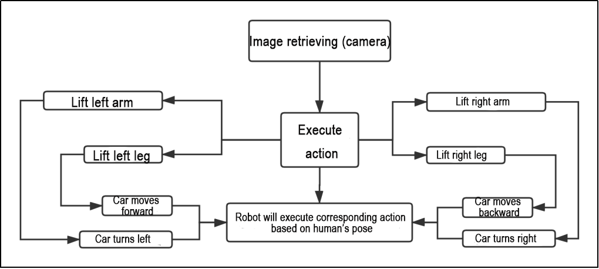
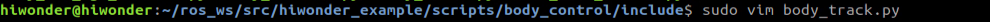
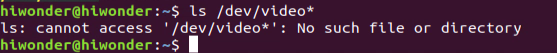
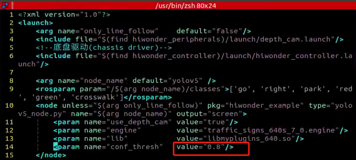
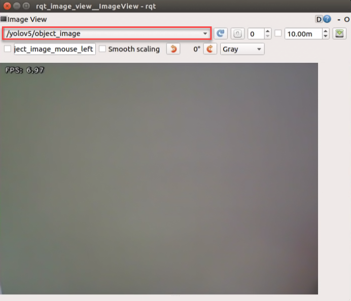

# 10 ROS1-ROS+Machine Learning Lesson

## 10.1 Machine Learning Fundamentals

### 10.1.1 Machine Learning Introduction

* **What “Machine Learning” is**

Machine Learning forms the cornerstone of artificial intelligence, serving as the fundamental approach to endow machines with intelligence. It spans multiple interdisciplinary fields such as probability theory, statistics, approximation theory, convex analysis, and algorithm complexity theory.


In essence, machine learning explores how computers can acquire new knowledge or skills by mimicking human learning behaviors and continuously enhancing their performance by reorganizing existing knowledge structures. Practically, it entails utilizing data to train models and leveraging these models for predictions.

For instance, consider AlphaGo, the pioneering artificial intelligence system that triumphed over human professional Go players and even world champions. AlphaGo operates on the principles of deep learning, wherein it discerns the intrinsic laws and representation layers within sample data to extract meaningful insights.

* **Types of Machine Learning**

Machine learning can be broadly categorized into two types: supervised learning and unsupervised learning. The key distinction between these two types lies in whether the machine learning algorithm has prior knowledge of the classification and structure of the dataset.

**1. Supervised Learning**

Supervised learning involves providing a labeled dataset to the algorithm, where the correct answers are known. The machine learning algorithm uses this dataset to learn how to compute the correct answers. It is the most commonly used type of machine learning.

For instance, in image recognition, a large dataset of dog pictures can be provided, with each picture labeled as "dog". This labeled dataset serves as the "correct answer". By learning from this dataset, the machine can develop the ability to recognize dogs in new images.


Model Selection: In supervised learning, selecting the right model to represent the data relationship is crucial. Common supervised learning models encompass linear regression, logistic regression, decision trees, support vector machines (SVM), and deep neural networks. The choice of model hinges on the data's characteristics and the problem's nature.

Feature Engineering: Feature engineering involves preprocessing and transforming raw data to extract valuable features. This encompasses tasks like data cleaning, handling missing values, normalization or standardization, feature selection, and feature transformation. Effective feature engineering can significantly enhance model performance and generalization capabilities.

Training and Optimization: Leveraging labeled training data, we can train the model to capture the data relationship. Training typically involves defining a loss function, selecting an appropriate optimization algorithm, and iteratively adjusting model parameters to minimize the loss function. Common optimization algorithms include gradient descent and stochastic gradient descent.

Model Evaluation: Upon completing training, evaluating the model's performance on new data is essential. Standard evaluation metrics include accuracy, precision, recall, F1 score, and ROC curve. Assessing a model's performance enables us to gauge its suitability for practical applications.

In summary, supervised learning entails utilizing labeled training data to train a model for predicting or classifying new unlabeled data. Key steps encompass selecting an appropriate model, conducting feature engineering, training and optimizing the model, and evaluating its performance. Together, these components constitute the foundational elements of supervised learning.

**2. Unsupervised Learning**

Unsupervised learning involves providing an unlabeled dataset to the algorithm, where the correct answers are unknown. In this type of machine learning, the machine must mine potential structural relationships within the dataset.

For instance, in image classification, a large dataset of cat and dog pictures can be provided without any labels. Through unsupervised learning, the machine can learn to divide the pictures into two categories: cat pictures and dog pictures.


### 10.1.2 Machine Learning Library Introduction

* **Common Type of Machine Learning Framework**

There are a large variety of machine learning frameworks. Among them, PyTorch, Tensorflow, MXNet and paddlepaddle are common.

**1. PyTorch**

PyTorch is a powerful open-source machine learning framework, originally based on the BSD License Torch framework. It supports advanced multidimensional array operations and is widely used in the field of machine learning. PyTorch, built on top of Torch, offers even greater flexibility and functionality. One of its most distinguishing features is its support for dynamic computational graphs and its Python interface.

In contrast to TensorFlow's static computation graph, PyTorch's computation graph is dynamic. This allows for real-time modifications to the graph as computational needs change. Additionally, PyTorch enables developers to accelerate tensor calculations using GPUs, create dynamic computational graphs, and automatically calculate gradients. This makes PyTorch an ideal choice for machine learning tasks that require flexibility, speed, and powerful computing capabilities.

* **Tensorflow**

TensorFlow is a powerful open-source machine learning framework that allows users to quickly construct neural networks and train, evaluate, and save them. It provides an easy and efficient way to implement machine learning and deep learning concepts. TensorFlow combines computational algebra with optimization techniques to make the calculation of many mathematical expressions easier.

One of TensorFlow's key strengths is its ability to run on machines of varying sizes and types, including supercomputers, embedded systems, and everything in between. TensorFlow can also utilize both CPU and GPU computing resources, making it an extremely versatile platform. When it comes to industrial deployment, TensorFlow is often the most suitable machine learning framework due to its robustness and reliability. In other words, TensorFlow is an excellent choice for deploying machine learning applications in a production environment.

**1. PaddlePaddle**

PaddlePaddle is a cutting-edge deep learning framework developed by Baidu, which integrates years of research and practical experience in deep learning. PaddlePaddle offers a comprehensive set of features, including training and inference frameworks, model libraries, end-to-end development kits, and a variety of useful tool components. It is the first open-source, industry-level deep learning platform to be developed in China, offering rich and powerful features to developers worldwide.

Deep learning has proven to be a powerful tool in many machine learning applications in recent years. From image recognition and speech recognition to natural language processing, robotics, online advertising, automatic medical diagnosis, and finance, deep learning has revolutionized the way we approach these fields. With PaddlePaddle, developers can harness the power of deep learning to create innovative and cutting-edge applications that meet the needs of users and businesses alike.

**2. MXNet**

MXNet is a top-tier deep learning framework that supports multiple programming languages, including Python, C++, Scala, R, and more. It features a dataflow graph similar to other leading frameworks like TensorFlow and Theano, as well as advanced features such as robust multi-GPU support and high-level model building blocks comparable to Lasagne and Blocks. MXNet can run on virtually any hardware, including mobile phones, making it a versatile choice for developers.

MXNet is specifically designed for efficiency and flexibility, with accelerated libraries that enable developers to leverage the full power of GPUs and cloud computing. It also supports distributed computing across dynamic cloud architectures via distributed parameter servers, achieving near-linear scaling with multiple GPUs/CPUs. Whether you're working on a small-scale project or a large-scale deep learning application, MXNet provides the tools and support you need to succeed.

## 10.2 Machine Learning Application

### 10.2.1 GPU Acceleration

* **GPU Accelerated Computing**

A graphics processing unit (GPU) is a specialized micro processor used to process image in personal computers, workstations, game consoles and mobile devices (phone and tablet). Similar to CPU, but CPU is designed to implement complex mathematical and geometric calculations which are essential for graphics rendering.

GPU-accelerated computing is the employment of a graphics processing unit (GPU) along with a computer processing unit (CPU) in order to accelerate science, analytics, engineering, consumer and cooperation applications. Moreover, GPU can facilitate the applications on various platforms, including vehicles, phones, tablets, drones and robots.

* **Comparison between GPU and CPU**

The main difference between CPU and GPU is how they handle the tasks. CPU consists of several cores optimized for sequential processing. While GPU owns a large parallel computing architecture composed of thousands of smaller and more effective cores tailored for multitasking simultaneously.

GPU stands out for thousands of cores and large amount of high-speed memory, and is initially intended for processing game and computer image. It is adept at parallel computing which is ideal for image processing, because the pixels are relatively independent. And the GPU provides a large number of cores to perform parallel processing on multiple pixels at the same time, but it only improves throughput without alleviating the delay. For example, when receives one message, it will use only one core to tackle this message although it has thousands of cores. GPU cores are usually employed to complete operations related to image processing, which is not universal as CPU.

* **Advantage of GPU**

GPU is excellent in massive parallel operations, hence it has an important role in deep learning. Deep learning relies on neural network that is utilized to analyze massive data at high speed.

For example, if you want to let this network recognize the cat, you need to show it lots of the pictures of cats. And that is the forte of GPU. Besides, GPU consumes less resources than CPU.

### 10.2.2 TensorRT Acceleration

* **TensorRT Introduction**

 TensorRT is a high-performance deep learning inference, includes a deep learning inference optimizer and runtime that delivers low latency and high throughput for inference applications. It is deployed to hyperscale data centers, embedded platforms, or automotive product platforms to accelerate the inference.

TensoRT supports almost all deep learning frameworks, such as TensorFlow, Caffe, Mxnet and Pytorch. Combing with new NVIDIA GPU, TensorRT can realize swift and effective deployment and inference on almost all frameworks.

To accelerate deployment inference, multiple methods to optimize the models are proposed, such as model compression, pruning, quantization and knowledge distillation. And we can use the above methods to optimize the models during training, however TensorRT optimize the trained models. It improves the model efficiency through optimizing the network computation graph.

After the network is trained, you can directly put the model training file into tensorRT without relying on deep learning framework.

* **Optimization Methods**


TensorRT has the following optimization strategies:

1)  Precision Calibration

2)  Layer & Tensor Fusion

3)  Kernel Auto-Tuning

4)  Dynamic Tenser Memory

5)  Multi-Stream Execution

**1. Precision Calibration**

In the training phase of neural networks across most deep learning frameworks, network tensors commonly employ 32-bit floating-point precision (FP32). Following training, since backward propagation is unnecessary during deployment inference, there is an opportunity to judiciously decrease data precision, for instance, by transitioning to FP16 or INT8. This reduction in data precision has the potential to diminish memory usage and latency, leading to a more compact model size.

The table below provides an overview of the dynamic range for different precision:

| **Precision** |   **Dynamic Range**   |
| :-----------: | :-------------------: |
|     FP32      | −3.4×1038 ~ +3.4×1038 |
|     FP16      |   −65504 ~- +65504    |
|     INT8      |      −128 ~ +127      |

INT8 is limited to 256 distinct numerical values. When INT8 is employed to represent values with FP32 precision, information loss is certain, resulting in a decline in performance. Nevertheless, TensorRT provides a fully automated calibration process to optimally align performance by converting FP32 precision data to INT8 precision, thereby minimizing performance loss.

**2. Layer & Tensor Fusion**

While CUDA cores efficiently compute tensor operations, a significant amount of time is still spent on the initialization of CUDA cores and read/write operations for each layer's input/output tensors. This results in GPU resource wastage and creates a bottleneck in memory bandwidth.

TensorRT optimizes the model structure by horizontally or vertically merging layers, reducing the number of layers and consequently decreasing the required CUDA core count, achieving structural optimization.

Horizontal merging combines convolution, bias, and activation layers into a unified CBR structure, utilizing only one CUDA core. Vertical merging consolidates layers with identical structures but different weights into a broader layer, also using only one CUDA core.

Moreover, in cases of multi-branch merging, TensorRT can eliminate concat layers by directing layer outputs to the correct memory address without copying, thereby reducing memory access frequency.

**3. Kernel Auto-Tuning**

During the inference calculation process, the neural network model utilizes the GPU's CUDA cores for computation. TensorRT can adjust the CUDA cores based on different algorithms, network models, and GPU platforms, ensuring that the current model can perform computational operations with optimal performance on specific platforms.

**4. Dynamic Tenser Memory**

During the utilization of each Tensor, TensorRT allocates dedicated GPU memory to prevent redundant memory requests, thereby reducing memory consumption and enhancing the efficiency of memory reuse.

**5. Multi-Stream Execution**

By leveraging CUDA Streams, parallel computation is achieved for multiple branches of the same input, maximizing the potential for parallel operations.

### 10.2.3 Yolov5 Model

* **Yolo Model Series Introduction**

**1. YOLO Series**

YOLO (You Only Look Once) is an one-stage regression algorithm based on deep learning.

R-CNN series algorithm dominates target detection domain before YOLOv1 is released. It has higher detection accuracy, but cannot achieve real-time detection due to its limited detection speed engendered by its two-stage network structure.

To tackle this problem, YOLO is released. Its core idea is to redefine target detection as a regression problem, use the entire image as network input, and directly return position and category of Bounding Box at output layer. Compared with traditional methods for target detection, it distinguishes itself in high detection speed and high average accuracy.

**2. YOLOv5**

YOLOv5 is an optimized version based on previous YOLO models, whose detection speed and accuracy is greatly improved.

In general, a target detection algorithm is divided into 4 modules, namely input end, reference network, Neck network and Head output end. The following analysis of improvements in YOLOv5 rests on these four modules.

1)  Input end: YOLOv5 employs Mosaic data enhancement method to increase model training speed and network accuracy at the stage of model training. Meanwhile, adaptive anchor box calculation and adaptive image scaling methods are proposed.

2)  Reference network: Focus structure and CPS structure are introduced in YOLOv5.

3)  Neck network: same as YOLOv4, Neck network of YOLOv5 adopts FPN+PAN structure, but they differ in implementation details.

4)  Head output layer: YOLOv5 inherits anchor box mechanism of output layer from YOLOv4. The main improvement is that loss function GIOU_Loss, and DIOU_nms for prediction box screening are adopted.

* **YOLOv5 Model Structure**

**1. Component**

1) Convolution layer: extract features of the image

Convolution refers to the effect of a phenomenon, action or process that occurs repeatedly over time, impacting the current state of things. Convolution can be divided into two components: "volume" and "**accumulation**". "**Volume**" involves data flipping, while "accumulation" refers to the accumulation of the influence of past data on current data. Flipping the data helps to establish the relationships between data points, providing a reference for calculating the influence of past data on the current data.

In YOLOv5, the data being processed is typically an image, which is two-dimensional in computer vision. Therefore, the convolution applied is also a two-dimensional convolution, with the aim of extracting features from the image. The convolution kernel is an unit area used for each calculation, typically in pixels. The kernel slides over the image, with the size of the kernel being manually set.

During convolution, the periphery of the image may remain unchanged or be expanded as needed, and the convolution result is then placed back into the corresponding position in the image. For instance, if an image has a resolution of 6×6, it may be first expanded to a 7×7 image, and then substituted into the convolution kernel for calculation. The resulting data is then refilled into a blank image with a resolution of 6×6.


2. Pooling layer: enlarge the features of image

   The pooling layer is an essential part of a convolutional neural network and is commonly used for downsampling image features. It is typically used in combination with the convolutional layer. The purpose of the pooling layer is to reduce the spatial dimension of the feature map and extract the most important features.

   There are different types of pooling techniques available, including global pooling, average pooling, maximum pooling, and more. Each technique has its unique effect on the features extracted from the image.


Maximum pooling can extract the most distinctive features from an image, while discarding the remaining ones. For example, if we take an image with a resolution of 6×6 pixels, we can use a 2×2 filter to downsample the image and obtain a new image with reduced dimensions.


3. Upsampling layer: restore the size of an image

   This process is sometimes referred to as "**anti-pooling**". While upsampling restores the size of the image, it does not fully recover the features that were lost during pooling. Instead, it tries to interpolate the missing information based on the available information.

   For example, let's consider an image with a resolution of 6×6 pixels. Before upsampling, use 3X3 filter to calculate the original image so as to get the new image.


4. Batch normalization layer: organize data

   It aims to reduce the computational complexity of the model and to ensure that the data is better mapped to the activation function.

   Batch normalization works by standardizing the data within each mini-batch, which reduces the loss of information during the calculation process. By retaining more features in each calculation, batch normalization can improve the sensitivity of the model to the data.

   

5. RELU layer: activate function

   The activation function is a crucial component in the process of building a neural network, as it helps to increase the nonlinearity of the model. Without an activation function, each layer of the network would be equivalent to a matrix multiplication, and the output of each layer would be a linear function of the input from the layer above. This would result in a neural network that is unable to learn complex relationships between the input and output.

   There are many different types of activation functions. Some of the most common activation functions include the ReLU, Tanh, and Sigmoid. For example, ReLU is a piecewise function that replaces all values less than zero with zero, while leaving positive values unchanged.


6)  ADD layer: add tensor

In a typical neural network, the features can be divided into two categories: salient features and inconspicuous features.


7. Concat layer: splice tensor

   It is used to splice together tensors of features, allowing for the combination of features that have been extracted in different ways. This can help to increase the richness and complexity of the feature set.


**2. Compound Element**

When building a model, using only the layers mentioned above to construct functions can lead to lengthy, disorganized, and poorly structured code. By assembling basic elements into various units and calling them accordingly, the efficiency of writing the model can be effectively improved.

1. Convolutional unit:

   A convolutional unit consists of a convolutional layer, a batch normalization layer, and an activation function. The convolution is performed first, followed by batch normalization, and finally activated using an activation function.

   

2. Focus module

   The Focus module for interleaved sampling and concatenation first divides the input image into multiple large regions and then concatenates the small images at the same position within each region to break down the input image into several smaller images. Finally, the images are preliminarily sampled using convolutional units.

   As shown in the figure below, taking an image with a resolution of 6×6 as an example, if we set a large region as 2×2, then the image can be divided into 9 large regions, each containing 4 small images.

   By concatenating the small images at position 1 in each large region, a 3×3 image can be obtained. The small images at other positions are similarly concatenated, and the original 6×6 image will be broken down into four 3×3 images.


3. Residual unit

   The function of the residual unit is to enable the model to learn small changes in the image. Its structure is relatively simple and is achieved by combining data from two paths.

   The first path uses two convolutional units to sample the image, while the second path does not use convolutional units for sampling but directly uses the original image. Finally, the data from the first path is added to the second path.


4. Composite Convolution Unit

   In YOLOv5, the composite convolution unit is characterized by the ability to customize the convolution unit according to requirements. The composite convolution unit is also realized by superimposing data obtained from two paths.

   The first path only has one convolutional layer for sampling, while the second path has 2x+1 convolutional units and one convolutional layer for sampling. After sampling and splicing, the data is organized through batch normalization and then activated by an activation function. Finally, a convolutional layer is used for sampling.'


5. Compound Residual Convolutional Unit

   The compound residual convolutional unit replaces the 2x convolutional layers in the compound convolutional unit with x residual units. In YOLOv5, the feature of the compound residual unit is mainly that the residual units can be customized according to the needs.


6)  Composite Pooling Unit

The output data of the convolutional unit is fed into three max pooling layers and an additional copy is kept without processing. Then, the data from the four paths are concatenated and input into a convolutional unit. Using the composite pooling unit to process the data can significantly enhance the features of the original data.'


**3. Structure**

Composed of three parts, YOLOv5 can output three sizes of data. Data of each size is processed in different way. The below picture is the output structure of YOLOv5.


Below is the output structures of data of three sizes.


### 10.2.4 YOLOv5 Running Procedure 

In this section, we provide an explanation of the model workflow using the anchor boxes, prediction boxes, and prior boxes employed in YOLOv5.

* **Prior Bounding Box**

When an image is input into model, object detection area requires us to offer, while prior bounding box is that box used to mark the object detection area on image before detection.


* **Prediction Box**

The prediction box is not required to set manually, which is the output result of the model. When the first batch of training data is input into model, the prediction box will be automatically generated with it. The position in which the object of same type appear more frequently are set as the center of the prediction box.


* **Anchor Box**

After the prediction box is generated, deviation may occur in its size and position. At this time, the anchor box serves to calibrate the size and position of the prediction box.

The generation position of anchor box is determined by prediction box. In order to influence the position of the next generation of the prediction box, the anchor box is generated at the relative center of the existing prediction box.


* **Realization Process**

After the data is calibrated, a prior bounding box appears on image. Then, the image data is input to the model, the model generates a prediction box based on the position of the prior bounding box. Having generated the prediction box, an anchor box will appear automatically. Lastly, the weights from this training are updated into model.

Each newly generated prediction will be influenced by the last generated anchor box. Repeating the operations above continuously, the deviation of the size and position of the prediction box will be gradually erased until it coincides with the priori box.


### 10.2.5 Image Collecting & Labeling

Given that training the Yolov5 model necessitates a substantial volume of data, our initial step involves collecting and labeling the requisite data in preparation for subsequent model training.

To begin, you can assemble the images that require collection. As an illustration, let's consider the collection of traffic signs.

* **Image Collecting**

1. Start the robot, and access the robot system desktop using NoMachine.

2. Click-on  to open the command-line terminal.

3. Execute the command ‘**sudo** **systemctl stop start_app_node.service**’ and hit enter to terminate the app auto-start service. The password in this step is ‘**hiwonder**’.

   ```py
   sudo systemctl stop start_app_node.service
   ```

4. Run the command ‘**roslaunch hiwonder_peripherals depth_cam.launch**’ to initiate the depth camera service.

   ```py
   roslaunch hiwonder_peripherals depth_cam.launch
   ```

5. Execute the command ‘**cd software/collect_picture && python3 main.py**’ to open the image collecting tool.

   ```py
   cd software/collect_picture && python3 main.py
   ```


The "**save number**" displayed in the upper left corner represents the image ID, indicating the order in which images are saved. The term "**existing**" denotes the total number of images already saved.

6)  Change the storage path to ‘**/home/hiwonder/my_data**’.


7)  Position the target recognition content within the camera's field of view, then either click the "**Save**" button or press the space bar to capture the current image from the camera.


Click-on ‘**Save(space)**’ or press space bar, then JPEGImages folder will be generated to save pictures.

> [!NOTE]
>
> **Note: To enhance model reliability, capture target recognition content from various distances, rotation angles, and tilt angles.**

8. Once you have finished collecting the images, click-on ‘**Exit**’ button to close the software.

   

9. Click-on  on the status bar to open the file manager to view the saved pictures.


### 10.2.6 Image Labeling

Labeling images is crucial for feature datasets as it enables the trained model to understand the categories of significant elements within the image. This understanding empowers the model to recognize these categories in new, previously unseen images.

> [!NOTE]
>
> **Note: the input command should be case sensitive, and keywords can be complemented using Tab key.**

1. Open the command-line terminal, and execute the command ‘**python3 ./software/labelImg/labelImg.py**’ to open the image labeling software.

   The table below outlines the function of each icon:

|                           **Icon**                           | **Shortcut Key** |                       **Function**                        |
| :----------------------------------------------------------: | :--------------: | :-------------------------------------------------------: |
|  |      Ctrl+U      |     Select the directory where the picture is saved.      |
|  |      Ctrl+R      | Select the directory where the calibration data is saved. |
|  |        W         |                   Create annotation box                   |
|  |      Ctrl+S      |                      Save annotation                      |
|  |        A         |               Switch to the previous image                |
|  |        D         |                 Switch to the next image                  |

2)  Press ‘**Ctrl+U**’ and select the folder ‘**/home/hiwonder/my_data/JPEGImages/**’ , then click-on ‘Open’ button.


3)  Press ‘**Ctrl+R**’ to select the directory where the calibration data is saved as ‘**/home/hiwonder/my_data/Annotations/**’. Then click-on ‘Open’ button.


4)  Press the "**W**" key on the keyboard to initiate the creation of the label box. Position the mouse cursor appropriately, then press and hold the left mouse button while dragging it to encompass the entire target recognition content within the label box. Release the left mouse button to finalize the selection of the target recognition content.


5)  In the pop-up window, assign a category name to the target recognition content; for instance, "**right**." Once you've named it, either click the "**OK**" button or press the "**Enter**" key to save this category.


6)  Press the shortcut '**Ctrl+S**' to save the labeling data for the current picture.

7)  Click-on  to open the file manager, then navigate to the folder ‘**/home/hiwonder/my_data/Annotations/**’ where the labeled picture files are saved.


### 10.2.7 Data Format Conversion

* **Preparation**

Before proceeding with this section, ensure that image collection and annotation have been completed. For detailed operational steps, please refer to the documents located in the "**[10.2.5 Image Collecting and Labeling]()**" directory.

Prior to feeding the data into the YOLOv5 model for training, it is essential to assign categories to the images and convert the annotated data into the required format.

* **Format Conversion**

Please operate the below steps after collecting and labeling the pictures.

> [!NOTE]
>
> **Note: the input command should be case sensitive, and keywords can be complemented using Tab key.**

1. Open a new terminal, and execute the command ‘**vim ~/my_data/classes.names**’ to create a folder named ‘**classes.names**’.

   ```py
   vim ~/my_data/classes.names
   ```

2)  Press the "i" key on the keyboard to enter editing mode and input the class name corresponding to the target recognition content. If multiple class names need to be added, each class name should be entered on a separate line. (Ensure that the class name matches the one used during picture collection.)


> [!NOTE]
>
> **Note: The class name added here must match the one used in 'labelImg'.**

3)  Having finished the input, press ‘Esc’ key, and type ‘:wq’ to save and close the file.


4. Execute the command ‘**python3 ~/software/xml2yolo.py --data ~/my_data --yaml ~/my_data/data.yaml**’ to convert the data format.

   > [!NOTE]
   >
   > **Note: the path must be determined according to the actual location of the file.**


In the command above, three parameters are involved:

1. **xml2yolo.py:** This script converts the calibrated label format into a format compatible with YOLOv5 model conversion. Ensure the path corresponds correctly.

2. **my_data:** This parameter specifies the folder you have labeled. Ensure the path corresponds correctly.

3. **data.yaml：**This file represents the format conversion of the entire folder after the model segmentation. As indicated in the command, the saved directory is within the my_data folder.

4. The image below illustrates the generated data.yaml file.

   

   The points after the names represent the label type. 'nc' denotes the number of label types, 'train' signifies the training set (used for data training in deep learning), and the subsequent parameters denote the paths. 'val' represents the validation set, which is used to verify results during the data training process. Ensure that paths are filled in or replaced according to the actual locations.

   In subsequent training processes, if you need to enhance training speed by moving the dataset from the vehicle to a local PC or cloud server, ensure to replace the paths corresponding to the current 'train' and 'val' datasets.

   Finally, an XML file will be generated under the "**/my_data**" folder to locate the segmented dataset. You can also change the saved path by modifying the last parameter in the 4) command "**/my_data/data.yaml**". Remember the path of this file as it will be used for model training later.

### 10.2.8 Model Training

> [!NOTE]
>
> **Note: the input command should be case sensitive, and the keywords can be complemented using Tab key.**

* **Preparation**

After converting the model format, the next step is to proceed with model training. However, before training, ensure that the dataset has been prepared and converted into the required format. For detailed instructions, please refer to "**[10.2.7 Data Format Conversion]()**".

* **Model Training**

1. Start the robot, and access the robot system desktop using NoMachine.

2. Click-on  to open the command-line terminal.

3. Execute the command ‘**cd third_party/yolov5/**’ and hit Enter key to navigate to the designated directory.

   ```py
   cd third_party/yolov5
   ```

4. Run the command ‘**python3 train.py --img 640 --batch 8 --epochs 5 --data ~/my_data/data.yaml --weights yolov5n.pt**’ to train model.

   ```py
   python3 train.py --img 640 --batch 8 --epochs 5 --data ~/my_data/data.yaml --weights yolov5n.pt
   ```

In the command, "**--img**" specifies the image size; "**--batch**" determines the number of single input images per batch; "**--epochs**" indicates the number of training iterations; "**--data**" denotes the path to the dataset; "**--weights**" represents the location of the initial training file.

Users can adjust these parameters according to their specific requirements. For instance, to enhance model reliability, one can increase the number of training iterations, though this will also extend the training duration.

5)  When the terminal prints the below content, type ‘**3**’ and hit Enter.


If the content shown in the picture below appears, it indicates that the training is in progress.


Upon completion of the model training, the path to the generated file will be displayed in the terminal and recorded. This path will be utilized in the subsequent course.


> [!NOTE]
>
> **Note: The path to the generated file may vary and can be located in the corresponding folder within runs/train.**

* **Import Training Result (Optional)**

After training the model using an external computer or server, you can import the trained model to the robot motherboard, such as Jetson Nano, and then proceed with model conversion.

**Instructions:**

1. To transfer the trained model file to the Jetson Nano motherboard, use the NoMachine software and simply drag the file using the left mouse button, as demonstrated in the figure below. The trained PyTorch (pt) model is highlighted within the red box, and you can use the left mouse button to drag it.

   Please note that the image below displays the remote desktop of our JetRover robot. The appearance of the remote desktop may vary for different types of robots, but this does not affect the file transfer process.

   

   After dragging the file into the interface, it will appear as shown below (the content within the red box indicates that the model has been successfully imported to the desktop).

   

   Next, you will need to copy the trained model (for instance, let's consider the best.pt model file) to the following path: "**/third_party/yolov5**".

2. Right-click and select ‘Open Terminal’.

   

3. Run the command ‘**mv ~/Desktop/best.pt ~/third_party/yolov5/**’.

   ```py
   mv ~/Desktop/best.pt ~/third_party/yolov5/
   ```

   The model has been successfully copied to the yolov5 folder. You can verify this by entering the command "**cd ~/third_party/yolov5 && ls**" in the picture below.

   ```py
   cd ~/third_party/yolov5 && ls
   ```

After completing the model transfer, you can proceed with model conversion and detection as outlined in the "**TensorRT Road Sign Detection**" document.

### 10.2.9 TensorRT Road Sign Detection

* **Preparation**

After extensive training, we obtain a new model. To enhance its performance, we need to convert this new model into a TensorRT-accelerated version.

* **Generate TensonRT Model Engine**

> [!NOTE]
>
> **Note: the input command should be case sensitive, and keywords can be complemented using Tab key.**

1. Start the robot, and access the robot system desktop using NoMachine.

2. Click-on  to open the command-line terminal.

3. Execute the command ‘**cd third_party/yolov5/**’, and hit Enter to navigate to the designated directory.

   ```py
   cd third_party/yolov5/
   ```

4. Execute the command "**python3 gen_wts.py -t detect -w best.pt -o best.wts**" and press Enter to convert the .pt file to a .wts file. In this command, "best.pt" represents the trained model, as illustrated in the figure below. The trained model, named "best.pt", is located in the directory "**~/third_party/yolov5**". If you are using your own trained model, ensure to place it in the same directory and update the name accordingly in the command.

   ```py
   python3 gen_wts.py -t detect -w best.pt -o best.wts
   ```

> [!NOTE]
>
> **Note: If you are using the data file located in the directory "/home/third_party/my_data/" to train the model, there is no need to perform steps 6 through 9. You can proceed directly to step 10.**

5. Execute the command ‘**cd ~/third_party/tensorrtx/yolov5/**’ to navigate to the designated directory.

   ```py
   cd ~/third_party/tensorrtx/yolov5/
   ```

6. Run the command ‘**vim src/config.h**’ and hit Enter key to open the designated file.

   ```py
   vim src/config.h
   ```

7)  Locate the code shown in the figure below. This parameter represents the number of categories for target recognition content. Adjust the value according to your specific requirements, but it is recommended to keep the default value of 80.


8. After modification, press ‘**Esc**’ key and type “**:wq**”, then hit Enter key to save and close the file.

   

9. Execute the command ‘**cd ~/third_party/tensorrtx/yolov5/ && mkdir build && cd build**’ to navigate to the build directory.

   ```py
   cd ~/third_party/tensorrtx/yolov5/ && mkdir build && cd build
   ```

10) Run the command ‘**cmake ..**’, and hit Enter to compile the build folder.


11) Enter the command ‘**make**’ to compile the configuration file.


12. Run the command ‘**cp /home/hiwonder/third_party/yolov5/yolov5n.pt ./**’ to copy the generated best.wts file to the current directory.

    ```py
    cp /home/hiwonder/third_party/yolov5/yolov5n.pt ./
    ```

13. Execute the command ‘**sudo ./yolov5_det -s best.wts best.engine n**’, and hit Enter to generate TensonRT model engine file.

    ```py
    sudo ./yolov5_det -s best.wts best.engine n
    ```

As you are currently in the directory where the .wts file is located, simply provide the .wts file name here. "**yolov5n.engin**e" is the name of the engine file.

If the prompt "**Build engine successfully!**" appears, the engine file has been generated successfully.


Additionally, in the same path, the "libmyplugins.so" file will be generated for subsequent detection. Simply remember this section. When you need to utilize the libmyplugins.so file located in the current path, specify the corresponding path. That's all.

14) The generated best.engine file may have "locked" or unreadable permissions, as depicted in the figure below:


To resolve this, open the terminal in the current directory and execute the following command: 

```py
sudo chmod 777 best.engine
```

* **Target Detection**

**1. Instructions**

1. Copy the TensonRT model engine file to the specified folder by entering the command '**cp yolov5n.engine libmyplugins.so ~/ros_ws/src/hiwonder_example/scripts/yolov5_detect/**', and then press Enter.

   ```py
   cp yolov5n.engine libmyplugins.so ~/ros_ws/src/hiwonder_example/scripts/yolov5_detect/
   ```

2. Execute the command ‘**sudo** **systemctl stop start_app_node.service**’ and hit Enter to terminate the app service.

   ```python
   sudo systemctl stop start_app_node.service
   ```

3. Click-on  to enter file manager, then locate the designated folder.

   

4. Right click the file ‘**yolo5v_trt.py**’, and select ‘**Open With Text Editor**’.


5)  In the list of the first red box, replace the original content with the name of the object that needs to be identified. Then, in the first parameter position of the second red box, input the name of the trained model, and in the second red box, input the name of the trained model again. Make sure to replace each parameter position with the file name 'libmyplugins.so' and rename it to '**libmyplugins_640.so**'. Users should input the appropriate file name according to their own needs.


6. Click-on ‘Save’ button.

   

7. Run the command ‘**python3 yolov5_trt.py**’, and hit Enter to initiate target detection.

   ```py
   python3 yolov5_trt.py
   ```

**2. Detection Result**

Position the road sign within the camera's field of view. Upon recognition, the road sign will be outlined with a box in the displayed image, accompanied by its category name and the confidence level of detection and recognition. Furthermore, relevant detection information will be printed on the terminal interface.


`class_name` refers to the category name of the recognized target; `box` denotes the starting coordinates (upper left corner) and ending coordinates (lower right corner) of the identification box; `score` indicates the confidence level of detection and recognition.

### 10.2.10 Traffic Sign Model Training

**Please use the actual product names and reference paths as they appear in the document.**

For large datasets, it is not recommended to use Jetson Nano for training due to its slower training speed caused by I/O port speed and memory limitations. It is advisable to use a computer equipped with a dedicated graphics card for faster training. The training process remains the same, and you only need to configure the relevant program running environment.

If the performance of traffic sign recognition in the driverless gameplay is poor and you need to train your own model, you can refer to this section for training the traffic sign model.

The screenshots in the following instructions may display different robot host names (though the environment configurations of different robots are roughly the same). Please input them according to the document content; however, it will not affect the execution.

* **Preparation**

1)  Prepare a laptop, or a PC with wireless network card and mouse.

2)  Access the robot system desktop using NoMachine.

* **Training Instructions**

**1. Create Data Set Folder**

Create a new folder in any directory (e.g., 'my_Data'). Remember the name you've created as it will be used in subsequent instructions. Avoid using special characters in the folder name. To ensure that the training process doesn't interfere with the normal use of other files, it's advisable to create this folder in the home directory.


**2. Image Collecting**

1. Start the robot, and access the robot system desktop using NoMachine.

2. Click-on  to open the command-line terminal.

3. Execute the command ‘**sudo** **systemctl stop start_app_node.service**’ to terminate the app service.

   ```py
   sudo systemctl stop start_app_node.service
   ```

4. Run the command ‘**roslaunch hiwonder_peripherals depth_cam.launch**’ to initiate the camera service.

   ```py
   roslaunch hiwonder_peripherals depth_cam.launch
   ```

5)  Open a new terminal window. Navigate to the directory where the collection tool is stored, then enter '**cd software/collect_picture && python3 main.py**' to launch the image collection tool.


'"**save number**" represents the picture ID, indicating which picture has been saved. "**existing**" denotes the total number of saved images.

6)  Change the storage path to ‘**/home/hiwonder/my_data**’.


7)  Position the target recognition content within the camera's field of view, then click the 'Save (space)' button or press the space bar to capture and save the current camera image. Upon saving, both the '**save number**' and '**existing**' counts will increment by 1. These two parameters allow for monitoring of the saved picture names displayed on the current camera screen and the total number of pictures stored in the folder.


Upon selecting the "Save (space)" option, a JPEGImages folder will automatically be created within the directory "**/home/hiwonder/my_data**" to store the images.

> [!NOTE]
>
> **Notice:**
>
> * **For enhanced model reliability, capture target recognition content from various distances, rotation angles, and tilt angles.**
>
> * **To guarantee recognition stability, it's advisable to increase the number of training images. It is recommended that each image category comprises at least 200 images for effective model training.**

8)  After image collecting, click-on ‘**Exit**’ to close this software.


9)  Click-on  to open the file manager, and navigate to the folder as pictured, then you can check the saved pictures.


**3. Image Labeling**

> [!NOTE]
>
> **Note: the input command should be case sensitive, and keywords can be complemented using Tab key.**

1. Start the robot, and access the robot system desktop using NoMachine.

2. Click-on  to open the command-line terminal.

3. Execute the command ‘**sudo** **systemctl stop start_app_node.service**’ to terminate the app service.

   ```py
   sudo systemctl stop start_app_node.service
   ```

4. Execute the command ‘**roslaunch hiwonder_peripherals depth_cam.launch**’ to enable the camera service.

   ```py
   roslaunch hiwonder_peripherals depth_cam.launch
   ```

5)  Create a new terminal, and execute the command ‘python3 software/labelImg/labelImg.py’.

6)  Upon launching the image annotation tool, the table below outlines the key functions

|                           **Icon**                           | **Shortcut Key** |                       **Function**                        |
| :----------------------------------------------------------: | :--------------: | :-------------------------------------------------------: |
|  |      Ctrl+U      |     Select the directory where the picture is saved.      |
|  |      Ctrl+R      | Select the directory where the calibration data is saved. |
|  |        W         |                   Create annotation box                   |
|  |      Ctrl+S      |                      Save annotation                      |
|  |        A         |               Switch to the previous image                |
|  |        D         |                 Switch to the next image                  |

7)  Press "**Ctrl+U**" to designate the image storage directory as "**/home/hiwonder/my_data/JPEGImages/**", then click the "**Open**" button.


8)  Press "**Ctrl+R**" to specify the calibration data storage directory as "**/home/hiwonder/my_data/Annotations/**". The "**Annotations**" folder is automatically created during image collection. Finally, click the "**Open**" button.


9)  Press the "**W**" key to initiate label box creation. Position the mouse cursor appropriately, then press and hold the left mouse button while dragging to encompass the entire target recognition content within the label box. Release the left mouse button to finalize the selection of the target recognition content.


10) In the pop-up window, assign a name to the category of the target recognition content, such as "**right**". Once the naming is complete, either click the "**OK**" button or press the "**Enter**" key to save this category.


11) Use short-cut ‘**Ctrl+S**’ to save the labeled data of the current pictures.

12) Label the remaining pictures in the same manner as step 9).

13) Click  in the system status bar to open the file manager. Navigate to the directory "**/home/hiwonder/my_data/Annotations/**" (where the image is saved in 9.2.2 Data Acquisition) to view the picture annotation file.

**4. Generate Related Files**

1. Click-on  to open the command-line terminal.

2. Execute the command ‘**vim ~/my_data/classes.names**’, and hit Enter key.

   ```py
   vim ~/my_data/classes.names
   ```

3)  Press the "i" key to enter the editing mode and input the class name of the target recognition content. If multiple class names are required, enter them one per line.


> [!NOTE]
>
> **Note: The class name entered here must match the naming convention used in the image annotation software "labelImg" when applicable.**

4)  Having finish input, press ‘**Esc**’ key, and input ‘**:wq**’ to save the change and close the file.


5. Execute the command to convert the data format by entering: **python3 software/xml2yolo.py --data ~/my_date --yaml ~/my_data/data.yaml**

   ```py
   python3 software/xml2yolo.py --data ~/my_date --yaml ~/my_data/data.yaml
   ```

The xml2yolo.py script converts annotated files into XML format, organizes the dataset into training and validation sets.

If you encounter the following prompt, the conversion is successful.


The output paths may vary on different robots based on their actual storage locations. However, the generated data.yaml file corresponds to the calibrated dataset.

**5. Model Training**

1. Click-on  to open the command-line terminal.

2. Execute the command ‘**cd third_party/yolov5**’, and hit Enter to navigate to the designated directory.

   ```py
   cd third_party/yolov5
   ```

3. Run the command ‘**python3 train.py --image 640 --bathch 8 --ephos 5 --data ~/my_data/data.yaml --weights yolov5n.pt**’, and hit Enter to train the model.

   ```py
   python3 train.py --image 640 --bathch 8 --ephos 5 --data ~/my_data/data.yaml --weights yolov5n.pt
   ```

In the command, `--img` specifies the image size, `--batch` determines the number of images processed in each iteration, and `--epochs` denotes the number of training iterations, which impacts the quality of the final model. For quick testing, we've set the number of training iterations to 8, but for optimal results, this value should be adjusted based on your specific requirements and the capabilities of your computer system.

Furthermore, `--data` indicates the path to the calibrated dataset, while `--weights` refers to the path of the pretrained model. It's crucial to remember whether you're using "**yolov5n.pt**" or "**yolov5s.pt**" as your pretrained model.

Users can customize these parameters according to their specific needs. If model reliability needs to be improved, consider increasing the number of training iterations, keeping in mind that this will also extend the training time.

4)  When the option displayed in the figure below appears, input "**3**" and press Enter.


If the content displayed in the image below appears, it indicates that the training is ongoing.


After the model has been trained successfully, the terminal will print the path containing the file, and you need to record the path which will be required for ‘**9.2.6 Generate TensorRt Model Engine**’.


> [!NOTE]
>
> Notice: If multiple trainings are conducted, the naming of the "**exp5**" folder mentioned here will vary. For instance, it might be changed to "**exp2**", "**exp3**", and so on. The following steps will be associated with the folder naming used in this step.

**6. Generate TensorRT Model Engine**

1. Click-on  to open the command-line terminal.

2. Execute the command ‘**cd third_party/yolov5**’, and hit Enter to navigate to the designated directory.

   ```py
   cd third_party/yolov5
   ```

3. Copy the "best.pt" file generated after model training to the current directory by executing the command: "**cp ~/third_party/yolov5/runs/train/exp5/weights/best.pt ./**" and then press Enter.

   ```py
   cp ~/third_party/yolov5/runs/train/exp5/weights/best.pt ./
   ```

In command, the path where the file **best.pt** is stored can be modified according to the actual situation.

4. Enter command “**python3 gen_wts.py -t detect -w best.pt -o best.wts**” and press Enter to convert the .py file into .wts file.

   ```py
   python3 gen_wts.py -t detect -w best.pt -o best.wts
   ```

If you want to use other models, you only need to replace “best.pt” in command with the name of new model file.

5. Execute the command ‘**cd ~/third_party/tensorrtx/yolov5**’ to navigate to the designated directory.

   ```py
   cd ~/third_party/tensorrtx/yolov5
   ```

6. Run the command ‘**vim src/config.h**’, and hit Enter to open the designated file.

   ```py
   vim src/config.h
   ```

7)  Locate the code as shown in the figure below. This parameter represents the number of categories of target recognition content. Simply modify the value according to your specific situation, which is highlighted by the red box in the figure. The "**kNumClass**" parameter signifies the total number of calibrated categories. The current data category, indicated as 1, must be adjusted based on the actual scenario. In this case, it should be changed to 6, representing the six categories of traffic signs. After selecting the number to be modified by clicking the left mouse button, press the "i" key on the keyboard to enter the editing mode.


The modification should be done as shown in the picture.


The parameters highlighted in the red box in the figure below determine the size of the input image. The default height and width are both set to 640 pixels, consistent with the images cropped using the image collection tool earlier. It's advisable to retain these default settings unless adjustments are necessary based on specific requirements.


8)  After modification, press ‘**Esc**’ key, type ‘**:wq**’ and hit Enter to save the change and exit.


9. Run the command ‘**cd ~/third_party/tensorrtx/yolov5/ && mkdir build && cd build**’ to navigate to the ‘build’ directory newly built.

   ```py
   cd ~/third_party/tensorrtx/yolov5/ && mkdir build && cd build
   ```

10) Execute the command ‘**cmake ..**’, and hit Enter to compile build folder.


11) Input the command ‘**make**’, and hit Enter key to compile the configuration file.


> [!NOTE]
>
> **Notice:**
>
> * **If an error occurs during compilation at this stage, you'll need to delete the entire build folder, create a new one, and then repeat steps 10 to 11.**
>
> * **The deleted build folder contains data related to the initial model training. It's advisable to save this data before deletion.**

12. Execute the command ‘**cp /home/hiwonder/third_party/yolov5/best.wts ./**’, and press Enter key to copy the generated **best.wts** file to the current directory.

    ```py
    cp /home/hiwonder/third_party/yolov5/best.wts ./
    ```

13. Run the command ‘**sudo ./yolov5 -s best.wts best.engine n**’, and hit Enter to generate TensorRT model engine file.

    ```py
    sudo ./yolov5 -s best.wts best.engine n
    ```

In the command, "**best.wts**" represents the path to the "**best.wts**" file. Since it's currently in the same directory as the .wts file, simply fill in the .wts file name here.

"**best.engine**" is the name of the engine file. You can define this parameter yourself, but it should also be noted by the user.

The last parameter 'n' signifies the YOLOv5 model used in the previous training (10.2.8 model training). If it's "**yolov5s.pt**", this command will change to 's'; if it's "**yolov5n.pt**", this command will change to 'n'.

Upon seeing the prompt "**Build engine successfully!**", it indicates that the engine file has been generated successfully.


* **Model Usage**

1. Type the command ‘**cd ~/third_party/tensorrtx/yolov5/build/**’ to navigate to the specific directory.

   ```py
   cd ~/third_party/tensorrtx/yolov5/build/
   ```

2. Enter the following command in the terminal: "**cp best.engine ~/ros_ws/src/hiwonder_example/scripts/yolov5_detect**" to copy the generated engine model file to the directory "**/home/hiwonder/ros_ws/src/hiwonder_example/scripts/yolov5_detect**".

   

   Similarly, enter the following command in the terminal: "**cp libmyplugins.so ~/ros_ws/src/hiwonder_example/scripts/yolov5_detect**". After copying the two files, the directory should resemble the image below:

   

3. Run the command ‘**cd ~/ros_ws/src/hiwonder_example/scripts/self_driving/**’ to navigate to the directory containing launch files. Take autonomous driving as example.

   ```py
   cd ~/ros_ws/src/hiwonder_example/scripts/self_driving/
   ```

4. Execute the command ‘**vim self_driving.launch**’ to open the launch file.

   ```py
   vim self_driving.launch
   ```

5. Change the revised content to new model file.

   

   Box No. 1 contains the category names, which should match the order in the "**classes.names**" file. Box No. 2 refers to the model file name, which must correspond to the names of the "**best.engine**" and "**libmyplugins.so**" files copied earlier. For our default robots, our company will provide the trained model file ready for installation. You just need to replace the model file name with the name of the trained model you have.

6. After completing the modifications, refer to the corresponding "**Autonomous Driving**" document to explore the game.

### 10.2.11 Waste Card Model Training

Please ensure that the product names and reference paths mentioned in the document accurately reflect the actual ones.

It's not advisable to utilize Jetson Nano for training when dealing with large datasets. Due to limitations in I/O port speed and memory, the training process may be slow. It's recommended to use a computer equipped with a dedicated graphics card for faster training. The training process remains the same; you only need to configure the relevant program running environment accordingly.

If the recognition performance of the garbage classification gameplay is unsatisfactory and you need to train your own model, you can refer to this section for guidance on physical model training.

* **Preparation**

1)  Prepare a laptop or a PC equipped with a wireless network card and a mouse.

2)  Install and open the remote connection tool ‘No Machine’.

* **Training Instructions**

**1. Create a New Data Set Folder**

Create a new folder in any directory (for instance, "**my_Data**"). Remember the name you've chosen as you'll use it in subsequent instructions. Avoid using special characters or Chinese fonts in the folder name. It's recommended to create it in the home directory to avoid interference with other files during the training process.


**2. Prepare Data Set**

 Photo materials can be sourced from the Internet. To reduce the performance demands for subsequent annotation and training, you can adjust the image resolution to 640\*480. The default resolution for images captured with the "**Capture**" tool is 640\*480.

For training purposes here, we utilize selfie picture materials. If you intend to use Internet pictures for training, please refer to "**Mask Image Training**".

1. Start the robot, and access the robot system desktop using NoMachine.

2. Click-on  to open the command-line terminal.

3. Execute the command ‘**sudo systemctl stop start_app_node.service**’ to disable app service.

   ```py
   sudo systemctl stop start_app_node.service
   ```

4. Run the command ‘**roslaunch hiwonder_peripherals depth_cam.launch**’ to enable the camera service.

   ```py
   roslaunch hiwonder_peripherals depth_cam.launch
   ```

5)  Open a new terminal. Navigate to the directory where the collection tool is stored and enter the command "**cd software/collect_picture && python3 main.py**" to launch the image collection tool.

6)  Change the storage path to "**/home/hiwonder/my_data**", which will be used later.


7)  Position the card that requires training within the camera's field of view, and click "**Save**" to capture the current image. Ensure that the number of images for each type is consistent. For instance, if you capture 50 images of the banana peel card, you should also capture 50 images of the toothbrush card.


Upon clicking the "**Save (space)**" button, a folder named JPEGImages will be automatically created to store the images in the directory "**/home/hiwonder/my_data**".

> [!NOTE]
>
> **Note:**
>
> * **For enhanced model reliability, it's important to capture the target recognition content from various distances, rotation angles, and tilt angles.**
>
> * **To ensure stable recognition, increase the number of images used for model training. It's recommended to have at least 200 pictures for each type during training.**

8)  After image collecting, click-on ‘**Exit**’ button to close this software.


9)  Click-on  to open the file manager, and navigate to this storage path  to check the stored pictures.

**3. Label Pictures**

> [!NOTE]
>
> **Note: the input command should be case sensitive, and keywords can be complemented using Tab key.**

1. Start the robot, and access the robot system using the remote control software ‘**NoMachine**’.

2. Click-on  to open the command-line terminal.

3. Execute the command ‘**sudo** **systemctl stop start_app_node.service**’ to disable the app service.

   ```py
   sudo systemctl stop start_app_node.service
   ```

4. Run the command ‘**roslaunch hiwonder_peripherals depth_cam.launch**’ to enable the camera service.

   ```py
   roslaunch hiwonder_peripherals depth_cam.launch
   ```

5. Create a new terminal, and execute the following command ‘**python3 software/labelImg/labelImg.py**’.

   Upon launching the image annotation tool, the table below outlines the key functions.

|                           **Icon**                           | **Shortcut Key** |                       **Function**                        |
| :----------------------------------------------------------: | :--------------: | :-------------------------------------------------------: |
|  |      Ctrl+U      |     Select the directory where the picture is saved.      |
|  |      Ctrl+R      | Select the directory where the calibration data is saved. |
|  |        W         |                   Create annotation box                   |
|  |      Ctrl+S      |                      Save annotation                      |
|  |        A         |               Switch to the previous image                |
|  |        D         |                 Switch to the next image                  |

Press "**Ctrl+U**" to select the image storage directory as "**/home/hiwonder/my_data/JPEGImages/**", then click the "**Open**" button.


6)  Begin by clicking "**Open Dir**" to access the folder where the pictures are stored. Next, select "**/home/hiwonder/My_Data/JPEGImage**", then click "**Open**" to proceed.


7)  Click-on ‘**Create RectBox**’ button to create a annotation box.


8)  Position the mouse cursor appropriately, then press and hold the left mouse button while dragging out a rectangular frame to select the training content in the photo. Let's use bananas as an example.


9)  After releasing the mouse, enter the category name of this card in the pop-up dialog box, then click "**OK**". For instance, you can enter "**apple**" for apples and "**potato**" for potatoes. (Items of the same type must have the same name)


10) After labeling a picture, click-on ‘**Save**’ button, then click-on ‘**Next Image**’ to proceed with the image labeling.


> [!NOTE]
>
> **Notice:**
>
> * While annotating, you can use shortcut keys to expedite the process. For instance, press "D" to switch to the next picture and press "**W**" to create a label box.
>
> * You can also use "**Ctrl+v**" to paste the annotation box from the previous picture here. However, note that this method is only applicable to annotations of the same type of image. This is because when pasting the annotation box, it also pastes the name information from the previous picture.

11. Once all materials are annotated, an XML format file with the same name as the image file will be generated in the "**Annotations**" folder. 

    > [!NOTE]
    >
    > (Note: A certain number of annotated images is required to ensure model reliability.)


12) Once the labeling is completed, you can close the labeling tool to proceed with the next step.

**4. Generate Related Files**

1. Click-on  to open the command-line terminal.

2. Execute the command ‘**vim ~/my_data/classes.names**’, and hit Enter.

   ```py
   vim ~/my_data/classes.names
   ```

3)  Press the "i" key to enter editing mode and include the class name for the target recognition content. When adding multiple class names, each class name should be on a separate line. If you need to enter multiple classes, press enter for a new line and then specify each class accordingly based on the different types.


> [!NOTE]
>
> **Note: The class name added here must match the naming convention used in the image annotation software "labelImg."**

4)  Having finished the input, press ‘Esc’ key and type ‘**:wq**’ to save the change and close the file.


5. Enter the command to convert the data format "**python3 software/xml2yolo.py --data ~/my_date --yaml ~/my_data/data.yaml**" and press Enter.

   ```py
   python3 software/xml2yolo.py --data ~/my_date --yaml ~/my_data/data.yaml
   ```

This output should reflect the actual storage location of the folder within the robot system. The output paths may vary between different robots, but the data.yaml file generated ultimately corresponds to the calibrated dataset.

**5. Start Training**

1. Click-on  to open the command-line terminal.

2. Run the command ‘**cd third_party/yolov5**’ to navigate to the specific directory.

   ```py
   cd third_party/yolov5
   ```

3. Enter the command ‘**python3 train.py --image 640 --bathch 8 --ephos 5 --data ~/my_data/data.yaml --weights yolov5n.pt**’ and press Enter to train the model.

   ```py
   python3 train.py --image 640 --bathch 8 --ephos 5 --data ~/my_data/data.yaml --weights yolov5n.pt
   ```

In the command, `--img` denotes the image size; `--batch` indicates the number of individual image inputs processed together; `--epochs` represents the number of training iterations, reflecting the frequency of machine learning cycles. This value should be determined based on the final desired model performance. For expedited testing purposes, the number of training iterations is initially set to 8. However, on more capable computer host systems, increasing this value can lead to improved training outcomes.

`--data` specifies the path to the dataset folder that has been calibrated. `--weights` denotes the path to the pre-trained model file, which serves as the starting point for your own training process. It's important to note whether you're using "yolov5n.pt" or "yolov5s.pt" as input parameters.

Users have the flexibility to adjust these parameters according to their specific requirements. To enhance the model's reliability, users may consider increasing the number of training iterations, although it's essential to be aware that this will also extend the training duration accordingly.

4)  When the terminal prints that Enter your choice, enter ‘3’, and hit Enter.


If the content displayed in the image below appears, it indicates that the training process is currently underway.


Once the model training is completed, the path of the generated file will be printed on the terminal and recorded. This path will be utilized in the subsequent step of "Generating TensorRT Model Engine.


> [!NOTE]
>
> **Note: If multiple trainings are conducted, the naming of the "exp5" folder mentioned here will vary. For instance, it might be adjusted to "exp2", "exp3", and so forth. The subsequent steps will depend on the folder naming used in this step.**

**6. Format Conversion**

1. Click-on  to open the command line terminal.

2. Execute the command ‘**cd third_party/yolov5**’, and hit Enter to navigate to the specific directory.

   ```py
   cd third_party/yolov5
   ```

3. Copy the "best.pt" file generated after model training to the current directory by entering the following command: "**cp ~/third_party/yolov5/runs/train/exp5/weights/best.pt ./**", then press Enter.

   ```py
   cp ~/third_party/yolov5/runs/train/exp5/weights/best.pt ./
   ```

Users can adjust the path of the "best.pt" file in the instructions based on their specific circumstances.

4. Run the command ‘**python3 gen_wts.py -t detect -w best.pt -o best.wts**’, and hit Enter to convert pt file into wts file.

   ```py
   python3 gen_wts.py -t detect -w best.pt -o best.wts
   ```

If you need to utilize other models, simply replace "**best.pt**" in the command with the name of the respective model file.

5. Execute the command ‘**cd ~/third_party/tensorrtx/yolov5**’ to navigate to the specific directory.

   ```py
   cd ~/third_party/tensorrtx/yolov5
   ```

6. Run the command ‘**vim src/config.h**’, and hit Enter key to open the designated file.

   ```py
   vim src/config.h
   ```

7)  Locate the code depicted in the figure below. This parameter represents the number of categories for target recognition content. Simply adjust the value according to your specific scenario, as indicated by the position highlighted in the red box in the figure below. The parameter "**kNumClass**" denotes the total number of calibrated data categories. In this instance, it is set to 1.


The parameters highlighted in the red box in the figure below denote the size of the input image. By default, its height and width are both set to 640 pixels, consistent with the image cropped using the image collection tool earlier. It is recommended to retain these default settings. However, adjustments can be made as necessary according to specific requirements.


8)  After modification, press ‘Esc’ key and type ‘**:wq**’, and hit Enter to save the change and close the file.


9. Run the command ‘**cd ~/third_party/tensorrtx/yolov5/ && mkdir build && cd build**’ to navigate to the **build** directory newly built.

   ```py
   cd ~/third_party/tensorrtx/yolov5/ && mkdir build && cd build
   ```

10) Run the command ‘**cmake ..**’, and hit Enter to compile the build folder.


11. Execute the command ‘**make**’, and hit Enter to compile the configuration file.

    ```py
    make
    ```

> [!NOTE]
>
> **Notice:**
>
> * **If encountering an error during the compilation of this step, it's necessary to delete the entire build folder. Afterward, create a new build folder and proceed with steps 10-11 once again.**
>
> * **The deleted build folder includes data associated with the initial model training. It's advisable to save this data before deleting the folder.**

12. Type the command "**cp /home/hiwonder/third_party/yolov5/best.wts ./**" and then press Enter to copy the generated "**best.wts**" file to this directory.

    ```py
    cp /home/hiwonder/third_party/yolov5/best.wts ./
    ```

13. Type the command "**sudo ./yolov5 -s best.wts best.engine n**" and then press Enter to generate the TensorRT model engine file.

    ```py
    sudo ./yolov5 -s best.wts best.engine n
    ```

In the command, "**best.wts**" represents the path to the location of the best.wts file. Since the file is currently in the same directory, you only need to specify the file name "**.wts**" here. "**best.engine**" is the designated name for the engine file. Users can define this parameter according to their preference, but it should be remembered for future reference. The final parameter 'n' signifies the YOLOv5 model utilized in the previous training (in this case, 10.2.8 model training). If the model is yolov5s.pt, this command would change to 's'; if it's yolov5n.pt, it would change to 'n'.

Upon successful generation of the engine file, the prompt "**Build engine successfully!**" will appear.


* **Model Usage**

1. Click-on  to navigate to the file manager located on the left side of the system. Follow the path to find "**home/third_party/tensorrtx/yolov5**" and enter the specified directory. Here, you'll find a file named "**yolov5_det_trt.py**". Double-click this file to open it.

   

   > [!NOTE]
   >
   > **Note: It is advisable to create a backup of the file before making any modifications. In case of any incorrect modifications, having a backup ensures that you can easily revert to the original version. Directly modifying the file without a backup may result in errors that could disrupt the normal operation of other routines.**

2. Scroll down the document to locate the section as depicted in the figure below. Ensure to check whether your build file has been compiled and created.

   

In the first red box, the model selected is the one with efficient training acceleration, typically located in "**~/tensorrtx/yolov5/build**". Users must adjust this according to their specific model naming conventions.

The second red box indicates the category names used in the training model. These names must match the annotations and the "**classes.names**" file to prevent errors during model recognition.

The third red box specifies the path to the image. Users can place their desired images under this path. The default is "**images/**", but it should be updated to the actual image path needed for testing. New images can be added to this directory by providing the correct path.

After making the modifications, the configuration should appear as shown below:


3. Click-on ‘**Save**’ button to save the change and close the file.

   

4. Type the command "**python3 yolov5_det_trt.py**" and then press Enter to initiate target detection. Once the detection process is finished, you will receive a prompt to find the detected images in the "**output**" folder located in the same directory. Navigate to the corresponding directory to view the images.

### 10.2.12 Physical Model Training

**This section provides a general overview. Please refer to the actual product names and reference paths mentioned in the document.**

Training large datasets on a Jetson Nano is not recommended due to its slow training speed caused by limitations in I/O port speed and memory. It is advised to utilize a computer equipped with a dedicated graphics card for faster training. The training process remains the same, and only the relevant program running environment needs to be configured.

If the recognition accuracy of the physical sorting gameplay is inadequate and you require training your own model, you can refer to this section for guidance on physical model training.

* **Preparation**

1)  Prepare a laptop, or a PC with wireless network card and mouse.

2)  Access the robot system desktop using NoMachine.

* **Training Instructions**

The training steps are akin to those followed for road sign model.

* **Create New Data Set Folder**

Create a new folder in any path, such as "**my_Data**". Remember the name you've chosen as it will be utilized in subsequent instructions. It's advisable to avoid special characters or Chinese fonts in the folder name. For the sake of maintaining the integrity of other files, this folder is created in the home directory.


* **Image Collecting**

1. Start the robot, and access the robot system desktop using NoMachine.

2. Click-on  to open the command-line terminal.

3. Execute the command ‘**sudo systemctl stop start_app_node.service**’ to terminate the app service.

   ```py
   sudo systemctl stop start_app_node.service
   ```

4. Run the command **roslaunch hiwonder_peripherals depth_cam.launch**’ to initiate the camera service.

   ```py
   roslaunch hiwonder_peripherals depth_cam.launch
   ```

5)  Open a new terminal window. Navigate to the directory where the collection tool is stored, then enter '**cd software/collect_picture && python3 main.py**' to launch the image collection tool.


'"**save number**" represents the picture ID, indicating which picture has been saved. "**existing**" denotes the total number of saved images.

6)  Change the storage path to ‘**/home/hiwonder/my_data**’.


7)  Position the target recognition content within the camera's field of view, then click the '**Save (space)**' button or press the space bar to capture and save the current camera image. Upon saving, both the '**save number**' and '**existing**' counts will increment by 1. These two parameters allow for monitoring of the saved picture names displayed on the current camera screen and the total number of pictures stored in the folder.


Upon selecting the "Save (space)" option, a JPEGImages folder will automatically be created within the directory "**/home/hiwonder/my_data**" to store the images.

> [!NOTE]
>
> **Notice:**
>
> * **For enhanced model reliability, capture target recognition content from various distances, rotation angles, and tilt angles.**
>
> * **To guarantee recognition stability, it's advisable to increase the number of training images. It is recommended that each image category comprises at least 200 images for effective model training.**

8)  After image collecting, click-on ‘Exit’ to close this software.


9)  Click-on  to open the file manager, and navigate to the folder as pictured, then you can check the saved pictures.

**1. Image Labeling**

> [!NOTE]
>
> **Note: the input command should be case sensitive, and keywords can be complemented using Tab key.**

1. Start the robot, and access the robot system desktop using NoMachine.

2. Click-on  to open the command-line terminal.

3. Execute the command ‘**sudo** **systemctl stop start_app_node.service**’ to terminate the app service.

   ```py
   sudo systemctl stop start_app_node.service
   ```

4. Execute the command ‘**roslaunch hiwonder_peripherals depth_cam.launch**’ to enable the camera service.

   ```py
   roslaunch hiwonder_peripherals depth_cam.launch
   ```

5)  Create a new terminal, and execute the command ‘**python3 software/labelImg/labelImg.py**’.

6)  Upon launching the image annotation tool, the table below outlines the key functions

|                           **Icon**                           | **Shortcut Key** |                       **Function**                        |
| :----------------------------------------------------------: | :--------------: | :-------------------------------------------------------: |
|  |      Ctrl+U      |     Select the directory where the picture is saved.      |
|  |      Ctrl+R      | Select the directory where the calibration data is saved. |
|  |        W         |                   Create annotation box                   |
|  |      Ctrl+S      |                      Save annotation                      |
|  |        A         |               Switch to the previous image                |
|  |        D         |                 Switch to the next image                  |

7. Press "**Ctrl+U**" to designate the image storage directory as "**/home/hiwonder/my_data/JPEGImages/**", then click the "**Open**" button.

   

8. First, click "**Open Dir**" to access the folder where the pictures are stored. Then, select "**/home/hiwonder/My_Data/JPEGImage**" and click "**Open**" to proceed.


9)  Click-on ‘**Create RectBox**’ button to create a annotation box.


10) Position the mouse cursor appropriately, then hold down the left mouse button and drag out a rectangular frame to select the training content in the photo. For instance, let's use an apple as an example.


11) After releasing the mouse, enter the category name of this object in the pop-up dialog box, and then click "OK". For instance, if it's an apple, enter "**apple**"; if it's a potato, enter "**potato**". (Items of the same type must have the same name.)


12) Once you've finished annotating one image, click "**Save**" to save your annotations. Then, click "**Next Image**" to proceed to annotate the next image.


> [!NOTE]
>
> **Notice:**
>
> * During annotation, you can utilize shortcut keys to expedite the process. For example, press "**D**" to switch to the next picture and press "**W**" to create a label box.
>
> * You can also press "**Ctrl+v**" to paste the annotation box from the previous picture. However, please note that this method is only applicable to annotations of the same type of image. This is because when the annotation box is pasted, it will include the name information from the previous picture.

13. Once all the materials are annotated, an XML format file with the same name as the image file will be created in the "**/home/hiwonder/my_data/Annotations**" folder. 

    > [!NOTE]
    >
    > (Note: A sufficient number of annotated images is required to ensure the reliability of the models.)


**2. Generate Related Files**

1. Click-on  to open the command-line terminal.

2. Execute the command ‘**vim ~/my_data/classes.names**’, and hit Enter.

   ```py
   vim ~/my_data/classes.names
   ```

3)  Press the "**i**" key to enter editing mode and insert the class name of the target recognition content. If you need to add multiple class names, ensure each class name is placed on a separate line.


> [!NOTE]
>
> **Note: The class name entered here must match the naming convention used in the image annotation software "labelImg."**

4)  Having finished input, press ‘**Esc**’ key, then input ‘**:wq**’ to save the change and close the file.


5. Run the command ‘**python3 software/xml2yolo.py --data ~/my_date --yaml ~/my_data/data.yaml**’ to convert the data format.

   ```py
   python3 software/xml2yolo.py --data ~/my_date --yaml ~/my_data/data.yaml
   ```

This output should be based on the actual storage location of the folder in the robot system. The output paths may vary between different robots, but the final data.yaml file generated corresponds to the calibrated dataset.

**3. Start Training**

1. Click-on  to open the command-line terminal.

2. Run the command ‘**cd third_party/yolov5**’ to navigate to the specific directory.

   ```py
   cd third_party/yolov5
   ```

3. Enter the command ‘**python3 train.py --image 640 --bathch 8 --ephos 5 --data ~/my_data/data.yaml --weights yolov5n.pt**’ and press Enter to train the model.

   ```py
   python3 train.py --image 640 --bathch 8 --ephos 5 --data ~/my_data/data.yaml --weights yolov5n.pt
   ```

In the command, `--img` denotes the image size; `--batch` indicates the number of individual image inputs processed together; `--epochs` represents the number of training iterations, reflecting the frequency of machine learning cycles. This value should be determined based on the final desired model performance. For expedited testing purposes, the number of training iterations is initially set to 8. However, on more capable computer host systems, increasing this value can lead to improved training outcomes.

`--data` specifies the path to the dataset folder that has been calibrated. `--weights` denotes the path to the pre-trained model file, which serves as the starting point for your own training process. It's important to note whether you're using "**yolov5n.pt**" or "**yolov5s.pt**" as input parameters.

Users have the flexibility to adjust these parameters according to their specific requirements. To enhance the model's reliability, users may consider increasing the number of training iterations, although it's essential to be aware that this will also extend the training duration accordingly.

4)  When the terminal prints that Enter your choice, enter ‘3’, and hit Enter.


If the content displayed in the image below appears, it indicates that the training process is currently underway.


Once the model training is completed, the path of the generated file will be printed on the terminal and recorded. This path will be utilized in the subsequent step of "Generating TensorRT Model Engine.


> [!NOTE]
>
> **Note: If multiple trainings are conducted, the naming of the "exp5" folder mentioned here will vary. For instance, it might be adjusted to "exp2", "exp3", and so forth. The subsequent steps will depend on the folder naming used in this step.**

**4. Format Conversion**

1. Click-on  to open the command line terminal.

2. Execute the command ‘**cd third_party/yolov5**’, and hit Enter to navigate to the specific directory.

   ```py
   cd third_party/yolov5
   ```

3. Copy the "best.pt" file generated after model training to the current directory by entering the following command: "**cp ~/third_party/yolov5/runs/train/exp5/weights/best.pt ./**", then press Enter.

   ```py
   cp ~/third_party/yolov5/runs/train/exp5/weights/best.pt ./
   ```

Users can adjust the path of the "best.pt" file in the instructions based on their specific circumstances.

4. Run the command ‘**python3 gen_wts.py -t detect -w best.pt -o best.wts**’, and hit Enter to convert pt file into wts file.

   ```py
   python3 gen_wts.py -t detect -w best.pt -o best.wt
   ```

If you need to utilize other models, simply replace "**best.pt**" in the command with the name of the respective model file.

5. Execute the command ‘**cd ~/third_party/tensorrtx/yolov5**’ to navigate to the specific directory.

   ```py
   cd ~/third_party/tensorrtx/yolov5
   ```

6. Run the command ‘**vim src/config.h**’, and hit Enter key to open the designated file.

   ```py
   vim src/config.h
   ```

7)  Locate the code depicted in the figure below. This parameter represents the number of categories for target recognition content. Simply adjust the value according to your specific scenario, as indicated by the position highlighted in the red box in the figure below. The parameter "kNumClass" denotes the total number of calibrated data categories. In this instance, it is set to 1.


The parameters highlighted in the red box in the figure below denote the size of the input image. By default, its height and width are both set to 640 pixels, consistent with the image cropped using the image collection tool earlier. It is recommended to retain these default settings. However, adjustments can be made as necessary according to specific requirements.


8)  After modification, press ‘**Esc**’ key and type ‘**:wq**’, and hit Enter to save the change and close the file.


9. Run the command ‘**cd ~/third_party/tensorrtx/yolov5/ && mkdir build && cd build**’ to navigate to the **build** directory newly built.

   ```py
   cd ~/third_party/tensorrtx/yolov5/ && mkdir build && cd build
   ```

10) Run the command ‘**cmake ..**’, and hit Enter to compile the build folder.


11. Execute the command ‘**make**’, and hit Enter to compile the configuration file.

    ```py
    make
    ```

> [!NOTE]
>
> **Notice:**
>
> * **If encountering an error during the compilation of this step, it's necessary to delete the entire build folder. Afterward, create a new build folder and proceed with steps 10-11 once again.**
>
> * **The deleted build folder includes data associated with the initial model training. It's advisable to save this data before deleting the folder.**

12. Type the command "**cp /home/hiwonder/third_party/yolov5/best.wts ./**" and then press Enter to copy the generated "**best.wts**" file to this directory.

    ```py
    cp /home/hiwonder/third_party/yolov5/best.wts ./
    ```

13. Type the command "**sudo ./yolov5 -s best.wts best.engine n**" and then press Enter to generate the TensorRT model engine file.

    ```py
    sudo ./yolov5 -s best.wts best.engine n
    ```

In the command, "**best.wts**" represents the path to the location of the best.wts file. Since the file is currently in the same directory, you only need to specify the file name "**.wts**" here. "**best.engine**" is the designated name for the engine file. Users can define this parameter according to their preference, but it should be remembered for future reference. The final parameter 'n' signifies the YOLOv5 model utilized in the previous training (in this case, 10.2.8 model training). If the model is yolov5s.pt, this command would change to 's'; if it's yolov5n.pt, it would change to 'n'.

Upon successful generation of the engine file, the prompt "**Build engine successfully!**" will appear.


* **Model Usage**

**1. Usage Instruction**

1. Click-on  to navigate to the file manager located on the left side of the system. Follow the path to find "**home/third_party/tensorrtx/yolov5**" and enter the specified directory. Here, you'll find a file named "**yolov5_det_trt.py**". Double-click this file to open it.

   

   > [!NOTE]
   >
   > **Note: It is advisable to create a backup of the file before making any modifications. In case of any incorrect modifications, having a backup ensures that you can easily revert to the original version. Directly modifying the file without a backup may result in errors that could disrupt the normal operation of other routines.**

2. Scroll down the document to locate the section as depicted in the figure below. Ensure to check whether your build file has been compiled and created.

   

In the first red box, the model selected is the one with efficient training acceleration, typically located in "**~/tensorrtx/yolov5/build**". Users must adjust this according to their specific model naming conventions.

The second red box indicates the category names used in the training model. These names must match the annotations and the "**classes.names**" file to prevent errors during model recognition.

The third red box specifies the path to the image. Users can place their desired images under this path. The default is "**images/**", but it should be updated to the actual image path needed for testing. New images can be added to this directory by providing the correct path.

After making the modifications, the configuration should appear as shown below:


3. Click-on ‘**Save**’ button to save the change and close the file.

   

4. Type the command "**python3 yolov5_det_trt.py**" and then press Enter to initiate target detection. Once the detection process is finished, you will receive a prompt to find the detected images in the "**output**" folder located in the same directory. Navigate to the corresponding directory to view the images.

**2. Detection Result**

After executing **yolov5_det_trt.py**, the robot will compare the pictures in the "**samples**" folder with the trained model. It will then frame the object with the highest confidence based on the comparison, draw the corresponding label and confidence level, and finally place the annotated images in the "**output**" folder.

**3. Change Model Confidence**

During the model identification process, there may be instances where the model fails to recognize objects accurately or at all. In such cases, the confidence threshold for recognition can be adjusted accordingly.

1. Click-on  to navigate to the file manager located on the left side of the system. Follow the path to find "**home/third_party/tensorrtx/yolov5**" and enter the specified directory. Here, you'll find a file named "**yolov5_det_trt.py**". Double-click this file to open it.

   

2. Upon opening the settings, locate the section depicted in the figure below. The red box denotes the confidence level setting. A higher value indicates a higher confidence level. Only models exceeding the current set confidence level will be selected.

   

3. The default value is set to 0.5. If the model fails to recognize objects accurately, consider lowering the value. Conversely, if other models are erroneously recognized in the same image, raising the value may help mitigate interference.

4. Click-on ‘Save’ button to save the change and close the file.

   

## 10.3 **MediaPipe Man-Robot Interaction**

### 10.3.1 MediaPipe Introduction

* **MediaPipe Description**

MediaPipe is an open-source framework of multi-media machine learning models. Cross-platform MediaPipe can run on mobile devices, workspace and servers, as well as support mobile GPU acceleration. It is also compatible with TensorFlow and TF Lite Inference Engine, and all kinds of TensorFlow and TF Lite models can be applied on it. Besides, MediaPipe supports GPU acceleration of mobile and embedded platform.


* **MediaPipe Pros and Cons**

**1. MediaPipe Pros**

1)  MediaPipe supports various platforms and languages, including iOS, Android, C++, Python, JAVAScript, Coral, etc.

2)  Swift running. Models can run in real-time.

3)  Models and codes are with high reuse rate.

**2. MediaPipe Cons**

1)  For mobile devices, MediaPipe will occupy 10M or above.

2)  As it greatly depends on Tensorflow, you need to alter large amount of codes if you want to change it to other machine learning frameworks, which is not friendly to machine learning developer.

3)  It adopts static image which can improve efficiency, but make it difficult to find out the errors.

* **How to use MediaPipe**

The figure below shows how to use MediaPipe. The solid line represents the part to coded, and the dotted line indicates the part not to coded. MediaPipe can offer the result and the function realization framework quickly.


**1. Dependency**

MediaPipe utilizes OpenCV to process video, and uses FFMPEG to process audio data. Furthermore, it incorporates other essential dependencies, including OpenGL/Metal, Tensorflow, and Eigen.

For seamless usage of MediaPipe, we suggest gaining a basic understanding of OpenCV. To delve into OpenCV, you can find detailed information in "**[9. ROS1-ROS+OpenCV Computer Vision Lesson]()**".

**2. MediaPipe Solutions**

Solutions is based on the open-source pre-constructed sample of TensorFlow or TFLite. MediaPipe Solutions is built upon a framework, which provides 16 Solutions, including face detection, Face Mesh, iris, hand, posture, human body and so on.

The Solutions are developed using open-source pre-constructed samples from TensorFlow or TFLite. MediaPipe Solutions are built upon a versatile framework that offers 16 different components, like face detection, Face Mesh, iris tracking, hand tracking, posture estimation, human body tracking, and more.

* **MediaPipe Learning Resources**

MediaPipe website：https://developers.google.com/mediapipe

MediaPipe Wiki：http://i.bnu.edu.cn/wiki/index.php?title=Mediapipe

MediaPipe github：<https://github.com/google/mediapipe>

Dlib website: http://dlib.net/

dlib github: https://github.com/davisking/dlib

### 10.3.2 Image Background Segmentation

This lesson provides instructions on utilizing MediaPipe's selfie segmentation model to accurately segment trained models, such as human faces and hands, from their backgrounds. Once separated, you can easily add virtual backgrounds to these models.

* **Program Logic**

To begin, import the selfie segmentation model from MediaPipe and subscribe to the corresponding topic to access the live camera feed.

Next, flip the image and apply the segmentation to the background image. For improved boundary segmentation, implement dual-border segmentation.

Finally, complete the process by replacing the background with a virtual background.

* **Operation Steps**

> [!NOTE]
>
> **Note: the input command should be case sensitive, and keywords can be complemented using Tab key.**

1. Start the robot, and enter the robot system desktop using NoMachine.

2. Click-on  to open the command-line terminal.

3. Run the command “**sudo** **systemctl stop start_app_node.service**” to disable app auto-start app service.

   ```py
   sudo systemctl stop start_app_node.service
   ```

4. Execute the command “**roscd hiwonder_example/scripts/mediapipe_example**” to navigate to the directory where programs are saved.

   ```py
   roscd hiwonder_example/scripts/mediapipe_example
   ```

5. Enter the command “**python3 self_segmentation.py**” to launch background segmentation detection program.

   ```py
   python3 self_segmentation.py
   ```

6)  If you want to exit this game, please use shortcut key “Ctrl+C”. If the game cannot be closed, please retry.

After experiencing this game, execute this command “**sudo systemctl restart start_app_node.service**” to restart app service, otherwise the app functions of the robot will be affected. When you hear a beeping sound from the robot, it means that the app service is enabled successfully.

```py
sudo systemctl restart start_app_node.service
```

* **Program Outcome**

Once the game starts, the screen will transition to a gray virtual background. As soon as a human figure appears, the program will automatically execute background removal, effectively separating the human from the virtual background.


* **Program Analysis**

The source code of this program locates in:

**/home/ros_ws/src/hiwonder_example/scripts/mediapipe_example/self_segmentation.py**

```py
import cv2
import mediapipe as mp
import numpy as np
import hiwonder_sdk.fps as fps

mp_drawing = mp.solutions.drawing_utils
mp_selfie_segmentation = mp.solutions.selfie_segmentation

# For webcam input:
BG_COLOR = (192, 192, 192) # gray
cap = cv2.VideoCapture("/dev/depth_cam")
#cap = cv2.VideoCapture("/dev/usb_cam")
print('\n******Press any key to exit!******')
fps = fps.FPS()
with mp_selfie_segmentation.SelfieSegmentation(
    model_selection=1) as selfie_segmentation:
  bg_image = None
  while cap.isOpened():
    success, image = cap.read()
    if not success:
      print("Ignoring empty camera frame.")
      # If loading a video, use 'break' instead of 'continue'.
      continue
```

**1. Build Selfie Segmentation Model**

Import the selfie segmentation model from MediaPipe toolkit.

```py
with mp_selfie_segmentation.SelfieSegmentation(
    model_selection=1) as selfie_segmentation:
```

The "**model_selection**" parameter serves to choose between two available models provided by MediaPipe: the universal model and the landscape model. Both models are built on MobileNetV3 architecture and have undergone modifications to enhance efficiency.

The universal model operates on a 256x256x3 (HWC) tensor and produces a segmentation mask represented as a 256x256x1 tensor.

On the other hand, the landscape model is similar to the universal model but works on a 144x256x3 (HWC) tensor. The landscape model offers a higher running speed due to reduced FLOPs (computation amount) compared to the universal model.

It is important to note that MediaPipe Selfie Segmentation automatically resizes the input image to match the required tensor before processing it in the ML (Machine Learning) pipeline.

**2. Access Live Camera Feed**

Call VideoCapture() function in cv2 library to obtain the live camera feed.

```py
cap = cv2.VideoCapture("/dev/depth_cam")
```

The parameter inside the brackets corresponds to the camera port, and you can utilize "**0**" to access the live camera feed.

When the robot is connected to a single camera, you have the option to use either "**0**" or "**-1**" as the camera ID. In case the robot is connected to multiple cameras, "**0**" denotes the first camera, "**1**" represents the second camera, and so forth.

```py
image = cv2.cvtColor(cv2.flip(image, 1), cv2.COLOR_BGR2RGB)
```

Employ cvtColor() function in cv2 library to convert the color space.

Before segmenting the image, you need to convert the image into RGB color space.

**3. Apply Segmentation on Image**

Based on the pre-built selfie segmentation model, generate a segmentation map to distinguish between people and the background within the image.

```py
    results = selfie_segmentation.process(image)
```

**4. Boundary Filtering**

For the improved boundary segmentation, implement dual-border segmentation.

```py
    condition = np.stack(
            (results.segmentation_mask[:, :, 0],) * 3, axis=-1) > 0.1
```

In the expression "np.stack((results.segmentation_mask,) \* 3, axis=-1) \> 0.1", reducing the value of the end parameter (0.1) includes more boundaries in the resulting segmentation.

**5. Change Background**

Replace the background within the segmentation map with a virtual background.

```py
    if bg_image is None:
      bg_image = np.zeros(image.shape, dtype=np.uint8)
      bg_image[:] = BG_COLOR
    output_image = np.where(condition, image, bg_image)
```

Use “**np.zeros(image.shape, dtype=np.uint8)**” to replace the background with **BG_COLOR，BG_COLOR** which can be color or picture. When you change it to desired RGB color, input the appropriate RGB value, and verify that the size of the color image matches the size of the camera image.

```py
BG_COLOR = (192, 192, 192) # gray
```

**6. Display Live Camera Feed**

Adopt imshow() function in cv2 library to display the camera image on the designated window.

```py
cv2.imshow('MediaPipe Selfie Segmentation', result_image)
```

The meanings of the parameters in the bracket are as below:

**MediaPipe Selfie Segmentation**: window name

**result_image**: displayed image

### 10.3.3 3D Object Detection

The 3D target detection model of MediaPipe will be employed to display 3D boundary of the target object.

* **Program Logic**

To get started, import the 3D Objectron module from MediaPipe, and subscribe to the topic message to receive the real-time camera image.

Next, flip the image to ensure proper alignment for 3D object detection.

Finally, draw the 3D boundary frame on the image.

* **Operation Steps**

> [!NOTE]
>
> **Note: the input command should be case sensitive, and keywords can be complemented using Tab key.**

1. Start the robot, and enter the robot system desktop using NoMachine.

2. Click-on  to open the command-line terminal.

3. Run the command “**sudo** **systemctl stop start_app_node.service**” to disable app auto-start app service.

   ```py
   sudo systemctl stop start_app_node.service
   ```

4. Execute the command “**roscd hiwonder_example/scripts/mediapipe_example**” to navigate to the directory where programs are saved.

   ```py
   roscd hiwonder_example/scripts/mediapipe_example
   ```

5. Enter the command “**workon mediapipe**” to enter the virtual environment.

   ```py
   workon mediapipe
   ```

6. Execute the command “**python3 objectron.py**” to initiate 3D object detection program.

   ```py
   python3 objectron.py
   ```

7. Enter this command “**deactivate**” and press Enter key to exit the virtual environment.

   ```py
   deactivate
   ```

> [!NOTE]
>
> **Note: if you do not exit the virtual environment, the subsequent games will be affected!**

8)  If you want to exit this game, please use shortcut key “**Ctrl+C**”.

After experiencing this game, execute this command “**sudo systemctl restart start_app_node.service**” to restart app service, otherwise the app functions of the robot will be affected. When you hear a beeping sound from the robot, it means that the app service is enabled successfully.

```py
sudo systemctl restart start_app_node.service
```

* **Program Outcome**

Once the game starts, the 3D frame will be drawn around the boundary of the recognized object. The system can identify several objects, including a cup (with handle), shoe, chair, and camera.


* **Program Analysis**

The source code of this program locates in:

**/home/ros_ws/src/hiwonder_example/scripts/mediapipe_example/objectron.py**

```py
#!/usr/bin/env python3
# encoding: utf-8
import cv2
import sys
import mediapipe as mp
import hiwonder_sdk.fps as fps

mp_drawing = mp.solutions.drawing_utils
mp_objectron = mp.solutions.objectron

try:
     with mp_objectron.Objectron(static_image_mode=False,
                                max_num_objects=1,
                                min_detection_confidence=0.4,
                                min_tracking_confidence=0.5,
                                model_name='Cup') as objectron:
        # For webcam input:
        cap = cv2.VideoCapture("/dev/depth_cam")
        #cap = cv2.VideoCapture("/dev/usb_cam")
        print('\n******Press any key to exit!******')
        fps = fps.FPS()
        while cap.isOpened():
            success, image = cap.read()
            if not success:
              print("Ignoring empty camera frame.")
              # If loading a video, use 'break' instead of 'continue'.
              continue
```

**1. Create 3D Detection Model**

Import Objectron (3D ObjectDetection) model from MediaPipe.

```py
with mp_objectron.Objectron(static_image_mode=False,
                                max_num_objects=1,
                                min_detection_confidence=0.4,
                                min_tracking_confidence=0.5,
                                model_name='Cup') as objectron:
```

The meanings of the parameters included in the bracket are as below:

“**static_image_mode=False**”: refers to static image mode. In this mode, the input is considered as a continuous video stream for object detection. When set to True, object detection will be performed on each individual input image, making it suitable for handling a batch of static and unrelated images. By default, this parameter is set to False.

'**max_num_objects**' determines the maximum number of target objects that can be detected. The default value is **5**.

'**min_detection_confidence**' sets the minimum confidence level required for a successful detection, which is a value between 0.0 and 1.0, obtained from the object detection model. The default value is 0.5.

'**min_tracking_confidence**' represents the minimum confidence value required for object tracking. Increasing this value improves stability but may introduce greater latency.

**'model_name'** defines the type of 3D frame used. The supported types are **{'Shoe', 'Chair', 'Cup', 'Camera'}**, with the default type being '**Shoe**'.

**2. Obtain Live Camera Feed**

Call **`VideoCapture()`** function in cv2 library to access the live camera feed.

```py
cap = cv2.VideoCapture("/dev/depth_cam")
```

The parameter inside the brackets corresponds to the camera port, and you can utilize "**0**" to access the live camera feed.

When the robot is connected to a single camera, you have the option to use either "**0**" or "**-1**" as the camera ID. In case the robot is connected to multiple cameras, "**0**" denotes the first camera, "**1**" represents the second camera, and so forth.

```py
image = cv2.cvtColor(image, cv2.COLOR_BGR2RGB)
```

Employ cvtColor() function in cv2 library to convert the color space.

Before object detection, you need to convert the image into RGB color space.

**3. Detection**

Detect the 3D shape of the object using the pre-built Objectron (3D ObjectDetection) model.

```py
results = objectron.process(image)
```

**4. Draw 3D Border**

Once the 3D object is detected, traverse the recognized object, then use “**mp_drawing.draw_landmarks()**” and “**mp_drawing.draw_axis()**” to draw 3D border of the object.

```py
for detected_object in results.detected_objects:
                    mp_drawing.draw_landmarks(
                      image, detected_object.landmarks_2d, mp_objectron.BOX_CONNECTIONS)
                    mp_drawing.draw_axis(image, detected_object.rotation,
                                         detected_object.translation)
```

**5. Display Live Camera Feed**

Employ imshow() function in cv2 library to display the live camera feed on the designated window.

```py
cv2.imshow('MediaPipe Objectron', result_image)
```

The meaning of the parameters in the bracket are as below:

“**'MediaPipe Objectron'**”: window name

“**result_image**”: displayed image

### 10.3.4 Face Detection

Face detection is realized by face detection model of MediaPipe.

This model offers a swift and efficient solution for detecting faces, equipped with 6 facial landmarks to provide detailed information. It is designed to detect multiple human faces with accuracy and speed. Based on BlazeFace, it has been optimized for mobile GPU inference, ensuring a lightweight and high-performance face detection experience on mobile devices.

* **Program Logic**

To begin, import the human face detection model from MediaPipe and subscribe to the relevant topic message to obtain the live camera feed.

Next, utilize OpenCV to flip the image and convert the color space for further processing.

Then, using the face detection model's minimum confidence threshold, determine whether a human face has been successfully detected. If a human face is recognized, proceed to collect the necessary information about each detected face, including the bounding frame and the 6 key points (right eye, left eye, nose tip, right ear, and left ear).

Finally, frame the human face and mark the 6 key points on each detected face for visual clarity and further analysis.

* **Operation Steps**

> [!NOTE]
>
> **Note: the input command should be case sensitive, and keywords can be complemented using Tab key.**

1. Start the robot, and enter the robot system desktop using NoMachine.

2. Click-on  to open the command-line terminal.

3. Run the command “**sudo systemctl stop start_app_node.service**” to disable app auto-start app service.

   ```py
   sudo systemctl stop start_app_node.service
   ```

4. Execute the command “**roscd hiwonder_example/scripts/mediapipe_example**” to navigate to the directory where programs are saved.

   ```py
   roscd hiwonder_example/scripts/mediapipe_example
   ```

5. Enter the command “**python3 face_detect.py**” to run face detection program.

   ```py
   python3 face_detect.py
   ```

6)  If you want to exit this game, please use shortcut key “**Ctrl+C**”.

After experiencing this game, execute this command “**sudo systemctl restart start_app_node.service**” to restart app service, otherwise the app functions of the robot will be affected. When you hear a beeping sound from the robot, it means that the app service is enabled successfully.

```py
sudo systemctl restart start_app_node.service
```

* **Program Outcome**

After the game starts, depth camera will start detecting human face, and human face will framed on the live camera feed.


* **Program Analysis**

The source code of this program is saved in

**/home/ros_ws/src/hiwonder_example/scripts/mediapipe_example/face_detect.py**

```py
#!/usr/bin/env python3
# encoding: utf-8
import cv2
import mediapipe as mp
import hiwonder_sdk.fps as fps

mp_face_detection = mp.solutions.face_detection
mp_drawing = mp.solutions.drawing_utils

# For webcam input:
cap = cv2.VideoCapture("/dev/depth_cam")
#cap = cv2.VideoCapture("/dev/usb_cam")
print('\n******Press any key to exit!******')
fps = fps.FPS()
with mp_face_detection.FaceDetection(min_detection_confidence=0.5) as face_detection:
  while cap.isOpened():
    success, image = cap.read()
    if not success:
      print("Ignoring empty camera frame.")
      # If loading a video, use 'break' instead of 'continue'.
      continue
```

**1. Build Human Face Detection Model**

Import face detection model from MediaPipe.

```py
with mp_face_detection.FaceDetection(min_detection_confidence=0.5) as face_detection:
```

The parameter “**min_detection_confidence**” indicates the minimum confidence of face detection. By default, this value is set to 0.5, and this parameter ranges from 0.0 to 1.0.

**2. Obtain Live Camera Feed**

Utilize `VideoCapture()` function in cv2 library to obtain the live camera feed.

```py
cap = cv2.VideoCapture("/dev/depth_cam")
```

The parameter inside the brackets corresponds to the camera port, and you can utilize "0" to access the live camera feed.

When the robot is connected to a single camera, you have the option to use either "0" or "-1" as the camera ID. In case the robot is connected to multiple cameras, "0" denotes the first camera, "1" represents the second camera, and so forth.

```py
image = cv2.cvtColor(image, cv2.COLOR_BGR2RGB)
```

Employ `cvtColor()` function in cv2 library to convert the color space.

Before detecting the image, you need to convert the image into RGB color space.

**3. Detect Human Face**

Detect human face within the camera image using the pre-built face detection model.

```py
results = face_detection.process(image)
```

**4. Frame Human Face**

Employ the function “**mp_drawing.draw_detection()**” to frame the detected human face.

```py
for detection in results.detections:
        mp_drawing.draw_detection(image, detection)
```

**5. Display Live Camera Feed**

Employ `imshow()` function in cv2 library to display the live camera feed on the designated window.

```py
cv2.imshow('MediaPipe Face Detection', result_image)
```

The meaning of the parameters in the bracket are as below:

“'MediaPipe Face Detection'”: window name

“result_image”: displayed image

### 10.3.5 3D Face Detection

In this program, MediaPipe Face Mesh is utilized to detect human face within the camera image.

MediaPipe Face Mesh is a powerful model capable of estimating 468 3D facial features, even when deployed on a mobile device. It employs machine learning to infer the 3D face contour accurately. Additionally, this model ensures real-time detection by utilizing a lightweight model architecture and GPU acceleration.

Furthermore, this model is integrated with a face conversion module that compensates for any differences between face landmark estimation and AR (Augmented Reality) applications. It establishes a metric 3D space and utilizes the facial landmark screen positions to estimate facial conversion within this space. The facial conversion data consists of common 3D primitives, including facial gesture conversion matrices and triangle facial mesh information.

* **Program Logic**

Firstly, you need to learn that machine learning pipeline is composed of two real-time deep neural network models. The system consists of two components: a face detector that processes the entire image and calculates the locations of faces, and a 3D face landmark model that uses these locations to predict an approximate 3D surface through regression.

To achieve 3D facial landmarks, we utilize transfer learning and train a network with multiple objectives: predicting 3D landmark coordinates on synthetic rendered data and 2D semantic contours on annotated real-world data simultaneously. This approach yields plausible 3D landmark predictions not only based on synthetic data but also on real-world data.

The 3D landmark network takes cropped video frames as input without requiring additional depth input. The model outputs the location of a 3D point and the probability that a face appears in the input and is properly aligned.

Once the face mesh model is imported, real-time images can be obtained from the camera by subscribing to topic messages.

Next, image preprocessing techniques like flipping the image and converting the color space are applied. The face detection model's minimum confidence is then used to determine whether the face has been successfully detected.

Finally, the detected face on the screen is projected into a 3D grid for visualization and display.

* **Operation Steps**

> [!NOTE]
>
> **Note: the input command should be case sensitive, and keywords can be complemented using Tab key.**

1. Start the robot, and enter the robot system desktop using NoMachine.

2. Click-on  to open the command-line terminal.

3. Run the command “**sudo** **systemctl stop start_app_node.service**” to disable app auto-start app service.

   ```py
   sudo systemctl stop start_app_node.service
   ```

4. Execute the command “**roscd hiwonder_example/scripts/mediapipe_example**” and press Enter to navigate to the directory where programs are saved.

   ```py
   roscd hiwonder_example/scripts/mediapipe_example
   ```

5. Input the command “**python3 face_mesh.py**” and press Enter to initiate 3D face detection program.

   ```py
   python3 face_mesh.py
   ```

6)  If you want to exit this game, please use shortcut key “**Ctrl+C**”.

After experiencing this game, execute this command “**sudo systemctl restart start_app_node.service**” to restart app service, otherwise the app functions of the robot will be affected. When you hear a beeping sound from the robot, it means that the app service is enabled successfully.

```py
sudo systemctl restart start_app_node.service
```

* **Program Outcome**

After the game starts, depth camera will start detecting human face, and display 3D contour of human face on the live camera feed.


* **Program Analysis**

The source code of this program is located in

**/home/ros_ws/src/hiwonder_example/scripts/mediapipe_example/face_mesh.py**

```py
#!/usr/bin/env python3
# encoding: utf-8
import cv2
import mediapipe as mp
import hiwonder_sdk.fps as fps

mp_drawing = mp.solutions.drawing_utils
mp_face_mesh = mp.solutions.face_mesh

# For webcam input:
drawing_spec = mp_drawing.DrawingSpec(thickness=1, circle_radius=1)
cap = cv2.VideoCapture("/dev/depth_cam")
#cap = cv2.VideoCapture("/dev/usb_cam")
print('\n******Press any key to exit!******')
fps = fps.FPS()
with mp_face_mesh.FaceMesh(
    max_num_faces=1,
    min_detection_confidence=0.5,
    min_tracking_confidence=0.5) as face_mesh:
  while cap.isOpened():
    success, image = cap.read()
    if not success:
      print("Ignoring empty camera frame.")
      # If loading a video, use 'break' instead of 'continue'.
      continue
```

**1. Build Human Face Detection Model**

Import face mesh model from MediaPipe.

```py
with mp_face_mesh.FaceMesh(
    max_num_faces=1,
    min_detection_confidence=0.5,
    min_tracking_confidence=0.5) as face_mesh:
```

The meanings of the above parameters are as below:

“**max_num_faces**”: the maximum detection quantity of human face. By default, this value is set to 1.

“**min_detection_confidence**”: the minimum confidence of face detection. The default value is 0.5, and ranges from 0.0 to 1.0.

**min_tracking_confidence:** minimum confidence of face tracking. Increasing this value improves stability but may introduce greater latency.

**2. Obtain Live Camera Feed**

Call **`VideoCapture()`** function in cv2 library to access the live camera feed.

```py
cap = cv2.VideoCapture("/dev/depth_cam")
```

The parameter inside the brackets corresponds to the camera port, and you can utilize "**0**" to access the live camera feed.

When the robot is connected to a single camera, you have the option to use either "**0**" or "**-1**" as the camera ID. In case the robot is connected to multiple cameras, "**0**" denotes the first camera, "**1**" represents the second camera, and so forth.

```py
image = cv2.cvtColor(image, cv2.COLOR_RGB2BGR)
```

Employ cvtColor() function in cv2 library to convert the color space.

Before object detection, you need to convert the image into RGB color space.

**3. Detect Human Face**

Detect human face within the camera image using the pre-built face mesh model.

```py
results = face_mesh.process(image)
```

**4. Draw Human Face Mesh**

Employ **`mp_drawing.draw_landmarks()`** function to draw the face mesh of the detected human face.

```py
      for face_landmarks in results.multi_face_landmarks:
         mp_drawing.draw_landmarks(
            image=image,
            landmark_list=face_landmarks,
            landmark_drawing_spec=drawing_spec)
```

**5. Display Live Camera Feed**

Employ `imshow()` function in cv2 library to display the live camera feed on the designated window.

```py
    cv2.imshow('MediaPipe Face Mesh', result_image)
```

The meaning of the parameters in the bracket are as below:

“**'MediaPipe Face Mesh'**”: window name

“**result_image**”: displayed image

### 10.3.6 Hand Key Point Detection

MediaPipe's hand detection model is employed to showcase the key points of the hand and the connecting lines of these key points on the live camera feed.

MediaPipe Hands is an advanced hand and finger detection model that delivers high-fidelity results. Through the power of machine learning (ML), it accurately infers 21 3D landmarks of the hand from a single frame.

* **Program Logic**

Firstly, it's important to understand that MediaPipe's palm detection model employs a machine learning pipeline consisting of multiple models (including a linear model). This model processes the entire image and returns an oriented hand bounding box. On the other hand, the hand landmark model operates on cropped image regions defined by the palm detectors and provides high-fidelity 3D hand keypoints.

To begin, after importing the palm detection model, we subscribe to the topic message to obtain real-time camera images.

Next, various image pre-processing steps, such as flipping the image and converting the color space, are applied. These steps significantly reduce the need for data augmentation for the hand landmark model.

Furthermore, our pipeline allows for generating crops based on hand landmarks identified in the previous frame. The palm detection is invoked only when the landmark model is unable to recognize the presence of the hand accurately.

Afterward, by comparing the minimum confidence level of the hand detection model, we determine whether the palm has been successfully detected.

Lastly, the hand keypoints are detected and drawn on the camera image to visualize the detected hand in real-time.

* **Operation Steps**

> [!NOTE]
>
> **Note: the input command should be case sensitive, and keywords can be complemented using Tab key.**

1. Start the robot, and enter the robot system desktop using NoMachine.

2. Click-on  to open the command-line terminal.

3. Run the command “**sudo** **systemctl stop start_app_node.service**” to disable app auto-start app service.

   ```py
   sudo systemctl stop start_app_node.service
   ```

4. Execute the command “**roscd hiwonder_example/scripts/mediapipe_example**” and press Enter to navigate to the directory where programs are saved.

   ```py
   roscd hiwonder_example/scripts/mediapipe_example
   ```

5. Run the command ‘**python3 hand.py**’, and hit Enter to initiate the hand key point program.

   ```py
   python3 hand.py
   ```

6)  If you want to exit this game, please use shortcut key “**Ctrl+C**”.

After experiencing this game, execute this command “**sudo systemctl restart start_app_node.service**” to restart app service, otherwise the app functions of the robot will be affected. When you hear a beeping sound from the robot, it means that the app service is enabled successfully.

```py
sudo systemctl restart start_app_node.service
```

* **Program Outcome**

Once the game starts, the depth camera will begin detecting the hand and display the hand key points on the camera image, with the key points connected.


* **Program Analysis**

The source code of this program is located in

**/home/ros_ws/src/hiwonder_example/scripts/mediapipe_example/hand.py**

```py
#!/usr/bin/env python3
# encoding: utf-8
import cv2
import mediapipe as mp
import hiwonder_sdk.fps as fps

mp_drawing = mp.solutions.drawing_utils
mp_hands = mp.solutions.hands

# For webcam input:
cap = cv2.VideoCapture("/dev/depth_cam")
#cap = cv2.VideoCapture("/dev/usb_cam")
print('\n******Press any key to exit!******')
fps = fps.FPS()
with mp_hands.Hands(
    min_detection_confidence=0.5,
    min_tracking_confidence=0.5) as hands:
```

**1. Build Hand Detection Model**

Import hand detection model from MediaPipe tool kit.

```py
with mp_hands.Hands(
    min_detection_confidence=0.5,
    min_tracking_confidence=0.5) as hands:
```

**`min_detection_confidence`:** minimum confidence of hand detection model. By default, this value is set to 0.5, and it ranges from 0.0 to 1.0.

**`min_tracking_confidence`:** minimum confidence of hand tracking. Increasing this value improves stability but may introduce greater latency.

**2. Obtain Live Camera Feed**

Call **`VideoCapture()`** function in cv2 library to access the live camera feed.

```py
cap = cv2.VideoCapture("/dev/depth_cam")
```

The parameter inside the brackets corresponds to the camera port, and you can utilize "**0**" to access the live camera feed.

When the robot is connected to a single camera, you have the option to use either "**0**" or "**-1**" as the camera ID. In case the robot is connected to multiple cameras, "**0**" denotes the first camera, "**1**" represents the second camera, and so forth.

```py
 image = cv2.cvtColor(image, cv2.COLOR_BGR2RGB)
```

Employ `cvtColor()` function in cv2 library to convert the color space.

Before object detection, you need to convert the image into RGB color space.

**3. Detection**

Detect hand within the camera image using the hand detection model.

```py
    results = hands.process(image)
```

**4. Draw Hand Key Point**

Employ **`mp_drawing.draw_landmarks()`** function to draw the mesh of the detected hand.

```py
      for hand_landmarks in results.multi_hand_landmarks:
        mp_drawing.draw_landmarks(
            image,
            hand_landmarks,
            mp_hands.HAND_CONNECTIONS)
```

**5. Display Live Camera Feed**

Employ `imshow()` function in cv2 library to display the live camera feed on the designated window.

```py
cv2.imshow('MediaPipe Hands', result_image)
```

The meaning of the parameters in the bracket are as below:

“**'MediaPipe Hands'**”: window name

“**result_image**”: displayed image

### 10.3.7 Body Key Points Detection

The MediaPipe body detection model is utilized to detect key points on the human body, which are then displayed on the live camera feed. This implementation incorporates MediaPipe Pose, a high-fidelity posture tracking model that leverages BlazePose to infer 33 3D key points. Additionally, this approach offers support for the ML Kit Pose Detection API.


* **Program Logic**

Firstly, import body detection model.

Subsequently, flip over the image and convert the color space of the image. Check whether the human body is successfully detected based on the minimum confidence of the body detection model.

Next, define the tracked posture by comparing the minimum tracking confidence. If the confidence does not meet the minimum threshold, perform automatic human detection on the next input image.

In the pipeline, a detector is employed to initially localize the region of interest (ROI) corresponding to a person's pose within a frame. Subsequently, a tracker utilizes the cropped ROI frame as input to predict pose landmarks and segmentation masks within the ROI.

For video applications, the detector is invoked selectively, only when necessary. Specifically, it is used for the first frame or when the tracker fails to recognize the body pose in the preceding frame. In all other frames, the pipeline derives ROIs based on the pose landmarks detected in the previous frame.

After MediaPipe body detection model is imported, access the live camera feed through subscribing the related topic message.

Lastly, draw the key points representing the human body.

* **Operation Steps**

> [!NOTE]
>
> **Note: the input command should be case sensitive, and keywords can be complemented using Tab key.**

1. Start the robot, and enter the robot system desktop using NoMachine.

2. Click-on  to open the command-line terminal.

3. Run the command “**sudo** **systemctl stop start_app_node.service**” to disable app auto-start app service.

   ```py
   sudo systemctl stop start_app_node.service
   ```

4. Execute the command “**roscd hiwonder_example/scripts/mediapipe_example**” and press Enter to navigate to the directory where programs are saved.

   ```py
   roscd hiwonder_example/scripts/mediapipe_example
   ```

5. Input the command “**python3 pose.py**” and press Enter to initiate human body key point detection program.

   ```py
   python3 pose.py
   ```

6)  If you want to exit this game, please use shortcut key “**Ctrl+C**”.

After experiencing this game, execute this command “**sudo systemctl restart start_app_node.service**” to restart app service, otherwise the app functions of the robot will be affected. When you hear a beeping sound from the robot, it means that the app service is enabled successfully.

```py
sudo systemctl restart start_app_node.service
```

* **Program Outcome**

After the game starts, depth camera will begin detecting human pose, and body key points can be displayed and connected on the live camera feed.


* **Program Analysis**

The source code of this program is saved in

**/home/ros_ws/src/hiwonder_example/scripts/mediapipe_example/pose.py**

```py
#!/usr/bin/env python3
# encoding: utf-8
import cv2
import mediapipe as mp
#import hiwonder_sdk.fps as fps

mp_drawing = mp.solutions.drawing_utils
mp_pose = mp.solutions.pose

# For webcam input:
cap = cv2.VideoCapture("/dev/depth_cam")
#cap = cv2.VideoCapture("/dev/usb_cam")
print('\n******Press any key to exit!******')
#fps = fps.FPS()
with mp_pose.Pose(
    min_detection_confidence=0.5,
    min_tracking_confidence=0.5) as pose:
```

**1. Create Human Body Detection Model**

Import pose detection model from MediaPipe tool kit

```py
with mp_pose.Pose(
    min_detection_confidence=0.5,
    min_tracking_confidence=0.5) as pose:
```

**`min_detection_confidence`:** minimum confidence of pose detection model. By default, this value is set to 0.5, and it ranges from 0.0 to 1.0.

**`min_tracking_confidence`:** minimum confidence of pose tracking. Increasing this value improves stability but may introduce greater latency.

**2. Obtain Live Camera Feed**

Call **`VideoCapture()`** function in cv2 library to access the live camera feed.

```py
cap = cv2.VideoCapture("/dev/depth_cam")
```

The parameter inside the brackets corresponds to the camera port, and you can utilize "**0**" to access the live camera feed.

When the robot is connected to a single camera, you have the option to use either "**0**" or "**-1**" as the camera ID. In case the robot is connected to multiple cameras, "**0**" denotes the first camera, "**1**" represents the second camera, and so forth.

```py
image = cv2.cvtColor(image, cv2.COLOR_BGR2RGB)
```

Employ `cvtColor()` function in cv2 library to convert the color space.

Before object detection, you need to convert the image into RGB color space.

**3. Detection**

Detect body within the camera image using the body detection model.

```py
results = pose.process(image)
```

**4. Draw Key Point**

Utilize `mp_drawing.draw_landmarks()` function to draw key points of the detected human body, and connect all key points.

```py
	mp_drawing.draw_landmarks(
        image,
        results.pose_landmarks,
        mp_pose.POSE_CONNECTIONS)
```

**5. Display Live Camera Feed**

Employ `imshow()` function in cv2 library to display the live camera feed on the designated window.

```py
cv2.imshow('MediaPipe Pose', cv2.flip(image, 1))
```

The meaning of the parameters in the bracket are as below:

“**'MediaPipe Pose'**”: window name

“**result_image**”: displayed image

### 10.3.8 Fingertip Trajectory Recognition

Identify hand joints using MediaPipe's hand detection model. Once a specific gesture is recognized, the robot will initiate fingertip locking on the screen, track the fingertips, and generate their movement trajectory.

* **Program Logic**

First, invoke the MediaPipe hand detection model to capture the camera image. Next, flip and process the image to extract hand information. Utilizing the connection lines between key points of the hand, calculate the finger angles to determine the gesture. Upon recognition of a specific gesture, the robot will proceed to identify and lock the fingertips on the screen, simultaneously tracing the movement trajectory of the fingertips on the display.

* **Operation Steps**

> [!NOTE]
>
> **Note: the input command should be case sensitive, and the keyword can be complemented by “Tab” key.**

1. Start the robot, and enter the robot system desktop using NoMachine.

2. Click-on  to open the command-line terminal.

3. Run the command “**sudo** **systemctl stop start_app_node.service**” to disable app auto-start app service.

   ```py
   sudo systemctl stop start_app_node.service
   ```

4. Execute the command ‘**roslaunch hiwonder_example hand_trajectory_node.launch**’ and hit Enter to run the game program.

   ```py
   roslaunch hiwonder_example hand_trajectory_node.launch
   ```

To minimize memory usage, you need to manually open the image display window as follows:

Open a new terminal and type the command "**rqt_image_view**," then press Enter.

```py
rqt_image_view
```

After execution, a window will appear. Click on the box and choose the "**/hand_trajectory/image_result**" path to display the image.


5. If you need to terminate the program, please use the shortcut ‘Ctrl+C’.

   After terminating the program, it is important to restart the app service to ensure proper functionality. To do so, execute the command ‘**sudo systemctl restart start_app_node.service**’. Once the service has been successfully restarted, you will hear a beeping sound from the buzzer, indicating that the service is now enabled.

   ```py
   sudo systemctl restart start_app_node.service
   ```

* **Program Outcome**

Once the game starts, position your hand within the camera's field of view. Upon recognition, the hand keypoints will be highlighted on the camera feed.

If the robot detects the "1" gesture, the trajectory of your fingertip motion will begin to be recorded on the camera feed. If it detects the "5" gesture, the recorded fingertip trajectory will be cleared.


* **Program Analysis**

The program file is saved in

**/hiwonder_example/scripts/mediapipe_example/hand_gesture.py**

> [!NOTE]
>
> **Note: Prior to making any alterations to the program, ensure to create a backup of the original factory program. Modify it only after creating the backup. Directly editing the source code file is prohibited to prevent inadvertent parameter modifications that could render the robot dysfunctional and irreparable!**

Based on the game's impact, the process logic of this game is organized as depicted in the figure below:


As depicted in the image above, the purpose of this game is to capture an image using the camera, preprocess it by converting its color space for easier identification, extract feature points corresponding to hand gestures from the converted image, and determine different gestures (based on angles) through logical analysis of key feature points. Finally, the trajectory of the recognized gesture is drawn on the display screen.

The program's logic flowchart extracted from the program files is illustrated in the figure below.


As illustrated in the figure above, the program's logic flow primarily consists of initialization functions and identification processing functions. The subsequent document content will adhere to the aforementioned program logic flowchart.

* **Initialization Function（init\_\_(self, name) )**

The program initiates by employing the initialization function within the HandTrajectoryNode class, serving as a starting point along with some fundamental parameter definitions. Of particular importance are the definitions concerning image rendering and the establishment of key feature detectors used for hand identification and detection.

**1. Object definition for drawing images (self.drawing):**

```py
self.drawing = mp.solutions.drawing_utils
```

self.drawing serves as a drawing tool for joint feature points. It facilitates the drawing and connection of key point features following the identification of hand key feature points. 'mp' represents the MediaPipe recognition module employed for extracting hand features, while its `drawing_utils` function Bag serves as the drawing tool.

**2. Definition of key feature detectors for identifying and detecting hands (self.hand_detector):**

```py
        self.hand_detector = mp.solutions.hands.Hands(
            static_image_mode=False,
            max_num_hands=1,
            min_tracking_confidence=0.05,
            min_detection_confidence=0.6
        )
```

`self.hand_detector` serves as the hand feature detector. '**mp**' similarly denotes the MediaPipe recognition module. '**Hands.Hands**' signifies the module responsible for extracting hand features. Pay attention to the following parameters:

|    static_image_mode     | When this parameter is set to False, the maximum number of hands will be positioned based on the value set by max_num_hands below. The default remains False. |
| :----------------------: | :----------------------------------------------------------: |
|      max_num_hands       | The maximum number of recognized positioning hands is set to 1 by default. |
| min_tracking_confidence  | A parameter for hand tracking and positioning. If the recognition of the hand exceeds this threshold during movement, the current position image will be recognized. If it does not exceed this threshold, the position of the previous image where the hand was recognized will be called. When the tracking effect is subpar, you can adjust it by ±0.3 appropriately, but it cannot be lower than 0. |
| min_detection_confidence | The minimum threshold of the hand detection model, which ranges between 0 and 1. If the threshold is exceeded, the content features of the image will be recognized as hands. When recognition and tracking are not optimal, you can adjust it by ±0.1 as needed, but not lower than 0. |

* **Recognition Processing Function（image_proc(self))**

Once the basic tool parameters are defined, the logical identification process can be initiated. The following points encompass the primary aspects of code analysis, starting from initial image preprocessing (color space conversion) to the final drawing of the fingertip trajectory.

**1. Save Key Points Recognition Result**

```py
results = self.hand_detector.process(image_flip)
```

The process function in self.hand_detector extracts the key feature points of the hand. The resulting positions of these key points in the image are stored in the 'results' variable for subsequent logical processing.

**2. Drawing Object Parameter Settings**

```py
self.drawing.draw_landmarks(
	result_image,
	hand_landmarks,
	mp.solutions.hands.HAND_CONNECTIONS)
```

After identifying the key feature points, you need to define the drawing method of the drawing tool, which is used to draw hand feature points and connections. Here, '**bgr_image**' represents the incoming image, '**hand_landmarks**' represents the key feature points of the hand, and '**HAND_CONNECTIONS**' specifies the method of connecting standard gesture feature point serial numbers.

**3. Logical Categorization of Finger Types (thumb, index finger, etc.)**

```py
def hand_angle(landmarks):
    """
    计算各个手指的弯曲角度
    :param landmarks: 手部关键点
    :return: 各个手指的角度
    """
    angle_list = []
    # thumb 大拇指
    angle_ = vector_2d_angle(landmarks[3] - landmarks[4], landmarks[0] - landmarks[2])
    angle_list.append(angle_)
    # index 食指
    angle_ = vector_2d_angle(landmarks[0] - landmarks[6], landmarks[7] - landmarks[8])
    angle_list.append(angle_)
    # middle 中指
    angle_ = vector_2d_angle(landmarks[0] - landmarks[10], landmarks[11] - landmarks[12])
    angle_list.append(angle_)
    # ring 无名指
    angle_ = vector_2d_angle(landmarks[0] - landmarks[14], landmarks[15] - landmarks[16])
    angle_list.append(angle_)
    # pink 小拇指
    angle_ = vector_2d_angle(landmarks[0] - landmarks[18], landmarks[19] - landmarks[20])
    angle_list.append(angle_)
    angle_list = [abs(a) for a in angle_list]
    return angle_list
```

After extracting the hand feature points into the 'results' variable, it is necessary to logically process these points. By evaluating the angular relationship between the feature points, specific finger types (thumb, index finger) can be identified. The 'hand_angle' function accepts the landmark feature point set (results) as input, and subsequently employs the 'vector_2d_angle' function to compute the angles between the corresponding feature points. The feature points corresponding to the elements of the landmark set are depicted in the figure below:


Using the thumb angle calculation as an example: the 'vector_2d_angle' function is utilized to compute the angle between joint points. Specifically, 'landmarks\[3\]', 'landmarks\[4\]', 'landmarks\[0\]', and 'landmarks\[2\]' correspond to the hand feature extraction map. These points represent the extracted feature points of the hand. By computing the angles formed by the fingertips of these joint points, the posture characteristics of the thumb can be determined. Similarly, the processing logic for the remaining finger joint features follows a similar approach.

To maintain effective recognition, the parameters and basic logic within the '**hand_angle**' function can be retained as default, including additional and subtractive angle calculations.

**4. Hand Feature Detection**

```py
def h_gesture(angle_list):
    """
    通过二维特征确定手指所摆出的手势
    :param angle_list: 各个手指弯曲的角度
    :return : 手势名称字符串
    """
    thr_angle = 65.
    thr_angle_thumb = 53.
    thr_angle_s = 49.
    gesture_str = "none"
    if (angle_list[0] > thr_angle_thumb) and (angle_list[1] > thr_angle) and (angle_list[2] > thr_angle) and (
            angle_list[3] > thr_angle) and (angle_list[4] > thr_angle):
        gesture_str = "fist"
    elif (angle_list[0] < thr_angle_s) and (angle_list[1] < thr_angle_s) and (angle_list[2] > thr_angle) and (
            angle_list[3] > thr_angle) and (angle_list[4] > thr_angle):
        gesture_str = "hand_heart"
    elif (angle_list[0] < thr_angle_s) and (angle_list[1] < thr_angle_s) and (angle_list[2] > thr_angle) and (
            angle_list[3] > thr_angle) and (angle_list[4] < thr_angle_s):
        gesture_str = "nico-nico-ni"
    elif (angle_list[0] < thr_angle_s) and (angle_list[1] > thr_angle) and (angle_list[2] > thr_angle) and (
            angle_list[3] > thr_angle) and (angle_list[4] > thr_angle):
        gesture_str = "hand_heart"
    elif (angle_list[0] > 5) and (angle_list[1] < thr_angle_s) and (angle_list[2] > thr_angle) and (
            angle_list[3] > thr_angle) and (angle_list[4] > thr_angle):
        gesture_str = "one"
    elif (angle_list[0] > thr_angle_thumb) and (angle_list[1] < thr_angle_s) and (angle_list[2] < thr_angle_s) and (
            angle_list[3] > thr_angle) and (angle_list[4] > thr_angle):
        gesture_str = "two"
    elif (angle_list[0] > thr_angle_thumb) and (angle_list[1] < thr_angle_s) and (angle_list[2] < thr_angle_s) and (
            angle_list[3] < thr_angle_s) and (angle_list[4] > thr_angle):
        gesture_str = "three"
    elif (angle_list[0] > thr_angle_thumb) and (angle_list[1] > thr_angle) and (angle_list[2] < thr_angle_s) and (
            angle_list[3] < thr_angle_s) and (angle_list[4] < thr_angle_s):
        gesture_str = "OK"
    elif (angle_list[0] > thr_angle_thumb) and (angle_list[1] < thr_angle_s) and (angle_list[2] < thr_angle_s) and (
            angle_list[3] < thr_angle_s) and (angle_list[4] < thr_angle_s):
        gesture_str = "four"
    elif (angle_list[0] < thr_angle_s) and (angle_list[1] < thr_angle_s) and (angle_list[2] < thr_angle_s) and (
            angle_list[3] < thr_angle_s) and (angle_list[4] < thr_angle_s):
        gesture_str = "five"
    elif (angle_list[0] < thr_angle_s) and (angle_list[1] > thr_angle) and (angle_list[2] > thr_angle) and (
            angle_list[3] > thr_angle) and (angle_list[4] < thr_angle_s):
        gesture_str = "six"
    else:
        "none"
    return gesture_str
```

After identifying the different finger types of the hand and determining their positions on the image, logical recognition processing of various gestures can be performed by implementing the 'h_gesture' function.

In the `h_gesture` function depicted above, the parameters `thr_angle`, `thr_angle_thenum`, and `thr_angle_s` represent the angle threshold values for corresponding gesture logic points. These values have been empirically tested to ensure stable recognition effects. It is not recommended to alter them unless the logic processing effect is unsatisfactory, in which case adjustments within a range of ±5 values are sufficient. The 'angle_list\[0,1,2,3,4\]' corresponds to the five finger types associated with the palm.

Here's an example using the gesture "one":

```py
    elif (angle_list[0] > 5) and (angle_list[1] < thr_angle_s) and (angle_list[2] > thr_angle) and (
            angle_list[3] > thr_angle) and (angle_list[4] > thr_angle):
        gesture_str = "one"
```

The code presented represents the logical angle evaluation of the fingers for the "one" gesture. 'angle_list\[0\]\>5' checks whether the angle value of the thumb joint feature point in the image is greater than 5. 'angle_list\[1\]\<thr_angle_s' checks if the angle feature of the index finger joint feature point is less than the predetermined value 'thr_angle_s'. Similarly, 'angle_list\[2\]\<thr_angle' verifies if the angle feature of the middle finger feature point is less than the predetermined value 'thr_angle'. The logical processing for the other two fingers, 'angle_list\[3\]' and 'angle_list\[4\]', follows a similar method. When the above conditions are met, the current gesture feature is recognized as "one", and the same principle applies to recognizing other gesture features.

Different gesture recognitions involve distinct logical processing, but the overall logical framework remains similar. For recognizing other gesture features, refer to the previous paragraph.

**5. Fingertips Feature Detection, Motion Trajectory Drawing, Trajectory Cleaning**

The code of fingertips detection part is as below:

```py
                        if self.state != State.TRACKING:
                            if gesture == "one":  # 检测食指手势， 开始指尖追踪
                                self.count += 1
                                if self.count > 5:
                                    self.count = 0
                                    self.state = State.TRACKING
                                    self.points = []
                            else:
                                self.count = 0
```

The code snippet displayed above represents the logical judgment executed when the gesture is recognized as "one". `self.count` tracks the number of frames the gesture is sustained. 'self.count\<5' implies that the "one" gesture is not confirmed until it has been maintained for 5 frames. (Adjusting the judgment size allows for different durations of continuous judgment. Typically, setting it to around 5-7 frames is suitable. Excessive duration can also affect recognition effectiveness.) Upon confirming the current gesture state as TRACKING, movement can commence. Additionally, initialize `self.points` (representing the current positions of two adjacent points) and 'points_list' (a collection of feature points for drawing trajectory lines).

The section responsible for drawing the motion trajectory is illustrated in the figure below:

```py
                        elif self.state == State.TRACKING:
                            if gesture != "two":
                                if len(self.points) > 0:
                                    last_point = self.points[-1]
                                    if distance(last_point, index_finger_tip) < 5:
                                        self.count += 1
                                    else:
                                        self.count = 0
                                        self.points.append(index_finger_tip)
                                else:
                                    self.points.append(index_finger_tip)
                            draw_points(result_image, self.points)
```

When the current state is 'sliding', the distance custom function is utilized to calculate the distance between the points before and after the movement. Subsequently, a logical judgment is made based on the condition 'distance(last_point, index_finger_tip) \< 5', where '5' represents the pixel distance moved between the two points before and after. (To accommodate faster movement and ensure accurate logical judgment, this value can be increased appropriately, but it is advisable not to exceed 10. Conversely, decreasing the value may lead to more precise tracking.) Then, the fingertip movement feature points are stored using '**pixels**', an object used to store fingertip information (x, y) for drawing the image.

The section responsible for clearing the tracking is illustrated in the figure below:

```py
                        if gesture == "five":
                            self.state = State.NULL
                            self.points = []
                            draw_points(result_image, self.points)
```

When the gesture is recognized as "**five**", the gesture recognition status is set to NULL (empty), and the current collection of points (position information of the track points) is cleared.


**6. Posture Control**

The human posture estimation model, trained using the MediaPipe machine learning framework, detects the human body feature in the captured image, identifies relevant joint positions, and subsequently recognizes a variety of sequential actions. This process enables direct control of the robot through somatosensory input.

Viewed from the perspective of the robot, the following actions correspond to specific movements:

1. If the user lifts their left arm, the robot will move a certain distance to the right.

2. If the user lifts their right arm, the robot will move a certain distance to the left.

3. If the user lifts their left leg, the robot will move forward a certain distance.

4. If the user lifts their right leg, the robot will move backward a certain distance.

* **Program Logic**

First, import MediaPipe's human pose estimation model and subscribe to topic messages to obtain real-time footage from the camera.

MediaPipe is an open-source multimedia machine learning model application framework that runs cross-platform on mobile devices, workstations, and servers. It supports mobile GPU acceleration and inference engines such as TensorFlow and TF Lite.

Next, utilize the built model to detect key points of the human body in the screen. Connect these key points to display the human body and determine the human body posture.

Finally, if a specific action is detected in the human body posture, the robot will respond accordingly.

* **Operation Steps**

> [!NOTE]
>
> **Note: the input command should be case sensitive, and keywords can be complemented using Tab key.**

1. Start the robot, and enter the robot system desktop using NoMachine.

2. Click-on  to open the command-line terminal.

3. Run the command “**sudo** **systemctl stop start_app_node.service**” to disable app auto-start app service.

   ```py
   sudo systemctl stop start_app_node.service
   ```

4. Run the command ‘**roslaunch hiwonder_example body_control.launch**’, and hit Enter to enable the camera node.

   ```py
   roslaunch hiwonder_example body_control.launch
   ```

5)  If you need to terminate the program, please use the shortcut ‘Ctrl+C’.

After terminating the program, it is important to restart the app service to ensure proper functionality. To do so, execute the command ‘**sudo systemctl restart start_app_node.service**’. Once the service has been successfully restarted, you will hear a beeping sound from the buzzer, indicating that the service is now enabled.

```py
sudo systemctl restart start_app_node.service
```

* **Program Outcome**

First, import MediaPipe's human pose estimation model and subscribe to topic messages to obtain real-time footage from the camera.

MediaPipe is an open-source multimedia machine learning model application framework that runs cross-platform on mobile devices, workstations, and servers. It supports mobile GPU acceleration and inference engines such as TensorFlow and TF Lite.

Next, utilize the built model to detect key points of the human torso in the screen. Connect these key points to display the human torso and determine the human body posture.

Finally, if a specific action is detected in the human body posture, the robot will respond accordingly.


* **Program Analysis**

The program file is saved in

**/ros_ws/src/hiwonder_example/scripts/body_control/include/body_control.py**

> [!NOTE]
>
> **Note: Prior to making any alterations to the program, ensure to create a backup of the original factory program. Modify it only after creating the backup. Directly editing the source code file is prohibited to prevent inadvertent parameter modifications that could render the robot dysfunctional and irreparable!**

The game process logic is outlined below:



1.  Capture an image through the camera.

2.  After performing a demonstration action, the car will execute the corresponding action.

3.  From the car's perspective, lifting the left arm will cause the car to turn left; lifting the right arm will cause the car to turn right in a circle; lifting the left leg will make the car move forward a certain distance; lifting the right leg will make the car move backward a certain distance.

The program's logic flowchart, obtained from the program files, is presented below:


1.  Initialization function (init(self.name)) defines relevant parameters, including:

- Definition of the image tool (self.drawing) object.

- Points used to draw recognized features.

- Definition of the limb detection object (self.body_detector).

2.  Identified feature points' output results undergo logical processing for recognition.

3.  Actions are determined and stored based on key point distance conditions.

4.  Finally, the output results are generated, and the car executes corresponding actions.

**1. Definition for Basic Parameters\_\_init\_\_(self, name)**

**(1) Definition of Drawing Tool Object**

```py
self.drawing = mp.solutions.drawing_utils
```

In the initialization function, the drawing tool object is defined, which is used to draw the key feature points of the limbs and the connections between them. The drawing tool library within the MediaPipe library is utilized for this purpose.

**(2) Definition for Human Body Detection**

```py
self.body_detector = mp_pose.Pose(
            static_image_mode=False,
            min_tracking_confidence=0.5,
            min_detection_confidence=0.5)
```

The human body detection objects require relevant parameters to be set, as illustrated in the following table:

| Name                     | Function                                                     |
| ------------------------ | ------------------------------------------------------------ |
| STATIC_IMAGE_MODE        | When set to False, the system will identify and position the optimal human body posture, as well as recognize key points within it. Subsequently, during the subsequent frame recognition process, tracking will be conducted based on the previous position, resulting in reduced calculation time |
| model_complexity         | If set to 0, the output consists of 25 human posture points. If set to 1, the output contains 33 feature points. Based on the functions and requirements of this course, it is recommended to set it to 0. |
| min_tracking_confidence  | The model tracking detection confidence parameter determines whether the detector will track the current human body feature point position based on its threshold value. If the confidence level surpasses this threshold, the detector will track the current feature point position; otherwise, it will rely on the position of the previous human body feature point. |
| min_detection_confidence | The human detection model regards detections as successful when the confidence value surpasses the minimum threshold, typically set at 0.5 by default. Adjusting this value enables achieving various recognition effects. |

After configuring the parameters as outlined in the table above, they can be utilized for subsequent key point feature detection.

**2. Recognition Logic Processing image_proc**

**(1) Save Feature Point Output Result**

```py
results = self.body_detector.process(image)
```

The body movements within the incoming image are captured using the body detector (body_detector), and the identified key feature points of the limbs are stored in the 'results' variable. 'Results' contain coordinate position information corresponding to the key feature points of the limbs in the image.

**(2) Calculation of Key Point Distances**

The joint_distance function calculates the distance relationship between key points of the limbs, aiding in identifying various limb types.

```py
def joint_distance(landmarks):
    distance_list = []

    d1 = landmarks[LEFT_HIP] - landmarks[LEFT_SHOULDER]
    d2 = landmarks[LEFT_HIP] - landmarks[LEFT_WRIST]
    dis1 = d1[0]**2 + d1[1]**2
    dis2 = d2[0]**2 + d2[1]**2
    distance_list.append(round(dis1/dis2, 1))
   
    d1 = landmarks[RIGHT_HIP] - landmarks[RIGHT_SHOULDER]
    d2 = landmarks[RIGHT_HIP] - landmarks[RIGHT_WRIST]
    dis1 = d1[0]**2 + d1[1]**2
    dis2 = d2[0]**2 + d2[1]**2
    distance_list.append(round(dis1/dis2, 1))
    
    d1 = landmarks[LEFT_HIP] - landmarks[LEFT_ANKLE]
    d2 = landmarks[LEFT_ANKLE] - landmarks[LEFT_KNEE]
    dis1 = d1[0]**2 + d1[1]**2
    dis2 = d2[0]**2 + d2[1]**2
    distance_list.append(round(dis1/dis2, 1))
   
    d1 = landmarks[RIGHT_HIP] - landmarks[RIGHT_ANKLE]
    d2 = landmarks[RIGHT_ANKLE] - landmarks[RIGHT_KNEE]
    dis1 = d1[0]**2 + d1[1]**2
    dis2 = d2[0]**2 + d2[1]**2
    distance_list.append(round(dis1/dis2, 1))
    
    return distance_list
```

Among them, landmarks represent the position set (results) of key feature points of the limbs in the previous frame. The elements LEFT_HIP, LEFT_SHOULDER, LEFT_WRIST represent the actual joint feature points of the limb key points in the Mediapipe library, indicating that the current key points correspond to the actual joint feature points of the limbs.

Variables d1 and d2 are used to calculate the distance between temporary key feature points, facilitating the computation of distance and position characteristics between two different key feature points. This process helps in identifying different limb types (left arm, right arm, left leg, right leg). The resulting limb types are stored in the distance_list list, which serves as the output of the function for subsequent classification of limb action types.

After calculating the distance and position characteristics of different key points, the action type of the current limb can be determined.

```py
                if distance_list[0] < 1:
                    self.detect_status[0] = 1
                if distance_list[1] < 1:
                    self.detect_status[1] = 1
                if 0 < distance_list[2] < 2:
                    self.detect_status[2] = 1
                if 0 < distance_list[3] < 2:
                    self.detect_status[3] = 1
                
                self.left_hand_count.append(self.detect_status[0])
                self.right_hand_count.append(self.detect_status[1])
                self.left_leg_count.append(self.detect_status[2])
                self.right_leg_count.append(self.detect_status[3])
```

The `detect_status` variable stores temporary information about limb types, where detect_status\[0,1,2,4\] represents the left arm, right arm, left leg, and right leg, respectively. The final result will be stored in the corresponding variables (left_hand_count, right_hand_count, left_leg_count, right_leg_count) for further analysis.

**(3) Result Output**

After identifying the type of body movement, the next step involves evaluating the recognized results and then sending a message to adjust the posture of the car accordingly.

```py
                if len(self.left_hand_count) == 4:
                    count = [sum(self.left_hand_count), 
                             sum(self.right_hand_count), 
                             sum(self.left_leg_count), 
                             sum(self.right_leg_count)]

                    self.left_hand_count = []
                    self.right_hand_count = []
                    self.left_leg_count = []
                    self.right_leg_count = []
                
                    if self.stop_flag:
                        if count[self.last_status - 1] <= 1:
                            self.stop_flag = False
                            self.move_status = [0, 0, 0, 0]
                            self.buzzer_warn()
```

As depicted in the figure above, ensuring the accuracy of recognition involves evaluating the current action state over multiple consecutive frames. Here, self.count serves as the counting variable. For instance, self.count\[0\]\>3 indicates that when the left arm is raised, the count exceeds three frames, thus signaling the action of raising the left hand. The counts self.count\[1\], self.count\[2\], and self.count\[3\] correspond to different limb types. Adjusting these counts allows for fine-tuning recognition effectiveness or adapting to varying detection speeds. Subsequently, car posture commands are transmitted based on body movement type, enabling the car to execute corresponding actions.

```py
                        if self.move_status[0]:
                            self.move_finish = False
                            self.last_status = 1
                            if self.machine_type == 'JetRover_Mecanum':
                                twist.linear.y = -0.3
                            elif self.machine_type == 'JetRover_Tank':
                                twist.angular.z = -0.5
                            elif self.machine_type == 'JetRover_Acker':
                                twist.angular.z = -1
                            threading.Thread(target=self.move, args=(twist, 1)).start()
                        elif self.move_status[1]:
                            self.move_finish = False
                            self.last_status = 2
                            if self.machine_type == 'JetRover_Mecanum':
                                twist.linear.y = 0.3
                            elif self.machine_type == 'JetRover_Tank':
                                twist.angular.z = 0.5
                            elif self.machine_type == 'JetRover_Acker':
                                twist.angular.z = 1
                            threading.Thread(target=self.move, args=(twist, 1)).start()
                        elif self.move_status[2]:
                            self.move_finish = False
                            self.last_status = 3
                            twist.linear.x = 0.3
                            threading.Thread(target=self.move, args=(twist, 1)).start()
                        elif self.move_status[3]:
                            self.move_finish = False
                            self.last_status = 4
                            twist.linear.x = -0.3
                            threading.Thread(target=self.move, args=(twist, 1)).start()
```

`self.move_status` corresponds to four body movement types, and threads are employed to dispatch car control messages. The function responsible for movement is self.move, as depicted in the figure below:

```py
    def move(self, *args):
        if args[0].angular.z == 1:
            set_servos(self.joints_pub, 0.1, ((9, 650), ))
            rospy.sleep(0.2)
            motor1 = MotorState()
            motor1.id = 2
            motor1.rps = -0.1
            motor2 = MotorState()
            motor2.id = 4
            motor2.rps = 1
            self.motor_pub.publish([motor1, motor2])
            rospy.sleep(7.5)
            set_servos(self.joints_pub, 0.1, ((9, 500), ))
            motor1 = MotorState()
            motor1.id = 2
            motor1.rps = 0
            motor2 = MotorState()
            motor2.id = 4
            motor2.rps = 0
            self.motor_pub.publish([motor1, motor2])
        elif args[0].angular.z == -1:
            set_servos(self.joints_pub, 0.1, ((9, 350), ))
            rospy.sleep(0.2)
            motor1 = MotorState()
            motor1.id = 2
            motor1.rps = 0.1
            motor2 = MotorState()
            motor2.id = 4
            motor2.rps = -1
            self.motor_pub.publish([motor1, motor2])
            rospy.sleep(8)
            set_servos(self.joints_pub, 0.1, ((9, 500), ))
            motor1 = MotorState()
            motor1.id = 2
            motor1.rps = 0
            motor2 = MotorState()
            motor2.id = 4
            motor2.rps = 0
            self.motor_pub.publish([motor1, motor2])
        else:
            self.mecanum_pub.publish(args[0])
            rospy.sleep(args[1])
            self.mecanum_pub.publish(Twist())
            rospy.sleep(0.1)
        self.stop_flag =True
        self.move_finish = True
```

Here, set_servous controls servo movement, joints_pub publishes servo control topics at a frequency of 100, with secondary parameters generally retained as default. For example, (9, 650) denotes servo No. 9 positioned at 650 (rotation, not angle), and so forth. Finally, motor drive messages are emitted via mecanum_pub, instructing the car to execute corresponding actions.

> [!NOTE]
>
> **Note: Ensure the battery is fully charged when utilizing this method to prevent potential impact on effectiveness due to insufficient voltage.**

### 10.3.9 Human Body Tracking

> [!NOTE]
>
> **Note: This game is best suited for indoor environments. Outdoor settings may significantly interfere with its effectiveness!**

Utilize the yolov5 framework to import a pre-trained human pose model for detecting human bodies. The center point of the detected human body will be indicated in the returned image. When a human body approaches, the robot will retreat; conversely, if the human body is distant, the robot will move forward. This ensures that the distance between the human body and the robot remains approximately 3 meters at all times.

* **Program Logic**

First, import the human pose estimation model from yolov5, and subscribe to topic messages to obtain real-time camera images. Next, utilize the trained model to detect key points of the human body in the images, and calculate the coordinates of the human body's center point based on all detected key points. Finally, update the PID controller based on the coordinates of the human body's center point and the screen's center point to control the robot's movement in sync with the human body's movement.

* **Operation Steps**

> [!NOTE]
>
> **Note: the input command should be case sensitive, and keywords can be complemented using Tab key.**

1. Start the robot, and enter the robot system desktop using NoMachine.

2. Click-on  to open the command-line terminal.

3. Run the command “**sudo** **systemctl stop start_app_node.service**” to disable app auto-start app service.

   ```py
   sudo ystemctl stop start_app_node.service
   ```

4. Execute the command ‘**roslaunch hiwonder_example body_track.launch**’, and hit Enter key to enable human body tracking game.

   ```py
   roslaunch hiwonder_example body_track.launch
   ```

5)  If you need to terminate the program, please use the shortcut ‘Ctrl+C’.

After terminating the program, it is important to restart the app service to ensure proper functionality. To do so, execute the command ‘**sudo systemctl restart start_app_node.service**’. Once the service has been successfully restarted, you will hear a beeping sound from the buzzer, indicating that the service is now enabled.

```py
sudo systemctl restart start_app_node.service
```

* **Program Outcome**

Upon initiating the game, the camera captures the human body within its field of view. Once detected, the center point of the human body is highlighted in the displayed image.

From the robot's perspective, if the human body is in close proximity, the robot will retreat. Conversely, if the human body is distant, the robot will move forward, ensuring that the distance between the human body and the robot remains approximately 3 meters at all times.


* **Program Analysis**

The program file is saved in

**/ros_ws/src/hiwonder_example/scripts/body_control/include/body_track.py**

> [!NOTE]
>
> Note: Prior to making any alterations to the program, ensure to create a backup of the original factory program. Modify it only after creating the backup. Directly editing the source code file is prohibited to prevent inadvertent parameter modifications that could render the robot dysfunctional and irreparable!

Based on the game's effectiveness, the procedural logic is delineated as follows:


1.  The car captures images through the camera.

2.  It identifies the human body's position in the image and calculates the distance between the human body and the car.

3.  Finally, the car adjusts its movement to follow within the preset distance limit.

The program's logic flowchart, derived from the program files, is illustrated below:


Initialization Function of the BodyControlNode Class:

**Configuration of Linear and Angular Speed**: Adjusts the car's speed based on the detected distance from the human body.

**Definition of Chassis Publisher**: Publishes the chassis's position and orientation to control the car's forward and backward movement.

**Yolov5 Human Body Detection**: Utilizes the yolov5 single-target detection algorithm to detect human bodies and obtain their positions.

**PID Parameter Initialization**: Initializes parameters related to the PID controller, governing sensitivity to the distance between the car and the human body.

* **Initialization Function \_\_init\_\_(self, name)**

**1. Linear Velocity and Angular Velocity Settings:**

```py
self.linear_x, self.angular = 0, 0
```

`self.linear_x` represents the linear speed of the car for forward and backward movement, initialized to 0.

self.angle denotes the angular velocity of the car's steering, also initialized to 0.

These parameters indicate that the car adjusts its speed and steering angle based on the distance from the human target.

**2. Definition of Chassis Publisher**

```py
self.mecanum_pub = rospy.Publisher('/hiwonder_controller/cmd_vel', Twist, queue_size=1)
```

The control commands for the car chassis are published via self.mecanum_pub, with "**/hiwonder_controller/cmd_vel**" serving as the default topic name for message release. The data type of the published message is Twist. To delve deeper into Twist and its related content, you can explore and learn from the "**ROS Basic Lessons**".

**3. yolov5 Human Body Recognition Acquisition**

```py
rospy.Subscriber('/yolov5/object_detect', ObjectsInfo, self.get_object_callback)
```

The code snippet displayed in the image above pertains to acquiring the information concerning the human body's position in this game:

"**/yolov5/object_detect**" serves as the topic subscription name, facilitating the retrieval of the result message regarding the recognition of human body positions from the master node.

**ObjectsInfo** represents a custom message format (**hiwonder_interfaces/ObjectInfo\[\]**).

**`self.get_object_callback`** functions as the callback function triggered upon recognition of the human body's position. The subsequent figure illustrates the contents of this function.

```py
    def get_object_callback(self, msg):
        for i in msg.objects:
            class_name = i.class_name
            if class_name == 'person':
                if i.box[1] < 10:
                    self.center = [int((i.box[0] + i.box[2])/2), int(i.box[1]) + abs(int((i.box[1] - i.box[3])/4))]
                else:
                    self.center = [int((i.box[0] + i.box[2])/2), int(i.box[1]) + abs(int((i.box[1] - i.box[3])/3))]
```

The **`class_name`** variable denotes the recognized object type (in this case, 'person').

The **self.center** parameter stores the coordinates of the center point, enabling the identification of the object's position. Once set, this parameter can be utilized to make logical assessments regarding the distance between the person and the car.

**4. pid Parameter Initialization**

```py
        self.pid_d = pid.PID(0.1, 0, 0)
        #self.pid_d = pid.PID(0, 0, 0)
        
        self.pid_angular = pid.PID(0.002, 0, 0)
        #self.pid_angular = pid.PID(0, 0, 0)
```

In the depicted figure, self.pid_d refers to the PID parameter used for chassis control of the car. The value 0.1 corresponds to the setting for the proportional term (P). If real-time tracking performance of the car is suboptimal, this value can be adjusted upward to approximately 0.2-0.3 for fine-tuning. For more information on PID control, you can explore online resources to enhance your understanding and broaden your knowledge base.

* **Human Body Recognition and Tracking Logic Judgement（image_callback）**

**1. Implement Security Measures for Block Diagrams**

```py
            roi_h, roi_w = 5, 5
            w_1 = self.center[0] - roi_w
            w_2 = self.center[0] + roi_w
            if w_1 < 0:
                w_1 = 0
            if w_2 > w:
                w_2 = w
            h_1 = self.center[1] - roi_h
            h_2 = self.center[1] + roi_h
            if h_1 < 0:
                h_1 = 0
            if h_2 > h:
                h_2 = h
```

Once the specific center point position of the human body (self.center) is identified, a rectangular frame is expanded and set around this center point for subsequent distance judgment.

w_1 and w_2 represent the horizontal x coordinates of the rectangular frame (i.e., the x coordinates of the upper left corner and the lower right corner, respectively). Similarly, h_1 and h_2 denote the vertical y coordinates of the rectangular frame (i.e., the y coordinates of the upper left corner and the lower right corner, respectively), as illustrated below:

1. The black box depicts the size of the returned screen, which corresponds to the image size.

2. The green box illustrates the specific location of the human body.

3. The blue box represents the expanded area after recognition. Its upper left and lower right corner points are depicted in the figure.

4. The red dot signifies the center point of the recognized human body position.


**2. Logical Assessment for Determining the Following Distance**

```py
            roi = self.depth_frame[h_1:h_2, w_1:w_2]
            distances = roi[np.logical_and(roi > 0, roi < 40000)]
            if distances != []:
                distance = int(np.mean(distances)/10)
            else:
                distance = 0
                #print(distance)
            ################
            if distance > 600: 
                distance = 600
            elif distance < 60:
                distance = 60
```

Based on the expanded rectangular frame (as referenced in point 2.1), calculate the pixel size of the rectangular frame to ascertain the distance between the person and the car.

The 'distance' parameter represents the distance between the person and the car, computed by averaging the number of pixels. Here's the logical judgment:

1. If distance \> 600, the maximum effective distance is capped at 600.

2. If distance \< 60, the minimum effective distance is set to 60. This implies that the valid range between the human body and the car is \[60, 600\].

**3. pid Parameter Update**

```py
            if abs(distance - 150) < 15:
                distance = 150
            self.pid_d.update(distance - 150)  # 更新pid(update pid)
```

Utilize the center point to establish and continuously update the PID parameters during car movement to achieve enhanced following performance, as depicted in the figure above. Please maintain the default parameters for this purpose.

**4. Chassis Message Publishing**

```py
            twist.linear.x = self.linear_x
            if self.machine_type != 'JetRover_Acker':
                twist.angular.z = misc.set_range(self.pid_angular.output, -0.8, 0.8)
            else:
                twist.angular.z = twist.linear.x*math.tan(misc.set_range(self.pid_angular.output, -0.316, 0.316))/0.216
            self.mecanum_pub.publish(twist)
            #print(self.pid_angular.output)
            #print(distance, self.center)
        self.mecanum_pub.publish(twist)
```

Ultimately, the car's linear speed in the x direction is adjusted to enable it to follow, and the twist message is published via the chassis message publisher to control the car accordingly. As depicted in the figure above, it is recommended to retain the default parameters for optimal performance.

**5. Function Expansion**

**The default tracking speed in the program is set to a fixed value. If you wish to alter the tracking speed of the robot, you can do so by adjusting the PID parameters within the program.**

1. Open the terminal, and execute the command ‘**roscd hiwodner_example/scripts/body_control/include**’ to navigate to the directory containing the programs.

   ```py
   roscd hiwodner_example/scripts/body_control/include
   ```

2. Run the command ‘**sudo vim**’ to open the program file.

   

3. Locate the "**self.pid_d**" and "**self.pid_angular**" functions. The values within the brackets represent the respective parameters of the PID controllers. One of them corresponds to the tracking linear velocity PID, while the other pertains to the tracking angular velocity PID.

   ```py
   import os
   import sys
   import cv2
   import math
   import rospy
   import numpy as np
   import faulthandler
   import hiwonder_sdk.pid as pid
   import hiwonder_sdk.fps as fps
   from sensor_msgs.msg import Image
   from std_srvs.srv import Trigger
   import hiwonder_sdk.misc as misc
   from geometry_msgs.msg import Twist
   from hiwonder_interfaces.msg import ObjectsInfo
   sys.path.append('/home/hiwonder/software/arm_pc')
   from action_group_controller import ActionGroupController
   
   faulthandler.enable()
   
   class BodyControlNode:
       def __init__(self, name):
           rospy.init_node(name)
           self.name = name
          
           self.pid_d = pid.PID(0.1, 0, 0)
           #self.pid_d = pid.PID(0, 0, 0)
           
           self.pid_angular = pid.PID(0.002, 0, 0)
           #self.pid_angular = pid.PID(0, 0, 0)
   ```

   The three parameters of PID are proportional, integral, and derivative. The proportional term adjusts the response magnitude, the integral term enhances smoothness, and the derivative term mitigates overshooting.

4. Press ‘i’ key to enter the editing mode. If you wish to enhance the tracking speed of the robot, you can adjust the value accordingly. As an example, you can increase the PID of the tracking linear speed to 0.05.

   > [!NOTE]
   >
   > **Note: It is advisable to refrain from adjusting the parameters to excessively high values. Overly large parameters may result in the robot tracking too swiftly, potentially impacting the overall user experience.**

   

5. Having finished modification, press ‘**Esc**’ key to exit the editing mode, and type ‘**:wq**’ to save the change and close the file.

   

6. Start the game according to the instructions provided in ‘10.2 Operation Steps’.

### 10.3.10 Integration of Body Posture and RGB Control

The depth camera combines RGB capabilities, enabling both color recognition and somatosensory control. This lesson will leverage color recognition, as discussed in "Posture Control", to identify individuals wearing clothing of a predefined color (which can be calibrated through operations). The robot's movements are then controlled based on different body gestures.

If an individual wearing the specified color is not recognized, the robot remains unresponsive, ensuring accurate identification and control over the individual operating the robot.

* **Program Logic**

First, import MediaPipe's human pose estimation model and subscribe to topic messages to obtain real-time camera footage.

Next, utilize the built model to detect key points of the human torso on the screen. Connect these key points to display the human torso and determine the human posture. Calibrate the center point of the human body based on all key points.

Finally, if it is detected that the human body is standing with hands on hips, calibrate the color of the clothes to identify the control object. The robot enters control mode, and when the human body performs specific actions, the robot responds with corresponding actions.

* **Operation Steps**

> [!NOTE]
>
> **Note: the input command should be case sensitive, and keywords can be complemented using Tab key.**

1. Start the robot, and enter the robot system desktop using NoMachine.

2. Click-on  to open the command-line terminal.

3. Run the command “**sudo** **systemctl stop start_app_node.service**” to disable app auto-start app service.

   ```py
   sudo systemctl stop start_app_node.service
   ```

4. Execute the command ‘**roslaunch hiwonder_example body_and_rgb_control.launch**’ and hit Enter to run the game program.

   ```py
   roslaunch hiwonder_example body_and_rgb_control.launch
   ```

6)  If you need to terminate the program, please use the shortcut ‘Ctrl+C’.

After terminating the program, it is important to restart the app service to ensure proper functionality. To do so, execute the command ‘**sudo systemctl restart start_app_node.service**’. Once the service has been successfully restarted, you will hear a beeping sound from the buzzer, indicating that the service is now enabled.

```py
sudo systemctl restart start_app_node.service
```

* **Program Outcome**

After starting the gameplay, stand within the camera's field of view. When a person is detected, the screen will display key points of the human torso, lines connecting these points, and the center point of the human body.

**First Step:** Slightly adjust the camera to maintain a certain distance, ensuring it can detect the entire human body.

**Second Step:** When the person to be controlled appears on the camera screen, they can assume the posture of hands on hips. If the buzzer emits a short beep, the robot completes calibration of the human body's center point and clothing color, entering control mode.


**Third Step:** At this point, with the robot as the primary viewpoint, raising the left arm causes the robot to move to the right; raising the right arm causes the robot to move to the left; raising the left leg causes the robot to move forward; raising the right leg causes the robot to move backward.


**Fourth Step:** If a person wearing a different clothing color enters the camera's field of view, they will not control the robot.


* **Program Analysis**

The program file is saved in:

**/ros_ws/src/hiwonder_example/scripts/body_control/include/body_and_rgb_control.py**

> [!NOTE]
>
> **Note: Prior to making any alterations to the program, ensure to create a backup of the original factory program. Modify it only after creating the backup. Directly editing the source code file is prohibited to prevent inadvertent parameter modifications that could render the robot dysfunctional and irreparable!**

Based on the game's effectiveness, the procedural logic is delineated as follows:


Retrieve the captured image from the camera, analyze the key characteristics of the human body, initially detect and assess the "akimbo" posture using the designated function. Subsequently, determine if it's the same individual in the picture based on clothing color. If confirmed, identify specific body movements (raising the left arm, right arm, left leg, and right leg) and instruct the car to execute corresponding actions. Otherwise, reanalyze the key feature points.

The program's logic flowchart, derived from the program files, is illustrated below:


As depicted in the figure above, the program begins by initializing default values for relevant parameters through the initialization function of the BodyControlNode class. This includes defining drawing tool objects, limb detection objects, and initializing posture status and counting parameters.

Subsequently, the program processes the input image through logical operations. It first identifies and outputs the key feature points of the body. Then, it calculates the joint angle parameters (such as arm angles) to calibrate the "akimbo" posture. Afterward, color matching is performed based on the identified key feature points to ascertain whether it corresponds to individuals calibrated previously.

Once identified, individuals can control the movement of the car by performing demonstration actions, such as raising arms and legs, which are judged by the program.

**1. Definition for Basic Parameters\_\_init\_\_(self, name)**

**(1) Object Definition for Drawing Tool**

```py
self.drawing = mp.solutions.drawing_utils
```

Within the initialization function, the drawing tool object is defined to facilitate the drawing of key feature points of the limbs and the links between these key points. The specific tool utilized is the drawing tool library within the MediaPipe library.

**(2) Object Definition for Body Detection**

```py
        self.body_detector = mp_pose.Pose(
            static_image_mode=False,
            min_tracking_confidence=0.5,
            min_detection_confidence=0.5)
```

The limb detection objects require the configuration of relevant parameters, as outlined in the following table:

| Name                     | Function                                                     |
| ------------------------ | ------------------------------------------------------------ |
| STATIC_IMAGE_MODE        | When set to False, the system will identify and position the optimal human body posture, as well as recognize key points within it. Subsequently, during the subsequent frame recognition process, tracking will be conducted based on the previous position, resulting in reduced calculation time |
| model_complexity         | If set to 0, the output consists of 25 human posture points. If set to 1, the output contains 33 feature points. Based on the functions and requirements of this course, it is recommended to set it to 0. |
| min_tracking_confidence  | The model tracking detection confidence parameter determines whether the detector will track the current human body feature point position based on its threshold value. If the confidence level surpasses this threshold, the detector will track the current feature point position; otherwise, it will rely on the position of the previous human body feature point. |
| min_detection_confidence | The human detection model regards detections as successful when the confidence value surpasses the minimum threshold, typically set at 0.5 by default. Adjusting this value enables achieving various recognition effects. |

Once the parameter settings outlined in the above table are completed, they can be utilized for subsequent keypoint feature detection.

**(3) Pose Status and Counting Parameter Initialization**

```py
        self.detect_status = [0, 0, 0, 0]
        self.move_status = [0, 0, 0, 0]
        self.last_status = 0
```

Since logical judgment of body movement states is necessary, it's essential to predefine variables for state storage along with their initialization values.

self.detect_status is utilized to retain the current status of body movements.

self.move_status is designated to store the body movement status post-counting.

self.last_status is employed to retain the previous body movement state.

**2. Recognition Logic Processing image_proc**

**(1) Human Body Key Point Recognition & Output**

```py
results = self.body_detector.process(image)
```

The body movements captured in the incoming image are processed through the body detector (body_detector), which identifies and stores the key feature points of the limbs in the results variable. The results encompass coordinate position information corresponding to these key feature points within the image.

**(2) Upper Body Joint Angle Calculation joint_angle**

```py
def joint_angle(landmarks):
    """
    计算各个关节弯曲角度(calculate flex angle of each joint)
    :param landmarks: 手部关键点(hand keypoints)
    :return: 关节角度(joint angle)
    """
    angle_list = []
    left_hand_angle1 = vector_2d_angle(landmarks[LEFT_SHOULDER] - landmarks[LEFT_ELBOW], landmarks[LEFT_WRIST] - landmarks[LEFT_ELBOW])
    angle_list.append(int(left_hand_angle1))
   
    left_hand_angle2 = vector_2d_angle(landmarks[LEFT_HIP] - landmarks[LEFT_SHOULDER], landmarks[LEFT_WRIST] - landmarks[LEFT_SHOULDER])
    angle_list.append(int(left_hand_angle2))

    right_hand_angle1 = vector_2d_angle(landmarks[RIGHT_SHOULDER] - landmarks[RIGHT_ELBOW], landmarks[RIGHT_WRIST] - landmarks[RIGHT_ELBOW])
    angle_list.append(int(right_hand_angle1))

    right_hand_angle2 = vector_2d_angle(landmarks[RIGHT_HIP] - landmarks[RIGHT_SHOULDER], landmarks[RIGHT_WRIST] - landmarks[RIGHT_SHOULDER])
    angle_list.append(int(right_hand_angle2))
    
    return angle_list
```

After identifying the key feature points of the limbs, it is necessary to detect the posture of hands on hips according to the game requirements. The `joint_angle` function is used to classify the key feature points into left and right arms for subsequent logical judgments.

Taking `left_hand_angle1` and `left_hand_angle2` in the above image as examples:

Where:

`landmarks[LEFT_SHOULDER]` represents the left shoulder.

`landmarks[LEFT_ELBOW]` represents the left elbow.

`landmarks[LEFT_WRIST]` represents the left wrist.

`landmarks[LEFT_HIP]` represents the left hip.

By using the `vector_2d_angle` function to calculate the difference between the input parameters, the angle relationship between the left limb joints can be obtained. Similarly, the calculation of the angle relationship between the right limb joints ('right_hand_angle1', 'right_hand_angle2') follows a similar process.

The output parameter is the bending angle of the two arm joints (angle_list).

**(3) Logical Judgment of akimbo Posture**

```py
            if -150 < angle_list[0] < -90 and -30 < angle_list[1] < -10 and 90 < angle_list[2] < 150 and 10 < angle_list[3] < 30:
                self.count_akimbo += 1  # 叉腰检测+1(hands-on-hips detection+1)
                self.count_no_akimbo = 0  # 没有叉腰检测归零(clear no hands-on-hips detection)
            else:
                self.count_akimbo = 0  # 叉腰检测归零(clear hands-on-hips detection)
                self.count_no_akimbo += 1  # 没有叉腰检测+1(no hands-on-hips detection+1)
                # 当连续5次都检测到叉腰且当前不在标定状态(If hands-on-hips posture is detected for 5 consecutive times, and not under calibrated status)
            if self.count_akimbo > 5 and not self.calibrating:
                self.count_akimbo = 0  # 检测归零(clear detection)
                self.calibrating = True  # 正在标定(calibrating)
                self.color_picker.reset()  # 颜色拾取器重置(reset color picker)
                self.lock_color = None  # 标定颜色置空
                # 当连续5次都检测不到叉腰(hands-on-hips posture is detected for 5 consecutive times)
            if self.count_no_akimbo > 5:
                # 且已经标定过(was calibrated)
                if self.calibrating:
                    self.calibrating = False  # 没在标定(not calibrating)
                    self.have_lock = False  # 没标定好(not be calibrated)
                self.count_akimbo = 0  # 检测归零
```

In the figure above, the first line is utilized to assess whether the logical arrangement of limb joint angles in the `angle_list` aligns with the akimbo angle gesture. If alignment is observed, it signifies completion of the akimbo calibration. Similar to the example (-150, 90, -30...), equal angle boundaries can yield improved judgment efficacy upon testing, typically requiring minimal adjustments. Subsequently, through calibration and evaluation across several consecutive frames, the ongoing demonstration behavior is ultimately recognized as the "akimbo" action.

**(4) Color Calibration (Determine Whether It Is a Calibrated Person)**

```py
                if self.lock_color is None and self.current_color is not None and self.calibrating and not self.have_lock:
                    self.have_lock = True  # 标定好了
                    self.buzzer_warn()  # 标定好蜂鸣器提示(calibrate buzzer warning)
                    self.lock_color = self.current_color[1]  # 保存标定的颜色(save calibrated)
                # print(self.current_color[1])
                # 已经有标定颜色且测到当前中心颜色，不在标定状态(There is calibrated color and color of body center is detected but not be calibrated)
                if self.lock_color is not None and self.current_color is not None and not self.calibrating:
                    # 比较当前颜色和标定颜色是否一致(compare the current color and the calibrated color)
                    res = get_dif(list(self.lock_color), list(self.current_color[1]))
                    # print(res)
                    # print(self.lock_color, self.current_color[1])
                    if res < 50:  # 如果是则表示当前可以控制(if they are consistent, it means that control function can be implemented)
                        self.can_control = True
                    else:  # 如果不是则表示当前不可以控制(if they are not consistent, it means that control function cannot be implemented)
                        self.can_control = False
                if self.can_control:  # 可以控制则进入姿态检测部分(if control function can be implemented, move to posture detection part)
                    distance_list = (joint_distance(landmarks))
```

As depicted in the figure above, the initially calibrated body movement color is identified, followed by the determination of differences in image pixel points using the `get_dif` function (to ascertain if it matches the position of the limb key point recognized initially). The `get_dif` function is outlined as follows:

```py
def get_dif(list1, list2):
    if len(list1) != len(list2):
        return 255*3
    else:
        d = np.absolute(np.array(list1) - np.array(list2))
        return sum(d)
```

list1 represents the collection of color pixels locked initially, while list2 represents the collection of color pixels currently recognized (corresponding to the "**akimbo action**"). By comparing the pixel relationship between the two sets, if the lengths of the two lists differ (if len(list1) != len(list2)), then all pixels are set to white, indicating a default discrepancy. Otherwise, the difference between the two sets is calculated. If the difference is small (res \< 50), it is deemed to be the previously locked limb position.

**(5) Storage and Judgement of Limb Movement Types:**

```py
                    distance_list = (joint_distance(landmarks))
                    
                    if distance_list[0] < 1:
                        self.detect_status[0] = 1
                    if distance_list[1] < 1:
                        self.detect_status[1] = 1
                    if 0 < distance_list[2] < 2:
                        self.detect_status[2] = 1
                    if 0 < distance_list[3] < 2:
                        self.detect_status[3] = 1
                    
                    self.left_hand_count.append(self.detect_status[0])
                    self.right_hand_count.append(self.detect_status[1])
                    self.left_leg_count.append(self.detect_status[2])
                    self.right_leg_count.append(self.detect_status[3])                   
                    #print(distance_list) 
                    
                    if len(self.left_hand_count) == 4:
                        count = [sum(self.left_hand_count), 
                                 sum(self.right_hand_count), 
                                 sum(self.left_leg_count), 
                                 sum(self.right_leg_count)]

                        self.left_hand_count = []
                        self.right_hand_count = []
                        self.left_leg_count = []
                        self.right_leg_count = []
```

After calibrating the color, the process of identifying and logically classifying the key limb features (specifically determining the limb type) initiates. As depicted in the figure above, the `joint_distance` function is utilized to compute the distance relationship between key limb points, facilitating the extraction and storage of different limb types in the distance_list variable.

```py
def joint_distance(landmarks):
    distance_list = []

    d1 = landmarks[LEFT_HIP] - landmarks[LEFT_SHOULDER]
    d2 = landmarks[LEFT_HIP] - landmarks[LEFT_WRIST]
    dis1 = d1[0]**2 + d1[1]**2
    dis2 = d2[0]**2 + d2[1]**2
    distance_list.append(round(dis1/dis2, 1))
   
    d1 = landmarks[RIGHT_HIP] - landmarks[RIGHT_SHOULDER]
    d2 = landmarks[RIGHT_HIP] - landmarks[RIGHT_WRIST]
    dis1 = d1[0]**2 + d1[1]**2
    dis2 = d2[0]**2 + d2[1]**2
    distance_list.append(round(dis1/dis2, 1))
    
    d1 = landmarks[LEFT_HIP] - landmarks[LEFT_ANKLE]
    d2 = landmarks[LEFT_ANKLE] - landmarks[LEFT_KNEE]
    dis1 = d1[0]**2 + d1[1]**2
    dis2 = d2[0]**2 + d2[1]**2
    distance_list.append(round(dis1/dis2, 1))
   
    d1 = landmarks[RIGHT_HIP] - landmarks[RIGHT_ANKLE]
    d2 = landmarks[RIGHT_ANKLE] - landmarks[RIGHT_KNEE]
    dis1 = d1[0]**2 + d1[1]**2
    dis2 = d2[0]**2 + d2[1]**2
    distance_list.append(round(dis1/dis2, 1))
    
    return distance_list
```

In this process, landmarks represent the set of positions (results) of the key limb feature points in the previous frame. The elements LEFT_HIP, LEFT_SHOULDER, LEFT_WRIST correspond to the actual joint feature points of the limbs in the mediapipe library. This implies that the current key points correspond to the actual joint feature points of the limbs.

The variables d1 and d2 serve as calculation variables for the distance between temporary key feature points. They are utilized to compute the distance and positional characteristics between two different key feature points. This facilitates the determination of different limb types (e.g., left arm, right arm, left leg, right leg), with the resulting limb type stored in the `distance_list` variable. This list serves as the output of the function for subsequent limb action type determination.

After calculating the distance and positional characteristics of different key points, the process proceeds to determining the action type of the current limb, as illustrated in the figure below.

```py
                    if distance_list[0] < 1:
                        self.detect_status[0] = 1
                    if distance_list[1] < 1:
                        self.detect_status[1] = 1
                    if 0 < distance_list[2] < 2:
                        self.detect_status[2] = 1
                    if 0 < distance_list[3] < 2:
                        self.detect_status[3] = 1
                                            																self.left_hand_count.append(self.detect_status[0])
                    self.right_hand_count.append(self.detect_status[1])
                    self.left_leg_count.append(self.detect_status[2])
                    self.right_leg_count.append(self.detect_status[3])    
```

Additionally, `self.detect_status` serves as a temporary variable stored within the limb type. For instance, self.detect_status\[0,1,2,4\] represents the left arm, right arm, left leg, and right leg. The eventual result is stored in the corresponding variables (`left_hand_count`, `right_hand_count`, `left_leg_count`, `right_leg_count`).

**(6) Publish Chassis Motion Node**

```py
                        if self.stop_flag:
                            if count[self.last_status - 1] <= 2:
                                self.stop_flag = False
                                self.move_status = [0, 0, 0, 0]
                                self.buzzer_warn()
                        else:
                            if count[0] > 2:
                                self.move_status[0] = 1
                            if count[1] > 2:
                                self.move_status[1] = 1
                            if count[2] > 2:
                                self.move_status[2] = 1
                            if count[3] > 2:
                                self.move_status[3] = 1

                            if self.move_status[0]:
                                self.move_finish = False
                                self.last_status = 1
                                if self.machine_type == 'JetRover_Mecanum':
                                    twist.linear.y = -0.3
                                elif self.machine_type == 'JetRover_Tank':
                                    twist.angular.z = -0.5
                                elif self.machine_type == 'JetRover_Acker':
                                    twist.angular.z = -1
                                threading.Thread(target=self.move, args=(twist, 1)).start()
                            elif self.move_status[1]:
                                self.move_finish = False
                                self.last_status = 2
                                if self.machine_type == 'JetRover_Mecanum':
                                    twist.linear.y = 0.3
                                elif self.machine_type == 'JetRover_Tank':
                                    twist.angular.z = 0.5
                                elif self.machine_type == 'JetRover_Acker':
                                    twist.angular.z = 1
                                threading.Thread(target=self.move, args=(twist, 1)).start()
                            elif self.move_status[2]:
                                self.move_finish = False
                                self.last_status = 3
                                twist.linear.x = 0.3
                                threading.Thread(target=self.move, args=(twist, 1)).start()
                            elif self.move_status[3]:
                                self.move_finish = False
                                self.last_status = 4
                                twist.linear.x = -0.3
                                threading.Thread(target=self.move, args=(twist, 1)).start()
```

The '**count**' variable stores the number of frames depicting the action's duration, ensuring the car accurately confirms body movements. For instance, if count\[0\] \> 3, it implies the left hand has been raised for more than three frames, confirming the correctness of the movement. Similarly, count\[1\], count\[2\], and count\[3\] represent three other body movements.

Following successful recognition and judgment, the car responds according to different body movements. During subsequent logical judgment, move_finish = False denotes the status of the car's action (typically kept as default), while last_status is employed to record the previous action status, preventing the occurrence of misjudgments or repeated judgments.

Moreover, '**linear**' parameter sets the linear speed of the car (the higher the value, the faster it moves). The 'threading.Thread' segment is where the car releases control information of the robot via threads, with the self.move function serving as the motion control function for controlling the robot.

### 10.3.11 Pose Detection

Through the human pose estimation model in the MediaPipe machine learning framework, the human body posture is detected. When the robot detects a person falling, it will sound an alarm and sway from side to side.

* **Program Logic**

First, import the human pose estimation model from MediaPipe and subscribe to topic messages to obtain real-time footage from the camera.

Then, process the image, such as flipping, to detect human body information in the image. Based on the lines connecting the key points of the human body, calculate the limb height to determine the body movement.

Finally, if "**falling**" is detected, the robot will sound an alarm and move forwards and backwards.

* **Operation Steps**

> [!NOTE]
>
> **Note: the input command should be case sensitive, and keywords can be complemented using Tab key.**

1. Start the robot, and enter the robot system desktop using NoMachine.

2. Click-on  to open the command-line terminal.

3. Run the command “**sudo** **systemctl stop start_app_node.service**” to disable app auto-start app service.

   ```py
   sudo systemctl stop start_app_node.service
   ```

4. Execute the command ‘**roslaunch hiwonder_example fall_down_detect.launch**’, and hit Enter to initiate fall detection program.

   ```py
   roslaunch hiwonder_example fall_down_detect.launch
   ```

5)  If you need to terminate the program, please use the shortcut ‘Ctrl+C’.

After terminating the program, it is important to restart the app service to ensure proper functionality. To do so, execute the command ‘**sudo systemctl restart start_app_node.service**’. Once the service has been successfully restarted, you will hear a beeping sound from the buzzer, indicating that the service is now enabled.

```py
sudo systemctl restart start_app_node.service
```

* **Program Outcome**

Once the game starts, ensure the human body remains as fully within the camera's field of view as possible. Upon recognizing the human body, the key points will be highlighted in the returned image.

At this point, the individual can sit down briefly. Upon detecting the "falling" posture, the robot will continuously sound an alarm and make repeated forward and backward movements as a reminder.


* **Program Analysis**

The program file is saved in

**/ros_ws/src/hiwonder_example/scripts/body_control//include/fall_down_detect.py**

> [!NOTE]
>
> **Note: Prior to making any alterations to the program, ensure to create a backup of the original factory program. Modify it only after creating the backup. Directly editing the source code file is prohibited to prevent inadvertent parameter modifications that could render the robot dysfunctional and irreparable!**

Based on the game's effectiveness, the procedural logic is delineated as follows:


The car captures images via the camera, identifies the key feature points of the human body, and assesses whether the current posture indicates a "**fall**". If a fall is detected, the car's buzzer will emit a continuous "**beep**" sound while the car moves backward. Otherwise, the buzzer will only emit a single "**beep**" sound.

The program logic flow chart obtained from the program files is depicted in the figure below.


**1. Definition for Basic Parameters\_\_init\_\_(self, name)**

The below functions are achieved by FallDownDetectNode.

**(1) Object Definition for Drawing Tool**

```py
self.drawing = mp.solutions.drawing_utils
```

Within the initialization function, the drawing tool object is defined to facilitate the drawing of key feature points of the limbs and the links between these key points. The specific tool utilized is the drawing tool library within the MediaPipe library.

**(2) Object Definition for Body Detection**

```py
        self.body_detector = mp_pose.Pose(
            static_image_mode=False,
            min_tracking_confidence=0.5,
            min_detection_confidence=0.5)
```

The limb detection objects require the configuration of relevant parameters, as outlined in the following table:

| Name                     | Function                                                     |
| ------------------------ | ------------------------------------------------------------ |
| STATIC_IMAGE_MODE        | When set to False, the system will identify and position the optimal human body posture, as well as recognize key points within it. Subsequently, during the subsequent frame recognition process, tracking will be conducted based on the previous position, resulting in reduced calculation time |
| model_complexity         | If set to 0, the output consists of 25 human posture points. If set to 1, the output contains 33 feature points. Based on the functions and requirements of this course, it is recommended to set it to 0. |
| min_tracking_confidence  | The model tracking detection confidence parameter determines whether the detector will track the current human body feature point position based on its threshold value. If the confidence level surpasses this threshold, the detector will track the current feature point position; otherwise, it will rely on the position of the previous human body feature point. |
| min_detection_confidence | The human detection model regards detections as successful when the confidence value surpasses the minimum threshold, typically set at 0.5 by default. Adjusting this value enables achieving various recognition effects. |

Once the parameter settings outlined in the above table are completed, they can be utilized for subsequent keypoint feature detection.

**(3) Status Parameter Initialization**

```py
        self.move_finish = True
        self.stop_flag = False
```

In terms of functionality, if there's a need to detect a "falling" action, variables need to be recorded at the onset or during the duration of the action. In the figure above, 'move_finish' (used to determine the "falling" posture of the limb) and 'stop_flag' (used for the car to judge whether the buzzer needs to be stopped, and is related to recognizing whether the limb is in a "falling" posture) are crucial parameters that should be kept in their default states. Altering these parameters may adversely affect the program's logical judgment.

**2. Recognition Logic Processing image_proc**

**(1) Save Feature Point Output Result**

```py
results = self.body_detector.process(image)
```

The body movements within the incoming image are captured using the body detector (body_detector), and the identified key feature points of the limbs are stored in the 'results' variable. 'Results' contain coordinate position information corresponding to the key feature points of the limbs in the image.

**(2) Fall Detection height_cal**

```py
h = height_cal(landmarks)
```

The height_cal function computes the average height of the key feature points of the limbs in the image, which is crucial for subsequent determination of the "falling" posture. The specific implementation of this function is illustrated in the figure below:

```py
def height_cal(landmarks):
    y = []
    for i in landmarks:
        y.append(i[1])
    height = sum(y)/len(y)

    return height
```

This function takes the identified key feature points of the limbs as input and returns the average height of these points. Once the average parameters are obtained, the logical judgment of the "fall" posture can commence, as depicted in the following figure:

```py
                if h > 240:
                    self.fall_down_count.append(1)
                else:
                    self.fall_down_count.append(0)
                if len(self.fall_down_count) == 3:
                    count = sum(self.fall_down_count)
```

From the above figure, it can be deduced that when the height of the key feature point of the limb is greater than 240, the posture is designated as 1; otherwise, it is designated as 0. If this state persists for more than 3 frames, it is recognized as a "falling" posture, and it is stored in the count parameter.

**(3) Execute Corresponding Action Based on Human Pose**

```py
                    self.fall_down_count = []
                    if self.stop_flag:
                        if count <= 1:
                            self.buzzer_warn()
                            self.stop_flag = False
                    else:
                        if count > 1:
                            self.move_finish = False
                            threading.Thread(target=self.buzzer_warn).start()
                            threading.Thread(target=self.move).start()
```

Subsequently, the buzzer of the car and the movement of the chassis are regulated based on the logical assessment of count. buzzer_warn manages the operation of the buzzer, while move oversees the operation of the chassis. Both functions are executed via threads. To maintain the precision and coherence of recognition, it is advisable to retain the default judgment condition of "1".

### 10.3.12 FAQ

Q: What should be done if the error indicated below appears?


A: Typically, this issue arises when the depth camera is not recognized. To troubleshoot, execute the "ls /dev/video\*" command. If the camera is unrecognized, the displayed result will resemble the figure below:



In such instances, attempt to resolve the problem by reconnecting the depth camera cable or adjusting it slightly in the USB port. Afterwards, reissue the "**ls /dev/video\***" command. Once the result aligns with the figure below, it confirms successful recognition of the depth camera.

```py
ls /dev/video*
```

## 10.4 Autonomous Driving Debugging Lesson V1.0

* **Preface:**

This document pertains to the autonomous driving capabilities of our company's vehicle. Before engaging the autonomous driving feature, please verify that the hardware components (such as the depth camera and car chassis motors) installed in the vehicle meet the specified requirements and are operating correctly. Additionally, ensure that the battery is adequately charged.

### 10.4.1 Props Setup & Notices

Prior to commencing autonomous driving, please follow the steps below to set up the map. Note: Tools required for autonomous driving are available for separate purchase. If you are interested, kindly reach out to us at support@hiwonder.com.

* **Setup Instructions**

**1. Map Setup**

To begin, ensure that the site is situated on a flat and spacious ground, and verify that there is ample lighting surrounding the area, as illustrated in the image below:


Place the robot at the start point as pictured.


As the robot advances, it will navigate along the yellow line bordering the map, and it can dynamically adjust its posture based on the lane lines in real-time.

**2. Road Signs Setup**

In the game of autonomous driving, a total of 4 waypoints need to be placed: 2 for straight driving, 1 for right turn, and 1 for parking. Please refer to the following image for the specific placement positions: 

> [!NOTE]
>
> (Note: Ensure accurate placement!!)


Go straight: instruct the robot car to go forward.


Turn right: Instruct the robot car to turn right.


Park: Command the robot car to park.


The purpose of the road signs is to guide the car during its journey. Once the car recognizes a road sign, it will perform the appropriate actions. Additionally, the car will slow down as it approaches a pedestrian crosswalk.

**3. Traffic Light Setup**

In the game of the autonomous driving function, only one traffic light needs to be placed. The exact placement location is illustrated in the figure below:


Traffic light props are utilized to replicate real-world traffic lights on roads. When the car detects the traffic light, it will adhere to the "**stop on red light, go on green light**" rule.

Once all venue props are arranged, refer to the following picture for setting up the venue environment:


> [!NOTE]
>
> **Notice:**
>
> * Ensure that the site has adequate lighting, preferably natural ambient light. Avoid strong direct light sources and colored lights, as they may hinder overall recognition. Pay attention to this aspect when setting up the site.
>
> * While laying out and using the equipment, ensure proper care and protection of the props on the site. In case of incomplete maps or signs, or if the traffic light is damaged and cannot function properly, promptly contact our after-sales personnel to purchase replacements to prevent any disruptions to the recognition process.

### 10.4.2 Operation Steps

> [!NOTE]
>
> **Note: The input command should be case sensitive, and keywords can be complemented using Tab key.**

1. Place the robot at the starting point of the map, and proceed clockwise while recognizing the road signs.

2. Start the robot, and access the robot system desktop using NoMachine.

3. Click-on  to open the command-line terminal.

4. Execute the command ‘**sudo systemctl stop start_app_node.service**’, and hit Enter to disable the app service.

   ```py
   sudo systemctl stop start_app_node.service
   ```

5. Run the command ‘**roslaunch hiwonder_example self_driving.launch**’ to initiate autonomous driving service.

   ```py
   roslaunch hiwonder_example self_driving.launch
   ```

   The printed message below indicates a successful startup.

   

### 10.4.3 Program Outcome

* **Lane Keeping**

After initiating the game, the car will follow the line patrol and detect the yellow line along the roadside. Depending on whether the yellow line is straight or curved, the car will execute forward movement and turning actions to maintain its position within the lane.

* **Traffic Light Recognition**

When the car encounters a traffic light, it will halt if the light is red and proceed if the light is green. While crossing a pedestrian zebra crossing, the car will automatically decelerate upon detection and move forward cautiously.

* **Turning and Parking**

When the car detects a traffic sign ahead while moving forward, it will respond accordingly to the sign. If it indicates a right turn, the car will turn right and continue forward. If it indicates parking, the car will park sideways.

Once you have experienced this functionality, execute the command or restart the robot to activate the app service.

Run the command “**sudo systemctl start start_app_node.service**” to restart the app service. When the buzzer emits a beeping sound, it indicates that the service has been successfully enabled.

```py
sudo systemctl start start_app_node.service
```

### 10.4.4 Recognition & Debugging

When the car is driving on the road, it might encounter instances of poor recognition, leading to incorrect actions. In such cases, it's essential to adjust the car's parameters. For specific debugging methods, please consult the following content.

* **Adjust Camera Angle**

When using the autonomous driving function, ensure to check the camera angle on the vehicle and confirm its correctness. Refer to the figure below for the correct position 

> [!NOTE]
>
> (note: the camera angle has been tested and adjusted for optimal performance. Incorrect camera angle may affect the effectiveness of driverless driving. If the camera angle is incorrect, it can be adjusted by correcting the deviation of the robot arm).


* **Color Threshold Adjustment**

If the car deviates (veers off straight) during driving, you can correct it by adjusting the color threshold. The specific adjustment method is as follows:

1. Execute the command ‘**sudo** **systemctl stop start_app_node.service**’, and hit Enter.

   ```py
   sudo systemctl stop start_app_node.service
   ```

2. Run the command ‘**roslaunch hiwonder_peripherals depth_cam.launch**’ and hit Enter to enable the camera service.

   ```py
   roslaunch hiwonder_peripherals depth_cam.launch
   ```

3. Create a new terminal, and type the command ‘**python3 software/lab_tool/main.py**’ to open the color adjustment tool.

   ```py
   python3 software/lab_tool/main.py
   ```

4. Select ‘**yellow**’.

   

5. Adjust the three LAB colors on the left side to enhance yellow identification, as illustrated in the figure below:

   

6. Click-on ‘**Save**’ button.

   

   > [!NOTE]
   >
   > **Note: It is recommended not to adjust the color threshold for only one section of the road during the adjustment process. Place the car on various sections of the road it will traverse during operation. By adjusting the color thresholds in multiple locations, the results will be more effective.**

* **Road Sign and Traffic Light Identification and Debugging**

If the car fails to execute a corresponding action after recognizing a sign or a traffic light, the confidence level in the launch file can be adjusted accordingly. The specific method is as follows:

1. Create a terminal, and type the command ‘**roscd hiwonder_example/scripts/self_driving/**’, then hit Enter to navigate to the **self_driving** folder.

   ```py
   roscd hiwonder_example/scripts/self_driving/
   ```

2. Execute the command ‘**vim self_driving.launch**’ and hit Enter key.

   ```py
   vim self_driving.launch
   ```

3. Locate conf_thresh parameter, and modify the value behind it as pictured.

   

4. Adjust the `conf_thresh` value by slightly lowering it within the range of 0.1 to 0.2, as depicted in the figure below. Set the conf_thresh value to 0.65 (modification method: after selecting the value with the left mouse button, press ESC, then press 'i' to enter text mode and modify it to the desired value. For more detailed editing methods, you can search the Internet using the keyword "vim editor to modify text").

   

5. After making the modification, press "**ESC**" in the interface. Then, hold down "Shift" + ":", followed by typing "wq" and pressing Enter to exit the interface. Subsequently, restart the program according to the game instructions to observe the effect. If the desired effect is not achieved, you can adjust the value accordingly. If the result is still unsatisfactory, please refer to point "6)" for further adjustments.

6. When adjusting the conf_thresh value doesn't yield satisfactory results, you may need to retrain the YOLOv5 model. For specific training methods, please refer to: "**[10.2 Machine Learning Application]()**" to train the model. Once training is completed, load the model path into the launch file, and then restart the game.

* **Program Outcome**

During the car's operation, besides controlling its trajectory by adjusting the color threshold (2.2), there are also parameters within the program to regulate the car's movement. If the car continues to exhibit deflection and jitter even after adjusting the color threshold, please refer to the following instructions:

Locate and open the self_driving.py file, located at "**hiwonder_example\scripts\self_driving\self_driving.py**".

**Going straight parameter adjustment:**

Locate the "**lane_x**" parameter in the document. You can search for it using the software you are using, as indicated by the red box in the figure below:


The "**lane_x**" parameter represents the central point of the lane line and is crucial for maintaining straight lane alignment. This parameter is preset by our company, and typically does not require adjustment. However, if you need to fine-tune the effect, you can adjust it within a range of ±3 values.

For adjusting the parameter related to right turns:

Search for the following code section in the file:


The "**lane_x**" parameter identifies the central point of the lane line. When this position exceeds 150, the car will execute a right turn. Users can control the turning position of the car by adjusting this value appropriately, within a range of ±20. This adjustment depends on the camera angle you've configured. By default, our company sets this parameter, and typically, there is no need to change it.

> [!NOTE]
>
> **Note: Additional supplementary content can be found in the "Autonomous Driving Lesson" section."**

## 10.5 Autonomous Driving v1.0

### 10.5.1 Lane Keeping

This lesson focuses on controlling the car to move forward and maintain lane alignment through instructions.


* **Preparation**

Before starting, ensure the map is laid out flat and free of wrinkles, with smooth roads and no obstacles. For specific map laying instructions, please refer to "**[10.4 Autonomous Driving Debugging Lesson-v1.0]()**" in the same directory as this section for guidance. (In this lesson, we are only experiencing the road driving-line patrol function, so there is no need to place props such as traffic lights and signboards.)

When experiencing this game, ensure it is conducted in a well-lit environment, but avoid direct light shining on the camera to prevent misrecognition.

It is essential to adjust the color threshold beforehand and set the color threshold of the yellow line to avoid misidentification during subsequent recognition. For specific color threshold adjustment, please refer to the "**[9. ROS1-ROS+OpenCV Lesson]()**" for reference.

It is recommended to position the car in the middle of the road for easy identification!

* **Program Logic**

Lane keeping can be divided into three parts: obtaining real-time images, image processing, and result comparison.

Firstly, real-time images are obtained by capturing images using the camera.

Next, image processing includes color recognition, converting recognized images into different color spaces, erosion and dilation processing, and binarization processing.

The result comparison part involves processing the images to select the region of interest (ROI), outlining the processed images, and further comparing and calculating.

Finally, based on the comparison results, the direction of advancement is adjusted to keep the robot in the middle of the lane.

The source code for this program can be found at:

**/home/ros_ws/src/hiwodner_example/scripts/self_driving/lane_detect.py**

```py
import cv2
import math
import numpy as np
import hiwonder_sdk.common as common

lab_data = common.get_yaml_data("/home/hiwonder/software/lab_tool/lab_config.yaml")

class LaneDetector(object):
    def __init__(self, color):
        # 车道线颜色
        self.target_color = color
        # 车道线识别的区域
        self.rois = ((450, 480, 0, 320, 0.7), (390, 420, 0, 320, 0.2), (330, 360, 0, 320, 0.1))
        self.weight_sum = 1.0

    def set_roi(self, roi):
        self.rois = roi

    @staticmethod
    def get_area_max_contour(contours, threshold=100):
        '''
        获取最大面积对应的轮廓
        :param contours:
        :param threshold:
        :return:
        '''
        contour_area = zip(contours, tuple(map(lambda c: math.fabs(cv2.contourArea(c)), contours)))
        contour_area = tuple(filter(lambda c_a: c_a[1] > threshold, contour_area))
        if len(contour_area) > 0:
            max_c_a = max(contour_area, key=lambda c_a: c_a[1])
            return max_c_a
        return None
    
    def add_horizontal_line(self, image):
        #   |____  --->   |————   ---> ——
        h, w = image.shape[:2]
        roi_w_min = int(w/2)
        roi_w_max = w
        roi_h_min = 0
        roi_h_max = h
        roi = image[roi_h_min:roi_h_max, roi_w_min:roi_w_max]  # 截取右半边
        flip_binary = cv2.flip(roi, 0)  # 上下翻转
        max_y = cv2.minMaxLoc(flip_binary)[-1][1]  # 提取最上，最左数值为255的点坐标

        return h - max_y
```

* **Operation Steps**

> [!NOTE]
>
> **Note: The input command should be case sensitive, and keywords can be complemented using Tab key.**

1. Start the robot, and access the robot system desktop using NoMachine.

2. Click-on  to open the command-line terminal.

3. Execute the command ‘**sudo systemctl stop start_app_node.service**’, and hit Enter to disable the app service.

   ```py
   sudo systemctl stop start_app_node.service
   ```

4. Run the command ‘**roslaunch hiwonder_example self_driving.launch only_line_follow:=true**’ to enable the autonomous driving service.

   ```py
   roslaunch hiwonder_example self_driving.launch only_line_follow:=true
   ```

5. If you need to terminate the game, press ‘Ctrl+C’. If the game cannot be terminated, please retry.

6. Once you've completed the game experience, you can initiate the mobile app service by following the instructions or restarting the robot.

   If the mobile app service is not activated, the associated app functions will be disabled. (The mobile app service will automatically start when the robot restarts).

   To restart the mobile app service, enter the command "**sudo systemctl start start_app_node.service**" and wait for the buzzer to emit a single beep, indicating that the service startup is complete.

   ```py
   sudo systemctl start start_app_node.service
   ```

* **Program Outcome**

After starting the game, place the robot on the road, and it will automatically detect the yellow line at the edge of the road. The robot will then adjust its position based on the detection results.


* **Program Analysis**

**1. Basic Configuration**

The source code of this program is saved in

**/home/ros_ws/src/hiwonder_example/scripts/self_driving/lane_detect.py**

**(1) Import the Required Library**

```py
import cv2
import math
import numpy as np
import hiwonder_sdk.common as common
```

**(2) Read Color Threshold Setting File**

Retrieve the color threshold configuration file using get_yaml_data module.

```py
lab_data = common.get_yaml_data("/home/hiwonder/software/lab_tool/lab_config.yaml")
```

**(3) Subscribe to Node**

Initialize the line following class:

```py
lane_detect = LaneDetector('yellow')
```

Initialize the node:

```py
rospy.init_node('lane_detect_test', anonymous=True)
```

Subscribe to the camera node:

```py
rospy.Subscriber('/%s/rgb/image_raw' % camera, Image, image_callback, queue_size=1)
```

**2. Lane Keeping**

Set the target color and define three Regions of Interest (ROI).

```py
class LaneDetector(object):
    def __init__(self, color):
        # 车道线颜色
        self.target_color = color
        # 车道线识别的区域
        self.rois = ((450, 480, 0, 320, 0.7), (390, 420, 0, 320, 0.2), (330, 360, 0, 320, 0.1))
        self.weight_sum = 1.0
```

The `get_area_max_contour` function in LaneDetector is utilized to identify the largest area of yellow color in the live cmera feed. It requires input parameters related to contours.

```py
    def get_area_max_contour(contours, threshold=100):
        '''
        获取最大面积对应的轮廓
        :param contours:
        :param threshold:
        :return:
        '''
        contour_area = zip(contours, tuple(map(lambda c: math.fabs(cv2.contourArea(c)), contours)))
        contour_area = tuple(filter(lambda c_a: c_a[1] > threshold, contour_area))
        if len(contour_area) > 0:
            max_c_a = max(contour_area, key=lambda c_a: c_a[1])
            return max_c_a
        return None
```

The **`add_vertical_line_near`** function in LaneDetector detects horizontal lane lines in the image, takes the returned image as input, creates a new ROI area based on the image, and outputs the Y parameter based on the new ROI.

```py
    def add_horizontal_line(self, image):
        #   |____  --->   |————   ---> ——
        h, w = image.shape[:2]
        roi_w_min = int(w/2)
        roi_w_max = w
        roi_h_min = 0
        roi_h_max = h
        roi = image[roi_h_min:roi_h_max, roi_w_min:roi_w_max]  # 截取右半边
        flip_binary = cv2.flip(roi, 0)  # 上下翻转
        max_y = cv2.minMaxLoc(flip_binary)[-1][1]  # 提取最上，最左数值为255的点坐标

        return h - max_y
```

Similarly, the `add_vertical_line_far` function in LaneDetector detects distant vertical lane lines in the image, takes the returned image as input, creates a new ROI area based on the image, and outputs parameters up_point and down_point based on the new ROI.

```py
    def add_vertical_line_far(self, image):
        h, w = image.shape[:2]
        roi_w_min = int(w/8)
        roi_w_max = int(w/2)
        roi_h_min = 0
        roi_h_max = h
        roi = image[roi_h_min:roi_h_max, roi_w_min:roi_w_max]
        flip_binary = cv2.flip(roi, -1)  # 图像左右上下翻转
        #cv2.imshow('1', flip_binary)
        # min_val, max_val, min_loc, max_loc = cv2.minMaxLoc(ret)
        # minVal：最小值
        # maxVal：最大值
        # minLoc：最小值的位置
        # maxLoc：最大值的位置
        # 遍历的顺序，先行再列，行从左到右，列从上到下
        (x_0, y_0) = cv2.minMaxLoc(flip_binary)[-1]  # 提取最上，最左数值为255的点坐标
        y_center = y_0 + 55
        roi = flip_binary[y_center:, :]
        (x_1, y_1) = cv2.minMaxLoc(roi)[-1]
        down_p = (roi_w_max - x_1, roi_h_max - (y_1 + y_center))
        
        y_center = y_0 + 65
        roi = flip_binary[y_center:, :]
        (x_2, y_2) = cv2.minMaxLoc(roi)[-1]
        up_p = (roi_w_max - x_2, roi_h_max - (y_2 + y_center))

        up_point = (0, 0)
        down_point = (0, 0)
        if up_p[1] - down_p[1] != 0 and up_p[0] - down_p[0] != 0:
            up_point = (int(-down_p[1]/((up_p[1] - down_p[1])/(up_p[0] - down_p[0])) + down_p[0]), 0)
            down_point = (int((h - down_p[1])/((up_p[1] - down_p[1])/(up_p[0] - down_p[0])) + down_p[0]), h)

        return up_point, down_point
```

Lastly, the `add_vertical_line_near` function in LaneDetector identifies nearby vertical lane lines in the image, takes the returned image as input, creates a new ROI area based on the image, and outputs parameters up_point, down_point, and y_center based on the new ROI.

```py
    def add_vertical_line_near(self, image):
        # ——|         |——        |
        #   |   --->  |     --->
        h, w = image.shape[:2]
        roi_w_min = 0
        roi_w_max = int(w/2)
        roi_h_min = int(h/2)
        roi_h_max = h
        roi = image[roi_h_min:roi_h_max, roi_w_min:roi_w_max]
        flip_binary = cv2.flip(roi, -1)  # 图像左右上下翻转
        #cv2.imshow('1', flip_binary)
        (x_0, y_0) = cv2.minMaxLoc(flip_binary)[-1]  # 提取最上，最左数值为255的点坐标
        down_p = (roi_w_max - x_0, roi_h_max - y_0)

        (x_1, y_1) = cv2.minMaxLoc(roi)[-1]
        y_center = int((roi_h_max - roi_h_min - y_1 + y_0)/2)
        roi = flip_binary[y_center:, :] 
        (x, y) = cv2.minMaxLoc(roi)[-1]
        up_p = (roi_w_max - x, roi_h_max - (y + y_center))
```

**3. Image Processing**

**(1) Color Space Conversion**

Convert the color space of the image into LAB space using **`cv2.cvtColor()` function.**

```py
img_lab = cv2.cvtColor(image, cv2.COLOR_RGB2LAB)  # rgb转lab
```

The first parameter “**image**” is the input image.

The second parameter, `cv2.COLOR_BGR2LAB`, specifies the conversion format. "cv2.COLOR_BGR2LAB" converts from BGR format to LAB format. If you wish to convert to RGB, you can use `cv2.COLOR_BGR2RGB.`

**(2) Gaussian Blurring**

Employ the function `GaussianBlur()` in cv2 library to apply Gaussian filter to process the image in order to reduce the noise in the image.

```py
img_blur = cv2.GaussianBlur(img_lab, (3, 3), 3)  # 高斯模糊去噪
```

The first parameter “**img_lab**” is the input image.

The second parameter “**(3, 3)**” refers to the size of the Gaussian convolution kernel. Both the height and width of the convolution kernel must be positive number and odd number.

The third parameter “**3**” is the standard deviation in horizontal direction.

**(3) Perform Thresholding**

Employ the function “`inRange()`” in cv2 library to perform binaryzation on the image.

```py
 mask = cv2.inRange(img_blur, tuple(lab_data['lab']['Stereo'][self.target_color]['min']), tuple(lab_data['lab']['Stereo'][self.target_color]['max']))  # 二值化
```

The first parameter “**img_blur**” is the input image.

The second parameter, represented by the code '**tuple(lab_data\['lab'\]\[self.target_color\]\['min'\])**', specifies the minimum color threshold.

The third parameter, represented by the code '**tuple(lab_data\['lab'\]\[self.target_color\]\['max'\])**', is the maximum color threshold.

The RGB value of a pixel above a certain threshold are set to 1 and values below the threshold are set to 0.

**(4) Perform erosion and dilation**

To make it easier to search for the target contour, the image is first subjected to erosion and dilation operations, which smooth out its edges.

```py
        eroded = cv2.erode(mask, cv2.getStructuringElement(cv2.MORPH_RECT, (3, 3)))  # 腐蚀
        dilated = cv2.dilate(eroded, cv2.getStructuringElement(cv2.MORPH_RECT, (3, 3)))  # 膨胀

```

The function `erode()` is used to perform erosion on the image. The meanings of the parameters enclosed in the parenthesis is as follows.

The first parameter “mask” is the input image.

`cv2.getStructuringElement(cv2.MORPH_RECT, (3, 3))` is the structuring element or kernel that decides the nature of the operation. The parameter in the parenthesis refers to the kernel shape and the second parameter is the kernel size.

The function `dilate()` is applied for image dilation. The meanings of the parameters are the same as `erode()`.

**4. Line Following Callback Function**

```py
    def __call__(self, image, result_image):
        # 按比重提取线中心
        centroid_sum = 0
        h, w = image.shape[:2]
        max_center_x = -1
        center_x = []
        for roi in self.rois:
            blob = image[roi[0]:roi[1], roi[2]:roi[3]]  # 截取roi
            contours = cv2.findContours(blob, cv2.RETR_EXTERNAL, cv2.CHAIN_APPROX_TC89_L1)[-2]  # 找轮廓
            max_contour_area = self.get_area_max_contour(contours, 30)  # 获取最大面积对应轮廓
            if max_contour_area is not None:
                rect = cv2.minAreaRect(max_contour_area[0])  # 最小外接矩形
                box = np.int0(cv2.boxPoints(rect))  # 四个角
                for j in range(4):
                    box[j, 1] = box[j, 1] + roi[0]
                cv2.drawContours(result_image, [box], -1, (255, 255, 0), 2)  # 画出四个点组成的矩形

                # 获取矩形对角点
                pt1_x, pt1_y = box[0, 0], box[0, 1]
                pt3_x, pt3_y = box[2, 0], box[2, 1]
                # 线的中心点
                line_center_x, line_center_y = (pt1_x + pt3_x) / 2, (pt1_y + pt3_y) / 2

                cv2.circle(result_image, (int(line_center_x), int(line_center_y)), 5, (0, 0, 255), -1)  # 画出中心点
                center_x.append(line_center_x)
            else:
                center_x.append(-1)
        for i in range(len(center_x)):
            if center_x[i] != -1:
                if center_x[i] > max_center_x:
                    max_center_x = center_x[i]
                centroid_sum += center_x[i] * self.rois[i][-1]
        if centroid_sum == 0:
            return result_image, None, max_center_x
        center_pos = centroid_sum / self.weight_sum  # 按比重计算中心点
        angle = math.degrees(-math.atan((center_pos - (w / 2.0)) / (h / 2.0)))
        
        return result_image, angle, max_center_x
```

**(1) Extract ROI Area**

Extract regions from the image to facilitate subsequent image comparison and analysis.

```py
        for roi in self.rois:
            blob = image[roi[0]:roi[1], roi[2]:roi[3]]  # 截取roi
```

The `blob()` function is employed to capture the Region of Interest (ROI) from the image. The parameters in parentheses are interpreted as follows:

The first parameter, "roi\[0\]:roi\[1\]," represents the range of x-axis values defining the ROI area captured by the camera from the acquired screen.

The second parameter, "roi\[2\]:roi\[3\]," denotes the range of y-axis values defining the ROI area captured by the camera from the acquired screen.

**(2) Acquire the Maximum Contour**

Utilizing the `findContours()` function from the cv2 library, locate the largest contour corresponding to the recognized target color within the image. The parameters within parentheses are interpreted as follows:

```py
contours = cv2.findContours(blob, cv2.RETR_EXTERNAL, cv2.CHAIN_APPROX_TC89_L1)[-2]  # 找轮廓
```

The first parameter, "**blob**," signifies the image intercepted via ROI.

The second parameter, "**cv2.RETR_EXTERNAL**," denotes the contour retrieval mode.

The third parameter, "**cv2.CHAIN_APPROX_TC89_L1**," specifies the contour approximation method.

**(3) Obtain the Center of the Maximum Area**

1. Locate the four corners of the smallest enclosing rectangle by area.

   ```py
   rect = cv2.minAreaRect(max_contour_area[0])  # 最小外接矩形
   ```

2. Compute the coordinate points of the rectangle's corners.

   ```py
   box = np.int0(cv2.boxPoints(rect))  # 四个角
   ```

3. Employ ROI to delineate the desired rectangle.

   ```py
   				for j in range(4):
                       box[j, 1] = box[j, 1] + roi[0]
                   cv2.drawContours(result_image, [box], -1, (255, 255, 0), 2)  # 画出四个点组成的矩形
   ```

4. Derive the diagonal points of the rectangle from its coordinate points, calculate the center point coordinates between the diagonals, and then draw the center point.

   ```py
                   # 获取矩形对角点
                   pt1_x, pt1_y = box[0, 0], box[0, 1]
                   pt3_x, pt3_y = box[2, 0], box[2, 1]
                   # 线的中心点
                   line_center_x, line_center_y = (pt1_x + pt3_x) / 2, (pt1_y + pt3_y) / 2
   
                   cv2.circle(result_image, (int(line_center_x), int(line_center_y)), 5, (0, 0, 255), -1)  # 画出中心点
                   center_x.append(line_center_x)
   ```

5. Multiply the maximum center_x obtained with the ROI ratio to ascertain the centroid.

   ```py
           for i in range(len(center_x)):
               if center_x[i] != -1:
                   if center_x[i] > max_center_x:
                       max_center_x = center_x[i]
                   centroid_sum += center_x[i] * self.rois[i][-1]
   ```

6. Calculate the center point using the centroid, and determine the deviation angle by assessing the difference between the center point and the screen's midpoint.

   ```py
           if centroid_sum == 0:
               return result_image, None, max_center_x
           center_pos = centroid_sum / self.weight_sum  # 按比重计算中心点
           angle = math.degrees(-math.atan((center_pos - (w / 2.0)) / (h / 2.0)))
   ```

**5. Line Following Determination**

The source code is stored in:

**/home/ros_ws/src/hiwonder_example/scripts/self_driving/self_driving.py**

1. Firstly, ascertain whether the position of the lane line, denoted as `lane_x`, exceeds 150. If it does, it suggests the need for a turning maneuver. If the variable `self.turn_right` is set to "True", it signifies the detection of a right turn. In this case, `self.count_right_miss` is utilized to tally occurrences until it reaches 100, at which point it resets to 0. Subsequently, `self.turn_right` is reset to `False`, and the count of `self.count_turn` is incremented. When "self.count_turn" surpasses 5 and `self.start_turn` is "False", it indicates the stabilization of the turn. Finally, the type of chassis is determined. If it is not "JetRover_Acker", the turning speed is set to -0.45. For "**JetRover_Mecanum**" and "**JetRover_Tank**", the turning speed is determined by the formula `twist.angular.z = twist.linear.x*math.tan(misc.set_range(self.pid.output, -0.1, 0.1))/0.213`, which calculates the angular velocity of the robot.

   ```py
                   if lane_x >= 0 and not self.stop:
                       if lane_x > 150:  # 转弯
                           if self.turn_right:  # 如果是检测到右转标识的转弯
                               self.count_right_miss += 1
                               if self.count_right_miss >= 50:
                                   self.count_right_miss = 0
                                   self.turn_right = False
                           self.count_turn += 1
                           if self.count_turn > 5 and not self.start_turn:  # 稳定转弯
                               self.start_turn = True
                               self.count_turn = 0
                               self.start_turn_time_stamp = rospy.get_time()
                           if self.machine_type != 'JetRover_Acker': 
                               twist.angular.z = -0.45  # 转弯速度
                           else:
                               twist.angular.z = twist.linear.x*math.tan(-0.6)/0.213  # 转弯速度
   ```

2. When "**lane \<= 150**", the vehicle is traveling on a straight road, and turning correction is computed using PID. By evaluating the difference between the current time and the timestamp when the turn began, it's determined whether 3 seconds have elapsed. If so, "**self.start_turn**" is set to "False", indicating the completion of the turn. If "**self.start_turn**" is already "False", the program checks if the lane line position is within 100 units of the lane center position. If it is, the lane line position is adjusted to 100 to keep the vehicle centered in the lane. If "**self.start_turn**" is "True", it implies the vehicle is still in the turning state, and the angular speed is set to a fixed value "**0.15\*math.tan(-0.6)/0.213**", maintaining a stable turning speed during the turning process.

   ```py
                       else:  # 直道由pid计算转弯修正
                           self.count_turn = 0
                           if rospy.get_time() - self.start_turn_time_stamp > 3 and self.start_turn:
                               self.start_turn = False
                           if not self.start_turn:
                               self.pid.SetPoint = 100  # 在车道中间时线的坐标
                               self.pid.update(lane_x)
                               if self.machine_type != 'JetRover_Acker':
                                   twist.angular.z = misc.set_range(self.pid.output, -0.8, 0.8)
                               else:
                                   twist.angular.z = twist.linear.x*math.tan(misc.set_range(self.pid.output, -0.1, 0.1))/0.213
                           else:
                               if self.machine_type == 'JetRover_Acker':
                                   twist.angular.z = 0.15*math.tan(-0.6)/0.213  # 转弯速度
                       self.mecanum_pub.publish(twist)
   ```

### 10.5.2 Road Sign Detection

* **Preparation**

Before starting, ensure the map is laid out flat and free of wrinkles, with smooth roads and no obstacles. For specific map laying instructions, please refer to "**[10.4 Autonomous Driving Debugging Lesson-v1.0]()**" in the same directory as this section for guidance. (In this lesson, we are only experiencing the road driving-line patrol function, so there is no need to place props such as traffic lights and signboards.)

The roadmap model discussed in this section is trained using YOLOv5. For further information on YOLOv5 and related content, please refer to "**[10.2 Machine Learning Application]()**”.

When experiencing this game, ensure it is conducted in a well-lit environment, but avoid direct light shining on the camera to prevent misrecognition.

* **Program Logic**

Firstly, acquire the real-time image from the camera and apply operations such as erosion and dilation.

Next, invoke the YOLOv5 model and compare it with the target screen image.

Finally, execute the appropriate landmark action based on the comparison results.

You can find the source code for this program at:

**/home/ros_ws/src/hiwonder_example/scripts/yolov5_detect/yolov5_trt_7_0.py**

```py
class YoLov5TRT(object):
    """
    description: A YOLOv5 class that warps TensorRT ops, preprocess and postprocess ops.
    """

    def __init__(self, engine_file_path, plugin, classes, conf_thresh=0.8, iou_threshold=0.4):
        self.CONF_THRESH = conf_thresh
        self.IOU_THRESHOLD = iou_threshold
       
        PLUGIN_LIBRARY = plugin
        self.engine_file_path = engine_file_path
        
        # load labels
        self.categories = classes

        ctypes.CDLL(PLUGIN_LIBRARY)

        # Create a Context on this device,
        self.ctx = cuda.Device(0).make_context()
        stream = cuda.Stream()
        TRT_LOGGER = trt.Logger(trt.Logger.INFO)
        runtime = trt.Runtime(TRT_LOGGER)

        # Deserialize the engine from file
        with open(self.engine_file_path, "rb") as f:
            engine = runtime.deserialize_cuda_engine(f.read())
        context = engine.create_execution_context()

        host_inputs = []
        cuda_inputs = []
        host_outputs = []
        cuda_outputs = []
        bindings = []
```

* **Operation Steps**

> [!NOTE]
>
> **Note: The following steps exclusively activate road sign detection in the return screen, without executing associated actions. Users seeking direct experience with autonomous driving may bypass this lesson and proceed to "Integrated Application" within the same file.**
>
> **When inputting commands, please ensure accurate differentiation between uppercase and lowercase letters as well as spaces. Utilize the "Tab" key for keyword completion.**

1. Start the robot, and access the robot system desktop using NoMachine.

2. Click-on  to open the command-line terminal.

3. Execute the command ‘**sudo systemctl stop start_app_node.service**’, and hit Enter to disable the app service.

   ```py
   sudo systemctl stop start_app_node.service
   ```

4. Run the command ‘**roscd hiwonder_example/scripts/yolov5_detect/**’ to navigate to the directory containing programs.

   ```py
   roscd hiwonder_example/scripts/yolov5_detect/
   ```

5. Type the command ‘**vim yolov5_trt_7_0.py**’ to open the program source code.

   ```py
   vim yolov5_trt_7_0.py
   ```

6. Press the "i" key to enter insertion mode. Find the code enclosed in the red box and toggle commenting by adding or removing comments as needed. Once done, press the "ESC" key, then type "**:wq**" and press Enter to save and exit.

   

7. Run the command ‘**python3 yolov5_trt_7_0.py**’ to initiate game program.

   ```py
   python3 yolov5_trt_7_0.py
   ```

8. Position the road sign in front of the camera, and the robot will recognize the road sign automatically.

9. If you need to terminate this game, press ‘**Ctrl+C**’.

10. Once you've completed the game experience, you can initiate the mobile app service by following the instructions or restarting the robot.

    If the mobile app service is not activated, the associated app functions will be disabled. (The mobile app service will automatically start when the robot restarts).

To restart the mobile app service, enter the command "**sudo systemctl start start_app_node.service**" and wait for the buzzer to emit a single beep, indicating that the service startup is complete.

```py
sudo systemctl start start_app_node.service
```

> [!NOTE]
>
> **Note: In the event that the model struggles to recognize traffic-related signs, it may be necessary to lower the confidence level. Conversely, if the model consistently misidentifies traffic-related signs, raising the confidence level might be advisable.**

11. Run the command ‘**cd ros_ws/src/hiwonder_example/scripts/self_driving**’ to navigate to the directory containing programs.

    ```py
    cd ros_ws/src/hiwonder_example/scripts/self_driving
    ```

12. Enter the command ‘**vim self_driving.launch**’ to access the game program.

    ```py
    vim self_driving.launch
    ```

    The red box represents the confidence value, which can be adjusted to modify the effectiveness of target detection.

    

* **Program Outcome**

After initiating the game, place the robot on the road within the map. Once the robot identifies landmarks, it will highlight the detected landmarks and annotate them based on the highest confidence level learned from the model.


* **Program Analysis**

**1. Basic Configuration**

**(1) Set Target Detection Class**

Set the target detection classes through the classes module.

```py
classes = ['go', 'right', 'park', 'red', 'green', 'crosswalk']
```

**(2) Subscribe to Camera Node**

Publish the camera node through camera node to access the live camera feed.

```py
camera = rospy.get_param('/depth_camera_name', 'depth_cam')  # 获取参数
self.camera_sub = rospy.Subscriber('/%s/rgb/image_raw' % camera, Image, self.image_callback)  # 摄像头订阅
```

**(3) Subscribe to yolov5 Model Detection Node**

Invoke model detection to retrieve the detection result through subscribing to yolov5 node.

```py
rospy.Subscriber('/yolov5/object_detect', ObjectsInfo, self.get_object_callback)
```

**2. Image Processing**

**(1) Gaussian Blurring**

Employ the function `GaussianBlur()` in cv2 library to apply Gaussian filter to process the image in order to reduce the noise in the image.

```py
img_blur = cv2.GaussianBlur(img_lab, (3, 3), 3) 
```

The first parameter “**img_lab**” is the input image.

The second parameter “**(3, 3)**” refers to the size of the Gaussian convolution kernel. Both the height and width of the convolution kernel must be positive number and odd number.

The third parameter “**3**” is the standard deviation in horizontal direction.

**(2) Perform Thresholding**

Employ the function “**inRange()**” in cv2 library to perform binaryzation on the image.

```py
mask = cv2.inRange(img_blur, tuple(lab_data['lab']['Stereo'][self.target_color]['min']), tuple(lab_data['lab']['Stereo'][self.target_color]['max']))  # 二值化
```

The first parameter “**img_blur**” is the input image.

The second parameter, represented by the code `tuple(lab_data['lab'][self.target_color]['min'])`, specifies the minimum color threshold.

The third parameter, represented by the code `tuple(lab_data['lab'][self.target_color]['max'])`, is the maximum color threshold.

The RGB value of a pixel above a certain threshold are set to 1 and values below the threshold are set to 0.

**(3) Perform Erosion and Dilation**

To make it easier to search for the target contour, the image is first subjected to erosion and dilation operations, which smooth out its edges.

```py
eroded = cv2.erode(mask, cv2.getStructuringElement(cv2.MORPH_RECT, (3, 3)))  # 腐蚀
dilated = cv2.dilate(eroded, cv2.getStructuringElement(cv2.MORPH_RECT, (3, 3)))  # 膨胀
```

The function `erode()` is used to perform erosion on the image. The meanings of the parameters enclosed in the parenthesis is as follows.

The first parameter “mask” is the input image.

`cv2.getStructuringElement(cv2.MORPH_RECT, (3, 3))` is the structuring element or kernel that decides the nature of the operation. The parameter in the parenthesis refers to the kernel shape and the second parameter is the kernel size.

The function `dilate()` is applied for image dilation. The meanings of the parameters are the same as `erode()`.

**(4) Acquire the Contour of the Maximum Area**

Employ `findContours()` function in cv2 library to search for the maximum contour of the target color.

```py
contours = cv2.findContours(blob, cv2.RETR_EXTERNAL, cv2.CHAIN_APPROX_TC89_L1)[-2]  # 找轮廓
```

The first parameter ‘**blob**’ is the input image.

The second parameter ‘**cv2.RETR_EXTERNAL**’ represents the contour retrieving mode.

The third parameter ‘**cv2.CHAIN_APPROX_TC89_L1**’ indicates the contour approximation method.

**3. Image Labeling**

**(1) Highlight the detected object**

```py
    if single_picture:
        frame = cv2.imread('/home/hiwonder/third_party/my_data/JPEGImages/image_1.jpg')
        boxes, scores, classid = yolov5_wrapper.infer(frame)
        for box, cls_conf, cls_id in zip(boxes, scores, classid):
            color = colors(cls_id, True)
            plot_one_box(
            box,
            frame,
            color=color,
            label="{}:{:.2f}".format(
                classes[cls_id], cls_conf
            ),
        )
        cv2.imshow('frame', frame)
        cv2.waitKey(0)
        yolov5_wrapper.destroy()
```

Read the image file located at '**/home/hiwonder/third_party/my_data/JPEGImages/image_1.jpg**' using OpenCV and store it in the variable 'frame'.

Invoke the YOLOv5 model for object detection on the image using '**yolov5_wrapper.infer(frame)**', which returns the coordinates of detected bounding boxes (box), confidence scores (cls_conf), and class labels (cls_id).

Iterate through each detected object, create a bounding box for each object (using the 'plot_one_box' function), and select a color for the bounding box. Add labels to the bounding boxes displaying the class and confidence score.

Display the image with the drawn bounding boxes on the screen using '**cv2.imshow**'.

**4. Execute Actions**

**(1) Match Corresponding Actions**

Utilize the YOLOv5 target detection node to identify road signs in the image.

```py
rospy.Subscriber('/yolov5/object_detect', ObjectsInfo, self.get_object_callback)
```

Based on the detected road signs, perform corresponding actions. If the image is labeled "**right,**" the car will turn right and move forward. If it detects a "**crosswalk**" label, the car will gradually decelerate. Upon detecting a "**park**" label, the car will drive to the specified location and execute parallel parking maneuvers.

```py
    # 获取目标检测结果
    def get_object_callback(self, msg):
        objects_info = msg.objects
        if objects_info == []:  # 没有识别到时重置变量
            self.traffic_signs_status = None
            self.crosswalk_distance = 0
        else:
            min_distance = 0
            for i in objects_info:
                class_name = i.class_name
                center = (int((i.box[0] + i.box[2])/2), int((i.box[1] + i.box[3])/2))
                
                if class_name == 'crosswalk':  
                    if center[1] > min_distance:  # 获取最近的人行道y轴像素坐标
                        min_distance = center[1]
                elif class_name == 'right':  # 获取右转标识
                    self.count_right += 1
                    self.count_right_miss = 0
                    if self.count_right >= 10:  # 检测到多次就将右转标志至真
                        self.turn_right = True
                        self.count_right = 0
                elif class_name == 'park':  # 获取停车标识中心坐标
                    self.park_x = center[0]
                elif class_name == 'red' or class_name == 'green':  # 获取红绿灯状态
                    self.traffic_signs_status = class_name
        
            self.crosswalk_distance = min_distance
```

**5. Yolov5 Model Detection**

The source code of this program is saved in

**/home/ros_ws/src/hiownder_example/scripts/self_driving/yolov5_trt_7_0.py**

```py
def plot_one_box(x, img, color=None, label=None, line_thickness=None):
    """
    description: Plots one bounding box on image img,
                 this function comes from YoLov5 project.
    param: 
        x:      a box likes [x1,y1,x2,y2]
        img:    a opencv image object
        color:  color to draw rectangle, such as (0,255,0)
        label:  str
        line_thickness: int
    return:
        no return

    """
    tl = (
        line_thickness or round(0.002 * (img.shape[0] + img.shape[1]) / 2) + 1
    )  # line/font thickness
    color = color or [random.randint(0, 255) for _ in range(3)]
    c1, c2 = (int(x[0]), int(x[1])), (int(x[2]), int(x[3]))
    cv2.rectangle(img, c1, c2, color, thickness=tl, lineType=cv2.LINE_AA)
    if label:
        tf = max(tl - 1, 1)  # font thickness
        t_size = cv2.getTextSize(label, 0, fontScale=tl / 3, thickness=tf)[0]
        c2 = c1[0] + t_size[0], c1[1] - t_size[1] - 3
        cv2.rectangle(img, c1, c2, color, -1, cv2.LINE_AA)  # filled
        cv2.putText(
            img,
            label,
            (c1[0], c1[1] - 2),
            0,
            tl / 3,
            [225, 255, 255],
            thickness=tf,
            lineType=cv2.LINE_AA,
        )
```

The recognition results are displayed on the screen using the plot_one_box function. Here's the explanation of its parameters:

The first parameter `x` represents the coordinates of the upper left and lower right corners of the rectangle, defining the outline of the recognized image.

The second parameter `img` denotes the input screen image.

The third parameter `color` specifies the drawing color, corresponding to the category color of the image.

The fourth parameter `label` contains the label information of the recognized image, including the category name and recognition confidence.

The fifth parameter `line_thickness` determines the thickness of the drawn rectangular line segment.

### 10.5.3 Traffic Light Recognition

* **Preparation**

1)  Before starting, ensure the map is laid out flat and free of wrinkles, with smooth roads and no obstacles. For specific map laying instructions, please refer to "**[10.4 Autonomous Driving Debugging Lesson-v1.0]()**" in the same directory as this section for guidance. (In this lesson, we are only experiencing the road driving-line patrol function, so there is no need to place props such as traffic lights and signboards.)

2)  The roadmap model discussed in this section is trained using YOLOv5. For further information on YOLOv5 and related content, please refer to "[**10.2 Machine Learning Application**]()”.

3)  When experiencing this game, ensure it is conducted in a well-lit environment, but avoid direct light shining on the camera to prevent misrecognition.

* **Program Logic**

Firstly, capture a real-time image from the camera and apply operations such as erosion and dilation.

Next, invoke the YOLOv5 model to compare it with the target screen image.

Finally, execute corresponding landmark actions based on the comparison results.

The source code for this program can be found at:

**/home/ros_ws/src/hiwonder_example/scripts/yolov5_detect/yolov5_trt_7_0.py**

```py
class YoLov5TRT(object):
    """
    description: A YOLOv5 class that warps TensorRT ops, preprocess and postprocess ops.
    """

    def __init__(self, engine_file_path, plugin, classes, conf_thresh=0.8, iou_threshold=0.4):
        self.CONF_THRESH = conf_thresh
        self.IOU_THRESHOLD = iou_threshold
       
        PLUGIN_LIBRARY = plugin
        self.engine_file_path = engine_file_path
        
        # load labels
        self.categories = classes

        ctypes.CDLL(PLUGIN_LIBRARY)

        # Create a Context on this device,
        self.ctx = cuda.Device(0).make_context()
        stream = cuda.Stream()
        TRT_LOGGER = trt.Logger(trt.Logger.INFO)
        runtime = trt.Runtime(TRT_LOGGER)

        # Deserialize the engine from file
        with open(self.engine_file_path, "rb") as f:
            engine = runtime.deserialize_cuda_engine(f.read())
        context = engine.create_execution_context()

        host_inputs = []
        cuda_inputs = []
        host_outputs = []
        cuda_outputs = []
        bindings = []
```

* **Operation Steps**

> [!NOTE]
>
> **Note:** The following steps exclusively activate road sign detection in the return screen, without executing associated actions. Users seeking direct experience with autonomous driving may bypass this lesson and proceed to "**Integrated Application**" within the same file.
>
> When inputting commands, please ensure accurate differentiation between uppercase and lowercase letters as well as spaces. Utilize the "**Tab**" key for keyword completion.

1. Start the robot, and access the robot system desktop using NoMachine.

2. Click-on  to open the command-line terminal.

3. Execute the command ‘**sudo** **systemctl stop start_app_node.service**’, and hit Enter to disable the app service.

   ```py
   sudo systemctl stop start_app_node.service
   ```

4. Run the command ‘**roscd hiwonder_example/scripts/yolov5_detect/**’ to navigate to the directory containing program.

   ```py
   roscd hiwonder_example/scripts/yolov5_detect/
   ```

5. Type the command ‘**vim yolov5_trt_7_0.py**’ to access the game program.

   ```py
   vim yolov5_trt_7_0.py
   ```

6. Press the "i" key to enter insertion mode. Find the code enclosed in the red box and toggle commenting by adding or removing comments as needed. Once done, press the "ESC" key, then type "**:wq**" and press Enter to save and exit.

   

7. Run the command ‘**python3 yolov5_trt_7_0.py**’ to initiate the game program.

   ```py
   python3 yolov5_trt_7_0.py
   ```

8. If you need to terminate this game, press ‘**Ctrl+C**’.

9. Once you've completed the game experience, you can initiate the mobile app service by following the instructions or restarting the robot.

   If the mobile app service is not activated, the associated app functions will be disabled. (The mobile app service will automatically start when the robot restarts).

   To restart the mobile app service, enter the command "**sudo systemctl start start_app_node.service**" and wait for the buzzer to emit a single beep, indicating that the service startup is complete.

   ```py
   sudo systemctl start start_app_node.service
   ```

   > [!NOTE]
   >
   > **Note: If the model struggles to recognize traffic-related signs, consider reducing the confidence level. Conversely, if the model consistently misidentifies traffic-related signs, consider increasing the confidence level.**

10. Run the command ‘**cd ros_ws/src/hiwonder_example/scripts/self_driving**’ to navigate to the directory containing programs.

    ```py
    cd ros_ws/src/hiwonder_example/scripts/self_driving
    ```

11. Execute the command ‘**vim self_driving.launch**’ to access the game program.

    ```py
    vim self_driving.launch
    ```

    The value in the red box represents the confidence level, which can be adjusted to modify the effectiveness of target detection.

    

* **Program Outcome**

After initiating the game, position the robot on the road depicted on the map. Upon recognizing the traffic signal, the robot will assess the color of the signal light and identify frames corresponding to red and green signal lights accordingly.


* **Program Analysis**

**1. Basic Configuration**

**(1) Set Target Detection Class**

Set the target detection classes through the classes module.

```py
classes = ['go', 'right', 'park', 'red', 'green', 'crosswalk']
```

**(2) Subscribe to Camera Node**

Publish the camera node through camera node to access the live camera feed.

```py
camera = rospy.get_param('/depth_camera_name', 'depth_cam')  # 获取参数
self.camera_sub = rospy.Subscriber('/%s/rgb/image_raw' % camera, Image, self.image_callback)  # 摄像头订阅
```

**(3) Subscribe to yolov5 Model Detection Node**

Invoke model detection to retrieve the detection result through subscribing to yolov5 node.

```py
rospy.Subscriber('/yolov5/object_detect', ObjectsInfo, self.get_object_callback)
```

**2. Image Processing**

**(1) Gaussian Blurring**

Employ the function `GaussianBlur()` in cv2 library to apply Gaussian filter to process the image in order to reduce the noise in the image.

```py
img_blur = cv2.GaussianBlur(img_lab, (3, 3), 3) 
```

The first parameter `img_lab` is the input image.

The second parameter `(3, 3)` refers to the size of the Gaussian convolution kernel. Both the height and width of the convolution kernel must be positive number and odd number.

The third parameter “3” is the standard deviation in horizontal direction.

**(2) Perform Thresholding**

Employ the function `inRange()` in cv2 library to perform binaryzation on the image.

```py
mask = cv2.inRange(img_blur, tuple(lab_data['lab']['Stereo'][self.target_color]['min']), tuple(lab_data['lab']['Stereo'][self.target_color]['max']))  # 二值化
```

The first parameter `img_blur` is the input image.

The second parameter, represented by the code `tuple(lab_data['lab'][self.target_color]['min'])`, specifies the minimum color threshold.

The third parameter, represented by the code `tuple(lab_data['lab'][self.target_color]['max'])`, is the maximum color threshold.

The RGB value of a pixel above a certain threshold are set to 1 and values below the threshold are set to 0.

**(3) Perform Erosion and Dilation**

To make it easier to search for the target contour, the image is first subjected to erosion and dilation operations, which smooth out its edges.

```py
eroded = cv2.erode(mask, cv2.getStructuringElement(cv2.MORPH_RECT, (3, 3)))  # 腐蚀
dilated = cv2.dilate(eroded, cv2.getStructuringElement(cv2.MORPH_RECT, (3, 3)))  # 膨胀
```

The function `erode()` is used to perform erosion on the image. The meanings of the parameters enclosed in the parenthesis is as follows.

The first parameter “**mask**” is the input image.

`cv2.getStructuringElement(cv2.MORPH_RECT, (3, 3))` is the structuring element or kernel that decides the nature of the operation. The parameter in the parenthesis refers to the kernel shape and the second parameter is the kernel size.

The function `dilate()` is applied for image dilation. The meanings of the parameters are the same as `erode()`.

**(4) Acquire the Contour of the Maximum Area**

Employ `findContours()` function in cv2 library to search for the maximum contour of the target color.

```py
contours = cv2.findContours(blob, cv2.RETR_EXTERNAL, cv2.CHAIN_APPROX_TC89_L1)[-2]  # 找轮廓
```

The first parameter `blob` is the input image.

The second parameter `cv2.RETR_EXTERNAL` represents the contour retrieving mode.

The third parameter `cv2.CHAIN_APPROX_TC89_L1` indicates the contour approximation method.

**3. Image Labeling**

**(1) Highlight the detected object**

```py
    if single_picture:
        frame = cv2.imread('/home/hiwonder/third_party/my_data/JPEGImages/image_1.jpg')
        boxes, scores, classid = yolov5_wrapper.infer(frame)
        for box, cls_conf, cls_id in zip(boxes, scores, classid):
            color = colors(cls_id, True)
            plot_one_box(
            box,
            frame,
            color=color,
            label="{}:{:.2f}".format(
                classes[cls_id], cls_conf
            ),
        )
        cv2.imshow('frame', frame)
        cv2.waitKey(0)
        yolov5_wrapper.destroy()
```

Read the image file located at '**/home/hiwonder/third_party/my_data/JPEGImages/image_1.jpg**' using OpenCV and store it in the variable 'frame'.

Invoke the YOLOv5 model for object detection on the image using `yolov5_wrapper.infer(frame)`, which returns the coordinates of detected bounding boxes (box), confidence scores (cls_conf), and class labels (cls_id).

Iterate through each detected object, create a bounding box for each object (using the 'plot_one_box' function), and select a color for the bounding box. Add labels to the bounding boxes displaying the class and confidence score.

Display the image with the drawn bounding boxes on the screen using `cv2.imshow`.

**4. Execute Actions**

**(1) Match Corresponding Actions**

Utilize the YOLOv5 target detection node to locate the object corresponding to the image.

```py
rospy.Subscriber('/yolov5/object_detect', ObjectsInfo, self.get_object_callback)
```

If a "red" traffic light is detected, the car will come to a complete stop. If a "green" traffic light is detected, the car will reduce speed and proceed.

```py
                if self.start_slow_down:
                    if self.traffic_signs_status == 'red':  # 如果遇到红灯就停车
                        self.mecanum_pub.publish(geo_msg.Twist())
                        self.stop = True
                    elif self.traffic_signs_status == 'green':  # 遇到绿灯，速度放缓
                        twist.linear.x = self.slow_down_speed
                        self.stop = False
                    elif not self.stop:  # 其他非停止的情况速度放缓， 同时计时，时间=斑马线的长度/行驶速度
                        twist.linear.x = self.slow_down_speed
                        if rospy.get_time() - self.count_slow_down > self.crosswalk_length/twist.linear.x:
                            self.start_slow_down = False
```

**5. Yolov5 Model Detection**

The source code of this program is saved in

**/home/ros_ws/src/hiownder_example/scripts/self_driving/yolov5_trt_7_0.py**

```py
def plot_one_box(x, img, color=None, label=None, line_thickness=None):
    """
    description: Plots one bounding box on image img,
                 this function comes from YoLov5 project.
    param: 
        x:      a box likes [x1,y1,x2,y2]
        img:    a opencv image object
        color:  color to draw rectangle, such as (0,255,0)
        label:  str
        line_thickness: int
    return:
        no return

    """
    tl = (
        line_thickness or round(0.002 * (img.shape[0] + img.shape[1]) / 2) + 1
    )  # line/font thickness
    color = color or [random.randint(0, 255) for _ in range(3)]
    c1, c2 = (int(x[0]), int(x[1])), (int(x[2]), int(x[3]))
    cv2.rectangle(img, c1, c2, color, thickness=tl, lineType=cv2.LINE_AA)
    if label:
        tf = max(tl - 1, 1)  # font thickness
        t_size = cv2.getTextSize(label, 0, fontScale=tl / 3, thickness=tf)[0]
        c2 = c1[0] + t_size[0], c1[1] - t_size[1] - 3
        cv2.rectangle(img, c1, c2, color, -1, cv2.LINE_AA)  # filled
        cv2.putText(
            img,
            label,
            (c1[0], c1[1] - 2),
            0,
            tl / 3,
            [225, 255, 255],
            thickness=tf,
            lineType=cv2.LINE_AA,
        )
```

The `plot_one_box` function displays recognition results on the screen. Here's what each parameter signifies:

The first parameter, `x`, denotes the coordinates of the upper-left and lower-right corners of the rectangle, representing the outline of the recognized image.

The second parameter, `img`, refers to the input screen image.

The third parameter, `color`, indicates the color used for drawing, corresponding to the image category.

The fourth parameter, `label`, comprises the label content of the recognized image, which includes the category name and recognition confidence.

The fifth parameter, `line_thickness`, determines the thickness of the drawn rectangular line segment.

### 10.5.4 Turning Decision Making

* **Preparation**

1)  Before starting, ensure the map is laid out flat and free of wrinkles, with smooth roads and no obstacles. For specific map laying instructions, please refer to "**[10.4 Autonomous Driving Debugging Lesson-v1.0]()**" in the same directory as this section for guidance. (In this lesson, we are only experiencing the road driving-line patrol function, so there is no need to place props such as traffic lights and signboards.)

2)  The roadmap model discussed in this section is trained using YOLOv5. For further information on YOLOv5 and related content, please refer to "**[10.2 Machine Learning Application]()**”.

3)  When experiencing this game, ensure it is conducted in a well-lit environment, but avoid direct light shining on the camera to prevent misrecognition.

* **Program Logic**

Firstly, capture the real-time image from the camera and apply operations such as erosion and dilation.

Next, invoke the YOLOv5 model to compare the obtained image with the target screen image.

Finally, based on the comparison outcomes, recognize the steering sign and direct the car accordingly.

The source code of this program is saved in

**/home/ros_ws/src/hiwodner_example/scripts/yolov5_detect/yolov5_trt_7_0.py**

```py
import ctypes
import time
import cv2
import random
import numpy as np
import pycuda.autoinit
import pycuda.driver as cuda
import tensorrt as trt

LEN_ALL_RESULT = 38001
LEN_ONE_RESULT = 38

class Colors:
    # Ultralytics color palette https://ultralytics.com/
    def __init__(self):
        # hex = matplotlib.colors.TABLEAU_COLORS.values()
        hex = ('FF3838', 'FF9D97', 'FF701F', 'FFB21D', 'CFD231', '48F90A', '92CC17', '3DDB86', '1A9334', '00D4BB',
               '2C99A8', '00C2FF', '344593', '6473FF', '0018EC', '8438FF', '520085', 'CB38FF', 'FF95C8', 'FF37C7')
        self.palette = [self.hex2rgb('#' + c) for c in hex]
        self.n = len(self.palette)

    def __call__(self, i, bgr=False):
        c = self.palette[int(i) % self.n]
        return (c[2], c[1], c[0]) if bgr else c

    @staticmethod
    def hex2rgb(h):  # rgb order (PIL)
        return tuple(int(h[1 + i:1 + i + 2], 16) for i in (0, 2, 4))

```

* **Operation Steps**

> [!NOTE]
>
> **Notice:**
>
> * The following steps exclusively activate turning decision making in the return screen, without executing associated actions. Users seeking direct experience with autonomous driving may bypass this lesson and proceed to "**Integrated Application**" within the same file.
>
> * When inputting commands, please ensure accurate differentiation between uppercase and lowercase letters as well as spaces. Utilize the "**Tab**" key for keyword completion.

1. Start the robot, and access the robot system desktop using NoMachine.

2. Click-on  to open the command-line terminal.

3. Execute the command ‘**sudo** **systemctl stop start_app_node.service**’, and hit Enter to disable the app service.

   ```py
   sudo systemctl stop start_app_node.service
   ```

4. Run the command ‘**roscd hiwonder_example/scripts/yolov5_detect/**’ to navigate to the directory containing programs.

   ```py
   roscd hiwonder_example/scripts/yolov5_detect/
   ```

5. Enter the command ‘**vim yolov5_trt_7_0.py**’ to access the program.

   ```py
   vim yolov5_trt_7_0.py
   ```

6. Press the "i" key to enter insertion mode. Find the code enclosed in the red box and toggle commenting by adding or removing comments as needed. Once done, press the "ESC" key, then type ":wq" and press Enter to save and exit.

   

7. Execute the command ‘**python3 yolov5_trt_7_0.py**’ to initiate the game program.

   ```py
   python3 yolov5_trt_7_0.py
   ```

8. If you need to terminate the game program, use short-cut ‘**Ctrl+C**’.

9. Once you've completed the game experience, you can initiate the mobile app service by following the instructions or restarting the robot.

   If the mobile app service is not activated, the associated app functions will be disabled. (The mobile app service will automatically start when the robot restarts).

   To restart the mobile app service, enter the command "**sudo systemctl start start_app_node.service**" and wait for the buzzer to emit a single beep, indicating that the service startup is complete.

   ```py
   sudo systemctl start start_app_node.service
   ```

   > [!NOTE]
   >
   > **Note: If the model fails to recognize traffic-related signs, it is necessary to decrease the confidence threshold. Conversely, if the model incorrectly identifies traffic-related signs, the confidence threshold should be increased.**

10. Execute the command ‘**cd ros_ws/src/hiwonder_example/scripts/self_driving**’ to navigate to the directory containing the game programs.

    ```py
    cd ros_ws/src/hiwonder_example/scripts/self_driving
    ```

11. Run the command ‘**vim self_driving.launch**’ to access the game program.

    ```py
    vim self_driving.launch
    ```

    The value in the red box represents the confidence level, which can be adjusted to modify the effectiveness of target detection.

    

* **Program Outcome**

Once the game begins, position the robot onto the road within the map. As the robot approaches a turning road sign, it will adjust its direction in accordance with the instructions provided by the sign.


* **Program Analysis**

**1. Basic Configuration**

**(1) Configure the Class of Target Detection**

Set the class of target detection through classes module.

```py
classes = ['go', 'right', 'park', 'red', 'green', 'crosswalk']
```

**(2) Subscribe to Camera Node**

Retrieve the live camera feed through subscribing to the camera node.

```py
camera = rospy.get_param('/depth_camera_name', 'depth_cam')  # 获取参数
self.camera_sub = rospy.Subscriber('/%s/rgb/image_raw' % camera, Image, self.image_callback)  # 摄像头订阅
```

**(3) Subscribe to yolov5 Model Detection Node**

Subscribe to messages published by the YOLOv5 node to initiate model detection and acquire the detection results.

```py
rospy.Subscriber('/yolov5/object_detect', ObjectsInfo, self.get_object_callback)
```

**2. Image Processing**

**(1) Gaussian Blurring**

Employ the function `GaussianBlur()` in cv2 library to apply Gaussian filter to process the image in order to reduce the noise in the image.

```py
img_blur = cv2.GaussianBlur(img_lab, (3, 3), 3) 
```

The first parameter `img_lab` is the input image.

The second parameter `(3, 3)` refers to the size of the Gaussian convolution kernel. Both the height and width of the convolution kernel must be positive number and odd number.

The third parameter `3` is the standard deviation in horizontal direction.

**(2) Perform Thresholding**

Employ the function `inRange()` in cv2 library to perform binaryzation on the image.

```py
mask = cv2.inRange(img_blur, tuple(lab_data['lab']['Stereo'][self.target_color]['min']), tuple(lab_data['lab']['Stereo'][self.target_color]['max']))  # 二值化
```

The first parameter “**img_blur**” is the input image.

The second parameter, represented by the code `tuple(lab_data['lab'][self.target_color]['min'])`, specifies the minimum color threshold.

The third parameter, represented by the code `tuple(lab_data['lab'][self.target_color]['max'])`, is the maximum color threshold.

The RGB value of a pixel above a certain threshold are set to 1 and values below the threshold are set to 0.

**(3) Perform Erosion and Dilation**

To make it easier to search for the target contour, the image is first subjected to erosion and dilation operations, which smooth out its edges.

```py
eroded = cv2.erode(mask, cv2.getStructuringElement(cv2.MORPH_RECT, (3, 3)))  # 腐蚀
dilated = cv2.dilate(eroded, cv2.getStructuringElement(cv2.MORPH_RECT, (3, 3)))  # 膨胀
```

The function `erode()` is used to perform erosion on the image. The meanings of the parameters enclosed in the parenthesis is as follows.

The first parameter `mask` is the input image.

`cv2.getStructuringElement(cv2.MORPH_RECT, (3, 3))` is the structuring element or kernel that decides the nature of the operation. The parameter in the parenthesis refers to the kernel shape and the second parameter is the kernel size.

The function `dilate()` is applied for image dilation. The meanings of the parameters are the same as `erode()`.

**(4) Acquire the Contour of the Maximum Area**

Employ `findContours()` function in cv2 library to search for the maximum contour of the target color.

```py
contours = cv2.findContours(blob, cv2.RETR_EXTERNAL, cv2.CHAIN_APPROX_TC89_L1)[-2]  # 找轮廓
```

The second parameter “**cv2.RETR_EXTERNAL**” represents the contour retrieving mode.

The third parameter “**cv2.CHAIN_APPROX_TC89_L1**” indicates the contour approximation method.

**3. Image Labeling**

**(1) Highlight the detected object**

```py
    if single_picture:
        frame = cv2.imread('/home/hiwonder/third_party/my_data/JPEGImages/image_1.jpg')
        boxes, scores, classid = yolov5_wrapper.infer(frame)
        for box, cls_conf, cls_id in zip(boxes, scores, classid):
            color = colors(cls_id, True)
            plot_one_box(
            box,
            frame,
            color=color,
            label="{}:{:.2f}".format(
                classes[cls_id], cls_conf
            ),
        )
        cv2.imshow('frame', frame)
        cv2.waitKey(0)
        yolov5_wrapper.destroy()
```

Read the image file located at '**/home/hiwonder/third_party/my_data/JPEGImages/image_1.jpg**' using OpenCV and store it in the variable '**frame**'.

Invoke the YOLOv5 model for object detection on the image using `yolov5_wrapper.infer(frame)`, which returns the coordinates of detected bounding boxes (box), confidence scores (cls_conf), and class labels (cls_id).

Iterate through each detected object, create a bounding box for each object (using the `plot_one_box` function), and select a color for the bounding box. Add labels to the bounding boxes displaying the class and confidence score.

Display the image with the drawn bounding boxes on the screen using `cv2.imshow`.

**4. Action Execution**

**(1) Match Corresponding Action**

Utilize the YOLOv5 target detection node to locate the object corresponding to the image.

```py
rospy.Subscriber('/yolov5/object_detect', ObjectsInfo, self.get_object_callback)
```

In the main function, when a right turn traffic sign is recognized, the "count_right" variable will be incremented. If it surpasses 10 occurrences, the right turn signal will be activated, initiating the right turn.

```py
					elif class_name == 'right':  # 获取右转标识
                    self.count_right += 1
                    self.count_right_miss = 0
                    if self.count_right >= 10:  # 检测到多次就将右转标志至真
                        self.turn_right = True
                        self.count_right = 0
```

When a right-turn marked turn is detected, the following steps are taken:

1.  Check if the lane line position `lane_x` is greater than 150, indicating the need for a turn operation.

2.  If `self.turn_right` is `True`, signifying detection of a right-turn marker:

- Use `self.count_right_miss` to count occurrences; when it reaches 100, reset to 0.

- Set `self.turn_right` to `False`.

- Increment the count of `self.count_turn`.

3.  When `self.count_turn` exceeds 5 and `self.start_turn` is `False`, the turn is considered stabilized.

4.  Determine the chassis type:

- If it's not `JetRover_Acker`, set the turning speed to -0.45.

- If it's `JetRover_Mecanum` or `JetRover_Tank`, calculate the turning speed using the formula:

  `twist.angular.z = twist.linear.x*math.tan(misc.set_range(self.pid.output, -0.1, 0.1))/0.213`.

  These steps ensure appropriate responses when a right-turn marker is detected based on the specific conditions and chassis type of the robot.
  
  ```py
                  # 巡线处理
                  if lane_x >= 0 and not self.stop:
                      if lane_x > 150:  # 转弯
                          if self.turn_right:  # 如果是检测到右转标识的转弯
                              self.count_right_miss += 1
                              if self.count_right_miss >= 50:
                                  self.count_right_miss = 0
                                  self.turn_right = False
                          self.count_turn += 1
                          if self.count_turn > 5 and not self.start_turn:  # 稳定转弯
                              self.start_turn = True
                              self.count_turn = 0
                              self.start_turn_time_stamp = rospy.get_time()
                          if self.machine_type != 'JetRover_Acker': 
                              twist.angular.z = -0.45  # 转弯速度
                          else:
                              twist.angular.z = twist.linear.x*math.tan(-0.6)/0.213  # 转弯速度
                      else:  # 直道由pid计算转弯修正
                          self.count_turn = 0
                          if rospy.get_time() - self.start_turn_time_stamp > 3 and self.start_turn:
                              self.start_turn = False
                          if not self.start_turn:
                              self.pid.SetPoint = 100  # 在车道中间时线的坐标
                              self.pid.update(lane_x)
                              if self.machine_type != 'JetRover_Acker':
                                  twist.angular.z = misc.set_range(self.pid.output, -0.8, 0.8)
                              else:
                                  twist.angular.z = twist.linear.x*math.tan(misc.set_range(self.pid.output, -0.1, 0.1))/0.213
                          else:
                              if self.machine_type == 'JetRover_Acker':
                                  twist.angular.z = 0.15*math.tan(-0.6)/0.213  # 转弯速度
                      self.mecanum_pub.publish(twist)
  ```

When a right turn sign is detected, a horizontal line is superimposed onto the image to indicate the turn. The process involves:

- Retrieving the position of a horizontal line using the "**add_horizontal_line**" function.
- Drawing a black area above this position to prevent interference.
- Drawing a virtual line at the identified position to facilitate the turn.

```py
                # 右转及停车补线策略
                if self.turn_right:
                    y = self.lane_detect.add_horizontal_line(binary_image)
                    if 0 < y < 400:
                        roi = [(0, y), (w, y), (w, 0), (0, 0)]
                        cv2.fillPoly(binary_image, [np.array(roi)], [0, 0, 0])  # 将上面填充为黑色，防干扰
                        min_x = cv2.minMaxLoc(binary_image)[-1][0]
                        cv2.line(binary_image, (min_x, y), (w, y), (255, 255, 255), 40)  # 画虚拟线来驱使转弯
```

* **Yolov5 Model Detection**

The source code of this program is saved in

**/home/ros_ws/src/hiownder_example/scripts/self_driving/yolov5_trt_7_0.py**

```py
def plot_one_box(x, img, color=None, label=None, line_thickness=None):
    """
    description: Plots one bounding box on image img,
                 this function comes from YoLov5 project.
    param: 
        x:      a box likes [x1,y1,x2,y2]
        img:    a opencv image object
        color:  color to draw rectangle, such as (0,255,0)
        label:  str
        line_thickness: int
    return:
        no return

    """
    tl = (
        line_thickness or round(0.002 * (img.shape[0] + img.shape[1]) / 2) + 1
    )  # line/font thickness
    color = color or [random.randint(0, 255) for _ in range(3)]
    c1, c2 = (int(x[0]), int(x[1])), (int(x[2]), int(x[3]))
    cv2.rectangle(img, c1, c2, color, thickness=tl, lineType=cv2.LINE_AA)
    if label:
        tf = max(tl - 1, 1)  # font thickness
        t_size = cv2.getTextSize(label, 0, fontScale=tl / 3, thickness=tf)[0]
        c2 = c1[0] + t_size[0], c1[1] - t_size[1] - 3
        cv2.rectangle(img, c1, c2, color, -1, cv2.LINE_AA)  # filled
        cv2.putText(
            img,
            label,
            (c1[0], c1[1] - 2),
            0,
            tl / 3,
            [225, 255, 255],
            thickness=tf,
            lineType=cv2.LINE_AA,
        )
```

The `plot_one_box` function is responsible for displaying recognition results on the screen. Here's what each parameter signifies:

The first parameter, **`x`**, denotes the coordinates of the upper-left and lower-right corners of the rectangle, representing the recognized image outline.

The second parameter, "**`img`**", refers to the input screen image.

The third parameter, "**`color`**", indicates the color used for drawing, corresponding to the image category.

The fourth parameter, "**`label`**", comprises the label content of the recognized image, including the category name and recognition confidence.

The fifth parameter, "**`line_thickness`**", determines the thickness of the drawn rectangular line segment.

### 10.5.5 Autonomous Parking

* **Preparation**

1)  Before starting, ensure the map is laid out flat and free of wrinkles, with smooth roads and no obstacles. For specific map laying instructions, please refer to "**[10.4 Autonomous Driving Debugging Lesson-v1.0]()**" in the same directory as this section for guidance. (In this lesson, we are only experiencing the road driving-line patrol function, so there is no need to place props such as traffic lights and signboards.)

2)  The roadmap model discussed in this section is trained using YOLOv5. For further information on YOLOv5 and related content, please refer to "**[10.2 Machine Learning Application]()**”.

3)  When experiencing this game, ensure it is conducted in a well-lit environment, but avoid direct light shining on the camera to prevent misrecognition.

* **Program Logic**

Begin by capturing the real-time image from the camera and applying operations such as erosion and dilation.

Next, invoke the YOLOv5 model to compare the obtained image with the target screen image.

Finally, based on the comparison results, identify the parking road sign and autonomously guide the car to park in the designated parking space.

The source code of this program is saved in

**/home/ros_ws/src/hiwonder_example/scripts/Yolov5_detect/yolov5_trt_7_0.py**

```py
import ctypes
import time
import cv2
import random
import numpy as np
import pycuda.autoinit
import pycuda.driver as cuda
import tensorrt as trt

LEN_ALL_RESULT = 38001
LEN_ONE_RESULT = 38

class Colors:
    # Ultralytics color palette https://ultralytics.com/
    def __init__(self):
        # hex = matplotlib.colors.TABLEAU_COLORS.values()
        hex = ('FF3838', 'FF9D97', 'FF701F', 'FFB21D', 'CFD231', '48F90A', '92CC17', '3DDB86', '1A9334', '00D4BB',
               '2C99A8', '00C2FF', '344593', '6473FF', '0018EC', '8438FF', '520085', 'CB38FF', 'FF95C8', 'FF37C7')
        self.palette = [self.hex2rgb('#' + c) for c in hex]
        self.n = len(self.palette)

    def __call__(self, i, bgr=False):
        c = self.palette[int(i) % self.n]
        return (c[2], c[1], c[0]) if bgr else c

    @staticmethod
    def hex2rgb(h):  # rgb order (PIL)
        return tuple(int(h[1 + i:1 + i + 2], 16) for i in (0, 2, 4))

colors = Colors()  # create instance for 'from utils.plots import colors'

def plot_one_box(x, img, color=None, label=None, line_thickness=None):
    """
    description: Plots one bounding box on image img,
                 this function comes from YoLov5 project.
    param: 
        x:      a box likes [x1,y1,x2,y2]
        img:    a opencv image object
        color:  color to draw rectangle, such as (0,255,0)
        label:  str
        line_thickness: int
    return:
        no return

    """
    tl = (
        line_thickness or round(0.002 * (img.shape[0] + img.shape[1]) / 2) + 1
    )  # line/font thickness
    color = color or [random.randint(0, 255) for _ in range(3)]
    c1, c2 = (int(x[0]), int(x[1])), (int(x[2]), int(x[3]))
```

* **Operation Steps**

> [!NOTE]
>
> **Notice:**
>
> * The following steps solely activate the detection of parking signs on the return screen and do not execute corresponding actions. Users interested in experiencing driverless gameplay directly can skip this lesson and proceed to the same directory as this lesson to view "**[10.5.6 Comprehensive Application of Autonomous Driving]()**".
>
> * When entering commands, it's crucial to differentiate between uppercase and lowercase letters as well as spaces. You can utilize the "**Tab**" key to autocomplete keywords.

1. Start the robot, and access the robot system desktop using NoMachine.

2. Click-on  to open the command-line terminal.

3. Execute the command ‘**sudo** **systemctl stop start_app_node.service**’, and hit Enter to disable the app service.

   ```py
   sudo systemctl stop start_app_node.service
   ```

4. Run the command ‘**roscd hiwonder_example/scripts/yolov5_detect/**’ to navigate to the directory containing programs.

   ```py
   roscd hiwonder_example/scripts/yolov5_detect/
   ```

5. Type the command ‘**vim yolov5_trt_7_0.py**’ to access the source code.

   ```py
   vim yolov5_trt_7_0.py
   ```

6. Press the "I" key to enter insertion mode. Find the code enclosed in the red box and toggle commenting by adding or removing comments as needed. Once done, press the "ESC" key, then type ":wq" and press Enter to save and exit.

   

7. Enter the command ‘**python3 yolov5_trt_7_0.py**’ to initiate the game program.

   ```py
   python3 yolov5_trt_7_0.py
   ```

8. If you need to terminate the game program, use short-cut ‘Ctrl+C’.

9. Once you've completed the game experience, you can initiate the mobile app service by following the instructions or restarting the robot.

   If the mobile app service is not activated, the associated app functions will be disabled. (The mobile app service will automatically start when the robot restarts).

   To restart the mobile app service, enter the command "**sudo systemctl start start_app_node.service**" and wait for the buzzer to emit a single beep, indicating that the service startup is complete.

   ```py
   sudo systemctl start start_app_node.service
   ```

   > [!NOTE]
   >
   > **Note: If the model fails to recognize traffic-related signs, it is necessary to decrease the confidence threshold. Conversely, if the model incorrectly identifies traffic-related signs, the confidence threshold should be increased.**

10. Type the command "**cd ros_ws/src/hiwonder_example/scripts/self_driving**" to navigate to the directory containing the game program.

    ```py
    cd ros_ws/src/hiwonder_example/scripts/self_driving
    ```

11. Run the command ‘**vim self_driving.launch**’ to open the game program.

    ```py
    vim self_driving.launch
    ```

    The confidence value indicated in the red box is utilized to adjust the target detection effect.

    

* **Program Outcome**

After initiating the game, position the robot on the road within the map. As the robot progresses towards the parking sign, it will automatically park in the designated parking space based on the instructions provided by the road sign.

* **Parameter Adjustment**

If the robot stops upon recognizing the parking sign and the parking position is not optimal, adjustments to the parameters in the program source code can be made.

1. Click-on  to open the command-line terminal.

2. Execute the command ‘**cd ros_ws/src/hiwonder_example/scripts/self_driving**’ to navigate to the directory containing game programs.

   ```py
   cd ros_ws/src/hiwonder_example/scripts/self_driving
   ```

3. Run the command ‘**vim self_driving.py**’ to access the source code.

   ```py
   vim self_driving.py
   ```

4. Press the "i" key to enter insert mode and locate the code within the red box. Adjusting the parameters within the red box allows you to control the starting position for the robot to initiate the parking operation. Decreasing the parameters will result in the robot stopping closer to the zebra crossing, while increasing them will cause the robot to stop further away. Once adjustments are made, press the "**ESC**" key, type "**:wq**", and press Enter to save and exit.


You can adjust the parking processing function to alter the parking position of the robot. Initially, the parking action sets the linear speed in the negative direction of the Y-axis (right of the robot) to 0.2 meters per second, with a forward movement time of (0.38/2) seconds. To position the robot in the ideal location on the left side of the parking space, modify the speed and time accordingly.


* **Program Analysis**

**1. Basic Configuration**

**(1) Configure the Class of Target Detection**

Set the class of target detection through classes module.

```py
classes = ['go', 'right', 'park', 'red', 'green', 'crosswalk']
```

**(2) Subscribe to Camera Node**

Retrieve the live camera feed through subscribing to the camera node.

```py
camera = rospy.get_param('/depth_camera_name', 'depth_cam')  # 获取参数
self.camera_sub = rospy.Subscriber('/%s/rgb/image_raw' % camera, Image, self.image_callback)  # 摄像头订阅
```

**(3) Subscribe to yolov5 Model Detection Node**

Subscribe to the messages published by the YOLOv5 node to initiate model detection and retrieve the detection results.

```py
rospy.Subscriber('/yolov5/object_detect', ObjectsInfo, self.get_object_callback)
```

**2. Image Processing**

**(1) Gaussian Blurring**

Employ the function `GaussianBlur()` in cv2 library to apply Gaussian filter to process the image in order to reduce the noise in the image.

```py
img_blur = cv2.GaussianBlur(img_lab, (3, 3), 3) 
```

The first parameter `img_lab` is the input image.

The second parameter `(3, 3)` refers to the size of the Gaussian convolution kernel. Both the height and width of the convolution kernel must be positive number and odd number.

The third parameter “3” is the standard deviation in horizontal direction.

**(2) Perform Thresholding**

Employ the function `inRange()` in cv2 library to perform binaryzation on the image.

```py
mask = cv2.inRange(img_blur, tuple(lab_data['lab']['Stereo'][self.target_color]['min']), tuple(lab_data['lab']['Stereo'][self.target_color]['max']))  # 二值化
```

The first parameter `img_blur` is the input image.

The second parameter, represented by the code `tuple(lab_data['lab'][self.target_color]['min'])`, specifies the minimum color threshold.

The third parameter, represented by the code `tuple(lab_data['lab'][self.target_color]['max'])`, is the maximum color threshold.

The RGB value of a pixel above a certain threshold are set to 1 and values below the threshold are set to 0.

**(3) Perform Erosion and Dilation**

To make it easier to search for the target contour, the image is first subjected to erosion and dilation operations, which smooth out its edges.

```py
eroded = cv2.erode(mask, cv2.getStructuringElement(cv2.MORPH_RECT, (3, 3)))  # 腐蚀
dilated = cv2.dilate(eroded, cv2.getStructuringElement(cv2.MORPH_RECT, (3, 3)))  # 膨胀
```

The function `erode()` is used to perform erosion on the image. The meanings of the parameters enclosed in the parenthesis is as follows.

The first parameter `mask` is the input image.

`cv2.getStructuringElement(cv2.MORPH_RECT, (3, 3))` is the structuring element or kernel that decides the nature of the operation. The parameter in the parenthesis refers to the kernel shape and the second parameter is the kernel size.

The function `dilate()` is applied for image dilation. The meanings of the parameters are the same as `erode()`.

**(4) Acquire the Contour of the Maximum Area**

Employ `findContours()` function in cv2 library to search for the maximum contour of the target color.

```py
contours = cv2.findContours(blob, cv2.RETR_EXTERNAL, cv2.CHAIN_APPROX_TC89_L1)[-2]  # 找轮廓
```

The first parameter, "**`blob`**," represents the input image.

The second parameter, "**`cv2.RETR_EXTERNAL`**," denotes the contour retrieval mode.

The third parameter, "**`cv2.CHAIN_APPROX_TC89_L1`**," specifies the contour approximation method.

**3. Image Labeling**

**(1) Highlight the detected object**

```py
    if single_picture:
        frame = cv2.imread('/home/hiwonder/third_party/my_data/JPEGImages/image_1.jpg')
        boxes, scores, classid = yolov5_wrapper.infer(frame)
        for box, cls_conf, cls_id in zip(boxes, scores, classid):
            color = colors(cls_id, True)
            plot_one_box(
            box,
            frame,
            color=color,
            label="{}:{:.2f}".format(
                classes[cls_id], cls_conf
            ),
        )
        cv2.imshow('frame', frame)
        cv2.waitKey(0)
        yolov5_wrapper.destroy()
```

Read the image file located at '**/home/hiwonder/third_party/my_data/JPEGImages/image_1.jpg**' using OpenCV and store it in the variable '**frame**'.

Invoke the YOLOv5 model for object detection on the image using `yolov5_wrapper.infer(frame)`, which returns the coordinates of detected bounding boxes (box), confidence scores (cls_conf), and class labels (cls_id).

Iterate through each detected object, create a bounding box for each object (using the `plot_one_box` function), and select a color for the bounding box. Add labels to the bounding boxes displaying the class and confidence score.

Display the image with the drawn bounding boxes on the screen using `cv2.imshow`.

**4. Action Execution**

**(1) Match Corresponding Action**

Utilize the YOLOv5 target detection node to locate the object corresponding to the image.

```py
rospy.Subscriber('/yolov5/object_detect', ObjectsInfo, self.get_object_callback)
```

If a parking sign is detected, the parking thread will commence. When the distance to the zebra crossing reaches a specific threshold, the `park_action` function will initiate. The distance requirements for execution vary depending on the chassis type.

```py
                # 检测到 停车标识+斑马线 就减速, 让识别稳定
                if 0 < self.park_x and 180 < self.crosswalk_distance:
                    twist.linear.x = self.slow_down_speed
                    if self.machine_type != 'JetRover_Acker':
                        if not self.start_park and 340 < self.crosswalk_distance:  # 离斑马线足够近时就开启停车
                            self.mecanum_pub.publish(geo_msg.Twist())
                            self.start_park = True
                            self.stop = True
                            threading.Thread(target=self.park_action).start()  
                    elif self.machine_type == 'JetRover_Acker':
                        if not self.start_park and 235 < self.crosswalk_distance:  # 离斑马线足够近时就开启停车
                            self.mecanum_pub.publish(geo_msg.Twist())
                            self.start_park = True
                            self.stop = True
                            threading.Thread(target=self.park_action).start() 
```

**(2) Parking Processing Function park_action**

```py
    # 泊车处理
    def park_action(self):
        if self.machine_type == 'JetRover_Mecanum': 
            twist = geo_msg.Twist()
            twist.linear.y = -0.2
            self.mecanum_pub.publish(twist)
            rospy.sleep(0.38/0.2)
        elif self.machine_type == 'JetRover_Acker':
            twist = geo_msg.Twist()
            twist.linear.x = 0.15
            twist.angular.z = twist.linear.x*math.tan(-0.6)/0.213
            self.mecanum_pub.publish(twist)
            rospy.sleep(3)

            twist = geo_msg.Twist()
            twist.linear.x = 0.15
            twist.angular.z = -twist.linear.x*math.tan(-0.6)/0.213
            self.mecanum_pub.publish(twist)
            rospy.sleep(2)

            twist = geo_msg.Twist()
            twist.linear.x = -0.15
            twist.angular.z = twist.linear.x*math.tan(-0.6)/0.213
            self.mecanum_pub.publish(twist)
            rospy.sleep(1.5)

            set_servos(self.joints_pub, 0.1, ((9, 500), ))
        else:
            twist = geo_msg.Twist()
            twist.angular.z = -1
            self.mecanum_pub.publish(twist)
            rospy.sleep(1.5)
            self.mecanum_pub.publish(geo_msg.Twist())
            twist = geo_msg.Twist()
            twist.linear.x = 0.2
            self.mecanum_pub.publish(twist)
            rospy.sleep(0.65/0.2)
            self.mecanum_pub.publish(geo_msg.Twist())
            twist = geo_msg.Twist()
            twist.angular.z = 1
            self.mecanum_pub.publish(twist)
            rospy.sleep(1.5)
        self.mecanum_pub.publish(geo_msg.Twist())
```

Different speed control instructions are issued for robot parking based on the chassis type. For instance, with the `JetRover_Mecanum` chassis, the process involves initializing the twist, setting the linear speed to -0.2m/s, releasing the twist, and running for (0.38/0.2) seconds.

* **Yolov5 Model Detection**

The source code is saved in

**/home/ros_ws/src/hiownder_example/scripts/self_driving/yolov5_trt_7_0.py**

```py
def plot_one_box(x, img, color=None, label=None, line_thickness=None):
    """
    description: Plots one bounding box on image img,
                 this function comes from YoLov5 project.
    param: 
        x:      a box likes [x1,y1,x2,y2]
        img:    a opencv image object
        color:  color to draw rectangle, such as (0,255,0)
        label:  str
        line_thickness: int
    return:
        no return

    """
    tl = (
        line_thickness or round(0.002 * (img.shape[0] + img.shape[1]) / 2) + 1
    )  # line/font thickness
    color = color or [random.randint(0, 255) for _ in range(3)]
    c1, c2 = (int(x[0]), int(x[1])), (int(x[2]), int(x[3]))
    cv2.rectangle(img, c1, c2, color, thickness=tl, lineType=cv2.LINE_AA)
    if label:
        tf = max(tl - 1, 1)  # font thickness
        t_size = cv2.getTextSize(label, 0, fontScale=tl / 3, thickness=tf)[0]
        c2 = c1[0] + t_size[0], c1[1] - t_size[1] - 3
        cv2.rectangle(img, c1, c2, color, -1, cv2.LINE_AA)  # filled
        cv2.putText(
            img,
            label,
            (c1[0], c1[1] - 2),
            0,
            tl / 3,
            [225, 255, 255],
            thickness=tf,
            lineType=cv2.LINE_AA,
        )
```

The `plot_one_box` function is used to display recognition results on the screen. Here's what each parameter represents:

The first parameter, `x,` denotes the coordinates of the upper-left and lower-right corners of the rectangle, outlining the recognized image.

The second parameter, `img,` refers to the input screen image.

The third parameter, `color,` determines the drawing color, corresponding to the image category.

The fourth parameter, `label,` contains the label content of the recognized image, including the category name and recognition confidence.

The fifth parameter, `line_thickness` specifies the thickness of the drawn rectangular line segment.

### 10.5.6 Integrated Application

This lesson provides instructions for implementing comprehensive driverless game on the robot, covering lane keeping, road sign detection, traffic light recognition, steering decision-making, and self-parking.

* **Preparation**

**1. Map Setup**

To ensure accurate navigation, place the map on a flat, smooth surface, free of wrinkles and obstacles. Position all road signs and traffic lights at designated locations on the map, facing clockwise. The starting point and locations of road signs are indicated below:

Note: Tools required for autonomous driving are available for separate purchase. If you are interested, kindly reach out to us at support@hiwonder.com.


**2. Color Threshold Adjustment**

Due to variations in light sources, it's essential to adjust the color thresholds for 'black, white, red, green, blue, and yellow' based on the guidelines provided in the '**[9. ROS1-ROS+OpenCV Lesson]()**' prior to starting. If the robot encounter inaccurate recognition while moving forward, readjust the color threshold specifically in the map area where recognition fails.

* **Program Logic**


Actions implemented so far include:

1.  Following the yellow line in the outermost circle of the patrol map.

2.  Slowing down and passing if a zebra crossing is detected.

3.  Making a turn upon detection of a turn sign.

4.  Parking the vehicle and entering the parking lot upon detection of a stop sign.

5.  Halting when a red light is detected.

6.  Slowing down when passing a detected street light.

First, load the model file trained by YOLOv5 and the required library files, obtain real-time camera images, and perform operations such as erosion and dilation on the images. Next, identify the target color line segment in the image and gather information such as size and center point of the target image. Then, invoke the model through YOLOv5 and compare it with the target screen image. Finally, adjust the forward direction based on the offset comparison of the target image's center point to keep the robot in the middle of the road. Additionally, perform corresponding actions based on different recognized landmark information during map traversal.

* **Operation Steps**

> [!NOTE]
>
> **Note: the input command should be case sensitive, and keywords can be implemented using Tab key.**

1. Place the robot on the starting port of the map.

2. Start the robot, and access the robot system desktop using NoMachine.

3. Click-on  to open the command-line terminal.

4. Execute the command ‘**sudo** **systemctl stop start_app_node.service**’, and hit Enter to disable the app service.

   ```py
   sudo systemctl stop start_app_node.service
   ```

5. Run the command ‘**roslaunch hiwonder_example self_driving.launch**’ to enable the autonomous driving service.

   ```py
   roslaunch hiwonder_example self_driving.launch
   ```

   Please wait for the service to initiate. Once you receive the following message, it indicates that the service has started.

   

6. Open a new terminal, and execute the command ‘**rqt_image_view**’ to access the live camera feed.

   ```py
   rqt_image_view
   ```

   Choose ‘**/yolov5/object_image**’ to retrieve the live camera feed.

   

7. Ensure the robot part is not included in the live camera feed.

8. If you need to terminate the game program, use short-cut ‘Ctrl+C’. Once you've completed the game experience, you can initiate the mobile app service by following the instructions or restarting the robot.

If the mobile app service is not activated, the associated app functions will be disabled. (The mobile app service will automatically start when the robot restarts).

To restart the mobile app service, enter the command "**sudo systemctl start start_app_node.service**" and wait for the buzzer to emit a single beep, indicating that the service startup is complete.

```py
sudo systemctl start start_app_node.service
```

* **Program Outcome**

**1. Lane Keeping**

Upon initiating the game, the car will track the line and identify the yellow line at the road's edge. It will execute forward and turning actions based on the straightness or curvature of the yellow line to maintain lane position.

**2. Traffic Light Recognition**

When the car encounters a traffic light, it will halt if the light is red and proceed if it's green. Upon approaching a zebra crossing, the car will automatically decelerate and proceed cautiously.

**3. Turn and Parking Signs**

Upon detecting traffic signs while moving forward, the car will respond accordingly. If it encounters a right turn sign, it will execute a right turn and continue forward. In the case of a parking sign, it will execute a parking maneuver.

Following these rules, the robot will continuously progress forward within the map.

* **Program Analysis**

**1. Basic Configuration**

**(1) Import Required Library**

```py
import os
import cv2
import math
import rospy
import signal
import threading
import numpy as np
import lane_detect
import hiwonder_sdk.pid as pid
import hiwonder_sdk.misc as misc
from std_srvs.srv import Trigger
from sensor_msgs.msg import Image
import geometry_msgs.msg as geo_msg
import hiwonder_sdk.common as common
from hiwonder_interfaces.msg import ObjectsInfo
from hiwonder_servo_msgs.msg import MultiRawIdPosDur
from hiwonder_servo_controllers.bus_servo_control import set_servos
```

**(2) Initialize Node & Related Variables**

Node Initialization: Initialization of the node is carried out through rospy.init_node(name, anonymous=True).

PID Controller Setup: The value of the PID controller is set using self.pid = pid.PID(0.01, 0.0, 0.0).

Detection Flags and Variables:

`detect_far_lane`: Indicates detection of a far lane.

`park_x`: Represents the X pixel coordinate of the parking sign.

`start_turn_time_stamp`: Records the time when the t

urn operation starts.

`count_turn`: Tracks the number of turns.

`start_turn`: Indicates the start of a turn.

`count_right`: Tracks the number of right turns.

`count_right_miss`: Tracks the number of incomplete right turns.

`turn_right`: Indicates whether to turn right.

`stop`: Indicates whether to stop.

`start_park`: Indicates whether to start parking.

`count_crosswalk`: Tracks the number of zebra crossing detections.

`crosswalk_distance`: Represents the distance from the zebra crossing.

`crosswalk_length`: Indicates the length of the zebra crossing.

`start_slow_down`: Indicates whether to start decelerating.

Speed Variables:

`normal_speed`: Indicates normal forward speed.

`slow_down_speed`: Indicates the speed of deceleration.

Traffic Sign Status: Variable used to record the status of traffic signs.

```py
class SelfDrivingNode:
    def __init__(self, name):
        rospy.init_node(name, anonymous=True)
        self.name = name
        self.image = None
        self.is_running = True
        self.pid = pid.PID(0.01, 0.0, 0.0)

        self.detect_far_lane = False
        self.park_x = -1  # 停车标识的x像素坐标

        self.start_turn_time_stamp = 0
        self.count_turn = 0
        self.start_turn = False  # 开始转弯

        self.count_right = 0
        self.count_right_miss = 0
        self.turn_right = False  # 右转标志
        
        self.stop = False  # 停下标识
        self.start_park = False  # 开始泊车标识

        self.count_crosswalk = 0
        self.crosswalk_distance = 0  # 离斑马线距离
        self.crosswalk_length = 0.1 + 0.35  # 斑马线长度 + 车长

        self.start_slow_down = False  # 减速标识
        self.normal_speed = 0.15  # 正常前进速度
        self.slow_down_speed = 0.1  # 减速行驶的速度

        self.traffic_signs_status = None  # 记录红绿灯状态
```

Color Configuration: Initialize a Colors object for color settings with self.colors = common.Colors().

Signal Handling: Register a signal handler with signal.signal(signal.SIGINT, self.shutdown) to invoke the self.shutdown method upon receiving a SIGINT signal (e.g., Ctrl+C).

Machine Type Retrieval: Retrieve and store the machine type in self.machine_type using os.environ.get('MACHINE_TYPE').

Lane Detection Setup: Initialize a LaneDetector object for detecting lane lines with self.lane_detect = lane_detect.LaneDetector("yellow"). The parameter "yellow" specifies the color of the lane lines.

```py
        self.colors = common.Colors()
        signal.signal(signal.SIGINT, self.shutdown)
        self.machine_type = os.environ.get('MACHINE_TYPE')
        self.lane_detect = lane_detect.LaneDetector("yellow")
```

Chassis Control Publisher: Create a ROS publisher for issuing chassis control commands with self.mecanum_pub = rospy.Publisher('/hiwonder_controller/cmd_vel', geo_msg.Twist, queue_size=1). This controls the movement of the robot chassis.

```py
self.mecanum_pub = rospy.Publisher('/hiwonder_controller/cmd_vel', geo_msg.Twist, queue_size=1)  # 底盘控制
```

Servo Control Publisher: Establish a ROS publisher for issuing servo control commands with self.joints_pub = rospy.Publisher('servo_controllers/port_id_1/multi_id_pos_dur', MultiRawIdPosDur, queue_size=1). This controls servo movement on the robot.

```py
self.joints_pub = rospy.Publisher('servo_controllers/port_id_1/multi_id_pos_dur', MultiRawIdPosDur, queue_size=1)  # 舵机控制
```

Camera Parameter Retrieval: Retrieve the ROS parameter depth_camera_name and store it in the variable camera using camera = rospy.get_param('/depth_camera_name', 'depth_cam').

```py
camera = rospy.get_param('/depth_camera_name', 'depth_cam')  # 获取参数
```

Camera Data Subscriber: Create a ROS subscriber for camera data to receive image data and pass it to the self.image_callback method for processing with self.camera_sub = rospy.Subscriber('/%s/rgb/image_raw' % camera, Image, self.image_callback).

```py
self.camera_sub = rospy.Subscriber('/%s/rgb/image_raw' % camera, Image, self.image_callback)  # 摄像头订阅
```

Object Detection Subscriber: Establish a ROS subscriber to receive object detection results with rospy.Subscriber('/yolov5/object_detect', ObjectsInfo, self.get_object_callback).

```py
rospy.Subscriber('/yolov5/object_detect', ObjectsInfo, self.get_object_callback)
```

Initial Robotic Arm Setup: Set the initial state of the robotic arm by issuing servo control commands through self.joints_pub and setting the initial servo attitude. The parameters in brackets represent the servo ID and pulse width value.

```py
		if self.machine_type != 'JetRover_Tank':
            set_servos(self.joints_pub, 1, ((10, 500), (5, 500), (4, 250), (3, 0), (2, 750), (1, 500)))  # 初始姿态
        else:
            set_servos(self.joints_pub, 1, ((10, 500), (5, 500), (4, 230), (3, 0), (2, 750), (1, 500)))  # 初始姿态
```

**2. Retrieve Target Detection Result**

Execute appropriate actions based on the identified road signs. If an image with the label "right" is captured, the car will turn right and proceed forward. If the image is labeled "crosswalk," the car will gradually decelerate. Upon detecting the label "park," the car will navigate to the designated location. During sideways parking, if a "red" light is detected, the car will come to a stop. If a "green" light is detected, the car will decelerate and proceed.

```py
    # 获取目标检测结果
    def get_object_callback(self, msg):
        objects_info = msg.objects
        if objects_info == []:  # 没有识别到时重置变量
            self.traffic_signs_status = None
            self.crosswalk_distance = 0
        else:
            min_distance = 0
            for i in objects_info:
                class_name = i.class_name
                center = (int((i.box[0] + i.box[2])/2), int((i.box[1] + i.box[3])/2))
                
                if class_name == 'crosswalk':  
                    if center[1] > min_distance:  # 获取最近的人行道y轴像素坐标
                        min_distance = center[1]
                elif class_name == 'right':  # 获取右转标识
                    self.count_right += 1
                    self.count_right_miss = 0
                    if self.count_right >= 10:  # 检测到多次就将右转标志至真
                        self.turn_right = True
                        self.count_right = 0
                elif class_name == 'park':  # 获取停车标识中心坐标
                    self.park_x = center[0]
                elif class_name == 'red' or class_name == 'green':  # 获取红绿灯状态
                    self.traffic_signs_status = class_name
        
            self.crosswalk_distance = min_distance
```

Upon detecting a parking sign, the parking thread will be initiated. As the distance to the zebra crossing reaches a specific position, the `park_action` function will commence execution. The distance requirements vary depending on the chassis type.

```py
                if 0 < self.park_x and 180 < self.crosswalk_distance:
                    twist.linear.x = self.slow_down_speed
                    if self.machine_type != 'JetRover_Acker':
                        if not self.start_park and 340 < self.crosswalk_distance:  # 离斑马线足够近时就开启停车
                            self.mecanum_pub.publish(geo_msg.Twist())
                            self.start_park = True
                            self.stop = True
                            threading.Thread(target=self.park_action).start()  
                    elif self.machine_type == 'JetRover_Acker':
                        if not self.start_park and 235 < self.crosswalk_distance:  # 离斑马线足够近时就开启停车
                            self.mecanum_pub.publish(geo_msg.Twist())
                            self.start_park = True
                            self.stop = True
                            threading.Thread(target=self.park_action).start()  
```

**3. Parking Processing Function park_action**

```py
    # 泊车处理
    def park_action(self):
        if self.machine_type == 'JetRover_Mecanum': 
            twist = geo_msg.Twist()
            twist.linear.y = -0.2
            self.mecanum_pub.publish(twist)
            rospy.sleep(0.38/0.2)
        elif self.machine_type == 'JetRover_Acker':
            twist = geo_msg.Twist()
            twist.linear.x = 0.15
            twist.angular.z = twist.linear.x*math.tan(-0.6)/0.213
            self.mecanum_pub.publish(twist)
            rospy.sleep(3)

            twist = geo_msg.Twist()
            twist.linear.x = 0.15
            twist.angular.z = -twist.linear.x*math.tan(-0.6)/0.213
            self.mecanum_pub.publish(twist)
            rospy.sleep(2)

            twist = geo_msg.Twist()
            twist.linear.x = -0.15
            twist.angular.z = twist.linear.x*math.tan(-0.6)/0.213
            self.mecanum_pub.publish(twist)
            rospy.sleep(1.5)

            set_servos(self.joints_pub, 0.1, ((9, 500), ))
        else:
            twist = geo_msg.Twist()
            twist.angular.z = -1
            self.mecanum_pub.publish(twist)
            rospy.sleep(1.5)
            self.mecanum_pub.publish(geo_msg.Twist())
            twist = geo_msg.Twist()
            twist.linear.x = 0.2
            self.mecanum_pub.publish(twist)
            rospy.sleep(0.65/0.2)
            self.mecanum_pub.publish(geo_msg.Twist())
            twist = geo_msg.Twist()
            twist.angular.z = 1
            self.mecanum_pub.publish(twist)
            rospy.sleep(1.5)
        self.mecanum_pub.publish(geo_msg.Twist())
```

Differentiate speed control instructions based on the chassis type to achieve robot parking. For example, with the "**JetRover_Mecanum**" chassis, initialize the twist, set the linear speed to -0.2m/s, release the twist, and execute for a duration of (0.38/0.2) seconds.

**4. Line Following Processing**

1. Firstly, determine if the lane line position `lane_x` exceeds 150. If true, it indicates the need for a turning operation. If `self.turn_right` is `True,` signifying detection of a right turn, use `self.count_right_miss` to tally counts until it reaches 100, then reset to 0, set `self.turn_right` to "False," and increment `self.count_turn.` When `self.count_turn` exceeds 5 and `self.start_turn` is "**False**," it indicates stabilized turning. Determine the chassis type. If not `JetRover_Acker,` set turning speed to -0.45. For `JetRover_Mecanum` or `JetRover_Tank,` calculate the turning speed with the formula `twist.angular.z = twist.linear.x*math.tan(misc.set_range(self.pid.output, -0.1, 0.1))/0.213.`

   ```py
                   if lane_x >= 0 and not self.stop:
                       if lane_x > 150:  # 转弯
                           if self.turn_right:  # 如果是检测到右转标识的转弯
                               self.count_right_miss += 1
                               if self.count_right_miss >= 50:
                                   self.count_right_miss = 0
                                   self.turn_right = False
                           self.count_turn += 1
                           if self.count_turn > 5 and not self.start_turn:  # 稳定转弯
                               self.start_turn = True
                               self.count_turn = 0
                               self.start_turn_time_stamp = rospy.get_time()
                           if self.machine_type != 'JetRover_Acker': 
                               twist.angular.z = -0.45  # 转弯速度
                           else:
                               twist.angular.z = twist.linear.x*math.tan(-0.6)/0.213  # 转弯速度
   ```

2. When `lane_x <= 150,` the vehicle is on a straight road, and turning correction is calculated via PID. If the difference between the current time and turn start timestamp exceeds 3 seconds and `self.start_turn` is "True," set `self.start_turn` to "**False**" to denote completion of the turn. If `self.start_turn` is "**False**," check if the lane line position is within 100 units from the lane center. If yes, set the lane line position to 100 to keep the vehicle centered. If `self.start_turn` is "True," indicating an ongoing turn, set the angular speed to the fixed value "**0.15\*math.tan(-0.6)/0.213**" to maintain stable turning speed.

   ```py
                       else:  # 直道由pid计算转弯修正
                           self.count_turn = 0
                           if rospy.get_time() - self.start_turn_time_stamp > 3 and self.start_turn:
                               self.start_turn = False
                           if not self.start_turn:
                               self.pid.SetPoint = 100  # 在车道中间时线的坐标
                               self.pid.update(lane_x)
                               if self.machine_type != 'JetRover_Acker':
                                   twist.angular.z = misc.set_range(self.pid.output, -0.8, 0.8)
                               else:
                                   twist.angular.z = twist.linear.x*math.tan(misc.set_range(self.pid.output, -0.1, 0.1))/0.213
                           else:
                               if self.machine_type == 'JetRover_Acker':
                                   twist.angular.z = 0.15*math.tan(-0.6)/0.213  # 转弯速度
                       self.mecanum_pub.publish(twist)
   ```

**5. Right turn and lane strategy completion**

Upon detecting a right turn sign, a horizontal line is added to the image to prompt the turn. This is achieved by obtaining the position of a horizontal line through the `add_horizontal_line` function. A black area is then drawn above this position to prevent interference, followed by drawing a virtual line at that position to facilitate the turn.

```py
                if self.turn_right:
                    y = self.lane_detect.add_horizontal_line(binary_image)
                    if 0 < y < 400:
                        roi = [(0, y), (w, y), (w, 0), (0, 0)]
                        cv2.fillPoly(binary_image, [np.array(roi)], [0, 0, 0])  # 将上面填充为黑色，防干扰
                        min_x = cv2.minMaxLoc(binary_image)[-1][0]
                        cv2.line(binary_image, (min_x, y), (w, y), (255, 255, 255), 40)  # 画虚拟线来驱使转弯
```

### 10.5.7 FAQ

1. The robot exhibits inconsistent performance during line patrolling, often veering off course.

   Adjust the color threshold to better suit the lighting conditions of the actual scene. For precise instructions on color threshold adjustment, please consult "**[9. ROS1-ROS+OpenCV Lesson]()**" for detailed guidance.

2. The robot's turning radius appears to be either too large or too small.

   (1) Ensure correct adjustment of the robot arm deviation. For detailed instructions on robot arm deviation adjustment, please refer to "**[22 ROS2-Robot Arm Control Course->22.2 Robot Arm Deviation Adjustment (Optional) V1.0]()**" for comprehensive learning.

   (2) Modify the line patrol processing code

   Navigate to the game program path by entering the command "**cd ros_ws/src/hiwonder_example/scripts/self_driving**"

   ```py
   cd ros_ws/src/hiwonder_example/scripts/self_driving
   ```

   Open the game program by entering the command "**vim self_driving.py**"

   ```py
   vim self_driving.py
   ```

   The red box denotes the lane's center point, which can be adjusted to fine-tune the turning effect. Decreasing the value will result in earlier turns, while increasing it will cause later turns.

   

3. The parking location is suboptimal.

   You can adjust the parking processing function or modify the starting position of the parking operation. For detailed instructions, please consult "**[10.5.5 Autonomous Parking->Parameter Adjustment]()**" for reference and learning.

4. Inaccurate traffic sign recognition.

   Adjust the target detection confidence. For detailed instructions, please refer to "**[10.4.2 Operation Steps]()**" for comprehensive learning.