# 5. ROS+OpenCV Course

## 5.1 Color Threshold Adjustment

The color of an object can change with the light sources, which can affect the functionality involved color recognition. To tackle this issue, this lesson will introduce you how to use LAB Tool to adjust the color threshold.

### 5.1.1 Open/Close LAB TOOL

:::{Note}
* The entered command should be case sensitive, and the **"Tab"** key can be used to complement key words.
* Please strictly follow the operation steps; otherwise, you will fail to open LAB tool.

During the color adjustment process, all steps are executed within the ROS1 environment.
:::

(1) Start the robot and connect it to [Nomachine](resources_download.md) remote connection software.

(2) Click on  to open the ROS1 command line terminal.

(3) Input the command and press Enter to disable app auto-start service.

```
sudo systemctl stop start_app_node.service
```

(4) Input the command and press Enter to enable the camera service node

Depth Camera:

```
ros2 launch peripherals depth_camera.launch.py
```

Monocular Camera:

```
ros2 launch peripherals usb_cam.launch.py
```

(5) Open a new command-line terminal and input the command to open LAB tool.

```
python3 /home/ubuntu/software/lab_tool/main.py
```

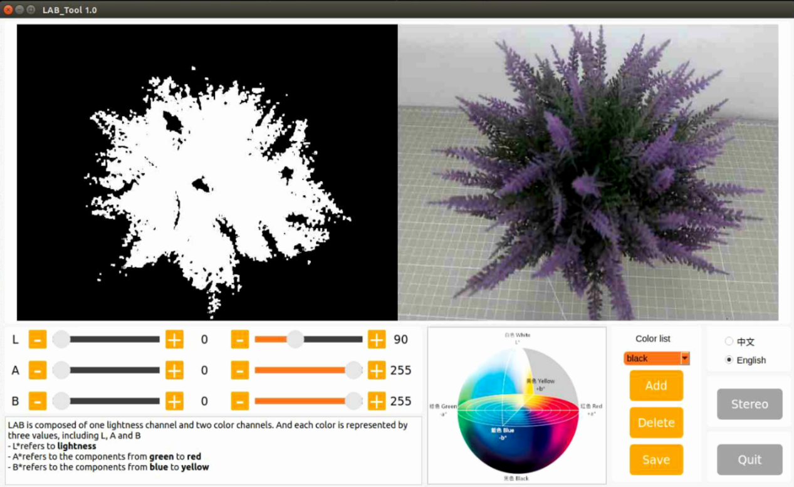

(6) Regarding the interface button instructions and usage, you can refer to the following content. If you want to close it, please click on Quit button.

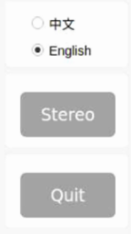

(7) After closing the LAB TOOL, enter a command to restart the app's auto-start service. Once the service is restarted, the robotic arm will return to its initial position.

```
sudo systemctl restart start_app_node.service
```

:::{Note}
If you do not enable app auto-start service for the robot, it will affect the corresponding app functions. Restarting robot can also automatically enable the app auto-start service.
:::

### 5.1.2 LAB TOOL Interface Layout Instruction

The interface of LAB tool software is divided into two parts: image display area and recognition adjustment area.


(1) Image display area: the left displays the processed image and the right is the raw image.

:::{Note}
If the transmitted image does not display normally, it's the issue of camera connection. In this case, you need to examine if the wiring is connected properly or reconnect it.
:::

(2) Recognition adjustment area: adjust the color threshold. The function of each button refer to the following table:

| **Icon** | **Function instruction** |
|:--:|:--:|
|  | The sliders L, A and B are used respectively to adjust the values of the corresponding L, A and B components of the image. The sliders on the left are the **"min"** value for each component while the slider on the right are the **"max"** value for each component. |
|  | Choose color to adjust the threshold. |
|  | Delete the currently selected color. |
|  | Add recognizable color. |
|  | Save the adjustment result of the color threshold. |
|  | Click on this button to swap Depth camera/monocular camera. |
|  | Close LAB TOOL. |

### 5.1.3 Adjust Color Threshold

(1) Open LAN tool. Choose the color in the color drop-down list of color recognition area. Take a color **"red"** as example.

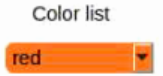

(2) Adjust the **"min"** values of L, A and B components to **"0"**, the **"max"** values to **"225"**.


(3) Place the target within the camera's field of view. Adjust the values of L, A and B component towards the interval representing the target recognition color according to the LAB color space distribution chart.


Red color is close to **"+a"**, which indicates that A component needs to be increased. Therefore, keep the **"max"** value of the A component unchanged and increase its **"min"** value until the object on the left turns white while other areas turn black.


(4) Adjust the L and B components according to your surroundings. If the red color is light, increase the **"min"** value of the L component; if it is dark, decrease the **"max"** value of the component. If the red color tends to be warm, increase the **"min"** value of the B component; if it tends to be cool, decrease the **"max"** value of the B component.


The following table shows the parameter information of LAB threshold adjustment:

| **Color component** | **Value Range** | **Corresponding Color Intervals** |
|:-------------------:|:---------------:|:---------------------------------:|
| L | 0~255 | Black-white (-L~+L) |
| A | 0~255 | green-red（-a ~ +a） |
| B | 0~255 | Blue-yellow（-b ~ +b） |

(5) Click **"Save"** button in adjustment area to save the adjustment parameters.


### 5.1.4 Add New Color 

In addition to the built-in colors, users can add other recognition colors. Take an example of adding **"yellow"**.

(1) Open LAB tool and click on **"Add"** button.


(2) Fill in the **"name"** column with the color name, and click the **"OK"** button.


(3) Choose the added color in the color drop-down menu.

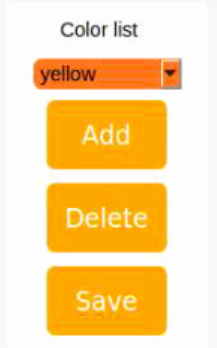

(4) Place the target within the camera's field of view, and adjust the threshold by dragging the L, A, and B component sliders until the area of the colored object within the left screen turns white, while the other areas turn black.


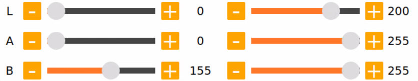

:::{Note}
The adjustment method of color threshold refers to **"5.1.3 Adjust Color Threshold"**.
:::

(5) Click **"Save"** button in recognition adjustment area to save the adjustment parameters of color threshold.


After adjusting the color thresholds, press **'Ctrl+C'** to stop the camera service, then click **'Close Software'** to close the interface.

## 5.2 Color Recognition

This session will use OpenCV to perform red, green, blue recognition and display the recognition result through transmitted image. Before operations, please prepare one object of red, green and blue.

### 5.2.1 Recognition Process

Firstly, obtain the RGB image from the camera. Scale and apply Gaussian blur to the image. Convert the image from RGB to Lab. 

Next, identify the object color in the circle by using color thresholds, followed by masking of the image portion. (masking is used to hide certain part of the processed image).

After performing opening and closing operations on the object image, the object with the largest contour is circled.

Open operations: erosion followed by dilation. Remove small objects, smooth the contours of object and keep its area unchanged. It can eliminate small noise and break thin connection between objects.

Erosion: it can be used to remove small objects or features from an image, break thin connections between objects, and generally reduce the size of objects.

Dilation: it is useful for filling in gaps between objects, joining nearby objects, and generally increasing the size of objects.

Finally, the recognition results are displayed on the screen.

### 5.2.2 Operation Steps 

:::{Note}
The entered command should be case sensitive and **"Tab"** key can be used to complement the key words.
:::

(1) Start JetRover and connect it to [Nomachine](resources_download.md).

(2) Click on  to start the command line terminal.

(3) Input the command and press Enter to disable the app auto-start service.

```
sudo systemctl stop start_app_node.service
```

(4) Run the following command to enable the camera node:

Depth camera:

```
ros2 launch peripherals depth_camera.launch.py
```

Monocular Camera:

```
ros2 launch peripherals usb_cam.launch.py
```

(5) Open a new command line terminal, enter the following command to navigate to the program directory and start the color recognition game:

```
cd ~/ros2_ws/src/example/example/color_detect && python3 color_detect_demo.py
```

(6) The program will launch the camera's image interface. For detailed recognition steps, please refer to section **5.2.3 Program Outcome**.

(7) Next, press **"Ctrl+C"** in the command line terminal interface. If closing fails, please try again repeatedly.

### 5.2.3 Program Outcome

:::{Note}
After the game starts, please ensure that there are no other objects containing recognized colors within the field of view of the camera to avoid affecting the implementation effect.
:::

After the game starts, place the target object within the field of view of the camera. When recognizing the target object, it will be circled up in the same color and the color name will be printed in the lower-left corner of the screen. The program supports red, blue and green object recognition.

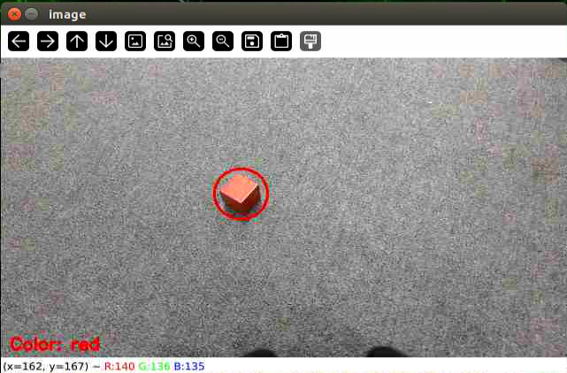

### 5.2.4 Program Analysis

[Source Code](../_static/source_code/color_detect.zip)

The source code of the program is located in [/home/ubuntu/ros2_ws/src/example/example/color_detect/color_detect_demo.py](../_static/source_code/color_detect.zip)

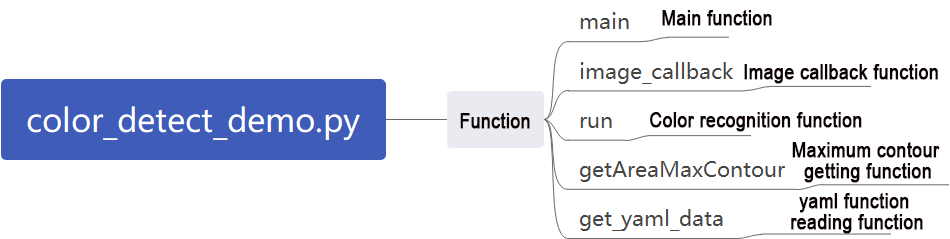

* **Main Function**

Initialize the ROS node, create a color recognition node named `color_detect_node`, subscribe to the image topic `/depth_cam/rgb/image_raw`, and set its callback function to `image_callback`. Start the main function for color recognition using multiple threads. Wait for the node to shut down.

{lineno-start=157}
```python
if __name__ == '__main__':
    rclpy.init()
    node = rclpy.create_node('color_detect_node')
    node.create_subscription(Image, '/depth_cam/rgb/image_raw', image_callback, 1)
    threading.Thread(target=main, daemon=True).start()
    rclpy.spin(node)
```

* **Camera Callback Function**

Primarily used to read the video stream from the topic and enqueue it to ensure real-time display.

{lineno-start=129}
```python
def image_callback(ros_image):
    cv_image = bridge.imgmsg_to_cv2(ros_image, "bgr8")
    bgr_image = np.array(cv_image, dtype=np.uint8)
    if image_queue.full():
        # Discard the oldest image if the queue is full(如果队列已满，丢弃最旧的图像)
        image_queue.get()
        # Put the image into the queue(将图像放入队列)
    image_queue.put(bgr_image)
```

* **Color Recognition Main Function**

This function reads image data from the queue, processes it using the `run` function for color recognition, and then displays the recognized image using `cv2`.

{lineno-start=138}
```python
def main():
    running = True
    while running:
        try:
            image = image_queue.get(block=True, timeout=1)
        except queue.Empty:
            if not running:
                break
            else:
                continue
        image = run(image)
        cv2.imshow('image', image)
        key = cv2.waitKey(1)
        if key == ord('q') or key == 27:  # Press q or esc to exit(按q或者esc退出)
            break

    cv2.destroyAllWindows()
    rclpy.shutdown()
```

* **YAML File Reading Function**

{lineno-start=28}
```python
def get_yaml_data(yaml_file):
    yaml_file = open(yaml_file, 'r', encoding='utf-8')
    file_data = yaml_file.read()
    yaml_file.close()
    
    data = yaml.load(file_data, Loader=yaml.FullLoader)
    
    return data

lab_data = get_yaml_data("/home/ubuntu/software/lab_tool/lab_config.yaml")
```

* **Maximum Contour Function**

This function takes contours detected by OpenCV as input, identifies the largest contour based on size, and returns the contour along with its area.

{lineno-start=39}
```python
# Find out the contour with the maximal area(找出面积最大的轮廓)
# The parameter is the list of contour to be compared(参数为要比较的轮廓的列表)
def getAreaMaxContour(contours):
    contour_area_temp = 0
    contour_area_max = 0
    area_max_contour = None

    for c in contours:  # Iterate through all contours(历遍所有轮廓)
        contour_area_temp = math.fabs(cv2.contourArea(c))  # Calculate contour area(计算轮廓面积)
        if contour_area_temp > contour_area_max:
            contour_area_max = contour_area_temp
            if contour_area_temp > 50:  # Only contours with an area greater than 50 are considered valid, and among them, the contour with the largest area is selected to filter out interference(只有在面积大于50时，最大面积的轮廓才是有效的，以过滤干扰)
                area_max_contour = c

    return area_max_contour, contour_area_max  # Return the maximal contour(返回最大的轮廓)
```

* **Color Recognition Function**

This function compresses the input image to a size of (320, 240) for easier detection, applies Gaussian filtering, and then converts the image to the LAB color space.

{lineno-start=60}
```python
def run(img):
    global draw_color
    global color_list
    global detect_color
    
    img_copy = img.copy()
    img_h, img_w = img.shape[:2]

    frame_resize = cv2.resize(img_copy, size, interpolation=cv2.INTER_NEAREST)
    frame_gb = cv2.GaussianBlur(frame_resize, (3, 3), 3)      
    frame_lab = cv2.cvtColor(frame_gb, cv2.COLOR_BGR2LAB)  # Convert the image to LAB space(将图像转换到LAB空间)

    max_area = 0
    color_area_max = None    
    areaMaxContour_max = 0
```

The function iterates through a list of colors to identify the color of the largest detected contour.

{lineno-start=76}
```python
    for i in ['red', 'green', 'blue']:
        frame_mask = cv2.inRange(frame_lab, tuple(lab_data['lab']['Stereo'][i]['min']), tuple(lab_data['lab']['Stereo'][i]['max']))  #Perform bitwise operations on the original image and mask(对原图像和掩模进行位运算)
        eroded = cv2.erode(frame_mask, cv2.getStructuringElement(cv2.MORPH_RECT, (3, 3)))  #Corrosion(腐蚀)
        dilated = cv2.dilate(eroded, cv2.getStructuringElement(cv2.MORPH_RECT, (3, 3))) #Dilation(膨胀)
        contours = cv2.findContours(dilated, cv2.RETR_EXTERNAL, cv2.CHAIN_APPROX_NONE)[-2]  #Find out contour(找出轮廓)
        areaMaxContour, area_max = getAreaMaxContour(contours)  #Find out the contour with the maximal area(找出最大轮廓)
        if areaMaxContour is not None:
            if area_max > max_area:#Find the maximal area(找最大面积)
                max_area = area_max
                color_area_max = i
                areaMaxContour_max = areaMaxContour
```

Contours with an area smaller than 200 are filtered out. If the area is larger than 200, the function calculates the contour coordinates and draws the detected color's position on the screen.

{lineno-start=87}
```python
    if max_area > 200:  # The maximum area is found(有找到最大面积)
        ((centerX, centerY), radius) = cv2.minEnclosingCircle(areaMaxContour_max)  # Get the minimum circumcircle(获取最小外接圆)
        centerX = int(common.val_map(centerX, 0, size[0], 0, img_w))
        centerY = int(common.val_map(centerY, 0, size[1], 0, img_h))
        radius = int(common.val_map(radius, 0, size[0], 0, img_w))            
        cv2.circle(img, (centerX, centerY), radius, range_rgb[color_area_max], 2)#Draw circle(画圆)

        if color_area_max == 'red':  #Red is the maximal area(红色最大)
            color = 1
        elif color_area_max == 'green':  #Green is the maximal area(绿色最大)
            color = 2
        elif color_area_max == 'blue':  #Blue is the maximal area(蓝色最大)
            color = 3
        else:
            color = 0
        color_list.append(color)

        if len(color_list) == 3:  #Multiple judgement(多次判断)
            # Take average value(取平均值)
            color = int(round(np.mean(np.array(color_list))))
            color_list = []
            if color == 1:
                detect_color = 'red'
                draw_color = range_rgb["red"]
            elif color == 2:
                detect_color = 'green'
                draw_color = range_rgb["green"]
            elif color == 3:
                detect_color = 'blue'
                draw_color = range_rgb["blue"]
            else:
                detect_color = 'None'
                draw_color = range_rgb["black"]               
    else:
        detect_color = 'None'
        draw_color = range_rgb["black"]
            
    cv2.putText(img, "Color: " + detect_color, (10, img.shape[0] - 10), cv2.FONT_HERSHEY_SIMPLEX, 0.65, draw_color, 2)
    
    return img

```

## 5.3 Generate & Recognize QR Code

This lesson is divided into two parts. The first part will introduce you how to learn to create a QR code, while the second part focuses on recognizing the created QR code and then decoding the QR code information through the terminal.

### 5.3.1 Generate QR Code

* **Process**

First, create an instance object of the QR code tool and set its detailed parameters.

Next, obtain the user's data and fill it into the QR code.

Finally, generate a QR CODE image based on the data and display it in a window, and save it in the corresponding path.

* **Operation Steps**

:::{Note}
The entered command should be case sensitive and the **"Tab"** key can be used to fill in key words.
:::

(1) Start JetRover and connect it to [Nomachine](resources_download.md).

(2) Click on  to start the ROS2 command line terminal.

(3) Input the command and press Enter to disable the app auto-start service.

```
sudo systemctl stop start_app_node.service
```

(4) Input the command to access the program directory and start the QR code creation program.

```
cd ~/ros2_ws/src/example/example/qrcode && python3 qrcode_creater.py
```

After start the program, it's necessary to enter characters in the terminal to generate the QR code. Take the input of **"ubuntu"** as example.

Press **"Enter"** to display a QR code image containing the input data.


(5) Next, press the **"ESC"** key or **"q"** key to exit the QR code interface.

(6) When you return to the command-line terminal and see the prompt shown in the image below, it means the QR code has been successfully saved.

(7) Click  on the taskbar on the left side of the system interface, open the file manager, and navigate to the directory highlighted in the red box in the image below. There, you'll find the generated QR code saved to the host system.

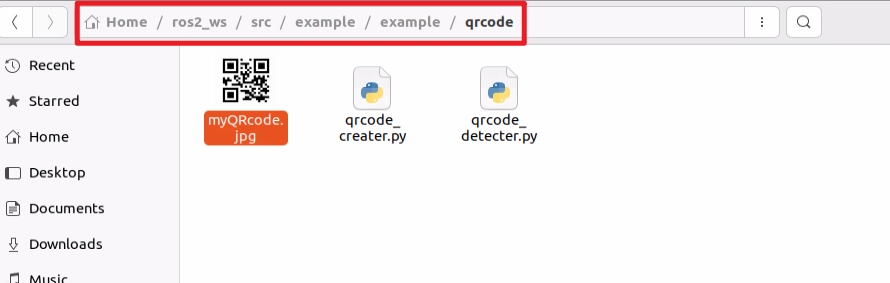

(8) Use the [NoMachine](resources_download.md) tool to drag and drop the image onto your PC desktop. From there, you can print it or transfer it to your mobile phone's photo gallery.

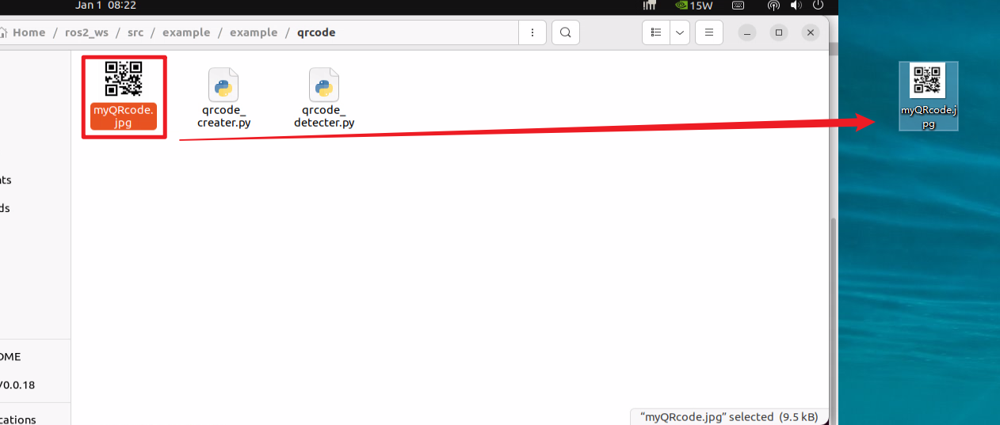

* **Program Analysis**

[Source Code](../_static/source_code/qrcode.zip)

The source code of this program is located at: [/home/ubuntu/ros2_ws/src/example/example/qrcode/qrcode_creater.py](../_static/source_code/qrcode.zip)

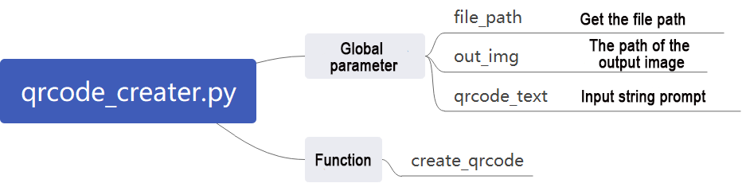

* **Creating QR Code Utility Object**

Using the `qrcode` module to create the necessary object and setting various parameters for the QR code.

{lineno-start=19}
```python
	qr = qrcode.QRCode(
        version=1,
        error_correction=qrcode.constants.ERROR_CORRECT_H,
        box_size=5,
        border=4)
```

The parameters of the above function are as follows:

The first parameter `version` is an integer ranging from 1 to 40, used to control the size of the QR code. If you want the program to automatically determine the size, set this value to None and use the `fit` parameter.

The second parameter `error_correction` controls the error correction capability of the QR code, with the following options:

① `ERROR_CORRECT_L`: can correct approximately 7% or fewer errors.

② `ERROR_CORRECT_M`: default value, can correct approximately 15% or fewer errors.

③ `ERROR_CORRECT_H`: can correct approximately 30% or fewer errors.

The third parameter `box_size` controls the number of pixels contained in each small box of the QR code.

The fourth parameter `border` controls the number of boxes included in the border (distance between the QR code and the image boundary), with a default value of 4, which is the minimum value specified by relevant standards.

* **Generating QR Code**

Using the `add_data` and `make` functions to retrieve and fill data, and then using the `make_image` function to generate the image.

{lineno-start=24}
```python
	# Add data(添加数据)
    qr.add_data(data)
    # Fill data(填充数据)
    qr.make(fit=True)
    # Generate image(生成图片)
    img = qr.make_image(fill_color=(0, 0, 0), back_color=(255, 255, 255))
    opencv_img = cv2.cvtColor(np.asarray(img), cv2.COLOR_RGB2BGR)
```

The parameters of the `make_image` function are as follows:

The first parameter `fill_color=(0, 0, 0)` is the fill color of the image, which is black in this case.

The second parameter `back_color=(255, 255, 255)` is the background color of the image, which is white in this case.

* **Displaying Image**

Converting the color space of the image using the `cvtColor` function, and then displaying it on the window using the `imshow` function.

{lineno-start=31}
```python
	while True:
        cv2.imshow('img', opencv_img)
        k = cv2.waitKey(1)
        if k != -1:
            break
```

* **Saving Image**

Using the `imwrite` function to store the generated QR code image and printing relevant information.

{lineno-start=32}
```python
	cv2.imwrite(file_name, opencv_img)
    print('save', data, file_name)
```

The parameters of the `imwrite` function are as follows:

The first parameter `file_name` is the storage path of the image.

The second parameter `opencv_img` is the image to be stored.

### 5.3.2 QR Code Recognition

In the previous section, we created a QR code. In this section, we'll perform content recognition on the QR code.

* **Recognition Process**

Firstly, create an instance object for QR code detection, and pass in the required network structure and model weight files for detection.

Then, obtain the camera's feedback image and perform detection.

Finally, once the QR code is recognized, it will be framed, and the content of the QR code will be printed.

The source code for this program is located at: [/home/ubuntu/ros2_ws/src/example/example/qrcode/qrcode_detecter.py](../_static/source_code/qrcode.zip)

* **QR Code Recognition Steps**

:::{Note}
When entering commands, it is necessary to strictly distinguish between uppercase and lowercase letters, and you can use the **"Tab"** key to complete keywords.
:::

(1) Start the robot and connect it to the remote control software [NoMachine](resources_download.md).

(2) Click on  on the system desktop to start the ROS2 command line terminal.

(3) Enter the command to disable the automatic startup service of the app:

```
sudo systemctl stop start_app_node.service
```

(5) Enter the command to start the camera node:

```
ros2 launch peripherals depth_camera.launch.py
```

(6) Open a new ROS2 command line terminal, enter the command to switch to the program directory, and start the QR code recognition program:

```
cd ~/ros2_ws/src/example/example/qrcode && python3 qrcode_detecter.py
```

To close this game, press **"Ctrl+C"** in the terminal interface. If closing fails, please try again repeatedly.

* **Program Outcome**

After starting the game, it will recognize the QR code images appearing in the feedback screen, mark them with a red box, and print out the content of the QR code.

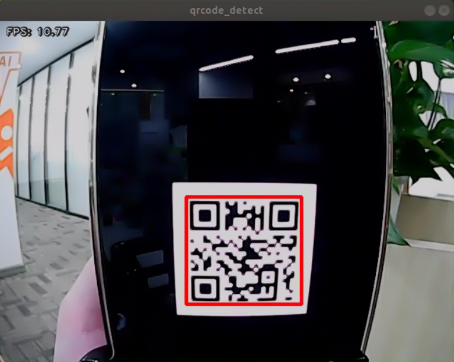

* **Program Analysis**

[Source Code](../_static/source_code/qrcode.zip)

The source code of this program is saved in [/home/ubuntu/ros2_ws/src/example/example/qrcode/qrcode_creater.py](../_static/source_code/qrcode.zip)

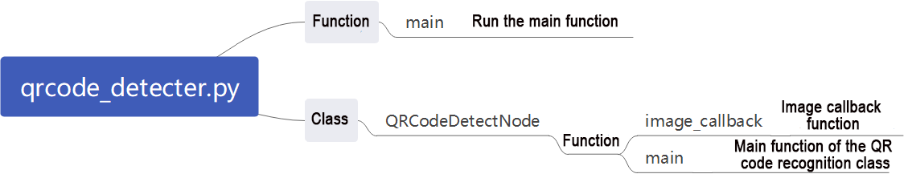

* **Main Function**

Initialize the `QRCodeDetectNode` and set the node name as `qrcode_detect`. Wait for the ROS node to close, and if it closes, unregister the current node.

{lineno-start=60}
```python
def main():
    node = QRCodeDetectNode('qrcode_detect')
    try:
        rclpy.spin(node)
    except KeyboardInterrupt:
        node.destroy_node()
        rclpy.shutdown()
        print('shutdown')
    finally:
        print('shutdown finish')
```

* **QRCodeDetectNode Class**

Initialize the node and define parameters, then start the `self.main` function.

(1) Parameters:

`self.running`: Whether the detection is enabled

`self.model_path`: Model path

`self.image_queue`: Image queue

`self.image_sub`: Subscription to read camera feedback images

`self.qcd`: Initialization of the QR code detection

{lineno-start=13}
```python
class QRCodeDetectNode(Node):
    def __init__(self, name):
        rclpy.init()
        super().__init__(name)
        self.running = True
        self.bridge = CvBridge()
        self.model_path = os.path.join(os.path.abspath(os.path.split(os.path.realpath(__file__))[0]), 'model/detector.tflite')
        self.image_queue = queue.Queue(maxsize=2)
        self.image_sub = self.create_subscription(Image, '/depth_cam/rgb/image_raw', self.image_callback, 1)
        self.qcd = cv2.QRCodeDetector()
        threading.Thread(target=self.main, daemon=True).start()  
```

(2) Functions:

The camera callback function reads the camera feedback image and places it in the queue `self.image_queue` for automatic update and discarding of expired images.

{lineno-start=25}
```python
    def image_callback(self, ros_image):
        cv_image = self.bridge.imgmsg_to_cv2(ros_image, "bgr8")
        bgr_image = np.array(cv_image, dtype=np.uint8)
        if self.image_queue.full():
            # If the queue is full, discard the oldest image(如果队列已满，丢弃最旧的图像)
            self.image_queue.get()
            # Put the image into the queue(将图像放入队列)
        self.image_queue.put(bgr_image)
```
The main function mainly starts QR code detection. It checks whether detection is enabled based on the parameter `self.running`. If it is True, it reads the image data from the `self.image_queue` queue, inputs it into the initialized recognition model `self.qcd`, and finally prints the recognition content and draws the recognition box based on the output data.

{lineno-start=34}
```python
    def main(self):
        while self.running:
            try:
                image = self.image_queue.get(block=True, timeout=1)
            except queue.Empty:
                if not self.running:
                    break
                else:
                    continue
            ret_qr, decoded_info, points, _ = self.qcd.detectAndDecodeMulti(image)
            if ret_qr:
                for s, p in zip(decoded_info, points):
                    if s:
                        print(s)
                        color = (0, 255, 0)
                    else:
                        color = (0, 0, 255)
                    image = cv2.polylines(image, [p.astype(int)], True, color, 8)
            cv2.imshow('image', image)
            key = cv2.waitKey(1)
            if key == ord('q') or key == 27:  # Press q or esc to exit(按q或者esc退出)
                break
        
        cv2.destroyAllWindows()
        rclpy.shutdown()
```

## 5.4 Autonomous Line Following

### 5.4.1 Recognition Procedure

First, obtain the RGB image from the camera and resize it. Apply Gaussian blur to the image and convert the color space from RGB to Lab.

Then, perform color recognition on the objects in the circle using color thresholding. Apply masking to parts of the image. (Masking is used to globally or locally mask the processed image using selected images, graphics, or objects).

Afterward, perform opening and closing operations on the object images. Finally, outline the largest object with a circle.

Opening operation: First, erode the image and then dilate it. Purpose: Used to eliminate small objects, smooth the shape boundary, and not change its area. It can remove small grain noise and break the adhesion between objects.

Erosion: Eliminate the boundary points of the object, causing the boundary to shrink inward, and can remove objects smaller than the structural element.

Dilation: Expand the boundary points of the object, merge all background points in contact with the object into the object, and expand the boundary outward.

Finally, feedback the recognition results on the feedback screen.

### 5.4.2 Autonomous Line Following Operation

:::{Note}
The input command should be case sensitive, and keywords can be complemented using Tab key.
:::

(1) Start the robot and connect it to the remote control software [NoMachine](resources_download.md).

(2) Click on  on the system desktop to start the command line terminal.

(3) Enter the command to disable the automatic startup service of the app:

```
sudo systemctl stop start_app_node.service
```

(4) Run the command to enable the camera node

```
ros2 launch app line_following_node.launch.py debug:=true
```

(5) Create a new command line terminal, enter the command to navigate to the program directory, and start the line-following game:

```
ros2 service call /line_following/enter std_srvs/srv/Trigger {}
```

(6) Then, in the current command line terminal, enter the command to navigate to the program directory and start the line-following game:

```
ros2 service call /line_following/set_running std_srvs/srv/SetBool "{data: True}"
```

(7) Click on the position of the line in the image to select the corresponding color of the track line, and you can start line following by color picking.

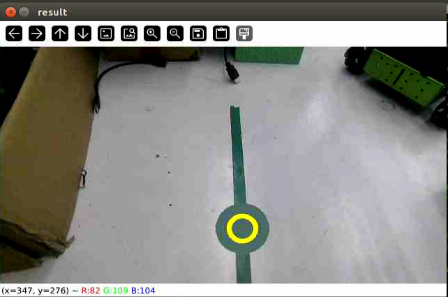

(8) If you need to close this function, you need to return to the command line terminal and enter the command to stop it.

```
ros2 service call /line_following/enter std_srvs/srv/Trigger {}
```

### 5.4.3 Program Analysis

[Source Code](../_static/source_code/app.zip)

* **Launch Analysis**

The program file corresponding to this section of the course document is located at: [/home/ubuntu/ros2_ws/src/app/launch/line_following_node.launch.py](../_static/source_code/app.zip)

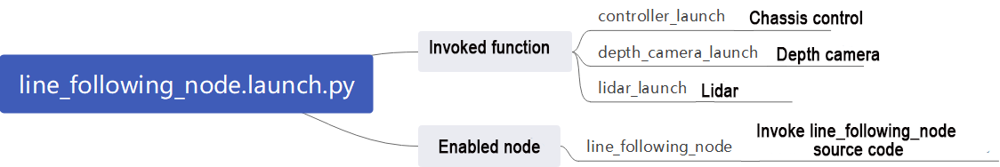

* **Read the Storage Path**

{lineno-start=14}
```python
    if compiled == 'True':
        controller_package_path = get_package_share_directory('controller')
        peripherals_package_path = get_package_share_directory('peripherals')
    else:
        controller_package_path = '/home/ubuntu/ros2_ws/src/driver/controller'
        peripherals_package_path = '/home/ubuntu/ros2_ws/src/peripherals'
```

Use `get_package_share_directory` to obtain the package path.

* **Launch**

{lineno-start=20}
```python
    line_following_node = GroupAction([
        IncludeLaunchDescription(
            PythonLaunchDescriptionSource(
                os.path.join(peripherals_package_path, 'launch/lidar.launch.py')),
            condition=IfCondition(debug),
            ),

        IncludeLaunchDescription(
            PythonLaunchDescriptionSource(
                os.path.join(peripherals_package_path, 'launch/depth_camera.launch.py')),
            condition=IfCondition(debug),
            ),

        IncludeLaunchDescription(
            PythonLaunchDescriptionSource(
                os.path.join(controller_package_path, 'launch/controller.launch.py')),
            condition=IfCondition(debug),
            ),
```

`controller_launch`: Start motion control launch.

`depth_camera_launch`: Start depth camera launch.

`lidar_launch`: Start lidar launch.

`line_following_node`: Start line following node.

{lineno-start=39}
```python
        Node(
            package='app',
            executable='line_following',
            output='screen',
            parameters=[{'debug': debug}],
            ),
    ])
```

* **Source Code Analysis**

The program file corresponding to this section of the course document is located at: [/home/ubuntu/ros2_ws/src/app/app/line_following.py](../_static/source_code/app.zip)

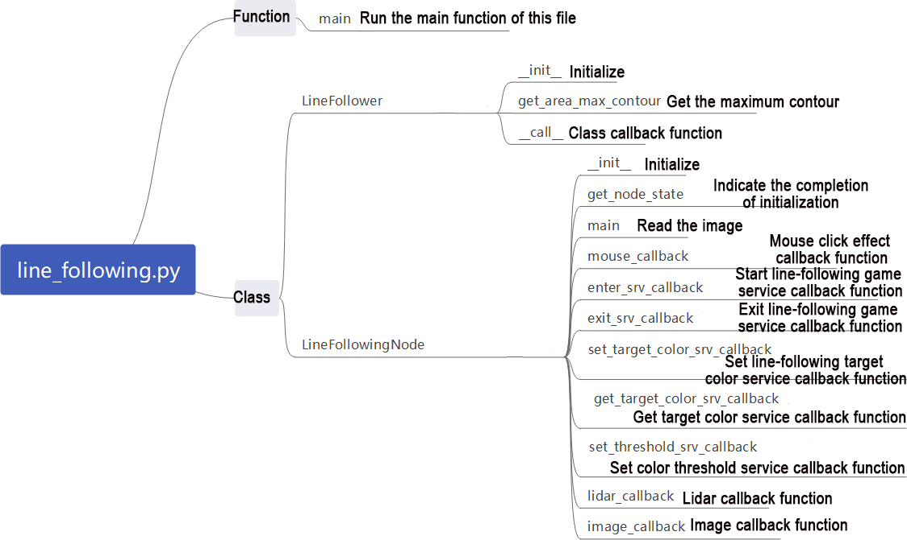

:::{Note}
It's necessary to back up the original program file before making any modification to the program. You're forbidden to modify the original source code file to avoid causing robot malfunctions that may be irreparable due to incorrect parameter modifications!
:::

According to the game's effect, the process logic of this game is summarized as shown in the following diagram:

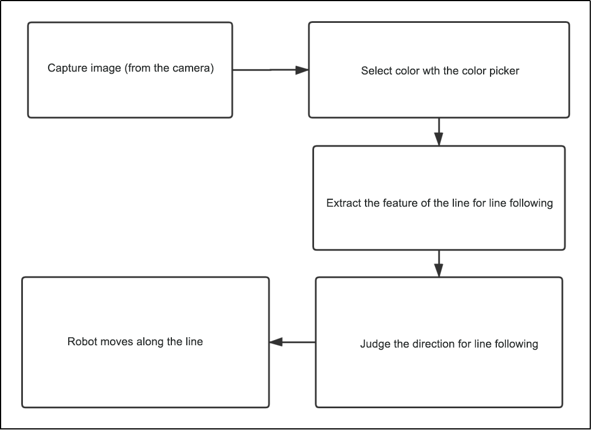

Subscribe to the topic messages published by the camera node to obtain RGB images. From the image, identify and select the target line. Determine the color threshold by picking the color of the line. Based on the line's color information, extract the features of the line for line following. Calculate the robot's offset relative to the line's position in the field of view. Control the robot to move along the line segment, continuously correcting its position to keep the line at the center of the field of view and use lidar to detect obstacles and avoid them.

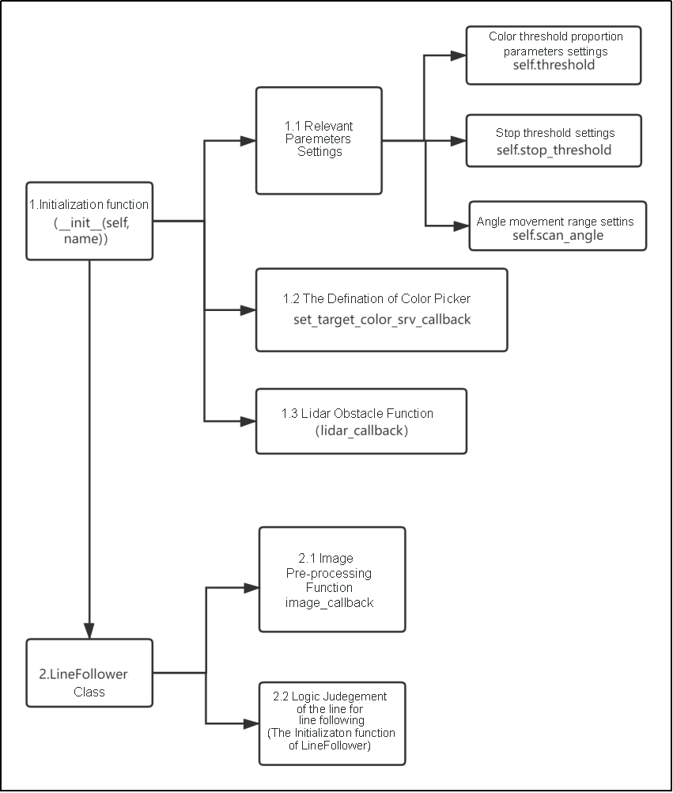

Then, the color picker object is defined (used in the gameplay to pick colors), along with the setting of additional Lidar obstacle avoidance functionality. Next is the implementation of the `LineFollower` class, which mainly includes functions for image preprocessing and logic for line following.

(1) Function:

① Main: 

{lineno-start=389}
```python
def main():
    node = LineFollowingNode('line_following')
    rclpy.spin(node)
    node.destroy_node()
    rclpy.shutdown()
```

Initiate line following node.

(2) Class:

* LineFollower:

{lineno-start=27}
```python
class LineFollower:
```

* Init:

{lineno-start=28}
```python
    def __init__(self, color, node):
        self.node = node
        self.target_lab, self.target_rgb = color
        if os.environ['DEPTH_CAMERA_TYPE'] == 'Dabai':
            self.rois = ((0.9, 0.95, 0, 1, 0.7), (0.8, 0.85, 0, 1, 0.2), (0.7, 0.75, 0, 1, 0.1))
        else:
            self.rois = ((0.81, 0.83, 0, 1, 0.7), (0.69, 0.71, 0, 1, 0.2), (0.57, 0.59, 0, 1, 0.1))
        self.weight_sum = 1.0
```

Set the line-following color and ROI list.

* get_area_max_contour:

{lineno-start=38}
```python
    def get_area_max_contour(contours, threshold=100):
        '''
        Get the contour of the largest area(获取最大面积对应的轮廓)
        :param contours:
        :param threshold:
        :return:
        '''
        contour_area = zip(contours, tuple(map(lambda c: math.fabs(cv2.contourArea(c)), contours)))
        contour_area = tuple(filter(lambda c_a: c_a[1] > threshold, contour_area))
        if len(contour_area) > 0:
            max_c_a = max(contour_area, key=lambda c_a: c_a[1])
            return max_c_a
        return None
```

Get the contour with the maximum area.

* Call:

{lineno-start=52}
```python
    def __call__(self, image, result_image, threshold, color=None, use_color_picker=True):
        centroid_sum = 0
        h, w = image.shape[:2]
        if use_color_picker:
            min_color = [int(self.target_lab[0] - 50 * threshold * 2),
                         int(self.target_lab[1] - 50 * threshold),
                         int(self.target_lab[2] - 50 * threshold)]
            max_color = [int(self.target_lab[0] + 50 * threshold * 2),
                         int(self.target_lab[1] + 50 * threshold),
                         int(self.target_lab[2] + 50 * threshold)]
            target_color = self.target_lab, min_color, max_color
            lowerb = tuple(target_color[1])
            upperb = tuple(target_color[2])
        else:
            lowerb = tuple(color['min'])
            upperb = tuple(color['max'])
        for roi in self.rois:
            blob = image[int(roi[0]*h):int(roi[1]*h), int(roi[2]*w):int(roi[3]*w)]  # Intercept roi(截取roi)
            img_lab = cv2.cvtColor(blob, cv2.COLOR_RGB2LAB)  # Convert rgb into lab(rgb转lab)
            img_blur = cv2.GaussianBlur(img_lab, (3, 3), 3)  # Perform Gaussian filtering to reduce noise(高斯模糊去噪)
            # mask = cv2.inRange(img_blur, tuple(target_color[1]), tuple(target_color[2]))  # Image binarization(二值化)
            mask = cv2.inRange(img_blur, lowerb, upperb)  # Image binarization(二值化)
            eroded = cv2.erode(mask, cv2.getStructuringElement(cv2.MORPH_RECT, (3, 3)))  # Corrode(腐蚀)
            dilated = cv2.dilate(eroded, cv2.getStructuringElement(cv2.MORPH_RECT, (3, 3)))  # Dilate(膨胀)
            # cv2.imshow('section:{}:{}'.format(roi[0], roi[1]), cv2.cvtColor(dilated, cv2.COLOR_GRAY2BGR))
            contours = cv2.findContours(dilated, cv2.RETR_EXTERNAL, cv2.CHAIN_APPROX_TC89_L1)[-2]  # Find the contour(找轮廓)
            max_contour_area = self.get_area_max_contour(contours, 30)  # Get the contour corresponding to the largest contour(获取最大面积对应轮廓)
            if max_contour_area is not None:
                rect = cv2.minAreaRect(max_contour_area[0])  # Minimum circumscribed rectangle(最小外接矩形)
                box = np.intp(cv2.boxPoints(rect))  # Four corners(四个角)
                for j in range(4):
                    box[j, 1] = box[j, 1] + int(roi[0]*h)
                cv2.drawContours(result_image, [box], -1, (0, 255, 255), 2)  # Draw the rectangle composed of four points(画出四个点组成的矩形)

                # Acquire the diagonal points of the rectangle(获取矩形对角点)
                pt1_x, pt1_y = box[0, 0], box[0, 1]
                pt3_x, pt3_y = box[2, 0], box[2, 1]
                # Center point of the line(线的中心点)
                line_center_x, line_center_y = (pt1_x + pt3_x) / 2, (pt1_y + pt3_y) / 2

                cv2.circle(result_image, (int(line_center_x), int(line_center_y)), 5, (0, 0, 255), -1)   # Draw the center point(画出中心点)
                centroid_sum += line_center_x * roi[-1]
        if centroid_sum == 0:
            return result_image, None
        center_pos = centroid_sum / self.weight_sum  # Calculate the center point according to the ratio(按比重计算中心点)
        deflection_angle = -math.atan((center_pos - (w / 2.0)) / (h / 2.0))   # 计算线角度(calculate the line angle)
        return result_image, deflection_angle
```

Perform color recognition, identify based on the set color, and provide feedback on the recognized image and angle.

* LineFollowingNode:

{lineno-start=100}
```python
class LineFollowingNode(Node):
```

* Init:

{lineno-start=101}
```python
    def __init__(self, name):
        rclpy.init()
        super().__init__(name, allow_undeclared_parameters=True, automatically_declare_parameters_from_overrides=True)
        
        self.name = name
        self.color = ''
        self.camera_type = 'Stereo'
        self.set_above = False
        self.set_callback = False
        self.is_running = False
        self.color_picker = None
        self.follower = None
        self.scan_angle = math.radians(45)
        self.pid = pid.PID(0.01, 0.0, 0.0)
        self.empty = 0
        self.count = 0
        self.stop = False
        self.threshold = 0.5
        self.stop_threshold = 0.4
        self.lock = threading.RLock()
        self.image_sub = None
        self.lidar_sub = None
        self.image_height = None
        self.image_width = None
        self.bridge = CvBridge()
        self.use_color_picker = True
        self.lab_data = common.get_yaml_data("/home/ubuntu/software/lab_tool/lab_config.yaml")
        self.image_queue = queue.Queue(2)
        self.lidar_type = os.environ.get('LIDAR_TYPE')
        self.machine_type = os.environ.get('MACHINE_TYPE')
        self.mecanum_pub = self.create_publisher(Twist, '/controller/cmd_vel', 1)  # Chassis control(底盘控制)
        self.result_publisher = self.create_publisher(Image, '~/image_result', 1)  # Publish the image processing result(图像处理结果发布)
        self.create_service(Trigger, '~/enter', self.enter_srv_callback)  # Enter the game (进入玩法)
        self.create_service(Trigger, '~/exit', self.exit_srv_callback)  # Exit the game(退出玩法)
        self.create_service(SetBool, '~/set_running', self.set_running_srv_callback)  # Start the game(开启玩法)
        self.set_color_srv = self.create_service(SetString, '~/set_color', self.set_color_srv_callback)
        self.create_service(SetPoint, '~/set_target_color', self.set_target_color_srv_callback)  # Set the color(设置颜色)
        self.create_service(Trigger, '~/get_target_color', self.get_target_color_srv_callback)   # Get the color(获取颜色)
        self.create_service(SetFloat64, '~/set_threshold', self.set_threshold_srv_callback)  # Set the threshold(设置阈值)
        self.joints_pub = self.create_publisher(ServosPosition, 'servo_controller', 1)
        Heart(self, self.name + '/heartbeat', 5, lambda _: self.exit_srv_callback(request=Trigger.Request(), response=Trigger.Response()))  # Heartbeat package(心跳包)
        self.debug = self.get_parameter('debug').value
        if self.debug: 
            threading.Thread(target=self.main, daemon=True).start()
        self.create_service(Trigger, '~/init_finish', self.get_node_state)
        self.get_logger().info('\033[1;32m%s\033[0m' % 'start')
```

Initialize the required parameters for the program, call the base node, camera node, and start services such as enter, exit, start, set color, get color, set threshold, etc.

* get_node_state:

{lineno-start=148}
```python
    def get_node_state(self, request, response):
        response.success = True
        return response
```

Set the status of the current node.

* Main:

{lineno-start=152}
```python
    def main(self):
        while True:
            try:
                image = self.image_queue.get(block=True, timeout=1)
            except queue.Empty:
                continue

            result = cv2.cvtColor(image, cv2.COLOR_RGB2BGR)
            cv2.imshow("image", cv2.resize(result, (display_size[0], display_size[1])))
            if self.debug and not self.set_callback:
                self.set_callback = True
                # Set callback function for mouse clicking event(设置鼠标点击事件的回调函数)
                cv2.setMouseCallback("image", self.mouse_callback)
            k = cv2.waitKey(1)
            if k != -1:
                break
            if self.debug and not self.set_above:
                cv2.moveWindow('image', 1920 - display_size[0], 0)
                os.system("wmctrl -r image -b add,above")
                self.set_above = True
        self.mecanum_pub.publish(Twist())
        rclpy.shutdown()
```

Read the image and use the mouse to pick colors.

* mouse_callback:

{lineno-start=175}
```python
    def mouse_callback(self, event, x, y, flags, param):
        if event == cv2.EVENT_LBUTTONDOWN:
            self.get_logger().info("x:{} y{}".format(x, y))
            msg = SetPoint.Request()
            if self.image_height is not None and self.image_width is not None:
                msg.data.x = x / self.image_width
                msg.data.y = y / self.image_height
                self.set_target_color_srv_callback(msg, SetPoint.Response())
```

Mouse color picking callback function, obtains the pixel coordinates of the current mouse position.

* enter_srv_callback:

{lineno-start=184}
```python
    def enter_srv_callback(self, request, response):
        self.get_logger().info('\033[1;32m%s\033[0m' % "line following enter")
        with self.lock:
            self.color = ''
            self.stop = False
            self.is_running = False
            self.color_picker = None
            self.pid = pid.PID(1.1, 0.0, 0.0)
            self.follower = None
            self.threshold = 0.5
            self.empty = 0
            if self.image_sub is None:
                self.image_sub = self.create_subscription(Image, '/depth_cam/rgb/image_raw', self.image_callback, 1)  # Subscribe to the camera(摄像头订阅)
            if self.lidar_sub is None:
                qos = QoSProfile(depth=1, reliability=QoSReliabilityPolicy.BEST_EFFORT)
                self.lidar_sub = self.create_subscription(LaserScan, '/scan_raw', self.lidar_callback, qos)  # Subscribe to Lidar data(订阅雷达数据)
            set_servo_position(self.joints_pub, 1, ((10, 300), (5, 500), (4, 210), (3, 40), (2, 665), (1, 500)))
            self.mecanum_pub.publish(Twist())
        response.success = True
        response.message = "enter"
        return response
```

Enter autonomous line-following service, read data from the camera and lidar, and initialize actions.

* exit_srv_callback:

{lineno-start=206}
```python
    def exit_srv_callback(self, request, response):
        self.get_logger().info('\033[1;32m%s\033[0m' % "line following exit")
        try:
            if self.image_sub is not None:
                self.destroy_subscription(self.image_sub)
                self.image_sub = None
            if self.lidar_sub is not None:
                self.destroy_subscription(self.lidar_sub)
                self.lidar_sub = None
        except Exception as e:
            self.get_logger().error(str(e))
        with self.lock:
            self.is_running = False
            self.color_picker = None
            self.pid = pid.PID(0.01, 0.0, 0.0)
            self.follower = None
            self.threshold = 0.5
            self.mecanum_pub.publish(Twist())
        response.success = True
        response.message = "exit"
        return response
```

Exit autonomous line-following service, close various reading nodes, reset PID, and stop line following.

set_target_color_srv_callback:

{lineno-start=228}
```python
    def set_target_color_srv_callback(self, request, response):
        self.get_logger().info('\033[1;32m%s\033[0m' % "set_target_color")
        with self.lock:
            self.use_color_picker = True
            x, y = request.data.x, request.data.y
            self.follower = None
            if x == -1 and y == -1:
                self.color_picker = None
            else:
                self.color_picker = ColorPicker(request.data, 5)
                self.mecanum_pub.publish(Twist())
        response.success = True
        response.message = "set_target_color"
        return response
```

Set line-following color service.

* get_target_color_srv_callback:

{lineno-start=243}
```python
    def get_target_color_srv_callback(self, request, response):
        self.get_logger().info('\033[1;32m%s\033[0m' % "get_target_color")
        response.success = False
        response.message = "get_target_color"
        with self.lock:
            if self.follower is not None:
                response.success = True
                rgb = self.follower.target_rgb
                response.message = "{},{},{}".format(int(rgb[0]), int(rgb[1]), int(rgb[2]))
        return response
```

Set up autonomous line-following gameplay.

* set_threshold_srv_callback:

{lineno-start=254}
```python
    def set_running_srv_callback(self, request, response):
        self.get_logger().info('\033[1;32m%s\033[0m' % "set_running")
        with self.lock:
            self.is_running = request.data
            self.empty = 0
            if not self.is_running:
                self.mecanum_pub.publish(Twist())
        response.success = True
        response.message = "set_running"
        return response
```

Set color threshold service.

* lidar_callback:

{lineno-start=282}
```python
    def lidar_callback(self, lidar_data):
        # Data size= scanning angle/ the increased angle per scan(数据大小 = 扫描角度/每扫描一次增加的角度)
        if self.lidar_type != 'G4':
            min_index = int(math.radians(MAX_SCAN_ANGLE / 2.0) / lidar_data.angle_increment)
            max_index = int(math.radians(MAX_SCAN_ANGLE / 2.0) / lidar_data.angle_increment)
            left_ranges = lidar_data.ranges[:max_index]  # Left data(左半边数据)
            right_ranges = lidar_data.ranges[::-1][:max_index]  # Right data(右半边数据)
        elif self.lidar_type == 'G4':
            min_index = int(math.radians((360 - MAX_SCAN_ANGLE) / 2.0) / lidar_data.angle_increment)
            max_index = int(math.radians(180) / lidar_data.angle_increment)
            left_ranges = lidar_data.ranges[min_index:max_index][::-1]  # Left data(左半边数据)
            right_ranges = lidar_data.ranges[::-1][min_index:max_index][::-1]  # The right data(右半边数据)

        # Get data according to settings(根据设定取数据)
        angle = self.scan_angle / 2
        angle_index = int(angle / lidar_data.angle_increment + 0.50)
        left_range, right_range = np.array(left_ranges[:angle_index]), np.array(right_ranges[:angle_index])

        left_nonzero = left_range.nonzero()
        right_nonzero = right_range.nonzero()
        left_nonan = np.isfinite(left_range[left_nonzero])
        right_nonan = np.isfinite(right_range[right_nonzero])
        # Take the nearest distance left and right(取左右最近的距离)
        min_dist_left_ = left_range[left_nonzero][left_nonan]
        min_dist_right_ = right_range[right_nonzero][right_nonan]
        if len(min_dist_left_) > 0 and len(min_dist_right_) > 0:
            min_dist_left = min_dist_left_.min()
            min_dist_right = min_dist_right_.min()
            if min_dist_left < self.stop_threshold or min_dist_right < self.stop_threshold:
                self.stop = True
            else:
                self.count += 1
                if self.count > 5:
                    self.count = 0
                    self.stop = False
```

Lidar callback function, reorganizes and collates the data read, and determines whether to stop moving forward.

* image_callback:

{lineno-start=318}
```python
    def image_callback(self, ros_image):
        cv_image = self.bridge.imgmsg_to_cv2(ros_image, "rgb8")
        rgb_image = np.array(cv_image, dtype=np.uint8)
        self.image_height, self.image_width = rgb_image.shape[:2]
        result_image = np.copy(rgb_image)  #  The image used to display the result(显示结果用的画面)
        with self.lock:
            if self.use_color_picker:
                # Color picker and line recognition are exclusive. If there is color picker, start picking(颜色拾取器和识别巡线互斥, 如果拾取器存在就开始拾取)
                if self.color_picker is not None: # 拾取器存在(color picker exists)
                    try:
                        target_color, result_image = self.color_picker(rgb_image, result_image)
                        if target_color is not None:
                            self.color_picker = None
                            self.follower = LineFollower(target_color, self)
                            self.get_logger().info("target color: {}".format(target_color))
                    except Exception as e:
                        self.get_logger().error(str(e))
                else:
                    twist = Twist()
                    twist.linear.x = 0.15
                    if self.follower is not None:
                        try:
                            result_image, deflection_angle = self.follower(rgb_image, result_image, self.threshold)
                            if deflection_angle is not None and self.is_running and not self.stop:
                                self.pid.update(deflection_angle)
                                if self.machine_type == 'JetRover_Acker':
                                    steering_angle = common.set_range(-self.pid.output, -math.radians(150/1000*240), math.radians(150/1000*240))
                                    if steering_angle != 0:
                                        R = 0.213/math.tan(steering_angle)
                                        twist.angular.z = twist.linear.x/R
                                else:
                                    twist.angular.z = common.set_range(-self.pid.output, -1.0, 1.0)
                                self.mecanum_pub.publish(twist)
                            elif self.stop:
                                self.mecanum_pub.publish(Twist())
                            else:
                                self.pid.clear()
                        except Exception as e:
                            self.get_logger().error(str(e))

            else:
                twist = Twist()
                if self.color in common.range_rgb:
                    twist.linear.x = 0.15
                    self.follower = LineFollower([None, common.range_rgb[self.color]], self)
                    result_image, deflection_angle = self.follower(rgb_image, result_image, self.threshold, self.lab_data['lab'][self.camera_type][self.color], False)
                    if deflection_angle is not None and self.is_running and not self.stop:
                        self.pid.update(deflection_angle)
                        if self.machine_type == 'JetRover_Acker':
                            steering_angle = common.set_range(-self.pid.output, -math.radians(150/1000*240), math.radians(150/1000*240))
                            if steering_angle != 0:
                                R = 0.213/math.tan(steering_angle)
                                twist.angular.z = twist.linear.x/R
                        else:
                            twist.angular.z = common.set_range(-self.pid.output, -1.0, 1.0)
                        self.mecanum_pub.publish(twist)
                    elif self.stop:
                        self.mecanum_pub.publish(Twist())
                    else:
                        self.pid.clear()
                else:
                    self.mecanum_pub.publish(twist)
        if self.debug:
            if self.image_queue.full():
                # If the queue is full, discard the oldest image(如果队列已满，丢弃最旧的图像)
                self.image_queue.get()
                # Put the image into the queue(将图像放入队列)
            self.image_queue.put(result_image)
        else:
            self.result_publisher.publish(self.bridge.cv2_to_imgmsg(result_image, "rgb8"))
```

Camera callback function, invokes the color picker based on the read data, and moves the robot according to the recognized line using PID control.