# 6. ROS+Machine Learning Course

## 6.1 Machine Learning Introduction

### 6.1.1 What "Machine Learning" is

Machine Learning forms the cornerstone of artificial intelligence, serving as the fundamental approach to endow machines with intelligence. It spans multiple interdisciplinary fields such as probability theory, statistics, approximation theory, convex analysis, and algorithm complexity theory.

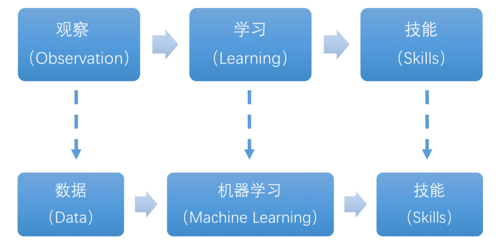

In essence, machine learning explores how computers can acquire new knowledge or skills by mimicking human learning behaviors and continuously enhancing their performance by reorganizing existing knowledge structures. Practically, it entails utilizing data to train models and leveraging these models for predictions.

For instance, consider AlphaGo, the pioneering artificial intelligence system that triumphed over human professional Go players and even world champions. AlphaGo operates on the principles of deep learning, wherein it discerns the intrinsic laws and representation layers within sample data to extract meaningful insights.

### 6.1.2 Types of Machine Learning

Machine learning can be broadly categorized into two types: supervised learning and unsupervised learning. The key distinction between these two types lies in whether the machine learning algorithm has prior knowledge of the classification and structure of the dataset.

* **Supervised Learning**

Supervised learning involves providing a labeled dataset to the algorithm, where the correct answers are known. The machine learning algorithm uses this dataset to learn how to compute the correct answers. It is the most commonly used type of machine learning.

For instance, in image recognition, a large dataset of dog pictures can be provided, with each picture labeled as **"dog"**. This labeled dataset serves as the **"correct answer"**. By learning from this dataset, the machine can develop the ability to recognize dogs in new images.

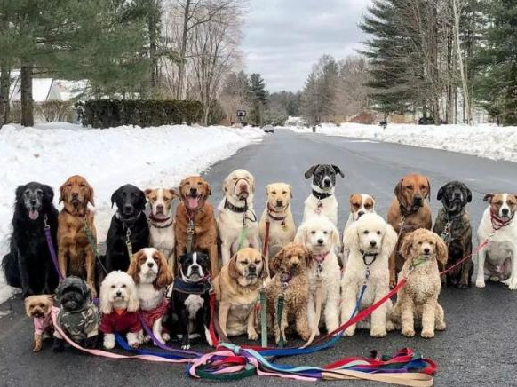

Model Selection: In supervised learning, selecting the right model to represent the data relationship is crucial. Common supervised learning models encompass linear regression, logistic regression, decision trees, support vector machines (SVM), and deep neural networks. The choice of model hinges on the data's characteristics and the problem's nature.

Feature Engineering: Feature engineering involves preprocessing and transforming raw data to extract valuable features. This encompasses tasks like data cleaning, handling missing values, normalization or standardization, feature selection, and feature transformation. Effective feature engineering can significantly enhance model performance and generalization capabilities.

Training and Optimization: Leveraging labeled training data, we can train the model to capture the data relationship. Training typically involves defining a loss function, selecting an appropriate optimization algorithm, and iteratively adjusting model parameters to minimize the loss function. Common optimization algorithms include gradient descent and stochastic gradient descent.

Model Evaluation: Upon completing training, evaluating the model's performance on new data is essential. Standard evaluation metrics include accuracy, precision, recall, F1 score, and ROC curve. Assessing a model's performance enables us to gauge its suitability for practical applications.

In summary, supervised learning entails utilizing labeled training data to train a model for predicting or classifying new unlabeled data. Key steps encompass selecting an appropriate model, conducting feature engineering, training and optimizing the model, and evaluating its performance. Together, these components constitute the foundational elements of supervised learning.

* **Unsupervised Learning**

Unsupervised learning involves providing an unlabeled dataset to the algorithm, where the correct answers are unknown. In this type of machine learning, the machine must mine potential structural relationships within the dataset.

For instance, in image classification, a large dataset of cat and dog pictures can be provided without any labels. Through unsupervised learning, the machine can learn to divide the pictures into two categories: cat pictures and dog pictures.

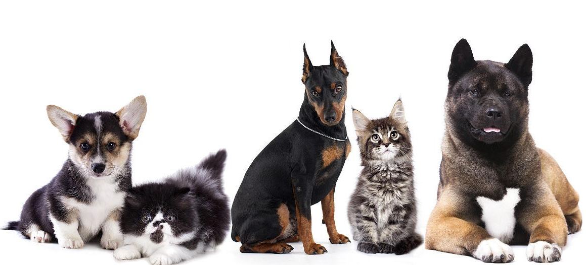

### 6.1.3 Common Type of Machine Learning Framework

There are a large variety of machine learning frameworks. Among them, PyTorch, Tensorflow, MXNet and paddlepaddle are common.

* **PyTorch**

PyTorch is a powerful open-source machine learning framework, originally based on the BSD License Torch framework. It supports advanced multidimensional array operations and is widely used in the field of machine learning. PyTorch, built on top of Torch, offers even greater flexibility and functionality. One of its most distinguishing features is its support for dynamic computational graphs and its Python interface.

In contrast to TensorFlow's static computation graph, PyTorch's computation graph is dynamic. This allows for real-time modifications to the graph as computational needs change. Additionally, PyTorch enables developers to accelerate tensor calculations using GPUs, create dynamic computational graphs, and automatically calculate gradients. This makes PyTorch an ideal choice for machine learning tasks that require flexibility, speed, and powerful computing capabilities.


* **Tensorflow**

TensorFlow is a powerful open-source machine learning framework that allows users to quickly construct neural networks and train, evaluate, and save them. It provides an easy and efficient way to implement machine learning and deep learning concepts. TensorFlow combines computational algebra with optimization techniques to make the calculation of many mathematical expressions easier.

One of TensorFlow's key strengths is its ability to run on machines of varying sizes and types, including supercomputers, embedded systems, and everything in between. TensorFlow can also utilize both CPU and GPU computing resources, making it an extremely versatile platform. When it comes to industrial deployment, TensorFlow is often the most suitable machine learning framework due to its robustness and reliability. In other words, TensorFlow is an excellent choice for deploying machine learning applications in a production environment.


* **PaddlePaddle**

PaddlePaddle is a cutting-edge deep learning framework developed by Baidu, which integrates years of research and practical experience in deep learning. PaddlePaddle offers a comprehensive set of features, including training and inference frameworks, model libraries, end-to-end development kits, and a variety of useful tool components. It is the first open-source, industry-level deep learning platform to be developed in China, offering rich and powerful features to developers worldwide.

Deep learning has proven to be a powerful tool in many machine learning applications in recent years. From image recognition and speech recognition to natural language processing, robotics, online advertising, automatic medical diagnosis, and finance, deep learning has revolutionized the way we approach these fields. With PaddlePaddle, developers can harness the power of deep learning to create innovative and cutting-edge applications that meet the needs of users and businesses alike.


* **MXNet**

MXNet is a top-tier deep learning framework that supports multiple programming languages, including Python, C++, Scala, R, and more. It features a dataflow graph similar to other leading frameworks like TensorFlow and Theano, as well as advanced features such as robust multi-GPU support and high-level model building blocks comparable to Lasagne and Blocks. MXNet can run on virtually any hardware, including mobile phones, making it a versatile choice for developers.


MXNet is specifically designed for efficiency and flexibility, with accelerated libraries that enable developers to leverage the full power of GPUs and cloud computing. It also supports distributed computing across dynamic cloud architectures via distributed parameter servers, achieving near-linear scaling with multiple GPUs/CPUs. Whether you're working on a small-scale project or a large-scale deep learning application, MXNet provides the tools and support you need to succeed.

<p id="anchor_6_2"></p>

## 6.2 Machine Learning Application

### 6.2.1 GPU Acceleration

* **GPU Accelerated Computing**

A graphics processing unit (GPU) is a specialized micro processor used to process image in personal computers, workstations, game consoles and mobile devices (phone and tablet). Similar to CPU, but CPU is designed to implement complex mathematical and geometric calculations which are essential for graphics rendering.

GPU-accelerated computing is the employment of a graphics processing unit (GPU) along with a computer processing unit (CPU) in order to accelerate science, analytics, engineering, consumer and cooperation applications. Moreover, GPU can facilitate the applications on various platforms, including vehicles, phones, tablets, drones and robots.

* **Comparison between GPU and CPU**

The main difference between CPU and GPU is how they handle the tasks. CPU consists of several cores optimized for sequential processing. While GPU owns a large parallel computing architecture composed of thousands of smaller and more effective cores tailored for multitasking simultaneously.

GPU stands out for thousands of cores and large amount of high-speed memory, and is initially intended for processing game and computer image. It is adept at parallel computing which is ideal for image processing, because the pixels are relatively independent. And the GPU provides a large number of cores to perform parallel processing on multiple pixels at the same time, but it only improves throughput without alleviating the delay. For example, when receives one message, it will use only one core to tackle this message although it has thousands of cores. GPU cores are usually employed to complete operations related to image processing, which is not universal as CPU.

* **Advantage of GPU**

GPU is excellent in massive parallel operations, hence it has an important role in deep learning. Deep learning relies on neural network that is utilized to analyze massive data at high speed.

For example, if you want to let this network recognize the cat, you need to show it lots of the pictures of cats. And that is the forte of GPU. Besides, GPU consumes less resources than CPU.

### 6.2.2 TensorRT Acceleration

* **TensorRT Introduction**

TensorRT is a high-performance deep learning inference, includes a deep learning inference optimizer and runtime that delivers low latency and high throughput for inference applications. It is deployed to hyperscale data centers, embedded platforms, or automotive product platforms to accelerate the inference.

TensoRT supports almost all deep learning frameworks, such as TensorFlow, Caffe, Mxnet and Pytorch. Combing with new NVIDIA GPU, TensorRT can realize swift and effective deployment and inference on almost all frameworks.

To accelerate deployment inference, multiple methods to optimize the models are proposed, such as model compression, pruning, quantization and knowledge distillation. And we can use the above methods to optimize the models during training, however TensorRT optimize the trained models. It improves the model efficiency through optimizing the network computation graph.

After the network is trained, you can directly put the model training file into tensorRT without relying on deep learning framework.

* **Optimization Methods**


TensorRT has the following optimization strategies:

(1) Precision Calibration

(2) Layer & Tensor Fusion

(3) Kernel Auto-Tuning

(4) Dynamic Tenser Memory

(5) Multi-Stream Execution

* **Precision Calibration**

In the training phase of neural networks across most deep learning frameworks, network tensors commonly employ 32-bit floating-point precision (FP32). Following training, since backward propagation is unnecessary during deployment inference, there is an opportunity to judiciously decrease data precision, for instance, by transitioning to FP16 or INT8. This reduction in data precision has the potential to diminish memory usage and latency, leading to a more compact model size.

The table below provides an overview of the dynamic range for different precision:

| **Precision** | **Dynamic Range** |
|:-------------:|:---------------------:|
| FP32 | −3.4×1038 ~ +3.4×1038 |
| FP16 | −65504 ~- +65504 |
| INT8 | −128 ~ +127 |

INT8 is limited to 256 distinct numerical values. When INT8 is employed to represent values with FP32 precision, information loss is certain, resulting in a decline in performance. Nevertheless, TensorRT provides a fully automated calibration process to optimally align performance by converting FP32 precision data to INT8 precision, thereby minimizing performance loss.

* **Layer & Tensor Fusion**

While CUDA cores efficiently compute tensor operations, a significant amount of time is still spent on the initialization of CUDA cores and read/write operations for each layer's input/output tensors. This results in GPU resource wastage and creates a bottleneck in memory bandwidth.

TensorRT optimizes the model structure by horizontally or vertically merging layers, reducing the number of layers and consequently decreasing the required CUDA core count, achieving structural optimization.

Horizontal merging combines convolution, bias, and activation layers into a unified CBR structure, utilizing only one CUDA core. Vertical merging consolidates layers with identical structures but different weights into a broader layer, also using only one CUDA core.

Moreover, in cases of multi-branch merging, TensorRT can eliminate concat layers by directing layer outputs to the correct memory address without copying, thereby reducing memory access frequency.

* **Kernel Auto-Tuning**

During the inference calculation process, the neural network model utilizes the GPU's CUDA cores for computation. TensorRT can adjust the CUDA cores based on different algorithms, network models, and GPU platforms, ensuring that the current model can perform computational operations with optimal performance on specific platforms.

* **Dynamic Tenser Memory**

During the utilization of each Tensor, TensorRT allocates dedicated GPU memory to prevent redundant memory requests, thereby reducing memory consumption and enhancing the efficiency of memory reuse.

* **Multi-Stream Execution**

By leveraging CUDA Streams, parallel computation is achieved for multiple branches of the same input, maximizing the potential for parallel operations.

### 6.2.3 Yolov5 Model

* **Yolo Model Series Introduction**

(1) YOLO Series

YOLO (You Only Look Once) is an one-stage regression algorithm based on deep learning.

R-CNN series algorithm dominates target detection domain before YOLOv1 is released. It has higher detection accuracy, but cannot achieve real-time detection due to its limited detection speed engendered by its two-stage network structure.

To tackle this problem, YOLO is released. Its core idea is to redefine target detection as a regression problem, use the entire image as network input, and directly return position and category of Bounding Box at output layer. Compared with traditional methods for target detection, it distinguishes itself in high detection speed and high average accuracy.

(2) YOLOv5

YOLOv5 is an optimized version based on previous YOLO models, whose detection speed and accuracy is greatly improved.

In general, a target detection algorithm is divided into 4 modules, namely input end, reference network, Neck network and Head output end. The following analysis of improvements in YOLOv5 rests on these four modules.

① Input end: YOLOv5 employs Mosaic data enhancement method to increase model training speed and network accuracy at the stage of model training. Meanwhile, adaptive anchor box calculation and adaptive image scaling methods are proposed.

②  Reference network: Focus structure and CPS structure are introduced in YOLOv5.

③ Neck network: same as YOLOv4, Neck network of YOLOv5 adopts FPN+PAN structure, but they differ in implementation details.

④ Head output layer: YOLOv5 inherits anchor box mechanism of output layer from YOLOv4. The main improvement is that loss function GIOU_Loss, and DIOU_nms for prediction box screening are adopted.

* **YOLOv5 Model Structure**

(1) Component

① Convolution layer: extract features of the image

Convolution refers to the effect of a phenomenon, action or process that occurs repeatedly over time, impacting the current state of things. Convolution can be divided into two components: **"volume"** and **"accumulation"**. **"Volume"** involves data flipping, while **"accumulation"** refers to the accumulation of the influence of past data on current data. Flipping the data helps to establish the relationships between data points, providing a reference for calculating the influence of past data on the current data.

In YOLOv5, the data being processed is typically an image, which is two-dimensional in computer vision. Therefore, the convolution applied is also a two-dimensional convolution, with the aim of extracting features from the image. The convolution kernel is an unit area used for each calculation, typically in pixels. The kernel slides over the image, with the size of the kernel being manually set.

During convolution, the periphery of the image may remain unchanged or be expanded as needed, and the convolution result is then placed back into the corresponding position in the image. For instance, if an image has a resolution of 6×6, it may be first expanded to a 7×7 image, and then substituted into the convolution kernel for calculation. The resulting data is then refilled into a blank image with a resolution of 6×6.


② Pooling layer: enlarge the features of image

The pooling layer is an essential part of a convolutional neural network and is commonly used for downsampling image features. It is typically used in combination with the convolutional layer. The purpose of the pooling layer is to reduce the spatial dimension of the feature map and extract the most important features.

There are different types of pooling techniques available, including global pooling, average pooling, maximum pooling, and more. Each technique has its unique effect on the features extracted from the image.


Maximum pooling can extract the most distinctive features from an image, while discarding the remaining ones. For example, if we take an image with a resolution of 6×6 pixels, we can use a 2×2 filter to downsample the image and obtain a new image with reduced dimensions.


③ Upsampling layer: restore the size of an image

This process is sometimes referred to as **"anti-pooling"**. While upsampling restores the size of the image, it does not fully recover the features that were lost during pooling. Instead, it tries to interpolate the missing information based on the available information.

For example, let's consider an image with a resolution of 6×6 pixels. Before upsampling, use 3X3 filter to calculate the original image so as to get the new image.


④ Batch normalization layer: organize data

It aims to reduce the computational complexity of the model and to ensure that the data is better mapped to the activation function.

Batch normalization works by standardizing the data within each mini-batch, which reduces the loss of information during the calculation process. By retaining more features in each calculation, batch normalization can improve the sensitivity of the model to the data.

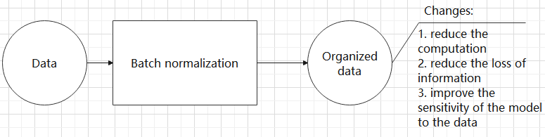

⑤ RELU layer: activate function

The activation function is a crucial component in the process of building a neural network, as it helps to increase the nonlinearity of the model. Without an activation function, each layer of the network would be equivalent to a matrix multiplication, and the output of each layer would be a linear function of the input from the layer above. This would result in a neural network that is unable to learn complex relationships between the input and output.

There are many different types of activation functions. Some of the most common activation functions include the ReLU, Tanh, and Sigmoid. For example, ReLU is a piecewise function that replaces all values less than zero with zero, while leaving positive values unchanged.


⑥ ADD layer: add tensor

In a typical neural network, the features can be divided into two categories: salient features and inconspicuous features.


⑦ Concat layer: splice tensor

It is used to splice together tensors of features, allowing for the combination of features that have been extracted in different ways. This can help to increase the richness and complexity of the feature set.


* **Compound Element**

When building a model, using only the layers mentioned above to construct functions can lead to lengthy, disorganized, and poorly structured code. By assembling basic elements into various units and calling them accordingly, the efficiency of writing the model can be effectively improved.

(1) Convolutional unit:

A convolutional unit consists of a convolutional layer, a batch normalization layer, and an activation function. The convolution is performed first, followed by batch normalization, and finally activated using an activation function.


(2) Focus module

The Focus module for interleaved sampling and concatenation first divides the input image into multiple large regions and then concatenates the small images at the same position within each region to break down the input image into several smaller images. Finally, the images are preliminarily sampled using convolutional units.

As shown in the figure below, taking an image with a resolution of 6×6 as an example, if we set a large region as 2×2, then the image can be divided into 9 large regions, each containing 4 small images.

By concatenating the small images at position 1 in each large region, a 3×3 image can be obtained. The small images at other positions are similarly concatenated, and the original 6×6 image will be broken down into four 3×3 images.


(3) Residual unit

The function of the residual unit is to enable the model to learn small changes in the image. Its structure is relatively simple and is achieved by combining data from two paths.

The first path uses two convolutional units to sample the image, while the second path does not use convolutional units for sampling but directly uses the original image. Finally, the data from the first path is added to the second path.


(4) Composite Convolution Unit

In YOLOv5, the composite convolution unit is characterized by the ability to customize the convolution unit according to requirements. The composite convolution unit is also realized by superimposing data obtained from two paths.

The first path only has one convolutional layer for sampling, while the second path has 2x+1 convolutional units and one convolutional layer for sampling. After sampling and splicing, the data is organized through batch normalization and then activated by an activation function. Finally, a convolutional layer is used for sampling.


(5) Compound Residual Convolutional Unit

The compound residual convolutional unit replaces the 2x convolutional layers in the compound convolutional unit with x residual units. In YOLOv5, the feature of the compound residual unit is mainly that the residual units can be customized according to the needs.


(6) Composite Pooling Unit

The output data of the convolutional unit is fed into three max pooling layers and an additional copy is kept without processing. Then, the data from the four paths are concatenated and input into a convolutional unit. Using the composite pooling unit to process the data can significantly enhance the features of the original data.


* **Structure**

Composed of three parts, YOLOv5 can output three sizes of data. Data of each size is processed in different way. The below picture is the output structure of YOLOv5.


Below is the output structures of data of three sizes.

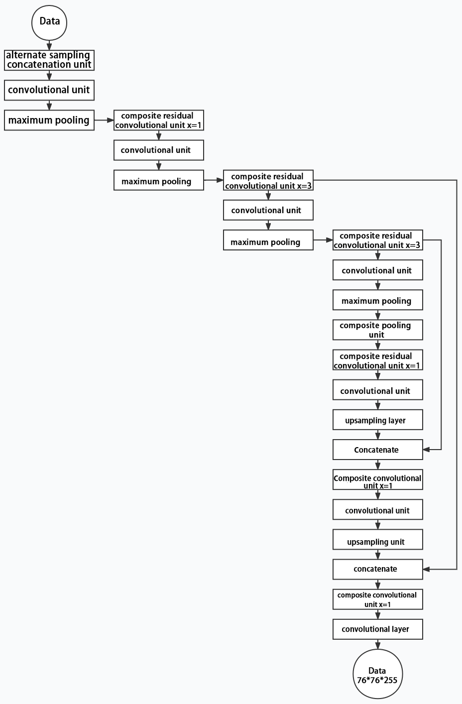

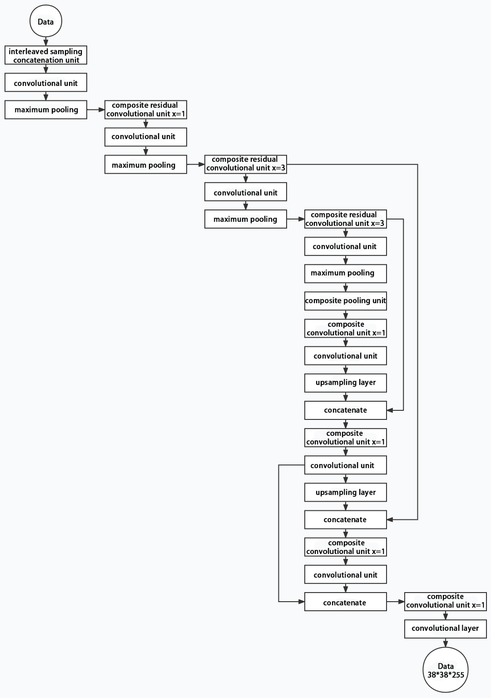

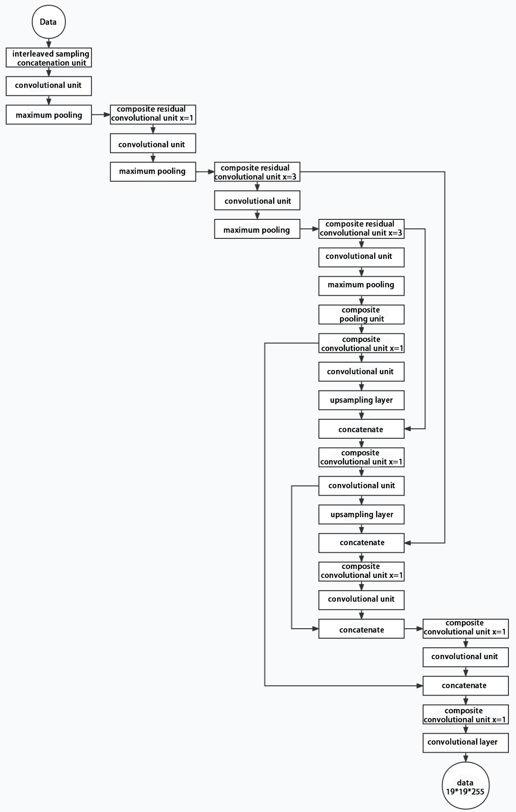

### 6.2.4 YOLOv5 Running Procedure

In this section, we provide an explanation of the model workflow using the anchor boxes, prediction boxes, and prior boxes employed in YOLOv5.

* **Prior Bounding Box**

When an image is input into model, object detection area requires us to offer, while prior bounding box is that box used to mark the object detection area on image before detection.


* **Prediction Box**

The prediction box is not required to set manually, which is the output result of the model. When the first batch of training data is input into model, the prediction box will be automatically generated with it. The position in which the object of same type appear more frequently are set as the center of the prediction box.


* **Anchor Box**

After the prediction box is generated, deviation may occur in its size and position. At this time, the anchor box serves to calibrate the size and position of the prediction box.

The generation position of anchor box is determined by prediction box. In order to influence the position of the next generation of the prediction box, the anchor box is generated at the relative center of the existing prediction box.


* **Realization Process**

After the data is calibrated, a prior bounding box appears on image. Then, the image data is input to the model, the model generates a prediction box based on the position of the prior bounding box. Having generated the prediction box, an anchor box will appear automatically. Lastly, the weights from this training are updated into model.

Each newly generated prediction will be influenced by the last generated anchor box. Repeating the operations above continuously, the deviation of the size and position of the prediction box will be gradually erased until it coincides with the priori box.


## 6.3 MediaPipe Man-Robot Interaction

### 6.3.1 MediaPipe Introduction

* **MediaPipe Description**

MediaPipe is an open-source framework of multi-media machine learning models. Cross-platform MediaPipe can run on mobile devices, workspace and servers, as well as support mobile GPU acceleration. It is also compatible with TensorFlow and TF Lite Inference Engine, and all kinds of TensorFlow and TF Lite models can be applied on it. Besides, MediaPipe supports [GPU](https://so.csdn.net/so/search?q=GPU&spm=1001.2101.3001.7020) acceleration of mobile and embedded platform.


* **MediaPipe Pros and Cons**

(1) MediaPipe Pros

① MediaPipe supports various platforms and languages, including iOS, Android, C++, Python, JAVAScript, Coral, etc.

② Swift running. Models can run in real-time.

③  Models and codes are with high reuse rate.

(2) MediaPipe Cons

① For mobile devices, MediaPipe will occupy 10M or above.

② As it greatly depends on Tensorflow, you need to alter large amount of codes if you want to change it to other machine learning frameworks, which is not friendly to machine learning developer.

③ It adopts static image which can improve efficiency, but make it difficult to find out the errors.

* **How to use MediaPipe**

The figure below shows how to use MediaPipe. The solid line represents the part to coded, and the dotted line indicates the part not to coded. MediaPipe can offer the result and the function realization framework quickly.


* **Dependency**

MediaPipe utilizes OpenCV to process video, and uses [FFMPEG](https://www.ffmpeg.org/) to process audio data. Furthermore, it incorporates other essential dependencies, including OpenGL/Metal, Tensorflow, and Eigen.

For seamless usage of MediaPipe, we suggest gaining a basic understanding of OpenCV.

* **MediaPipe Solutions**

Solutions is based on the open-source pre-constructed sample of TensorFlow or TFLite. MediaPipe Solutions is built upon a framework, which provides 16 Solutions, including face detection, Face Mesh, iris, hand, posture, human body and so on.

* **MediaPipe Learning Resources**

MediaPipe website：[https://developers.google.com/mediapipe](https://developers.google.com/mediapipe)

MediaPipe Wiki：[http://i.bnu.edu.cn/wiki/index.php?title=Mediapipe](http://i.bnu.edu.cn/wiki/index.php?title=Mediapipe)

MediaPipe github：[https://github.com/google/mediapipe](https://github.com/google/mediapipe)

Dlib website: [http://dlib.net/](http://dlib.net/)

dlib github: [https://github.com/davisking/dlib](https://github.com/davisking/dlib)

### 6.3.2 Image Background Segmentation

This lesson provides instructions on utilizing MediaPipe's selfie segmentation model to accurately segment trained models, such as human faces and hands, from their backgrounds. Once separated, you can easily add virtual backgrounds to these models.

* **Program Logic**

To begin, import the selfie segmentation model from MediaPipe and subscribe to the corresponding topic to access the live camera feed.

Next, flip the image and apply the segmentation to the background image. For improved boundary segmentation, implement dual-border segmentation.

Finally, complete the process by replacing the background with a virtual background.

* **Operation Steps**

:::{Note}
The input command should be case sensitive, and keywords can be complemented using Tab key.
:::

(1) Start the robot, and enter the robot system desktop using NoMachine.

(2) Click-on  to open the command-line terminal.

(3) Run the command to disable app auto-start app service.

```
sudo systemctl stop start_app_node.service
```

(4) Execute the command to enable the camera node.

Depth camera:

```
ros2 launch peripherals depth_camera.launch.py
```

Monocular camera:

```
ros2 launch peripherals usb_cam.launch.py
```

(5) Enter the command and hit Enter key to run the game program.

```
cd ~/ros2_ws/src/example/example/mediapipe_example && python3 self_segmentation.py
```

(6) To close this feature, press the **'Esc'** key to exit the camera image interface.

(7) Next, press **"Ctrl+C"** in the terminal. If it fails to close, please try again.

* **Program Outcome**

Once the feature is activated, the screen changes to a gray virtual background, and when a hand enters the frame, it is automatically separated from the background.


* **Program Analysis**

The source code of this program locates in:

[/ros2_ws/src/example/example/mediapipe_example/self_segmentation.py](../_static/source_code/mediapipe_example.zip)

* **Function**

Main:

{lineno-start=81}
```python
def main():
    node = SegmentationNode('self_segmentation')
    try:
        rclpy.spin(node)
    except KeyboardInterrupt:
        node.destroy_node()
        rclpy.shutdown()
        print('shutdown')
    finally:
        print('shutdown finish')
```

Used to start the background control node.

* **Class**

SegmentationNode：

{lineno-start=14}
```python
class SegmentationNode(Node):
    def __init__(self, name):
        rclpy.init()
        super().__init__(name)
        self.running = True
        self.bridge = CvBridge()
        self.mp_selfie_segmentation = mp.solutions.selfie_segmentation
        self.mp_drawing = mp.solutions.drawing_utils
        self.fps = fps.FPS()
        self.image_queue = queue.Queue(maxsize=2)
        self.BG_COLOR = (192, 192, 192)  # gray
        self.image_sub = self.create_subscription(Image, '/depth_cam/rgb/image_raw', self.image_callback, 1)
        self.get_logger().info('\033[1;32m%s\033[0m' % 'start')
        threading.Thread(target=self.main, daemon=True).start()
```

Init：

{lineno-start=15}
```python
    def __init__(self, name):
        rclpy.init()
        super().__init__(name)
        self.running = True
        self.bridge = CvBridge()
        self.mp_selfie_segmentation = mp.solutions.selfie_segmentation
        self.mp_drawing = mp.solutions.drawing_utils
        self.fps = fps.FPS()
        self.image_queue = queue.Queue(maxsize=2)
        self.BG_COLOR = (192, 192, 192)  # gray
        self.image_sub = self.create_subscription(Image, '/depth_cam/rgb/image_raw', self.image_callback, 1)
        self.get_logger().info('\033[1;32m%s\033[0m' % 'start')
```

Initialize the parameters required for background segmentation, call the image callback function, and start the model recognition function.

`image_callback`：

{lineno-start=29}
```python
    def image_callback(self, ros_image):
        cv_image = self.bridge.imgmsg_to_cv2(ros_image, "rgb8")
        rgb_image = np.array(cv_image, dtype=np.uint8)
        if self.image_queue.full():
            # 如果队列已满，丢弃最旧的图像(if the queue is full, discard the oldest image)
            self.image_queue.get()
            # 将图像放入队列(put the image into the queue)
        self.image_queue.put(rgb_image)
```

Image callback function, used to read data from the camera node and enqueue it.

Main:

{lineno-start=39}
```python
    def main(self):
        with self.mp_selfie_segmentation.SelfieSegmentation(
            model_selection=1) as selfie_segmentation:
            bg_image = None
            while self.running:
                try:
                    image = self.image_queue.get(block=True, timeout=1)
                except queue.Empty:
                    if not self.running:
                        break
                    else:
                        continue
                # To improve performance, optionally mark the image as not writeable to
                # pass by reference.
                image.flags.writeable = False
                results = selfie_segmentation.process(image)
                image.flags.writeable = True
                image = cv2.cvtColor(image, cv2.COLOR_RGB2BGR)
                # Draw selfie segmentation on the background image.
                # To improve segmentation around boundaries, consider applying a joint
                # bilateral filter to "results.segmentation_mask" with "image".
                condition = np.stack(
                        (results.segmentation_mask,) * 3, axis=-1) > 0.1
                # The background can be customized.
                #   a) Load an image (with the same width and height of the input image) to
                #      be the background, e.g., bg_image = cv2.imread('/path/to/image/file')
                #   b) Blur the input image by applying image filtering, e.g.,
                #      bg_image = cv2.GaussianBlur(image,(55,55),0)
                if bg_image is None:
                  bg_image = np.zeros(image.shape, dtype=np.uint8)
                  bg_image[:] = self.BG_COLOR
                output_image = np.where(condition, image, bg_image)
                self.fps.update()
                result_image = self.fps.show_fps(output_image)
                cv2.imshow('MediaPipe Selfie Segmentation', result_image)
                key = cv2.waitKey(1)
                if key == ord('q') or key == 27:  # 按q或者esc退出(press q or esc to exit)
                    break
        cv2.destroyAllWindows()
        rclpy.shutdown()
```

Load the model from MediaPipe, input the image, and display the output image using OpenCV.

### 6.3.3 3D Object Detection

* **Program Logic**

To get started, import the 3D Objectron module from MediaPipe, and subscribe to the topic message to receive the real-time camera image.

Next, flip the image to ensure proper alignment for 3D object detection.

Finally, draw the 3D boundary frame on the image.

* **Operation Steps**

(1) Start the robot, and enter the robot system desktop using NoMachine.

(2) Click-on  to open the command-line terminal.

(3) Run the command to disable app auto-start app service.

```
sudo systemctl stop start_app_node.service
```

(4) Execute the following command to enable the camera node:

Depth camera:

```
ros2 launch peripherals depth_camera.launch.py
```

Monocular camera:

```
ros2 launch peripherals usb_cam.launch.py
```

(5) In a new command line terminal, enter the command and press Enter to run the game program:

```
cd ~/ros2_ws/src/example/example/mediapipe_example && python3 objectron.py
```

(6) To close this game, press the **"Esc"** key in the image interface to exit the camera image interface.

(7) Press **"Ctrl+C"** in the command line terminal interface. If the closure fails, please try again repeatedly.

* **Program Outcome**

Once the game starts, the 3D frame will be drawn around the boundary of the recognized object. The system can identify several objects, including a cup (with handle), shoe, chair, and camera.


* **Program Analysis**

The program file corresponding to this section of the course documentation is located at: [/ros2_ws/src/example/example/mediapipe_example/objectron.py](../_static/source_code/mediapipe_example.zip)

Function

Main:

{lineno-start=76}
```python
def main():
    node = ObjectronNode('objectron')
    try:
        rclpy.spin(node)
    except KeyboardInterrupt:
        node.destroy_node()
        rclpy.shutdown()
        print('shutdown')
    finally:
        print('shutdown finish')
```

Used to initiate 3D detection node.

Class

ObjectronNode：

{lineno-start=14}
```python
class ObjectronNode(Node):
```

Init：

{lineno-start=15}
```python
    def __init__(self, name):
        rclpy.init()
        super().__init__(name)
        self.running = True
        self.bridge = CvBridge()
        self.mp_objectron = mp.solutions.objectron
        self.mp_drawing = mp.solutions.drawing_utils
        self.fps = fps.FPS()
        self.image_queue = queue.Queue(maxsize=2)
        self.image_sub = self.create_subscription(Image, '/depth_cam/rgb/image_raw', self.image_callback, 1)
        self.get_logger().info('\033[1;32m%s\033[0m' % 'start')
        threading.Thread(target=self.main, daemon=True).start()
```

Initialize the parameters required for 3D recognition, call the image callback function, and start the model recognition function.

`image_callback`：

{lineno-start=28}
```python
    def image_callback(self, ros_image):
        cv_image = self.bridge.imgmsg_to_cv2(ros_image, "rgb8")
        rgb_image = np.array(cv_image, dtype=np.uint8)
        if self.image_queue.full():
            # 如果队列已满，丢弃最旧的图像
            self.image_queue.get()
            # 将图像放入队列
        self.image_queue.put(rgb_image)
```

Image callback function, used to read data from the camera node and enqueue it.

Main ：

{lineno-start=37}
```python
    def main(self):
        with self.mp_objectron.Objectron(static_image_mode=False,
                                max_num_objects=1,
                                min_detection_confidence=0.4,
                                min_tracking_confidence=0.5,
                                model_name='Cup') as objectron:
            while self.running:
                try:
                    image = self.image_queue.get(block=True, timeout=1)
                except queue.Empty:
                    if not self.running:
                        break
                    else:
                        continue
                # To improve performance, optionally mark the image as not writeable to
                # pass by reference.
                image.flags.writeable = False
                results = objectron.process(image)

                # Draw the box landmarks on the image.
                image.flags.writeable = True
                image = cv2.cvtColor(image, cv2.COLOR_RGB2BGR)
                if results.detected_objects:
                    for detected_object in results.detected_objects:
                        self.mp_drawing.draw_landmarks(
                          image, detected_object.landmarks_2d, self.mp_objectron.BOX_CONNECTIONS)
                        self.mp_drawing.draw_axis(image, detected_object.rotation,
                                             detected_object.translation)
                self.fps.update()
                result_image = self.fps.show_fps(cv2.flip(image, 1))
                # Flip the image horizontally for a selfie-view display.
                cv2.imshow('MediaPipe Objectron', result_image)
                key = cv2.waitKey(1)
                if key == ord('q') or key == 27:  # 按q或者esc退出(press q or esc to exit)
                    break

        cv2.destroyAllWindows()
        rclpy.shutdown()
```

Read the model inside MediaPipe, input the image, draw the edges of the objects after obtaining the output image, and display using OpenCV.

### 6.3.4 Face Detection

In this lesson, we'll use MediaPipe's face detection model to detect faces in the frame. MediaPipe's face detection is an ultra-fast solution that supports multiple faces and identifies 6 key landmarks. It's built on BlazeFace, a lightweight and highly efficient face detector optimized for mobile GPU inference.

* **Program Logic**

To begin, import the human face detection model from MediaPipe and subscribe to the relevant topic message to obtain the live camera feed.

Next, utilize OpenCV to flip the image and convert the color space for further processing.

Then, using the face detection model's minimum confidence threshold, determine whether a human face has been successfully detected. If a human face is recognized, proceed to collect the necessary information about each detected face, including the bounding frame and the 6 key points (right eye, left eye, nose tip, right ear, and left ear).

Finally, frame the human face and mark the 6 key points on each detected face for visual clarity and further analysis.

* **Operation Steps**

(1) Start the robot, and enter the robot system desktop using NoMachine.

(2) Click-on  to start the command-line terminal.

(3) Run the command to disable app auto-start app service.

```
sudo systemctl stop start_app_node.service
```

(4) Execute the command to enable the camera node:

Depth camera:

```
ros2 launch peripherals depth_camera.launch.py
```

Monocular camera:

```
ros2 launch peripherals usb_cam.launch.py
```

(5) In a new command line terminal, enter the command and press Enter to run the game program:

```
cd ~/ros2_ws/src/example/example/mediapipe_example && python3 face_detect.py
```

(6) If you need to close this game, you need to press the **"Esc"** key in the image interface to exit the camera image interface.

(7) Then press **"Ctrl+C"** in the command line terminal interface. If closing fails, please try again.

* **Program Outcome**

After the game starts, depth camera will start detecting human face, and human face will framed on the live camera feed.


* **Program Analysis**

The source code of this program is saved in ：[/ros2_ws/src/example/example/mediapipe_example/face_detect.py](../_static/source_code/mediapipe_example.zip)

Function

Main：

{lineno-start=67}
```python
def main():
    node = FaceDetectionNode('face_detection')
    try:
        rclpy.spin(node)
    except KeyboardInterrupt:
        node.destroy_node()
        rclpy.shutdown()
        print('shutdown')
    finally:
        print('shutdown finish')
```

Used to initiate face detection node.

Class

FaceDetectionNode：

{lineno-start=18}
```python
class FaceDetectionNode(Node):
```

Init：

{lineno-start=19}
```python
    def __init__(self, name):
        rclpy.init()
        super().__init__(name)
        self.running = True
        self.bridge = CvBridge()
        model_path = os.path.join(os.path.abspath(os.path.split(os.path.realpath(__file__))[0]), 'model/detector.tflite')
        base_options = python.BaseOptions(model_asset_path=model_path)
        options = vision.FaceDetectorOptions(base_options=base_options)
        self.detector = vision.FaceDetector.create_from_options(options)
        self.fps = fps.FPS()
        self.image_queue = queue.Queue(maxsize=2)
        self.image_sub = self.create_subscription(Image, '/depth_cam/rgb/image_raw', self.image_callback, 1)
        self.get_logger().info('\033[1;32m%s\033[0m' % 'start')
        threading.Thread(target=self.main, daemon=True).start()
```

Initialize the parameters required for face recognition, call the image callback function, and start the model recognition function.

`image_callback`：

{lineno-start=34}
```python
    def image_callback(self, ros_image):
        cv_image = self.bridge.imgmsg_to_cv2(ros_image, "rgb8")
        rgb_image = np.array(cv_image, dtype=np.uint8)
        if self.image_queue.full():
            # 如果队列已满，丢弃最旧的图像(if the queue is full, discard the oldest image)
            self.image_queue.get()
            # 将图像放入队列(put the image into the queue)
        self.image_queue.put(rgb_image)
```

Image callback function, used to read data from the camera node and enqueue it.

Main:

{lineno-start=43}
```python
    def main(self):
        while self.running:
            try:
                image = self.image_queue.get(block=True, timeout=1)
            except queue.Empty:
                if not self.running:
                    break
                else:
                    continue
            image = cv2.flip(image, 1)
            mp_image = mp.Image(image_format=mp.ImageFormat.SRGB, data=image)
            detection_result = self.detector.detect(mp_image)

            annotated_image = visualize(image, detection_result)
            self.fps.update()
            result_image = self.fps.show_fps(cv2.cvtColor(annotated_image, cv2.COLOR_RGB2BGR))
            cv2.imshow('face_detection', result_image)
            key = cv2.waitKey(1)
            if key == ord('q') or key == 27:  # 按q或者esc退出(press q or esc to exit)
              break

        cv2.destroyAllWindows()
        rclpy.shutdown()
```

Read the model from MediaPipe, input the image, and after obtaining the output image, use OpenCV to draw the facial keypoints and display the feedback image.

### 6.3.5 3D Face Detection

In this program, MediaPipe Face Mesh is utilized to detect human face within the camera image.

MediaPipe Face Mesh is a powerful model capable of estimating 468 3D facial features, even when deployed on a mobile device. It employs machine learning to infer the 3D face contour accurately. Additionally, this model ensures real-time detection by utilizing a lightweight model architecture and GPU acceleration.

Furthermore, this model is integrated with a face conversion module that compensates for any differences between face landmark estimation and AR (Augmented Reality) applications. It establishes a metric 3D space and utilizes the facial landmark screen positions to estimate facial conversion within this space. The facial conversion data consists of common 3D primitives, including facial gesture conversion matrices and triangle facial mesh information.

* **Program Logic**

Firstly, you need to learn that machine learning pipeline is composed of two real-time deep neural network models. The system consists of two components: a face detector that processes the entire image and calculates the locations of faces, and a 3D face landmark model that uses these locations to predict an approximate 3D surface through regression.

To achieve 3D facial landmarks, we utilize transfer learning and train a network with multiple objectives: predicting 3D landmark coordinates on synthetic rendered data and 2D semantic contours on annotated real-world data simultaneously. This approach yields plausible 3D landmark predictions not only based on synthetic data but also on real-world data.

The 3D landmark network takes cropped video frames as input without requiring additional depth input. The model outputs the location of a 3D point and the probability that a face appears in the input and is properly aligned.

Once the face mesh model is imported, real-time images can be obtained from the camera by subscribing to topic messages.

Next, image preprocessing techniques like flipping the image and converting the color space are applied. The face detection model's minimum confidence is then used to determine whether the face has been successfully detected.

Finally, the detected face on the screen is projected into a 3D grid for visualization and display.

* **Operation Steps**

(1) Start the robot, and enter the robot system desktop using NoMachine.

(2) Click-on  to open the command-line terminal.

(3) Run the command to disable app auto-start app service.

```
sudo systemctl stop start_app_node.service
```

(4) Execute the command to enable the camera node:

Depth camera:

```
ros2 launch peripherals depth_camera.launch.py
```

Monocular camera:

```
ros2 launch peripherals usb_cam.launch.py
```

(5) Enter the command in a new command-line terminal and press Enter to run the game program:

```
cd ~/ros2_ws/src/example/example/mediapipe_example && python3 face_mesh.py
```

(6) If you need to close this game, you need to press the **"Esc"** key in the image interface to exit the camera image interface.

(7) Then press **"Ctrl+C"** in the command line terminal interface. If closing fails, please try again.

* **Program Outcome**

After starting the game, when the depth camera detects a face, it will outline the face in the feedback image.

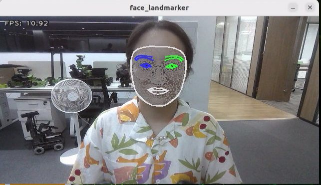

* **Program Analysis**

The source code of this program is located in

[/ros2_ws/src/example/example/mediapipe_example/face_mesh.py](../_static/source_code/mediapipe_example.zip)

* **Function**

Main：

{lineno-start=70}
```python
def main():
    node = FaceMeshNode('face_landmarker')
    try:
        rclpy.spin(node)
    except KeyboardInterrupt:
        node.destroy_node()
        rclpy.shutdown()
        print('shutdown')
    finally:
        print('shutdown finish')
```

Used to initiate the 3D face detection node.

* **Class**

FaceMeshNode：

{lineno-start=18}
```python
class FaceMeshNode(Node):
```

Init：

{lineno-start=19}
```python
    def __init__(self, name):
        rclpy.init()
        super().__init__(name)
        self.running = True
        self.bridge = CvBridge()
        model_path = os.path.join(os.path.abspath(os.path.split(os.path.realpath(__file__))[0]), 'model/face_landmarker_v2_with_blendshapes.task')
        base_options = python.BaseOptions(model_asset_path=model_path)
        options = vision.FaceLandmarkerOptions(base_options=base_options,
                                       output_face_blendshapes=True,
                                       output_facial_transformation_matrixes=True,
                                       num_faces=1)
        self.detector = vision.FaceLandmarker.create_from_options(options)

        self.fps = fps.FPS()

        self.image_queue = queue.Queue(maxsize=2)
        self.image_sub = self.create_subscription(Image, '/depth_cam/rgb/image_raw', self.image_callback, 1)
        self.get_logger().info('\033[1;32m%s\033[0m' % 'start')
        threading.Thread(target=self.main, daemon=True).start()
```

Initialize the parameters required for 3D face detection, call the image callback function, and start the model recognition function.

`image_callback`：

{lineno-start=39}
```python
    def image_callback(self, ros_image):
        cv_image = self.bridge.imgmsg_to_cv2(ros_image, "rgb8")
        rgb_image = np.array(cv_image, dtype=np.uint8)
        if self.image_queue.full():
            # 如果队列已满，丢弃最旧的图像(if the queue is full, discard the oldest image)
            self.image_queue.get()
            # 将图像放入队列(put the image into the queue)
        self.image_queue.put(rgb_image)
```

The image callback function is used to retrieve data from the camera node and encapsulate it into a queue.

Main:

{lineno-start=48}
```python
    def main(self):
        while self.running:
            try:
                image = self.image_queue.get(block=True, timeout=1)
            except queue.Empty:
                if not self.running:
                    break
                else:
                    continue
            image = cv2.flip(image, 1)
            mp_image = mp.Image(image_format=mp.ImageFormat.SRGB, data=image)
            detection_result = self.detector.detect(mp_image)
            annotated_image = draw_face_landmarks_on_image(image, detection_result)
            self.fps.update()
            result_image = self.fps.show_fps(cv2.cvtColor(annotated_image, cv2.COLOR_RGB2BGR))
            cv2.imshow('face_landmarker', result_image)
            key = cv2.waitKey(1)
            if key == ord('q') or key == 27:  # 按q或者esc退出(press q or esc to exit)
                break
        cv2.destroyAllWindows()
        rclpy.shutdown()
```

Reading the model inside MediaPipe, inputting the image, and then using OpenCV to draw facial keypoints on the output image, and display the feedback image.

### 6.3.6 Hand Key Point Detection

MediaPipe's hand detection model is employed to showcase the key points of the hand and the connecting lines of these key points on the live camera feed.

MediaPipe Hands is an advanced hand and finger detection model that delivers high-fidelity results. Through the power of machine learning (ML), it accurately infers 21 3D landmarks of the hand from a single frame.

* **Program Logic**

Firstly, it's important to understand that MediaPipe's palm detection model employs a machine learning pipeline consisting of multiple models (including a linear model). This model processes the entire image and returns an oriented hand bounding box. On the other hand, the hand landmark model operates on cropped image regions defined by the palm detectors and provides high-fidelity 3D hand keypoints.

To begin, after importing the palm detection model, we subscribe to the topic message to obtain real-time camera images.

Next, various image pre-processing steps, such as flipping the image and converting the color space, are applied. These steps significantly reduce the need for data augmentation for the hand landmark model.

Furthermore, our pipeline allows for generating crops based on hand landmarks identified in the previous frame. The palm detection is invoked only when the landmark model is unable to recognize the presence of the hand accurately.

Afterward, by comparing the minimum confidence level of the hand detection model, we determine whether the palm has been successfully detected.

Lastly, the hand keypoints are detected and drawn on the camera image to visualize the detected hand in real-time.

* **Operation Steps**

(1) Start the robot, and enter the robot system desktop using NoMachine.

(2) Click-on  to start the command-line terminal.

(3) Run the command to disable app auto-start app service.

```
sudo systemctl stop start_app_node.service
```

(4) Execute the command to enable the camera node:

Depth camera:

```
ros2 launch peripherals depth_camera.launch.py
```

Monocular camera:

```
ros2 launch peripherals usb_cam.launch.py
```

(5) Enter the command in a new command-line terminal and press Enter to run the game program:

```
cd ~/ros2_ws/src/example/example/mediapipe_example && python3 hand.py
```

(6) If you need to close this game, you need to press the **"Esc"** key in the image interface to exit the camera image interface.

(7) Then press **"Ctrl+C"** in the command line terminal interface. If closing fails, please try again.

* **Program Outcome**

Once the game starts, the depth camera will begin detecting the hand and display the hand key points on the camera image, with the key points connected.


* **Program Analysis**

The program file corresponding to this section of the course documentation is located at:

[/ros2_ws/src/example/example/mediapipe_example/hand.py](../_static/source_code/mediapipe_example.zip)

Function

Main：

{lineno-start=65}
```python
def main():
    node = HandNode('hand_landmarker')
    try:
        rclpy.spin(node)
    except KeyboardInterrupt:
        node.destroy_node()
        rclpy.shutdown()
        print('shutdown')
    finally:
        print('shutdown finish')
```

Used to initiate the 3D face detection node.

Class

HandNode：

{lineno-start=18}
```python
class HandNode(Node):
```

Init：

{lineno-start=19}
```python
    def __init__(self, name):
        rclpy.init()
        super().__init__(name)
        self.running = True
        self.bridge = CvBridge()
        model_path = os.path.join(os.path.abspath(os.path.split(os.path.realpath(__file__))[0]), 'model/hand_landmarker.task')
        base_options = python.BaseOptions(model_asset_path=model_path)
        options = vision.HandLandmarkerOptions(base_options=base_options, num_hands=2)
        self.detector = vision.HandLandmarker.create_from_options(options)
        self.fps = fps.FPS()
        self.image_queue = queue.Queue(maxsize=2)
        self.image_sub = self.create_subscription(Image, '/depth_cam/rgb/image_raw', self.image_callback, 1)
        self.get_logger().info('\033[1;32m%s\033[0m' % 'start')
        threading.Thread(target=self.main, daemon=True).start()
```

Initialize the parameters required for hand keypoint detection, call the image callback function, and start the model recognition function.

`image_callback`：

{lineno-start=34}
```python
    def image_callback(self, ros_image):
        cv_image = self.bridge.imgmsg_to_cv2(ros_image, "rgb8")
        rgb_image = np.array(cv_image, dtype=np.uint8)
        if self.image_queue.full():
            # 如果队列已满，丢弃最旧的图像(if the queue is full, discard the oldest image)
            self.image_queue.get()
            # 将图像放入队列(put the image into the queue)
        self.image_queue.put(rgb_image)
```

The image callback function is used to read data from the camera node and enqueue it.

Main:

{lineno-start=43}
```python
    def main(self):
        while self.running:
            try:
                image = self.image_queue.get(block=True, timeout=1)
            except queue.Empty:
                if not self.running:
                    break
                else:
                    continue
            image = cv2.flip(image, 1)
            mp_image = mp.Image(image_format=mp.ImageFormat.SRGB, data=image)
            detection_result = self.detector.detect(mp_image)
            annotated_image = draw_hand_landmarks_on_image(image, detection_result)
            self.fps.update()
            result_image = self.fps.show_fps(cv2.cvtColor(annotated_image, cv2.COLOR_RGB2BGR))
            cv2.imshow('hand_landmarker', result_image)
            key = cv2.waitKey(1)
            if key == ord('q') or key == 27:  # 按q或者esc退出(press q or esc to exit)
                break
        cv2.destroyAllWindows()
        rclpy.shutdown()
```

Read the model from MediaPipe, input the image, and after obtaining the output image, use OpenCV to draw the key points of the hand and display the feedback image.

### 6.3.7 Body Key Points Detection

The MediaPipe body detection model is utilized to detect key points on the human body, which are then displayed on the live camera feed. This implementation incorporates MediaPipe Pose, a high-fidelity posture tracking model that leverages BlazePose to infer 33 3D key points. Additionally, this approach offers support for the ML Kit Pose Detection API.


* **Program Logic**

Firstly, import body detection model.

Subsequently, flip over the image and convert the color space of the image. Check whether the human body is successfully detected based on the minimum confidence of the body detection model.

Next, define the tracked posture by comparing the minimum tracking confidence. If the confidence does not meet the minimum threshold, perform automatic human detection on the next input image.

In the pipeline, a detector is employed to initially localize the region of interest (ROI) corresponding to a person's pose within a frame. Subsequently, a tracker utilizes the cropped ROI frame as input to predict pose landmarks and segmentation masks within the ROI.

For video applications, the detector is invoked selectively, only when necessary. Specifically, it is used for the first frame or when the tracker fails to recognize the body pose in the preceding frame. In all other frames, the pipeline derives ROIs based on the pose landmarks detected in the previous frame.

After MediaPipe body detection model is imported, access the live camera feed through subscribing the related topic message.

Lastly, draw the key points representing the human body.

* **Operation Steps**

(1) Start the robot, and enter the robot system desktop using NoMachine.

(2) Click-on  to start the command-line terminal.

(3) Run the command to disable app auto-start app service.

```
sudo systemctl stop start_app_node.service
```

(4) Execute the command to enable the camera node:

Depth camera:

```
ros2 launch peripherals depth_camera.launch.py
```

Monocular camera:

```
ros2 launch peripherals usb_cam.launch.py
```

(5) Enter the command in a new command-line terminal and press Enter to run the game program:

```
cd ~/ros2_ws/src/example/example/mediapipe_example && python3 pose.py
```

(6) If you need to close this game, you need to press the **"Esc"** key in the image interface to exit the camera image interface.

(7) Then press **"Ctrl+C"** in the command line terminal interface. If closing fails, please try again.

* **Program Outcome**

After the game starts, depth camera will begin detecting human pose, and body key points can be displayed and connected on the live camera feed.


* **Program Analysis**

The program file is saved in:[/ros2_ws/src/example/example/mediapipe_example/pose.py](../_static/source_code/mediapipe_example.zip)

* **Function**

Main：

{lineno-start=67}
```python
def main():
    node = PoseNode('pose_landmarker')
    try:
        rclpy.spin(node)
    except KeyboardInterrupt:
        node.destroy_node()
        rclpy.shutdown()
        print('shutdown')
    finally:
        print('shutdown finish')
```

Used to initiate the 3D face detection node.

* **Class**

PoseNode：

{lineno-start=18}
```python
class PoseNode(Node):
```

Init：

{lineno-start=19}
```python
    def __init__(self, name):
        rclpy.init()
        super().__init__(name)
        self.running = True
        self.bridge = CvBridge()
        model_path = os.path.join(os.path.abspath(os.path.split(os.path.realpath(__file__))[0]), 'model/pose_landmarker.task')
        base_options = python.BaseOptions(model_asset_path=model_path)
        options = vision.PoseLandmarkerOptions(
            base_options=base_options,
            output_segmentation_masks=True)
        self.detector = vision.PoseLandmarker.create_from_options(options)
        self.fps = fps.FPS()
        self.image_queue = queue.Queue(maxsize=2)
        self.image_sub = self.create_subscription(Image, '/depth_cam/rgb/image_raw', self.image_callback, 1)
        self.get_logger().info('\033[1;32m%s\033[0m' % 'start')
        threading.Thread(target=self.main, daemon=True).start()
```

Initialize the parameters required for limb detection, call the image callback function, and start the model recognition process.

`image_callback`：

{lineno-start=36}
```python
    def image_callback(self, ros_image):
        cv_image = self.bridge.imgmsg_to_cv2(ros_image, "rgb8")
        rgb_image = np.array(cv_image, dtype=np.uint8)
        if self.image_queue.full():
            # 如果队列已满，丢弃最旧的图像(if the queue is full, discard the oldest image)
            self.image_queue.get()
            # 将图像放入队列(put the image into the queue)
        self.image_queue.put(rgb_image)
```

Image callback function, used to read data from the camera node and enqueue it.

Main:

{lineno-start=67}
```python
def main():
    node = PoseNode('pose_landmarker')
    try:
        rclpy.spin(node)
    except KeyboardInterrupt:
        node.destroy_node()
        rclpy.shutdown()
        print('shutdown')
    finally:
        print('shutdown finish')
```

Read the model inside MediaPipe, input the image, and after obtaining the output image, use OpenCV to draw facial keypoints and display the feedback image.

### 6.3.8 Fingertip Trajectory Recognition

Identify hand joints using MediaPipe's hand detection model. Once a specific gesture is recognized, the robot will initiate fingertip locking on the screen, track the fingertips, and generate their movement trajectory.

* **Program Logic**

First, invoke the MediaPipe hand detection model to capture the camera image. Next, flip and process the image to extract hand information. Utilizing the connection lines between key points of the hand, calculate the finger angles to determine the gesture. Upon recognition of a specific gesture, the robot will proceed to identify and lock the fingertips on the screen, simultaneously tracing the movement trajectory of the fingertips on the display.

* **Operation Steps**

:::{Note}
The input command should be case sensitive, and the keyword can be complemented by **"Tab"** key.
:::

(1) Start the robot, and enter the robot system desktop using NoMachine.

(2) Click-on  to start the command-line terminal.

(3) Run the command to disable app auto-start app service.

```
sudo systemctl stop start_app_node.service
```

(4) Execute the command to enable the camera node:

Depth camera:

```
ros2 launch peripherals depth_camera.launch.py
```

Monocular camera:

```
ros2 launch peripherals usb_cam.launch.py
```

(5) Enter the command in a new ROS2 command-line terminal and press Enter to run the game program:

```
cd ~/ros2_ws/src/example/example/mediapipe_example && python3 hand_gesture.py
```

(6) The program will enable the camera automatically. The detailed recognition process can be found in **'6.3.8 Program Outcome'**.

(7) If you need to close this game, you need to press the **"Esc"** key in the image interface to exit the camera image interface.

(8) Then press **"Ctrl+C"** in the command line terminal interface. If closing fails, please try again.

* **Program Outcome**

Once the game starts, position your hand within the camera's field of view. Upon recognition, the hand keypoints will be highlighted on the camera feed.

If the robot detects the **"1"** gesture, the trajectory of your fingertip motion will begin to be recorded on the camera feed. If it detects the **"5"** gesture, the recorded fingertip trajectory will be cleared.


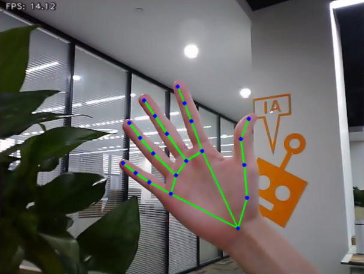

* **Program Analysis**

The program file is saved in

[/ros2_ws/src/example/example/mediapipe_example/hand_gesture.py](../_static/source_code/mediapipe_example.zip)

:::{Note}
Prior to making any alterations to the program, ensure to create a backup of the original factory program. Modify it only after creating the backup. Directly editing the source code file is prohibited to prevent inadvertent parameter modifications that could render the robot dysfunctional and irreparable!
:::

Based on the game's impact, the process logic of this game is organized as depicted in the figure below:


As depicted in the image above, the purpose of this game is to capture an image using the camera, preprocess it by converting its color space for easier identification, extract feature points corresponding to hand gestures from the converted image, and determine different gestures (based on angles) through logical analysis of key feature points. Finally, the trajectory of the recognized gesture is drawn on the display screen.

The program's logic flowchart extracted from the program files is illustrated in the figure below.


From the above diagram, it can be seen that the program's logical flow is mainly divided into initialization functions and recognition processing functions. The following document content will be written according to the program logic flow chart mentioned above.

Function

Main:

{lineno-start=212}
```python
def main():
    node = HandGestureNode('hand_gesture')
    try:
        rclpy.spin(node)
    except KeyboardInterrupt:
        node.destroy_node()
        rclpy.shutdown()
        print('shutdown')
    finally:
        print('shutdown finish')
```

The main function is used to start the fingertip trajectory recognition node.

`get_hand_landmarks`:

{lineno-start=19}
```python
def get_hand_landmarks(img, landmarks):
    """
    Convert landmarks from normalized output of Mediapipe to pixel coordinates(将landmarks从medipipe的归一化输出转为像素坐标)
    :param img: The image corresponding to pixel coordinates(像素坐标对应的图片)
    :param landmarks: The normalized key points(归一化的关键点)
    :return:
    """
    h, w, _ = img.shape
    landmarks = [(lm.x * w, lm.y * h) for lm in landmarks]
    return np.array(landmarks)
```

Convert the normalized data from madipipe into pixel coordinates.

`hand_angle`：

{lineno-start=30}
```python
def hand_angle(landmarks):
    """
    Calculate the bending angle of each finger(计算各个手指的弯曲角度)
    :param landmarks: Hand key point(手部关键点)
    :return: The angle of each finger(各个手指的角度)
    """
    angle_list = []
    # thumb 大拇指
    angle_ = vector_2d_angle(landmarks[3] - landmarks[4], landmarks[0] - landmarks[2])
    angle_list.append(angle_)
    # index finger(食指)
    angle_ = vector_2d_angle(landmarks[0] - landmarks[6], landmarks[7] - landmarks[8])
    angle_list.append(angle_)
    # middle finger(中指)
    angle_ = vector_2d_angle(landmarks[0] - landmarks[10], landmarks[11] - landmarks[12])
    angle_list.append(angle_)
    # ring finger(无名指)
    angle_ = vector_2d_angle(landmarks[0] - landmarks[14], landmarks[15] - landmarks[16])
    angle_list.append(angle_)
    # pinky (小拇指)
    angle_ = vector_2d_angle(landmarks[0] - landmarks[18], landmarks[19] - landmarks[20])
    angle_list.append(angle_)
    angle_list = [abs(a) for a in angle_list]
    return angle_list
```

After extracting the hand feature points into the `results` variable, it is necessary to logically process these points. By evaluating the angular relationship between the feature points, specific finger types (thumb, index finger) can be identified. The `hand_angle` function accepts the landmark feature point set (results) as input, and subsequently employs the `vector_2d_angle` function to compute the angles between the corresponding feature points. The feature points corresponding to the elements of the landmark set are depicted in the figure below:


Taking the thumb's angle calculation as an example: the `vector_2d_angle` function is used to calculate the angle between joint points. `landmarks[3]`, `landmarks[4]`, `landmarks[0]`, and `landmarks[2]` correspond to feature points 3, 4, 0, and 2 in the hand feature extraction diagram. By calculating the angles of these joint points, the thumb's posture characteristics can be determined. Similarly, the processing logic for the other finger joints is analogous.

To ensure the accuracy of recognition, the parameters and basic logic (addition and subtraction of angle calculations) in the `hand_angle` function should remain at their default settings.

`h_gesture`：

{lineno-start=100}
```python
def h_gesture(angle_list):
    """
    Determining the hand gesture displayed by the fingers through two-dimensional features(通过二维特征确定手指所摆出的手势)
    :param angle_list: Calculate the bending angle of each finger(各个手指弯曲的角度)
    :return : Gesture name string(手势名称字符串)
    """
    thr_angle = 65.
    thr_angle_thumb = 53.
    thr_angle_s = 49.
    gesture_str = "none"
    if (angle_list[0] > thr_angle_thumb) and (angle_list[1] > thr_angle) and (angle_list[2] > thr_angle) and (
            angle_list[3] > thr_angle) and (angle_list[4] > thr_angle):
        gesture_str = "fist"
    elif (angle_list[0] < thr_angle_s) and (angle_list[1] < thr_angle_s) and (angle_list[2] > thr_angle) and (
            angle_list[3] > thr_angle) and (angle_list[4] > thr_angle):
        gesture_str = "hand_heart"
    elif (angle_list[0] < thr_angle_s) and (angle_list[1] < thr_angle_s) and (angle_list[2] > thr_angle) and (
            angle_list[3] > thr_angle) and (angle_list[4] < thr_angle_s):
        gesture_str = "nico-nico-ni"
    elif (angle_list[0] < thr_angle_s) and (angle_list[1] > thr_angle) and (angle_list[2] > thr_angle) and (
            angle_list[3] > thr_angle) and (angle_list[4] > thr_angle):
        gesture_str = "hand_heart"
    elif (angle_list[0] > 5) and (angle_list[1] < thr_angle_s) and (angle_list[2] > thr_angle) and (
            angle_list[3] > thr_angle) and (angle_list[4] > thr_angle):
        gesture_str = "one"
    elif (angle_list[0] > thr_angle_thumb) and (angle_list[1] < thr_angle_s) and (angle_list[2] < thr_angle_s) and (
            angle_list[3] > thr_angle) and (angle_list[4] > thr_angle):
        gesture_str = "two"
    elif (angle_list[0] > thr_angle_thumb) and (angle_list[1] < thr_angle_s) and (angle_list[2] < thr_angle_s) and (
            angle_list[3] < thr_angle_s) and (angle_list[4] > thr_angle):
        gesture_str = "three"
    elif (angle_list[0] > thr_angle_thumb) and (angle_list[1] > thr_angle) and (angle_list[2] < thr_angle_s) and (
            angle_list[3] < thr_angle_s) and (angle_list[4] < thr_angle_s):
        gesture_str = "OK"
    elif (angle_list[0] > thr_angle_thumb) and (angle_list[1] < thr_angle_s) and (angle_list[2] < thr_angle_s) and (
            angle_list[3] < thr_angle_s) and (angle_list[4] < thr_angle_s):
        gesture_str = "four"
    elif (angle_list[0] < thr_angle_s) and (angle_list[1] < thr_angle_s) and (angle_list[2] < thr_angle_s) and (
            angle_list[3] < thr_angle_s) and (angle_list[4] < thr_angle_s):
        gesture_str = "five"
    elif (angle_list[0] < thr_angle_s) and (angle_list[1] > thr_angle) and (angle_list[2] > thr_angle) and (
            angle_list[3] > thr_angle) and (angle_list[4] < thr_angle_s):
        gesture_str = "six"
    else:
        "none"
    return gesture_str
```

After identifying the different finger types of the hand and determining their positions on the image, logical recognition processing of various gestures can be performed by implementing the `h_gesture` function.

In the `h_gesture` function depicted above, the parameters `thr_angle`, `thr_angle_thenum`, and `thr_angle_s` represent the angle threshold values for corresponding gesture logic points. These values have been empirically tested to ensure stable recognition effects. It is not recommended to alter them unless the logic processing effect is unsatisfactory, in which case adjustments within a range of ±5 values are sufficient. The `angle_list[0,1,2,3,4]` corresponds to the five finger types associated with the palm.

Here's an example using the gesture **"one"**:

{lineno-start=77}
```python
    elif (angle_list[0] > 5) and (angle_list[1] < thr_angle_s) and (angle_list[2] > thr_angle) and (
            angle_list[3] > thr_angle) and (angle_list[4] > thr_angle):
        gesture_str = "one"
```

The code presented represents the logical angle evaluation of the fingers for the **"one"** gesture. `angle_list[0]>5` checks whether the angle value of the thumb joint feature point in the image is greater than 5. `angle_list[1]<thr_angle_s` checks if the angle feature of the index finger joint feature point is less than the predetermined value `thr_angle_s`. Similarly, `angle_list[2]<thr_angle` verifies if the angle feature of the middle finger feature point is less than the predetermined value `thr_angle`. The logical processing for the other two fingers, `angle_list[3]` and `angle_list[4]`, follows a similar method. When the above conditions are met, the current gesture feature is recognized as **"one"**, and the same principle applies to recognizing other gesture features.

Different gesture recognitions involve distinct logical processing, but the overall logical framework remains similar. For recognizing other gesture features, refer to the previous paragraph.

`draw_points`:

{lineno-start=108}
```python
def draw_points(img, points, thickness=4, color=(255, 0, 0)):
    points = np.array(points).astype(dtype=np.int64)
    if len(points) > 2:
        for i, p in enumerate(points):
            if i + 1 >= len(points):
                break
            cv2.line(img, p, points[i + 1], color, thickness)
```

Draw the currently recognized hand shape and each joint point.

* **Class**

State:

{lineno-start=102}
```python
class State(enum.Enum):
    NULL = 0
    START = 1
    TRACKING = 2
    RUNNING = 3
```

An enumeration class used to set the current state of the program.

HandGestureNode：

{lineno-start=116}
```python
class HandGestureNode(Node):
    def __init__(self, name):
        rclpy.init()
        super().__init__(name)
        self.running = True
        self.drawing = mp.solutions.drawing_utils

        self.hand_detector = mp.solutions.hands.Hands(
            static_image_mode=False,
            max_num_hands=1,
            min_tracking_confidence=0.05,
            min_detection_confidence=0.6
        )
        
        self.fps = fps.FPS()  # FPS calculator(fps计算器)
        self.state = State.NULL
        self.points = []
        self.count = 0
        self.bridge = CvBridge()
        self.image_queue = queue.Queue(maxsize=2)
        self.image_sub = self.create_subscription(Image, '/depth_cam/rgb/image_raw', self.image_callback, 1)
        self.get_logger().info('\033[1;32m%s\033[0m' % 'start')
        threading.Thread(target=self.main, daemon=True).start()
```

The HandGestureNode is a fingertip trajectory recognition node that contains three functions: an initialization function, a main function, and an image callback function.

Init:

{lineno-start=117}
```python
    def __init__(self, name):
        rclpy.init()
        super().__init__(name)
        self.running = True
        self.drawing = mp.solutions.drawing_utils

        self.hand_detector = mp.solutions.hands.Hands(
            static_image_mode=False,
            max_num_hands=1,
            min_tracking_confidence=0.05,
            min_detection_confidence=0.6
        )
        
        self.fps = fps.FPS()  # FPS calculator(fps计算器)
        self.state = State.NULL
        self.points = []
        self.count = 0
        self.bridge = CvBridge()
        self.image_queue = queue.Queue(maxsize=2)
        self.image_sub = self.create_subscription(Image, '/depth_cam/rgb/image_raw', self.image_callback, 1)
        self.get_logger().info('\033[1;32m%s\033[0m' % 'start')
        threading.Thread(target=self.main, daemon=True).start()
```

Initialize each component needed and call the camera node.

<p id="anchor_6_3_9"></p>

### 6.3.9 Posture Control

The human posture estimation model, trained using the MediaPipe machine learning framework, detects the human body feature in the captured image, identifies relevant joint positions, and subsequently recognizes a variety of sequential actions. This process enables direct control of the robot through somatosensory input.

Viewed from the perspective of the robot, the following actions correspond to specific movements:

① If the user lifts their left arm, the robot will move a certain distance to the right.

② If the user lifts their right arm, the robot will move a certain distance to the left.

③ If the user lifts their left leg, the robot will move forward a certain distance.

④ If the user lifts their right leg, the robot will move backward a certain distance.

* **Program Logic**

First, import MediaPipe's human pose estimation model and subscribe to topic messages to obtain real-time footage from the camera.

MediaPipe is an open-source multimedia machine learning model application framework that runs cross-platform on mobile devices, workstations, and servers. It supports mobile GPU acceleration and inference engines such as TensorFlow and TF Lite.

Next, utilize the built model to detect key points of the human body in the screen. Connect these key points to display the human body and determine the human body posture.

Finally, if a specific action is detected in the human body posture, the robot will respond accordingly.

* **Operation Steps**

:::{Note}
The input command should be case sensitive, and keywords can be complemented using Tab key.
:::

(1) Start the robot, and enter the robot system desktop using NoMachine.

(2) Click-on  to start the command-line terminal.

(3) Run the command to disable app auto-start app service.

```
sudo systemctl stop start_app_node.service
```

(4) Execute the command to run the game program:

```
ros2 launch example body_control.launch.py
```

(5) If you need to close this gameplay, you need to press the **"Esc"** key in the image interface to exit the camera image interface.

(6) Then press **"Ctrl+C"** in the command line terminal interface. If closing fails, please try again.

* **Program Outcome**

Once the game is initiated, stand within the camera's field of view. When a person is detected, the screen will display key points of the body and lines connecting them.

From the perspective of the robot, lifting the left arm will cause the robot to turn left; lifting the right arm will make the robot turn right; lifting the left leg will make the robot move forward a certain distance; lifting the right leg will make the robot move backward a certain distance.

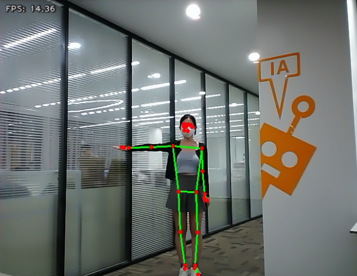

* **Program Analysis**

The program file is saved in

[ros2_ws/src/example/example/body_control/include/body_control.py](../_static/source_code/body_control.zip)

:::{Note}
Prior to making any alterations to the program, ensure to create a backup of the original factory program. Modify it only after creating the backup. Directly editing the source code file is prohibited to prevent inadvertent parameter modifications that could render the robot dysfunctional and irreparable!
:::

The game process logic is outlined below:


(1) Capture an image through the camera.

(2) After performing a demonstration action, the car will execute the corresponding action.

(3) From the car's perspective, lifting the left arm will cause the car to turn left; lifting the right arm will cause the car to turn right in a circle; lifting the left leg will make the car move forward a certain distance; lifting the right leg will make the car move backward a certain distance.

The program's logic flowchart, obtained from the program files, is presented below:


(1) Initialization function (`init(self.name)`) defines relevant parameters, including:

① Definition of the image tool (`self.drawing`) object.

② Points used to draw recognized features.

③ Definition of the limb detection object (`self.body_detector`).

(2) Identified feature points' output results undergo logical processing for recognition.

(3) Actions are determined and stored based on key point distance conditions.

(4) Finally, the output results are generated, and the car executes corresponding actions.

**Function**

Main：

{lineno-start=329}
```python
	def main():
    node = BodyControlNode('body_control')
    rclpy.spin(node)
    node.destroy_node()
```

Used to start the body sensation control node.

`get_joint_landmarks`：

{lineno-start=47}
```python
	def get_joint_landmarks(img, landmarks):
    """
    Convert landmarks from medipipe's normalized output to pixel coordinates(将landmarks从medipipe的归一化输出转为像素坐标)
    :param img: Picture corresponding to pixel coordinate(像素坐标对应的图片)
    :param landmarks: Normalized keypoint(归一化的关键点)
    :return:
    """
    h, w, _ = img.shape
    landmarks = [(lm.x * w, lm.y * h) for lm in landmarks]
    return np.array(landmarks)
```

Used to convert the recognized information into pixel coordinates.

`joint_distance`：

{lineno-start=58}
```python
	def joint_distance(landmarks):
    distance_list = []

    d1 = landmarks[LEFT_HIP] - landmarks[LEFT_SHOULDER]
    d2 = landmarks[LEFT_HIP] - landmarks[LEFT_WRIST]
    dis1 = d1[0]**2 + d1[1]**2
    dis2 = d2[0]**2 + d2[1]**2
    distance_list.append(round(dis1/dis2, 1))
   
    d1 = landmarks[RIGHT_HIP] - landmarks[RIGHT_SHOULDER]
    d2 = landmarks[RIGHT_HIP] - landmarks[RIGHT_WRIST]
    dis1 = d1[0]**2 + d1[1]**2
    dis2 = d2[0]**2 + d2[1]**2
    distance_list.append(round(dis1/dis2, 1))
    
    d1 = landmarks[LEFT_HIP] - landmarks[LEFT_ANKLE]
    d2 = landmarks[LEFT_ANKLE] - landmarks[LEFT_KNEE]
    dis1 = d1[0]**2 + d1[1]**2
    dis2 = d2[0]**2 + d2[1]**2
    distance_list.append(round(dis1/dis2, 1))
   
    d1 = landmarks[RIGHT_HIP] - landmarks[RIGHT_ANKLE]
    d2 = landmarks[RIGHT_ANKLE] - landmarks[RIGHT_KNEE]
    dis1 = d1[0]**2 + d1[1]**2
    dis2 = d2[0]**2 + d2[1]**2
    distance_list.append(round(dis1/dis2, 1))
    
    return distance_list
```

Used to calculate the distance between each joint point based on pixel coordinates.

**Class**

{lineno-start=87}
```python
	class BodyControlNode(Node):
    def __init__(self, name):
        rclpy.init()
        super().__init__(name, allow_undeclared_parameters=True, automatically_declare_parameters_from_overrides=True)
        self.name = name
        self.drawing = mp.solutions.drawing_utils
        self.body_detector = mp_pose.Pose(
            static_image_mode=False,
            min_tracking_confidence=0.7,
            min_detection_confidence=0.7)
        self.running = True
        self.fps = fps.FPS()  # FPS calculator(fps计算器)
        signal.signal(signal.SIGINT, self.shutdown)

        self.move_finish = True
        self.stop_flag = False
        self.left_hand_count = []
        self.right_hand_count = []
        self.left_leg_count = []
        self.right_leg_count = []

        self.detect_status = [0, 0, 0, 0]
```

This class is the body control node.

Init:

{lineno-start=88}
```python
	    def __init__(self, name):
        rclpy.init()
        super().__init__(name, allow_undeclared_parameters=True, automatically_declare_parameters_from_overrides=True)
        self.name = name
        self.drawing = mp.solutions.drawing_utils
        self.body_detector = mp_pose.Pose(
            static_image_mode=False,
            min_tracking_confidence=0.7,
            min_detection_confidence=0.7)
        self.running = True
        self.fps = fps.FPS()  # FPS calculator(fps计算器)
        signal.signal(signal.SIGINT, self.shutdown)
```

Initialize the parameters required for body control, read the image callback node from the camera, initialize nodes such as servos, chassis, buzzers, motors, etc., and finally start the main function within the class.

`get_node_state`：

{lineno-start=134}
```python
	    def get_node_state(self, request, response):
        response.success = True
        return response
```

Set the initialization state of the current node.

`shutdown`：

{lineno-start=138}
```python
	    def shutdown(self, signum, frame):
        self.running = False
```

Program exit callback function used to terminate recognition.

`image_callback`：

{lineno-start=141}
```python
	    def image_callback(self, ros_image):
        cv_image = self.bridge.imgmsg_to_cv2(ros_image, "rgb8")
        rgb_image = np.array(cv_image, dtype=np.uint8)
        if self.image_queue.full():
            # Discard the oldest image if the queue is full(如果队列已满，丢弃最旧的图像)
            self.image_queue.get()
        # Put the image into the queue(将图像放入队列)
        self.image_queue.put(rgb_image)
```

Image node callback function used to process images and enqueue them.

Move:

{lineno-start=150}
```python
	    def move(self, *args):
        if args[0].angular.z == 1:
            set_servo_position(self.joints_pub, 0.1, ((9, 650), ))
            time.sleep(0.2)
            motor1 = MotorState()
            motor1.id = 2
            motor1.rps = 0.1
            motor2 = MotorState()
            motor2.id = 4
            motor2.rps = -1.0
            msg = MotorsState()
            msg.data = [motor1, motor2]
            self.motor_pub.publish(msg)
            time.sleep(11)
            set_servo_position(self.joints_pub, 0.1, ((9, 500), ))
            motor1 = MotorState()
            motor1.id = 2
            motor1.rps = 0.0
            motor2 = MotorState()
            motor2.id = 4
            motor2.rps = 0.0
            msg = MotorsState()
            msg.data = [motor1, motor2]
            self.motor_pub.publish(msg)
        elif args[0].angular.z == -1:
            set_servo_position(self.joints_pub, 0.1, ((9, 350), ))
            time.sleep(0.2)
            motor1 = MotorState()
            motor1.id = 2
            motor1.rps = 1.0
            motor2 = MotorState()
            motor2.id = 4
            motor2.rps = -0.1
            msg = MotorsState()
            msg.data = [motor1, motor2]
            self.motor_pub.publish(msg)
            time.sleep(12)
            set_servo_position(self.joints_pub, 0.1, ((9, 500), ))
            motor1 = MotorState()
            motor1.id = 2
            motor1.rps = 0.0
            motor2 = MotorState()
            motor2.id = 4
            motor2.rps = 0.0
            msg = MotorsState()
            msg.data = [motor1, motor2]
            self.motor_pub.publish(msg)
        else:
            self.mecanum_pub.publish(args[0])
            time.sleep(args[1])
            self.mecanum_pub.publish(Twist())
            time.sleep(0.1)
        self.stop_flag =True
        self.move_finish = True
```

Movement strategy function that moves the vehicle according to the recognized limb actions.

`buzzer_warn`:

{lineno-start=205}
```python
	    def buzzer_warn(self):
        msg = BuzzerState()
        msg.freq = 1900
        msg.on_time = 0.2
        msg.off_time = 0.01
        msg.repeat = 1
        self.buzzer_pub.publish(msg)
```

Buzzer control function used for buzzer alarms.

`image_proc`:

{lineno-start=213}
```python
	    def image_proc(self, image):
        image_flip = cv2.flip(cv2.cvtColor(image, cv2.COLOR_RGB2BGR), 1)
        results = self.body_detector.process(image)
        if results is not None and results.pose_landmarks is not None:
            if self.move_finish:
                twist = Twist()
                landmarks = get_joint_landmarks(image, results.pose_landmarks.landmark)
                distance_list = (joint_distance(landmarks))
              
                if distance_list[0] < 1:
                    self.detect_status[0] = 1
                if distance_list[1] < 1:
                    self.detect_status[1] = 1
```

Function for recognizing limbs, which invokes the model to draw key points of the human body based on the recognized information, and then performs movements according to the recognized posture.

Main:

{lineno-start=305}
```python
	    def main(self):
        while self.running:
            try:
                image = self.image_queue.get(block=True, timeout=1)
            except queue.Empty:
                if not self.running:
                    break
                else:
                    continue
            try:
                result_image = self.image_proc(np.copy(image))
            except BaseException as e:
                self.get_logger().info('\033[1;32m%s\033[0m' % e)
                result_image = cv2.flip(cv2.cvtColor(image, cv2.COLOR_RGB2BGR), 1)
            self.fps.update()
            result_image = self.fps.show_fps(result_image)
            cv2.imshow(self.name, result_image)
            key = cv2.waitKey(1)
            if key == ord('q') or key == 27:  # Press q or esc to exit(按q或者esc退出)
                self.mecanum_pub.publish(Twist())
                self.running = False
```

The main function within the BodyControlNode class, used to input image information into the recognition function and display the returned image.

### 6.3.10 Human Body Tracking

:::{Note}
This game is best suited for indoor environments. Outdoor settings may significantly interfere with its effectiveness!
:::

Utilize the yolov5 framework to import a pre-trained human pose model for detecting human bodies. The center point of the detected human body will be indicated in the returned image. When a human body approaches, the robot will retreat; conversely, if the human body is distant, the robot will move forward. This ensures that the distance between the human body and the robot remains approximately 3 meters at all times.

* **Program Logic**

First, import the human pose estimation model from yolov5, and subscribe to topic messages to obtain real-time camera images. Next, utilize the trained model to detect key points of the human body in the images, and calculate the coordinates of the human body's center point based on all detected key points. Finally, update the PID controller based on the coordinates of the human body's center point and the screen's center point to control the robot's movement in sync with the human body's movement.

* **Operation Steps**

:::{Note}
When entering commands, strict case sensitivity is required, and you can use the **"Tab"** key to complete keywords.
:::

(1) Start the robot, and enter the robot system desktop using NoMachine.

(2) Click-on  to start the command-line terminal.

(3) Run the command to disable app auto-start app service.

```
sudo systemctl stop start_app_node.service
```

(4) Enter the command and press Enter

```
ros2 launch example body_track.launch.py
```

(5) If you need to close this game, you need to press the **"Esc"** key in the image interface to exit the camera image interface.

(6) Then press **"Ctrl+C"** in the command line terminal interface. If closing fails, please try again.

* **Program Outcome**

Upon initiating the game, the camera captures the human body within its field of view. Once detected, the center point of the human body is highlighted in the displayed image.

From the robot's perspective, if the human body is in close proximity, the robot will retreat. Conversely, if the human body is distant, the robot will move forward, ensuring that the distance between the human body and the robot remains approximately 3 meters at all times.


* **Program Analysis**

The program file is saved in：[ros2_ws/src/example/example/body_control/include/body_track.py](../_static/source_code/body_control.zip)

:::{Note}
Prior to making any alterations to the program, ensure to create a backup of the original factory program. Modify it only after creating the backup. Directly editing the source code file is prohibited to prevent inadvertent parameter modifications that could render the robot dysfunctional and irreparable!
:::

Based on the game's effectiveness, the procedural logic is delineated as follows:

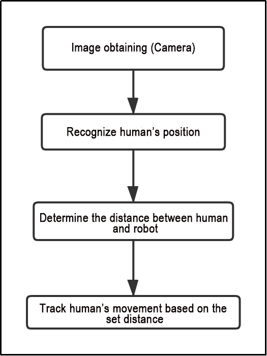

(1) The car captures images through the camera.

(2) It identifies the human body's position in the image and calculates the distance between the human body and the car.

(3) Finally, the car adjusts its movement to follow within the preset distance limit.

The program's logic flowchart, derived from the program files, is illustrated below:


Initialization Function of the BodyControlNode Class:

Configuration of Linear and Angular Speed: Adjusts the car's speed based on the detected distance from the human body.

Definition of Chassis Publisher: Publishes the chassis's position and orientation to control the car's forward and backward movement.

Yolov5 Human Body Detection: Utilizes the yolov5 single-target detection algorithm to detect human bodies and obtain their positions.

PID Parameter Initialization: Initializes parameters related to the PID controller, governing sensitivity to the distance between the car and the human body.

**Function**

Main：

{lineno-start=184}
```python
def main():
    node = BodyControlNode('body_control')
    rclpy.spin(node)
    node.destroy_node()
```

Used to start the human tracking node.

**Class**

{lineno-start=29}
```python
class BodyControlNode(Node):
    def __init__(self, name):
        rclpy.init()
        super().__init__(name, allow_undeclared_parameters=True, automatically_declare_parameters_from_overrides=True)
        self.name = name
       
        self.pid_d = pid.PID(0.1, 0, 0)
        #self.pid_d = pid.PID(0, 0, 0)
        
        self.pid_angular = pid.PID(0.002, 0, 0)
        #self.pid_angular = pid.PID(0, 0, 0)
        
        self.go_speed, self.turn_speed = 0.007, 0.04
```

This class is the human tracking node.

Init:

{lineno-start=31}
```python
        rclpy.init()
        super().__init__(name, allow_undeclared_parameters=True, automatically_declare_parameters_from_overrides=True)
        self.name = name
       
        self.pid_d = pid.PID(0.1, 0, 0)
        #self.pid_d = pid.PID(0, 0, 0)
        
        self.pid_angular = pid.PID(0.002, 0, 0)
        #self.pid_angular = pid.PID(0, 0, 0)
        
        self.go_speed, self.turn_speed = 0.007, 0.04
```

Initialize the parameters required for human tracking, read nodes such as the camera's image callback, depth information, chassis, YOLOv5 recognition, etc., and then synchronize the time to align depth information and image information, finally start the main function within the class.

`get_node_state`：

{lineno-start=80}
```python
    def get_node_state(self, request, response):
        response.success = True
        return response
```

Set the initialization state of the current node.

`shutdown`：

{lineno-start=84}
```python
    def shutdown(self, signum, frame):
        self.running = False
```

Program exit callback function used to terminate recognition.

`get_object_callback`：

{lineno-start=87}
```python
    # Get the results of target detection(获取目标检测结果)
    def get_object_callback(self, msg):
        for i in msg.objects:
            class_name = i.class_name
            if class_name == 'person':
                if i.box[1] < 10:
                    self.center = [int((i.box[0] + i.box[2])/2), int(i.box[1]) + abs(int((i.box[1] - i.box[3])/4))]
                else:
                    self.center = [int((i.box[0] + i.box[2])/2), int(i.box[1]) + abs(int((i.box[1] - i.box[3])/3))]
```

Callback function for YOLOv5 recognition node, which converts recognition information into pixel coordinates.

`image_proc`:

{lineno-start=109}
```python
    def image_proc(self, rgb_image):
        twist = Twist()
        if self.center is not None:
            h, w = rgb_image.shape[:-1]
            cv2.circle(rgb_image, tuple(self.center), 10, (0, 255, 255), -1) 
            #################
            roi_h, roi_w = 5, 5
            w_1 = self.center[0] - roi_w
            w_2 = self.center[0] + roi_w
            if w_1 < 0:
                w_1 = 0
            if w_2 > w:
                w_2 = w
            h_1 = self.center[1] - roi_h
```

Function for tracking humans, which invokes the model to draw the position of the person based on the recognized information, and uses PID to control the movement according to the recognized person.

Main：

{lineno-start=161}
```python
    def main(self):
        while self.running:
            try:
                image = self.image_queue.get(block=True, timeout=1)
            except queue.Empty:
                if not self.running:
                    break
                else:
                    continue
            try:
                result_image = self.image_proc(image)
            except BaseException as e:
                result_image = image.copy()
                self.get_logger().info('\033[1;32m%s\033[0m' % e)
            self.center = None
            cv2.imshow(self.name, cv2.cvtColor(result_image, cv2.COLOR_RGB2BGR))
            key = cv2.waitKey(1)
            if key == ord('q') or key == 27:  # Press q or esc to exit(按q或者esc退出)
                self.mecanum_pub.publish(Twist())
                self.running = False
```

The main function within the BodyControlNode class, used to input image information into the recognition function and display the returned image.

* **Function Expansion**

The default tracking speed in the program is set to a fixed value. If you wish to alter the tracking speed of the robot, you can do so by adjusting the PID parameters within the program.

(1) Open the terminal, enter the following command to navigate to the directory where the program is stored:

```
cd /home/ubuntu/ros2_ws/src/example/example/body_control/include/
```

(2) Run the following command to open the program file:

```
vim body_track.py
```

(3) Locate the `self.pid_d` and `self.pid_angular` functions, where the values inside the parentheses are the PID-related parameters. One is for the tracking linear velocity PID, and the other is for the tracking angular velocity PID.


The three PID parameters are proportional, integral, and derivative. The proportional parameter adjusts the response level, the integral parameter adjusts the smoothness, and the derivative parameter adjusts whether there is overshoot.

(4) Press **"i"** to enter edit mode. If you want to increase the robot's tracking speed, you can correspondingly increase the value. For example, here we set the tracking linear velocity PID to 0.05.

:::{Note}
It is recommended not to adjust the parameters too high. Excessive parameters will cause the robot to track too quickly, affecting the experience.
:::

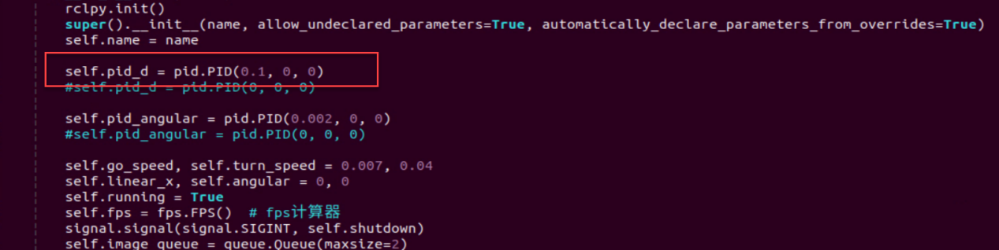

(5) After completing the modifications, press **"Esc"** to exit edit mode, then press **":wq"** to save and exit.

(6) Start the game according to the instructions provided in section 6.3.10.

### 6.3.11 Integration of Body Posture and RGB Control

The depth camera combines RGB capabilities, enabling both color recognition and somatosensory control. This lesson will leverage color recognition, as discussed in [6.3.9 Posture Control](#anchor_6_3_9), to identify individuals wearing clothing of a predefined color (which can be calibrated through operations). The robot's movements are then controlled based on different body gestures.

If an individual wearing the specified color is not recognized, the robot remains unresponsive, ensuring accurate identification and control over the individual operating the robot.

* **Program Logic**

First, import MediaPipe's human pose estimation model and subscribe to topic messages to obtain real-time camera footage.

Next, utilize the built model to detect key points of the human torso on the screen. Connect these key points to display the human torso and determine the human posture. Calibrate the center point of the human body based on all key points.

Finally, if it is detected that the human body is standing with hands on hips, calibrate the color of the clothes to identify the control object. The robot enters control mode, and when the human body performs specific actions, the robot responds with corresponding actions.

* **Operation Steps**

:::{Note}
The input command should be case sensitive, and keywords can be complemented using Tab key.
:::

(1) Start the robot, and enter the robot system desktop using NoMachine.

(2) Click-on  to start the command-line terminal.

(3) Run the command to disable app auto-start app service.

```
sudo systemctl stop start_app_node.service
```

(4) Run the following command and hit Enter key to initiate the game:

```
ros2 launch example body_and_rgb_control.launch.py
```

(5) If you need to close this game you need to press the **"Esc"** key in the image interface to exit the camera image interface.

(6) Then press **"Ctrl+C"** in the command line terminal interface. If closing fails, please try again.

* **Program Outcome**

After starting the game, stand within the camera's field of view. When a person is detected, the screen will display key points of the human torso, lines connecting these points, and the center point of the human body.

**First Step:** Slightly adjust the camera to maintain a certain distance, ensuring it can detect the entire human body.

**Second Step:** When the person to be controlled appears on the camera screen, they can assume the posture of hands on hips. If the buzzer emits a short beep, the robot completes calibration of the human body's center point and clothing color, entering control mode.


**Third Step:** At this point, with the robot as the primary viewpoint, raising the left arm causes the robot to move to the right; raising the right arm causes the robot to move to the left; raising the left leg causes the robot to move forward; raising the right leg causes the robot to move backward.


**Fourth Step:** If a person wearing a different clothing color enters the camera's field of view, they will not control the robot.

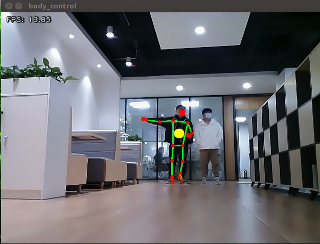

* **Program Analysis**

The program file is saved in:

[ros2_ws/src/example/example/body_control/include/body_and_rgb_control.py](../_static/source_code/body_control.zip)

:::{Note}
Prior to making any alterations to the program, ensure to create a backup of the original factory program. Modify it only after creating the backup. Directly editing the source code file is prohibited to prevent inadvertent parameter modifications that could render the robot dysfunctional and irreparable!
:::

Based on the game's effectiveness, the procedural logic is delineated as follows:


Retrieve the captured image from the camera, analyze the key characteristics of the human body, initially detect and assess the **"akimbo"** posture using the designated function. Subsequently, determine if it's the same individual in the picture based on clothing color. If confirmed, identify specific body movements (raising the left arm, right arm, left leg, and right leg) and instruct the car to execute corresponding actions. Otherwise, reanalyze the key feature points.

The program's logic flowchart, derived from the program files, is illustrated below:


As shown in the above diagram, the program first uses the initialization function of the BodyControlNode class to set the default values for the relevant parameters. This primarily includes defining the drawing tool object, the limb detection object, and initializing the posture state and count parameters. After this setup, the program can logically process the incoming images. It begins by identifying and outputting key body feature points, calculating joint angles from the obtained (arm) parameters to mark the hands-on-hips posture. Then, it matches colors based on the recognized key feature points to determine if the person has been previously marked. Finally, the program controls the movement of the vehicle by recognizing demonstration actions (raising an arm, lifting a leg).

**Function**

Main：

{lineno-start=422}
```python
def main():
    node = BodyControlNode('body_control')
    rclpy.spin(node)
    node.destroy_node()
```

Used to start the RGB body sensation control node.

`get_body_center`：

{lineno-start=49}
```python
def get_body_center(h, w, landmarks):
    landmarks = np.array([(lm.x * w, lm.y * h) for lm in landmarks])
    center = ((landmarks[LEFT_HIP] + landmarks[LEFT_SHOULDER] + landmarks[RIGHT_HIP] + landmarks[RIGHT_SHOULDER])/4).astype(int)
    return center.tolist()
```

Used to obtain the currently recognized body contours.

`get_joint_landmarks`：

{lineno-start=54}
```python
def get_joint_landmarks(img, landmarks):
    """
    Convert landmarks from medipipe's normalized output to pixel coordinates)(将landmarks从medipipe的归一化输出转为像素坐标
    :param img: Picture corresponding to pixel coordinate(像素坐标对应的图片)
    :param landmarks: Normalized keypoint(归一化的关键点)
    """
    h, w, _ = img.shape
    landmarks = [(lm.x * w, lm.y * h) for lm in landmarks]
    return np.array(landmarks)
```

Used to convert the recognized information into pixel coordinates.

`get_dif`：

{lineno-start=64}
```python
def get_dif(list1, list2):
    if len(list1) != len(list2):
        return 255*3
    else:
        d = np.absolute(np.array(list1) - np.array(list2))
        return sum(d)
```

Used to compare the color of clothes on the body contours.

`joint_angle`:

{lineno-start=71}
```python
def joint_angle(landmarks):
    """
    Calculate flex angle of each joint(计算各个关节弯曲角度)
    :param landmarks: Hand keypoints(手部关键点)
    :return: Joint angle(关节角度)
    """
    angle_list = []
    left_hand_angle1 = vector_2d_angle(landmarks[LEFT_SHOULDER] - landmarks[LEFT_ELBOW], landmarks[LEFT_WRIST] - landmarks[LEFT_ELBOW])
    angle_list.append(int(left_hand_angle1))
   
    left_hand_angle2 = vector_2d_angle(landmarks[LEFT_HIP] - landmarks[LEFT_SHOULDER], landmarks[LEFT_WRIST] - landmarks[LEFT_SHOULDER])
    angle_list.append(int(left_hand_angle2))

    right_hand_angle1 = vector_2d_angle(landmarks[RIGHT_SHOULDER] - landmarks[RIGHT_ELBOW], landmarks[RIGHT_WRIST] - landmarks[RIGHT_ELBOW])
    angle_list.append(int(right_hand_angle1))

    right_hand_angle2 = vector_2d_angle(landmarks[RIGHT_HIP] - landmarks[RIGHT_SHOULDER], landmarks[RIGHT_WRIST] - landmarks[RIGHT_SHOULDER])
    angle_list.append(int(right_hand_angle2))
    
    return angle_list
```

This function is used to calculate the recognition angles of various joints between the body parts.

`joint_distance`:

{lineno-start=92}
```python
def joint_distance(landmarks):
    distance_list = []

    d1 = landmarks[LEFT_HIP] - landmarks[LEFT_SHOULDER]
    d2 = landmarks[LEFT_HIP] - landmarks[LEFT_WRIST]
    dis1 = d1[0]**2 + d1[1]**2
    dis2 = d2[0]**2 + d2[1]**2
    distance_list.append(round(dis1/dis2, 1))
   
    d1 = landmarks[RIGHT_HIP] - landmarks[RIGHT_SHOULDER]
    d2 = landmarks[RIGHT_HIP] - landmarks[RIGHT_WRIST]
    dis1 = d1[0]**2 + d1[1]**2
    dis2 = d2[0]**2 + d2[1]**2
    distance_list.append(round(dis1/dis2, 1))
    
    d1 = landmarks[LEFT_HIP] - landmarks[LEFT_ANKLE]
    d2 = landmarks[LEFT_ANKLE] - landmarks[LEFT_KNEE]
    dis1 = d1[0]**2 + d1[1]**2
    dis2 = d2[0]**2 + d2[1]**2
    distance_list.append(round(dis1/dis2, 1))
   
    d1 = landmarks[RIGHT_HIP] - landmarks[RIGHT_ANKLE]
    d2 = landmarks[RIGHT_ANKLE] - landmarks[RIGHT_KNEE]
    dis1 = d1[0]**2 + d1[1]**2
    dis2 = d2[0]**2 + d2[1]**2
    distance_list.append(round(dis1/dis2, 1))
    
    return distance_list
```

This function is used to calculate the distance between each joint point based on pixel coordinates.

**Class**

{lineno-start=121}
```python
class BodyControlNode(Node):
    def __init__(self, name):
        rclpy.init()
        super().__init__(name)
        self.name = name
        self.drawing = mp.solutions.drawing_utils
        self.body_detector = mp_pose.Pose(
            static_image_mode=False,
            min_tracking_confidence=0.7,
            min_detection_confidence=0.7)
        
        self.color_picker = ColorPicker(Point(), 2)
        signal.signal(signal.SIGINT, self.shutdown)
        self.fps = fps.FPS()  # fps calculator(fps计算器)

        self.running = True
        self.current_color = None
        self.lock_color = None
        self.calibrating = False
        self.move_finish = True
        self.stop_flag = False
        self.count_akimbo = 0
        self.count_no_akimbo = 0
```

This class is the body control node.

Init:

{lineno-start=122}
```python
    def __init__(self, name):
        rclpy.init()
        super().__init__(name)
        self.name = name
        self.drawing = mp.solutions.drawing_utils
        self.body_detector = mp_pose.Pose(
            static_image_mode=False,
            min_tracking_confidence=0.7,
            min_detection_confidence=0.7)
        
        self.color_picker = ColorPicker(Point(), 2)
        signal.signal(signal.SIGINT, self.shutdown)
        self.fps = fps.FPS()  # fps calculator(fps计算器)
```

Initialize the parameters required for body control, read the camera's image callback node, initialize nodes such as servos, chassis, buzzers, motors, etc., and finally start the main function within the class.

`get_node_state`:

{lineno-start=176}
```python
    def get_node_state(self, request, response):
        response.success = True
        return response
```

Set the initialization state of the current node.

`shutdown`:

{lineno-start=180}
```python
    def shutdown(self, signum, frame):
        self.running = False
```

Program exit callback function used to terminate recognition.

`image_callback`:

{lineno-start=183}
```python
    def image_callback(self, ros_image):
        cv_image = self.bridge.imgmsg_to_cv2(ros_image, "rgb8")
        rgb_image = np.array(cv_image, dtype=np.uint8)
        if self.image_queue.full():
            # Discard the oldest image if the queue is full(如果队列已满，丢弃最旧的图像)
            self.image_queue.get()
        # Put the image into the queue(将图像放入队列)
        self.image_queue.put(rgb_image)
```

Image node callback function used to process images and enqueue them.

Move:

{lineno-start=192}
```python
    def move(self, *args):
        if args[0].angular.z == 1:
            set_servo_position(self.joints_pub, 0.1, ((9, 650), ))
            time.sleep(0.2)
            motor1 = MotorState()
            motor1.id = 2
            motor1.rps = 0.1
            motor2 = MotorState()
            motor2.id = 4
            motor2.rps = -1.0
            msg = MotorsState()
            msg.data = [motor1, motor2]
            self.motor_pub.publish(msg)
            time.sleep(11)
            set_servo_position(self.joints_pub, 0.1, ((9, 500), ))
            motor1 = MotorState()
            motor1.id = 2
            motor1.rps = 0.0
            motor2 = MotorState()
            motor2.id = 4
            motor2.rps = 0.0
            msg = MotorsState()
            msg.data = [motor1, motor2]
            self.motor_pub.publish(msg)
        elif args[0].angular.z == -1:
            set_servo_position(self.joints_pub, 0.1, ((9, 350), ))
            time.sleep(0.2)
            motor1 = MotorState()
            motor1.id = 2
            motor1.rps = 1.0
            motor2 = MotorState()
            motor2.id = 4
            motor2.rps = -0.1
            msg = MotorsState()
            msg.data = [motor1, motor2]
            self.motor_pub.publish(msg)
            time.sleep(12)
            set_servo_position(self.joints_pub, 0.1, ((9, 500), ))
            motor1 = MotorState()
            motor1.id = 2
            motor1.rps = 0.0
            motor2 = MotorState()
            motor2.id = 4
            motor2.rps = 0.0
            msg = MotorsState()
            msg.data = [motor1, motor2]
            self.motor_pub.publish(msg)
        else:
            self.mecanum_pub.publish(args[0])
            time.sleep(args[1])
            self.mecanum_pub.publish(Twist())
            time.sleep(0.1)
        self.stop_flag =True
        self.move_finish = True
```

Movement strategy function that moves the vehicle according to the recognized limb actions.

`buzzer_warn`:

{lineno-start=247}
```python
    def buzzer_warn(self):
        msg = BuzzerState()
        msg.freq = 1900
        msg.on_time = 0.2
        msg.off_time = 0.01
        msg.repeat = 1
        self.buzzer_pub.publish(msg)
```

Buzzer control function used for buzzer alarms.

`image_proc`:

{lineno-start=255}
```python
    def image_proc(self, image):
        image_flip = cv2.flip(cv2.cvtColor(image, cv2.COLOR_RGB2BGR), 1)
        results = self.body_detector.process(image)
        if results is not None and results.pose_landmarks is not None:
            twist = Twist()
            
            landmarks = get_joint_landmarks(image, results.pose_landmarks.landmark)
            
            # Hands-on-hips calibration (叉腰标定)
            angle_list = joint_angle(landmarks)
            #print(angle_list)
            if -150 < angle_list[0] < -90 and -30 < angle_list[1] < -10 and 90 < angle_list[2] < 150 and 10 < angle_list[3] < 30:
                self.count_akimbo += 1  # Hands-on-hips detection+1(叉腰检测+1)
                self.count_no_akimbo = 0  # Clear no hands-on-hips detection(没有叉腰检测归零)
            else:
                self.count_akimbo = 0  # Clear hands-on-hips detection(叉腰检测归零)
```

Function for recognizing limbs, which invokes the model to draw key points of the human body based on the recognized information. Then, it performs color recognition based on the position of each limb's different contours, finally determining and moving according to the recognized posture.

Main:

{lineno-start=399}
```python
    def main(self):
        while self.running:
            try:
                image = self.image_queue.get(block=True, timeout=1)
            except queue.Empty:
                if not self.running:
                    break
                else:
                    continue
            try:
                result_image = self.image_proc(np.copy(image))
            except BaseException as e:
                self.get_logger().info('\033[1;32m%s\033[0m' % e)
                result_image = cv2.flip(cv2.cvtColor(image, cv2.COLOR_RGB2BGR), 1)
            self.fps.update()
            result_image = self.fps.show_fps(result_image)
            cv2.imshow(self.name, result_image)
            key = cv2.waitKey(1)
            if key == ord('q') or key == 27:  # Press q or esc to exit(按q或者esc退出)
                self.mecanum_pub.publish(Twist())
                self.running = False
        rclpy.shutdown()
```

The main function within the BodyControlNode class, used to input image information into the recognition function and display the returned image.

### 6.3.12 Pose Detection

Through the human pose estimation model in the MediaPipe machine learning framework, the human body posture is detected. When the robot detects a person falling, it will sound an alarm and sway from side to side.

* **Program Logic**

First, import the human pose estimation model from MediaPipe and subscribe to topic messages to obtain real-time footage from the camera.

Then, process the image, such as flipping, to detect human body information in the image. Based on the lines connecting the key points of the human body, calculate the limb height to determine the body movement.

Finally, if **"falling"** is detected, the robot will sound an alarm and move forwards and backwards.

* **Operation Steps**

:::{Note}
The input command should be case sensitive, and keywords can be complemented using Tab key.
:::

(1) Start the robot, and enter the robot system desktop using NoMachine.

(2) Click-on  to start the command-line terminal.

(3) Run the command to disable app auto-start app service.

```
sudo systemctl stop start_app_node.service
```

(4) Run the following command and hit Enter key to initiate the game:

```
ros2 launch example fall_down_detect.launch.py
```

(5) If you need to close this game, you need to press the **"Esc"** key in the image interface to exit the camera image interface.

(6) Then press **"Ctrl+C"** in the command line terminal interface. If closing fails, please try again.

* **Program Outcome**

Once the game starts, ensure the human body remains as fully within the camera's field of view as possible. Upon recognizing the human body, the key points will be highlighted in the returned image.

At this point, the individual can sit down briefly. Upon detecting the **"falling"** posture, the robot will continuously sound an alarm and make repeated forward and backward movements as a reminder.


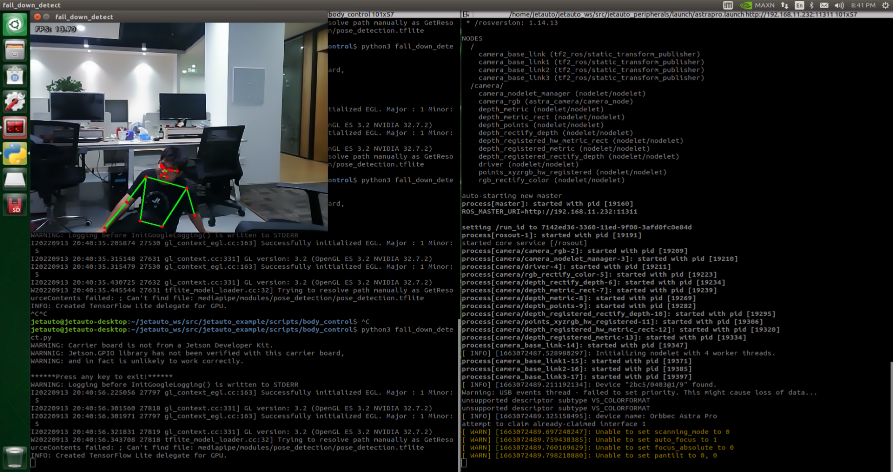

* **Program Analysis**

The program file is saved in：[ros2_ws/src/example/example/body_control/include/fall_down_detect.py](../_static/source_code/body_control.zip)

:::{Note}
Prior to making any alterations to the program, ensure to create a backup of the original factory program. Modify it only after creating the backup. Directly editing the source code file is prohibited to prevent inadvertent parameter modifications that could render the robot dysfunctional and irreparable!
:::

Based on the game's effectiveness, the procedural logic is delineated as follows:


The car captures images via the camera, identifies the key feature points of the human body, and assesses whether the current posture indicates a **"fall"**. If a fall is detected, the car's buzzer will emit a continuous **"beep"** sound while the car moves backward. Otherwise, the buzzer will only emit a single **"beep"** sound.

The program logic flow chart obtained from the program files is depicted in the figure below.

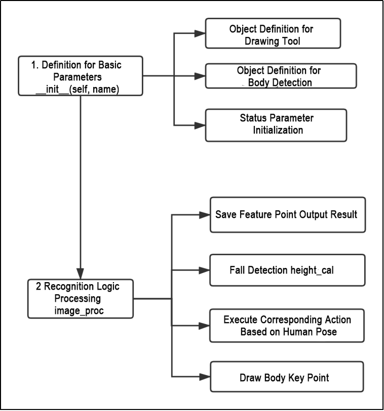

**Function**

Main：

{lineno-start=205}
```python
def main():
    node = FallDownDetectNode('fall_down_detect')
    rclpy.spin(node)
    node.destroy_node()
```

Used to start the body sensation control node.

`get_joint_landmarks`:

{lineno-start=45}
```python
def get_joint_landmarks(img, landmarks):
    """
    Convert landmarks from medipipe's normalized output to pixel coordinates(将landmarks从medipipe的归一化输出转为像素坐标)
    :param img: Picture corresponding to pixel coordinate(像素坐标对应的图片)
    :param landmarks: Normalized keypoint(归一化的关键点)
    :return:
    """
    h, w, _ = img.shape
    landmarks = [(lm.x * w, lm.y * h) for lm in landmarks]
    return np.array(landmarks)
```

Used to convert the recognized information into pixel coordinates.

`height_cal`:

{lineno-start=56}
```python
def height_cal(landmarks):
    y = []
    for i in landmarks:
        y.append(i[1])
    height = sum(y)/len(y)

    return height
```

Calculates the height of the limbs based on the recognized information.

* **Class**

{lineno-start=64}
```python
class FallDownDetectNode(Node):
    def __init__(self, name):
        rclpy.init()
        super().__init__(name, allow_undeclared_parameters=True, automatically_declare_parameters_from_overrides=True)
        self.name = name
        self.drawing = mp.solutions.drawing_utils
        self.body_detector = mp_pose.Pose(
            static_image_mode=False,
            min_tracking_confidence=0.7,
            min_detection_confidence=0.7)
        self.running = True
        self.fps = fps.FPS()  # fps calculator(fps计算器)
        
        self.fall_down_count = []
        self.move_finish = True
        self.stop_flag = False
        signal.signal(signal.SIGINT, self.shutdown)
        self.bridge = CvBridge()
        self.image_queue = queue.Queue(maxsize=2)
```

This class is the fall detection node.

Init:

{lineno-start=64}
```python
class FallDownDetectNode(Node):
    def __init__(self, name):
        rclpy.init()
        super().__init__(name, allow_undeclared_parameters=True, automatically_declare_parameters_from_overrides=True)
        self.name = name
        self.drawing = mp.solutions.drawing_utils
        self.body_detector = mp_pose.Pose(
            static_image_mode=False,
            min_tracking_confidence=0.7,
            min_detection_confidence=0.7)
        self.running = True
        self.fps = fps.FPS()  # fps calculator(fps计算器)
        
        self.fall_down_count = []
```

Initialize the parameters required for body control, read the camera's image callback node, initialize nodes such as chassis, buzzers, and others, and finally start the main function within the class.

`get_node_state`:

{lineno-start=99}
```python
    def get_node_state(self, request, response):
        response.success = True
        return response
```

Set the initialization state of the current node.

`shutdown`:

{lineno-start=103}
```python
    def shutdown(self, signum, frame):
        self.running = False
```

Program exit callback function used to terminate recognition.

`image_callback`:

{lineno-start=106}
```python
    def image_callback(self, ros_image):
        cv_image = self.bridge.imgmsg_to_cv2(ros_image, "rgb8")
        rgb_image = np.array(cv_image, dtype=np.uint8)
        if self.image_queue.full():
            # Discard the oldest image if the queue is full(如果队列已满，丢弃最旧的图像)
            self.image_queue.get()
        # Put the image into the queue(将图像放入队列)
        self.image_queue.put(rgb_image)
```

Image node callback function used to process images and enqueue them.

Move:

{lineno-start=115}
```python
    def move(self):
        for i in range(5):
            twist = Twist()
            twist.linear.x = 0.2
            self.mecanum_pub.publish(twist)
            time.sleep(0.2)
            twist = Twist()
            twist.linear.x = -0.2
            self.mecanum_pub.publish(twist)
            time.sleep(0.2)
        self.mecanum_pub.publish(Twist())
        self.stop_flag =True
        self.move_finish = True
```

Movement strategy function that moves the vehicle according to the recognized limb height.

`buzzer_warn`:

{lineno-start=129}
```python
    def buzzer_warn(self):
        if not self.stop_flag:
            while not self.stop_flag:
                msg = BuzzerState()
                msg.freq = 1000
                msg.on_time = 0.1
                msg.off_time = 0.1
                msg.repeat = 1
                self.buzzer_pub.publish(msg)
                time.sleep(0.2)
        else:
            msg = BuzzerState()
            msg.freq = 1900
            msg.on_time = 0.2
            msg.off_time = 0.01
            msg.repeat = 1
            self.buzzer_pub.publish(msg)
```

Buzzer control function used for buzzer alarms.

`image_proc`:

{lineno-start=147}
```python
    def image_proc(self, image):
        image_flip = cv2.flip(cv2.cvtColor(image, cv2.COLOR_RGB2BGR), 1)
        results = self.body_detector.process(image)
        if results is not None and results.pose_landmarks:
            if self.move_finish:
                landmarks = get_joint_landmarks(image, results.pose_landmarks.landmark)
                h = height_cal(landmarks)
                if h > image.shape[:-2][0] - 120:
                    self.fall_down_count.append(1)
                else:
                    self.fall_down_count.append(0)
                if len(self.fall_down_count) == 3:
                    count = sum(self.fall_down_count)
```

Function for recognizing limbs, which invokes the model to draw key points of the human body based on the recognized information, and moves according to the recognized height.

Main:

{lineno-start=181}
```python
    def main(self):
        while self.running:
            try:
                image = self.image_queue.get(block=True, timeout=1)
            except queue.Empty:
                if not self.running:
                    break
                else:
                    continue
            try:
                result_image = self.image_proc(np.copy(image))
            except BaseException as e:
                self.get_logger().info('\033[1;32m%s\033[0m' % e)
                result_image = cv2.flip(cv2.cvtColor(image, cv2.COLOR_RGB2BGR), 1)
            self.fps.update()
            result_image = self.fps.show_fps(result_image)
            cv2.imshow(self.name, result_image)
            key = cv2.waitKey(1)
            if key == ord('q') or key == 27:  # Press q or esc to exit(按q或者esc退出)
                self.mecanum_pub.publish(Twist())
                self.running = False
```

The main function within the FallDownDetectNode class, used to input image information into the recognition function and display the returned image.

<p id="anchor_6_4"></p>

## 6.4 Autonomous Driving Debugging Lesson

:::{Note}
This document pertains to the autonomous driving capabilities of our company's vehicle. Before engaging the autonomous driving feature, please verify that the hardware components (such as the depth camera and car chassis motors) installed in the vehicle meet the specified requirements and are operating correctly. Additionally, ensure that the battery is adequately charged.
:::

### 6.4.1 Props Setup & Notices

Prior to commencing autonomous driving, please follow the steps below to set up the map. 

:::{Note}
Tools required for autonomous driving are available for separate purchase. If you are interested, kindly reach out to us at support@hiwonder.com.
:::

* **Setup Instructions**

(1) Map Setup

To begin, ensure that the site is situated on a flat and spacious ground, and verify that there is ample lighting surrounding the area, as illustrated in the image below:


Place the robot at the start point as pictured.


As the robot advances, it will navigate along the yellow line bordering the map, and it can dynamically adjust its posture based on the lane lines in real-time.

(2) Road Signs Setup

In the game of autonomous driving, a total of 4 waypoints need to be placed: 2 for straight driving, 1 for right turn, and 1 for parking. Please refer to the following image for the specific placement positions: 

:::{Note}
Ensure accurate placement!!
:::

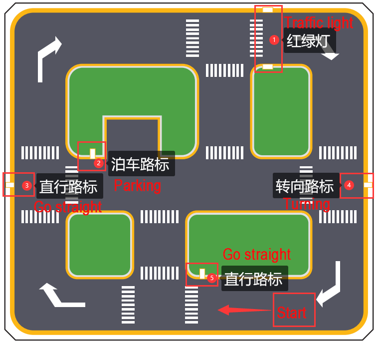

Go straight: instruct the robot car to go forward.


Turn right: Instruct the robot car to turn right.


Park: Command the robot car to park.


The purpose of the road signs is to guide the car during its journey. Once the car recognizes a road sign, it will perform the appropriate actions. Additionally, the car will slow down as it approaches a pedestrian crosswalk.

(3) Traffic Light Setup

In the game of the autonomous driving function, only one traffic light needs to be placed. The exact placement location is illustrated in the figure below:


Traffic light props are utilized to replicate real-world traffic lights on roads. When the car detects the traffic light, it will adhere to the **"stop on red light, go on green light"** rule.

Once all venue props are arranged, refer to the following picture for setting up the venue environment:

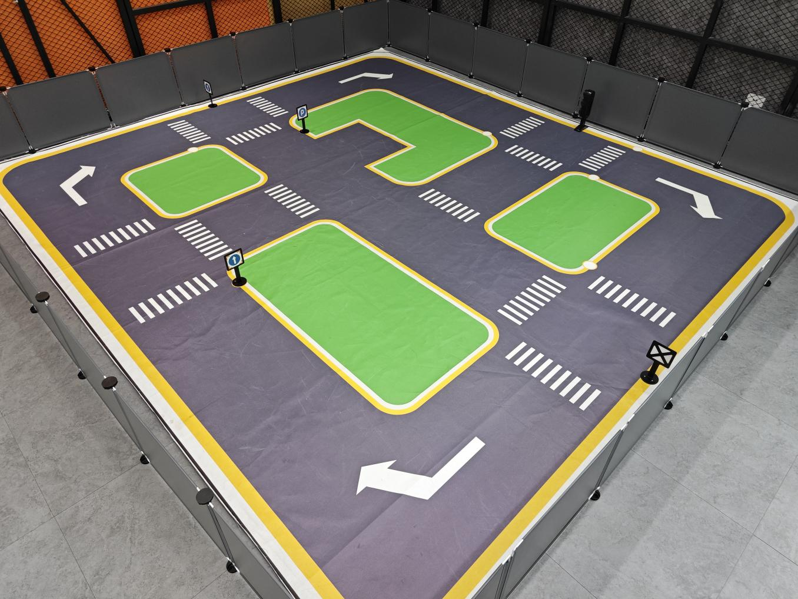

(4) Notice:

:::{Note}
* Ensure that the site has adequate lighting, preferably natural ambient light. Avoid strong direct light sources and colored lights, as they may hinder overall recognition. Pay attention to this aspect when setting up the site.
* While laying out and using the equipment, ensure proper care and protection of the props on the site. In case of incomplete maps or signs, or if the traffic light is damaged and cannot function properly, promptly contact our after-sales personnel to purchase replacements to prevent any disruptions to the recognition process.
:::

### 6.4.2 Operation Steps

:::{Note}
The input command should be case sensitive, and keywords can be complemented using Tab key.
:::

(1) Place the robot at the starting point of the map, and proceed clockwise while recognizing the road signs.

(2) Start the robot, and access the robot system desktop using NoMachine.

(3) Click-on  to open the command-line terminal.

(4) Execute the command and hit Enter to disable the app service.

```
sudo systemctl stop start_app_node.service
```

(5) Run the command to initiate autonomous driving service.

```
roslaunch hiwonder_example self_driving.launch
```

The printed message below indicates a successful startup.


* **Program Outcome**

(1) Lane Keeping

After initiating the game, the car will follow the line patrol and detect the yellow line along the roadside. Depending on whether the yellow line is straight or curved, the car will execute forward movement and turning actions to maintain its position within the lane.

(2) Traffic Light Recognition

When the car encounters a traffic light, it will halt if the light is red and proceed if the light is green. While crossing a pedestrian zebra crossing, the car will automatically decelerate upon detection and move forward cautiously.

(3) Turning and Parking

When the car detects a traffic sign ahead while moving forward, it will respond accordingly to the sign. If it indicates a right turn, the car will turn right and continue forward. If it indicates parking, the car will park sideways.

Once you have experienced this functionality, execute the command or restart the robot to activate the app service.

Run the command to restart the app service. When the buzzer emits a beeping sound, it indicates that the service has been successfully enabled.

```
sudo systemctl start start_app_node.service
```

### 6.4.3 Recognition & Debugging

When the car is driving on the road, it might encounter instances of poor recognition, leading to incorrect actions. In such cases, it's essential to adjust the car's parameters. For specific debugging methods, please consult the following content.

* **Adjust Camera Angle**

When using the autonomous driving function, ensure to check the camera angle on the vehicle and confirm its correctness. Refer to the figure below for the correct position (note: the camera angle has been tested and adjusted for optimal performance. Incorrect camera angle may affect the effectiveness of driverless driving. If the camera angle is incorrect, it can be adjusted by correcting the deviation of the robot arm).


* **Color Threshold Adjustment**

If the car deviates (veers off straight) during driving, you can correct it by adjusting the color threshold. The specific adjustment method is as follows:

(1) Execute the command and hit Enter.

```
sudo systemctl stop start_app_node.service
```

(2) Run the command and hit Enter to enable the camera service.

```
roslaunch hiwonder_peripherals depth_cam.launch
```

(3) Create a new terminal, and type the command to open the color adjustment tool.

```
python3 software/lab_tool/main.py
```

(4) Select **'yellow'**.


(5) Adjust the three LAB colors on the left side to enhance yellow identification, as illustrated in the figure below:


(6) Click-on **'Save'** button.


:::{Note}
It is recommended not to adjust the color threshold for only one section of the road during the adjustment process. Place the car on various sections of the road it will traverse during operation. By adjusting the color thresholds in multiple locations, the results will be more effective.
:::

* **Road Sign and Traffic Light Identification and Debugging**

If the car fails to execute a corresponding action after recognizing a sign or a traffic light, the confidence level in the launch file can be adjusted accordingly. The specific method is as follows:

(1) Create a terminal, and type the command then hit Enter to navigate to the `self_driving` folder.

```
roscd hiwonder_example/scripts/self_driving/
```

(2) Execute the command and hit Enter key.

```
vim self_driving.launch
```

(3) Locate `conf_thresh` parameter, and modify the value behind it as pictured.


(4) Adjust the `conf_thresh` value by slightly lowering it within the range of 0.1 to 0.2, as depicted in the figure below. Set the `conf_thresh` value to 0.65 (modification method: after selecting the value with the left mouse button, press ESC, then press **'i'** to enter text mode and modify it to the desired value. For more detailed editing methods, you can search the Internet using the keyword **"vim editor to modify text"**).


(5) After making the modification, press **"ESC"** in the interface. Then, hold down **"Shift"** + **":"**, followed by typing **"wq"** and pressing Enter to exit the interface. Subsequently, restart the program according to the game instructions to observe the effect. If the desired effect is not achieved, you can adjust the value accordingly. If the result is still unsatisfactory, please refer to point **"(6)"** for further adjustments.

(6) When adjusting the `conf_thresh` value doesn't yield satisfactory results, you may need to retrain the YOLOv5 model. For specific training methods, please refer to: [6.2 Machine Learning Application](#anchor_6_2) to train the model. Once training is completed, load the model path into the launch file, and then restart the game.

* **Program Outcome**

During the car's operation, besides controlling its trajectory by adjusting the color threshold (6.4.3), there are also parameters within the program to regulate the car's movement. If the car continues to exhibit deflection and jitter even after adjusting the color threshold, please refer to the following instructions:

Locate and open the `self_driving.py` file, located at [hiwonder_example\scripts\self_driving\self_driving.py](../_static/source_code/body_control.zip).

* **Going straight parameter adjustment:**

Locate the `lane_x` parameter in the document. You can search for it using the software you are using, as indicated by the red box in the figure below:


The `lane_x` parameter represents the central point of the lane line and is crucial for maintaining straight lane alignment. This parameter is preset by our company, and typically does not require adjustment. However, if you need to fine-tune the effect, you can adjust it within a range of ±3 values.

For adjusting the parameter related to right turns:

Search for the following code section in the file:


The `lane_x` parameter identifies the central point of the lane line. When this position exceeds 150, the car will execute a right turn. Users can control the turning position of the car by adjusting this value appropriately, within a range of ±20. This adjustment depends on the camera angle you've configured. By default, our company sets this parameter, and typically, there is no need to change it.

:::{Note}
Additional supplementary content can be found in the **6.5 Autonomous Driving** section.
:::

## 6.5 Autonomous Driving

### 6.5.1 Lane Keeping

This lesson focuses on controlling the car to move forward and maintain lane alignment through instructions.


* **Preparation**

Before starting, ensure the map is laid out flat and free of wrinkles, with smooth roads and no obstacles. For specific map laying instructions, please refer to [6.4 Autonomous Driving Debugging Lesson](#anchor_6_4) in the same directory as this section for guidance. (In this lesson, we are only experiencing the road driving-line patrol function, so there is no need to place props such as traffic lights and signboards.)

When experiencing this game, ensure it is conducted in a well-lit environment, but avoid direct light shining on the camera to prevent misrecognition.

It is essential to adjust the color threshold beforehand and set the color threshold of the yellow line to avoid misidentification during subsequent recognition. For specific color threshold adjustment, please refer to the [5. ROS+OpenCV Course](5.ROS+OpenCV_Course.md) for reference.

It is recommended to position the car in the middle of the road for easy identification!

* **Program Logic**

Lane keeping involves three main steps: capturing real-time images, processing the images, and comparing the results.

First, we use the camera to capture real-time images of the scene.

Next, we process these images through color recognition, converting them to different color spaces, and applying techniques such as erosion, dilation, and binarization.

In the result comparison phase, we define a Region of Interest (ROI), outline the contours of the processed image, and perform calculations to compare the results.

Finally, based on these comparisons, the robot adjusts its direction to stay centered within the lane.

You can find the source code for this program at:[/home/ubuntu/ros2_ws/src/example/example/self_driving/lane_detect.py](../_static/source_code/self_driving.zip)

* **Operation Steps**

:::{Note}
The input command should be case sensitive, and keywords can be complemented using Tab key.
:::

Start the robot, and access the robot system desktop using NoMachine.

* **Enable the model:**

(1) Click-on  to start the command-line terminal.

(2) Execute the command and hit Enter to disable the app auto-start service.

```
sudo systemctl stop start_app_node.service
```

(3) Run the following command and hit Enter key.

```
ros2 launch example self_driving.launch.py only_line_follow:=true
```

(4) To close the program, click on the terminal window where it's running and press **'Ctrl+C'**.

* **Program Outcome**

After starting the game, place the robot on the road, and it will automatically detect the yellow line at the edge of the road. The robot will then adjust its position based on the detection results.


* **Program Analysis**

The source code of this program is saved in: [ros2_ws/src/example/example/self_driving/lane_detect.py](../_static/source_code/self_driving.zip)

* **Function:**

`image_callback`：

{lineno-start=173}
```python
def image_callback(ros_image):
    cv_image = bridge.imgmsg_to_cv2(ros_image, "bgr8")
    bgr_image = np.array(cv_image, dtype=np.uint8)
    if image_queue.full():
        # 如果队列已满，丢弃最旧的图像(if the queue is full, discard the oldest image)
        image_queue.get()
        # 将图像放入队列(put the image into the queue)
    image_queue.put(bgr_image)
```

Image callback function is used to read the camera node.

* **Class:**

LaneDetector:

{lineno-start=19}
```python
class LaneDetector(object):
    def __init__(self, color):
        # 车道线颜色(lane color)
        self.target_color = color
        # 车道线识别的区域(the recognized area of lane)
        if os.environ['DEPTH_CAMERA_TYPE'] == 'Dabai':
            self.rois = ((338, 360, 0, 320, 0.7), (292, 315, 0, 320, 0.2), (248, 270, 0, 320, 0.1))
        else:
            self.rois = ((450, 480, 0, 320, 0.7), (390, 480, 0, 320, 0.2), (330, 480, 0, 320, 0.1))
        self.weight_sum = 1.0
```

Init:

{lineno-start=24}
```python
if os.environ['DEPTH_CAMERA_TYPE'] == 'Dabai':
            self.rois = ((338, 360, 0, 320, 0.7), (292, 315, 0, 320, 0.2), (248, 270, 0, 320, 0.1))
        else:
            self.rois = ((450, 480, 0, 320, 0.7), (390, 480, 0, 320, 0.2), (330, 480, 0, 320, 0.1))
        self.weight_sum = 1.0
```

Initialize the required parameters and set the ROI to lock the recognition range.

`set_roi`:

{lineno-start=30}
```python
	def set_roi(self, roi):
        self.rois = roi
```

Used to set the Region of Interest (ROI) for recognition.

`get_area_max_contour`:

{lineno-start=34}
```python
	def get_area_max_contour(contours, threshold=100):
        '''
        (retrieve the contour corresponding to the largest area)
        :param contours:
        :param threshold:
        :return:
        '''
        contour_area = zip(contours, tuple(map(lambda c: math.fabs(cv2.contourArea(c)), contours)))
        contour_area = tuple(filter(lambda c_a: c_a[1] > threshold, contour_area))
        if len(contour_area) > 0:
            max_c_a = max(contour_area, key=lambda c_a: c_a[1])
            return max_c_a
        return None
```

Obtains the contour with the maximum area from the list of contours obtained through OpenCV.

`add_horizontal_line`:

{lineno-start=48}
```python
	def add_horizontal_line(self, image):
        #   |____  --->   |————   ---> ——
        h, w = image.shape[:2]
        roi_w_min = int(w/2)
        roi_w_max = w
        roi_h_min = 0
        roi_h_max = h
        roi = image[roi_h_min:roi_h_max, roi_w_min:roi_w_max]  # 截取右半边(capture the right half)
        flip_binary = cv2.flip(roi, 0)  # 上下翻转(flip vertically)
        max_y = cv2.minMaxLoc(flip_binary)[-1][1]  # 提取最上，最左数值为255的点坐标(extract coordinates of points with the highest and leftmost values of 255)

        return h - max_y
```

Adds a horizontal recognition line based on the width and height of the frame and the ROI settings.

`add_vertical_line_far`:

{lineno-start=61}
```python
	def add_vertical_line_far(self, image):
        h, w = image.shape[:2]
        roi_w_min = int(w/8)
        roi_w_max = int(w/2)
        roi_h_min = 0
        roi_h_max = h
        roi = image[roi_h_min:roi_h_max, roi_w_min:roi_w_max]
        flip_binary = cv2.flip(roi, -1)  # 图像左右上下翻转(flip the image horizontally and vertically)
        #cv2.imshow('1', flip_binary)
        # min_val, max_val, min_loc, max_loc = cv2.minMaxLoc(ret)
	        # minVal：最小值(the minimum value)
	        # maxVal：最大值(the maximal value)
	        # minLoc：最小值的位置(the position of minimum value)
	        # maxLoc：最大值的位置(the position of the maximal value)
        # 遍历的顺序，先行再列，行从左到右，列从上到下(the traversal order is row-major, iterating through rows from left to right and columns from top to bottom)
        (x_0, y_0) = cv2.minMaxLoc(flip_binary)[-1]  # 提取最上，最左数值为255的点坐标(extract coordinates of points with the highest and leftmost values of 255)
        y_center = y_0 + 55
        roi = flip_binary[y_center:, :]
        (x_1, y_1) = cv2.minMaxLoc(roi)[-1]
        down_p = (roi_w_max - x_1, roi_h_max - (y_1 + y_center))
        
        y_center = y_0 + 65
        roi = flip_binary[y_center:, :]
        (x_2, y_2) = cv2.minMaxLoc(roi)[-1]
        up_p = (roi_w_max - x_2, roi_h_max - (y_2 + y_center))

        up_point = (0, 0)
        down_point = (0, 0)
        if up_p[1] - down_p[1] != 0 and up_p[0] - down_p[0] != 0:
            up_point = (int(-down_p[1]/((up_p[1] - down_p[1])/(up_p[0] - down_p[0])) + down_p[0]), 0)
            down_point = (int((h - down_p[1])/((up_p[1] - down_p[1])/(up_p[0] - down_p[0])) + down_p[0]), h)

        return up_point, down_point
```

Adds a recognition vertical line for the part of the frame farther from the robot based on the ROI settings.

`get_binary`:

{lineno-start=123}
```python
	def get_binary(self, image):
        # 通过lab空间识别颜色(recognize color through lab space)
        img_lab = cv2.cvtColor(image, cv2.COLOR_RGB2LAB)  # rgb转lab(convert rgb to lab)
        img_blur = cv2.GaussianBlur(img_lab, (3, 3), 3)  # 高斯模糊去噪(Gaussian blur for noise reduction)
        mask = cv2.inRange(img_blur, tuple(lab_data['lab']['Stereo'][self.target_color]['min']), tuple(lab_data['lab']['Stereo'][self.target_color]['max']))  # 二值化(binarization)
        eroded = cv2.erode(mask, cv2.getStructuringElement(cv2.MORPH_RECT, (3, 3)))  # 腐蚀(corrosion)
        dilated = cv2.dilate(eroded, cv2.getStructuringElement(cv2.MORPH_RECT, (3, 3)))  # 膨胀(dilation)

        return dilated
```

Performs color recognition based on the color space and processes the binarized image.

`add_vertical_line_near`:

{lineno-start=95}
```python
	def add_vertical_line_near(self, image):
        # ——|         |——        |
        #   |   --->  |     --->
        h, w = image.shape[:2]
        roi_w_min = 0
        roi_w_max = int(w/2)
        roi_h_min = int(h/2)
        roi_h_max = h
        roi = image[roi_h_min:roi_h_max, roi_w_min:roi_w_max]
        flip_binary = cv2.flip(roi, -1)  # 图像左右上下翻转(flip the image horizontally and vertically)
        #cv2.imshow('1', flip_binary)
        (x_0, y_0) = cv2.minMaxLoc(flip_binary)[-1]  # 提取最上，最左数值为255的点坐标(extract coordinates of points with the highest and leftmost values of 255)
        down_p = (roi_w_max - x_0, roi_h_max - y_0)

        (x_1, y_1) = cv2.minMaxLoc(roi)[-1]
        y_center = int((roi_h_max - roi_h_min - y_1 + y_0)/2)
        roi = flip_binary[y_center:, :] 
        (x, y) = cv2.minMaxLoc(roi)[-1]
        up_p = (roi_w_max - x, roi_h_max - (y + y_center))

        up_point = (0, 0)
        down_point = (0, 0)
        if up_p[1] - down_p[1] != 0 and up_p[0] - down_p[0] != 0:
            up_point = (int(-down_p[1]/((up_p[1] - down_p[1])/(up_p[0] - down_p[0])) + down_p[0]), 0)
            down_point = down_p

        return up_point, down_point, y_center
```

Adds a recognition vertical line for the part of the frame closer to the robot based on the ROI and frame width and height settings.

`__call__`:

{lineno-start=133}
```python
	def __call__(self, image, result_image):
        # 按比重提取线中心(extracting line centers based on weight)
        centroid_sum = 0
        h, w = image.shape[:2]
        max_center_x = -1
        center_x = []
        for roi in self.rois:
            blob = image[roi[0]:roi[1], roi[2]:roi[3]]  # 截取roi(crop roi)
            contours = cv2.findContours(blob, cv2.RETR_EXTERNAL, cv2.CHAIN_APPROX_TC89_L1)[-2]  # 找轮廓(find contour)
            max_contour_area = self.get_area_max_contour(contours, 30)  # 获取最大面积对应轮廓(retrieve the contour with the largest area)
            if max_contour_area is not None:
                rect = cv2.minAreaRect(max_contour_area[0])  # 最小外接矩形(the minimum bounding rectangle)
                box = np.intp(cv2.boxPoints(rect))  # 四个角(four corners)
                for j in range(4):
                    box[j, 1] = box[j, 1] + roi[0]
                cv2.drawContours(result_image, [box], -1, (255, 255, 0), 2)  # 画出四个点组成的矩形(draw a rectangle formed by four points)

                # 获取矩形对角点(retrieve the diagonal points of the rectangle)
                pt1_x, pt1_y = box[0, 0], box[0, 1]
                pt3_x, pt3_y = box[2, 0], box[2, 1]
                # 线的中心点(the center point of line)
                line_center_x, line_center_y = (pt1_x + pt3_x) / 2, (pt1_y + pt3_y) / 2

                cv2.circle(result_image, (int(line_center_x), int(line_center_y)), 5, (0, 0, 255), -1)  # 画出中心点(draw center point)
                center_x.append(line_center_x)
            else:
                center_x.append(-1)
        for i in range(len(center_x)):
            if center_x[i] != -1:
                if center_x[i] > max_center_x:
                    max_center_x = center_x[i]
                centroid_sum += center_x[i] * self.rois[i][-1]
        if centroid_sum == 0:
            return result_image, None, max_center_x
        center_pos = centroid_sum / self.weight_sum  # 按比重计算中心点(calculate the centroid based on weight)
        angle = math.degrees(-math.atan((center_pos - (w / 2.0)) / (h / 2.0)))
        
        return result_image, angle, max_center_x
```


Callback function for the entire class. Performs color recognition here, draws the recognized yellow lines using OpenCV, and then outputs the image, angle, and pixel coordinates X of each ROI recognition contour.

### 6.5.2 Road Sign Detection

* **Preparation**

Before starting, ensure the map is laid out flat and free of wrinkles, with smooth roads and no obstacles. For specific map laying instructions, please refer to [6.4 Autonomous Driving Debugging](#anchor_6_4) in the same directory as this section for guidance.

The road sign model used in this section is trained with YOLOv5. For more details on YOLOv5, please refer to [6.2 Machine Learning Application](#anchor_6_2).

When experiencing this game, ensure it is conducted in a well-lit environment, but avoid direct light shining on the camera to prevent misrecognition.

* **Program Logic**

Firstly, acquire the real-time image from the camera and apply operations such as erosion and dilation.

Next, invoke the YOLOv5 model and compare it with the target screen image.

Finally, execute the appropriate landmark action based on the comparison results.

You can find the source code for this program at:

[/home/ubuntu/ros2_ws/src/example/example/yolov5_detect/yolov5_trt.py](../_static/source_code/yolov5_detect.zip)

* **Operation Steps**

:::{Note}

The following steps exclusively activate road sign detection in the return screen, without executing associated actions. Users seeking direct experience with autonomous driving may bypass this lesson and proceed to **"Integrated Application"** within the same file.

Please make sure to enter commands with strict attention to capitalization, spacing, and you can use the **"Tab"** key to autocomplete keywords.

:::

(1) Start the robot, and access the robot system desktop using NoMachine.

(2) Click-on  to start the command-line terminal.

(3) Execute the command, and hit Enter to disable the app service.

```
sudo systemctl stop start_app_node.service
```

(4) Run the command to navigate to the directory containing programs.

```
cd /home/ubuntu/ros2_ws/src/example/example/yolov5_detect
```

(5) Type the command to open the program source code.

```
vim yolov5_trt.py
```

(6) Press the **'i'** key to enter edit mode. Find the code highlighted in the red box, uncomment line 403, and comment out line 404. Then, go to line 415 and replace **'./yolov5s.engine'** with **'traffic_signs_640s_7_0.engine'**. After making these changes, press **'ESC'**, type **':wq'**, and press Enter to save and exit.


(7) Run the command to initiate game program.

```
python3 yolov5_trt.py
```

(8) Position the road sign in front of the camera, and the robot will recognize the road sign automatically. If you need to terminate this game, press **'Ctrl+C'**.

:::{Note}
In the event that the model struggles to recognize traffic-related signs, it may be necessary to lower the confidence level. Conversely, if the model consistently misidentifies traffic-related signs, raising the confidence level might be advisable.
:::

(1) Run the command to navigate to the directory containing programs.

```
cd /home/ubuntu/ros2_ws/src/example/example/self_driving
```

(2) Enter the command to access the game program.

```
vim self_driving.launch.py
```

The red box represents the confidence value, which can be adjusted to modify the effectiveness of target detection.


* **Program Outcome**

After initiating the game, place the robot on the road within the map. Once the robot identifies landmarks, it will highlight the detected landmarks and annotate them based on the highest confidence level learned from the model.

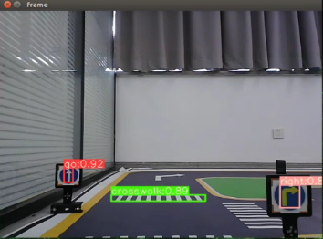

### 6.5.3 Traffic Light Recognition

* **Preparation**

(1) Before starting, ensure the map is laid out flat and free of wrinkles, with smooth roads and no obstacles. For specific map laying instructions, please refer to [6.4 Autonomous Driving Debugging Lesson](#anchor_6_4) in the same directory as this section for guidance.

(2) The road sign model used in this section is trained with YOLOv5. For more details on YOLOv5, please refer to [6.2 Machine Learning Application](#anchor_6_2).

(3) When experiencing this game, ensure it is conducted in a well-lit environment, but avoid direct light shining on the camera to prevent misrecognition.

* **Program Logic**

Firstly, capture a real-time image from the camera and apply operations such as erosion and dilation.

Next, invoke the YOLOv5 model to compare it with the target screen image.

Finally, execute corresponding landmark actions based on the comparison results.

The source code for this program can be found at: [/home/ubuntu/ros2_ws/src/example/example/yolov5_detect/yolov5_trt.py](../_static/source_code/yolov5_detect.zip)

* **Operation Steps**

:::{Note}
* The following steps exclusively activate road sign detection in the return screen, without executing associated actions. Users seeking direct experience with autonomous driving may bypass this lesson and proceed to **"Integrated Application"** within the same file.
* Please make sure to enter commands with strict attention to capitalization, spacing, and you can use the **"Tab"** key to autocomplete keywords.
:::

(1) Start the robot, and access the robot system desktop using NoMachine.

(2) Click-on  to open the command-line terminal.

(3) Execute the command, and hit Enter to disable the app service.

```
sudo systemctl stop start_app_node.service
```

(4) Run the command to navigate to the directory containing programs.

```
cd /home/ubuntu/ros2_ws/src/example/example/yolov5_detect
```

(5) Type the command to open the program source code.

```
vim yolov5_trt.py
```

(6) Press **'i'** to enter edit mode. Locate the code highlighted in the red box, uncomment line 403, and comment out line 404. Next, go to line 415 and replace **'./yolov5s.engine'** with **'traffic_signs_640s_7_0.engine'**. After making these changes, press **'ESC'**, type **':wq'**, and press Enter to save and exit.


(7) Run the command to initiate game program.

```
python3 yolov5_trt.py
```

(8) Position the road sign in front of the camera, and the robot will recognize the road sign automatically. If you need to terminate this game, press **'Ctrl+C'**.

:::{Note}
In the event that the model struggles to recognize traffic-related signs, it may be necessary to lower the confidence level. Conversely, if the model consistently misidentifies traffic-related signs, raising the confidence level might be advisable.
:::

(1) Run the command to navigate to the directory containing programs.

```
cd /home/ubuntu/ros2_ws/src/example/example/self_driving
```

(2) Enter the command to access the game program.

```
vim self_driving.launch.py
```

The red box represents the confidence value, which can be adjusted to modify the effectiveness of target detection.


* **Program Outcome**

After initiating the game, position the robot on the road depicted on the map. Upon recognizing the traffic signal, the robot will assess the color of the signal light and identify frames corresponding to red and green signal lights accordingly.


### 6.5.4 Turning Decision Making

* **Preparation**

(1) Before starting, ensure the map is laid out flat and free of wrinkles, with smooth roads and no obstacles. For specific map laying instructions, please refer to [6.4 Autonomous Driving Debugging Lesson](#anchor_6_4) in the same directory as this section for guidance.

(2) The roadmap model discussed in this section is trained using YOLOv5. For further information on YOLOv5 and related content, please refer to [6.2 Machine Learning Application](#anchor_6_2).

(3) When experiencing this game, ensure it is conducted in a well-lit environment, but avoid direct light shining on the camera to prevent misrecognition.

* **Program Logic**

Firstly, capture the real-time image from the camera and apply operations such as erosion and dilation.

Next, invoke the YOLOv5 model to compare the obtained image with the target screen image.

Finally, based on the comparison outcomes, recognize the steering sign and direct the car accordingly.

The source code of this program is saved in: [/home/ubuntu/ros2_ws/src/example/example/yolov5_detect/yolov5_trt.py](../_static/source_code/yolov5_detect.zip)

* **Operation Steps**

:::{Note}
* The following steps exclusively activate road sign detection in the return screen, without executing associated actions. Users seeking direct experience with autonomous driving may bypass this lesson and proceed to **"Integrated Application"** within the same file.
* Please make sure to enter commands with strict attention to capitalization, spacing, and you can use the **"Tab"** key to autocomplete keywords.
:::

(1) Start the robot, and access the robot system desktop using NoMachine.

(2) Click-on  to open the command-line terminal.

(3) Execute the command, and hit Enter to disable the app service.

```
sudo systemctl stop start_app_node.service
```

(4) Run the command to navigate to the directory containing programs.

```
cd /home/ubuntu/ros2_ws/src/example/example/yolov5_detect
```

(5) Type the command to open the program source code.

```
vim yolov5_trt.py
```

(6) Press **'i'** to enter edit mode. Find the code highlighted in the red box, uncomment the list on line 403, and comment out the list on line 404. Next, go to line 415 and replace **'./yolov5s.engine'** with **'traffic_signs_640s_7_0.engine'**. When finished, press **'ESC'**, type **':wq'**, and press Enter to save and exit.


(7) Run the command to initiate game program.

```
python3 yolov5_trt.py
```

(8) Position the road sign in front of the camera, and the robot will recognize the road sign automatically. If you need to terminate this game, press **'Ctrl+C'**.

:::{Note}
In the event that the model struggles to recognize traffic-related signs, it may be necessary to lower the confidence level. Conversely, if the model consistently misidentifies traffic-related signs, raising the confidence level might be advisable.
:::

(1) Run the command to navigate to the directory containing programs.

```
cd /home/ubuntu/ros2_ws/src/example/example/self_driving
```

(2) Enter the command to access the game program.

```
vim self_driving.launch.py
```

The red box represents the confidence value, which can be adjusted to modify the effectiveness of target detection.


* **Program Outcome**

Once the game begins, position the robot onto the road within the map. As the robot approaches a turning road sign, it will adjust its direction in accordance with the instructions provided by the sign.


### 6.5.5 Autonomous Parking

* **Preparation**

(1) Before starting, ensure the map is laid out flat and free of wrinkles, with smooth roads and no obstacles. For specific map laying instructions, please refer to [6.4 Autonomous Driving Debugging Lesson](#anchor_6_4) in the same directory as this section for guidance.

(2) The roadmap model discussed in this section is trained using YOLOv5. For further information on YOLOv5 and related content, please refer to [6.2 Machine Learning Application](#anchor_6_2).

(3) When experiencing this game, ensure it is conducted in a well-lit environment, but avoid direct light shining on the camera to prevent misrecognition.

* **Program Logic**

Begin by capturing the real-time image from the camera and applying operations such as erosion and dilation.

Next, invoke the YOLOv5 model to compare the obtained image with the target screen image.

Finally, based on the comparison results, identify the parking road sign and autonomously guide the car to park in the designated parking space.

The source code of this program is saved in: [/home/ubuntu/ros2_ws/src/example/example/yolov5_detect/yolov5_trt.py](../_static/source_code/yolov5_detect.zip)

<p id="anchor_6_5_5_3"></p>

* **Operation Steps**

:::{Note}
* The following steps exclusively activate road sign detection in the return screen, without executing associated actions. Users seeking direct experience with autonomous driving may bypass this lesson and proceed to **"Integrated Application"** within the same file.
* Please make sure to enter commands with strict attention to capitalization, spacing, and you can use the **"Tab"** key to autocomplete keywords.
:::

(1) Start the robot, and access the robot system desktop using NoMachine.

(2) Click-on  to open the command-line terminal.

(3) Execute the command, and hit Enter to disable the app service.

```
sudo systemctl stop start_app_node.service
```

(4) Run the command to navigate to the directory containing programs.

```
cd /home/ubuntu/ros2_ws/src/example/example/yolov5_detect
```

(5) Type the command to open the program source code.

```
vim yolov5_trt.py
```

(6) Press **'i'** to enter edit mode. Find the code highlighted in the red box, uncomment the list on line 403, and comment out the list on line 404. Then, go to line 415 and replace **'./yolov5s.engine'** with **'traffic_signs_640s_7_0.engine'**. After making these changes, press **'ESC'**, type **':wq'**, and press Enter to save and exit.


(7) Run the command to initiate game program.

```
python3 yolov5_trt.py
```

(8) Position the road sign in front of the camera, and the robot will recognize the road sign automatically. If you need to terminate this game, press **'Ctrl+C'**.

:::{Note}
In the event that the model struggles to recognize traffic-related signs, it may be necessary to lower the confidence level. Conversely, if the model consistently misidentifies traffic-related signs, raising the confidence level might be advisable.
:::

(1) Run the command to navigate to the directory containing programs.

```
cd /home/ubuntu/ros2_ws/src/example/example/self_driving
```

(2) Enter the command to access the game program.

```
vim self_driving.launch.py
```

The red box represents the confidence value, which can be adjusted to modify the effectiveness of target detection.


* **Program Outcome**

After initiating the game, position the robot on the road within the map. As the robot progresses towards the parking sign, it will automatically park in the designated parking space based on the instructions provided by the road sign.

<p id="anchor_6_5_5_3"></p>

* **Parameter Adjustment**

If the robot stops upon recognizing the parking sign and the parking position is not optimal, adjustments to the parameters in the program source code can be made.

(1) Click-on  to start the command-line terminal.

(2) Execute the command to navigate to the directory containing game programs.

```
cd ros2_ws/src/example/example/self_driving/
```

(3) Run the command to access the source code.

```
vim self_driving.py
```

(4) Press the **"i"** key to enter insert mode and locate the code within the red box. Adjusting the parameters within the red box allows you to control the starting position for the robot to initiate the parking operation. Decreasing the parameters will result in the robot stopping closer to the zebra crossing, while increasing them will cause the robot to stop further away. Once adjustments are made, press the **"ESC"** key, type **":wq"**, and press Enter to save and exit.


You can adjust the parking processing function to alter the parking position of the robot. Initially, the parking action sets the linear speed in the negative direction of the Y-axis (right of the robot) to 0.2 meters per second, with a forward movement time of (0.38/2) seconds. To position the robot in the ideal location on the left side of the parking space, modify the speed and time accordingly.


### 6.5.6 Integrated Application

This lesson provides instructions for implementing comprehensive driverless game on the robot, covering lane keeping, road sign detection, traffic light recognition, steering decision-making, and self-parking.

* **Preparation**

(1) Map Setup

To ensure accurate navigation, place the map on a flat, smooth surface, free of wrinkles and obstacles. Position all road signs and traffic lights at designated locations on the map, facing clockwise. The starting point and locations of road signs are indicated below:

:::{Note}
Tools required for autonomous driving are available for separate purchase. If you are interested, kindly reach out to us at **support@hiwonder.com**.
:::


(2) Color Threshold Adjustment

Due to variations in light sources, it's essential to adjust the color thresholds for **'black, white, red, green, blue, and yellow'** based on the guidelines provided in the [5.ROS+OpenCV Course](resources_download.md) prior to starting. If the robot encounter inaccurate recognition while moving forward, readjust the color threshold specifically in the map area where recognition fails.

* **Program Logic**

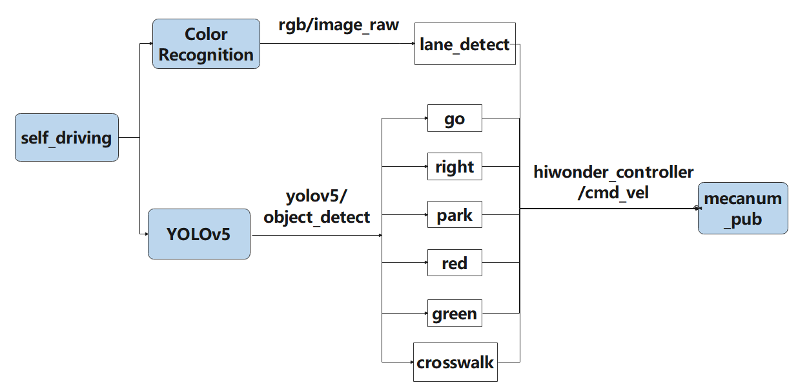

Actions implemented so far include:

(1) Following the yellow line in the outermost circle of the patrol map.

(2) Slowing down and passing if a zebra crossing is detected.

(3) Making a turn upon detection of a turn sign.

(4) Parking the vehicle and entering the parking lot upon detection of a stop sign.

(5) Halting when a red light is detected.

(6) Slowing down when passing a detected street light.

First, load the model file trained by YOLOv5 and the required library files, obtain real-time camera images, and perform operations such as erosion and dilation on the images. Next, identify the target color line segment in the image and gather information such as size and center point of the target image. Then, invoke the model through YOLOv5 and compare it with the target screen image. Finally, adjust the forward direction based on the offset comparison of the target image's center point to keep the robot in the middle of the road. Additionally, perform corresponding actions based on different recognized landmark information during map traversal.

The source code for this program can be found at: [/home/ubuntu/ros2_ws/src/example/example/self_driving/self_driving.py](../_static/source_code/self_driving.zip)

* **Operation Steps**

:::{Note}

The input command should be case sensitive, and keywords can be implemented using Tab key.

:::

(1) Start the robot, and access the robot system desktop using NoMachine.

(2) Click-on  to start the command-line terminal.

(3) Execute the command, and hit Enter to disable the app service.

```
sudo systemctl stop start_app_node.service
```

(4) Run the following command and hit Enter key.

```
ros2 launch example self_driving.launch.py
```

(5) To close the program, click on the terminal window where it's running and press **'Ctrl+C'**.


* **Program Outcome**

(1) Lane Keeping

Upon initiating the game, the car will track the line and identify the yellow line at the road's edge. It will execute forward and turning actions based on the straightness or curvature of the yellow line to maintain lane position.

(2) Traffic Light Recognition

When the car encounters a traffic light, it will halt if the light is red and proceed if it's green. Upon approaching a zebra crossing, the car will automatically decelerate and proceed cautiously.

(3) Turn and Parking Signs

Upon detecting traffic signs while moving forward, the car will respond accordingly. If it encounters a right turn sign, it will execute a right turn and continue forward. In the case of a parking sign, it will execute a parking maneuver.

Following these rules, the robot will continuously progress forward within the map.

* **Program Analysis**

The source code of this program is saved in: [ros2_ws/src/example/example/self_driving/self_driving.py](../_static/source_code/self_driving.zip)

Function:

{lineno-start=411}
```python
def main():
    node = SelfDrivingNode('self_driving')
    executor = MultiThreadedExecutor()
    executor.add_node(node)
    executor.spin()
    node.destroy_node()
```

Initiate autonomous driving class.

Class:

{lineno-start=30}
```python
class SelfDrivingNode(Node):
    def __init__(self, name):
        rclpy.init()
        super().__init__(name, allow_undeclared_parameters=True, automatically_declare_parameters_from_overrides=True)
        self.name = name
        self.is_running = True
        self.pid = pid.PID(0.01, 0.0, 0.0)
        self.param_init()
```

`init`:

{lineno-start=33}
```python
        super().__init__(name, allow_undeclared_parameters=True, automatically_declare_parameters_from_overrides=True)
        self.name = name
        self.is_running = True
        self.pid = pid.PID(0.01, 0.0, 0.0)
        self.param_init()

        self.image_queue = queue.Queue(maxsize=2)
        self.classes = ['go', 'right', 'park', 'red', 'green', 'crosswalk']
        self.display = True
        self.bridge = CvBridge()
        self.lock = threading.RLock()
        self.colors = common.Colors()
        # signal.signal(signal.SIGINT, self.shutdown)
        self.machine_type = os.environ.get('MACHINE_TYPE')
        self.lane_detect = lane_detect.LaneDetector("yellow")

        self.mecanum_pub = self.create_publisher(Twist, '/controller/cmd_vel', 1)
        self.joints_pub = self.create_publisher(ServosPosition, '/servo_controller', 1) # 舵机控制(servo control)
        self.result_publisher = self.create_publisher(Image, '~/image_result', 1)

        self.create_service(Trigger, '~/enter', self.enter_srv_callback) # 进入玩法(enter game)
        self.create_service(Trigger, '~/exit', self.exit_srv_callback) # 退出玩法(exit game)
        self.create_service(SetBool, '~/set_running', self.set_running_srv_callback)
        # self.heart = Heart(self.name + '/heartbeat', 5, lambda _: self.exit_srv_callback(None))
        timer_cb_group = ReentrantCallbackGroup()
        self.client = self.create_client(Trigger, '/controller_manager/init_finish')
        self.client.wait_for_service()
        self.client = self.create_client(Trigger, '/yolov5/init_finish')
        self.client.wait_for_service()
        self.start_yolov5_client = self.create_client(Trigger, '/yolov5/start', callback_group=timer_cb_group)
        self.start_yolov5_client.wait_for_service()
        self.stop_yolov5_client = self.create_client(Trigger, '/yolov5/stop', callback_group=timer_cb_group)
        self.stop_yolov5_client.wait_for_service()

        self.timer = self.create_timer(0.0, self.init_process, callback_group=timer_cb_group)
```

Initialize the required parameters, obtain the current robot category, set the line-following color to yellow, start the chassis control, servo control, and image reading. Set up three types of services: enter, exit, and start, and read the YOLOv5 node.

`init_process`:

{lineno-start=69}
```python
    def init_process(self):
        self.timer.cancel()

        self.mecanum_pub.publish(Twist())
        if not self.get_parameter('only_line_follow').value:
            self.send_request(self.start_yolov5_client, Trigger.Request())
        if self.machine_type != 'JetRover_Tank':
            set_servo_position(self.joints_pub, 1, ((10, 500), (5, 500), (4, 250), (3, 0), (2, 750), (1, 500)))  # 初始姿态
        else:
            set_servo_position(self.joints_pub, 1, ((10, 500), (5, 500), (4, 230), (3, 0), (2, 750), (1, 500)))  # 初始姿态
        time.sleep(1)
        
        if 1:#self.get_parameter('start').value:
            self.display = True
            self.enter_srv_callback(Trigger.Request(), Trigger.Response())
            request = SetBool.Request()
            request.data = True
            self.set_running_srv_callback(request, SetBool.Response())

        #self.park_action() 
        threading.Thread(target=self.main, daemon=True).start()
        self.create_service(Trigger, '~/init_finish', self.get_node_state)
        self.get_logger().info('\033[1;32m%s\033[0m' % 'start')
```

Initialize the current robotic arm and start the main function.

`param_init`:

{lineno-start=93}
```python
    def param_init(self):
        self.start = False
        self.enter = False

        self.have_turn_right = False
        self.detect_turn_right = False
        self.detect_far_lane = False
        self.park_x = -1  # 停车标识的x像素坐标(the x-coordinate of the parking sign pixel)

        self.start_turn_time_stamp = 0
        self.count_turn = 0
        self.start_turn = False  # 开始转弯(begin turning)
```

Initialize parameters required for position recognition or usage.

`get_node_state`:

{lineno-start=130}
```python
    def get_node_state(self, request, response):
        response.success = True
        return response
```

Obtain the current state of the node.

`send_request`:

{lineno-start=134}
```python
    def send_request(self, client, msg):
        future = client.call_async(msg)
        while rclpy.ok():
            if future.done() and future.result():
                return future.result()
```

Used to publish service requests.

`enter_srv_callback`:

{lineno-start=140}
```python
    def enter_srv_callback(self, request, response):
        self.get_logger().info('\033[1;32m%s\033[0m' % "self driving enter")
        with self.lock:
            self.start = False
            camera = 'depth_cam'#self.get_parameter('depth_camera_name').value
            self.create_subscription(Image, '/%s/rgb/image_raw' % camera, self.image_callback, 1)
            self.create_subscription(ObjectsInfo, '/yolov5/object_detect', self.get_object_callback, 1)
            self.mecanum_pub.publish(Twist())
            self.enter = True
        response.success = True
        response.message = "enter"
        return response
```

Service for entering autonomous driving gameplay, start reading images and YOLOv5 recognition content, initialize speed.

`exit_srv_callback`:

{lineno-start=153}
```python
    def exit_srv_callback(self, request, response):
        self.get_logger().info('\033[1;32m%s\033[0m' % "self driving exit")
        with self.lock:
            try:
                if self.image_sub is not None:
                    self.image_sub.unregister()
                if self.object_sub is not None:
                    self.object_sub.unregister()
            except Exception as e:
                self.get_logger().info('\033[1;32m%s\033[0m' % str(e))
            self.mecanum_pub.publish(Twist())
        self.param_init()
        response.success = True
        response.message = "exit"
        return response
```

Service for exiting autonomous driving gameplay, stop reading images and YOLOv5 recognition content, initialize speed, reset parameters.

`set_running_srv_callback`:

{lineno-start=169}
```python
    def set_running_srv_callback(self, request, response):
        self.get_logger().info('\033[1;32m%s\033[0m' % "set_running")
        with self.lock:
            self.start = request.data
            if not self.start:
                self.mecanum_pub.publish(Twist())
        response.success = True
        response.message = "set_running"
        return response
```

Start autonomous driving game, set the start parameter to True.

`Shutdown`:

{lineno-start=179}
```python
    def shutdown(self, signum, frame):  # ctrl+c关闭处理(press Ctrl+C to terminate the process)
        self.is_running = False
```

Callback function after closing the program, used to stop the currently running program.

`image_callback`:

{lineno-start=182}
```python
    def image_callback(self, ros_image):  # 目标检查回调(target inspection callback)
        cv_image = self.bridge.imgmsg_to_cv2(ros_image, "rgb8")
        rgb_image = np.array(cv_image, dtype=np.uint8)
        if self.image_queue.full():
            # 如果队列已满，丢弃最旧的图像(if the queue is full, discard the oldest image)
            self.image_queue.get()
        # 将图像放入队列(put the image to the queue)
        self.image_queue.put(rgb_image)
```

Image callback function, enqueues images and discards expired ones.

`park_action`:

{lineno-start=192}
```python
    def park_action(self):
        if self.machine_type == 'JetRover_Mecanum': 
            twist = Twist()
            twist.linear.y = -0.2
            self.mecanum_pub.publish(twist)
            time.sleep(0.38/0.2)
        elif self.machine_type == 'JetRover_Acker':
            twist = Twist()
            twist.linear.x = 0.15
            twist.angular.z = twist.linear.x*math.tan(-0.6)/0.213
            self.mecanum_pub.publish(twist)
            time.sleep(3)

            twist = Twist()
            twist.linear.x = 0.15
            twist.angular.z = -twist.linear.x*math.tan(-0.6)/0.213
            self.mecanum_pub.publish(twist)
            time.sleep(2)

            twist = Twist()
            twist.linear.x = -0.15
            twist.angular.z = twist.linear.x*math.tan(-0.6)/0.213
            self.mecanum_pub.publish(twist)
            time.sleep(1.5)

            set_servo_position(self.joints_pub, 0.1, ((9, 500), ))
        else:
            twist = Twist()
            twist.angular.z = -1
            self.mecanum_pub.publish(twist)
            time.sleep(1.5)
            self.mecanum_pub.publish(Twist())
            twist = Twist()
            twist.linear.x = 0.2
            self.mecanum_pub.publish(twist)
            time.sleep(0.65/0.2)
            self.mecanum_pub.publish(Twist())
            twist = Twist()
            twist.angular.z = 1
            self.mecanum_pub.publish(twist)
            time.sleep(1.5)
        self.mecanum_pub.publish(Twist())
```

Parking logic, runs three different parking strategies according to three different chassis types.

`get_object_callback`:

{lineno-start=383}
```python
    # 获取目标检测结果(get target detected result)
    def get_object_callback(self, msg):
        self.objects_info = msg.objects
        if self.objects_info == []:  # 没有识别到时重置变量(reset variables when no detection is made)
            self.traffic_signs_status = None
            self.crosswalk_distance = 0
        else:
            min_distance = 0
            for i in self.objects_info:
                class_name = i.class_name
                center = (int((i.box[0] + i.box[2])/2), int((i.box[1] + i.box[3])/2))
                
                if class_name == 'crosswalk':  
                    if center[1] > min_distance:  # 获取最近的人行道y轴像素坐标(retrieve the closest pedestrian crossing y-axis pixel coordinate)
                        min_distance = center[1]
                elif class_name == 'right':  # 获取右转标识(retrieve the right turn sign)
                    self.count_right += 1
                    self.count_right_miss = 0
                    if self.count_right >= 10:  # 检测到多次就将右转标志至真(if detected multiple times, set the right turn sign to true)
                        self.turn_right = True
                        self.count_right = 0
                elif class_name == 'park':  # 获取停车标识中心坐标(retrieve the center coordinates of the stop sign)
                    self.park_x = center[0]
                elif class_name == 'red' or class_name == 'green':  # 获取红绿灯状态(get the state of traffic light)
                    self.traffic_signs_status = i
        
            self.crosswalk_distance = min_distance
```

Callback function for reading YOLOv5, obtains the categories currently recognized by YOLOv5.

Main:

{lineno-start=235}
```python
    def main(self):
        while self.is_running:
            time_start = time.time()
            try:
                image = self.image_queue.get(block=True, timeout=1)
            except queue.Empty:
                if not self.is_running:
                    break
                else:
                    continue
            result_image = image.copy()
            if self.start:
                h, w = image.shape[:2]

                # 获取车道线的二值化图(obtain the binary image of the lane lines)
                binary_image = self.lane_detect.get_binary(image)
                # 检测到斑马线,开启减速标志(zebra crossing detected, activate deceleration sign)
                if 450 < self.crosswalk_distance and not self.start_slow_down:  # 只有足够近时才开始减速(only start decelerating when close enough)
                    self.count_crosswalk += 1
                    if self.count_crosswalk == 3:  # 多次判断，防止误检测(multiple checks to prevent false detection)
                        self.count_crosswalk = 0
                        self.start_slow_down = True  # 减速标识(deceleration sign)
                        self.count_slow_down = time.time()  # 减速固定时间(decelerate for a fixed duration)
                else:  # 需要连续检测，否则重置(continuous detection required, otherwise reset)
                    self.count_crosswalk = 0

                twist = Twist()
                # 减速行驶处理(deceleration driving processing)
                if self.start_slow_down:
                    if self.traffic_signs_status is not None:
                        # 通过面积判断离灯灯远近，如果太近那么即使是红灯也不会停(use area to determine the distance from the traffic light. If too close, even if it's a red light, the vehicle won't stop)
                        area = abs(self.traffic_signs_status.box[0] - self.traffic_signs_status.box[2])*abs(self.traffic_signs_status.box[1] - self.traffic_signs_status.box[3])
                        if self.traffic_signs_status.class_name == 'red' and area < 1000:  # 如果遇到红灯就停车(if encountering a red light, stop the vehicle)
                            self.mecanum_pub.publish(Twist())
                            self.stop = True
                        elif self.traffic_signs_status.class_name == 'green':  # 遇到绿灯，速度放缓(if encountering a green light, reduce speed)
                            twist.linear.x = self.slow_down_speed
                            self.stop = False
                    if not self.stop:  # 其他非停止的情况速度放缓， 同时计时，时间=斑马线的长度/行驶速度(in other non-stop situations, slow down speed, and at the same time, measure time, where time equals the length of the zebra crossing divided by the driving speed)
                        twist.linear.x = self.slow_down_speed
                        if time.time() - self.count_slow_down > self.crosswalk_length/twist.linear.x:
                            self.start_slow_down = False
                else:
                    twist.linear.x = self.normal_speed  # 直走正常速度(straight ahead at normal speed)

                # 检测到 停车标识+斑马线 就减速, 让识别稳定(decelerate upon detecting a stop sign + zebra crossing to stabilize recognition)
                if 0 < self.park_x and 135 < self.crosswalk_distance:
                    twist.linear.x = self.slow_down_speed
                    if self.machine_type != 'JetRover_Acker':
                        if not self.start_park and 255 < self.crosswalk_distance:  # 离斑马线足够近时就开启停车(activate stop when close enough to the zebra crossing)
                            self.mecanum_pub.publish(Twist())
                            self.start_park = True
                            self.stop = True
                            threading.Thread(target=self.park_action).start()  
                    elif self.machine_type == 'JetRover_Acker':
                        if not self.start_park and 176 < self.crosswalk_distance:  # 离斑马线足够近时就开启停车(when close enough to the zebra crossing, initiate stopping)
                            self.mecanum_pub.publish(Twist())
                            self.start_park = True
                            self.stop = True
                            threading.Thread(target=self.park_action).start()                       
                
                # 右转及停车补线策略(right turn and stop line filling strategy)
                if self.turn_right:
                    y = self.lane_detect.add_horizontal_line(binary_image)
                    if 0 < y < 300:
                        roi = [(0, y), (w, y), (w, 0), (0, 0)]
                        cv2.fillPoly(binary_image, [np.array(roi)], [0, 0, 0])  # 将上面填充为黑色，防干扰(fill the above area with black to prevent interference)
                        min_x = cv2.minMaxLoc(binary_image)[-1][0]
                        cv2.line(binary_image, (min_x, y), (w, y), (255, 255, 255), 40)  # 画虚拟线来驱使转弯(draw virtual lines to guide the turn)
                elif 0 < self.park_x and not self.start_turn:  # 检测到停车标识需要填补线，使其保持直走(if a stop sign is detected, fill in the lines to keep the vehicle going straight)
                    if not self.detect_far_lane:
                        up, down, center = self.lane_detect.add_vertical_line_near(binary_image)
                        binary_image[:, :] = 0  # 全置黑，防止干扰(set all to black to prevent interference)
                        if 50 < center < 80:  # 当将要看不到车道线时切换到识别较远车道线(switch to recognizing farther lane lines when lane lines are about to become invisible)
                            self.detect_far_lane = True
                    else:
                        up, down = self.lane_detect.add_vertical_line_far(binary_image)
                        binary_image[:, :] = 0
                    if up != down:
                        cv2.line(binary_image, up, down, (255, 255, 255), 20)  # 手动画车道线(manually draw lane lines)

                result_image, lane_angle, lane_x = self.lane_detect(binary_image, image.copy())  # 在处理后的图上提取车道线中心(extract lane center from processed image with lane lines)
                # cv2.imshow('image', image)
                # 巡线处理(line following processing)
                if lane_x >= 0 and not self.stop:
                    if lane_x > 150:  # 转弯(turning)
                        if self.turn_right:  # 如果是检测到右转标识的转弯(if it's a right turn sign detected, initiate the turn)
                            self.count_right_miss += 1
                            if self.count_right_miss >= 50:
                                self.count_right_miss = 0
                                self.turn_right = False
                        self.count_turn += 1
                        if self.count_turn > 5 and not self.start_turn:  # 稳定转弯(steady turn)
                            self.start_turn = True
                            self.count_turn = 0
                            self.start_turn_time_stamp = time.time()
                        if self.machine_type != 'JetRover_Acker': 
                            twist.angular.z = -0.45  # 转弯速度(turning speed)
                        else:
                            twist.angular.z = twist.linear.x*math.tan(-0.6)/0.213  # 转弯速度(turning speed)
                    else:  # 直道由pid计算转弯修正(PID calculates turn correction for straight road)
                        self.count_turn = 0
                        if time.time() - self.start_turn_time_stamp > 3 and self.start_turn:
                            self.start_turn = False
                        if not self.start_turn:
                            self.pid.SetPoint = 100  # 在车道中间时线的坐标(the coordinates of the line when in the middle of the lane)
                            self.pid.update(lane_x)
                            if self.machine_type != 'JetRover_Acker':
                                twist.angular.z = common.set_range(self.pid.output, -0.8, 0.8)
                            else:
                                twist.angular.z = twist.linear.x*math.tan(common.set_range(self.pid.output, -0.1, 0.1))/0.213
                        else:
                            if self.machine_type == 'JetRover_Acker':
                                twist.angular.z = 0.15*math.tan(-0.6)/0.213  # 转弯速度(turning speed)
                    self.mecanum_pub.publish(twist)
                else:
                    self.pid.clear()

                # 绘制识别的物体，由于物体检测的速度小于线检测的速度，所以绘制的框会有所偏离(draw recognized objects. Due to the slower speed of object detection compared to line detection, the drawn boxes may deviate slightly)
                if self.objects_info != []:
                    for i in self.objects_info:
                        box = i.box
                        class_name = i.class_name
                        cls_conf = i.score
                        cls_id = self.classes.index(class_name)
                        color = colors(cls_id, True)
                        plot_one_box(
                            box,
                            result_image,
                            color=color,
                            label="{}:{:.2f}".format(class_name, cls_conf),
                        )
            else:
                time.sleep(0.01)

            bgr_image = cv2.cvtColor(result_image, cv2.COLOR_RGB2BGR)
            if self.display:
                cv2.imshow('result', bgr_image)
                key = cv2.waitKey(1)
                if key == ord('q') or key == 27:  # 按q或者esc退出(press q or esc to exit)
                    self.is_running = False
            self.result_publisher.publish(self.bridge.cv2_to_imgmsg(bgr_image, "bgr8"))
            time_d = 0.03 - (time.time() - time_start)
            if time_d > 0:
                time.sleep(time_d)
        self.mecanum_pub.publish(Twist())
        rclpy.shutdown()
```

The main function within the class, runs different line-following strategies according to different chassis types.

## 6.6 FAQ

(1) The robot exhibits inconsistent performance during line patrolling, often veering off course.

Adjust the color threshold to better suit the lighting conditions of the actual scene. For precise instructions on color threshold adjustment, please consult [5. ROS+OpenCV Lesson](5.ROS+OpenCV_Course.md) for detailed guidance.

(2) The robot's turning radius appears to be either too large or too small.

① Ensure correct adjustment of the robot arm deviation. For detailed instructions on robot arm deviation adjustment, please refer to [7. Robot Arm Control Course->7.1 Basic Control](7.Robot_Arm_Control_Course.md#basic-control) for comprehensive learning.

② Modify the line patrol processing code

Navigate to the game program path by entering the command:

```
cd ros2_ws\src\example\example\self_driving
```

Open the game program by entering the command:

```
vim self_driving.py
```

The red box denotes the lane's center point, which can be adjusted to fine-tune the turning effect. Decreasing the value will result in earlier turns, while increasing it will cause later turns.


(3) The parking location is suboptimal.

You can adjust the parking processing function or modify the starting position of the parking operation. For detailed instructions, please consult [6.5.5 Autonomous Parking -> Parameter Adjustment](#anchor_6_5_5_3) for reference and learning.

(4) Inaccurate traffic sign recognition.

Adjust the target detection confidence. For detailed instructions, please refer to [6.5.5 Autonomous Parking -> Operation Steps](#anchor_6_5_5_3) for comprehensive learning.