# 6. ROS1-Mapping Navigation Lesson

## 6.1 Mapping

### 6.1.1 SLAM Mapping Principle

* **Introduction to SLAM** 

SLAM stands for Simultaneous Localization and Mapping.

Localization involves determining the pose of a robot in a coordinate system,, The origin of orientation of the coordinate system can be obtained from the first keyframe, existing global maps, landmarks or GPS data.

Mapping involves creating a map of the surrounding environment perceived by the robot. The basic geometric elements of the map are points. The main purpose of the map is for localization and navigation. Navigation can be divided into guidance and control. Guidance includes global planning and local planning, while control involves controlling the robot's motion after the planning is done.

* **SLAM Mapping Principle**


SLAM mapping is composed of following three processes:

**Pre-processing**: optimize the raw point cloud data from Lidar by eliminating some defective data or filtering.

Generally, the surrounding environmental information obtained by a Lidar is called as “point cloud”, which represents a portion of the environment that the robot perceive. The collected object information is presented as a series of scattered data information with exact angles and distances.

**Matching:** the point cloud data of this current local environment is matched by finding the corresponding position on the established map.

The SLAM system calculates the distance and pose changes of Lidar’s relative motion by matching and comparing point clouds at different moments. This process completes the self-localization of the robot.

**Map fusion:** the new round of data from Lidar is merged into the original map to complete the map update.

With lidar as a signal source, pulse laser emitted by the Lidar’s emitter hits the surrounding obstacles, causing scattering. A portion of the light waves reflects back to the Lidar’s receiver, and by utilizing the principle of laser ranging, the distance from the Lidar to the target point can be calculated. By continuously scanning the target object with pulse lasers, data of all target points on the object can be obtained. After performing imaging processing on this data, an accurate three-dimensional image can be generated.

* **Notes**

1.  Begin the mapping process by positioning the robot in front of a straight wall or within an enclosed box. This enhances the Lidar's capacity to capture a higher density of scanning points.

2.  Initiate a 360-degree scan of the environment using the Lidar to ensure a comprehensive survey of the surroundings. This step is crucial to guarantee the accuracy and completeness of the resulting map.

3.  For larger areas, it's recommended to complete a full mapping loop before focusing on scanning smaller environmental details. This approach enhances the overall efficiency and precision of the mapping process.

* **Judge Mapping Result**

Finally, assess the robot's navigation process against the following criteria once the mapping is complete:

1)  Ensure that the edges of obstacles within the map are distinctly defined.

2)  Check for any disparities between the map and the actual environment, such as the presence of closed loops or inconsistencies.

3)  Verify the absence of gray areas within the robot's motion area, indicating areas that haven't been adequately scanned.

4)  Confirm that the map doesn't incorporate obstacles that won't exist during subsequent localization.

5)  Validate the map's coverage of the entire extent of the robot's motion area.

* **Mapping Feature Pack**

The '**hiwonder_slam**' robot mapping package comes with pre-installed Gmapping, Hector, Cartographer, Karto, Explore_Lite, Frontier, and RRT mapping algorithms. Activation of different mapping algorithms can be done through the '**slam.launch**' file within this package.

During startup, the execution of the '**bringup.launch**' file initializes nodes for the depth camera, robot base, joystick, mobile app, and other components. Subsequently, it determines the suitable launch file for the selected mapping algorithm based on the specified parameters.

```py
<?xml version="1.0"?>
<launch>
    <arg name="sim"         default="false"/>
    <arg name="app"         default="false"/>
    <arg     if="$(arg app)" name="robot_name"  default="/"/>
    <arg unless="$(arg app)" name="robot_name"  default="$(env HOST)"/>
    <arg     if="$(arg app)" name="master_name" default="/"/>
    <arg unless="$(arg app)" name="master_name" default="$(env MASTER)"/>

    <!--建图方法选择-->
    <arg name="slam_methods" default="gmapping" doc="slam type 
        [gmapping, cartographer, hector, karto, frontier, explore, rrt_exploration, rtabmap]"/>

    <arg name="gmapping"        default="gmapping"/>
    <arg name="cartographer"    default="cartographer"/>
    <arg name="hector"          default="hector"/>
    <arg name="karto"           default="karto"/>
    <arg name="frontier"        default="frontier"/>
    <arg name="explore"         default="explore"/>
    <arg name="rrt_exploration" default="rrt_exploration"/>
    <arg name="rtabmap"         default="rtabmap"/>

    <include file="$(find hiwonder_slam)/launch/include/hiwonder_robot.launch">
        <arg name="sim"         value="$(arg sim)"/>
        <arg name="app"         value="$(arg app)"/>
        <arg name="robot_name"  value="$(arg robot_name)"/>
        <arg name="master_name" value="$(arg master_name)"/>
        <arg if="$(eval slam_methods == hector)" name="enable_odom"    value="false"/>
    </include>

    <include file="$(find hiwonder_slam)/launch/include/slam_base.launch">
        <arg name="sim"             value="$(arg sim)"/>
        <arg name="slam_methods"    value="$(arg slam_methods)"/>
        <arg name="robot_name"      value="$(arg robot_name)"/>
    </include>
</launch>
```

**1. Intrinsic Structure of Feature Pack**

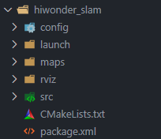

The above diagram illustrates the internal file structure of the mapping package. The corresponding functionalities are organized as follows:

1. config: This folder contains algorithm parameter configuration files.

2. launch: This folder includes launch files for various package functionalities.

3. maps: Map message files are saved in this folder.

4. rviz: Simulation maps and robot model files are stored in this folder.

5. src: Algorithm source files are called from this folder.

6. CMakeLists.txt: This file serves as a compilation dependency.

7. package.xml: This file provides a description of the package.

**2. Feature Pack Description**

1)  Config folder contains the configuration files of the following mapping algorithms, including cartographer, frontier, Gmapping, etc.

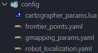

For instance, when we examine a section of the configuration file for the Cartographer mapping algorithm, it appears as follows:

```py
master_name = os.getenv("MASTER")
robot_name = os.getenv("HOST")
prefix = os.getenv("prefix")
MAP_FRAME = "map"
ODOM_FRAME = "odom"
BASE_FRAME = "base_footprint"
if(prefix ~= "/")
then
    MAP_FRAME = master_name .. "/" .. MAP_FRAME
    ODOM_FRAME = robot_name .. "/" .. ODOM_FRAME
    BASE_FRAME = robot_name .. "/" .. BASE_FRAME
end
```

To get a more detailed introduction to this section, you can proceed to study the following content.

2)  The '**launch**' folder is the directory where various functionalities within the package are initiated, including launch files for different mapping algorithms.


3)  The '**maps**' folder is intended for storing map message files. To do this, follow the two commands below in the future:

Navigate to the '**maps**' folder using the command "**roscd hiwonder_slam/maps**"

Execute the command "**rosrun map_server map_saver map:=/robot_1/map -f map_01**," where "**robot_1**" indicates the robot's name and "**map_01**" is the map's name.

This process will save pertinent map details in the '**maps**' folder, making it easier to make modifications and subsequently invoke navigation functionalities.


4. The '**rviz**' folder is designated for storing simulation maps and robot model files. Save the simulation models needed for different mapping algorithms in this folder. This facilitates their later use when launching RVIZ to inspect mapping results

   

5. The '**src**' folder serves as the directory for calling algorithm source files.

   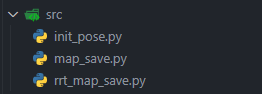

   init_pose.py: This script is utilized for initializing the robot's pose, establishing its current state.

   map_save.py: This script is employed to save map information.

   rrt_map_save.py: Specifically designed for the autonomous mapping algorithm using the RRT algorithm, this script is used to save map information.

6. Ultimately, '**CMakeLists.txt**’ serves as the dependency file for package compilation, and '**package.xml**' is employed to specify package version information and load specific function dependencies.

* **Differences in the Usage of Various Mapping Algorithms**

The table below offers a concise summary of the distinctions among the mapping algorithms outlined in this manual, acting as a convenient reference for users. Detailed explanations for each algorithm are available in the subsequent sections. Users can choose the most suitable mapping algorithm according to their specific requirements and environmental conditions.

|      Algorithm       |                  Accuracy                   |     Immediacy      | Computational complexity |                         Requirements                         |                     Applicable scenario                      |
| :------------------: | :-----------------------------------------: | :----------------: | :----------------------: | :----------------------------------------------------------: | :----------------------------------------------------------: |
|       Gmapping       |                High accuracy                |     Real-time      |          Medium          | The map's features and environment demand a heightened level of perceptibility | Real-time mapping and precision are essential for small to medium-sized indoor environments |
|        Hector        |             Relatively accurate             |     Real-time      |           Low            | There is a high requirement for the update rate of Lidar data to meet the demands of fast-moving robots | Fast-moving robots and environments with motion blur conditions |
|     Cartographer     |                    High                     | Real-time/ offline |           High           | There is a high requirement for the quality and accuracy of sensor data. It necessitates high-quality Lidar and other sensor data, with precision demanded in sensor calibration and alignment | Applications requiring high-precision mapping and localization, suitable for both indoor and outdoor environments |
|        Karto         |             Relatively accurate             |     Real-time      |          Medium          | A higher demand is placed on the features and structures within the environment to achieve accurate scan matching and mapping. Additionally, it has lower requirements for computational resources, making it suitable for platforms with limited resources | Small-scale environments, scenarios with limited computational resources, or devices with lower performance |
|     Explore_Lite     |                     Low                     |     Real-time      |           Low            | The requirements for mapping precision are relatively low. The emphasis is on discovering new areas and planning paths to these areas | The exploration task of autonomous robots in unknown environments |
| Frontier Exploration |                     Low                     |     Real-time      |           Low            | Mapping precision requirements are relatively modest. The primary focus lies in discovering new areas and planning paths to these regions | The exploration task of autonomous robots in unknown environments |
|         RRT          | Hinges on the quality of the search process | Real-time/ offline |           High           | While the demands for obstacles and constraints in the environment are relatively low, ensuring viable paths requires a sufficient number of samples and search steps. In complex environments, it may be necessary to increase the number of sampling points and search iterations to enhance accuracy | Environments that necessitate path planning, particularly in irregular or uncertain conditions |

### 6.1.2 Gmapping Mapping Algorithm

* **Gmapping Description**


Gmapping is an open-source SLAM algorithm based on the Rao-Blackwellized particle filter (RBPF) algorithm. It separates the processes of localization and mapping by initially using a particle filter for localization and then performing scan matching between particles and the existing map. The algorithm continuously corrects odometry errors and adds new scans to the map.

Key Improvements in Gmapping:

Enhanced proposal distribution and selective resampling are introduced to improve the RBPF algorithm.

Advantages of Gmapping:

1)  Real-time construction of indoor maps with a small computational load and high accuracy for small-scale scenes.

2)  Lower requirements for laser frequency and higher robustness compared to Hector.

3)  When building maps for small scenes, Gmapping requires fewer particles and does not need loop closure detection, resulting in lower computational requirements than Cartographer with only a slight decrease in accuracy.

4)  Effective use of wheel odometry information, reducing laser frequency demands.

Drawbacks of Gmapping:

1)  Increasing scene size requires more particles, leading to higher memory and computational requirements.

2)  Not suitable for constructing large-scale maps due to memory and computational limitations.

3)  Lack of loop closure detection may cause map misalignment during loop closure.

4)  Increasing the number of particles to close the map comes at the cost of higher computational load and memory usage.

5)  Practical usage shows errors even with maps of a few thousand square meters.

Comparison with Cartographer:

1)  Gmapping and Cartographer represent two different SLAM approaches—one based on the filtering framework and the other based on the optimization framework.

2)  Gmapping sacrifices space complexity to ensure time complexity, making it unsuitable for constructing large-scale maps.

3)  For instance, constructing a 200x200 meter environmental map with a grid resolution of 5 centimeters and one byte of memory per grid would require 16MB for a single particle carrying the map.

4)  The computational load in Cartographer is higher, and ordinary laptops may struggle to generate good maps due to complex matrix operations, which is why Google developed the ceres library.

- **Gmapping Wiki:** http://wiki.ros.org/gmapping

- **Slam_Gmapping Software Package:** https://github.com/ros-perception/slam_gmapping

- **OpenSlam_Gmapping Open Source Algorithm:** <https://github.com/ros-perception/openslam_gmapping>

* **Mapping Operation Steps**

> [!NOTE]
>
> Note: the input command should be case sensitive, and the keywords can be complemented by “**Tab**” key.

**1. Enable Service**

1. Start the robot, and access the robot system desktop using NoMachine.

2. Double click  to open the command line terminal.

3. Execute the command “**sudo systemctl stop start_app_node.service**” and press Enter to disable app auto-start service.

   ```py
   sudo systemctl stop start_app_node.service
   ```

4. Open a new terminal, and execute the command “**roslaunch hiwonder_slam slam.launch slam_methods:=gmapping**” to enable Gmapping mapping node.

   ```py
   roslaunch hiwonder_slam slam.launch slam_methods:=gmapping
   ```

The appearance of the following message indicates a successful startup.


These pieces of information provide feedback on key steps and parameters during the mapping process, where m_count 1 indicates that 1 frame of data has been processed, meaning 1 scan of laser data has been handled.

**Average Scan Matching Score=212.352**: This represents an average scan matching score of 212.352. The scan matching score measures the degree of alignment between each frame of laser data and the map. A lower score indicates better alignment.

**neff=100**: This signifies that the calculated number of effective particles is 100. The effective particle count (neff) is the number of particles in the particle filter with higher weights, used to assess the accuracy and diversity of the filter.

**Registering Scans**:Done: This denotes the completion of the registration process for laser scan data. Registration involves matching the laser scan data with the map to estimate the robot's pose.

**update frame 158**: This indicates the update of the 158th frame of data. After processing each frame of laser data, the map and particle set are updated.

**update ld=0.010789 ad=0.0192138**: These values represent the updated linear displacement and angular displacement, which are 0.010789 and 0.0192138, respectively. These values indicate the displacement of the robot in the current frame of data.

**Laser Pose= 0.090148 0.0124257 -0.0278112**: This represents the pose of the laser, where 0.090148 is the x-coordinate, 0.0124257 is the y-coordinate, and -0.0278112 is the orientation angle.

5. Open a new command-line terminal, and enter the command ‘**roslaunch hiwonder_slam rviz_slam.launch slam_methods:=gmapping**’ to initiate the model viewing tool.

   ```py
   roslaunch hiwonder_slam rviz_slam.launch slam_methods:=gmapping
   ```

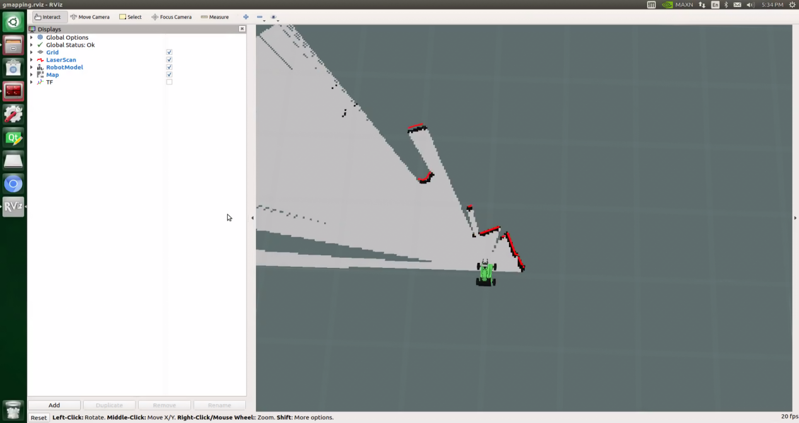

**2. Start Mapping**

Take keyboard control as example. If you want to control the robot using wireless handle, please refer to the tutorial saved in ‘**[1. JetRover User Manual/1.7 Wireless Handle Control]()**’.

1. Open a new command-line terminal, and execute the command ‘**roslaunch hiwonder_peripherals teleop_key_control.launch**’ to enable the keyboard control node.

   ```py
   roslaunch hiwonder_peripherals teleop_key_control.launch
   ```

When the following prompt occurs, it means the keyboard control service is enabled successfully.


2)  Control the robot to move around to map the whole environment by pressing the corresponding keys.

| **Key** |     **Robot’s Action**      |
| :-----: | :-------------------------: |
|    W    | Go forward (Press briefly)  |
|    S    | Go backward (Press briefly) |
|    A    |   Turn left (Long press)    |
|    D    |   Turn right (Long press)   |

When controlling the robot's movement with the keyboard for mapping, it is recommended to lower the robot's speed. This reduces odometry errors, leading to improved mapping results. As the robot moves, the map in RVIZ will continually grow until the entire environmental map is constructed.

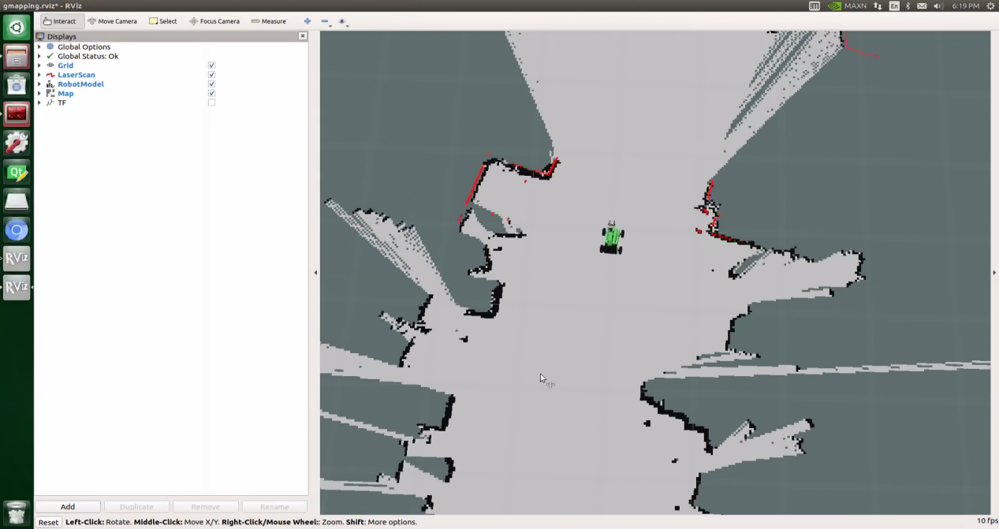

**3. Save the Map**

1. Open a new terminal and input the command “**roscd hiwonder_slam/maps**” and press Enter to enter the folder where the map is stored.

   ```py
   roscd hiwonder_slam/maps
   ```


2)  Execute the command ‘**rosrun map_server map_saver map:=/robot_1/map -f map_01**’ and press Enter to save the map.

“**robot_1**” refers to the robot name, and “**map_01**” in the command is the name of the map, and you can rename it. If the following prompts occur, the map is kept successfully.


3)  If you want to stop running the program, you can press “**Ctrl+C**”.

Once you finish experiencing this function, you need to restart the app service through command or restarting the robot. Execute this command “**sudo systemctl restart start_app_node.service**” to restart the app service. When you hear a beeping sound from the robot, it means that the service is restarted successfully.

```py
sudo systemctl restart start_app_node.service
```

**4. Optimize Mapping Result**

For enhanced mapping precision, consider optimizing the odometer settings. The robot's mapping process heavily relies on the Lidar, and the odometer's functionality is closely tied to Lidar operations.

The calibrated IMU (Inertial Measurement Unit) data has been successfully integrated into the robot's system, enabling both mapping and navigation. However, to achieve even greater accuracy, it's advisable to calibrate the IMU. Detailed instructions on how to perform IMU calibration are available in **["3.ROS1-Chassis Motion Control Lesson\3.2 Motion Control\ 3.2.1 IMU, Linear Velocity and Angular Velocity Calibration”]()**.

* **Parameter Explanation**

The parameter file can be found at this path: **hiwonder_slam\config\gmapping_params.yaml**

```py
maxUrange: 5.0            # Capture laser range
maxRange: 12.0            # Laser range
sigma: 0.05               # Standard deviation
kernelSize: 1             # kernel size
lstep: 0.05               # Linear step size 
astep: 0.05               # Angle step size
iterations: 1             # Number of iterations
lsigma: 0.075             # Laser standard deviation
ogain: 3.0                # Gain value
lskip: 0                  # Process all laser. If the computation pressure is huge, the parameter can be set to 1
minimumScore: 30          # minimum matching score
srr: 0.01                 # Error parameters of the motion model
srt: 0.02                 # Error parameters of the motion model
str: 0.01                 # Error parameters of the motion model
stt: 0.02                 # Error parameters of the motion model
linearUpdate: 0.01        # Conduct a single scan when the robot moves a distance in a straight line
angularUpdate: 0.1        # Perform a single scan when the robot rotates by this angle
temporalUpdate: -1.0      # Update time
resampleThreshold: 0.5    # resample threshold 
particles: 100            # number of particle
xmin: -5.0                # minimum X-axis value
ymin: -5.0                # minimum Y-axis value
xmax: 5.0                 # Maximum X-axis value 
ymax: 5.0                 # Maximum Y-axis value
delta: 0.025              # Map resolution
llsamplerange: 0.01       # Linear sampling range
llsamplestep: 0.01        # Linear sample step size
lasamplerange: 0.005      # Sample angle range
lasamplestep: 0.005       # Sample angle step size
```

To access the detailed tutorials, please refer to this link：<http://wiki.ros.org/gmapping>

* **Launch File Analysis**

**1. Path**

According to the game, the main files involved are as follows:

1. **slam.launch**: Selects the mapping method (Location: **/ros_ws/src/hiwonder_slam/launch/slam.launch**)

2. **slam_base.launch**: Basic topic configuration and startup for mapping functionalities (Location: **/ros_ws/src/hiwonder_slam/launch/include/slam_base.launch**)

3. **gmapping.launch**: Specific topic and parameter configuration for the mapping method (Location: **hiwonder_slam/launch/include/gmapping.launch**)

**2. Structure**

The file structure is as below:

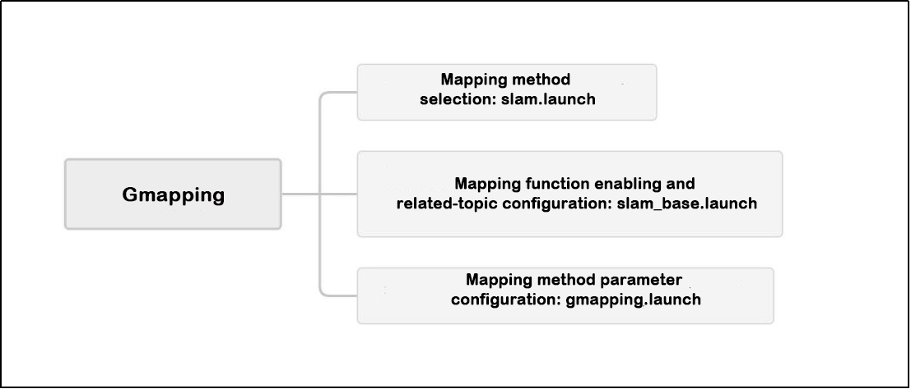

Reviewing the document structure, the focus is on selecting mapping methods, initiating mapping functionalities, configuring relevant topics, and adjusting mapping method parameters. For detailed syntax guidelines, please refer to the '**[14.ROS Basics Lesson]()**’.

**3. Select Mapping Method**

```py
    <arg name="slam_methods" default="gmapping" doc="slam type 
        [gmapping, cartographer, hector, karto, frontier, explore, rrt_exploration, rtabmap]"/>

    <arg name="gmapping"        default="gmapping"/>
    <arg name="cartographer"    default="cartographer"/>
    <arg name="hector"          default="hector"/>
    <arg name="karto"           default="karto"/>
    <arg name="frontier"        default="frontier"/>
    <arg name="explore"         default="explore"/>
    <arg name="rrt_exploration" default="rrt_exploration"/>
    <arg name="rtabmap"         default="rtabmap"/>
```

Before mapping, it is necessary to choose a mapping method, as shown in the diagram above:

The slam_methods parameter represents the mapping method, with the default value being 'gmapping.' The available mapping methods include:

**Manual mapping:** gmapping, cartographer, hector and karto

**Autonomous mapping:** frontier and explorerrt_exploration

**3D mapping:** rtabmap

If using the 'gmapping' mapping method, the command line in the terminal when executing this launch file would be：

“**roslaunch hiwonder_slam slam.launch slam_methods:=gmapping**”

Here, slam_methods:=\[mapping method name\] can be modified according to the desired mapping method, for example: slam_methods:=karto.

Based on the current game, the recommended mapping method to choose is slam_methods:= gmapping.

**4. Initiate Mapping Function and Related Topic Configuration**

```py
    <include file="$(find hiwonder_slam)/launch/include/slam_base.launch">
        <arg name="sim"             value="$(arg sim)"/>
        <arg name="slam_methods"    value="$(arg slam_methods)"/>
        <arg name="robot_name"      value="$(arg robot_name)"/>
    </include>
```

After choosing the mapping method (**slam_methods**), the subsequent step involves initiating the mapping functionality and configuring relevant topic names through the use of slam_base.launch. In the provided diagram, \<sim\> signifies whether simulation is utilized. In this context, it refers to the simulation parameter (sim), which defaults to false, indicating that the node simulation is inactive. \<slam_methods\> denotes the selected mapping method, set as "**gmapping**" for this mapping session. \<robot_name\> specifies the node name of the robot.

For an in-depth examination of the contents of the slam_base.launch file, you can consult the "**[slam_base.launch Program Analysis]()**”.

**5. Mapping Method Parameter Configuration**

```py
        <group if="$(eval slam_methods == 'gmapping')">
            <include file="$(find hiwonder_slam)/launch/include/$(arg slam_methods).launch">
                <arg name="scan"        value="$(arg scan_topic)"/>
                <arg name="base_frame"  value="$(arg base_frame)"/>
                <arg name="odom_frame"  value="$(arg odom_frame)"/>
                <arg name="map_frame"   value="$(arg map_frame)"/>
            </include>
```

In the concurrently executed **slam_base.launch** file, as depicted above, it includes launch files specific to the selected mapping method. If "**gmapping**" is the chosen mapping method, it is crucial to focus on the gmapping.launch file for configuring mapping method parameters (located at **hiwonder_slam/launch/include/gmapping.launch**).

The following provides an overview of the essential contents within the primary startup file, gmapping.launch:

**(1) Topic Parameter Configuration**

```py
    <!-- Arguments -->
    <arg name="scan"        default="scan"/>
    <arg name="base_frame"  default="base_footprint"/>
    <arg name="odom_frame"  default="odom"/>
    <arg name="map_frame"   default="map"/>
```

The image above displays configurations for some mapping method topic parameters:

**\<scan\>** represents the Lidar scan topic.

**\<base_frame\>** denotes the topic name for the robot's polar coordinate system, set as base_footprint.

**\<odom_frame\>** indicates the topic name for odometry, configured as odom.

**\<map_frame\>** specifies the topic name for the map, set as map.

After initiating the game, you can use rostopic list to view these configurations.

**(2) Basic Parameter Configuration File**

```py
    <node pkg="gmapping" type="slam_gmapping" name="hiwonder_slam_gmapping" output="screen">
        <param name="base_frame"    value="$(arg base_frame)"/>
        <param name="odom_frame"    value="$(arg odom_frame)"/>
        <param name="map_frame"     value="$(arg map_frame)"/>
        <remap from="/scan"         to="$(arg scan)"/>
        <rosparam command="load"    file="$(find hiwonder_slam)/config/gmapping_params.yaml" />
    </node>
```

In the image above, in addition to supplying certain fundamental topics to the gmapping package, there is a corresponding configuration file named `gmapping_params.yaml`. This file, housing essential parameters, can be found at the path **hiwonder_slam/config/gmapping_params.yaml:**

```py
map_update_interval: 0.2  # 地图更新速度s, 数值越低地图更新频率越快，但是需要更大的计算负载(map update speed s. The lower the value, the higher the frequency. But larger computational load is required.)
maxUrange: 5.0            # 截取激光范围(intercept laser range)
maxRange: 12.0            # 激光范围(laser range)
sigma: 0.05                
kernelSize: 1
lstep: 0.05
astep: 0.05
iterations: 1
lsigma: 0.075
ogain: 3.0
lskip: 0                  # 为0,表示所有的激光都处理，尽可能为零，如果计算压力过大，可以改成1(set as 0 which means that all laser will be processed. If the computational pressure is overwhelming, you can change it as 1)
minimumScore: 30          # 衡量扫描匹配效果的分数。当大场景中仪器的扫描范围小的时候（5m）可以避免位姿估计跳动太大。也叫最小匹配得分，(score that measure scan matching performance. Narrow scan range in large scene can protect pose estimation from changing rapidly. It is also called minimum matching score)
                          # 它决定了你对激光的一个置信度，越高说明你对激光匹配算法的要求越高，激光的匹配也越容易失败而转去使用里程计数据，(It determines the confidence of laser. The higher the value, the stricter the requirements on laser matching algorithm. And laser matching is also more likely to fail and switch to odometer data)
                          # 而设的太低又会使地图中出现大量噪声(Too low value also results in large amount of noise in the map)
```

**Parameter configuration file segment 1**

The following are some key parameters from the **gmapping_params.yaml** file. Important considerations for these parameters include:

| **Name**            | **Function**                                                 |
| ------------------- | ------------------------------------------------------------ |
| map_update_interval | Map update rate, measured in seconds (s). Generally, a smaller value increases computational demand |
| maxUrange           | Maximum detectable range, representing the extent reachable by laser beams |
| maxRange            | Maximum range of the sensor. If there are no obstacles within this range, it should be depicted as free space on the map |
| sigma               | Matching method for endpoint matching                        |
| lstep               | Translation optimization step size                           |
| astep               | Rotation optimization step size                              |
| lsigma              | Laser standard deviation for scan matching probability       |
| minimumScore        | Avoid using a limited-distance laser scanner in large open spaces to achieve optimal matching results |

```py
srr: 0.01
srt: 0.02
str: 0.01
stt: 0.02
```

While the robot is in motion and rotation, it's crucial to take into account the previously mentioned parameters in association with the mapping method:

| Name | **Function**                                                 |
| ---- | ------------------------------------------------------------ |
| srr  | Translation odometer error as a translation function (in radians) |
| srt  | Translation odometer error as a rotation function (in radians) |
| str  | Rotation odometer error as a translation function (in degrees) |
| stt  | Rotation odometer error as a rotation function (in degrees)  |

> [!NOTE]
>
> **Note: It is recommended to maintain the default settings for the above parameters. Modifying them independently is not advised, as it may impact the effectiveness of the game!!!**

### 6.1.3 Hector Mapping Algorithm

* **Hector Description**


Hector Slam employs the Gauss-Newton method to tackle the scan-matching problem, demanding precise sensor capabilities. One notable advantage of Hector Slam is its independence from odometry, enabling mapping feasibility in uneven terrains for both aerial drones and ground vehicles. It optimizes laser beam arrays using an existing map, estimates the representation of laser points in the map, and calculates the probability of occupied grids. The Gauss-Newton method resolves the scan-matching problem, determining the rigid transformation (x, y, theta) for the mapped laser point set onto the existing map. To prevent local minima and achieve global optimality, Hector Slam utilizes a multi-resolution map. In navigation, the state estimation incorporates an Inertial Measurement Unit (IMU) through Extended Kalman Filtering (EKF).

Despite its strengths, Hector Slam comes with notable limitations. It necessitates a high update frequency and low Lidar measurement noise. Therefore, maintaining a relatively low robot speed is crucial during mapping to achieve optimal results, leading to the absence of loop closure. Moreover, when odometer data is highly accurate, it struggles to effectively utilize odometry information. To address Hector Slam's high Lidar frequency requirements, Tuck Robotics, in collaboration with Slamtec, introduces the RPLidarA1-TK version. This version elevates the actual data frequency of the widely-used A1 Lidar from 5.5Hz to 15Hz, significantly enhancing the effectiveness of mapping algorithms like Hector.

The algorithmic workflow of Hector is depicted in the following diagram:


The diagram not only outlines the algorithmic flow for Hector SLAM but also provides a structural overview of the Hector source code. In the future, individuals interested in studying the source code of the Hector SLAM algorithm can use the diagram's structure as a guide for code analysis and learning.

1. Related source code and WIKI links for HectorSLAM:

2. **Hector Mapping ROS Wiki: <http://wiki.ros.org/hector_mapping>**

3. **Hector_slam software package: <https://github.com/tu-darmstadt-ros-pkg/hector_slam>**


* **Mapping Operation Steps**

> [!NOTE]
>
> **Note: the input command should be case sensitive, and the keywords can be complemented using “Tab” key.**

**1. Enable Service**

1. Start the robot, and access the robot system desktop using NoMachine.

2. Double click  to open the command line terminal.

3. Execute the command “**sudo systemctl stop start_app_node.service**” and press Enter to disable app auto-start service.

   ```py
   sudo systemctl stop start_app_node.service
   ```

4. Open a new terminal, and execute the command “**roslaunch hiwonder_slam slam.launch slam_methods:=hector**” to enable hector mapping node.

   ```py
   roslaunch hiwonder_slam slam.launch slam_methods:=hector
   ```

5. Open a new command-line terminal window and execute the command ‘**roslaunch hiwonder_slam rviz_slam.launch slam_methods:=hector**’ to launch the model viewing software.

   ```py
   roslaunch hiwonder_slam rviz_slam.launch slam_methods:=hector
   ```

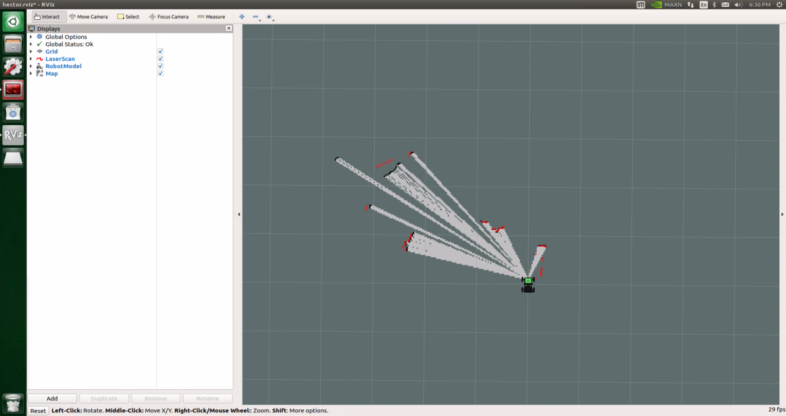

**2. Start Mapping**

Take keyboard control as example. If you want to control the robot using wireless handle, please refer to the tutorial saved in ‘**[6. ROS1-Mapping Navigation Lesson]()**’.

1. Open a new command-line terminal, and execute the command ‘**roslaunch hiwonder_peripherals teleop_key_control.launch**’ to enable the keyboard control node.

   ```py
   roslaunch hiwonder_peripherals teleop_key_control.launch
   ```

When the following prompt occurs, it means the keyboard control service is enabled successfully.

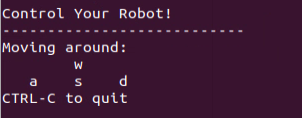

2)  Control the robot to move around to map the whole environment by pressing the corresponding keys.

| **Key** |     **Robot’s Action**      |
| :-----: | :-------------------------: |
|    W    | Go forward (Press briefly)  |
|    S    | Go backward (Press briefly) |
|    A    |   Turn left (Long press)    |
|    D    |   Turn right (Long press)   |

**3. Save the Map**

1. Open a new terminal and input the command “**roscd hiwonder_slam/maps**” and press Enter to enter the folder where the map is stored.

   ```py
   roscd hiwonder_slam/maps
   ```

2. Execute the command ‘**rosrun map_server map_saver map:=/robot_1/map -f map_01**’ and press Enter to save the map.

   ```py
   rosrun map_server map_saver map:=/robot_1/map -f map_01
   ```

The term "**robot_1**" in the command represents the robot name, while "**map_01**" designates the map name. Users can rename them according to their preferences. The appearance of the following prompt confirms the successful saving of the map.


3. If you want to stop running the program, you can press “**Ctrl+C**”.

4. To enable the app service, execute the command ‘**sudo systemctl start start_app_node.service**’.

   ```py
   sudo systemctl start start_app_node.service
   ```

Once you finish experiencing this function, you need to restart the app service through command or restarting the robot. Execute this command “**sudo systemctl restart start_app_node.service**” to restart the app service. When you hear a beeping sound from the robot, it means that the service is restarted successfully.

```py
sudo systemctl restart start_app_node.service
```

**4. Optimize Program Outcome**

For enhanced mapping precision, consider optimizing the odometer settings. The robot's mapping process heavily relies on the Lidar, and the odometer's functionality is closely tied to Lidar operations.

The calibrated IMU (Inertial Measurement Unit) data has been successfully integrated into the robot's system, enabling both mapping and navigation. However, to achieve even greater accuracy, it's advisable to calibrate the IMU. Detailed instructions on how to perform IMU calibration are available in "**[3 ROS1-Chassis Motion Control Lesson\ 3.2 Motion Control\ 3.2.1 IMU, Linear Velocity and Angular Velocity Calibration]()**”.

* **Parameter Description**

The parameters for the Hector mapping algorithm are defined in the launch file. For a detailed analysis of this aspect, please refer to Section Launch File Analysis.

* **Launch File Analysis**

**1. Path**

According to the game, the main files involved are as follows:

1. **slam.launch**: Selects the mapping method (Location: **/ros_ws/src/hiwonder_slam/launch/slam.lauch**)

2. **slam_base.launch**: Basic topic configuration and startup for mapping functionalities (Location: **/ros_ws/src/hiwonder_slam/launch/include/slam_base.launch**)

3. **hector.launch**: Specific topic and parameter configuration for the mapping method (Location:**hiwonder_slam/launch/include/hector.launch**)

**2. Structure**

The file structure is as below:

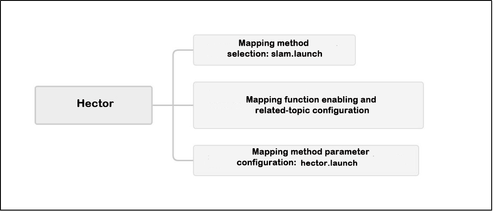

Reviewing the document structure, the focus is on selecting mapping methods, initiating mapping functionalities, configuring relevant topics, and adjusting mapping method parameters. For detailed syntax guidelines, please refer to the '**[14.ROS Basics Lesson]()**’.

**3. Select Mapping Method**

```py
    <arg name="slam_methods" default="gmapping" doc="slam type 
        [gmapping, cartographer, hector, karto, frontier, explore, rrt_exploration, rtabmap]"/>

    <arg name="gmapping"        default="gmapping"/>
    <arg name="cartographer"    default="cartographer"/>
    <arg name="hector"          default="hector"/>
    <arg name="karto"           default="karto"/>
    <arg name="frontier"        default="frontier"/>
    <arg name="explore"         default="explore"/>
    <arg name="rrt_exploration" default="rrt_exploration"/>
    <arg name="rtabmap"         default="rtabmap"/>
```

Before mapping, it is necessary to choose a mapping method, as shown in the diagram above:

The `slam_methods` parameter represents the mapping method, with the default value being '**gmapping**.' The available mapping methods include:

**Manual mapping:** gmapping, cartographer, hector and karto

**Autonomous mapping:** frontier and `explorerrt_exploration`

**3D mapping:** rtabmap

If using the '**gmapping**' mapping method, the command line in the terminal when executing this launch file would be：

“**roslaunch hiwonder_slam slam.launch slam_methods:=gmapping**”

Here, slam_methods:=\[mapping method name\] can be modified according to the desired mapping method, for example: slam_methods:=karto.

Based on the current game, the recommended mapping method to choose is slam_methods:= hector.

**4. Initiate Mapping Function and Related Topic Configuration**

```py
    <include file="$(find hiwonder_slam)/launch/include/slam_base.launch">
        <arg name="sim"             value="$(arg sim)"/>
        <arg name="slam_methods"    value="$(arg slam_methods)"/>
        <arg name="robot_name"      value="$(arg robot_name)"/>
    </include>
```

After choosing the mapping method (slam_methods), the subsequent step involves initiating the mapping functionality and configuring relevant topic names through the use of `slam_base.launch`. In the provided diagram, `<sim>` signifies whether simulation is utilized. In this context, it refers to the simulation parameter (sim), which defaults to false, indicating that the node simulation is inactive. `<slam_methods>` denotes the selected mapping method, set as "**hector**" for this mapping session. `<robot_name>` specifies the node name of the robot.

For a detailed examination of the contents of the slam_base.launch file, you can consult the "slam_base.launch Program Analysis”.

**5. Mapping Method Parameter Configuration**

```py
        <group if="$(eval slam_methods == 'hector')">
            <include file="$(find hiwonder_slam)/launch/include/$(arg slam_methods).launch">
                <arg name="scan_topic"  value="$(arg scan_topic)"/>
                <arg name="map_frame"   value="$(arg map_frame)"/>
                <arg name="base_frame"  value="$(arg base_frame)"/>
                <arg name="odom_frame"  value="$(arg base_frame)"/>
            </include>
          </group>
```

In the concurrently executed **slam_base.launch** file, as depicted above, it includes launch files specific to the selected mapping method. If "**hector**" is the chosen mapping method, it is crucial to focus on the hector.launch file for configuring mapping method parameters (located at **hiwonder_slam/launch/include/hector.launch**).

The following provides an overview of the essential contents within the primary startup file, hector.launch:

**(1) Topic Parameter Configuration**

```py
    <arg name="tf_map_scanmatch_transform_frame_name" default="scanmatch_frame"/>
    <arg name="base_frame"                  default="base_footprint"/>
    <arg name="odom_frame"                  default="odom"/>
    <arg name="map_frame"                   default="map_frame"/>
    <arg name="pub_map_odom_transform"      default="true"/>
    <arg name="scan_subscriber_queue_size"  default="5"/>
    <arg name="scan_topic"                  default="scan"/>
    <arg name="map_size"                    default="600"/>
```

`<tf_map__scanmath_transform_frame_name>` represents the name of the topic for transforming coordinates between the map coordinate system and Lidar coordinate system, set to scanmath_frame.

`<base_frame>` denotes the topic name for the robot's polar coordinate system, set to base_footprint.

`<odom_frame>` refers to the topic name for the odometer, set to odom.

`<map_frame>` indicates the topic name for the map, set to map.

After initiating the game, you can observe these configurations using the rostopic list command.

**(2) Basic Parameter Configuration**

In contrast to the gmapping mapping method, the hector mapping method directly configures parameters within the hector.launch file rather than utilizing a yaml file. The primary content of the hector mapping parameter configuration is outlined below:

```py
        <!-- Frame names -->
        <param name="map_frame"     value="$(arg map_frame)" />
        <param name="base_frame"    value="$(arg base_frame)" />
        <param name="odom_frame"    value="$(arg odom_frame)" />

        <!-- Tf use -->
        <param name="use_tf_scan_transformation"    value="true"/>
        <param name="use_tf_pose_start_estimate"    value="false"/>
        <param name="pub_map_scanmatch_transform"   value="true"/>
        <param name="pub_map_odom_transform"        value="$(arg pub_map_odom_transform)"/>

```

The image above illustrates the setting of topic names for the relevant coordinate system and the logical configuration of tf coordinate transformations. Notably, this mapping method incorporates tf coordinate transformation for Lidar scanning information by setting `<use_tf_scan_transformation>` to true, a crucial aspect in the mapping process. This facilitates the conversion of Lidar scanning data into assessments of the robot's movement distance and direction.

```py
        <!-- Map size / start point -->
        <param name="map_pub_period"        value="0.5"/>
        <param name="map_resolution"        value="0.025"/>
        <param name="map_size"              value="$(arg map_size)"/>
        <param name="map_start_x"           value="0.5"/>
        <param name="map_start_y"           value="0.5"/>
        <param name="map_multi_res_levels"  value="2"/>
```

The configuration for publishing map messages is depicted in the figure above:

| Name                 | Function                                                     |
| -------------------- | ------------------------------------------------------------ |
| map_pub_period       | Map publishing period                                        |
| map_resolution       | Map resolution, measured in meters (m), is the length of the grid cell's edge |
| map_size             | Map size                                                     |
| map_start_x          | The x-coordinate of the origin in the map message of the /map topic, with 0.5 representing the center |
| map_start_y          | The y-position of the origin in the /map topic's map message, where 0.5 indicates the center |
| map_multi_res_levels | Multiresolution grid level of the map                        |

```py
        <!-- Map update parameters -->
        <param name="update_factor_free"            value="0.4"/>
        <param name="update_factor_occupied"        value="0.9"/>
        <param name="map_update_distance_thresh"    value="0.1"/>
        <param name="map_update_angle_thresh"       value="0.06"/>
        <param name="laser_z_min_value"             value="-0.1"/>
        <param name="laser_z_max_value"             value="0.2"/>
        <param name="laser_min_dist"                value="0.15"/>
        <param name="laser_max_dist"                value="12"/>
```

After establishing the foundational logical points and dimensions of the map, it is crucial to set the update parameters for the scanning map. As depicted in the above diagram, there are four critical parameters that merit attention:

**\<laser_z_min_value\>**: The minimum height for Lidar scanning, measured in meters. Lidar scan information below this height will be disregarded.

**\<laser_z_max_value\>**: The maximum height for Lidar scanning, measured in meters. Lidar scan information above this height will be disregarded.

**\<laser_min_dist\>**: The minimum distance for Lidar scanning, measured in meters. Lidar scan information closer than this distance will be disregarded.

**\<laser_max_dist\>**: The maximum distance for Lidar scanning, measured in meters. Lidar scan information beyond this distance will be disregarded.

Throughout the mapping process using the Hector mapping method, the mapping effectiveness can be fine-tuned through these four parameters. By adjusting these parameters appropriately, you can regulate the range of Lidar scanning, leading to a more precise mapping outcome. If the default settings yield satisfactory results based on initial measurements, it is advisable to maintain them unchanged during use.

> [!NOTE]
>
> **Note: It is recommended to maintain the default settings for the above parameters. Modifying them independently is not advised, as it may impact the effectiveness of the game!!!**
>
> **To get detailed info, please visit this website: http://wiki.ros.org/hector mapping**

### 6.1.4 Karto Mapping Algorithm

* **Karto Description**

Karto SLAM is built on the foundation of graph optimization, employing a highly optimized and non-iterative Cholesky decomposition for sparse system decoupling as a solution. The graph optimization method uses the graph mean to represent the map, where each node signifies a position point in the robot's trajectory along with a dataset of sensor measurements. Calculations and updates occur upon the addition of each new node.

In the ROS version of Karto SLAM, sparse pose adjustment (SPA) is employed, which is associated with scan matching and loop closure detection. The greater the number of landmarks, the higher the memory requirements. Nonetheless, the graph optimization approach provides significant advantages in large environments compared to other methods, as it only involves the graph of points (robot pose), with the map being derived post obtaining the pose.

The algorithmic framework of Karto SLAM is illustrated in the figure below:


From the above diagram, it can be seen that the process is relatively straightforward. The traditional soft real-time operation mechanism of slam involves processing each frame of data upon entry and then returning.

Relevant source code and WIKI links for KartoSLAM:

1. **KartoSLAM ROS Wiki:** http://wiki.ros.org/slam_karto

2. **slam_karto software package:** https://github.com/ros-perception/slam_karto

3. **open_karto open-source algorithm:** https://github.com/ros-perception/open_karto

* **Mapping Operation Steps**

> [!NOTE]
>
> **Note: the input command should be case sensitive, and the keywords can be complemented using “Tab” key.**

**1. Enable Service**

1. Start the robot, and access the robot system desktop using NoMachine.

2. Double click  to open the command line terminal.

3. Execute the command “**sudo systemctl stop start_app_node.service**” and press Enter to disable app auto-start service.

   ```py
   sudo systemctl stop start_app_node.service
   ```

4. Open a new terminal, and execute the command “**roslaunch hiwonder_slam slam.launch slam_methods:=karto**” to enable hector mapping node.

   ```py
   roslaunch hiwonder_slam slam.launch slam_methods:=karto
   ```

5. Open a new command-line terminal window and execute the command ‘**roslaunch hiwonder_slam rviz_slam.launch slam_methods:=karto**’ to launch the model viewing software.

   ```py
   roslaunch hiwonder_slam rviz_slam.launch slam_methods:=karto
   ```

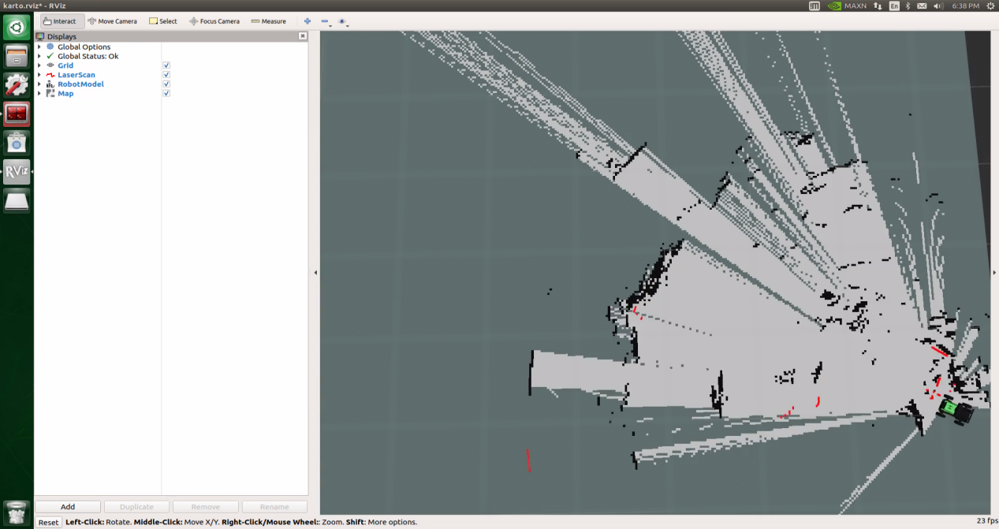

**2. Start Mapping**

1. If you want to control the robot using wireless handle, please refer to the tutorial saved in ‘**[6.ROS1- Mapping Navigation lesson]()**’.

2. Open a new command-line terminal, and execute the command ‘**roslaunch hiwonder_peripherals teleop_key_control.launch**’ to enable the keyboard control node.

   ```py
   roslaunch hiwonder_peripherals teleop_key_control.launch
   ```

When the following prompt occurs, it means the keyboard control service is enabled successfully.


3)  Control the robot to move around to map the whole environment by pressing the corresponding keys.

| **Key** |     **Robot’s Action**      |
| :-----: | :-------------------------: |
|    W    | Go forward (Press briefly)  |
|    S    | Go backward (Press briefly) |
|    A    |   Turn left (Long press)    |
|    D    |   Turn right (Long press)   |

**3. Save the Map**

1. Open a new terminal and input the command “**roscd hiwonder_slam/maps**” and press Enter to enter the folder where the map is stored.

   ```py
   roscd hiwonder_slam/maps
   ```

2. Execute the command ‘**rosrun map_server map_saver map:=/robot_1/map -f map_01**’ and press Enter to save the map.

   ```py
   rosrun map_server map_saver map:=/robot_1/map -f map_01
   ```

The term "**robot_1**" in the command represents the robot name, while "**map_01**" designates the map name. Users can rename them according to their preferences. The appearance of the following prompt confirms the successful saving of the map.


3)  If you want to stop running the program, you can press ‘**Ctrl+C**’.

Once you finish experiencing this function, you need to restart the app service through command or restarting the robot. Execute this command “**sudo systemctl restart start_app_node.service**” to restart the app service. When you hear a beeping sound from the robot, it means that the service is restarted successfully.

```py
sudo systemctl restart start_app_node.service
```

**4. Optimize Program Outcome**

For enhanced mapping precision, consider optimizing the odometer settings. The robot's mapping process heavily relies on the Lidar, and the odometer's functionality is closely tied to Lidar operations.

The calibrated IMU (Inertial Measurement Unit) data has been successfully integrated into the robot's system, enabling both mapping and navigation. However, to achieve even greater accuracy, it's advisable to calibrate the IMU. Detailed instructions on how to perform IMU calibration are available in "**[3 ROS1-Chassis Motion Control Lesson\ 3.2 Motion Control\ 3.2.1 IMU, Linear Velocity and Angular Velocity Calibration]()**”.

* **Launch File Analysis**

**1. Path**

According to the game, the main files involved are as follows:

1. **slam.launch**: Selects the mapping method (Location: **/ros_ws/src/hiwonder_slam/launch/slam.lauch**)

2. **slam_base.launch**: Basic topic configuration and startup for mapping functionalities (Location: **/ros_ws/src/hiwonder_slam/launch/include/slam_base.launch**)

3. **karto.launch**: Specific topic and parameter configuration for the mapping method（Location: **hiwonder_slam/launch/include/karto.launch**）

**2. Structure**

The file structure is as below:

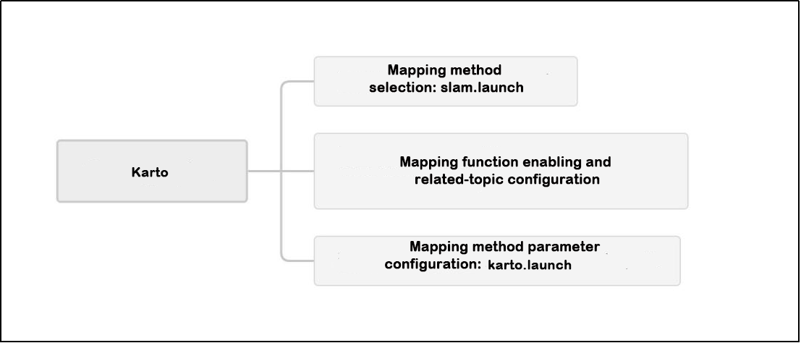

Reviewing the document structure, the focus is on selecting mapping methods, initiating mapping functionalities, configuring relevant topics, and adjusting mapping method parameters. For detailed syntax guidelines, please refer to the '**[14.ROS Basics Lesson]()**’.

**3. Select Mapping Method**

```py
    <arg name="slam_methods" default="gmapping" doc="slam type 
        [gmapping, cartographer, hector, karto, frontier, explore, rrt_exploration, rtabmap]"/>

    <arg name="gmapping"        default="gmapping"/>
    <arg name="cartographer"    default="cartographer"/>
    <arg name="hector"          default="hector"/>
    <arg name="karto"           default="karto"/>
    <arg name="frontier"        default="frontier"/>
    <arg name="explore"         default="explore"/>
    <arg name="rrt_exploration" default="rrt_exploration"/>
    <arg name="rtabmap"         default="rtabmap"/>
```

The `slam_methods` parameter represents the mapping method, with the default value being 'gmapping.' The available mapping methods include:

**Manual mapping:** gmapping, cartographer, hector and karto

**Autonomous mapping:** frontier and explorerrt_exploration

**3D mapping:** rtabmap

If using the '**gmapping**' mapping method, the command line in the terminal when executing this launch file would be：

“**roslaunch hiwonder_slam slam.launch slam_methods:=gmapping**”

Here, slam_methods:=\[mapping method name\] can be modified according to the desired mapping method, for example: slam_methods:=karto.

Based on the current game, the recommended mapping method to choose is slam_methods:= karto.

**4. Initiate Mapping Function and Related Topic Configuration**

```py
    <include file="$(find hiwonder_slam)/launch/include/slam_base.launch">
        <arg name="sim"             value="$(arg sim)"/>
        <arg name="slam_methods"    value="$(arg slam_methods)"/>
        <arg name="robot_name"      value="$(arg robot_name)"/>
    </include>
```

After choosing the mapping method (slam_methods), the subsequent step involves initiating the mapping functionality and configuring relevant topic names through the use of `slam_base.launch`. In the provided diagram, `<sim>` signifies whether simulation is utilized. In this context, it refers to the simulation parameter (sim), which defaults to false, indicating that the node simulation is inactive. `<slam_methods>` denotes the selected mapping method, set as "**karto**" for this mapping session. `<robot_name>` specifies the node name of the robot.

For a detailed examination of the contents of the **slam_base.launch** file, you can consult the "**[slam_base.launch Program Analysis]()**”.

**5. Mapping Method Parameter Configuration**

```py
        <group if="$(eval slam_methods == 'karto')">
            <include file="$(find hiwonder_slam)/launch/include/$(arg slam_methods).launch">
                <arg name="map_frame"   value="$(arg map_frame)"/>
                <arg name="base_frame"  value="$(arg base_frame)"/>
                <arg name="odom_frame"  value="$(arg odom_frame)"/>
            </include>
        </group>
```

In the concurrently executed **slam_base.launch** file, as depicted above, it includes launch files specific to the selected mapping method. If "**karto**" is the chosen mapping method, it is crucial to focus on the **karto.launch** file for configuring mapping method parameters (located at **hiwonder_slam/launch/include/karto.launch**).

The following provides an overview of the essential contents within the primary startup file, karto.launch:

```py
    <arg name="map_frame"  default="map"/>
    <arg name="odom_frame" default="odom"/>
    <arg name="base_frame" default="base_footprint"/>
```

`<map_frame>`: Map topic name, set to 'map'.

`<odom_frame>`: Odometry topic name, set to 'odom'.

`<base_frame>`: Robot's polar coordinate system topic name, set to 'base_footprint'.

```py
    <node pkg="slam_karto" type="slam_karto" name="slam_karto" output="screen">
        <param name="map_frame"             value="$(arg map_frame)"/>
        <param name="odom_frame"            value="$(arg odom_frame)"/>
        <param name="base_frame"            value="$(arg base_frame)"/>
        <param name="map_update_interval"   value="5"/>
        <param name="resolution"            value="0.025"/>
    </node>
```

The diagram above shows how to start and configure key parameters for mapping with the Karto package:

`<map_update_interval>`: Controls how often the map updates, defaulting to 5 milliseconds.

`<resolution>`: Sets the map resolution.

While you can customize these during mapping, sticking to the default settings is recommended for the best results. The robot is pre-calibrated for accurate mapping with these defaults.

> [!NOTE]
>
> **Note: It is recommended to maintain the default settings for the above parameters. Modifying them independently is not advised, as it may impact the effectiveness of the game!!!**
>
> **To get detailed info, please visit this website: http://wiki.ros.org/slam_karto**

### 6.1.5 Cartographer Mapping Algorithm

* **Cartographer Description**


Cartographer's core principle is to rectify errors that accumulate during map creation using closed-loop detection. It does this by dividing the map into submaps, each consisting of laser scans. As new scans are added to a submap, their optimal positions are estimated based on existing data and sensor input. While errors during short-term submap creation are deemed acceptable, over time, with more submaps, errors between them grow. To address this, Cartographer optimizes submap poses through closed-loop detection, essentially transforming it into a pose optimization challenge. Once a submap is finished (no new scans added), it is incorporated into loop closure detection, considering all created submaps. When a new scan is added to the map, Cartographer looks for a match in existing submaps. If a close match is found, it employs a scan match strategy to establish closed loops. The strategy involves examining a window near the estimated pose of the newly added laser scan, searching for a potential match within that window. Successful matches introduce closed-loop constraints to the pose optimization problem. Cartographer's primary focus is on creating local submaps that fuse multi-sensor data and implementing a scan match strategy for closed-loop detection.


The Cartographer system can be broadly divided into two components:

Local SLAM (Frontend):

Task: Creation and maintenance of Submaps.

Challenge: Accumulation of mapping errors over time.

Configuration Parameters: Defined in /src/cartographer/configuration_files/trajectory_builder_2d.lua and /src/cartographer/configuration_files/trajectory_builder_3d.lua.

Global SLAM (Backend):

Task: Loop Closure detection and resolution.

Approach: Formulated as an optimization problem with pixel-accurate matching, solved using the Branch-and-Bound Approach (BBA).

Detailed Method: Refer to the paper "Real-Time Loop Closure in 2D LIDAR SLAM."

Additional Task in 3D: Determines the direction of gravity based on IMU data.

In summary, the Local SLAM generates improved subgraphs, while the Global SLAM performs global optimization and aligns various subgraphs in the most fitting pose.

The process begins with sensor input, where Laser data undergoes Scan Matching after two filters to construct a submap. New Laser Scans are inserted into the appropriate position of the maintained submap. The determination of the optimal pose for insertion is achieved through Ceres Scan Matching. The estimated optimal pose is integrated with odometry and IMU data to project the pose at the next moment.

Cartographer software pack:

<https://github.com/cartographer-project/cartographer>

* **Mapping Operation Steps**

> [!NOTE]
>
> **Note: the input command should be case sensitive, and keywords can be complemented using Tab key.**

**1. Enable Service**

1. Start the robot, and access the robot system desktop using NoMachine.

2. Double click  to open the command line terminal.

3. Execute the command “**sudo systemctl stop start_app_node.service**” and press Enter to disable app auto-start service.

   ```py
   sudo systemctl stop start_app_node.service
   ```

4. Open a new terminal, and execute the command “**roslaunch hiwonder_slam slam.launch slam_methods:=cartographer**” to enable cartographer mapping node.

   ```py
   roslaunch hiwonder_slam slam.launch slam_methods:=cartographer
   ```

5. Open a new command-line terminal window and execute the command ‘**roslaunch hiwonder_slam rviz_slam.launch slam_methods:=cartographer**’ to launch the model viewing software.

   ```py
   roslaunch hiwonder_slam rviz_slam.launch slam_methods:=cartographer
   ```

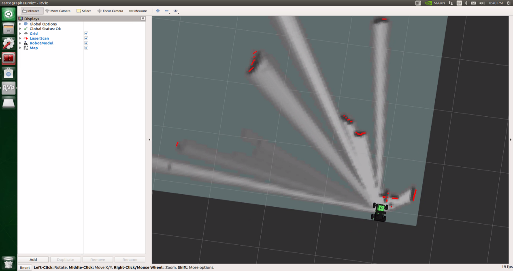

**2. Start Mapping**

If you want to control the robot using wireless handle, please refer to the tutorial saved in ‘**[6 ROS1-Mapping & Navigation]()**’.

1. Open a new command-line terminal, and execute the command ‘**roslaunch hiwonder_peripherals teleop_key_control.launch**’ to enable the keyboard control node.

   ```py
   roslaunch hiwonder_peripherals teleop_key_control.launch
   ```

When the following prompt occurs, it means the keyboard control service is enabled successfully.


2)  Control the robot to move around to map the whole environment by pressing the corresponding keys.

| **Key** |     **Robot’s Action**      |
| :-----: | :-------------------------: |
|    W    | Go forward (Press briefly)  |
|    S    | Go backward (Press briefly) |
|    A    |   Turn left (Long press)    |
|    D    |   Turn right (Long press)   |

**3. Save the Map**

1. Open a new terminal and input the command “**roscd hiwonder_slam/maps**” and press Enter to enter the folder where the map is stored.

   ```py
   roscd hiwonder_slam/maps
   ```

2. Execute the command ‘**rosrun map_server map_saver map:=/robot_1/map -f map_01**’ and press Enter to save the map.

   ```py
   rosrun map_server map_saver map:=/robot_1/map -f map_01
   ```

The term "**robot_1**" in the command represents the robot name, while "**map_01**" designates the map name. Users can rename them according to their preferences. The appearance of the following prompt confirms the successful saving of the map.


3)  If you want to stop running the program, you can press “Ctrl+C”.

4)  To enable the app service, execute the command ‘**sudo systemctl start start_app_node.service**’.

Once you finish experiencing this function, you need to restart the app service through command or restarting the robot. Execute this command “**sudo systemctl restart start_app_node.service**” to restart the app service. When you hear a beeping sound from the robot, it means that the service is restarted successfully.

```py
sudo systemctl restart start_app_node.service
```

**4. Optimize Program Outcome**

For enhanced mapping precision, consider optimizing the odometer settings. The robot's mapping process heavily relies on the Lidar, and the odometer's functionality is closely tied to Lidar operations.

The calibrated IMU (Inertial Measurement Unit) data has been successfully integrated into the robot's system, enabling both mapping and navigation. However, to achieve even greater accuracy, it's advisable to calibrate the IMU. Detailed instructions on how to perform IMU calibration are available in "**[3 ROS1-Chassis Motion Control Lesson\ 3.2 Motion Control\ 3.2.1 IMU, Linear Velocity and Angular Velocity Calibration]()**”.

* **Parameter Description**

The parameter file can be accessed in this path: **/ros_ws/src/hiwonder_slam/config/cartographer_params.lua**

```py
master_name = os.getenv("MASTER")       -- Obtain the value of the system environment variable ‘MASTER’
robot_name = os.getenv("HOST")             -- Obtain the value of the   system environment variable ‘HOST’
prefix = os.getenv("prefix")             -- Obtain the value of the system environment variable ‘prefix’
MAP_FRAME = "map"                              -- name of the default map coordinate system
ODOM_FRAME = "odom"                            -- name of the default odometer coordinate system
BASE_FRAME = "base_footprint"                  -- name of the default base coordinate system
if(prefix ~= "/") then
    MAP_FRAME = master_name .. "/" .. MAP_FRAME
    ODOM_FRAME = robot_name .. "/" .. ODOM_FRAME
    BASE_FRAME = robot_name .. "/" .. BASE_FRAME
end

options = {
map_builder = MAP_BUILDER,    -- configuration info of map_builder.lua
trajectory_builder = TRAJECTORY_BUILDER,   -- comfiguration info of trajectory_builder.lua
map_frame = MAP_FRAME,              -- name of the map coordinate system
 tracking_frame = BASE_FRAME,      -- convert all sensor data to this coordinate system
  published_frame = ODOM_FRAME,     -- publishing coordinate system of tf: map -> odom
  odom_frame = ODOM_FRAME,               -- name of odometer’s coordinate system 
  provide_odom_frame = false,                -- whether offer odom’s tf 
  publish_frame_projected_to_2d = false,     -- Whether to project the coordinate system onto a plane

  use_odometry = true,                       -- Whether to use odometer
  use_nav_sat = false,                       -- Whether to use gps
  use_landmarks = false,                     -- Whether to use landmark
  num_laser_scans = 1,                      -- Whether to use Single-line laser data
  num_multi_echo_laser_scans = 0,  --whether to use multi_echo_laser_scans data
  num_subdivisions_per_laser_scan = 1,       -- 1 frame of data is divided into several times for processing
  num_point_clouds = 0,                      -- Whether to use point cloud data

  lookup_transform_timeout_sec = 0.2,        -- Timeout when looking for tf
  submap_publish_period_sec = 0.3,       -- Time interval for publishing data
  pose_publish_period_sec = 5e-3,            -- Posture interval
  trajectory_publish_period_sec = 30e-3,     -- Track release time interval

  rangefinder_sampling_ratio = 1.,           -- Sampling frequency of sensor data
  odometry_sampling_ratio = 1.,              -- Sampling frequency of odometer data
  fixed_frame_pose_sampling_ratio = 1.,      -- Fixed frame pose sampling frequency
  imu_sampling_ratio = 1.,                   -- Sampling frequency of IMU data
  landmarks_sampling_ratio = 1.,             -- Sampling frequency of landmarks data
}
MAP_BUILDER.use_trajectory_builder_2d = true    -- Use the 2D trajectory builder and the relevant parameters below
```

Cartographer offers a wide range of configurable parameters, and we won't list them all here. For an in-depth understanding of Cartographer's algorithm, please consult the official documentation on Cartographer's GitHub repository: **https://github.com/cartographer-project/cartographer**

* **Launch File Analysis**

**1. Path**

According to the game, the main files involved are as follows:

1. **slam.launch**: Selects the mapping method (Location: **/ros_ws/src/hiwonder_slam/launch/slam.lauch**)

2. **slam_base.launch**: Basic topic configuration and startup for mapping functionalities(Location: **/ros_ws/src/hiwonder_slam/launch/include/slam_base.launch**)

3. **cartographer.launch**: Specific topic and parameter configuration for the mapping method（Location: **hiwonder_slam/launch/include/cartographer.launch**）

**2. Structure**

The file structure is as below:

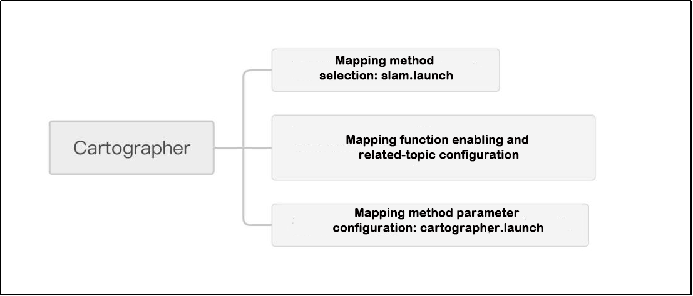

Reviewing the document structure, the focus is on selecting mapping methods, initiating mapping functionalities, configuring relevant topics, and adjusting mapping method parameters. For detailed syntax guidelines, please refer to the '**[14.ROS Basics Lesson]()**’.

**3. Select Mapping Method**

```py
    <arg name="slam_methods" default="gmapping" doc="slam type 
        [gmapping, cartographer, hector, karto, frontier, explore, rrt_exploration, rtabmap]"/>

    <arg name="gmapping"        default="gmapping"/>
    <arg name="cartographer"    default="cartographer"/>
    <arg name="hector"          default="hector"/>
    <arg name="karto"           default="karto"/>
    <arg name="frontier"        default="frontier"/>
    <arg name="explore"         default="explore"/>
    <arg name="rrt_exploration" default="rrt_exploration"/>
    <arg name="rtabmap"         default="rtabmap"/>
```

The `slam_methods` parameter represents the mapping method, with the default value being 'gmapping.' The available mapping methods include:

**Manual mapping:** gmapping, cartographer, hector and karto

**Autonomous mapping:** frontier and explorerrt_exploration

**3D mapping:** rtabmap

If using the '**gmapping**' mapping method, the command line in the terminal when executing this launch file would be：

“**roslaunch hiwonder_slam slam.launch slam_methods:=gmapping**”

Here, slam_methods:=\[mapping method name\] can be modified according to the desired mapping method, for example: slam_methods:=karto.

Based on the current game, the recommended mapping method to choose is slam_methods:= cartographer.

**4. Initiate Mapping Function and Related Topic Configuration**

```py
    <include file="$(find hiwonder_slam)/launch/include/slam_base.launch">
        <arg name="sim"             value="$(arg sim)"/>
        <arg name="slam_methods"    value="$(arg slam_methods)"/>
        <arg name="robot_name"      value="$(arg robot_name)"/>
    </include>
```

After choosing the mapping method (slam_methods), the subsequent step involves initiating the mapping functionality and configuring relevant topic names through the use of `slam_base.launch`. In the provided diagram, `<sim>` signifies whether simulation is utilized. In this context, it refers to the simulation parameter (sim), which defaults to false, indicating that the node simulation is inactive. `<slam_methods>` denotes the selected mapping method, set as "**cartographer**" for this mapping session. `<robot_name>` specifies the node name of the robot.

For a detailed examination of the contents of the **slam_base.launch** file, you can consult the "**[slam_base.launch Program Analysis]()**”.

**5. Mapping Method Parameter Configuration**

```py
        <group if="$(eval slam_methods == 'cartographer')">
            <include file="$(find hiwonder_slam)/launch/include/$(arg slam_methods).launch">
                <arg name="sim"        value="$(arg sim)"/>
                <arg name="prefix"     value="$(arg robot_name)"/>
            </include>
        </group>
```

In the concurrently launched **slam_base.launch** file, as shown in the figure above, it contains the launch file for the respective mapping method. According to the cartographer mapping method used in this mapping process, attention should be given to the mapping method's parameter configuration file, specifically the **hector.launch** file (location: **hiwonder_slam/launch/include/cartographer.launch**).

The following provides the main content of the cartographer.launch launch file:

```py
    <arg name="sim"             default="false"/>
    <param name="/use_sim_time" value="$(arg sim)"/>
    <arg name="prefix"          default=""/>
    <env name="prefix"          value="$(arg prefix)"/>
```

Disable simulation by setting \<sim\> to false.

Establish \<prefix\> as the default environment prefix; keep it empty.

```py
args="-configuration_directory $(find hiwonder_slam)/config -configuration_basename cartographer_params.lua"
```

For the cartographer mapping method, it is necessary to configure the parameters associated with the mapping process. The configuration is performed using the **cartographer_params.lua** file (located at **hiwonder_slam/config/cartographer_params.lua**). The following provides a detailed analysis of the main content within the parameter configuration file:

```py
map_frame = MAP_FRAME,        -- 地图坐标系的名字(map coordinate system name)
  tracking_frame = BASE_FRAME,  -- 将所有传感器数据转换到这个坐标系下(transfer all the sensor data to this coordinate system)
  published_frame = ODOM_FRAME, -- tf: map -> odom
  odom_frame = ODOM_FRAME,      -- 里程计的坐标系名字(odometer coordinate system name)
  provide_odom_frame = false,   -- 是否提供odom的tf, 如果为true,则tf树为map->odom->footprint(whether tf of odom is provided. If true, tf tree is map->odom->footprint)

```

The parameters depicted in the figure above denote fundamental coordinate system configurations. These configurations facilitate the exchange of node information between diverse sensors and coordinates throughout the mapping process. For detailed explanations of these parameters, please consult the notes provided at the end of the file.

```py
use_odometry = true,                      -- 是否使用里程计,如果使用要求一定要有odom的tf(whether to use odometer. tf of odom is required when in use)
  use_nav_sat = false,                      -- 是否使用gps(whether to use gps)
  use_landmarks = false,                    -- 是否使用landmark(whether to use landmark)
  num_laser_scans = 1,                      -- 是否使用单线激光数据(whether to use single-line laser data)
  num_multi_echo_laser_scans = 0,           -- 是否使用multi_echo_laser_scans数据(whether to use multi_echo_laser_scans data)
  num_subdivisions_per_laser_scan = 1,      -- 1帧数据被分成几次处理,一般为1(one frame of data is divided into several parts for processing. In general, it is set as 1)
  num_point_clouds = 0,                     -- 是否使用点云数据(whether to use point cloud)

```

The parameters in the above figure encompass logical configurations for odom, gps, landmarks, lidar data segmentation (subdivisions_per_laser_scan), and point cloud data (point_clouds). Detailed explanations for these parameters are available in the comments at the end of the file.

```py
  rangefinder_sampling_ratio = 1.,          -- 传感器数据的采样频率(sampling frequency of sensor data)
  odometry_sampling_ratio = 1.,
  fixed_frame_pose_sampling_ratio = 1.,
  imu_sampling_ratio = 1.,
  landmarks_sampling_ratio = 1.,
```

`<rangefinder_sampling_ratio>`: Represents the sampling frequency of the ranging sensor. If the function package utilizes ranging sensors during the cartographer mapping algorithm, it can be set and obtained through measurement parameters. The default setting is 1; otherwise, if invalid, maintain the default value of 1.

`<odometry_sampling_ratio>`: Sampling frequency for odometry.

`<fixed_frame_pose_sampling_ratio>`: Sampling frequency for fixed position frame.

`<imu_sampling_ratio>`: Sampling frequency for imu.

`<landmarks_sampling_ratio>`: Sampling frequency for landmarks. Although the previous setting for landmarks was deemed impractical, the default open setting does not impact the actual mapping effect.

```py
TRAJECTORY_BUILDER_2D.submaps.num_range_data = 35
TRAJECTORY_BUILDER_2D.min_range = 0.15
TRAJECTORY_BUILDER_2D.max_range = 10.
TRAJECTORY_BUILDER_2D.use_imu_data = false
TRAJECTORY_BUILDER_2D.missing_data_ray_length = 1.
TRAJECTORY_BUILDER_2D.use_online_correlative_scan_matching = true
TRAJECTORY_BUILDER_2D.real_time_correlative_scan_matcher.linear_search_window = 0.1
TRAJECTORY_BUILDER_2D.real_time_correlative_scan_matcher.translation_delta_cost_weight = 10.
TRAJECTORY_BUILDER_2D.real_time_correlative_scan_matcher.rotation_delta_cost_weight = 1e-1
```

`TRAJECTORY_BUILDER_2D` is a class within the cartographer mapping algorithm that encompasses logical parameter settings and details on acquiring these parameters:

| Name                                 | Function                                                     |
| ------------------------------------ | ------------------------------------------------------------ |
| num_range_data                       | The submap layer's data range                                |
| use_imu_data                         | Utilization of IMU data                                      |
| min_range                            | Minimum distance for the laser                               |
| max_range                            | Maximum distance for the laser                               |
| min_z                                | Most laser scans are for acquiring low heights               |
| max_z                                | Maximum height obtained by lidar scan                        |
| missing_data_ray_length              | If the value falls outside the range between min_range and max_range, it defaults to the specified value after exceeding the set data range |
| use_online_correlative_scan_matching | Application of CSM laser matching                            |

It also includes another class, the `real_time_correlative_scan_matcher`:

| Name                          | Function                                                     |
| ----------------------------- | ------------------------------------------------------------ |
| linear_search_window          | Angle search range                                           |
| translation_delta_cost_weight | The translation cost weight implies that the matching score must be higher as the distance from the initial value increases in order to be deemed reliable. This can be interpreted as setting a limit on the parameters. |
| rotation_delta_cost_weight    | Rotation cost weight                                         |

> [!NOTE]
>
> **Note: It is recommended to maintain the default settings for the above parameters. Modifying them independently is not advised, as it may impact the effectiveness of the game!!!**

### 6.1.6 Frontier Autonomous Mapping

* **Frontier Description**

Frontier autonomous mapping involves utilizing the Gmapping mapping algorithm as a foundation and incorporating mapping navigation, path planning, automatic obstacle avoidance, and other functionalities. This enables the robot to autonomously reach designated target points without human control (via handle or keyboard) while simultaneously conducting mapping.

The implementation of Frontier's autonomous mapping comprises two main components: the mapping algorithm and navigation.

Various mapping algorithms can be employed, such as Gmapping, Hector, Karto, and Cartographer. This lesson specifically utilizes the Gmapping algorithm.

In terms of navigation, once one or more target points are set for the robot, it automatically performs path planning and initiates movement. In the event of encountering obstacles during movement, the robot updates its path through a local optimizer to navigate around the obstacles.


**frontier_exploration software pack:**

<https://github.com/paulbovbel/frontier_exploration>

* **Mapping Operation Steps**

> [!NOTE]
>
> **Notice:**
>
> * **Prior to initiating, ensure the construction of a sealed environment and preposition the robot inside. It is crucial to maintain airtight conditions.**
>
> * **When entering commands, strict case sensitivity is required, and the "Tab" key can be used to auto-complete keywords.**

**1. Start Mapping**

1. Start the robot, and access the robot system desktop using NoMachine.

2. Double click  to open the command line terminal.

3. Execute the command “**sudo systemctl stop start_app_node.service**” and press Enter to disable app auto-start service.

   ```py
   sudo systemctl stop start_app_node.service
   ```

4. Open a new terminal, and execute the command “**roslaunch hiwonder_slam slam.launch slam_methods:=frontier**” to enable mapping service.

   ```py
   roslaunch hiwonder_slam slam.launch slam_methods:=frontier
   ```

5. Open a new command-line terminal window and execute the command ‘**roslaunch hiwonder_slam rviz_slam.launch slam_methods:=frontier**’ to launch the model viewing software.

   ```py
   roslaunch hiwonder_slam rviz_slam.launch slam_methods:=frontier
   ```

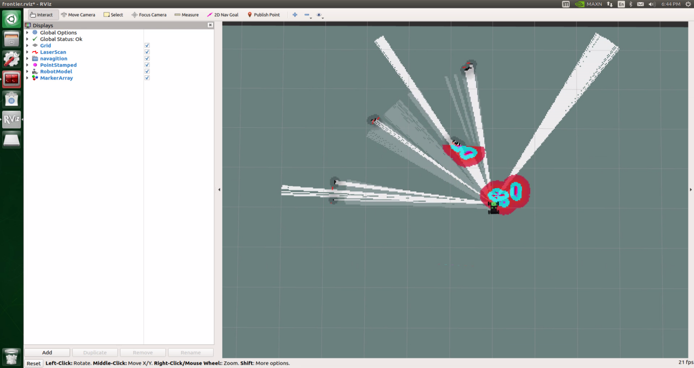

**2. Save Map**

1. Open a new command-line terminal, and execute the command ‘**roscd hiwonder_slam/maps**’, then hit Enter to navigate to the folder containing the map.

   ```py
   roscd hiwonder_slam/maps
   ```

2. Run the command ‘**rosrun map_server map_saver map:=/robot_1/map -f map_01**’ and hit Enter to save the map.

   ```py
   rosrun map_server map_saver map:=/robot_1/map -f map_01
   ```

The term "**robot_1**" in the command represents the robot name, while "**map_01**" designates the map name. Users can rename them according to their preferences. The appearance of the following prompt confirms the successful saving of the map.


3. If you want to stop running the program, you can press “Ctrl+C”.

4. To enable the app service, execute the command ‘**sudo systemctl start start_app_node.service**’.

   ```py
   sudo systemctl start start_app_node.service
   ```

**3. Optimize Program Outcome**

For enhanced mapping precision, consider optimizing the odometer settings. The robot's mapping process heavily relies on the Lidar, and the odometer's functionality is closely tied to Lidar operations.

The calibrated IMU (Inertial Measurement Unit) data has been successfully integrated into the robot's system, enabling both mapping and navigation. However, to achieve even greater accuracy, it's advisable to calibrate the IMU. Detailed instructions on how to perform IMU calibration are available in "**[3 ROS1-Chassis Motion Control Lesson\3.2 Motion Control\ 3.2.1 IMU, Linear Velocity and Angular Velocity Calibration]()**”.

* **Parameter Description**

The parameter file can be found at the path "**hiwonder_slam/config/frontier_points.yaml**." The defined points in this file are utilized for planning the robot's exploration path and setting navigation points.

```py
points:
  - [1.0, 1.0]
  - [4.5, 5.0]
  - [10.0, 3.0]
  - [2.0, 7.8]
  - [3.0, 4.0]
  - [0.0, -2.0]
  - [5.0, 33.0]
  - [6.0, 28.0]
```

* **Launch File Analysis**

**1. Path**

According to the game, the main files involved are as follows:

1. **slam.launch**: Selects the mapping method (Location: **/ros_ws/src/hiwonder_slam/launch/slam.lauch**)

2. **slam_base.launch**: Basic topic configuration and startup for mapping functionalities(Location: **/ros_ws/src/hiwonder_slam/launch/include/slam_base.launch**)

3. **frontier.launch**: Specific topic and parameter configuration for the mapping method (Location: **hiwonder_slam/launch/include/frontier.launch**)

**2. Structure**

The file structure is as below:

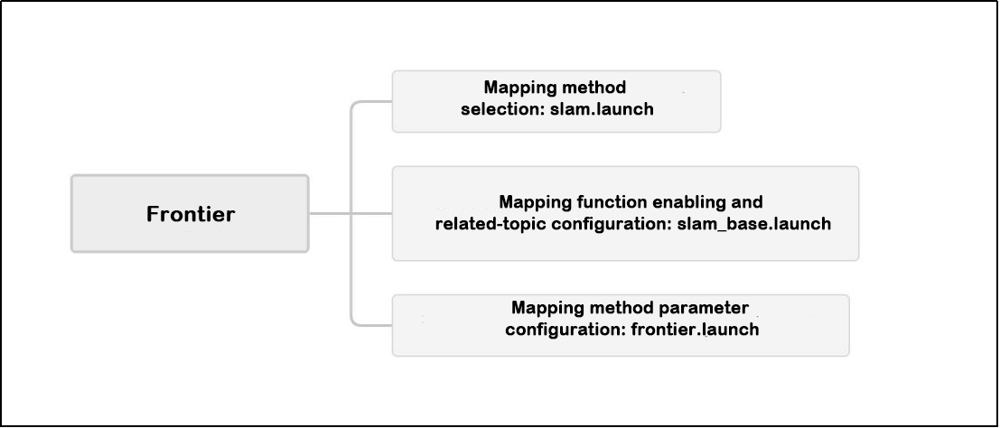

Reviewing the document structure, the focus is on selecting mapping methods, initiating mapping functionalities, configuring relevant topics, and adjusting mapping method parameters. For detailed syntax guidelines, please refer to the '**[14.ROS Basics Lesson]()**’.

**3. Select Mapping Method**

```py
    <arg name="slam_methods" default="gmapping" doc="slam type 
        [gmapping, cartographer, hector, karto, frontier, explore, rrt_exploration, rtabmap]"/>

    <arg name="gmapping"        default="gmapping"/>
    <arg name="cartographer"    default="cartographer"/>
    <arg name="hector"          default="hector"/>
    <arg name="karto"           default="karto"/>
    <arg name="frontier"        default="frontier"/>
    <arg name="explore"         default="explore"/>
    <arg name="rrt_exploration" default="rrt_exploration"/>
    <arg name="rtabmap"         default="rtabmap"/>
```

The slam_methods parameter represents the mapping method, with the default value being 'gmapping.' The available mapping methods include:

**Manual mapping:** gmapping, cartographer, hector and karto

**Autonomous mapping:** frontier and explorerrt_exploration

**3D mapping:** rtabmap

If using the 'gmapping' mapping method, the command line in the terminal when executing this launch file would be：

“**roslaunch hiwonder_slam slam.launch slam_methods:=gmapping**”

Here, slam_methods:=\[mapping method name\] can be modified according to the desired mapping method, for example: slam_methods:=karto.

Based on the current game, the recommended mapping method to choose is slam_methods:= frontier.

**4. Initiate Mapping Function and Related Topic Configuration**

```py
    <include file="$(find hiwonder_slam)/launch/include/slam_base.launch">
        <arg name="sim"             value="$(arg sim)"/>
        <arg name="slam_methods"    value="$(arg slam_methods)"/>
        <arg name="robot_name"      value="$(arg robot_name)"/>
    </include>
```

After choosing the mapping method '**slam_methods**,' it is necessary to initiate the mapping function using '**slam_base.launch**' and configure the relevant topic name.

As illustrated above, `<sim>` determines whether simulation is utilized, referring to the 'sim' parameter above. The default is 'false,' indicating no simulation. `<slam_methods>` denotes the mapping method, which, in this case, is set to 'explore.' `<robot_name>` represents the node name of the robot.

The image below displays the frontier section within 'slam_base.launch.' Subsequently, the main content of this summary focuses on this aspect.

```py
        <group if="$(eval slam_methods == 'frontier')">
            <include file="$(find hiwonder_slam)/launch/include/gmapping.launch">
                <arg name="scan"        value="$(arg scan_topic)"/>
                <arg name="base_frame"  value="$(arg base_frame)"/>
                <arg name="odom_frame"  value="$(arg odom_frame)"/>
                <arg name="map_frame"   value="$(arg map_frame)"/>
            </include>
            <include file="$(find hiwonder_slam)/launch/include/$(arg slam_methods).launch">
                <arg name="global_frame"        value="$(arg map_frame)"/>
                <arg name="robot_base_frame"    value="$(arg base_frame)"/>
                <arg name="odom_frame"          value="$(arg odom_frame)"/>
                <arg name="map_topic"           value="$(arg map_topic)"/>
                <arg name="map_frame"           value="$(arg map_frame)"/>
                <arg name="odom_topic"          value="$(arg odom_topic)"/>
                <arg name="scan_topic"          value="$(arg scan_topic)"/>
                <arg name="clicked_point"       value="$(arg clicked_point)"/>
                <arg name="move_base_result"    value="$(arg move_base_result)"/>
                <arg name="cmd_vel_topic"       value="$(arg cmd_vel_topic)"/>
            </include>
        </group>
```

Given the game's focus on independent mapping, the Gmapping mapping algorithm is integrated with the navigation algorithm throughout the mapping process. For an in-depth analysis of Gmapping content, please consult the '**Gmapping Mapping Algorithm Launch File Analysis**'

Upon examination of the figure above, a notable distinction from the manual mapping in the previous course is apparent. In addition to the parameters like scan, base_frame, odom_frame, and map_frame, several other parameters are defined and loaded into the '**frontier.launch**' file. These include:

1. **'global_frame' \[global coordinate system\], set to 'map_frame' \[map coordinate system\].**

2. 'clicked_frame' \[target point click coordinates\], set to 'clicked_point' \["topic_prefix)/clicked_point"\], where 'topic_prefix)/clicked_point' corresponds to the default value of 'clicked_point' in the launch document

3. 'cmd_vel_topic' \[Robot speed topic\], set to 'cmd_vel_topic' \['topic_prefix)/hiwonder_controller/cmd_vel'\], corresponding to the default value of 'cmd_vel_topic' in the launch document.

For detailed information about the contents of the 'slam_base.launch' file, please refer to 'slam_base.launch Program Analysis.

**5. Mapping Method Parameter Configuration**

Using the functionality provided in this game, you can locate the '**frontier.launch**' file at: '**hiwonder_slam/launch/include/frontier.launch’**

The basic parameter configuration is shown in the figure below

```py
    <arg name="global_frame"        default="map"/>
    <arg name="robot_base_frame"    default="base_footprint"/>
    <arg name="odom_frame"          default="odom"/>
    <arg name="map_topic"           default="map"/>
    <arg name="map_frame"           default="map"/>
    <arg name="odom_topic"          default="odom"/>
    <arg name="scan_topic"          default="scan"/>
    <arg name="clicked_point"       default="clicked_point"/>
    <arg name="move_base_result"    default="move_base_result"/>
    <arg name="cmd_vel_topic"       default="hiwonder_controller/cmd_vel"/>
```

Includes configurations for various topic coordinate systems (global_frame \[global coordinate system\], robot_base_frame \[robot's base coordinate system\], odom_frame \[odometer coordinate system\], map_frame \[map coordinate system\]), and settings for specific topics (map_topic \[map topic\], odom_topic \[odometer topic\], scan_topic \[radar scan topic\]).

1. Explanation of loading parameters in the function package for initiating path planning

   ```py
       <include file="$(find hiwonder_navigation)/launch/include/move_base.launch">
           <arg name="cmd_vel_topic"                   value="$(arg cmd_vel_topic)" />
           <arg name="global_costmap_map_topic"        value="$(arg map_topic)"/>
           <arg name="global_costmap_sensor_frame"     value="$(arg robot_base_frame)"/>
           <arg name="global_costmap_sensor_topic"     value="$(arg scan_topic)"/>
           <arg name="global_costmap_global_frame"     value="$(arg global_frame)"/>
           <arg name="global_costmap_robot_base_frame" value="$(arg robot_base_frame)"/>
           <arg name="local_costmap_map_topic"         value="$(arg map_topic)"/>
           <arg name="local_costmap_sensor_frame"      value="$(arg robot_base_frame)"/>
           <arg name="local_costmap_sensor_topic"      value="$(arg scan_topic)"/>
           <arg name="local_costmap_global_frame"      value="$(arg odom_frame)"/>
           <arg name="local_costmap_robot_base_frame"  value="$(arg robot_base_frame)"/>
           <arg name="virtual_wall_map_frame"          value="$(arg map_frame)"/>
           <arg name="teb_odom_topic"                  value="$(arg odom_topic)"/>
           <arg name="teb_map_frame"                   value="$(arg odom_frame)"/>
       </include>
   ```

2. Configuration of the robot speed topic 'cmd_vel_topic.'

3. Setting the global cost map parameter message name (global_costmap\_\[...\]) and local cost map parameter name (local_costmap\_\[...\]).

4. Configuration of 'teb_odom_topic' \[odom topic of teb path planning algorithm\] and 'teb_map_frame' \[map coordinate system of teb path planning algorithm\].

> [!NOTE]
>
> **Note: It is recommended to maintain the default settings for the above parameters. Modifying them independently is not advised, as it may impact the effectiveness of the game!!!**
>
> **To get detailed information, please visit this link:** **http://wiki.ros.org/explore_lite**

### 6.1.7 Explore_Lite Autonomous Mapping

* **Explore_Lite Description**

Explorer_Lite mapping, also known as exploration mapping, is a fully automated mapping method that operates without the need for human control or manual setting of target points. Upon activating this game, the robot initiates movement. While in motion, the robot autonomously navigates, avoids obstacles, and simultaneously builds maps.

The implementation of Explorer_Lite mapping can be divided into two primary components: the mapping algorithm and movement.

Various mapping algorithms can be utilized, such as Gmapping, Hector, Karto, and Cartographer. This lesson specifically employs the Gmapping algorithm.

The robot's movement route is planned based on the map currently under construction. The robot continuously explores by moving towards the boundaries of the existing map until the mapping of the current area is complete.


**Explore_Lite software pack link: <https://github.com/hrnr/m-explore>**

* **Mapping Operation Steps**

> [!NOTE]
>
> **Notice:**
>
> * **Prior to initiating, ensure the construction of a sealed environment and preposition the robot inside. It is crucial to maintain airtight conditions!**
>
> * **When entering commands, strict case sensitivity is required, and the "Tab" key can be used to auto-complete keywords.**

**1. Enable Service**

1. Start the robot, and access the robot system desktop using NoMachine.

2. Double click  to open the command line terminal.

3. Execute the command “**sudo systemctl stop start_app_node.service**” and press Enter to disable app auto-start service.

   ```py
   sudo systemctl stop start_app_node.service
   ```

4. Open a new terminal, and execute the command “**roslaunch hiwonder_slam slam.launch slam_methods:=explore**” to enable mapping service.

   ```py
   roslaunch hiwonder_slam slam.launch slam_methods:=explore
   ```

5. Open a new command-line terminal window and execute the command ‘**roslaunch hiwonder_slam rviz_slam.launch slam_methods:=explore**’ to launch the model viewing software.

   ```py
   roslaunch hiwonder_slam rviz_slam.launch slam_methods:=explore
   ```

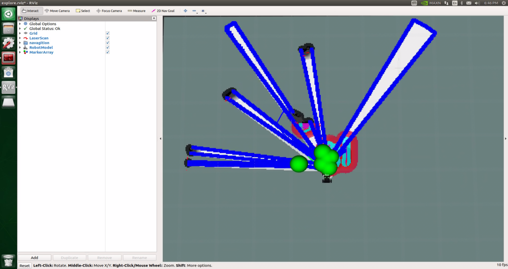

**2. Save the Map**

1. Open a new terminal and input the command “**roscd hiwonder_slam/maps**” and press Enter to navigate to the folder where the map is stored.

   ```py
   roscd hiwonder_slam/maps
   ```

2. Execute the command ‘**rosrun map_server map_saver map:=/robot_1/map -f map_01**’ and press Enter to save the map.

   ```py
   rosrun map_server map_saver map:=/robot_1/map -f map_01
   ```

The term "**robot_1**" in the command represents the robot name, while "**map_01**" designates the map name. Users can rename them according to their preferences. The appearance of the following prompt confirms the successful saving of the map.


3. If you want to stop running the program, you can press “**Ctrl+C**”.

4. To enable the app service, execute the command ‘**sudo systemctl start start_app_node.service**’.

   ```py
   sudo systemctl start start_app_node.service
   ```

**3. Optimize Program Outcome**

For enhanced mapping precision, consider optimizing the odometer settings. The robot's mapping process heavily relies on the Lidar, and the odometer's functionality is closely tied to Lidar operations.

The calibrated IMU (Inertial Measurement Unit) data has been successfully integrated into the robot's system, enabling both mapping and navigation. However, to achieve even greater accuracy, it's advisable to calibrate the IMU. Detailed instructions on how to perform IMU calibration are available in "**[3 ROS1-Chassis Motion Control Lesson\3.2 Motion Control\3.2.1 IMU, Linear Velocity and Angular Velocity Calibration]()**”.

* **Launch File Analysis**

**1. Path**

**According to the game,** the main files involved are as follows:

1. **slam.launch**: Selects the mapping method (Location: **/ros_ws/src/hiwonder_slam/launch/slam.lauch**)

2. **slam_base.launch**: Basic topic configuration and startup for mapping functionalities(Location: **/ros_ws/src/hiwonder_slam/launch/include/slam_base.launch**)

3. **explore.launch**: Specific topic and parameter configuration for the mapping method (Location: **hiwonder_slam/launch/include/explore.launch**)

**2. Structure**

The file structure is as below:

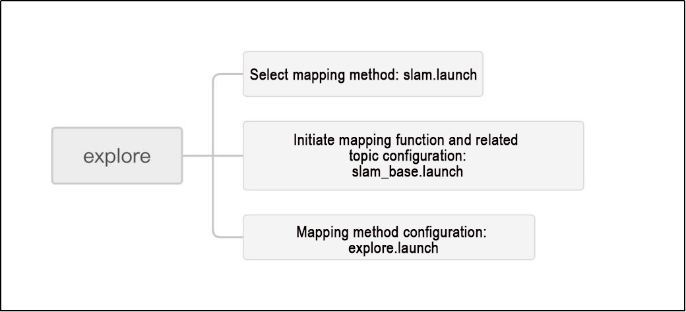

Reviewing the document structure, the focus is on selecting mapping methods, initiating mapping functionalities, configuring relevant topics, and adjusting mapping method parameters. For detailed syntax guidelines, please refer to the '**[14.ROS Basics Lesson]()**’.

**3. Select Mapping Method**

```py
    <arg name="slam_methods" default="gmapping" doc="slam type 
        [gmapping, cartographer, hector, karto, frontier, explore, rrt_exploration, rtabmap]"/>

    <arg name="gmapping"        default="gmapping"/>
    <arg name="cartographer"    default="cartographer"/>
    <arg name="hector"          default="hector"/>
    <arg name="karto"           default="karto"/>
    <arg name="frontier"        default="frontier"/>
    <arg name="explore"         default="explore"/>
    <arg name="rrt_exploration" default="rrt_exploration"/>
    <arg name="rtabmap"         default="rtabmap"/>
```

The `slam_methods` parameter represents the mapping method, with the default value being 'gmapping.' The available mapping methods include:

**Manual mapping:** gmapping, cartographer, hector and karto

**Autonomous mapping:** frontier and explorerrt_exploration

**3D mapping:** rtabmap

If using the 'gmapping' mapping method, the command line in the terminal when executing this launch file would be：

“**roslaunch hiwonder_slam slam.launch slam_methods:=gmapping**”

Here, slam_methods:=\[mapping method name\] can be modified according to the desired mapping method, for example: slam_methods:=karto.

Based on the current game, the recommended mapping method to choose is slam_methods:= explore.

**4. Initiate Mapping Function and Related Topic Configuration**

```py
    <include file="$(find hiwonder_slam)/launch/include/slam_base.launch">
        <arg name="sim"             value="$(arg sim)"/>
        <arg name="slam_methods"    value="$(arg slam_methods)"/>
        <arg name="robot_name"      value="$(arg robot_name)"/>
    </include>
```

Upon choosing the mapping method '**slam_methods**,' the mapping function needs to be initiated through '**slam_base.launch**,' and the relevant topic name should be configured.

As depicted in the figure above, `<sim>` denotes whether simulation is employed, referring to the aforementioned 'sim' parameter. The default is 'false,' indicating that node simulation is not initiated. `<slam_methods>` designates the mapping method, and for this case, it is set to "**explore**." `<robot_name>` represents the node name of the robot.

The image below illustrates the '**explore**' section in '**slam_base.launch**.' The subsequent part of this summary elaborates on its main content.

```py
        <group if="$(eval slam_methods == 'explore')">
            <include file="$(find hiwonder_slam)/launch/include/gmapping.launch">
                <arg name="scan"        value="$(arg scan_topic)"/>
                <arg name="base_frame"  value="$(arg base_frame)"/>
                <arg name="odom_frame"  value="$(arg odom_frame)"/>
                <arg name="map_frame"   value="$(arg map_frame)"/>
            </include>
            <include file="$(find hiwonder_slam)/launch/include/$(arg slam_methods).launch">
                <arg name="map_topic"               value="$(arg map_topic)"/>
                <arg name="base_frame"              value="$(arg base_frame)"/>
                <arg name="costmap_topic"           value="$(arg costmap_topic)"/>
                <arg name="costmap_updates_topic"   value="$(arg costmap_updates_topic)"/>
            </include>
            <!-- 启动路径规划算法包(start path planning algorithm) -->
            <include file="$(find hiwonder_navigation)/launch/include/move_base.launch">
                <arg name="cmd_vel_topic"                   value="$(arg cmd_vel_topic)"/>
                <arg name="global_costmap_map_topic"        value="$(arg map_topic)"/>
                <arg name="global_costmap_sensor_frame"     value="$(arg base_frame)"/>
                <arg name="global_costmap_sensor_topic"     value="$(arg scan_topic)"/>
                <arg name="global_costmap_global_frame"     value="$(arg map_frame)"/>
                <arg name="global_costmap_robot_base_frame" value="$(arg base_frame)"/>
                <arg name="local_costmap_map_topic"         value="$(arg map_topic)"/>
                <arg name="local_costmap_sensor_frame"      value="$(arg base_frame)"/>
                <arg name="local_costmap_sensor_topic"      value="$(arg scan_topic)"/>
                <arg name="local_costmap_global_frame"      value="$(arg odom_frame)"/>
                <arg name="local_costmap_robot_base_frame"  value="$(arg base_frame)"/>
                <arg name="virtual_wall_map_frame"          value="$(arg map_frame)"/>
                <arg name="teb_odom_topic"                  value="$(arg odom_topic)"/>
                <arg name="teb_map_frame"                   value="$(arg odom_frame)"/>
            </include>
        </group>
```

The code snippet displayed in the above image utilizes three launch files:

1. gmapping.launch: For a detailed explanation of the primary content, please consult the "**Analysis of Gmapping Mapping Algorithm Launch File**."

2. The launch folder in the function package **hiwonder_slam** within this game includes a folder named include. For specifics, please refer to Map Construction Method Parameter Configuration.

3. `move_base.launch`: This launch file handles the robot's posture planning during the mapping process. For a comprehensive understanding, please review the "**move_base.launch file analysis**" in the current tutorial folder.

   For the precise contents of the slam_base.launch file, kindly refer to the "**slam_base.launch Program Analysis**."

**5. Mapping Method Parameter Configuration**

Using the functionality provided in this game, you can find the location of the 'explore.launch' file at: '**hiwonder_slam/launch/include/explore.launch**'

```py
    <arg name="base_frame"              default="base_footprint"/>
    <arg name="costmap_topic"           default="map"/>
    <arg name="costmap_updates_topic"   default="map_updates"/>
    <arg name="map_topic"               default="map"/>
    <arg name="map_save_path"           default="$(find hiwonder_slam)/maps/explore"/>
```

The key point to note is the '**map_save_path**.' After completing the mapping using the Explore_Lite algorithm, the map is not automatically saved through instructions. The default location for saving the map is '**hiwonder_slam/maps/explore**.' Typically, commands are used to save the map.

```py
    <node pkg="explore_lite" type="explore" respawn="false" name="explore" output="screen">
        <param name="map_topic"             value="$(arg map_topic)"/>
        <param name="map_save_path"         value="$(arg map_save_path)"/>
        <param name="robot_base_frame"      value="$(arg base_frame)"/>
        <param name="costmap_topic"         value="$(arg costmap_topic)"/>
        <param name="costmap_updates_topic" value="$(arg costmap_updates_topic)"/>
        <param name="visualize"             value="true"/>
        <param name="planner_frequency"     value="0.33"/>
        <param name="progress_timeout"      value="20.0"/>
        <param name="potential_scale"       value="3.0"/>
        <param name="orientation_scale"     value="0.0"/>
        <param name="gain_scale"            value="1.0"/>
        <param name="transform_tolerance"   value="0.3"/>
        <param name="min_frontier_size"     value="0.5"/>
    </node>
```

In addition to the topic parameter settings for the map, robot coordinates, and cost map, attention should also be given to the following parameters:

1. `<planner_frequency>`: Path planner frequency, with a value of 0.33. Typically, adjusting this parameter is done to control the speed of the robot's autonomous mobile mapping and the frequency of map updates. An excessively large or small value can impact the robot's movement direction and mapping speed.

2. `<progress_timeout>`: Function package running timeout, set to 20 seconds. In the event of program termination due to abnormality or a stuck process, there is a 20-second detection time. If this time is exceeded, the current function package will abandon the current goal and continue running.

3. `<potential_scale>`: Distance weight to the boundary, with a value of 3.0. While directly changing this value won't affect the judgment of the safe distance to the boundary, it is recommended to keep the default setting.

4. `<orientation_scale>`: Distance weight of the robot's frontier direction, with a value of 0.0.

5. `<gain_scale\>`: Boundary gain value, set to 1.0. As a multiplicative gain value, it does not affect the value of potential_scale.

6. `<transform_tolerance>`: Turning tolerance of the robot during movement, set to 0.3. It is advisable to retain the default value.

7. `<min_frontier_size>`: Minimum threshold for the size of the boundary, with a value of 0.5. It is recommended to keep the default setting.

> [!NOTE]
>
> **Note: It is recommended to maintain the default settings for the above parameters. Modifying them independently is not advised, as it may impact the effectiveness of the game!!!**

### 6.1.8 RRT Exploration Mapping

* **RRT Description**

The term "RRT" refers to the Rapidly Expanding Random Tree Algorithm, a widely utilized motion planning algorithm over the past decade. This algorithm employs a probability-based sampling approach to navigate through the state space, utilizing random sampling points to guide the search towards unexplored regions. The primary objective is to establish a planned path from the starting point to the target point, while also conducting collision detection on sampled points in the state space, eliminating the need for space modeling.

The original RRT algorithm initiates with an initial point as the root node and generates a random expansion by sampling and adding leaf nodes. As the tree expands, if a leaf node reaches the target point or enters the target area, it becomes part of the tree. The planned path from the initial to the target point is then determined through backtracking within the random tree structure.

It works following the steps below:

1. Begin by creating a tree with the starting point as the root node and defining the target point.

2. Retrieve map data.

3. Randomly select a point on the map, denoted as p_rand.

4. Traverse the entire existing tree to identify the point closest to p_rand, marked as p_near.

5. Extend the distance from p_near to the random point p_rand by one step, with the step length recorded as Delta. This results in a new point, labeled as p_new.

6. Check if the newly created point, p_new, lies on an obstacle. If it does, exit this loop and restart from step 3.

7. Integrate the newly generated point, p_new, into the entire tree.

8. If the distance from the p_new point to the target point falls below a specific threshold, conclude the search and visualize the entire path.

   

**RRT Software Pack:**

<https://github.com/RoboJackets/rrt>

* **Mapping Operation Steps**

> [!NOTE]
>
> **Notice:**
>
> * **Prior to initiating, ensure the construction of a sealed environment and preposition the robot inside. It is crucial to maintain airtight conditions!**
>
> * **When entering commands, strict case sensitivity is required, and the "Tab" key can be used to auto-complete keywords.**

**1. Enable Service**

1. Start the robot, and access the robot system desktop using NoMachine.

2. Double click  to open the command line terminal.

3. Execute the command “**sudo systemctl stop start_app_node.service**” and press Enter to disable app auto-start service.

   ```py
   sudo systemctl stop start_app_node.service
   ```

4. Open a new terminal, and execute the command “**roslaunch hiwonder_slam slam.launch slam_methods:=rrt_exploration**” to enable mapping service.

   > [!NOTE]
   >
   > **Note: Once you activate the mapping service, the robot will autonomously plan a path and commence mapping. Therefore, ensure to position it on the ground before powering it on.**

   ```py
   roslaunch hiwonder_slam slam.launch slam_methods:=rrt_exploration
   ```

5. Open a new command-line terminal window and execute the command ‘**roslaunch hiwonder_slam rviz_slam.launch slam_methods:=rrt_exploration**’ to launch the model viewing software.

   ```py
   roslaunch hiwonder_slam rviz_slam.launch slam_methods:=rrt_exploration
   ```

**2. Start Mapping**

1. To initiate, select the option highlighted in the red box at the top of the window, as illustrated below. Subsequently, click on an blank area on the map. It is essential to set a total of five points. The first four points define the exploration area, while the fifth point serves as the starting point for positioning (ensure to click in front of the car, avoiding clicking directly on the car). Once these settings are configured, commence the exploration and mapping process.

   

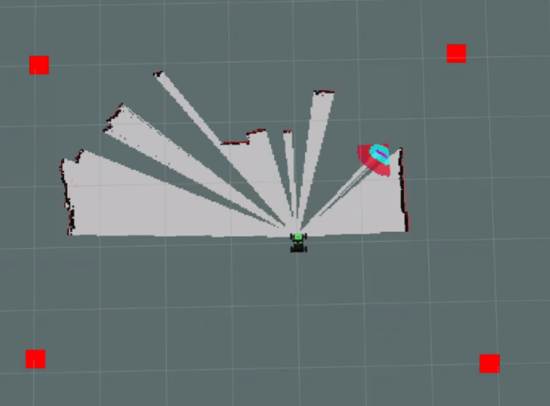

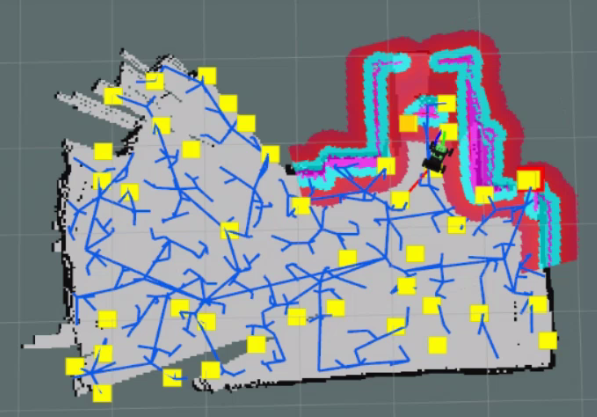

**3. Save the Map**

1. Open a new terminal and input the command “**roscd hiwonder_slam/maps**” and press Enter to navigate to the folder where the map is stored.

   ```py
   roscd hiwonder_slam/maps
   ```

2. Execute the command ‘**rosrun map_server map_saver map:=/robot_1/map -f map_01**’ and press Enter to save the map.

   ```py
   rosrun map_server map_saver map:=/robot_1/map -f map_01
   ```

The term "**robot_1**" in the command represents the robot name, while "**map_01**" designates the map name. Users can rename them according to their preferences. The appearance of the following prompt confirms the successful saving of the map.


3. If you want to stop running the program, you can press “**Ctrl+C**”.

4. To enable the app service, execute the command ‘**sudo systemctl start start_app_node.service**’.

   ```py
   sudo systemctl start start_app_node.service
   ```

**4. Optimize Program Outcome**

For enhanced mapping precision, consider optimizing the odometer settings. The robot's mapping process heavily relies on the Lidar, and the odometer's functionality is closely tied to Lidar operations.

The calibrated IMU (Inertial Measurement Unit) data has been successfully integrated into the robot's system, enabling both mapping and navigation. However, to achieve even greater accuracy, it's advisable to calibrate the IMU. Detailed instructions on how to perform IMU calibration are available in "**[3 Chassis Motion Control Lesson\3.2 Motion Control\3.2.1 IMU, Linear Velocity and Angular Velocity Calibration]()**”.

* **Parameter Description**

You can access the parameter file at the following path: "**hiwonder_slam/launch/include/rrt_exploration.launch**."

maxUrange: Intercept the laser range, clipping laser data to this value.

maxRange: Laser range; if the area within the laser range without obstacles should be displayed as free space on the map, set maxUrange \< the maximum range of the actual radar \<= maxRange.

sigma: Sigma value for the greedy endpoint matching method.

kernelSize: Kernel size for finding laser matching relationships.

lstep: Optimization step size for translation.

astep: 0.05

iterations: 1

lsigma: 0.075

ogain: 3.0

lskip: 0 means all lasers are processed and should be as close to zero as possible. If the calculated pressure is too high, it can be changed to 1.

minimumScore: Score measuring the scan matching effect. Higher values increase the requirements for the laser matching algorithm, making it more prone to failure and switch to using odometer data. Setting it too low can introduce noise in the map.

srr: Linear error of the odometry in the linear equation.

srt: Linear error of the odometry in the rotation equation.

str: Odometer rotation error in the linear equation.

stt: Rotation error of the odometer in the rotation equation.

linearUpdate: The robot performs a scan when it runs this far in a straight line; unit is meters.

angularUpdate: Scan once when the robot rotates this much; unit is radians.

temporalUpdate: -1.0

resampleThreshold: 0.5

particles: Number of particles; a crucial parameter.

xmin: Minimum initial map size (m).

ymin: Minimum initial map size (m).

xmax: Maximum initial map size (m).

ymax: Maximum initial map size (m).

delta: Map resolution.

llsamplerange: Shift the likelihood domain of the sampling range.

llsamplestep: Shift the likelihood domain of the sampling step.

* **Launch File Analysis**

**1. Path**

According to the game, the main files involved are as follows:

1. **slam.launch**: Selects the mapping method (Location: **/ros_ws/src/hiwonder_slam/launch/slam.lauch**)

2. **slam_base.launch**: Basic topic configuration and startup for mapping functionalities(Location: **/ros_ws/src/hiwonder_slam/launch/include/slam_base.launch**)

3. **rrt_exploration**:Specific topic and parameter configuration for the mapping method（Location: **hiwonder_slam/launch/include/rrt_exploration.launch**）

**2. Structure**

The file structure is as below:

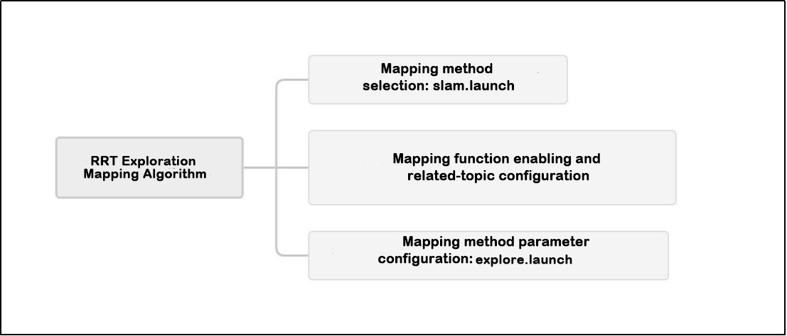

Reviewing the document structure, the focus is on selecting mapping methods, initiating mapping functionalities, configuring relevant topics, and adjusting mapping method parameters. For detailed syntax guidelines, please refer to the '**[ROS Basics Lesson]()**’.

**3. Select Mapping Method**

It corresponds to slam.launch file.

```py
    <arg name="slam_methods" default="gmapping" doc="slam type 
        [gmapping, cartographer, hector, karto, frontier, explore, rrt_exploration, rtabmap]"/>

    <arg name="gmapping"        default="gmapping"/>
    <arg name="cartographer"    default="cartographer"/>
    <arg name="hector"          default="hector"/>
    <arg name="karto"           default="karto"/>
    <arg name="frontier"        default="frontier"/>
    <arg name="explore"         default="explore"/>
    <arg name="rrt_exploration" default="rrt_exploration"/>
    <arg name="rtabmap"         default="rtabmap"/>
```

Prior to constructing a map, it is crucial to select a mapping method, as illustrated in the figure above:

The slam_methods parameter represents the mapping method, with the default value being '**gmapping**.' The available mapping methods include:

**Manual mapping:** gmapping, cartographer, hector and karto

**Autonomous mapping:** frontier and explorerrt_exploration

**3D mapping:** rtabmap

If using the 'gmapping' mapping method, the command line in the terminal when executing this launch file would be：

“**roslaunch hiwonder_slam slam.launch slam_methods:=gmapping**”

Here, slam_methods:=\[mapping method name\] can be modified according to the desired mapping method, for example: slam_methods:=karto.

Based on the current game, the recommended mapping method to choose is slam_methods:= rrt_exploration.

**4. Initiate Mapping Function and Related Topic Configuration**

```py
    <include file="$(find hiwonder_slam)/launch/include/slam_base.launch">
        <arg name="sim"             value="$(arg sim)"/>
        <arg name="slam_methods"    value="$(arg slam_methods)"/>
        <arg name="robot_name"      value="$(arg robot_name)"/>
    </include>
```

Once the mapping method `slam_methods` has been selected, initiate the mapping function by executing **slam_base.launch** and configuring the relevant topic name.

In the provided example, **\<sim\>** denotes whether simulation is utilized, referencing the parameter sim. The default value is false, indicating that the node simulation is not activated. **\<slam_methods\>** specifies the mapping method, and for this specific case, it is set to "**rrt_exploration**". **\<robot_name\>** represents the node name of the robot.

Refer to the image below for the section related to `rrt_exploration` within **slam_base.launch**. The subsequent section of this summary outlines its primary content.

```py
        <group if="$(eval slam_methods == 'rrt_exploration')">
            <include file="$(find hiwonder_slam)/launch/include/gmapping.launch">
                <arg name="scan"        value="$(arg scan_topic)"/>
                <arg name="base_frame"  value="$(arg base_frame)"/>
                <arg name="odom_frame"  value="$(arg odom_frame)"/>
                <arg name="map_frame"   value="$(arg map_frame)"/>
            </include>
            <!-- 启动路径规划算法包(start path planning algorithm) -->
            <include file="$(find hiwonder_navigation)/launch/include/move_base.launch">
                <arg name="cmd_vel_topic"                   value="$(arg cmd_vel_topic)"/>
                <arg name="global_costmap_map_topic"        value="$(arg map_topic)"/>
                <arg name="global_costmap_sensor_frame"     value="$(arg base_frame)"/>
                <arg name="global_costmap_sensor_topic"     value="$(arg scan_topic)"/>
                <arg name="global_costmap_global_frame"     value="$(arg map_frame)"/>
                <arg name="global_costmap_robot_base_frame" value="$(arg base_frame)"/>
                <arg name="local_costmap_map_topic"         value="$(arg map_topic)"/>
                <arg name="local_costmap_sensor_frame"      value="$(arg base_frame)"/>
                <arg name="local_costmap_sensor_topic"      value="$(arg scan_topic)"/>
                <arg name="local_costmap_global_frame"      value="$(arg odom_frame)"/>
                <arg name="local_costmap_robot_base_frame"  value="$(arg base_frame)"/>
                <arg name="virtual_wall_map_frame"          value="$(arg map_frame)"/>
                <arg name="teb_odom_topic"                  value="$(arg odom_topic)"/>
                <arg name="teb_map_frame"                   value="$(arg odom_frame)"/>
            </include>
            <!-- 启动自探索建图算法包(start autonomous exploring mapping algorithm) -->
            <include file="$(find hiwonder_slam)/launch/include/rrt_exploration.launch">
                <arg name="namespace"       value="$(arg robot_prefix)"/>
                <arg name="n_robots"        value="$(arg robot_number)"/>
                <arg name="map_topic"       value="$(arg map_topic)"/>
                <arg name="odom_topic"      value="$(arg odom_topic)"/>
                <arg name="robot_base"      value="$(arg base_frame)"/>
                <arg name="global_frame"    value="$(arg map_frame)"/>
            </include>
        </group>
```

The code snippet displayed in the above image utilizes three launch files:

1. gmapping.launch: Refer to "**Analysis of Gmapping Mapping Algorithm Launch File**" for detailed information on the main content.

2. move_base.launch: Explore the robot posture planning aspects during the mapping process by referring to the "**move_base.launch file analysis**" in the current tutorial folder.

3. The hiwonder_slam function package for this game contains a folder named include. Delve into the details by consulting Mapping Method Parameter Configuration.

   For specific contents within the slam_base.launch file, consult "**slam_base.launch Program Analysis**."

**5. Mapping Method Parameter Configuration**

Within the function package of this game, you can find the rrt_exploration.launch file at the following location: "**hiwonder_slam/launch/include/rrt_exploration.launch**."

The subsequent figure displays pertinent topics, the name of the robot coordinate system, and the initialization of logical parameters.

```py
    <arg name="eta"                     value="0.5"/>
    <arg name="Geta"                    value="2.0"/>
    <arg name="map_topic"               default="map"/>
    <arg name="odom_topic"              default="odom"/>
    <arg name="robot_base"              default="base_footprint"/>
    <arg name="global_frame"            default="map"/>
    <arg name="namespace"               default="/robot_"/>
    <arg name="n_robots"                default="1"/>
    <arg name="robot_name"              value="$(arg namespace)$(arg n_robots)"/>
    <param name="namespace_init_count"  value="1"/>
```

1. `<eta>`: Boundary growth rate, utilized for detecting the growth rate of RRT. A larger value makes the RRT planning algorithm traverse branches more quickly, but it also increases the computational load. The default value is 0.5, and it is recommended to keep it as such.

2. `<Geta>`: The lateral weight value of the boundary growth rate, used in conjunction with eta.

3. `<map_topic>`: Map topic message, `<odom_topic>`: Odometer topic message, `<robot_base>`: Machine `<global_frame>`: Human initial attitude message in the global coordinate system.

4. `<namespace>`: Robot namespace, \<n_robots\>: Robot number settings, \<robot_name\>: Robot name, `<namespace_init_count>`: Initialize namespace count.

The accompanying figure illustrates the initiation of the rrt global detector and rrt local detector function packages along with relevant parameter settings.

```py
    <node pkg="rrt_exploration" type="global_rrt_detector" name="global_detector" output="screen">
        <param name="eta"               value="$(arg Geta)"/>
        <param name="map_topic"         value="$(arg map_topic)"/>
        <param name="clicked_point"     value="/$(arg robot_name)/clicked_point"/>
        <param name="detected_points"   value="detected_points"/>
        <param name="shapes"            value="/$(arg robot_name)/global_detector_shapes"/>
    </node>
    
    <node pkg="rrt_exploration" type="local_rrt_detector" name="local_detector" output="screen">
        <param name="eta"               value="$(arg eta)"/>
        <param name="map_topic"         value="$(arg map_topic)"/>
        <param name="robot_frame"       value="$(arg robot_base)"/>
        <param name="clicked_point"     value="/$(arg robot_name)/clicked_point"/>
        <param name="detected_points"   value="detected_points"/>
        <param name="shapes"            value="/$(arg robot_name)/local_detector_shapes"/>
    </node>
```

For analogous parameter and variable names, please consult the prior point and maintain the default parameters.

The subsequent figure illustrates the execution file (filter.py) for the boundary filtering algorithm of the RRT algorithm.

```py
    <node pkg="rrt_exploration" type="filter.py" name="filter" output="screen">
        <param name="map_topic"                     value="$(arg map_topic)"/>
        <param name="robot_frame"                   value="base_footprint"/>
        <param name="info_radius"                   value="0.8"/>
        <param name="costmap_clearing_threshold"    value="70"/>
        <param name="goals_topic"                   value="/$(arg robot_name)/detected_points"/>
        <param name="namespace"                     value="/$(arg namespace)"/>
        <param name="n_robots"                      value="$(arg n_robots)"/>
        <param name="rate"                          value="100"/>
        <param name="global_costmap_topic"          value="/move_base/global_costmap/costmap"/>
    </node>
```

1. `<info_radius>`: The boundary expansion range is increased by 0.8 times based on the original grid.

2. `<costmap_clearing_threshold>`: Cost map clearing threshold. If the cost of the detected map result is below this specified value, the identified unit will be disregarded in raster information.

3. `<goals_topic>`: RRT detector target point topic.

4. `<rate>`: RRT detector detection update frequency.

5. `<global_costmap_topic>`: Global cost map topic.

The accompanying figure displays the execution file (assigner.py) for setting the priority of the robot's movement direction.

```py
    <node pkg="rrt_exploration" type="assigner.py" name="assigner" output="screen">
        <param name="map_topic"                 value="$(arg map_topic)"/>
        <param name="global_frame"              value="$(arg global_frame)"/>
        <param name="robot_frame"               value="base_footprint"/>
        <param name="info_radius"               value="1"/>
        <param name="info_multiplier"           value="3.0"/>
        <param name="hysteresis_radius"         value="3.0"/>
        <param name="hysteresis_gain"           value="2.0"/>
        <param name="frontiers_topic"           value="/$(arg robot_name)/filtered_points"/>
        <param name="n_robots"                  value="$(arg n_robots)"/>
        <param name="namespace"                 value="/$(arg namespace)"/>
        <param name="delay_after_assignement"   value="0.5"/>
        <param name="rate"                      value="100"/>
        <param name="plan_service"              value="/move_base/GlobalPlanner/make_plan"/>
    </node>
```

1. `<info_radius>`: The boundary expansion range is increased by 0.8 times based on the original grid.

2. `<info_multiplier>`: Border polygon expansion, with the expansion value set to 3.0.

3. `<hysteresis_radius>`: The Lidar scanning retention radius, which cannot be lower than the Lidar scanning radius and is generally set to 3.0.

4. `<hysteresis_gain>`: Lidar scanning gain, typically set to 2.0.

5. `<frontiers_topic>`: Information messages regarding the frontier direction of the robot.

6. `<plane_service>`: Path message service

The following image depicts the main contents of the executable file for saving the map after RRT exploration.

```py
    <node pkg="hiwonder_slam" type="rrt_map_save.py" name="map_save" output="screen">
        <param name="map_frame"         value="$(arg global_frame)"/>
        <param name="odom_topic"        value="$(arg odom_topic)"/>
        <param name="clicked_point"     value="/$(arg robot_name)/clicked_point"/>
        <param name="wait_finish_time"  value="5"/>
    </node>
```

1. `<clicked_point>` defines five points in the area. The first four points represent the corners of the square areas to be explored, while the last point designates the starting point of the tree, indicating where the robot commences its operation.

2. `<wait_finish_time>` denotes the waiting time for messages after reaching the target. Although this parameter is flexible, it is advisable to set it greater than 3 seconds to ensure the complete establishment of the map.

> [!NOTE]
>
> **Note: It is recommended to maintain the default settings for the above parameters. Modifying them independently is not advised, as it may impact the effectiveness of the game!!!**

### 6.1.9 ORBSLAM2 and ORBSLAM3 Mapping

* **ORBSLAM2 and ORBSLAM3 Description**

ORB-SLAM2 for binocular and RGB-D cameras is an extension of our monocular feature ORB-SLAM. The system overview is depicted in the figure, and it primarily operates with three parallel threads:

1)  Tracking Thread: Tracks the camera in each frame by identifying features that match the local map and minimizing the reprojection error.

2)  Local Mapping Thread: Manages the local map and optimizes it by performing local Bundle Adjustment (BA).

3)  Loop Closure Thread: Detects large loops and corrects accumulated drift through pose graph optimization. This thread initiates the fourth thread, which conducts full Bundle Adjustment after optimizing the pose graph, ultimately calculating the optimal Structure-from-Motion (SfM) solution.


The system relies on ORB features for tracking, mapping, and location identification. These features demonstrate robustness to rotation and scaling, invariance to camera auto-gain and auto-exposure, as well as adaptability to lighting changes. Feature extraction and matching are fast, allowing real-time operation with good precision/recall performance in bag-of-words location recognition.

Development Status: ORB-SLAM2 currently achieves high accuracy and outperforms other methods in the KITTI visual odometry benchmark, particularly excelling in achieving zero-drift positioning in previously mapped areas.

Comparison with ORB-SLAM3:

Feature Extraction and Descriptors: ORB-SLAM2 uses ORB features and descriptors, whereas ORB-SLAM3 employs SuperPoint features and SuperPoint descriptors, based on convolutional neural networks for enhanced robustness and accuracy.

Attitude Estimation: ORB-SLAM2 utilizes the EPnP algorithm for attitude estimation, while ORB-SLAM3 opts for the PnP algorithm, known for greater efficiency and accuracy.

Semantic Information: ORB-SLAM3 supports the input and processing of semantic information, allowing the integration of semantic data with visual information to enhance the SLAM system's robustness and accuracy.

Multi-Camera System: ORB-SLAM3 supports mapping and positioning for multi-camera systems, processing visual information from multiple cameras simultaneously.

The following figure is a system overview diagram of ORB-SLAM3, which includes ORB-SLAM2.


The process involves the following steps:

1)  ORB Feature Extraction:

Extract ORB features from the image.

2)  Pose Estimation:

Perform pose estimation based on the previous frame or initialize the pose through global relocation.

3)  Local Map Tracking:

Track the reconstructed local map based on the estimated pose.

4)  Pose Optimization:

Optimize the pose and determine new keyframes.

5)  Map Point Generation:

Insert new keyframes into the map to generate new map points.

6)  Map Verification:

Verify the map and delete redundant keyframes.

7)  Local Map Generation:

Obtain the local map for matching.

8)  Matching:

Perform matching on the local maps.

9)  Map Fusion:

Fuse the maps together.

10) Global Map Adjustment:

Adjust the global map based on the fused maps.

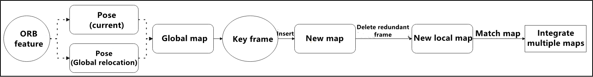

1. ORBSLAM2 software pack：<https://github.com/ethz-asl/orb_slam_2_ros>

2. ORBSLAM3 software pack：<https://github.com/shanpenghui/ORB_SLAM3_Fixed>

* **Mapping Operation Steps**

**1. Enable ORBSLAM2 Mapping**

1. Start the robot, and access the robot system desktop using NoMachine.

2. Double click  to open the command line terminal.

3. Execute the command “**sudo systemctl stop start_app_node.service**” and press Enter to disable app auto-start service.

   ```py
   sudo systemctl stop start_app_node.service
   ```

4. Open a new terminal, and execute the command “**roslaunch hiwonder_example orb_slam2_rgbd.launch**” to enable mapping service.

   ```py
   roslaunch hiwonder_example orb_slam2_rgbd.launch
   ```

When the window below appears, it indicates that the service has been successfully enabled.


5. Open a new command-line terminal window and execute the command ‘**roslaunch hiwonder_peripherals teleop_key_control.launch robot_name:=/**’ to enable the keyboard control service.

   ```py
   roslaunch hiwonder_peripherals teleop_key_control.launch robot_name:=/
   ```

When the following prompt occurs, it means the keyboard control service is enabled successfully.


6)  Control the robot to move around to map the whole environment by pressing the corresponding keys.

| **Key** |     **Robot’s Action**      |
| :-----: | :-------------------------: |
|    W    | Go forward (Press briefly)  |
|    S    | Go backward (Press briefly) |
|    A    |   Turn left (Long press)    |
|    D    |   Turn right (Long press)   |

7)  Controlling the robot's movements via the keyboard allows you to observe an increase in the collection of feature points, enhancing the potential for three-dimensional modeling.


8)  Use the short-cut ‘**Ctrl+C**’ to terminate each program running on different terminal.

**2. Enable ORBSLAM3 Mapping**

1. Start the robot, and access the robot system desktop using NoMachine.

2. Double click  to open the command line terminal.

3. Execute the command “**sudo systemctl stop start_app_node.service**” and press Enter to disable app auto-start service.

   ```py
   sudo systemctl stop start_app_node.service
   ```

4. Open a new command line terminal, and execute the command ‘**roslaunch hiwonder_example orb_slam3_rgbd.launch**’, then hit Enter to enable the mapping service.

   ```py
   roslaunch hiwonder_example orb_slam3_rgbd.launch
   ```

When the interface below appears, it indicates that the service has been successfully enabled.


5. Open a new command-line terminal, and execute this command ‘**roslaunch hiwonder_peripherals teleop_key_control.launch robot_name:=/**’ to enable the keyboard control service.

   ```py
   roslaunch hiwonder_peripherals teleop_key_control.launch robot_name:=/
   ```

When the following prompt occurs, it means the keyboard control service is enabled successfully.


6)  Control the robot to move around to map the whole environment by pressing the corresponding keys.

| **Key** |     **Robot’s Action**      |
| :-----: | :-------------------------: |
|    W    | Go forward (Press briefly)  |
|    S    | Go backward (Press briefly) |
|    A    |   Turn left (Long press)    |
|    D    |   Turn right (Long press)   |

7)  Controlling the robot's movements via the keyboard allows you to observe an increase in the collection of feature points, enhancing the potential for three-dimensional modeling.


8)  Utilize the shortcut ‘**Ctrl+C**’ to terminate each program running on different terminals.

### 6.1.10 RTAB-VSLAM 3D Mapping & Navigation

* **RTAB-VSLAM Description**

RTAB-VSLAM is an appearance-based real-time 3D mapping open-source library. It implements loop closure detection through memory management methods. The map size is constrained to ensure loop closure detection is consistently processed within a fixed time limit. This approach satisfies the demands for online mapping of extensive and enduring environments.

* **RTAB-VSLAM Working Principle**

RTAB-VSLAM 3D mapping employs feature mapping, offering the advantage of rich feature points in general scenes, good scene adaptability, and the ability to use feature points for localization. However, it has drawbacks, such as a time-consuming feature point calculation method, limited information usage leading to loss of image details, diminished effectiveness in weak-texture areas, and susceptibility to feature point matching errors, impacting results significantly.

After extracting features from images, the algorithm proceeds to match features at different timestamps, leading to loop detection. Upon completion of matching, data is categorized into long-term memory and short-term memory. Long-term memory data is utilized for matching future data, while short-term memory data is employed for matching current time-continuous data.

During the operation of the RTAB-VSLAM algorithm, it initially uses short-term memory data to update positioning points and build maps. As data from a specific future timestamp matches long-term memory data, the corresponding long-term memory data is integrated into short-term memory data for updating positioning and map construction.


**RTAB-VSLAM software package link: <https://github.com/introlab/rtabmap>**

* **Enable Lidar Mapping**

1. Start the robot, and access the robot system desktop using NoMachine.

2. Double click  to open the command line terminal.

3. Execute the command “**sudo systemctl stop start_app_node.service**” and press Enter to disable app auto-start service.

   ```py
   sudo systemctl stop start_app_node.service
   ```

4. Open a new terminal, and execute the command “**roslaunch hiwonder_slam slam.launch slam_methods:=rtabmap**” to enable mapping service.

   ```py
   roslaunch hiwonder_slam slam.launch slam_methods:=rtabmap
   ```

5. Open a new command-line terminal window and execute the command ‘**roslaunch hiwonder_slam rviz_slam.launch slam_methods:=rtabmap**’ to launch the model viewing software.

   ```py
   roslaunch hiwonder_slam rviz_slam.launch slam_methods:=rtabmap
   ```

While constructing the map, you can observe the point cloud data captured by the depth camera, as shown below:

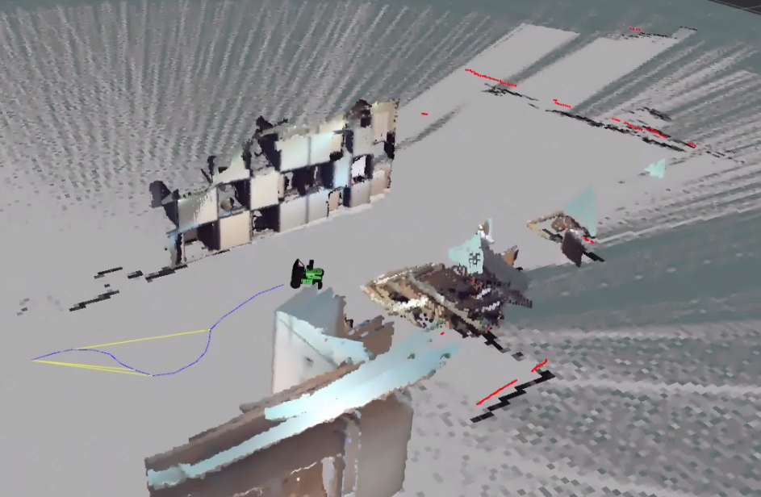

6. Open a new command-line terminal, and execute this command ‘**roslaunch hiwonder_peripherals teleop_key_control.launch robot_name:=/**’ to enable the keyboard control service.

   ```py
   roslaunch hiwonder_peripherals teleop_key_control.launch robot_name:=/
   ```

When the following prompt occurs, it means the keyboard control service is enabled successfully.

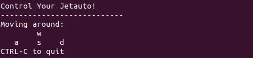

7)  Control the robot to move around to map the whole environment by pressing the corresponding keys.

| **Key** |     **Robot’s Action**      |
| :-----: | :-------------------------: |
|    W    | Go forward (Press briefly)  |
|    S    | Go backward (Press briefly) |
|    A    |   Turn left (Long press)    |
|    D    |   Turn right (Long press)   |

8. After mapping, utilize the shortcut ‘**Ctrl+C**’ to terminate each program running on different terminals.

   > [!NOTE]
   >
   > **Note: 3D mapping does not require manual saving of the map. When you use "Ctrl+C" to terminate the mapping command, the map will be automatically saved.**

   After completing the game experience, you can initiate the mobile APP service through commands or restart the robot. The mobile APP functions will be inactive if the service is not turned on. (The mobile APP service will automatically start if the robot is restarted.)

   To restart the mobile APP service, enter the command "**sudo systemctl restart start_app_node.service**" and wait for a single beep from the buzzer, indicating that the service startup is complete.

   ```py
   sudo systemctl restart start_app_node.service
   ```

### 6.1.11 App Mapping

This section will provide instructions on controlling the robot to build the map using ‘**Make A Map**’.

* **APP Installation**

The installation packages for the mobile apps 'Make A Map' and 'Map Nav' are located in the directory '**[Mapping Navigation Lesson -\> App Installation Package]()**'. Users can import these packages into their mobile phones for installation.

> [!NOTE]
>
> **Note: Only installation packages for Android systems are provided for the app.**
>
> **If you open the mapping, click on**  **desktop icon to verify the Lidar model (The default Lidar model is "G4"). If the Lidar has been changed, update the Lidar model to the corresponding one and save the changes for them to take effect.**

* **App Mapping**

**1. Enable Service**

1. Start the robot, and access the robot system desktop using NoMachine.

2. Double click  to open the command line terminal.

3. Execute the command “**sudo systemctl stop start_app_node.service**” and press Enter to disable app auto-start service.

   ```py
   sudo systemctl stop start_app_node.service
   ```

4. Open a new command-line terminal, and execute the command ‘**roslaunch hiwonder_slam slam.launch app:=true**’ to enable the mapping service.

   ```py
   roslaunch hiwonder_slam slam.launch app:=true
   ```

5)  Utilize the shortcut ‘**Ctrl+C**’ to terminate each program running on different terminals.

**2. Make A Map Connection**

1)  Connect to the WiFi generated by the robot in settings. Password is “**hiwonder**”.


2)  Open “**Make A Map**” app, and select “**http://192.168.149.1:11311/**” in “**Master URI**” field, then click “**CONNECT**”.


**3. Introduction to Make A Map**

> [!NOTE]
>
> **Note:**
>
> * **The icon enclosed in red frame in below figure serves no practical purpose. To save the map, refer to step 11.2.4.**
>
> * **If there is no map on the yellow frame, you can click-on**  **to check whether the Lidar model is correct. The default Lidar model set in the system image is G4. If the Lidar you are using other Lidar model, please change it to corresponding model.**

The app interface is divided into three zones. The live camera feed is displayed in the green frame, the map is display on the yellow frame, and the blue frame is for controlling the robot.


1)  Drag the arrow in the blue frame to control robot to move and map.

2)  The map robot makes is displayed on the yellow frame. Robot speed will be displayed on the blue frame.

**4. Save Map**

1. Return to NoMachine interface, and double-click  to open command-line terminal.

2. Open a new command-line terminal, and execute the command “**roscd hiwonder_slam/maps**” and press Enter to save the map to the corresponding folder.

   ```py
   roscd hiwonder_slam/maps
   ```

3. Input command “**rosrun map_server map_saver map:=/map -f map_01**” and press Enter to save the map.

   ```py
   rosrun map_server map_saver map:=/map -f map_01
   ```

“**map_01**” is the name of the map, and you can rename the map. If the following hints occur, the map is saved successfully.


4)  After experiencing the game, you can execute the command or restart the robot to enable app service. Please note that the app functions of the robot will be invalid if the app service is not enabled.

Execute this command “**sudo systemctl restart start_app_node.service**” to restart the app service.

```py
sudo systemctl restart start_app_node.service
```

## 6.2 Navigation

### 6.2.1 ROS Robot Autonomous Navigation

* **Description**

Autonomous navigation involves guiding a device along a predefined route from one point to another. It finds application in various domains:

Land Applications: Including autonomous vehicle navigation, vehicle tracking and monitoring, intelligent vehicle information systems, Internet of Vehicles applications, railway operation monitoring, etc.

Navigation Applications: Encompassing ocean transportation, inland waterway shipping, ship berthing and docking, etc.

Aviation Applications: Such as route navigation, airport surface monitoring, precision approach, etc.


ROS (Robot Operating System) follows the principle of leveraging existing solutions and provides a comprehensive set of navigation-related function packages. These packages offer universal implementations for robot navigation, sparing developers from dealing with complex low-level tasks like navigation algorithms and hardware interactions. Managed and maintained by professional R&D personnel, these implementations allow developers to focus on higher-level functions. To utilize the navigation function, developers simply need to configure relevant parameters for their robots in the provided configuration files. Custom requirements can also be accommodated through secondary development of existing packages, enhancing research and development efficiency and expediting product deployment.

In summary, ROS's navigation function package set offers several advantages for developers. Developed and maintained by a professional team, these packages provide stable and comprehensive functionality, allowing developers to concentrate on upper-layer functions, thus streamlining development processes.

The ROS navigation function package, ros-navigation, is a crucial component within the ROS ecosystem, serving as the foundation for many autonomous mobile robot navigation functions. Subsequent sections will delve into its operation, principle analysis, installation, and usage.

* **Navigation Instructions**

After completing the mapping process as outlined in the previous tutorial and gaining a basic understanding of the two-dimensional raster map, this section focuses on utilizing the constructed map for autonomous navigation operations. Readers will gain insight into various aspects of the navigation function, including global mapping, self-positioning, path planning, motion control, and environment perception.

The SLAM autonomous navigation process begins by manually controlling the robot to scan the SLAM environment and saving the constructed map. Then, the pre-constructed offline map is loaded, initiating the SLAM relocation mode to obtain the real-time pose of the robot. Subsequently, the target point for the robot is specified. Utilizing its Lidar and other sensors, the robot performs positioning and environmental detection, navigating to the designated location via the planned path while dynamically avoiding encountered obstacles.

Before initiating robot navigation, it's essential to construct and save a map. This process utilizes the raster map created earlier, which is loaded upon starting the navigation node.

To execute the hiwonder_navigation function package, establish a connection to the robot via SSH and execute the following instructions to modify the map file path and name in the navigation.launch file:

Create a terminal, then execute the below command:

“**cd ros_ws/src/hiwonder_navigation/launch/include**”

**“vim load_map.launch”**

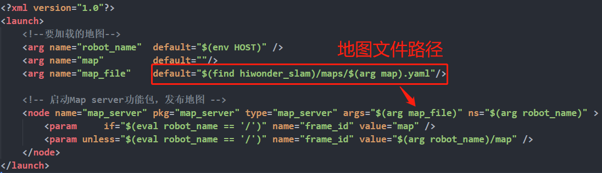

The diagram above illustrates the loading of the constructed map path into this launch file, which is then utilized by the map_server function package for reading and implementation. Following the map loading process, you can utilize the navigation.launch function package located in the upper-level directory to initiate navigation.

To launch the navigation, execute the following command: “**roslaunch hiwonder_navigation navigation.launch**”.

Upon execution, the node will start. Confirmation that the navigation function has been successfully initiated will be indicated by the appearance of the content shown in the figure below on the terminal.


Open a new command-line terminal, and execute the command ‘**roslaunch hiwonder_navigation rviz_navigation.launch**’ and hit Enter to launch the model viewing software.

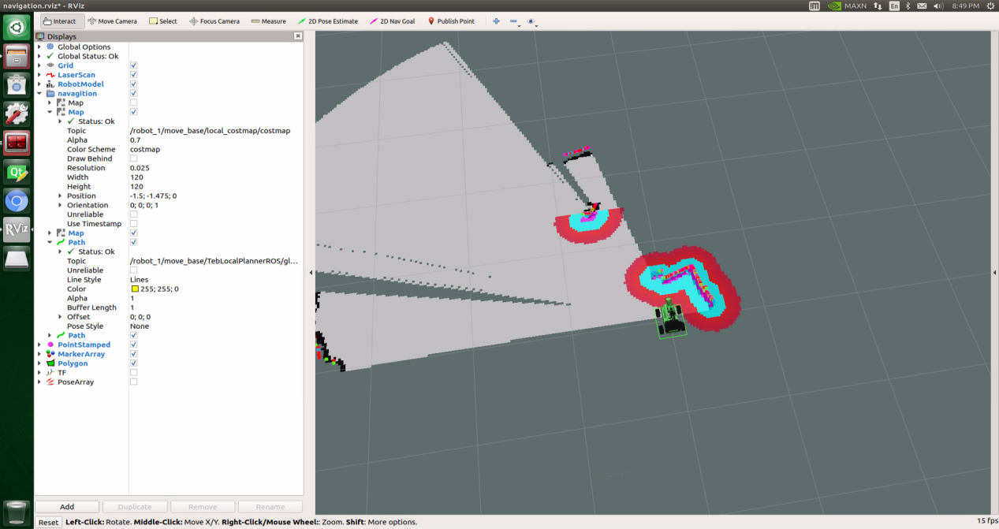

Prior to navigation, it's essential to calibrate the robot's initial position using RVIZ's "**2D Pose Estimate**" button. This calibration should be based on the robot's actual position and orientation in the scene depicted below. In the figure, note that the tail of the arrow represents the position of the ROS robot, while the direction of the arrow indicates its orientation.

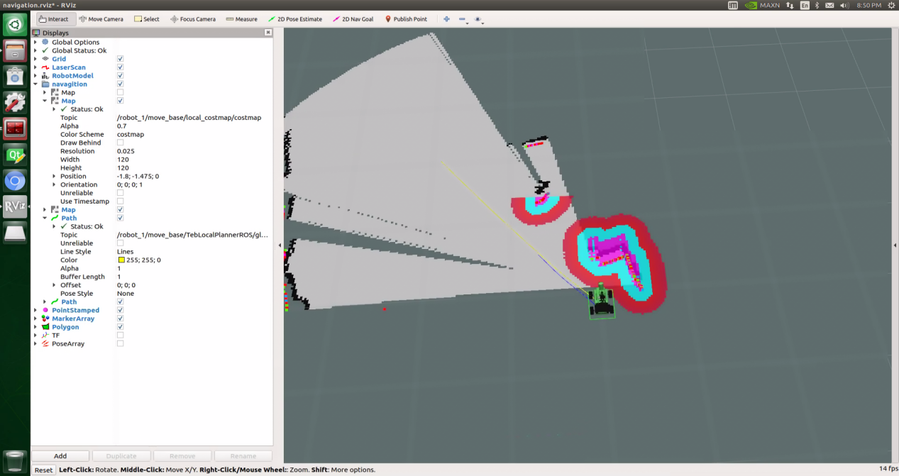

The diagram below shows the relationship between topic and node.

“**rosrun rqt_graph rqt_graph**”

After receiving the target point information from rviz, the move_base node publishes a velocity topic (/cmd_vel). Subsequently, the chassis control node processes /cmd_vel to maneuver the robot towards the target point and transmits encoded odometry and IMU data to the /robot_pose_ekf node. The tf information (/odom_combined) is fed into the /move_base node, while the lidar node provides navigation data to the move_base node via the /scan topic. Additionally, the /map_server node supplies the static map currently utilized for navigation. The radar node (/rplidarNode) and the map server (/map_server) transmit topic information to the /amc node to adjust the robot's posture in real-time. The urdf analysis node communicates the coordinate system relationships of each sensor on the chassis to the navigation node via the static /tf_static. Using this input data, the navigation node publishes the motion topic (/cmd_vel) towards the target point and collaborates with amcl for position estimation.

You can also utilize the tf tree to visualize node topic communication information by running the following command:

“**rosrun rqt_tf_tree rqt_tf_tree**”

The static tf relationship between the lidar and the chassis is established as base_footprint-\>base_link-\>base_laser_link, which is managed by the urdf parsing node/robot_state_publisher. Wheel odometry and IMU sensor data are fused by the /robot_pose_ekf node and then published. The dynamic tf relationship provided by /odom_combined is maintained as odom_combined-\>base_footprint by the robot_pose_ekf node. Additionally, the dynamic tf relationship between map and wheeled odometry (map-\>odom) is managed by the amcl mapping node.

* **Function Pack Description**

This section will provide a detailed analysis and explanation of the navigation function package, including the usage of parameters.

**1. Principle Structure Framework Explanation**

The navigation system processes navigation targets, positioning information, and map data as input and generates the actual control signals for the robot as output. Initially, the system determines the robot's current location, then identifies the target destination, and finally calculates the path and applies control strategies to commence navigation.

Navigation goals are typically specified manually or activated by specific programs, addressing the question "**Where am I going?**" Positioning information is usually obtained through SLAM or other localization algorithms, providing an answer to the question "Where am I?" Map data describes obstacles along the navigation route. Based on this information, the robot utilizes path planning algorithms to find a suitable path and control strategies to determine the linear and angular velocity for navigation.

The implementation of the ros-navigation navigation system adheres to this basic principle. It consists of a set of function packages containing various ROS packages and specific algorithm implementation nodes. These nodes can be categorized into three types: essential nodes, optional nodes, and nodes related to the robot platform, as illustrated in the figure below. The white area represents modules provided by ROS that must be used, the gray area denotes modules provided by ROS that are optional, and the blue area signifies modules that need to be implemented by the user.


The node `move_base` is essential, while the nodes amd and map_server are optional. The sensor transforms, odometry source, sensor sources, and basecontroller nodes are related to the robot platform. The core necessary node move_base organizes code through a plug-in mechanism, facilitating easy replacement and enhancement of algorithms such as global planner, local planner, global costmap, local costmap, and recovery behaviors within `move_base`.

The map server node provides maps, amcl node offers positioning information, sensor driver node provides obstacle feedback, odometer node records motion information, and chassis control node executes motion.

Each node's role is detailed as follows:

1. `move_base`: Core node responsible for receiving topic messages from other nodes, converting them into motion control commands, and issuing them.

2. `sensor sources`: Receive data from Lidar or depth camera sensors for real-time environment detection, enabling obstacle avoidance and navigation.

3. `sensor transforms`: Convert sensor coordinate system with other coordinates like chassis to ensure accurate representation of distance between robot body and obstacles.

4. `odometry source`: Records robot's movement information on the map, serving as primary data source for robot positioning.

5. `amcl`: Monte Carlo position estimation, assists in positioning robot's current pose using lidar data. Although optional, it often enhances performance.

6. `map_server`: Provides map service, enabling usage of pre-created map. Required if using map created in mapping phase.

7. `base controller`: Single topic output from move_base in navigation diagram. Controls chassis to reach specified target point upon receiving message from move_base.

8. `move_base_simple/goal`: Publishes target point in map, achievable via rviz tool or topic publication.

The above explanation outlines the navigation framework components. The navigation function package revolves around these components. Additionally, the ROS-navigation system framework is analyzed from positioning, cost map, path planning, and strategy recovery perspectives.

The navigation function package gathers robot's sensor information for real-time obstacle avoidance, necessitating two-dimensional laser or three-dimensional point cloud data. It requires the robot to publish odometry information in nav_msgs/Odometry format alongside corresponding TF transformation. Ultimately, the navigation function package outputs control instructions in geometry_msgs/Twist format, guiding robot movements.

**2. Function Pack Installation**

The navigation system processes navigation targets, positioning information, and map data as inputs, and outputs the actual control commands for the robot. Initially, the system determines the robot's current location, followed by identifying the goal the robot needs to reach.

There are two methods to install the ros-navigation function package. One option is to directly install the precompiled ros-navigation library into the system using apt-get. The command is as follows:

“**sudo apt-get install ros-\*-navigation**”

Alternatively, you can download the ros-navigation source code and manually compile and install it. If you only require the navigation function package for learning purposes, installing it in binary form is convenient and quick. However, if you intend to modify the code within ros-navigation to enhance algorithms, you'll need to install it manually from the source code. Please refer to the video tutorial for specific installation instructions.

For further details on the navigation function package, you can visit the navigation function's wiki address: http://wiki.ros.org/navigation.

> [!NOTE]
>
> Note: The navigation function package has been pre-installed on the car prior to leaving the factory.

### 6.2.2 AMCL Adaptive Monte Carlo Positioning

**AMCL Wiki：**http://wiki.ros.org/amcl

**AMCL package link：**https://github.com/ros-planning/navigation/tree/melodic-devel/amcl

* **AMCL Positioning**

Positioning involves determining the robot's position in the global map. While SLAM also includes positioning algorithm implementation, SLAM's positioning is utilized for building the global map and occurs before navigation begins. Current positioning, on the other hand, is employed during navigation, where the robot needs to move according to the designated route. Through positioning, it can be assessed whether the robot's actual trajectory aligns with expectations.

The AMCL (Adaptive Monte Carlo Localization) system, provided in the ROS navigation function package ros-navigation, facilitates robot positioning during navigation. AMCL utilizes the adaptive Monte Carlo positioning method and employs particle filters to compute the robot's position based on existing maps.

Positioning addresses the association between the robot and obstacles, as path planning fundamentally involves decision-making based on surrounding obstacles. While theoretically, completing the navigation task only requires knowledge of the robot's global positioning and real-time obstacle avoidance using laser radar and other sensors, the real-time performance and accuracy of global positioning are typically limited. Local positioning from odometry, IMUs, etc., ensures the real-time performance and accuracy of the robot's motion trajectory. The amcl node in the navigation function package provides global positioning by publishing map_odom. However, users can substitute amcl global positioning with other methods that provide map_odom, such as SLAM, UWB, QR code positioning, etc.

Global positioning and local positioning establish a dynamic set of tf coordinates map_odom base_footprint, with static tf coordinates between various sensors in the robot provided through the robot URDF type. This TF relationship resolves the association problem between the robot and obstacles. For instance, if the lidar detects an obstacle 3m ahead, the tf coordinates between the lidar and the robot chassis, base_link to laser_link, are utilized. Through standard transformation, the relationship between the obstacle and the robot chassis can be determined.

* **Particle Filter**

The Monte Carlo positioning process simulates particle updates for a one-dimensional robot. Initially, a group of particles is randomly generated, with each particle representing a potential position, direction, or state variable that requires estimation. Each particle is assigned a weight indicating its similarity to the actual system state. Next, the state of each particle at the next time step is predicted, and particles are moved based on the anticipated behavior of the real system. The weights of the particles are then updated based on measurements. Particles that closely match the measured value receive higher weights and are resampled, while highly unlikely particles are discarded and replaced with more probable ones. Finally, the weighted average and covariance of the particle set are calculated to derive the state estimate.


Monte Carlo methods generally follow a specific pattern:

1.  Define possible input fields.

2.  Randomly generate inputs from a probability distribution over the domain.

3.  Perform deterministic calculations on inputs.

4.  Summarize results.

Two important considerations are:

1.  If the points are not uniformly distributed, the approximation effect will be poor.

2.  This process requires many points. The approximation is usually poor if only a few points are randomly placed throughout the square. On average, the accuracy of the approximation improves as more points are placed.

The Monte Carlo particle filter algorithm finds applications in various fields, including physical science, engineering, climatology, and computational biology.

* **Adaptive Monte Carlo Positioning**

AMCL can be viewed as an enhanced iteration of the Monte Carlo positioning algorithm, designed to boost real-time performance by employing a reduced number of samples compared to the traditional method, thereby minimizing execution time. It implements an adaptive or KLD sampling Monte Carlo localization method, utilizing particle filtering to track a robot's pose against an existing map.

The Adaptive Monte Carlo positioning nodes primarily utilize laser scanning and lidar maps to exchange messages and perform pose estimation calculations. The implementation process entails initializing the adaptive Monte Carlo positioning algorithm's particle filter for each parameter provided by the ROS system during initialization. In instances where the initial pose is not specified, the algorithm assumes that the robot commences its journey from the origin of the coordinate system, resulting in a more intricate calculation process.

Hence, it is advisable to set the initial pose using the "2D Pose Estimate" button in rviz. For further information on Adaptive Monte Carlo positioning, you can also refer to the wiki address link: https://github.com/ros-planning/navigation

* **Cost Map**

Regardless of whether it's a 2D or 3D SLAM map generated by LiDAR or a depth camera, it cannot be directly employed for actual navigation. Instead, it needs to be converted into a costmap. In ROS, the costmap typically adopts a grid format, where each grid cell in the raster map occupies 1 byte (8 bits). This allows for data storage ranging from 0 to 255, representing different cell costs.

The costmap only requires consideration of three scenarios: occupied (barrier), free area (barrier-free), and unknown space.

Before delving into costmap_2d, it's important to introduce the Bresenham algorithm. This algorithm is utilized to draw a straight line between two points by calculating the closest point of a line segment on an n-dimensional raster. It relies solely on relatively fast integer operations such as addition, subtraction, and bit shifting, making it a fundamental algorithm in computer graphics.


To construct a set of virtual grid lines, we begin by passing them through the pixel centers of each row and column. The intersection points of these straight lines with each vertical grid line are calculated sequentially, starting from the line's origin and moving towards its endpoint. Subsequently, the pixel closest to each intersection point within the pixel column is determined based on the sign of the error term.

The core concept of the algorithm relies on the assumption that k=dy/dx, where k represents the slope. Since the straight line originates from the center of a pixel, the initial error term d is set to d0＝0. With each increment in the subscript X, d increases by the slope value k, i.e., d=d+k. When d≥1, 1 is subtracted from it to ensure that d remains between 0 and 1. If d≥0.5, the pixel closest to the upper-right of the current pixel is considered (i.e., (x+1,y+1)); otherwise, it's closer to the pixel on the right (i.e.,(x+1,y)). For ease of calculation, let e=d−0.5; initially, e is set to -0.5, and it increments by k. When e≥0, the upper-right pixel of the current pixel (xi, yi) is selected, and when e\<0, the pixel closer to the right (x+1,y) is chosen instead. Integers are preferred to avoid division. Since the algorithm only uses the sign of the error term, it can be replaced as follows: e1 = 2\*e\*dx.


The Costmap2D class is responsible for managing the cost value of each raster. Meanwhile, the Layer class serves as a virtual base class, standardizing the interfaces of costmap layers for each plugin. Key interface functions include:

The initialize function, which invokes the onInitialize function to initialize each costmap layer individually.

The matchSize function, found in the StaticLayer and ObstacleLayer classes, ensures consistency across costmap layers by calling the matchSize function of the CostmapLayer class. This initialization process sets the size, resolution, origin, and default cost value of each layer. In the inflationLayer class, a cost table is computed based on the expansion radius, enabling subsequent cost value queries based on distance. Additionally, the seen\_ array is defined to mark traversed rasters. For the VoxelLayer class, initialization involves setting the size of the voxel grid.

The updateBounds function adjusts the size range of the current costmap layer requiring updates. For the StaticLayer class, the update range is determined by the size of the static map (typically used in global costmaps). Conversely, the ObstacleLayer class determines obstacle boundaries by traversing sensor data in clearing_observations.

The initialize and matchSize functions are executed only once each, while updateBounds and updateCosts are performed periodically, their frequency determined by map_update_frequency.

The CostmapLayer class inherits from both the Layer class and the Costmap2D class, providing various methods for updating cost values. The StaticLayer and ObstacleLayer classes, needing to retain cost values of instantiated layers, also inherit from CostmapLayer. The StaticLayer updates its costmap using static raster map data, whereas the ObstacleLayer employs sensor data for updates. In contrast, the VoxelLayer class considers z-axis data more extensively, particularly in obstacle clearance. This distinction primarily affects obstacle removal, with two-dimensional clearance in one case and three-dimensional clearance in the other.


Costmap measurement barriers offer remarkable flexibility. You can tailor a specific layer to your requirements, thereby managing pertinent barrier information effectively. For instance, if your robot is equipped solely with LiDAR, you'll need to establish an Obstacles layer to handle obstacle data scanned by the LiDAR. In case ultrasonic sensors are integrated into the robot, creating a new Sonar layer becomes necessary to manage obstacle information from the sonic sensor. Each layer can define its own rules for obstacle updates, encompassing tasks such as obstacle addition, deletion, and confidence level updates. This approach significantly enhances the scalability of the navigation system.

For additional information, please visit:

ROS navigation wiki：<http://wiki.ros.org/navigation>

ROS move_base wiki：<http://wiki.ros.org/move_base>

* **Global Path Planning**

Preface: Based on the mobile robot's perception of the environment, the characteristics of the environment, and the algorithms employed, path planning can be categorized into environment-based, map knowledge-based, and completeness-based path planning algorithms.


Commonly used path planning algorithms in robot autonomous navigation encompass Diikstra, A\*, D\*, PRM, RRT, genetic algorithms, ant colony algorithms, fuzzy algorithms, and others.

Dijkstra and A\* are graph-based path search algorithms commonly utilized in robotic applications. The navigation function package integrates navfn, global planner, and carrot planner as global route planning plug-ins. Users have the option to select one of these plug-ins to load into move_base for utilization. Alternatively, they can opt for a third-party global path planning plug-in, such as SBPL_Lattice_Planner or srl_global_planner, or develop a custom global path planning plug-in adhering to the interface specification of nav_core.


Mobile robot navigation facilitates reaching a target point through path planning. The navigation planning layer comprises several components:

1)  **Global path planning layer**: This layer generates a global weight map based on the provided goal and accepts weight map information. It then plans a global path from the starting point to the target location, serving as a reference for local path planning.

2)  **Local path planning layer**: This component, constituting the local planning aspect of the navigation system, operates on the local weight map information derived from the weight map. It conducts local path planning considering nearby obstacle information.

3)  **Behavior execution layer**: This layer integrates instructions and path planning data from the higher layers to determine the current behavior of the mobile robot.

Path planning algorithms for mobile robots are a crucial area of research, significantly impacting the efficiency of robotic operations.

**1. Dijkstra Algorithm**

Dijkstra's algorithm is a classic shortest path algorithm known for its efficiency in finding the shortest path from a single source to all other vertices in a graph. It operates by expanding outward in layers from the starting point, employing a breadth-first search approach while considering edge weights. This makes it one of the most widely used algorithms in global path planning.

Here is a diagram illustrating the process of Dijkstra's algorithm:

1. Initially, we set the distance from the starting point (start) to itself as 0, and all other points' distances are initialized to infinity.

   

2. During the first iteration, we identify the point (let's call it Point 1) with the smallest distance value, mark it as processed, and update the distances of all adjacent points (previously unprocessed) connected to Point 1. For instance, if Point 1 is connected to Points 2, 3, and 4, we update their distances as follows: dis\[2\]=2, dis\[3\]=4, and dis\[4\]=7.

   

3. In the subsequent iterations, we repeat the process: find the point with the smallest distance value (e.g., Point 2 in the second iteration), mark it as processed, and update the distances of its adjacent points (if necessary). For example, if Point 2 is connected to Points 3 and 5, we update their distances as dis\[3\]=3 and dis\[5\]=4.

   

4. This procedure continues until all points have been processed. At each iteration, we select the unprocessed point with the smallest distance and update distances of its adjacent points accordingly.

   

5. Once all points have been processed, the algorithm terminates, and the shortest path distances from the starting point to all other points are determined.

   To access the introduction and usage details of the Dijkstra algorithm, please log in to the wiki using the following link:

<http://wiki.ros.org/navfn>

**2. A Star Algorithm**

A-star is an enhancement of Dijkstra's algorithm tailored for single destination optimization. While Dijkstra's algorithm determines paths to all locations, A-star focuses on finding the path to a specific location or the nearest location among several options. It prioritizes paths that seem to be closer to the goal.

The formula for the A-star algorithm is: *F*=*G*+*H*, where *G* represents the movement cost from the starting point to the designated square, and *H* denotes the estimated cost from the designated square to the endpoint. There are two methods for calculating the *H* value:

1.  Calculate the distance of horizontal and vertical movement; diagonal calculation is not applicable (Manhattan distance).


2.  Calculate the distance of horizontal and vertical movement; diagonal calculation is applicable (diagonal distance).


For an introduction to and usage of the A\* algorithm, please consult the video tutorial or visit the following links:

ROS Wiki: [http://wiki.ros.org/global planner]()

Red Blob Games website: <https://www.redblobgames.com/pathfinding/a-star/introduction.html#graphs>

### 6.2.3 Local Path Planning

Global path planning begins with inputting the starting point and the target point, utilizing obstacle information from the global map to devise a path between them. This path consists of discrete points and solely considers static obstacles. Consequently, while the global path serves as a macro reference for navigation, it cannot be directly utilized for navigation control.

* **DWA Algorithm**

**1. Description**

The Dynamic Window Approach (DWA), a classic algorithm for path planning and motion control of mobile robots, ensures safe navigation on a known map. By exploring the speed and angular velocity state space, DWA identifies the optimal combination for safe navigation. Below, you'll find a basic description along with some key formulas of the DWA algorithm.


The core concept of the DWA algorithm involves the robot assessing its current state and sensor data to generate a series of potential motion trajectories (referred to as dynamic windows) in the speed and angular velocity state space. These trajectories are then evaluated based on criteria such as obstacle avoidance, maximizing forward speed, and minimizing angular velocity to select the optimal trajectory. Through iterative iterations of this process, the robot dynamically plans its trajectory in real-time to adapt to changing environments and obstacles.

**2. Formula**

1.  Robot status: current position (x, y) and orientation (θ)

2.  Motion control parameters: linear velocity (V) and angular velocity (ω).

3.  Range of velocity and angular velocity sampling: minimum (Vmin, ωmin) and maximum (Vmax, ωmax).

4.  Time step: Δt

The formula is as below:

1.  **Velocity Sampling**: In the DWA algorithm, the initial step involves sampling the state space of velocity and angular velocity to create a set of potential velocity-angular velocity pairs, known as dynamic windows.

<p style="text-align:center">V<sub>samples</sub> = [v<sub>min</sub>, v<sub>max</sub>]</p>

<p style="text-align:center">ω<sub>samples</sub> = [-ω<sub>max</sub>, ω<sub>max</sub>]</p>

(V<sub>samples</sub>) denotes the speed sampling range, while (ω<sub>samples</sub>) indicates the angular speed sampling range.

2. **Motion Simulation:** The DWA algorithm conducts a motion simulation for each speed-angular velocity pair, determining the trajectory of the robot based on these combinations in its current state.

   <p style="text-align:center">x(t+1) = x(t) + v * cos(θ(t)) *Δt</p>

<p style="text-align:center">y(t+1) = y(t) + v * sin(θ(t)) *Δt</p>

<p style="text-align:center">θ(t+1) = θ(t) + ω * Δt</p>

Here, x(t) and y(t) denote the robot's position, θ(t) represents its orientation, v stands for linear velocity, ω for angular velocity, and Δt represents the time step.

3. **Trajectory Evaluation:** The DWA algorithm assesses each generated trajectory using evaluation functions, including obstacle avoidance, maximum speed, and minimum angular velocity.

   **Obstacle Avoidance Evaluation:** Detects if the trajectory intersects with obstacles.

   **Maximum Speed Evaluation:** Verifies if the maximum linear speed on the trajectory falls within the permissible range.

   **Minimum Angular Velocity Evaluation:** Ensures that the minimum angular velocity on the trajectory remains within the allowed range.

   These evaluation functions can be defined and adjusted as per task requirements.

4. **Select optimal trajectory**: The DWA algorithm chooses the trajectory with the highest evaluation score as the next move for the robot.


**3. Expansion**

Extensions and resources for learning about the DWA algorithm:

The DWA algorithm serves as a fundamental method in mobile robotics, with numerous extended and enhanced versions designed to boost performance and efficiency in path planning. Some notable variations include:

1\. DWA Algorithm Extension: <https://arxiv.org/abs/1703.08862>

2\. Enhanced DWA (e-DWA) Algorithm: <https://arxiv.org/abs/1612.07470>)

3\. DP-DWA Algorithm (DP-based Dynamic Window Approach): <https://arxiv.org/abs/1909.05305>

4\. ROS Wiki: http://wiki.ros.org/dwa_local_planner

These resources provide in-depth insights and further exploration into the DWA algorithm and its various extensions.

* **TEB Algorithm**

**1. Description**

The TEB (Timed Elastic Band) algorithm is utilized for both path planning and motion planning, particularly in domains like robotics and autonomous vehicles. At its core, the TEB algorithm treats path planning as an optimization challenge, aiming to generate the best trajectory within a specified timeframe while accommodating dynamic constraints and obstacle avoidance needs for the robot or vehicle. Key characteristics of the TEB algorithm encompass:

1.  **Time Layered Representation:** The TEB algorithm employs time layering, dividing the trajectory into discrete time steps, each corresponding to a position of the robot or vehicle. This aids in setting timing constraints and preventing collisions.

2.  **Trajectory Parameterization:** TEB parameterizes the trajectory into displacements and velocities, facilitating optimization. Each time step is associated with displacement and velocity parameters.

3.  **Constrained Optimization:** TEB considers dynamic constraints, obstacle avoidance, and trajectory smoothness, integrating them into the objective function of the optimization problem.

4.  **Optimization Solution:** TEB utilizes techniques like linear quadratic programming (QP) or nonlinear programming (NLP) to determine optimal trajectory parameters that fulfill the constraints.


**2. Formula**

The figure below illustrates the optimization objective function in the TEB algorithm:


In the following expression:

J(x) denotes the objective function, where x represents the trajectory parameter.

wsmooth and wobstacle represent weights assigned to smoothness and obstacle avoidance, respectively.

H signifies the smoothness penalty matrix.

f(xi, oj) represents the obstacle cost function between trajectory point xi and obstacle oj.

1.  Status Definition:

Firstly, we define the state of the robot (or vehicle) in the path planning problem as follows:

Position: P = \[X, Y\], indicating the coordinates of the robot on the two-dimensional plane.

Velocity: V = \[Vx, Vy\], representing the robot's velocity along the X and Y axes.

Time: t, denoting the current time.

Control Input: u = \[ux, uy\], representing the control input of the robot, which can be speed or acceleration.

Robot Trajectory: x(t) = \[p(t), v(t)\], indicating the state of the robot at time t.

2.  Target Function:

The essence of the TEB algorithm lies in solving an optimization problem. The objective is to minimize a composite function comprising various components:


Jsmooth(x): Smoothness objective function, ensuring trajectory smoothness.

Jobstacle(x): Obstacle avoidance objective function, preventing collisions with obstacles.

Jdynamic(x): Dynamic objective function, ensuring compliance with the robot's dynamic constraints.

3.  Smoothness objective function Jsmooth(x):

Smoothness objective functions typically involve the curvature of trajectories to ensure the generated trajectories are smooth. It can be represented as:


Where k(t) is the curvature.

4.  Obstacle avoidance objective function Jobstacle(x):

The obstacle avoidance objective function calculates the distance between trajectory points and obstacles. It penalizes trajectory points that are in close proximity to obstacles. The specific obstacle cost function, denoted as f(x,o), can be adjusted according to specific requirements or needs.


5. Dynamic objective function Jdynamic(x):

The dynamics objective function ensures that the generated trajectory adheres to the robot's dynamic constraints, which are determined by its kinematics and dynamics model. This typically includes limitations on velocity and acceleration.

6. Optimization:

In the end, the Trajectory Optimization with Ellipsoidal Bounds (TEB) algorithm addresses the stated objective function by framing it as a constrained optimization problem. This problem incorporates optimization variables for trajectory parameters, time allocation, and control inputs. Typically, this optimization problem falls under the category of nonlinear programming (NLP) problems.

* **Expansion**


Additional resources and learning materials for the TEB algorithm:

The TEB algorithm is a significant technology within the realm of path planning, boasting numerous extended and enhanced versions. Below are some learning links and extension topics aimed at facilitating a more comprehensive understanding of the TEB algorithm and its associated concepts:

1.  Original TEB Paper: "**Trajectory modification considering dynamic constraints of autonomous robots**" by M. Rösmann et al.

2.  TEB implementation in ROS: The TEB algorithm is commonly implemented as a ROS package (Robot Operating System Package), making it readily available for robot path planning tasks.

ROS TEB Local Planner Package:<https://github.com/rst-tu-dortmund/teb_local_planner>

Wiki website:<http://wiki.ros.org/teb_local_planner>

These links provide valuable resources for users seeking to explore the TEB algorithm and its associated topics in greater detail.

### 6.2.4 Point-to-Point and Multi-Point Navigation and Obstacle Avoidance

Before initiating navigation, it's essential to enable the robot to map. You can find detailed guidance on this process in ‘**[6. Mapping Navigation Lesson/6.1 Mapping]()**’.

* **Point-to-Point Navigation**

The navigation system offers a fundamental interface for autonomous robot navigation, enabling point-to-point navigation. However, in practical scenarios, robots frequently encounter complex tasks that consist of basic tasks. These tasks are typically combined using a state machine approach. This chapter focuses on implementing the multi-point circular navigation function for the robot. This functionality allows the vehicle to move to a selected target endpoint.

**1. Instruction**

1. Start the robot, and access the robot system using NoMachine.

2. Double-click  to open the command-line terminal.

3. Execute the command ‘**sudo systemctl stop start_app_node.service**’, and hit Enter to terminate the app service.

   ```py
   sudo systemctl stop start_app_node.service
   ```

4. Open a new command-line terminal, and run the command ‘**roslaunch hiownder_navigation navigation.launch map:=map_01**’ to initiate the navigation service.

   ```py
   roslaunch hiownder_navigation navigation.launch map:=map_01
   ```

The parameter "**map_01**" at the end of the command denotes the name of the map. Users have the flexibility to customize this parameter according to their specific requirements. The storage path for the map is located at "**/home/ros_ws/src/hiwonder_slam/maps**".

5. Open a new terminal, and execute the following command ‘**roslaunch hiwonder_navigation rviz_navigation.launch**’ to open the model viewing software.

   ```py
   roslaunch hiwonder_navigation rviz_navigation.launch
   ```

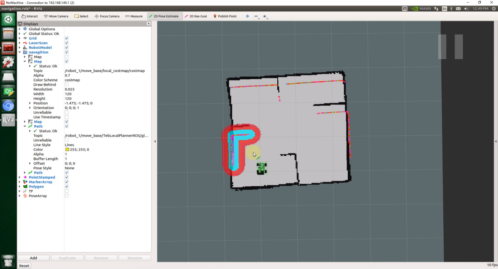

In the menu bar, the "**2D Pose Estimate**" option is utilized to define the initial position of the JetRover robot. Meanwhile, "**2D Nav Goal**" is employed to establish a single target point for the robot. Additionally, "Publish Point" is utilized to designate multiple target points for the robot's navigation.


Click  to access the map interface. Next, select a point on the map as the target destination by clicking once with the mouse. Upon completion of the selection, the robot will autonomously generate a route and navigate towards the target.

Once the target destination is established, the map will display two paths. The line consisting of blue squares represents the direct path between the robot and the target point, while the dark blue line illustrates the planned route the robot will take.

In the event of encountering an obstacle, the vehicle will dynamically adjust its position and driving route to circumvent obstacles, ensuring continuous progress towards the target destination.

**2. Feature Pack Description**

The feature pack of Lidar Point-to-Point navigation is saved in this path, “**hiwonder_navigation/launch/navigation.launch**”.

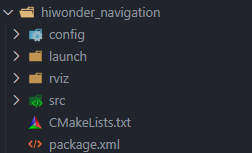

It includes folders (config, launch, rviz, src) and files (CMakeLists.txt, package.xml).

config: Holds navigation-related configuration files for invoking navigation algorithms, such as global and local path planners, and robot navigation settings (move_base), depicted in the figure below.


**launch**: Stores startup files for navigation tasks, encompassing positioning, map loading, navigation methods, and simulation model launch files, demonstrated in the figure following:


Contains parameter loading for the rviz visualization tool, comprising robot configuration files and navigation configuration files for various navigation algorithms, as shown in the figure below.


src: Houses custom source files invoked by the navigation algorithm (e.g., multi-point navigation target point release), illustrated in the figure following:


**CMakeLists.txt: ROS package configuration file.**

**package.xml: Configuration information file for the current package functionality.**

* **Multi-Point Navigation**

**1. Instruction**

> [!NOTE]
>
> **Note: Input commands are case-sensitive, and keywords can be completed using the 'Tab' key for convenience.**

1. Start the robot, and access the robot system using NoMachine.

2. Double-click  to open the command-line terminal.

3. Execute the command ‘**sudo systemctl stop start_app_node.service**’, and press Enter to terminate the app service.

   ```py
   sudo systemctl stop start_app_node.service
   ```

4. Open a new command-line terminal, and execute the command ‘**roslaunch hiwonder_navigation navigation.launch map:=map_01**’ and hit Enter to enable the navigation service

   ```py
   roslaunch hiwonder_navigation navigation.launch map:=map_01
   ```

The parameter "**map_01**" at the end of the command denotes the name of the map. Users have the flexibility to customize this parameter according to their specific requirements. The storage path for the map is located at "**/home/ros_ws/src/hiwonder_slam/maps**".

5. Open a new command-line terminal, and run the command ‘**roslaunch hiwonder_navigation rviz_navigation.launch**’ to start the model viewing software.

   ```py
   roslaunch hiwonder_navigation rviz_navigation.launch
   ```

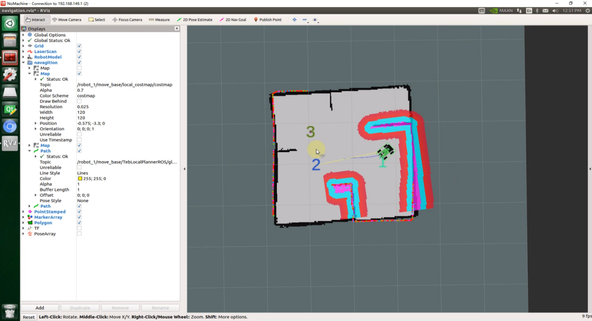

6. Open a new command-line terminal, and execute the command ‘**roslaunch hiwonder_navigation publish_point.launch**’, then hit Enter to enable multi-point navigation.

   ```py
   roslaunch hiwonder_navigation publish_point.launch
   ```

7)  In the menu bar, the "**2D Pose Estimate**" option is utilized to define the initial position of the JetRover robot. Meanwhile, "**2D Nav Goal**" is employed to establish a single target point for the robot. Additionally, "**Publish Point**" is utilized to designate multiple target points for the robot's navigation.


8)  Click on , then randomly select a point by clicking the left mouse button to set it as the target point. Repeat this process to set the remaining target points in the same manner.

> [!NOTE]
>
> **Note: Before setting a target point, ensure to click "Publish Point" once.**

9)  The last set target point will be identified with a purple dot. By default, the map displays a maximum of 1 purple marker. You can adjust the number of displayed markers by modifying the 'History Length' under the 'PointStamped' section in the left-side properties panel.


10) Once the target points are set, the robot will automatically generate a travel route based on the sequence of the set points and move to each target point in order. To cancel multi-point navigation, simply select the command bar window that initiated multi-point navigation, press "**Ctrl+C**", and then reopen it to restart multi-point navigation.

11) The map will show two paths:A line made of blue squares represents the direct path between the robot and the target point. The dark blue line depicts the planned route of the robot.

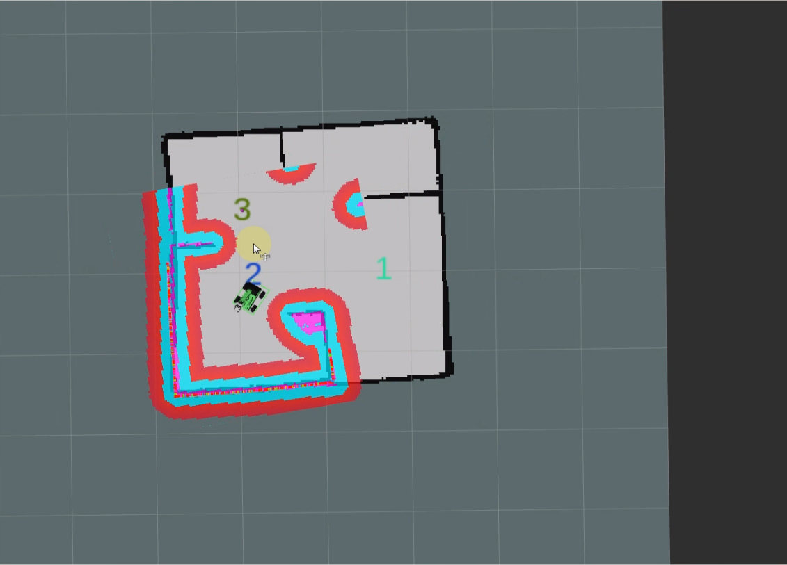

> [!NOTE]
>
> **Note: To interrupt navigation, utilize the "2D Nav_Goal" tool to designate the current position of the robot as the target point. In case the robot is displaced from its original position due to external factors such as being lifted off the ground or subjected to external forces, both the robot's initial position and target point will require resetting.**

**2. Feature Pack Description**

Please refer to the section ‘[**6.2.4 Point-to-Point and Multi-Point Navigation and Obstacle Avoidance->2. Feature Pack Description**]()’.

### 6.2.5 RTAB-VSLAM 3D Mapping & Navigation

* **Algorithm Introduction & Working Principle**

For an introduction to and the principles behind the RTAB-VSLAM algorithm, please consult "**[6. ROS1-Mapping Navigation Lesson\ 6.1 Mapping\ 6.1.10 (RTAB-VSLAM 3D Mapping & Navigation]()**)" for learning purposes.

* **Instruction**

1. Start the robot, and access the robot system using NoMachine.

2. Double-click  to open the command-line terminal.

3. Execute the command ‘**sudo systemctl stop start_app_node.service**’, and press Enter to terminate the app service.

   ```py
   sudo systemctl stop start_app_node.service
   ```

4. Open a new command-line terminal, and execute the command ‘**roslaunch hiwonder_navigation rtabmap_navigation.launch**’ and hit Enter to enable the navigation service. If there is no error reported, the mapping service is enabled successfully.

   ```py
   roslaunch hiwonder_navigation rtabmap_navigation.launch
   ```

5. Open a new command-line terminal, and execute the command ‘**roslaunch hiwonder_navigation rviz_rtabmap_navigation.launch**’ and hit Enter to open the model viewing software.

   ```py
   roslaunch hiwonder_navigation rviz_rtabmap_navigation.launch
   ```

You can observe point cloud data related to the depth camera while navigating, as demonstrated below:

6. Open a new command-line terminal, and run the command ‘**roslaunch hiwonder_navigation publish_point.launch**’ to enable the multi-point navigation.

   ```py
   roslaunch hiwonder_navigation publish_point.launch
   ```

   Open the "**Rtabmap_cloud**" tab and update the "**Download namespace**" field to "**robot_1/rtabmap**".


7)  Tick ‘**Download map**’ to load the map.


2D Nav Goal和Publish Point。In the menu bar, there are two tools available: "**2D Nav Goal**" and "**Publish Point**."


"**2D Nav Goal**" is used to set a single target point for the robot. "**Publish Point**" is used to set multiple target points for the robot. To cancel multi-point navigation, simply select the command bar window that initiated multi-point navigation, press "**Ctrl+C**," and then reopen it to restart multi-point navigation.

To set a target point using the "**2D Nav Goal**" tool, follow these steps:

Click on the "**2D Nav Goal**" tool in the software menu bar.

Select a point on the map interface as the target point by clicking once with the mouse on that point.

After the selection is completed, the robot will automatically generate a route and move to the target point.


Once the target point is set, the map will display two paths:

The red line represents the straight path between the robot and the target point.

The blue line indicates the planned path of the robot.


After completing the game experience, you can start the mobile app service through commands or restart the robot. Please note that if the mobile app service is not turned on, the relevant functions of the app will be disabled. (If the robot restarts, the mobile app service will automatically start.)

To restart the mobile app service, enter the command "**sudo systemctl restart start_app_node.service**" and wait for the buzzer to beep once to confirm that the service startup is complete.

```py
sudo systemctl restart start_app_node.service
```

### 6.2.6 App Navigation

This file deals with how to use “**Map Nav**” app to control JetAcker to navigate through the environment.

* **APP Installation**

The app installation packs can be found in ‘11 Mapping Navigation Lesson’. You can transfer them to your phone to install.

> [!NOTE]
>
> **Note:**
>
> * **The app is only applicable to Android system.**
>
> * **If there is no map on the yellow frame, you can click-on**  **to check whether the Lidar model is correct. The default Lidar model set in the system image is G4. If the Lidar you are using other Lidar model, please change it to corresponding model.**

* **App Navigation**

**1. Enable Service**

1. Start the robot and access the robot system desktop using NoMachine.

2. Click-on  to open the command-line terminal.

3. Execute the command ‘**sudo systemctl stop start_app_node.service**’ and hit Enter to terminate the app auto-start service. The app service includes handle, depth camera and chassis control.

   ```py
   sudo systemctl stop start_app_node.service
   ```

4. Open a new command, and execute this command “**roslaunch hiwonder_navigation navigation.launch map:=map_01 app:=true**” to enable navigation service.

   ```py
   roslaunch hiwonder_navigation navigation.launch map:=map_01 app:=true
   ```

5)  If you want to stop running the current program, press “**Ctrl+C**” on the terminal.

After experiencing the game, you can execute the command or restart the robot to enable app service. Please note that the app functions of the robot will be invalid if the app service is not enabled.

Execute this command “**sudo systemctl restart start_app_node.service**” to restart the app service.

```py
sudo systemctl restart start_app_node.service
```

**2. Connect to Map Nav**

1)  Connect to the WiFi generated by the robot in settings. Password is “**hiwonder**”.

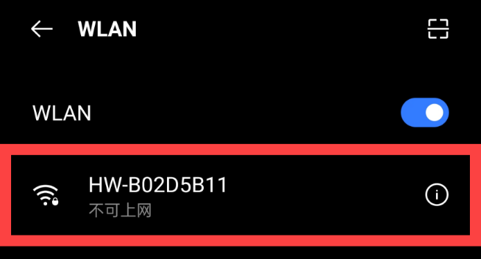

2)  Open “**Map Nav**” app, and input “**http://192.168.149.1:11311/**” in “**Master URI**” bar, then click “**CONNECT**”.


**3. Introduction to Map Nav**

> [!NOTE]
>
> **Note: the icon enclosed in blue frame in below figure serves no practical purpose. Map will be loaded automatically.**

The interface is divided into four areas. The camera returned image is displayed in the yellow section, and the map is display in the green section. In red area, you can control the robot to move. Combine the option of “**Set Pose**” and “**Set Goal**” and green section to set the initial position and destination of the robot.


1)  Select “**Set Pose**”, then press one point on the map to set it as the initial position of robot.

2)  Drag arrow in red section to control JetRover to move so as to calibrate the position.

3)  Select “**Set Goal**”, then press one point on the map to set it as the destination.

4)  After initial position and destination are set, the path between these two points is generated automatically. Then robot will move from the initial position to the set destination.