# 7. Robot Arm Control Course

This document will use the example of JetRover with Mecanum wheel chassis to explain the basic structure and motion control of this robotic arm. The control methods for robotic arms with different types of chassis within the same series are similar.

<p id="anchor_7_1"></p>

## 7.1 Basic Control

### 7.1.1 Get to Know Robotic Arm

JetRover is equipped with a 6DOF robotic arm, composed of intelligent bus servos and metal connection components, which can reach any position in feasible space. Six degrees of freedom consist of X-axis movement, Y-axis movement, Z-axis movement, X-axis rotation, Y-axis rotation, and Z-axis rotation, completing actions such as extension, rotation, and lifting. Additionally, it is equipped with a Dabai DCW depth camera, enabling different functions such as hand tracking, color recognition and sorting, color tracking, line following and obstacle avoidance, waste sorting, navigation and transportation.


The below table illustrates the relevant parameters of the robotic arm:

| Name | Instruction | Name | Instruction |
|:--:|:--:|:--:|:--:|
| Servo Composition | 35kg*3 + 20kg*2 + 12kg*1 high-voltage bus servo | Servo Accuracy | HTD-35H bus servos (3 units), HTS-20H bus servo, and HTS-21H bus servo have a precision of 0.2°; HX-12H bus servo has a precision of 0.3° |
| Material | Anodized aluminium alloy | Control Method | UART serial port command |
| Degree of Freedom | 6DOF + gripper | Communication Baud Rate | 115200 |
| Load | 500g (gripping and transporting weight) | Servo Memory | User settings Power-off protection |
| Wingspan | 410mm | Read-back Function | Support angle value read-back |
| Effective Gripping Range | Radius≤30cm | Servo Protection | Locked protection/ over-heat protection |
| Camera Name | Dabai DCW depth camera | Parameter feedback | Temperature, voltage, position |
| Pixel | 200W | System | Support windows, Linux and Openwrt |
| Resolution | 1920×1080 | Frame Rate | 60FPS |
| Connection | USB driver-free | Focusing Method | Auto-focusing |

:::{Note}
* Prior to shipment, our company has completed the debugging of the robotic arm, eliminating the need for users to adjust.
* This instruction facilitates users in restoring the robotic arm's status after make modification.
* The robotic arm is equipped with 6 joints, where the first joint controls the overall horizontal rotation of the robotic arm. During adjustment, it should be ensured that the robotic arm faces forward in relation to the vehicle, avoiding left or right deviation as much as possible.
* Whether there is deviation in the robotic arm servo can be referenced from the side view and top view diagrams provided in this document.

:::

After understanding the structure of the robotic arm, the following content pertains to the Dabai DCW depth camera.

Dabai DCW depth camera is designed for service robot scenarios. Based on self-developed ASIC chips, Orbbec developed the Dabai DCW depth camera, a high-performance binocular structured light camera. The depth image resolution of up to 1920×1080@5/10fps, with an average power consumption of less than 1.2W. With just a USB 2.0 interface, the terminal can obtain high-precision 3D depth information for backend utilization, empowering robots to achieve functions such as perception, obstacle avoidance, and navigation.


Its specification parameters are illustrated below:


The specification of the depth camera:

| Parameter | Description |
|:--:|:--:|
| Dimension | 89.82 ×25.10 ×25.10 mm |
| Working range | 0.2m - 2.5m |
| Fan | Do not support |
| Baseline | 40mm |
| Power consumption | Average power consumption <2.3W; The maximum power is less than 5.0W (During operation, the duration should be equal to or less than 3ms every 33ms) |
| Depth FOV | When the camera D2C is not in use, it is H79° V62° D91°±3°. When the camera D2C is in use, it is H79° V55° D88.5°±3°. |
| Infrared FOV | H79° V62° D91°±3° |
| Color FOV | 16:9： H86° V55° D93.5°±3°; 4:3： H64° V55° |
| Relative accuracy | 1.0%(center 81% area) @1000mm; 1.1%(center 81% area) @2000mm |
| Depth resolution @ frame rate | 640*400@5/10/15/30fps; 320*200@5/10/15/30fps |
| Operating system | Support Android and Windows7/10 |
| Data transmission | USB2.0 Type-C |
| Power Port | Type-C |
| Application scenario | Indoor |
| Safety | Class1 laser |
| Operating temperature | 10℃ ~ 40℃ |

:::{Note}
There may be individual differences in 3D camera products. The product specifications provided are theoretical values and are for reference only. Please rely on actual performance for accuracy.
:::

### 7.1.2 HTD-35H Serial Bus Servo Instructions

HTD-35H bus servo is controlled by serial port commands. The serial port baud rate is 115200. According to the provided communication protocol, user can send corresponding commands to servo to control servo rotation or read servo information. Servo parameters and ID are required to be set before controlling.

The interface of this servo is a half-duplex UART asynchronous serial interface so that the signal terminal can send and receive signals. When in use, we can send different commands to different ID through the serial port, which controls servo individually. It is widely applicable in different robotic arm joints.


* **Structure & Specification Parameters**

Servo Dimension Diagram:


<!DOCTYPE html>
<html>
<head>
    <title>Servo Motor Specifications</title>
    <style>
        table {
            border-collapse: collapse;
            width: 100%;
            margin-bottom: 20px;
        }
        th, td {
            border: 1px solid #dddddd;
            text-align: left;
            padding: 8px;
        }
        th {
            background-color: #f2f2f2;
        }
    </style>
</head>
<body>
    <table>
        <tr>
            <th>Specification</th>
            <th>Details</th>
        </tr>
        <tr>
            <td>Operating voltage</td>
            <td>DC 9-12.6V</td>
        </tr>
        <tr>
            <td>Rotation speed</td>
            <td>0.18sec/60° (DC 11.1V)</td>
        </tr>
        <tr>
            <td>Rotation torque</td>
            <td>3.5kg.cm (DC 11.1V)</td>
        </tr>
        <tr>
            <td>Static maximum torque</td>
            <td>3.5kg.cm (DC 11.1V)</td>
        </tr>
        <tr>
            <td>Servo accuracy</td>
            <td>0.2°</td>
        </tr>
        <tr>
            <td>Angle range</td>
            <td>0-1000 (0°~240°)</td>
        </tr>
        <tr>
            <td>Control method</td>
            <td>UART serial command</td>
        </tr>
        <tr>
            <td>Communication band rate</td>
            <td>115200</td>
        </tr>
        <tr>
            <td>Memory</td>
            <td>Servo settings are automatically saved when power off</td>
        </tr>
        <tr>
            <td>Servo ID number</td>
            <td>0~255 for user setting, ID 1 is default</td>
        </tr>
        <tr>
            <td>Read back Function</td>
            <td>Support angle read back function</td>
        </tr>
        <tr>
            <td>Protection</td>
            <td>Avoid stalling and overheat</td>
        </tr>
        <tr>
            <td>Parameter feedback</td>
            <td>Temperature, voltage and position</td>
        </tr>
        <tr>
            <td>Operating mode</td>
            <td>Servo mode and deceleration motor mode</td>
        </tr>
        <tr>
            <td>Gear type</td>
            <td>Metal Gear</td>
        </tr>
        <tr>
            <td>Servo Wire</td>
            <td>2Ocw, other line length can be selected</td>
        </tr>
        <tr>
            <td>Plug-in model</td>
            <td>PH2.0-3P</td>
        </tr>
        <tr>
            <td>Weight</td>
            <td>64g</td>
        </tr>
        <tr>
            <td>Size</td>
            <td>S4.38mm*20.14mm*45.5mm</td>
        </tr>
        <tr>
            <td>Application</td>
            <td>All kinds of bionic robot joints</td>
        </tr>
    </table>
</body>
</html>

* **Servo Feature**

(1) High voltage servo, more power saving:

Compared with the traditional 7.4V servo, the 11.1V high-voltage servo can reduce the current by more than 60%, which greatly improves the battery life of the robot.

(2) Serial bus interface:

There is an I/O port on the controller board for connecting to the serial bus servo. The servos are connected through the three connectors, which makes the project have clean wiring and beautiful outlook.

(3) ID identification and Bus communication

Each servo can be set the ID number for the identification. The default ID number for each servo is 1 which is modifiable. The communication method of controller and servo is single-bus communication and its baud rate is 115200. User can set a corresponding ID number to each servo. The command from controller includes ID information so that only the servo matching the ID number can receive the corresponding command completely and then perform actions according to the commands.

(4) High-precision potentiometer:

The servo uses imported high-precision potentiometer as angle feedback. Excellent precision and linearity of the servo make robot run more table and greatly extend the service life of servo.

(5) Strong torque:

35KG strong torque builds up your robot.

(6) Position, temperature and voltage feedback:

With position, temperature and voltage feedback, you can get the internal data of the servo in real time to protect the servo.

(7) Two operation modes:

Support servo mode and geared motor mode.

Under servo mode, servo can rotate to the specific angle within 240 °.

Under geared motor mode, servo can rotate within 360° and the direction and speed of rotation can be controlled.

(8) Metal gear:

The high-precision inlay of the gears reduces the noise caused by the friction.

(9) Metal Shell:

Green oxidation metal shell improves heat dissipation ability.

* **Installation**

Servo horn aims red **"+"** to install, please refer to the following picture.


The interface distribution and instruction refer to the below diagram and table:


| **PIN** | **PIN Instruction** |
|:--:|:--:|
| GND | GND |
| VIN | Power input |
| SIG | Signal terminal, half-duplex UART asynchronous serial interface |

### 7.1.3 PC Software Layout Instruction

* **PC Software Instruction**

The PC computer corresponds to PLC computer, and is used to send instructions to PLC computer (robot) and receive feedback data from PLC computer. In general, we control PLC computer through running software on PC computer.

Only when PC software realizes serial port communication, it can send instructions to and receive feedback data from the robot. Serial port can be considered as USB interface. PC connects to robot through USB interface, and PC software communicate with robot also through USB interface.

The introduction to the PC software functions is given below.

* **Open PC Software**

(1) Double-click  to open the ROS1 command-line terminal. Before adjusting the deviations and the robotic arm's position, first disable the app's auto-start service.

```
sudo systemctl stop start_app_node.service
```

(2) Click the Arm icon on the desktop to launch the control software.


* **Open through Command**

(1) Double click  to open the ROS1 command-line terminal. Before adjusting deviations and the robotic arm's position, first turn off the app's auto-start service.

```
sudo systemctl stop start_app_node.service
```

(2) Input the command and enter PC software directory.

```
cd software/arm_pc
```

(3) Input the command to open PC software.

```
python3 main.py
```

:::{Note}
Once the related servo nodes are activated (such as mapping and navigation), PC software or servo tool cannot be opened because the serial port is already occupied.
:::

* **PC Software Interface Layout**

The interface under **"normal mode"** is as follow.


You can switch to **"Servo Debug Tool"** through the options on the upper left corner. Prior to the shipment, all the robots have been debugged, eliminating the need for the user to debug. If any issues require the use of this tool, it is mandatory to operate under the guidance of our support team, as improper use may result in robotic arm malfunctions.

The interface of the normal mode is divided into below areas:


(1) Servo control area

Servo control area displays the icon of the selected servo. You can adjust the servo value by dragging the corresponding slider.

| **Icon** | **Function** |
|:--:|:--:|
|  | ID number of servo |
|  | Adjust servo position from 0 to 1000. |
|  | Adjust servo deviation from -125 to 125. |

(2) Action list

The running time and servo data of the current action are displayed on the action list.

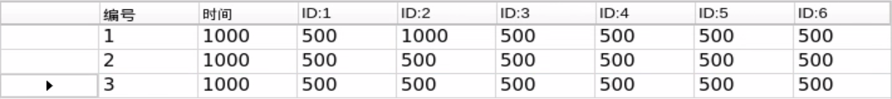

| **Icon** | **Function** |
|:--:|:--:|
|  | Action group number |
|  | Running time of the action that is time taken to complete this action |
|  | Servo value. Double click the figure below  to revise. |

(3) Action group setting

| **Icon** | **Function** |
|:--:|:--:|
|  | Action running duration time. Directly click  to modify. |
|  | Total running time taking for all the actions in an action group |
|  | If you click this button, joints of robot become loose, and you can drag servos to design any posture |
|  | Read the servo angle you have designed before. This button should be used with  |
|  | Add the servo value as a action to the last line of the action list |
| 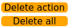 | Delete action: delete the action selected in the action list; Delete all: delete all the action in action list |
|  | Replace the angle value of the action selected in the action list with the servo value in the servo control area. And update the running time as the time set in **"Time"** |
|  | Insert a new action above the selected action. The running time of this new action is the time set in **"Time"** and angle value is the current value in servo control area. |
|  | Move the selected action up one line |
|  | Move the selected action down one line |
| 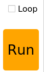 | Click to run all the actions on the action list once (If **"Loop"** is ticked, JetAuto Pro will repeat the action.) |
|  | Load the data of the saved action group to the action list |
|  | Save the current actions in the action list into the designated path. |
|  | Firstly, open one action group, then click this button, and then open other action group. And these two action groups will be integrated into one. |
|  | Display the saved action groups. You can select the action to run. |
|  | Refresh action group drop-down menu. |
|  | Run the selected action group once. |
|  | Stop running the action group. |
|  | Exit PC software interface |

(4) Servo deviation setting area

| **Icon** | **Function** |
|:--:|:--:|
|  | Click to read the saved servo deviation. |
|  | Click to download the adjusted deviation to the robot. |
|  | Click to return all the servos to the mid point(500). |

### 7.1.4 Action Calling

* **What is Action Calling**

Action calling is to directly call the edited action group via PC software to let robot perform this action.

JetRover has built-in action groups, and its action group files are stored in **/ubuntu/software/arm_pc/ActionGroups**. You can check and call built-in actions via PC software or command.

The specific operation steps are as follow:

:::{Note}
Only if action files are saved in **/ubuntu/software/arm_pc/ActionGroups**, can the files be called
:::

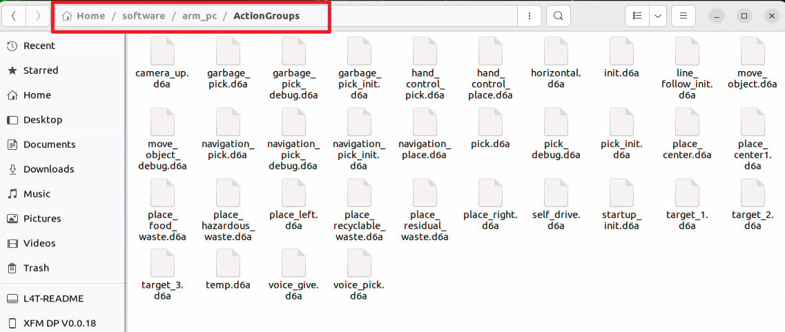

* **Operation Steps**

(1) Double click  to enter PC software interface.


(2) Click **"Open action file"** button.


(3) Select action group you want, then click **"Open"**.


(4) Running time of each action and servo values are displayed on the action list


(5) You can first select number **"1"** and click **"Run"** button to run the selected action in action list. If you want to make robot repeat this action group, you can tick **"Loop"** and click **"Run"**.

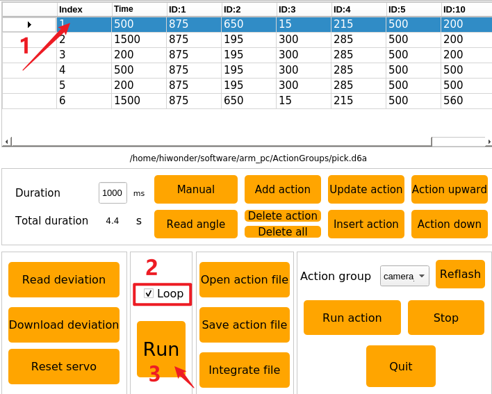

### 7.1.5 Action Editing

* **Introduction**

Adjust the angles of corresponding servos based on the target motion to achieve that motion. Multiple actions are combined into an action group.

Edit several actions to form a action group so as to make robotic arm pick the block at left.

* **Design Action**

(1) Put down antenna before operation to avoid robot arm of hitting antenna when it is moving.

(2) Double click  to enter PC software interface.


(3) Click **"Reset servo"** to make servo return back to mid-point.


(4) Drag the slider to set servo values as pictured to make robot arm bend to left.


(5) Click **"Add Action"** to add current action to action list.


(6) Align robot arm with the block. Adjust value of corresponding servos as follow.


(7) Set the time as **"2000ms"**. Click **"Add Action"** to update NO.2 action.

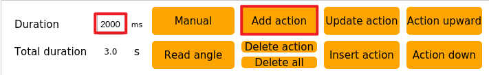


(8) Add another transitional action. Set the time as 200ms and click **"Add Action"**.

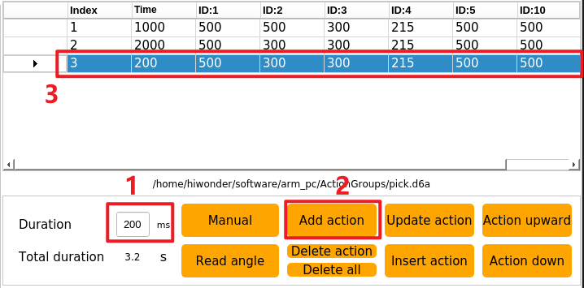

(9) Adjust NO.10 servo to let robot arm pick the block. Set times as 500ms, then click **"Add Action"**


(10) Add a transitional action again. Set the time as **"200ms"**, and click **"Add action"** to form NO.5 action.

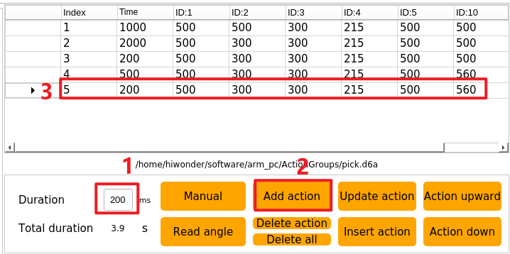

(11) Adjust servo value to make robot arm pick the block to specific height. Set the time as 2000 ms, and click **"Add action"**


(12) After NO.6 action is edited, action group of **"picking block at left"** is complete.


(13) Next, let robot arm run the whole action group. Select NO.1 action, then click **"Run"**. If you want to repeat this action, tick **"Loop"** box.


* **Save Action**

:::{Note}
The name of action group cannot contain **"Space"**, otherwise the file cannot be saved in later debugging.
:::

In case of future debugging and management, save the edited action group. Click **"Save action file"** and select this path, **/ubuntu/software/arm_pc/ActionGroups**.


Here takes the name of **"font_pick"** as example, and then click **"Save"** to save the action group.


### 7.1.6 Integrate Action Files

* **Introduction**

Integrating action files is to integrate two action groups to form a new action group.

* **Operation Steps**

(1) Put down antenna before operation to avoid robot arm of hitting antenna when it is moving.

(2) Double click  to enter PC software interface.


(3) Click **"Integrate files"** button, and select the following path.

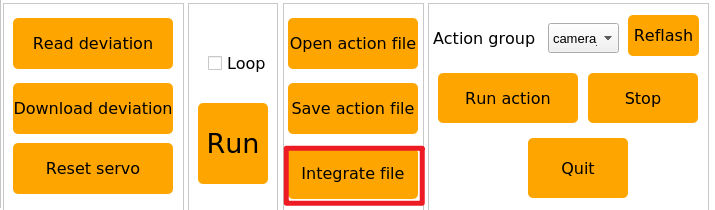


(4) Select and open **"place_left.d6a"** on the pop-up window.


(5) This action group is added to the action list.


(6) Click **"Integrate action files"** button again. Select and open **"place_right.d6a"**. After that, this action group is added to the end of the first action group.


(7) Click NO.1 action, then click **"Run"** to let robot arm perform this integrated action.


(8) Click **"Save action files"** button to save this new action group in case of future debugging.


(9) Name this new action group, for example **"left_right"**.

:::{Note}
Action group name cannot contain **"Space"**.
:::


### 7.1.7 Export and Import Action Files

* **Introduction**

Export the action group files edited on PC software, and import them to other devices of the same type.

* **Export Action**

This section illustrates the export and import of the **"pick.d6a"** action group file as an example.

(1) Click 

(2) Find **"pick.d6a"** file.


(3) Directly drag the action file to the computer desktop to export this file.


* **Import Action**

(1) Put down antenna before operation to avoid robot arm of hitting antenna when it is moving.

(2) Directly drag **"pick.d6a"** action file to robot system desktop.


(3) Then directly drag or copy **"pick.d6a"** file to following path.


(4) Double click  to enter PC software interface.


(5) Click **"Open action files"** button. Find the file you just import, and open it.


Or directly select the imported action group in this drop-down menu.


(6) Click **"Run"** button to let robot arm execute this action group.


### 7.1.8 Robot Arm Deviation Adjustment


As the robotic arm is used over time, the mechanical angle deviation of the servos on the arm will gradually increase. If the joints of the robotic arm cannot reach the specified target points during operation, you will need to manually adjust the servo deviations according to the instructions in this document.

:::{Note}
Before leaving the factory, the servo deviations of the robotic arm on the car have been fully adjusted. No servo deviation adjustment is required for the initial use or within a short period after receiving the product. Only if you notice significant deviations that affect normal functionality, should you refer to this document to adjust the servo deviations of the robotic arm.
:::

* **Introduction to Robot Arm**

This car features a 6-degree-of-freedom robotic arm, constructed with intelligent bus servos and metal sheet components, allowing it to move to any position within its operational space. It has six degrees of freedom: X movement, Y movement, Z movement, X rotation, Y rotation, and Z rotation, enabling it to perform actions such as extension, rotation, and lifting. Additionally, it is equipped with a depth camera (Dabai DCW) that can be used in conjunction with the robotic arm for various functions, including hand-following color block recognition and sorting, color block tracking, line-following obstacle clearance, waste sorting, and fixed-point navigation and transport.


JetRover is a 6-degree-of-freedom robotic arm, composed of intelligent bus servos and metal sheet components.

<p>


</p>

The JetRover's 6-degree-of-freedom robotic arm consists of six intelligent bus servos: HTD-35H*3 (body), HTS-20H*1 (pan-tilt), HTS-21H*1 (claw), and HTD-35H bus servo (wrist).

The bus servos use serial communication to connect multiple servos through a single bus control system. This allows multiple servos to be connected through a single I/O port, providing higher precision compared to digital servos, albeit at a slightly higher cost.

The interface distribution and description are exemplified by one of the HTD-35H servos, as shown below:


| **PIN** | **Description** |
|:--:|:--:|
| GND | Power Ground |
| VIN | Power Input |
| SIG | Signal End (Half-Duplex UART Asynchronous Serial Interface) |

<p id="anchor_7_1_8_2"></p>

* **Adjustment Steps**

Before adjusting the servo deviations, it is essential to identify and understand the corresponding ID numbers for each servo on the robotic arm. These IDs will be used during the adjustment process.

The IDs are as follows:

ID 1: Pan-tilt Servo

IDs 2, 3, 4: Robotic Arm Joint Servos

ID 5: Wrist Servo

ID 10: Claw Servo


In total, six servos are controlled on the robotic arm. These servos may develop deviations over time, requiring adjustment to the mid-position standard of the robotic arm.

When adjusting servo deviations, refer to the standard servo deviation adjustment diagram. The robotic arm can be considered deviation-free only if it meets both of the following standards:


Standard 1: The servos with IDs 1, 2, 3, 4, and 5 must be horizontally and vertically aligned with the base of the car in the mid-position state. As shown in the diagram, the central screws on the servo discs should form a line that vertically passes through these servos.


Standard 2: The claw on the robotic arm must maintain an opening distance of 2-3 cm (this represents the mid-position standard for the claw servo). This can be measured using two fingers (index and middle), which should fit snugly within the gap.

* **Instructions**

After understanding the adjustment standards, you can now adjust the deviation of the robotic arm according to these standards. Taking the deviation adjustment of Servo 3 of the JetRover robot's arm as an example, as shown in the diagram below, Servo 3 has a deviation, causing misalignment in the positions of Servos 4, 5, and 10. Therefore, adjustment needs to be made using the robot's upper computer software at this time.


The detailed instructions are as below:

(1) Access the robot system using NoMachine. Then click-on  to open the ROS1 terminal.

(2) Execute the following command to disable the auto-start service.

```
sudo systemctl stop start_app_node.service
```

(3) Double-click the **"arm"** icon on the desktop to enter the interface of the robotic arm's PC software, as shown in the following image:


For details about the interface and related content of the **"arm"** software, please refer to the [Basic Control](#anchor_7_1) document. This document focuses specifically on adjusting servo deviations.

(4) Clicking the **"Reset Servo"** button, it was found that Servo 3 of the robotic arm has a deviation.


(5) Click the **"Read Deviation"** button to obtain the current deviation values for the servos installed on the robotic arm.


(6) After the **"Read Deviation Successful"** popup appears, click the **"OK"** button.

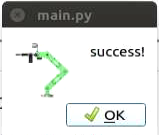

(7) Check the deviation value for Servo ID: 3, as shown in the diagram below. In this diagram, each servo is identified by its respective ID number. The slider above indicates the current position, the middle number displays its position value, and the bottom slider represents the set deviation value for the servo.


(8) You can see that the deviation value for Servo ID: 3 is -18. When Servo 3 has such a deviation, adjustment should be made in the opposite direction until it reaches the **"Standard (1)"** state specified in the [**"Adjustment Standard"**](#anchor_7_1_8_2).


Now you can see that the deviation value for Servo ID: 3 has been adjusted to **"2"**, bringing the robotic arm's status to the **"Standard (1)"** state as specified in the [**"Adjustment Standard"**](#anchor_7_1_8_2). This completes the setting for adjusting the deviation of Servo 3. Next, you need to save the current value to the local computer of the robot. After the robot is restarted, it will use these saved values for servo control. The procedure for reading other servo IDs is the same.

(9) Click-on **'Download Deviation'** button.


(10) Wait for the prompt **"Download Deviation Successful"** to appear, then click **"OK"** to exit the window.


This completes the adjustment of Servo 3's deviation.

(11) When we need the robotic arm to return to its initial state, we can select **"camera"** within the action group range.


(12) Choose **'init'**.


(13) Click **"Execute Action"** to have the robotic arm perform the **"init"** action group.


After clicking, the robot's status is as shown in the following image:


After completing the above steps, Servo 3 of the robot's arm has been adjusted. If other bus servos on the robot show deviations that do not meet the judgment criteria, you will need to repeat the adjustment steps to adjust the corresponding servo deviations. It is important to note that during adjustment, you should adjust the lower slider and then download the deviation for it to take effect. The specific position is indicated by the green box in the following image:


* **FAQ**

(1) When adjusting the position of the gripper, I found that no matter how much I adjusted it beyond a certain point, the gripper on the robotic arm did not respond?

Our company has implemented mechanical limits on the gripper of the robotic arm, specifically Servo 10 corresponding to the mechanical gripper. When the position set through the PC software exceeds 700, it reaches the mechanical limit of the gripper, preventing it from further tightening. Exceeding this limit may risk damaging the servo. In such cases, simply adjust in the opposite direction.


It is recommended to adjust Servo 10 within the range of [200, 700] during this adjustment.

(2) After clicking "**Read Deviation**", the software interface freezes

Because the bus servos communicate via serial communication, if the auto-start service is not disabled after the robot starts, it can block message transmission, causing the software interface to freeze. The solution is to disable the auto-start service by following the steps outlined in the [adjustment procedure](#anchor_7_1_8_2).

## 7.2 2D Vision（Vision Application）

The robotic arm is a mechanical device that is able to simulate the human arms and is widely used in various fields such as industrial, medical and military. Here are several application scenarios of robotic arms:

* **Industrial automation**: The application of robotic arms in industrial production is particularly widespread, they can be used for tasks such as handling, assembly, welding, painting, etc., greatly improving production efficiency and quality.

* **Medical Assistance Therapy:** Robotic arms can be used in operating room to provide doctors with higher precision in surgical procedure, reducing surgical errors and other adverse outcomes.

* **Electronic Equipment Maintenance**: Robotic arms can be used for electronic equipment maintenance, especially in compact spaces or high-risk environments, where they can prevent personnel from being injured.

* **Space Exploration**: The application of robotic arms in space exploration missions, such as probing planetary surfaces, collecting samples, and other tasks, is an extremely important technological means.

In conclusion, the application scenarios of robotic arms are extremely diverse. With the continuous advancement of technology, the use of robotic arms in various fields will become increasingly widespread. Therefore, this document will introduce the relevant applications of the robotic arm on JetRover, allowing users to experience the different functional effects of visual robotic arms.


The diagram above illustrates the structure of **"Robotic Arm Visual Applications"** functionality, including hand tracking, color recognition and sorting, color tracking, line-following clearance, waste sorting, navigation and transportation. The following content will be written based on this diagram.

### 7.2.1 Hand Tracking

* **Program Logic**

What is the application scenario of the hand tracking?

(1) Virtual realization hand tracking technology can be used in virtual realization games, enabling players to control game characters' movements, attacks, and other actions through gestures.

(2) Medical hand tracking technology can be used in rehabilitation training to help patients regain hand functionality.

(3) Educational hand tracking technology can be used in the field of education, allowing students to engage in interactive learning through gestures.

(4) Smart home hand tracking technology can be used in smart homes, allowing users to control home devices' switches, adjustments, and other operations through gestures.

(5) Industrial production hand tracking technology can be used in industrial production, allowing workers to control robots' operations through gestures, thus improving production efficiency.

The hand features detection in JetRover utilizes MediaPipe, an open-source multimedia machine learning model application framework. It can run cross-platform on mobile devices, workstations, and servers, and supports mobile GPU acceleration. It also supports the inference engines of TensorFlow and TF Lite, allowing any TensorFlow and TF Lite models to be used with MediaPipe. Additionally, on mobile and embedded platforms, MediaPipe also supports device-native GPU acceleration.

Firstly, it is necessary to build a hand recognition model and subscribe to the topic messages published by the camera node to obtain images. Then, process the images, such as flipping, and detect hand information within the images. Next, based on the lines connecting the keypoints of the hand, obtain the position of the center point of the hand. Finally, control the robotic arm to follow the up-and-down movement of the hand's center point.

The source code of the program is located in: [/home/ubuntu/ros2_ws/src/example/example/hand_track/hand_track_node.py](../_static/source_code/hand_track.zip)

* **Operation Steps**

:::{Note}
The entered command should be case sensitive and **"Tab"** key can be used to complement the key words.
:::

(1) Start JetRover and connect it to NoMachine.

(2) Double click on  to start the command line terminal.

(3) Input the command and press Enter to disable the app service.

```
sudo systemctl stop start_app_node.service
```

(4) Input the command to start the game program.

```
ros2 launch example hand_track_node.launch.py
```

(5) To exit this mode, press **'Ctrl+C'** on the terminal interface. If this fails, you can open a new command line terminal and input the command to close all current ROS functions.

```
~/.stop_ros.sh
```

* **Outcome**

After the game starts, the robotic arm will restore its initial posture. Place your hand in front of the camera of the robotic arm. When you move your hand up and down, robotic arm will move with your hand.

:::{Note}
This mode may cause the program to freeze when displaying the feedback screen, so the feedback screen will not be shown during execution. If you need to view the feedback screen, you can open a new command line terminal, enter the command `rqt`, and select `/hand_detect/image_result`.
:::


* **Program Analysis**

(1) Launch Analysis


The program is saved in: [ros2_ws/src/example/example/hand_track/hand_track_node.launch.py](../_static/source_code/hand_track.zip)

① Read the package path

Read the paths of the `peripherals`, `controller`, and `kinematics` packages.

{lineno-start=14}
```python
    if compiled == 'True':
        peripherals_package_path = get_package_share_directory('peripherals')
        controller_package_path = get_package_share_directory('controller')
        kinematics_package_path = get_package_share_directory('kinematics')
    else:
        peripherals_package_path = '/home/ubuntu/ros2_ws/src/peripherals'
        controller_package_path = '/home/ubuntu/ros2_ws/src/driver/controller'
        kinematics_package_path = '/home/ubuntu/ros2_ws/src/driver/kinematics'
```

② Initiate other Launch files

`depth_camera_launch`: Used to initiate the depth camera

`controller_launch`: Used to initiate base control, servo control, etc.

`kinematics_launch`: Used to initiate kinematic algorithms

{lineno-start=23}
```python
    depth_camera_launch = IncludeLaunchDescription(
        PythonLaunchDescriptionSource(
            os.path.join(peripherals_package_path, 'launch/depth_camera.launch.py')),
    )
    controller_launch = IncludeLaunchDescription(
        PythonLaunchDescriptionSource(
            os.path.join(controller_package_path, 'launch/controller.launch.py')),
    )

    kinematics_launch = IncludeLaunchDescription(
        PythonLaunchDescriptionSource(
            os.path.join(kinematics_package_path, 'launch/kinematics_node.launch.py')),
    )
```

③ Initiate Node

`hand_detect_node`: Used to launch hand detection

`hand_track_node`: Used to launch hand tracking

{lineno-start=37}
```python
    hand_detect_node = Node(
        package='example',
        executable='hand_detect',
        output='screen',
        parameters=[{'enable_display': enable_display}]
    )

    hand_track_node = Node(
        package='example',
        executable='hand_track',
        output='screen',
    )
```

(2) Source Code Analysis


The program is saved in: [ros2_ws/src/example/example/hand_track/hand_track_node.py](../_static/source_code/hand_track.zip)

① Main Function

{lineno-start=126}
```python
def main():
    node = HandTrackNode('hand_track')
    executor = MultiThreadedExecutor()
    executor.add_node(node)
    executor.spin()
    node.destroy_node()
```

The main function is used to invoke the hand recognition class startup node.

② `HandTrackNode` Class

* init_process:

{lineno-start=51}
```python
    def init_process(self):
        self.timer.cancel()

        self.init_action()

        threading.Thread(target=self.main, daemon=True).start()
        self.create_service(Trigger, '~/init_finish', self.get_node_state)
        self.get_logger().info('\033[1;32m%s\033[0m' % 'start')
```

Initialize the action and start the main function `main` to publish the initialization status of the current node.

* send_request:

{lineno-start=76}
```python
    def send_request(self, client, msg):
        future = client.call_async(msg)
        while rclpy.ok():
            if future.done() and future.result():
                return future.result()
```

Used to publish the recognized hand position to the kinematic node and obtain the servo angle of the kinematic feedback.

* get_hand_callback:

{lineno-start=82}
```python
    def get_hand_callback(self, msg):
        if msg.width != 0:
            self.center = msg
        else:
            self.center = None
```

Utilized to get the current hand recognition result.

* main:

{lineno-start=88}
```python
    def main(self):
        while self.running:
            if self.center is not None:
                t1 = time.time()
                self.pid_y.SetPoint = self.center.width / 2
                self.pid_y.update(self.center.width - self.center.x)
                self.y_dis += self.pid_y.output
                if self.y_dis < 200:
                    self.y_dis = 200
                if self.y_dis > 800:
                    self.y_dis = 800

                self.pid_z.SetPoint = self.center.height / 2
                self.pid_z.update(self.center.y)
                self.z_dis += self.pid_z.output
                if self.z_dis > 0.46:
                    self.z_dis = 0.46
                if self.z_dis < 0.36:
                    self.z_dis = 0.36

                msg = set_pose_target([self.x_init, 0.0, self.z_dis], 0.0, [-180.0, 180.0], 1.0)
                res = self.send_request(self.kinematics_client, msg)
                t2 = time.time()
                t = t2 - t1
                if t < 0.02:
                    time.sleep(0.02 - t)
                if res.pulse:
                    servo_data = res.pulse
                    set_servo_position(self.joints_pub, 0.02, ((10, 500), (5, 500), (4, servo_data[3]), (3, servo_data[2]), (2, servo_data[1]), (1, int(self.y_dis))))
                else:
                    set_servo_position(self.joints_pub, 0.02, ((1, int(self.y_dis)), ))

            else:
                time.sleep(0.01)

        self.init_action()
        rclpy.shutdown()
```

Based on the results of hand recognition, control the pan-tilt servo using PID; employ PID to control the required height of the current robotic arm, and derive servo angles through kinematics; finally, publish the current servo parameters to complete the tracking process.

### 7.2.2 Color Recognition and Sorting

* **Program Logic**

With the further development of automation technology, production line in manufacturing enterprises are increasingly moving towards automation and intelligence. As a result, a large number of automated devices are gradually being introduced into the production lines. Among them, in the process if martial color recognition, positioning, and sorting, visual systems are required for tasks such as image acquisition and data analysis to effectively identify and locate the color of the samples. Motion control technology provides effective solutions for visual color recognition, positioning, and sorting to improve the production capacity of enterprises.

The vision detection method using motion control technology features fast detection speed, good reliability, and high efficiency. It can achieve non-contact and non-destructive testing. Machine vision color recognition, positioning, and sorting have good applicability in various industries and have widespread market applications.

First, subscribe to the topic messages published by the color recognition node to obtain recognition color information and images.

Next, invoke the initialization action group file to prepare the robotic arm for the desired posture.

Finally, based on the required color information, match the corresponding sorting actions and then execute the sorting actions to sort the color blocks into the respective areas.

The robot performs sorting tasks after recognizing the colored blocks from its own perspective. Prior to starting, ensure that the blocks required for this game are prepared.

The source code of the program is located in [/home/ubuntu/ros2_ws/src/example/example/color_sorting/color_sorting_node.py](../_static/source_code/color_sorting.zip)

* **Operation Steps**

:::{Note}
The entered command should be case sensitive and **"Tab"** key can be used to complement the key words.
:::

(1) Start JetRover and connect it to NoMachine.

(2) Double click on  to start the command line terminal.

(3) Input the command and press Enter to disable the app service.

```
sudo systemctl stop start_app_node.service
```

(4) Input the command and press Enter to start the program.

```
ros2 launch example color_sorting_node.launch.py debug:=true
```

(5) Before recognizing and picking up objects, the robotic arm will go through a calibration phase. During this phase, the arm performs a downward grasping motion with the gripper open. Place the colored block in the center of the open gripper at this time.


(6) The robotic arm will lift up and be in a ready-to-recognize state. Once calibration is complete, the red box in the image will change to yellow, marking the recognition area. The colored block will only be recognized and picked up if it is within this yellow area.

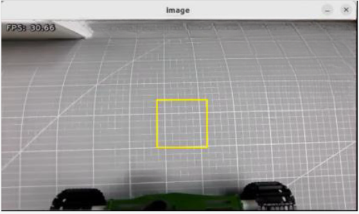

(7) To close this feature, press **'Ctrl+C'** in the terminal window. If it fails, open a new command-line terminal and enter the command to stop all ROS functions currently running.

```
~/.stop_ros.sh
```

* **Outcome**

After the game starts, the robotic arm turns left to prepare itself for the sorting. Place the target block within the yellow box in the middle of the transmitted image. Once the block is recognized, the robotic am will transport them to their corresponding areas.

The red color block will be transported to the position directly in front and center of the robot; the green color block will be transported to the position in front of the robot, towards its left side; the blue color block will be transported to the position in front of the robot, towards its right side.


* **Program Analysis**

(1) Launch analysis

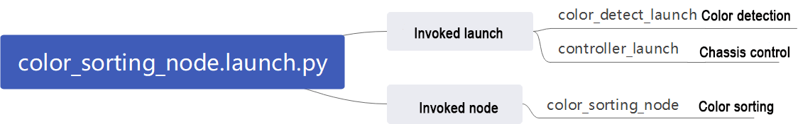

The program is saved in [ros2_ws/src/example/example/color_sorting/color_sorting_node.launch.py](../_static/source_code/color_sorting.zip)

① Initiate other Launch files

{lineno-start=24}
```python
    color_detect_launch = IncludeLaunchDescription(
        PythonLaunchDescriptionSource(
            os.path.join(example_package_path, 'example/color_detect/color_detect_node.launch.py')),
        launch_arguments={
            'enable_roi_display': debug,
        }.items(),
    )
    controller_launch = IncludeLaunchDescription(
        PythonLaunchDescriptionSource(
            os.path.join(controller_package_path, 'launch/controller.launch.py')),
    )
```

`color_detect_launch` is used to launch color recognition.

`controller_launch` is used to launch control of the base, servos, and other components.

② Start Node

{lineno-start=36}
```python
    color_sorting_node = Node(
        package='example',
        executable='color_sorting',
        output='screen',
        parameters=[os.path.join(example_package_path, 'config/color_sorting_roi.yaml'), {'start': start, 'debug': debug, 'broadcast': broadcast}]
    )
```

`color_sorting_node` is employed to initiate the color sorting node.

(2) Code analysis


Program path: [ros2_ws/src/example/example/color_sorting/color_sorting_node.py](../_static/source_code/color_sorting.zip)

① Main Function

{lineno-start=243}
```python
def main():
    node = ColorSortingNode('color_sorting')
    executor = MultiThreadedExecutor()
    executor.add_node(node)
    executor.spin()
    node.destroy_node()
```

The main function calls the hand recognition class to start the node.

② `ColorSortingNode`

* init_process:

{lineno-start=66}
```python
    def init_process(self):
        self.timer.cancel()

        if self.debug:
            if self.camera_type == 'Dabai':
                self.pick_roi = [200, 340, 240, 400]
            else:
                self.pick_roi = [320, 460, 240, 400]
            self.controller.run_action('pick_debug')
            time.sleep(5)
            self.controller.run_action('pick_init')
            time.sleep(2)
        if self.get_parameter('start').value:
            self.start_srv_callback(Trigger.Request(), Trigger.Response())

        threading.Thread(target=self.pick, daemon=True).start()
        threading.Thread(target=self.main, daemon=True).start()
        self.create_service(Trigger, '~/init_finish', self.get_node_state)
        self.get_logger().info('\033[1;32m%s\033[0m' % 'start')
```

Initializes arm movements and starts the pick function and main function in multiple threads, then publishes the current node state.

* get_node_state:

{lineno-start=86}
```python
    def get_node_state(self, request, response):
        response.success = True
        return response
```

Works in conjunction with `init_process` to initialize the node state.

* shutdown:

{lineno-start=90}
```python
    def shutdown(self, signum, frame):
        self.running = False
```

Callback function to shut down the program; sets the running parameter to false and terminates the program.

send_request:

{lineno-start=93}
```python
    def send_request(self, client, msg):
        future = client.call_async(msg)
        while rclpy.ok():
            if future.done() and future.result():
                return future.result()
```

Publishes the recognized hand position to the kinematics node and receives servo angle feedback from kinematics.

* start_srv_callback:

{lineno-start=99}
```python
    def start_srv_callback(self, request, response):
        self.get_logger().info('\033[1;32m%s\033[0m' % "start color sorting")
        roi = ROI()
        roi.x_min = self.pick_roi[2] - 20
        roi.x_max = self.pick_roi[3] + 20
        roi.y_min = self.pick_roi[0] - 20
        roi.y_max = self.pick_roi[1] + 20
        msg = SetCircleROI.Request()
        msg.data = roi

        res = self.send_request(self.set_roi_client, msg)
        if res.success:
            self.get_logger().info('\033[1;32m%s\033[0m' % 'set roi success')
        else:
            self.get_logger().info('\033[1;32m%s\033[0m' % 'set roi fail')
        
        msg = SetColorDetectParam.Request()
        msg_red = ColorDetect()
        msg_red.color_name = 'red'
        msg_red.detect_type = 'circle'
        msg_green = ColorDetect()
        msg_green.color_name = 'green'
        msg_green.detect_type = 'circle'
        msg_blue = ColorDetect()
        msg_blue.color_name = 'blue'
        msg_blue.detect_type = 'circle'
        msg.data = [msg_red, msg_green, msg_blue]
        res = self.send_request(self.set_color_client, msg)
        if res.success:
            self.get_logger().info('\033[1;32m%s\033[0m' % 'set color success')
        else:
            self.get_logger().info('\033[1;32m%s\033[0m' % 'set color fail')
        self.start = True
         
        response.success = True
        response.message = "start"
        return response
```

Upon invocation, reads ROI parameters, sets the desired color for picking, publishes color information to the color recognition node, and starts the sorting process.

* stop_srv_callback:

{lineno-start=137}
```python
    def stop_srv_callback(self, request, response):
        self.get_logger().info('\033[1;32m%s\033[0m' % "stop color sorting")
        self.start = False
        res = self.send_request(self.set_color_client, SetColorDetectParam.Request())
        if res.success:
            self.get_logger().info('\033[1;32m%s\033[0m' % 'set color success')
        else:
            self.get_logger().info('\033[1;32m%s\033[0m' % 'set color fail')

        response.success = True
        response.message = "stop"
        return response   
```

Upon invocation, stops the current program and publishes empty information to the color recognition node to halt recognition.

* get_color_callback:

{lineno-start=150}
```python
    def get_color_callback(self, msg):
        data = msg.data
        if data != []:
            if data[0].radius > 10:
                self.center = data[0]
                self.color = data[0].color
            else:
                self.color = ''
        else:
            self.color = ''
```

Upon invocation, reads the color of the knife recognized by the color recognition node.

* pick:

{lineno-start=161}
```python
    def pick(self):
        while self.running:
            if self.start_pick:
                self.stop_srv_callback(Trigger.Request(), Trigger.Response())
                self.get_logger().info('\033[1;32mcolor: %s\033[0m' % self.target_color)
                if self.target_color == 'red':
                    self.controller.run_action('pick')
                    if self.broadcast:
                        voice_play.play('red', language=self.language)
                    self.controller.run_action('place_center')
                elif self.target_color == 'green':
                    self.controller.run_action('pick')
                    if self.broadcast:
                        voice_play.play('green', language=self.language)
                    self.controller.run_action('place_left')
                elif self.target_color == 'blue':
                    self.controller.run_action('pick')
                    if self.broadcast:
                        voice_play.play('blue', language=self.language)
                    self.controller.run_action('place_right')
                self.start_pick = False
                self.controller.run_action('pick_init')
                time.sleep(0.5)
                self.start_srv_callback(Trigger.Request(), Trigger.Response())
            else:
                time.sleep(0.01)
```

Upon invocation, uses action groups for gripping, runs different action groups based on recognized colors, and places objects in three different positions.

main:

{lineno-start=188}
```python
    def main(self):
        count = 0
        while self.running:
            try:
                image = self.image_queue.get(block=True, timeout=1)
            except queue.Empty:
                if not self.running:
                    break
                else:
                    continue
            if self.color in ['red', 'green', 'blue'] and self.start:
                if self.pick_roi[2] < self.center.x < self.pick_roi[3] and self.pick_roi[0] < self.center.y < self.pick_roi[1] and not self.start_pick and not self.debug:
                    self.count += 1
                    if self.count > 30:
                        self.count = 0
                        self.target_color = self.color
                        self.start_pick = True
                elif self.debug:
                    count += 1
                    if count > 50:
                        count = 0
                        self.pick_roi = [self.center.y - 10, self.center.y + 10, self.center.x - 10, self.center.x + 10]
                        data = {'/**': {'ros__parameters': {'roi': {}}}}
                        roi = data['/**']['ros__parameters']['roi']
                        roi['x_min'] = self.pick_roi[2]
                        roi['x_max'] = self.pick_roi[3]
                        roi['y_min'] = self.pick_roi[0]
                        roi['y_max'] = self.pick_roi[1]
                        common.save_yaml_data(data, '/home/ubuntu/ros2_ws/src/example/config/color_sorting_roi.yaml')
                        self.start_srv_callback(Trigger.Request(), Trigger.Response())
                        self.debug = False
                    self.get_logger().info(str([self.center.y - 10, self.center.y + 10, self.center.x - 10, self.center.x + 10]))
                    cv2.rectangle(image, (self.center.x - 25, self.center.y - 25,), (self.center.x + 25, self.center.y + 25), (0, 0, 255), 2)
                else:
                    count = 0
            if image is not None:
                if not self.start_pick and not self.debug:
                    cv2.rectangle(image, (self.pick_roi[2] - 25, self.pick_roi[0] - 25), (self.pick_roi[3] + 25, self.pick_roi[1] + 25), (0, 255, 255), 2)
                cv2.imshow('image', image)
                key = cv2.waitKey(1)
                if key == ord('q') or key == 27:  # Press q or esc to exit(按q或者esc退出)
                    self.running = False
        self.controller.run_action('init')
        rclpy.shutdown()

```

Upon invocation, determines whether sorting should begin based on required colors and ROI.

* image_callback:

{lineno-start=233}
```python
    def image_callback(self, ros_image):
        rgb_image = np.ndarray(shape=(ros_image.height, ros_image.width, 3), dtype=np.uint8,
                               buffer=ros_image.data)  # Original RGB image(原始 RGB 画面)

        if self.image_queue.full():
            # If the queue is full, discard the oldest image(如果队列已满，丢弃最旧的图像)
            self.image_queue.get()
            # Put the image into the queue(将图像放入队列)
        self.image_queue.put(rgb_image)
```

Upon invocation, receives camera data and places it in a queue for easy access.

### 7.2.3 Color Tracking

* **Program Logic**

The first-person view is the perspective of the robot itself. In this game, robot will take the first-person view to complete the color tracking task.

Before starting the game, prepare yourself the required colored blocks.

First of all, subscribe to the topic messages published by color recognition node to obtain the color information.

Subsequently, after matching the target color, obtain the center of the target image.

Finally, by using inverse kinematics, calculate the required angle to align the center position of the screen with the center of the target image. Publish the corresponding topic message, control the servo motion and make the robotic arm follow the movement of the target.

The source code of the program is stored in: [/home/ubuntu/ros2_ws/src/example/example/color_track/color_track_node.py](../_static/source_code/color_track.zip)

* **Operation Steps**

:::{Note}
The input command should be case sensitive, and the **"Tab"** key can be used to complement the key words.
:::

(1) Start JetRover and connect it to NoMachine.

(2) Double click on  to start the command line terminal.

(3) Input the command and press Enter to disable the app service.

```
sudo systemctl stop start_app_node.service
```

(4) Input the command to start the game.

```
ros2 launch example color_track_node.launch.py
```

(5) To close this feature, press **'Ctrl+C'** in the terminal window. If this doesn't work, open a new command-line terminal and use the appropriate command to stop all running ROS processes.

```
~/.stop_ros.sh
```

* **Outcome**

After the game starts, place the red block in front of the camera. The recognized color will be displayed in the image and the robotic arm will follow the movement of the target block.

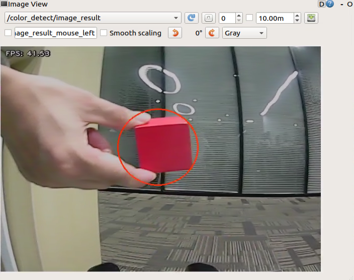

* **Program Analysis**

(1) Launch analysis


Program path: [ros2_ws/src/example/example/color_track/color_track_node.launch.py](../_static/source_code/color_track.zip)

① Initiate other Launch files

{lineno-start=25}
```python
    controller_launch = IncludeLaunchDescription(
        PythonLaunchDescriptionSource(
            os.path.join(controller_package_path, 'launch/controller.launch.py')),
    )

    kinematics_launch = IncludeLaunchDescription(
        PythonLaunchDescriptionSource(
            os.path.join(kinematics_package_path, 'launch/kinematics_node.launch.py')),
    )

    color_detect_launch = IncludeLaunchDescription(
        PythonLaunchDescriptionSource(
            os.path.join(example_package_path, 'example/color_detect/color_detect_node.launch.py')),
        launch_arguments={
            'enable_display': enable_display
        }.items()
    )
```

`color_detect_launch` is used to launch color recognition.

`controller_launch` is used to launch control of the base, servos, and other components.

`kinematics_launch` starts the kinematics algorithm, calculating the required servo angles for the robotic arm based on the recognized information.

② Start Node

{lineno-start=43}
```python
    color_track_node = Node(
        package='example',
        executable='color_track',
        output='screen',
        parameters=[{'start': start}]
    )
```

`color_sorting_node` is employed to initiate the color sorting node.

(2) Code analysis


Program path: [ros2_ws/src/example/example/color_track/color_track_node.py](../_static/source_code/color_track.zip)

① Main Function

{lineno-start=177}
```python
def main():
    node = ColorTrackNode('color_track')
    executor = MultiThreadedExecutor()
    executor.add_node(node)
    executor.spin()
    node.destroy_node()
```

The main function calls the hand recognition class to start the node.

② ColorTrackNode

* init_process:

{lineno-start=62}
```python
    def init_process(self):
        self.timer.cancel()

        self.init_action()
        if self.get_parameter('start').value:
            self.start_srv_callback(Trigger.Request(), Trigger.Response())
            request = SetString.Request()
            request.data = 'red'
            self.set_color_srv_callback(request, SetString.Response())

        threading.Thread(target=self.main, daemon=True).start()
        self.create_service(Trigger, '~/init_finish', self.get_node_state)
        self.get_logger().info('\033[1;32m%s\033[0m' % 'start')
```

Initializes arm movements and starts the pick function and main function in multiple threads, then publishes the current node state.

* init_action:

{lineno-start=80}
```python
    def init_action(self):
        msg = set_pose_target([self.x_init, 0.0, self.z_dis], 0.0, [-180.0, 180.0], 1.0)
        res = self.send_request(self.kinematics_client, msg)
        if res.pulse:
            servo_data = res.pulse
            set_servo_position(self.joints_pub, 1.5, ((10, 500), (5, 500), (4, servo_data[3]), (3, servo_data[2]), (2, servo_data[1]), (1, servo_data[0])))
            time.sleep(1.8)
        self.mecanum_pub.publish(Twist())
```

Initialize all actions of the robot, returning the robotic arm to the gripping position.

* get_node_state:

{lineno-start=73}
```python
    def get_node_state(self, request, response):
        response.success = True
        return response
```

Works in conjunction with `init_process` to initialize the node state.

* shutdown:

{lineno-start=77}
```python
    def shutdown(self, signum, frame):
        self.running = False
```

Callback function to shut down the program; sets the running parameter to false and terminates the program.

* send_request:

{lineno-start=89}
```python
    def send_request(self, client, msg):
        future = client.call_async(msg)
        while rclpy.ok():
            if future.done() and future.result():
                return future.result()
```

Publishes the recognized hand position to the kinematics node and receives servo angle feedback from kinematics.

* set_color_srv_callback:

{lineno-start=95}
```python
    def set_color_srv_callback(self, request, response):
        self.get_logger().info('\033[1;32m%s\033[0m' % "set_color")
        msg = SetColorDetectParam.Request()
        msg_red = ColorDetect()
        msg_red.color_name = request.data
        msg_red.detect_type = 'circle'
        msg.data = [msg_red]
        res = self.send_request(self.set_color_client, msg)
        if res.success:
            self.get_logger().info('\033[1;32m%s\033[0m' % 'start_track_%s'%msg_red.color_name)
        else:
            self.get_logger().info('\033[1;32m%s\033[0m' % 'track_fail')
        response.success = True
        response.message = "set_color"
        return response
```

Used to set the target color for recognition, configured through a service.

* start_srv_callback:

{lineno-start=111}
```python
    def start_srv_callback(self, request, response):
        self.get_logger().info('\033[1;32m%s\033[0m' % "start color track")
        self.start = True
        response.success = True
        response.message = "start"
        return response
```

Upon invocation, reads ROI parameters, sets the desired color for picking, publishes color information to the color recognition node, and starts the sorting process.

* stop_srv_callback:

{lineno-start=}
```python
    def stop_srv_callback(self, request, response):
        self.get_logger().info('\033[1;32m%s\033[0m' % "stop color track")
        self.start = False
        res = self.send_request(ColorDetect.Request())
        if res.success:
            self.get_logger().info('\033[1;32m%s\033[0m' % 'set color success')
        else:
            self.get_logger().info('\033[1;32m%s\033[0m' % 'set color fail')
        response.success = True
        response.message = "stop"
        return response
```

Upon invocation, stops the current program and publishes empty information to the color recognition node to halt recognition.

* get_color_callback:

{lineno-start=130}
```python
    def get_color_callback(self, msg):
        if msg.data != []:
            if msg.data[0].radius > 10:
                self.center = msg.data[0]
            else:
                self.center = None 
        else:
            self.center = None
```

color currently recognized by the color recognition node.

* main:

{lineno-start=139}
```python
    def main(self):
        while self.running:
            if self.center is not None and self.start:
                t1 = time.time()
                center = self.center

                self.pid_y.SetPoint = center.width/2 
                self.pid_y.update(center.x)
                self.y_dis += self.pid_y.output
                if self.y_dis < 200:
                    self.y_dis = 200
                if self.y_dis > 800:
                    self.y_dis = 800

                self.pid_z.SetPoint = center.height/2 
                self.pid_z.update(center.y)
                self.z_dis += self.pid_z.output
                if self.z_dis > 0.46:
                    self.z_dis = 0.46
                if self.z_dis < 0.36:
                    self.z_dis = 0.36
                msg = set_pose_target([self.x_init, 0.0, self.z_dis], 0.0, [-180.0, 180.0], 1.0)
                res = self.send_request(self.kinematics_client, msg)
                t2 = time.time()
                t = t2 - t1
                if t < 0.02:
                    time.sleep(0.02 - t)
                if res.pulse:
                    servo_data = res.pulse
                    set_servo_position(self.joints_pub, 0.02, ((10, 500), (5, 500), (4, servo_data[3]), (3, servo_data[2]), (2, servo_data[1]), (1, int(self.y_dis))))
                else:
                    set_servo_position(self.joints_pub, 0.02, ((1, int(self.y_dis)), ))
            else:
                time.sleep(0.01)

        self.init_action()
        rclpy.shutdown()

```

Upon invocation, it will determine whether to start sorting based on the color to be sorted and the ROI.

* **Extension Function**

The program defaults to recognize red. However, you can change the recognition color to green or blue through modifying the codes in corresponding program. In this section, the default recognition color is changed to green as example. The specific operation steps area as follow:

(1) Start JetRover and connect it to NoMachine.

(2) Double click on  to start the command line terminal.

(3) Input the command and press Enter to access the program directory.

```
cd /home/ubuntu/ros2_ws/src/example/example/color_track/
```

(4) Input the command below to open the program file.

```
vim color_track_node.py
```

(5) Press **"i"** key to enter edit mode and modify the assignment of the **`request.data`** parameter to **"green"**.


(6) After the modification is completed, hit **'ESC'** key and input **':wq'** to exit and save the program.


### 7.2.4 Line-Following Obstacle Clearance

* **Program Logic**

During JetRover moves forward along the black line, it will automatically clear the obstacles around the black line.

Before the game starts, it's necessary to affix the black line in advance and place JetRover in front of the black line. Ensure that there are no other objects of the same color around to prevent interference with recognition, and place the obstacle blocks along the black line.

Firstly, subscribe to the topic messages published by the color recognition node and Lidar node to obtain the recognition color information, captured image data, and Lidar data.

Next, obtain the coordinates of the center position of the line within the image. Calculate the deviation from the center position of the image, update the PID data, and correct the robot's driving direction.

Finally, when obstacles are detected on the line, call the obstacle-clearing action group and remove the block obstacles.

The source code of this program is stored in [/home/ubuntu/ros2_ws/src/example/example/line_follow_clean/line_follow_clean_node.py](../_static/source_code/line_follow_clean.zip)

* **Operation Steps**

:::{Note}
The input command should be case sensitive, and the **"Tab"** key can be used to complement the key words.
:::

(1) Start JetRover and connect it to NoMachine.

(2) Double click on  to start the command line terminal.

(3) Input the command and press Enter to disable the app service.

```
sudo systemctl stop start_app_node.service
```

(4) Input the command to start the game.

```
ros2 launch example line_follow_clean_node.launch.py
```

(5) The camera image interface when the program starts is shown below.

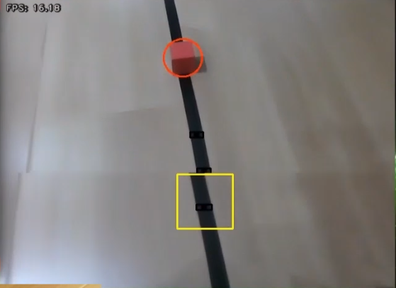

(6) To close this feature, press **'Ctrl+C'** in the terminal window. If that doesn't work, open a new command-line terminal and use the command to stop all running ROS processes.

```
~/.stop_ros.sh
```

* **Outcome**

After the game starts, JetRover moves alone the recognized black line. When it encounters the colored block obstacles along the way, it will pause, grip the obstacle and place it on the left side. Afterward, it will continue moving forward.

* **Program Analysis**

(1) Launch Analysis


Program path: [ros2_ws/src/example/example/line_follow_clean/line_follow_clean_node.launch.py](../_static/source_code/line_follow_clean.zip)

① Starting Other Launch Files

{lineno-start=23}
```python
    lidar_launch = IncludeLaunchDescription(
        PythonLaunchDescriptionSource(
            os.path.join(peripherals_package_path, 'launch/lidar.launch.py')),
    )

    color_detect_launch = IncludeLaunchDescription(
        PythonLaunchDescriptionSource(
            os.path.join(example_package_path, 'example/color_detect/color_detect_node.launch.py')),
        launch_arguments={
            'enable_roi_display': debug,
        }.items(),
    )
    controller_launch = IncludeLaunchDescription(
        PythonLaunchDescriptionSource(
            os.path.join(controller_package_path, 'launch/controller.launch.py')),
    )
```

`color_detect_launch` is used to start color recognition.

`controller_launch` is used to start control of the base, servos, and other components.

`lidar_launch` starts the lidar.

② Initiate Node

{lineno-start=40}
```python
    line_follow_clean_node = Node(
        package='example',
        executable='line_follow_clean',
        output='screen',
        parameters=[os.path.join(example_package_path, 'config/line_follow_clean_roi.yaml'), {'debug': debug}]
    )
```

`line_follow_clean_node` is used to start the line-following sorting node.

(2) Source code analysis

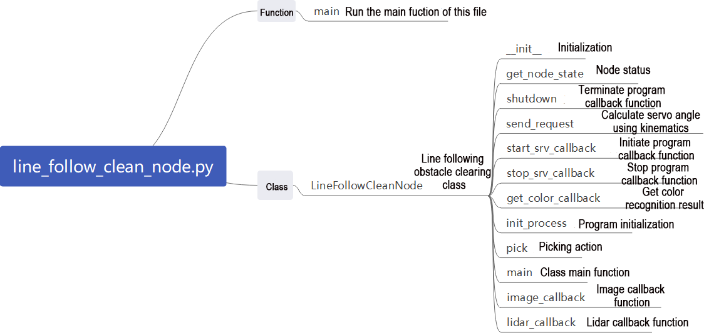

Program path: [/ros2_ws/src/example/example/line_follow_clean/line_follow_clean_node.py](../_static/source_code/line_follow_clean.zip)

① Main Function

{lineno-start=363}
```python
def main():
    node = LineFollowCleanNode('line_follow_clean')
    executor = MultiThreadedExecutor()
    executor.add_node(node)
    executor.spin()
    node.destroy_node()
```

The main function calls the hand recognition class to start the node.

② LineFollowCleanNode

* init_process:

{lineno-start=85}
```python
    def init_process(self):
        self.timer.cancel()

        self.mecanum_pub.publish(Twist())
        self.controller.run_action('line_follow_init')
        if self.debug:
            self.controller.run_action('move_object_debug')
            time.sleep(5)
            self.controller.run_action('line_follow_init')
            time.sleep(2)

        self.start_srv_callback(Trigger.Request(), Trigger.Response())

        threading.Thread(target=self.pick, daemon=True).start()
        threading.Thread(target=self.main, daemon=True).start()
        self.create_service(Trigger, '~/init_finish', self.get_node_state)
        self.get_logger().info('\033[1;32m%s\033[0m' % 'start')
```

Initializes the robotic arm actions, starts the pick and main functions in multiple threads, and publishes the current node state.

* get_node_state:

{lineno-start=103}
```python
    def get_node_state(self, request, response):
        response.success = True
        return response
```

Works in conjunction with `init_process` to initialize the node state.

* shutdown:

{lineno-start=107}
```python
    def shutdown(self, signum, frame):
        self.running = False
```

Callback function to shut down the program, sets the `running` parameter to false, and terminates the program.

* send_request:

{lineno-start=110}
```python
    def send_request(self, client, msg):
        future = client.call_async(msg)
        while rclpy.ok():
            if future.done() and future.result():
                return future.result()
```

Publishes the recognized hand position to the kinematics node and receives servo angle feedback.

* start_srv_callback:

{lineno-start=116}
```python
    def start_srv_callback(self, request, response):
        self.get_logger().info('\033[1;32m%s\033[0m' % "start line follow clean")

        line_roi = LineROI()
        if self.camera_type == 'Dabai':
            line_roi.roi_up.x_min = 0
            line_roi.roi_up.x_max = 640
            line_roi.roi_up.y_min = 200
            line_roi.roi_up.y_max = 210
            line_roi.roi_up.scale = 0.0

            line_roi.roi_center.x_min = 0
            line_roi.roi_center.x_max = 640
            line_roi.roi_center.y_min = 260
            line_roi.roi_center.y_max = 270
            line_roi.roi_center.scale = 0.1

            line_roi.roi_down.x_min = 0
            line_roi.roi_down.x_max = 640
            line_roi.roi_down.y_min = 320
            line_roi.roi_down.y_max = 330
            line_roi.roi_down.scale = 0.9
        else:
            line_roi.roi_up.x_min = 0
            line_roi.roi_up.x_max = 640
            line_roi.roi_up.y_min = 270
            line_roi.roi_up.y_max = 280
            line_roi.roi_up.scale = 0.0

            line_roi.roi_center.x_min = 0
            line_roi.roi_center.x_max = 640
            line_roi.roi_center.y_min = 330
            line_roi.roi_center.y_max = 340
            line_roi.roi_center.scale = 0.1

            line_roi.roi_down.x_min = 0
            line_roi.roi_down.x_max = 640
            line_roi.roi_down.y_min = 390
            line_roi.roi_down.y_max = 400
            line_roi.roi_down.scale = 0.9
        msg = SetLineROI.Request()
        msg.data = line_roi
        res = self.send_request(self.set_line_client, msg)
        if res.success:
            self.get_logger().info('set roi success')
        else:
            self.get_logger().info('set roi fail')

        object_roi = ROI()
        object_roi.x_min = 0
        object_roi.x_max = 640
        if self.camera_type == 'Dabai':
            object_roi.y_min = 100
            object_roi.y_max = 300
        else:
            object_roi.y_min = 220
            object_roi.y_max = 420
        msg = SetCircleROI.Request()
        msg.data = object_roi
        res = self.send_request(self.set_circle_client, msg)
        if res.success:
            self.get_logger().info('set roi success')
        else:
            self.get_logger().info('set roi fail')
        
        msg_black = ColorDetect()
        msg_black.color_name = self.line_color
        msg_black.detect_type = 'line'
        msg_blue = ColorDetect()
        msg_blue.color_name = self.object_blue
        msg_blue.detect_type = 'circle'
        msg_red = ColorDetect()
        msg_red.color_name = self.object_red
        msg_red.detect_type = 'circle'
        msg_green = ColorDetect()
        msg_green.color_name = self.object_green
        msg_green.detect_type = 'circle'
        msg = SetColorDetectParam.Request()
        msg.data = [msg_red, msg_green, msg_blue, msg_black]
        res = self.send_request(self.set_color_client, msg)
        if res.success:
            self.get_logger().info('set color success')
        else:
            self.get_logger().info('set color fail')

        response.success = True
        response.message = "start"
        return response
```

Upon invocation, reads ROI parameters, sets the desired color for picking, publishes color information to the color recognition node, and starts the sorting process.

* stop_srv_callback:

{lineno-start=205}
```python
    def stop_srv_callback(self, request, response):
        self.get_logger().info('\033[1;32m%s\033[0m' % "stop line follow clean")
        res = self.send_request(self.set_color_client, SetColorDetectParam.Request())
        if res.success:
            self.get_logger().info('set color success')
        else:
            self.get_logger().info('set color fail')

        response.success = True
        response.message = "stop"
        return response
```

Upon invocation, stops the current program and publishes empty information to the color recognition node to halt recognition.

* get_color_callback:

{lineno-start=217}
```python
    def get_color_callback(self, msg):
        line_x = None
        center = None
        for i in msg.data:
            if i.color == self.line_color:
                line_x = i.x
            elif i.color == self.object_blue or i.color == self.object_red or i.color == self.object_green:
                center = i
        self.temp_line_x = line_x
        self.temp_center = center
```

Upon invocation, reads the color currently recognized by the color recognition node.

* pick:

{lineno-start=228}
```python
    def pick(self):
        while self.running:
            if self.start_pick:
                self.stop_srv_callback(Trigger.Request(), Trigger.Response())
                self.mecanum_pub.publish(Twist())
                time.sleep(0.5)
                self.controller.run_action('move_object')
                self.controller.run_action('line_follow_init')
                time.sleep(0.5)
                self.start_pick = False
                self.start_srv_callback(Trigger.Request(), Trigger.Response())
            else:
                time.sleep(0.01)
```

Upon invocation, executes the picking and obstacle clearing action groups.

* main:

{lineno-start=242}
```python
    def main(self):
        count = 0
        while self.running:
            try:
                image = self.image_queue.get(block=True, timeout=1)
            except queue.Empty:
                if not self.running:
                    break
                else:
                    continue
            self.line_x = self.temp_line_x
            self.center = self.temp_center
            if self.line_x is not None and not self.start_pick:
                twist = Twist()
                if self.center is not None:
                    if self.center.y > 100 and abs(self.center.x - self.line_x) < 100 and not self.debug:
                        self.pid_x.SetPoint = (self.pick_roi[1] + self.pick_roi[0])/2
                        self.pid_x.update(self.center.y)
                        self.pid.SetPoint = (self.pick_roi[2] + self.pick_roi[3])/2
                        self.pid.update(self.center.x)
                        twist.linear.x = common.set_range(self.pid_x.output, -0.1, 0.1)
                        twist.angular.z = common.set_range(self.pid.output, -0.5, 0.5)
                        if abs(twist.linear.x) <= 0.0065 and abs(twist.angular.z) <= 0.05:
                            self.count += 1
                            time.sleep(0.01)
                            if self.count > 50:
                                self.count = 0
                                self.start_pick = True
                        else:
                            self.count = 0
                    elif self.debug:
                        count += 1
                        if count > 50:
                            count = 0
                            self.pick_roi = [self.center.y - 15, self.center.y + 15, self.center.x - 15, self.center.x + 15]
                            data = {'/**': {'ros__parameters': {'roi': {}}}}
                            roi = data['/**']['ros__parameters']['roi']
                            roi['x_min'] = self.pick_roi[2]
                            roi['x_max'] = self.pick_roi[3]
                            roi['y_min'] = self.pick_roi[0]
                            roi['y_max'] = self.pick_roi[1]
                            common.save_yaml_data(data, os.path.join(
                                os.path.abspath(os.path.join(os.path.split(os.path.realpath(__file__))[0], '../..')),
                                'config/line_follow_clean_roi.yaml'))
                            self.debug = False
                            self.start_srv_callback(Trigger.Request(), Trigger.Response())
                        self.get_logger().info(str([self.center.y - 15, self.center.y + 15, self.center.x - 15, self.center.x + 15]))
                        cv2.rectangle(image, (self.center.x - 25, self.center.y - 25,), (self.center.x + 25, self.center.y + 25), (0, 0, 255), 2)
                    else:
                        self.pid.SetPoint = 320
                        self.pid.update(self.line_x)
                        twist.linear.x = 0.08
                        twist.angular.z = common.set_range(self.pid.output, -0.8, 0.8)
                elif not self.debug:
                    self.pid.SetPoint = 320
                    self.pid.update(self.line_x)
                    twist.linear.x = 0.15
                    twist.angular.z = common.set_range(self.pid.output, -0.8, 0.8)
                if not self.stop:
                    self.mecanum_pub.publish(twist)
                else:
                    self.mecanum_pub.publish(Twist())
            else:
                self.mecanum_pub.publish(Twist())
                time.sleep(0.01)
            if image is not None:
                if not self.start_pick and not self.debug:
                    cv2.rectangle(image, (self.pick_roi[2] - 30, self.pick_roi[0] - 30), (self.pick_roi[3] + 30, self.pick_roi[1] + 30), (0, 255, 255), 2)
                cv2.imshow('image', image)
                key = cv2.waitKey(1)
                if key == ord('q') or key == 27:  # Press q or esc to exit(按q或者esc退出)
                    self.running = False
        self.mecanum_pub.publish(Twist())
        self.controller.run_action('line_follow_init')
        rclpy.shutdown()
```

Upon invocation, determines whether to start sorting based on the required colors and ROI.

* image_callback:

{lineno-start=318}
```python
    def image_callback(self, ros_image):
        cv_image = self.bridge.imgmsg_to_cv2(ros_image, "bgr8")
        rgb_image = np.array(cv_image, dtype=np.uint8)
        if self.image_queue.full():
            # If the queue is full, discard the oldest image(如果队列已满，丢弃最旧的图像)
            self.image_queue.get()
        # Put the image into the queue(将图像放入队列)
        self.image_queue.put(rgb_image)
```

Reads image information and places it in a queue for easy access.

* lidar_callback:

{lineno-start=327}
```python
    def lidar_callback(self, lidar_data):
        # Data size = Scanning angle / Angle added per scan(数据大小 = 扫描角度/每扫描一次增加的角度)
        if self.lidar_type != 'G4':
            max_index = int(math.radians(MAX_SCAN_ANGLE / 2.0) / lidar_data.angle_increment)
            left_ranges = lidar_data.ranges[:max_index]  # Left half of the data(左半边数据)
            right_ranges = lidar_data.ranges[::-1][:max_index]  # Right half of the data(右半边数据)
        elif self.lidar_type == 'G4':
            min_index = int(math.radians((360 - MAX_SCAN_ANGLE) / 2.0) / lidar_data.angle_increment)
            max_index = min_index + int(math.radians(MAX_SCAN_ANGLE / 2.0) / lidar_data.angle_increment)
            left_ranges = lidar_data.ranges[::-1][min_index:max_index][::-1]  #  The left data(左半边数据)
            right_ranges = lidar_data.ranges[min_index:max_index][::-1]  #  The right data(右半边数据)

        # Get data based on the settings(根据设定取数据)
        angle = self.scan_angle / 2
        angle_index = int(angle / lidar_data.angle_increment + 0.50)
        left_range, right_range = np.array(left_ranges[:angle_index]), np.array(right_ranges[:angle_index])

        left_nonzero = left_range.nonzero()
        right_nonzero = right_range.nonzero()
        left_nonan = np.isfinite(left_range[left_nonzero])
        right_nonan = np.isfinite(right_range[right_nonzero])
        # Take the nearest distance left and right(取左右最近的距离)
        min_dist_left_ = left_range[left_nonzero][left_nonan]
        min_dist_right_ = right_range[right_nonzero][right_nonan]
        if len(min_dist_left_) > 1 and len(min_dist_right_) > 1:
            min_dist_left = min_dist_left_.min()
            min_dist_right = min_dist_right_.min()
            if min_dist_left < self.stop_threshold or min_dist_right < self.stop_threshold: 
                self.stop = True
            else:
                self.count_stop += 1
                if self.count_stop > 5:
                    self.count_stop = 0
                    self.stop = False# lidar_callback code here
```

Reads Lidar information, processes data based on the model, and calculates the nearest position.

* **Gripping Adjustment**

In the program, the recognition and gripping area are located in the middle of the image by default, no need for adjustment. However, due to the discrepancy in camera parameters, there might be cases where the robot arm cannot grip the color black. In such situations, you can adjust the position of this area using commands. Here are the specific steps:

(1) Start JetRover and connect it to NoMachine.

(2) Double click on  to open the command line terminal.

(3) Input the command and hit Enter key to initiate testing program.

```
ros2 launch example line_follow_clean_node.launch.py debug:=true
```

(4) This mode will disable the line-following function while keeping the color block gripping function active. Place the color block in the center of the gripper when the robotic arm reaches the gripping position. Wait for the arm to reset and mark the recognition box's position. Then, wait for the arm to execute the gripping action. After calibration, the terminal will display the pixel coordinates of the color block in the image along with a completion message.


(5) Finally, run the program according to **"Operation Steps"**.

### 7.2.5 Waste Sorting

* **Program Logic**

Waste sorting involves the robot recognizing waste cards in front of the camera, and transporting them to the fixed waste card classification areas.

Before the game, prepare the waste cards. You can find the image collection of the waste cards under the same directory and print them out.

First, subscribe to the topic massage published by the YOLOv5 target detection node to obtain the recognized card information and the card images.

Next, match the obtained card information to find out the corresponding waste classification.

Finally, based on the waste classification, execute the corresponding sorting action group to complete the task.

The source code of the program is stored in [/home/ubuntu/ros2_ws/src/example/example/garbage_classification/garbage_classification.py](../_static/source_code/garbage_classification.zip)

* **Operation Steps**

:::{Note}
The input command should be case sensitive, and the **"Tab"** key can be used to complement the key words.
:::

(1) Start JetRover and connect it to NoMachine.

(2) Double click on  to start the command line terminal.

(3) Input the command and press Enter to disable the app auto-start service.

```
sudo systemctl stop start_app_node.service
```

(4) Enter the command and press Enter key to start the garbage sorting mode:

```
ros2 launch example garbage_classification.launch.py debug:=true
```

(5) Before the robotic arm begins the identification and grasping process, it first undergoes a calibration phase. During this phase, the arm performs a downward grasping motion with the gripper open. At this point, the piece of waste wood should be positioned in the center of the gripper.


(6) The robotic arm will then lift upward and enter the identification mode. On the remote interface, the software will display a red box that highlights the area currently being calibrated and identified.


The program uses colored boxes to identify different objects and cards. Each object's name is accompanied by a number less than 1 that indicates the recognition accuracy. For instance, a number like 0.96 next to **"BananaPeel"** reflects the accuracy of the recognition, with the range being from 0 to 1. A higher number signifies greater accuracy in identifying the object as a BananaPeel. Recognition accuracy typically improves in well-lit conditions.

(7) Once calibration is complete, the red box in the image will turn yellow to indicate the recognition area. Only waste cards or wood blocks placed within this yellow area will be identified and grasped.


(8) To exit this mode, press **"Ctrl+C"** in the terminal. If that doesn't work, open a new command line terminal and enter the command to stop all running ROS functions.

```
~/.stop_ros.sh
```

* **Outcome**

After the game starts, JetRover recognizes the waste card within the image. Then place the waste card within the yellow box on the image, the robotic arm will grip the card and transport it to the respective waste classification area.

* **Program Analysis**

(1) Launch Analysis


Program path: [/ros2_ws/src/example/example/garbage_classification/garbage_classification.launch.py](../_static/source_code/garbage_classification.zip)

① Launching Other Launch Files

{lineno-start=31}
```python
    controller_launch = IncludeLaunchDescription(
        PythonLaunchDescriptionSource(
            os.path.join(controller_package_path, 'launch/controller.launch.py')),
    )
```

`controller_launch` is used to start control of the base, servos, and other components.

② Starting Node

{lineno-start=44}
```python
    garbage_classification_node = Node(
        package='example',
        executable='garbage_classification',
        output='screen',
        parameters=[os.path.join(example_package_path, 'config/garbage_classification_roi.yaml'), {'start': start}, {'debug': debug}, {'broadcast': broadcast}],
    )
```

`garbage_classification_node` is used to start the garbage classification node.

(2) Source Code Analysis


Program path: [/ros2_ws/src/example/example/garbage_classification/garbage_classification.py](../_static/source_code/garbage_classification.zip)

① Main Function

{lineno-start=224}
```python
def main():
    node = GarbageClassificationNode('garbage_classification')
    executor = MultiThreadedExecutor()
    executor.add_node(node)
    executor.spin()
    node.destroy_node()
    rclpy.shutdown()
```

The main function calls the hand recognition class to start the node.

② GarbageClassificationNode

* init_process:

{lineno-start=73}
```python
    def init_process(self):
        self.timer.cancel()

        self.mecanum_pub.publish(Twist())
        self.controller.run_action('garbage_pick_init')
        if self.debug:
            self.pick_roi = [30, 450, 30, 610]
            self.controller.run_action('garbage_pick_debug')
            time.sleep(5)
            self.controller.run_action('garbage_pick_init')
            time.sleep(2)

        if self.get_parameter('start').value:
            self.start_srv_callback(Trigger.Request(), Trigger.Response())

        threading.Thread(target=self.pick, daemon=True).start()
        threading.Thread(target=self.main, daemon=True).start()
        self.create_service(Trigger, '~/init_finish', self.get_node_state)
        self.get_logger().info('\033[1;32m%s\033[0m' % 'start')
```

Initializes the robotic arm actions, starts the pick and main functions in multiple threads, and publishes the current node state.

* get_node_state:

{lineno-start=93}
```python
    def get_node_state(self, request, response):
        response.success = True
        return response
```

Works in conjunction with `init_process` to initialize the node state.

* play:

{lineno-start=97}
```python
    def play(self, name):
        if self.broadcast:
            voice_play.play(name, language=self.language)
```

Upon invocation, plays the corresponding category of garbage voice prompt.

* shutdown:

{lineno-start=121}
```python
    def shutdown(self, signum, frame):
        self.running = False
```

Callback function to shut down the program; sets the `running` parameter to false and terminates the program.

* send_request:

{lineno-start=101}
```python
    def send_request(self, client, msg):
        future = client.call_async(msg)
        while rclpy.ok():
            if future.done() and future.result():
                return future.result()
```

Publishes the recognized hand position to the kinematics node and receives servo angle feedback.

* start_srv_callback:

{lineno-start=107}
```python
    def start_srv_callback(self, request, response):
        self.get_logger().info('\033[1;32m%s\033[0m' % "start garbage classification")

        self.send_request(self.start_yolov5_client, Trigger.Request())
        response.success = True
        response.message = "start"
        return response
```

Upon invocation, starts YOLOv5 recognition for garbage classification, providing feedback on the current program status.

* stop_srv_callback:

{lineno-start=115}
```python
    def stop_srv_callback(self, request, response):
        self.get_logger().info('\033[1;32m%s\033[0m' % "stop garbage classification")
        self.send_request(self.stop_yolov5_client, Trigger.Request())
        response.success = True
        response.message = "stop"
        return response
```

Upon invocation, stops the current program and halts YOLOv5 recognition.

* image_callback:

{lineno-start=124}
```python
    def image_callback(self, ros_image):
        cv_image = self.bridge.imgmsg_to_cv2(ros_image, "bgr8")
        bgr_image = np.array(cv_image, dtype=np.uint8)
        if self.image_queue.full():
            # If the queue is full, discard the oldest image(如果队列已满，丢弃最旧的图像)
            self.image_queue.get()
        # Put the image into the queue(将图像放入队列)
        self.image_queue.put(bgr_image)# image_callback code here
```

Reads image information and places it in a queue for easy access.

* pick:

{lineno-start=133}
```python
    def pick(self):
        while self.running:
            waste_category = None
            if self.start_pick:
                time.sleep(0.2)
                for k, v in WASTE_CLASSES.items():
                    if self.current_class_name in v:
                        waste_category = k
                        break
                self.class_name = None
                self.get_logger().info('\033[1;32m%s\033[0m' % waste_category)
                self.stop_srv_callback(Trigger.Request(), Trigger.Response())
                self.controller.run_action('garbage_pick')
                if waste_category == 'food_waste':
                    self.play('food_waste')
                    self.controller.run_action('place_food_waste')
                elif waste_category == 'hazardous_waste':
                    self.play('hazardous_waste')
                    self.controller.run_action('place_hazardous_waste')
                elif waste_category == 'recyclable_waste':
                    self.play('recyclable_waste')
                    self.controller.run_action('place_recyclable_waste')
                elif waste_category == 'residual_waste':
                    self.play('residual_waste')
                    self.controller.run_action('place_residual_waste')
                self.controller.run_action('garbage_pick_init')
                time.sleep(0.5)
                self.start_pick = False
                self.start_srv_callback(Trigger.Request(), Trigger.Response())
            else:
                time.sleep(0.01)
```

Upon invocation, calls the corresponding action group based on the recognized garbage category.

* main:

{lineno-start=165}
```python
    def main(self):
        count = 0
        while self.running:
            try:
                image = self.image_queue.get(block=True, timeout=1)
            except queue.Empty:
                if not self.running:
                    break
                else:
                    continue
            if self.class_name is not None and not self.start_pick and not self.debug:
                self.count += 1
                if self.count > 10:
                    self.current_class_name = self.class_name
                    self.start_pick = True
                    self.count = 0
            elif self.debug and self.class_name is not None:
                count += 1
                if count > 50:
                    count = 0
                    self.pick_roi = [self.center[1] - 15, self.center[1] + 15, self.center[0] - 15, self.center[0] + 15]
                    data = {'/**': {'ros__parameters': {'roi': {}}}}
                    roi = data['/**']['ros__parameters']['roi']
                    roi['x_min'] = self.pick_roi[2]
                    roi['x_max'] = self.pick_roi[3]
                    roi['y_min'] = self.pick_roi[0]
                    roi['y_max'] = self.pick_roi[1]
                    common.save_yaml_data(data, os.path.join(
                        os.path.abspath(os.path.join(os.path.split(os.path.realpath(__file__))[0], '../..')),
                        'config/garbage_classification_roi.yaml'))
                    self.debug = False
                self.get_logger().info(str([self.center[1] - 15, self.center[1] + 15, self.center[0] - 15, self.center[0] + 15]))
                cv2.rectangle(image, (self.center[0] - 45, self.center[1] - 45), (self.center[0] + 45, self.center[1] + 45), (0, 0, 255), 2)
            else:
                self.count = 0
                time.sleep(0.01)
            if image is not None:
                if not self.start_pick and not self.debug:
                    cv2.rectangle(image, (self.pick_roi[2] - 30, self.pick_roi[0] - 30), (self.pick_roi[3] + 30, self.pick_roi[1] + 30), (0, 255, 255), 2)
                cv2.imshow('image', image)
                key = cv2.waitKey(1)
                if key == ord('q') or key == 27:  # Press q or esc to exit(按q或者esc退出)
                    self.running = False
        self.mecanum_pub.publish(Twist())
        self.controller.run_action('garbage_pick_init')
```

Upon invocation, determines whether to start sorting based on the required colors and ROI.

* get_object_callback:

{lineno-start=211}
```python
    def get_object_callback(self, msg):
        objects = msg.objects
        if objects == []:
            self.center = None
            self.class_name = None
        else:
            for i in objects:
                center = (int((i.box[0] + i.box[2])/2), int((i.box[1] + i.box[3])/2))
                if self.pick_roi[2] < center[0] < self.pick_roi[3] and self.pick_roi[0] < center[1] < self.pick_roi[1]:
                    self.center = center
                    self.class_name = i.class_name
```

Reads recognition information from YOLOv5.

### 7.2.6 Fixed Point Navigation

* **Program Logic**

First, subscribe to the topics published by the camera node to obtain images.

Next, activate the navigation service to receive the location information of the destination.

Finally, upon reaching the destination and detecting the target block, the servo control node publishes topic messages to command the robotic arm to complete the gripping and transporting tasks.

* **Operation Steps**

:::{Note}
The input command should be case sensitive, and the **"Tab"** key can be used to complement the key words.
:::

(1) Before starting the game, it's necessary to complete the mapping task in the field of the navigation and transportation, prepare the colored blocks and mark the placement position in red within the area. To get detailed introduction to mapping function, please refer to the tutorials saved in: [4 Mapping & Navigation Course\4.1 Mapping](4.Mapping_Navigation_Course.md#mapping)

(2) Start JetRover and connect it to NoMachine.

(3) Click-on  to start the command-line terminal.

(4) Input the command and press Enter to disable the app service.

```
sudo systemctl stop start_app_node.service
```

(5) Input the command to start the game.

```
ros2 launch example navigation_transport.launch.py map:=map_01
```

:::{Note}
By default, after gripping the colored block, the robot will directly place ti down upon reaching the next target point. If you need to place it at a specific target location, you can add `place_without_color:=false` to the end of the command.
:::

(6) To exit this mode, press **"Ctrl+C"** in the terminal. If that doesn't work, open a new command line terminal and enter the command to stop all current ROS processes.

```
~/.stop_ros.sh
```

* **Outcome**

After opening RVIZ, you need to first check if the position of the robot on the map aligns with its actual potion. If they do not align, manual adjustment may be required. You can utilize the **"2D Pose Estimate"** tool in RVIZ to perform this adjustment.

There are three tools in the menu bar, including 2D Pose Estimate, 2D Nav Goal and Publish Point.


**"2D Pose Estimate"** is used to set the initial position of JetRover, **"2D Nav Goal"** is used to set a target point and **"Publish Point"** is used to set multiple target points.

Click **"2D Nav Goal"** in the menu bar, and select one point by clicking the mouse as the target destination. After the point is set, JetRover will automatically generate the route and move toward the point.


After navigating to the location with the blue block, the robot will automatically grasp the block upon recognition. Then, it will navigate to the placement area with the red mark. Upon arrival, the robot will automatically place the block, completing the transportation task.

:::{Note}
When the program starts, it can merely complete the entire process once. If you need to perform another gripping and placing cycle, you will need to restart the game.
:::

* **Program Analysis**

(1) Launch analysis


The source code of this program is located in [ros2_ws/src/example/example/navigation_transport/navigation_transport.launch.py](../_static/source_code/navigation_transport.zip)

① Start other Launch files

{lineno-start=40}
```python
    automatic_pick_launch = IncludeLaunchDescription(
        PythonLaunchDescriptionSource(os.path.join(example_package_path, 'example/navigation_transport/automatic_pick.launch.py')),
        launch_arguments={
            'broadcast': broadcast,
            'debug': debug,
            'place_without_color': place_without_color,
            'place_position': place_position,
            'master_name': master_name,
            'robot_name': robot_name,
            'enable_display': 'false',
        }.items(),
    )

    navigation_launch = IncludeLaunchDescription(
        PythonLaunchDescriptionSource(os.path.join(navigation_package_path, 'launch/include/bringup.launch.py')),
        launch_arguments={
            'use_sim_time': 'false',
            'map': os.path.join(slam_package_path, 'maps', map_name + '.yaml'),
            'params_file': os.path.join(navigation_package_path, 'config', 'nav2_params.yaml'),
            'namespace': robot_name,
            'use_namespace': 'false',
            'autostart': 'true',
        }.items(),
    )

    navigation_transport_node = Node(
        package='example',
        executable='navigation_transport',
        output='screen',
        parameters=[{'map_frame': 'map', 'nav_goal': '/nav_goal'}]
    )

    rviz_node = ExecuteProcess(
            cmd=['rviz2', 'rviz2', '-d', os.path.join(navigation_package_path, 'rviz/navigation_transport.rviz')],
            output='screen'
        )

    bringup_launch = GroupAction(
     actions=[
         PushRosNamespace(robot_name),
         automatic_pick_launch,
         TimerAction(
             period=10.0,  # 延时等待其它节点启动好(wait for other nodes to start up with a delay)
             actions=[navigation_launch],
         ),
      ]
    )
```

`automatic_pick_launch`: Automatically picks up items based on color alignment.

`navigation_launch`: Launches navigation.

`rviz_launch`: Uses RVIZ to visualize navigation effects.

`bringup_launch`: Initializes actions.

② Start the Node

{lineno-start=65}
```python
    navigation_transport_node = Node(
        package='example',
        executable='navigation_transport',
        output='screen',
        parameters=[{'map_frame': 'map', 'nav_goal': '/nav_goal'}]
    )
```

`navigation_transport_node`: Starts the navigation transport node.

(2) Source Code Analysis


Program Path: [ros2_ws/src/example/example/navigation_transport/navigation_transport.py](../_static/source_code/navigation_transport.zip)

① Main Function

{lineno-start=244}
```python
def main():
    node = NavigationTransport('navigation_transport')
    executor = MultiThreadedExecutor()
    executor.add_node(node)
    executor.spin()
    node.destroy_node()
```


The main function calls the hand recognition class to start the node.

② NavigationTransport

* get_node_state:

{lineno-start=61}
```python
    def get_node_state(self, request, response):
        response.success = True
        return response
```

Works in conjunction with `init_process` to initialize the node state.

* send_request:

{lineno-start=71}
```python
    def send_request(self, client, msg):
        future = client.call_async(msg)
        while rclpy.ok():
            if future.done() and future.result():
                return future.result()
```

Publishes certain recognized information to a specific service

* start_pick_srv_callback:

{lineno-start=77}
```python
    def start_pick_srv_callback(self, request, response):
        self.get_logger().info('start navigaiton pick')

        marker_Array = MarkerArray()
        marker = Marker()
        marker.header.frame_id = self.map_frame
        marker.action = Marker.DELETEALL
        marker_Array.markers.append(marker)

        self.mark_pub.publish(marker_Array)

        markerArray = MarkerArray()
        pose = PoseStamped()
        pose.header.frame_id = self.map_frame
        pose.header.stamp = self.navigator.get_clock().now().to_msg()
        data = request.data
        q = common.rpy2qua(math.radians(data.roll), math.radians(data.pitch), math.radians(data.yaw))
        pose.pose.position.x = data.x
        pose.pose.position.y = data.y
        pose.pose.orientation = q

        # Mark the point with number to display(用数字标记来显示点)
        marker = Marker()
        marker.header.frame_id = self.map_frame

        marker.type = marker.MESH_RESOURCE
        marker.mesh_resource = "package://example/resource/flag.dae"
        marker.action = marker.ADD
        # Size(大小)
        marker.scale.x = 0.08
        marker.scale.y = 0.08
        marker.scale.z = 0.2
        # Color(颜色)
        color = list(np.random.choice(range(256), size=3))
        marker.color.a = 1.0
        marker.color.r = color[0] / 255.0
        marker.color.g = color[1] / 255.0
        marker.color.b = color[2] / 255.0
        # marker.lifetime = rospy.Duration(10)  # Display time. If not set, it will be kept by default(显示时间，没有设置默认一直保留)
        # Position posture(位置姿态)
        marker.pose.position.x = pose.pose.position.x
        marker.pose.position.y = pose.pose.position.y
        marker.pose.orientation = pose.pose.orientation
        markerArray.markers.append(marker)

        self.mark_pub.publish(markerArray)
        self.nav_pub.publish(pose)
        
        response.success = True
        response.message = "navigation pick"
        return response

```

Upon invocation, sets navigation points in RVIZ to begin picking up items based on their location.

* start_place_srv_callback:

{lineno-start=129}
```python
    def start_place_srv_callback(self, request, response):
        self.get_logger().info('start navigaiton place')

        markerArray = MarkerArray()
        pose = PoseStamped()
        pose.header.frame_id = self.map_frame
        pose.header.stamp = self.navigator.get_clock().now().to_msg()
        data = request.data
        q = common.rpy2qua(math.radians(data.roll), math.radians(data.pitch), math.radians(data.yaw))
        pose.pose.position.x = data.x
        pose.pose.position.y = data.y
        pose.pose.orientation = q

        # Mark the point with number to display(用数字标记来显示点)
        marker = Marker()
        marker.header.frame_id = self.map_frame

        marker.type = marker.MESH_RESOURCE
        marker.mesh_resource = "package://example/resource/flag.dae"
        marker.action = marker.ADD
        # Size(大小)
        marker.scale.x = 0.08
        marker.scale.y = 0.08
        marker.scale.z = 0.2
        # Color(颜色)
        color = list(np.random.choice(range(256), size=3))
        marker.color.a = 1.0
        marker.color.r = color[0] / 255.0
        marker.color.g = color[1] / 255.0
        marker.color.b = color[2] / 255.0
        # marker.lifetime = rospy.Duration(10)  # Display time. If not set, it will be kept by default(显示时间，没有设置默认一直保留)
        # Position posture(位置姿态)
        marker.pose.position.x = pose.pose.position.x
        marker.pose.position.y = pose.pose.position.y
        marker.pose.orientation = pose.pose.orientation
        markerArray.markers.append(marker)

        self.mark_pub.publish(markerArray)
        self.nav_pub.publish(pose)

        response.success = True
        response.message = "navigation place"
        return response
```

Upon invocation, sets navigation points in RVIZ to begin placing items based on their location.

* goal_callback:

{lineno-start=173}
```python
    def goal_callback(self, msg):
        # Obtain the navigation point to be published(获取要发布的导航点)
        self.get_logger().info('\033[1;32m%s\033[0m' % str(msg))

        get_parameters_request = GetParameters.Request()
        get_parameters_request.names = ['status']
        status = self.send_request(self.get_param_client, get_parameters_request).values[0].string_value
        self.get_logger().info('\033[1;32m%s\033[0m' % status)
        if status == 'start' or status == 'place_finish':  # It's in the state of picking(处于可以pick的状态)
            self.pick = True
            self.place = False
            self.get_logger().info('\033[1;32m%s\033[0m' % 'nav pick')

            self.navigator.goToPose(msg)
            self.haved_publish_goal = True
        elif status == 'pick_finish':  # It's in the state of placing(处于可以place的状态)
            self.pick = False
            self.place = True
            self.get_logger().info('\033[1;32m%s\033[0m' % 'nav place')

            self.navigator.goToPose(msg)
            self.haved_publish_goal = True

        if self.haved_publish_goal:
            i = 0
            while not self.navigator.isTaskComplete():
                i = i + 1
                feedback = self.navigator.getFeedback()
                if feedback and i % 5 == 0:
                    self.get_logger().info(
                        'Estimated time of arrival: '
                        + '{0:.0f}'.format(
                            Duration.from_msg(feedback.estimated_time_remaining).nanoseconds
                            / 1e9
                        )
                        + ' seconds.'
                    )

                    # Some navigation timeout to demo cancellation
                    if Duration.from_msg(feedback.navigation_time) > Duration(seconds=600.0):
                        self.navigator.cancelTask()

                    # Some navigation request change to demo preemption
                    if Duration.from_msg(feedback.navigation_time) > Duration(seconds=18.0):
                        self.goal_pub.publish(self.goal_pose)
                self.get_logger().info('\033[1;32m%s\033[0m' % 'feedback')
            # Do something depending on the return code
            result = self.navigator.getResult()
            if result == TaskResult.SUCCEEDED:
                self.get_logger().info('Goal succeeded!')
                if self.pick:
                    res = self.send_request(self.pick_client, Trigger.Request())
                    if res.success:
                        self.get_logger().info('start pick')
                    else:
                        self.get_logger().info('start pick failed')
                else:
                    res = self.send_request(self.place_client, Trigger.Request())
                    if res.success:
                        self.get_logger().info('start place')
                    else:
                        self.get_logger().info('start place failed')

                self.haved_publish_goal = False
            elif result == TaskResult.CANCELED:
                self.get_logger().info('Goal was canceled!')
            elif result == TaskResult.FAILED:
                self.get_logger().info('Goal failed!')
            else:
                self.get_logger().info('Goal has an invalid return status!')
```

Callback function for navigation points; switches between pick and place modes based on the current set navigation points.

* **Gripping Calibration**

The default recognition and gripping area of the program is located in the center of the image. No adjustments are required for the normal circumstance. If the robotic arm fails to grip the colored blocks during the game, you can adjust the position of this area through the program command. The specific steps are as follow:

(1) Start JetRove and connect it to Nomachine remote control software.

(2) Click on  to open the command line terminal.

(3) Input the command to disable the app auto-start service:

```
sudo systemctl stop start_app_node.service
```

(4) Execute the following command to initiate gripping position calibration:

```
ros2 launch example automatic_pick.launch.py debug:=true
```

(5) Once the robotic arm reaches the grasping position, place the color block in the center of the gripper. Then, wait for the arm to return to its original position and perform another grasp to finish the calibration process. After calibration is complete, the terminal will show the pixel coordinates of the color block and display a confirmation message.


The data after automatic calibration will be saved in the [/home/ros_ws/src/example/config/automatic_pick_rol.yaml](../_static/source_code/automatic_pick_roi.zip) file.

`pick_stop_pixel_coordinate` refers to the pixel coordinates of the gripping position in the image. The first parameter represents the x-axis coordinate. Decreasing this value shifts the horizontal position to the left, while increasing it shifts the gripping horizontal position to the right. The second parameter represents the y-axis coordinate. Decreasing this value moves the gripping position closer, while increasing it moves the gripping position farther away. Generally, you can rely on automatic calibration results, but you can also adjust it according to your personal preference.

`place_stop_pixel_coordinate` refers the pixel coordinates of the placement position in the image. The first parameter represents the x-axis coordinate. Increasing this value shifts the placement position to the left, while decreasing it shifts the placement position to the right. The second parameter represents the y-axis coordinate. Decreasing this value adjusts the placement position closer, while increasing it moves the gripping position farther away. 

:::{Note}
Automatic calibration solely calibrates the coordinates of the gripping position. The coordinates of the placement position are not automatically calibrated. If a placement target is set and the placement effect is not satisfactory, manual adjustment is required.
:::


(6) Upon the completion of the modification, please start the game according to **"Operation Steps"**.

## 7.3 3D Vision（Vision Application）

:::{Note}
The Ackermann steering configuration does not support features such as fall prevention, bridge crossing, or object tracking.
:::

### 7.3.1 Edge Detection

* **Overview**

When the robot moves, it may encounter various situations where the road has steps or the sunken ground. If there is no corresponding detection and handling measures, the robot takes the risk of falling. When the route is relatively flat and smooth, the ranging distance remains relatively consistent within two different areas, the distance change is relatively continuous. However, when there are steps or depressions ahead, there is a significant discontinuity in the ranging distance values. Therefore, during the autonomous navigation, it is of great importance to ensure the safety of the robot's movement. To tackle this issue, it is possible to assess the safety of the robot's forward direction by utilizing depth information obtained through depth camera.

* **Operation Steps**

:::{Note}
The entered command should be case sensitive, and the **"Tab"** key can used to complemented the key words.
:::

(1) Start JetRover and connect it to Nomachine remote control system.

(2) Double click on  to start the command line terminal.

(3) Input the command and press Enter to disable the app service.

```
sudo systemctl stop start_app_node.service
```

(4) Input the command to start the game.

```
ros2 launch example prevent_falling.launch.py debug:=true
```

(5) If you want to exit this game, press **"Ctrl+C"** in the terminal. Fail to do so requires multiple tries.

* **Outcome**

After the game starts, JetRover will automatically move forward. When When the terrain ahead of the robot is relatively higher or lower, the robot will automatically turn in place. Then it will assess whether the position ahead is flat. If it is flat, the robot will continue to move forward; otherwise, it will continue to turn in place until the terrain ahead is relatively flat.

:::{Note}
When using the robot for the first time or when changing the its placement position, it is mandatory to run the command `ros2 launch example prevent_falling.launch.py debug:=true` to evaluate the current environment to obtain a safe state. Subsequently, when the robot operates, execute `ros2 launch example prevent_falling.launch.py` to achieve the same effect as the calibration performed at the previous position.
:::

* **Program Analysis**

(1) launch Analysis


The path to the source code of the program is as follow: [~/ros2_ws/src/example/example/rgbd_function/prevent_falling.launch.py](../_static/source_code/rgbd_function.zip)

① Initiate Other Launch Files

{lineno-start=22}
```python
    depth_camera_launch = IncludeLaunchDescription(
        PythonLaunchDescriptionSource(
            os.path.join(peripherals_package_path, 'launch/depth_camera.launch.py')),
    )
    controller_launch = IncludeLaunchDescription(
        PythonLaunchDescriptionSource(
            os.path.join(controller_package_path, 'launch/controller.launch.py')),
    )
```

The `depth_camera_launch` is used to start the depth camera.

The `controller_launch` is used to start the chassis, servos, and other controls.

② Start Node

{lineno-start=31}
```python
    prevent_falling_node = Node(
        package='example',
        executable='prevent_falling',
        output='screen',
        parameters=[os.path.join(example_package_path, 'config/plane_distance.yaml'), {'debug': debug}]
    )
```

The `prevent_falling_node` is used to start the anti-fall node.

(2) Python Program Analysis


This section will analyze the code for the anti-fall feature. The source code is located at: [~/ros2_ws/src/example/example/rgbd_function/prevent_falling_node.py](../_static/source_code/rgbd_function.zip).

① Function: `Main`

{lineno-start=148}
```python
def main():
    node = PreventFallingNode('prevent_falling')
    rclpy.spin(node)
    node.destroy_node()
```

Start the anti-fall node.

② Class: `PreventFallingNode`

{lineno-start=24}

```python
class PreventFallingNode(Node):
```

* Init:

{lineno-start=25}
```python
	def __init__(self, name):
        rclpy.init()
        super().__init__(name, allow_undeclared_parameters=True, automatically_declare_parameters_from_overrides=True)
        signal.signal(signal.SIGINT, self.shutdown)
        self.running = True
        self.turn = False
        self.plane_high = self.get_parameter('plane_distance').value
        self.debug = self.get_parameter('debug').value
        self.time_stamp = time.time()
        self.image_queue = queue.Queue(maxsize=2)
        self.left_roi = [290, 300, 95, 105] 
        self.center_roi = [290, 300, 315, 325]
        self.right_roi = [290, 300, 535, 545]

        self.joints_pub = self.create_publisher(ServosPosition, '/servo_controller', 1) # Servo control(舵机控制)
	        self.mecanum_pub = self.create_publisher(Twist, '/controller/cmd_vel', 1)  # Chassis control（底盘控制）
        self.create_subscription(Image, '/depth_cam/depth/image_raw', self.depth_callback, 1)
        self.client = self.create_client(SetBool, '/depth_cam/set_ldp_enable')
        self.client.wait_for_service()
        msg = SetBool.Request()
        msg.data = False
        future = self.client.call_async(msg)
        rclpy.spin_until_future_complete(self, future)
        self.client = self.create_client(Trigger, '/controller_manager/init_finish')
        self.client.wait_for_service()

        self.mecanum_pub.publish(Twist())
        set_servo_position(self.joints_pub, 1, ((1, 500), (2, 700), (3, 85), (4, 150), (5, 500), (10, 200)))
        time.sleep(1)

        threading.Thread(target=self.main, daemon=True).start()
        self.create_service(Trigger, '~/init_finish', self.get_node_state)
        self.get_logger().info('\033[1;32m%s\033[0m' % 'start')
```

Initialize parameters required for anti-fall, call servo control, chassis control, camera node, and initialize actions by calling the main function.

* get_node_state:

{lineno-start=59}
```python
	def get_node_state(self, request, response):
        response.success = True
        return responsee
```

Initialize node state.

* depth_callback:

{lineno-start=63}
```python
	def depth_callback(self, ros_depth_image):
        depth_image = np.ndarray(shape=(ros_depth_image.height, ros_depth_image.width), dtype=np.uint16, buffer=ros_depth_image.data)
        if self.image_queue.full():
            # If the queue is full, discard the oldest image(如果队列已满，丢弃最旧的图像)
            self.image_queue.get()
        # Put the image into the queue(将图像放入队列)
        self.image_queue.put(depth_image)
```

Used to read depth information and store it in a queue.

* shutdown:

{lineno-start=71}
```python
	def shutdown(self, signum, frame):
        self.running = False
```

Callback function to shut down the program, setting the 'running' parameter to false.

* get_roi_distance:

{lineno-start=74}
```python
	def get_roi_distance(self, depth_image, roi):
        roi_image = depth_image[roi[0]:roi[1], roi[2]:roi[3]]
        try:
            distance = round(float(np.mean(roi_image[np.logical_and(roi_image>0, roi_image<30000)])/1000), 3)
        except:
            distance = 0
        return distance
```

Get depth information of the cropped image after ROI.

* move_policy:

{lineno-start=82}
```python
	def move_policy(self, left_distance, center_distance, right_distance):
        if abs(left_distance - self.plane_high) > 0.02 or abs(center_distance - self.plane_high) > 0.02 or abs(right_distance - self.plane_high) > 0.02:
            twist = Twist()
            twist.angular.z = 0.8
            self.turn = True
            self.time_stamp = time.time() + 0.3
            self.mecanum_pub.publish(twist)
        else:
            if self.turn:
                self.current_time_stamp = time.time()
                if self.time_stamp < self.current_time_stamp:
                    self.turn = False
                    self.mecanum_pub.publish(Twist())
                    self.time_stamp = time.time() + 0.2
            else:
                self.current_time_stamp = time.time()
                if self.time_stamp < self.current_time_stamp:
                    twist = Twist()
                    twist.linear.x = 0.2
                    self.mecanum_pub.publish(twist)
```

Movement strategy function that prevents the robot from falling based on recognized depth information.

* main:

{lineno-start=103}
```python
    def main(self):
        count = 0
        while self.running:
            try:
                depth_image = self.image_queue.get(block=True, timeout=1)
            except queue.Empty:
                if not self.running:
                    break
                else:
                    continue
            depth_color_map = cv2.applyColorMap(cv2.convertScaleAbs(depth_image, alpha=0.45), cv2.COLORMAP_JET)
            cv2.circle(depth_color_map, (int((self.left_roi[2] + self.left_roi[3]) / 2), int((self.left_roi[0] + self.left_roi[1]) / 2)), 10, (0, 0, 0), -1)
            cv2.circle(depth_color_map, (int((self.center_roi[2] + self.center_roi[3]) / 2), int((self.center_roi[0] + self.center_roi[1]) / 2)), 10, (0, 0, 0), -1)
            cv2.circle(depth_color_map, (int((self.right_roi[2] + self.right_roi[3]) / 2), int((self.right_roi[0] + self.right_roi[1]) / 2)), 10, (0, 0, 0), -1)
            left_distance = self.get_roi_distance(depth_image, self.left_roi)
            center_distance = self.get_roi_distance(depth_image, self.center_roi)
            right_distance = self.get_roi_distance(depth_image, self.right_roi)
            self.get_logger().info(str([left_distance, center_distance, right_distance]))
            if self.debug:
                count += 1
                if count > 50 and not math.isnan(left_distance) and not math.isnan(center_distance) and not math.isnan(right_distance):
                    count = 0
                    self.plane_high = (left_distance + center_distance + right_distance)/3
                    data = {'/**': {'ros__parameters': {'plane_distance': {}}}}
                    data['/**']['ros__parameters']['plane_distance'] = self.plane_high
                    common.save_yaml_data(data, os.path.join(
                        os.path.abspath(os.path.join(os.path.split(os.path.realpath(__file__))[0], '../..')),
                        'config/plane_distance.yaml'))
                    self.debug = False
            else:
                if math.isnan(left_distance):
                    left_distance = 0
                if math.isnan(center_distance):
                    center_distance = 0
                if math.isnan(right_distance):
                    right_distance = 0
                self.move_policy(left_distance, center_distance, right_distance)
            cv2.imshow('depth_color_map', depth_color_map)
            k = cv2.waitKey(1) & 0xFF
            if k == 27 or k == ord('q'):
                self.running = False
        self.mecanum_pub.publish(Twist())
        self.get_logger().info('\033[1;32m%s\033[0m' % 'shutdown')
        rclpy.shutdown()
```

Main function of the anti-fall class. First, it reads depth information, crops the image based on ROI, extracts recognition information from the cropped image, applies a movement strategy based on the recognized information, and displays the image.

### 7.3.2 Cross the Single-plank Bridge

* **Overview**

The crossing of the single-plank bridge by a robot involves various aspects of technology such as balance control and environmental perception.

In order to maintain balance, the robot needs to process precise posture control capabilities, encompassing precise control of the center of gravity and limb joints angles. It is necessary to leverage robot's dynamic model and control algorithms such as PID control and fuzzy logic. Additionally, environmental perception also plays an important role in this task because the robot needs to be able to perceive the real-time information about surrounding environment, including the width, height and slope of the single-plank bridge for posture adjustment. All in all, the realization of this functionality requires substantial experimentation and meticulous calibration.

* **Operation Steps**

:::{Note}
The entered command should be case sensitive, and the **"Tab"** key can used to complemented the key words.
:::

(1) Start JetRover and connect it to Nomachine remote control system.

(2) Double click on  to start the command line terminal.

(3) Input the command and press Enter to disable the app auto-start service.

```
sudo systemctl stop start_app_node.service
```

(4) Execute the command to start the game.

```
ros2 launch example cross_bridge.launch.py debug:=true
```

:::{Note}
The Ackermann chassis version doesn't support this function.
:::

(5) If you want to exit this game, press **"Ctrl+C"** in the terminal. Fail to do so requires multiple tries.

* **Outcome**

After placing the props and initiating the program, JetRover will automatically adjust its altitude, enabling itself to perform smooth traversal along the single-plank bridge without falling off.

:::{Note}
When executing this function for the first time (or whenever the robot's position changes), it is imperative to run the command `ros2 launch example cross_bridge.launch.py debug:=true` to make a calibration for the current sate of single-plank bridge, obtaining a standard detection status. Then run the command `ros2 launch example cross_bridge.launch.py` to perform the same effect as the previous calibration at the specified position.
:::

* **Program Analysis**

(1) Program Analysis


Program path: [~/ros2_ws/src/example/example/rgbd_function/cross_bridge.launch.py](../_static/source_code/rgbd_function.zip)

① Initiate other Launch files

{lineno-start=22}
```python
    depth_camera_launch = IncludeLaunchDescription(
        PythonLaunchDescriptionSource(
            os.path.join(peripherals_package_path, 'launch/depth_camera.launch.py')),
    )
    controller_launch = IncludeLaunchDescription(
        PythonLaunchDescriptionSource(
            os.path.join(controller_package_path, 'launch/controller.launch.py')),
    )
```

`depth_camera_launch` is used to initiate the camera.

`controller_launch` is used to initiate control of the chassis, servos, and other components.

② Start Node

{lineno-start=31}
```python
    cross_bridge_node = Node(
        package='example',
        executable='cross_bridge',
        output='screen',
        parameters=[os.path.join(example_package_path, 'config/bridge_plane_distance.yaml'), {'debug': debug}]
    )
```

(2) Python Program Analysis


This document analyzes the programming of anti-fall game. The program source code is located at: [~/ros2_ws/src/example/example/rgbd_function/cross_bridge_node.py](../_static/source_code/rgbd_function.zip)

① Functions: `Main`

{lineno-start=161}
```python
def main():
    node = CrossBridgeNode('cross_bridge')
    rclpy.spin(node)
    node.destroy_node()
```

Launches the anti-fall node.

② Class: `CrossBridgeNode`

* Init:

{lineno-start=25}
```python
    def __init__(self, name):
        rclpy.init()
        super().__init__(name, allow_undeclared_parameters=True, automatically_declare_parameters_from_overrides=True)
        self.name = name
        signal.signal(signal.SIGINT, self.shutdown)
        self.running = True
        self.turn = False
        self.plane_high = self.get_parameter('plane_distance').value
        self.debug = self.get_parameter('debug').value
        self.twist = Twist()
        self.image_queue = queue.Queue(maxsize=2)
        self.left_roi = [290, 300, 165, 175]
        self.center_roi = [290, 300, 315, 325]
        self.right_roi = [290, 300, 465, 475]
        self.debug = self.get_parameter('debug').value
        self.joints_pub = self.create_publisher(ServosPosition, '/servo_controller', 1) # Servo control(舵机控制)
        self.mecanum_pub = self.create_publisher(Twist, '/controller/cmd_vel', 1)  # Chassis control(底盘控制)
        self.create_subscription(Image, '/depth_cam/depth/image_raw', self.depth_callback, 1)
        self.client = self.create_client(SetBool, '/depth_cam/set_ldp_enable')
        self.client.wait_for_service()
        msg = SetBool.Request()
        msg.data = False
        future = self.client.call_async(msg)
        rclpy.spin_until_future_complete(self, future)
        self.client = self.create_client(Trigger, '/controller_manager/init_finish')
        self.client.wait_for_service()

        self.mecanum_pub.publish(Twist())
        set_servo_position(self.joints_pub, 1, ((1, 500), (2, 700), (3, 85), (4, 150), (5, 500), (10, 200)))
        time.sleep(1)

        threading.Thread(target=self.main, daemon=True).start()
        self.create_service(Trigger, '~/init_finish', self.get_node_state)
        self.get_logger().info('\033[1;32m%s\033[0m' % 'start')
```

Initializes parameters required for crossing the log bridge, calls servo control, chassis control, camera node, and initializes actions by calling the main function.

* get_node_state:

{lineno-start=60}
```python
    def get_node_state(self, request, response):
        response.success = True
        return response
```

Initializes node state

* depth_callback:

{lineno-start=64}
```python
    def depth_callback(self, ros_depth_image):
        depth_image = np.ndarray(shape=(ros_depth_image.height, ros_depth_image.width), dtype=np.uint16,
                                 buffer=ros_depth_image.data)
        if self.image_queue.full():
            # If the queue is full, discard the oldest image(如果队列已满，丢弃最旧的图像)
            self.image_queue.get()
        # Put the image into the queue(将图像放入队列)
        self.image_queue.put(depth_image)
```

Reads depth information and stores it in a queue.

* shutdown:

{lineno-start=73}
```python
    def shutdown(self, signum, frame):
        self.running = False
        self.get_logger().info('\033[1;32m%s\033[0m' % "shutdown")
```

Callback function to shut down the program; sets the parameter 'running' to false to close the program.

* get_roi_distance:

{lineno-start=77}
```python
    def get_roi_distance(self, depth_image, roi):
        roi_image = depth_image[roi[0]:roi[1], roi[2]:roi[3]]
        try:
            distance = round(float(np.mean(roi_image[np.logical_and(roi_image > 0, roi_image < 30000)]) / 1000), 3)
        except:
            distance = 0
        return distance
```

Retrieves depth information of the image after ROI cropping.

move_policy:

{lineno-start=85}
```python
    def move_policy(self, left_distance, center_distance, right_distance):
        if abs(left_distance - self.plane_high) > 0.02:
            if abs(center_distance - self.plane_high) > 0.02:
                self.twist.angular.z = -1.0
            else:
                self.twist.angular.z = -0.2
        elif abs(right_distance - self.plane_high) > 0.02:
            if abs(center_distance - self.plane_high) > 0.02:
                self.twist.angular.z = 1.0
            else:
                self.twist.angular.z = 0.2
        else:
            self.twist.angular.z = 0.0
        if abs(left_distance - self.plane_high) > 0.02 and abs(right_distance - self.plane_high) > 0.02 and abs(center_distance - self.plane_high) > 0.02:
            self.twist = Twist()
            #self.running = False
        else:
            self.twist.linear.x = 0.2

        self.mecanum_pub.publish(self.twist)
```

Movement strategy function; adjusts robot direction based on recognized depth information to prevent falls and ensure stable crossing on the log bridge.

* Main:

{lineno-start=106}
```python
    def main(self):
        count = 0
        while self.running:
            try:
                depth_image = self.image_queue.get(block=True, timeout=1)
            except queue.Empty:
                if not self.running:
                    break
                else:
                    continue
            depth_color_map = cv2.applyColorMap(cv2.convertScaleAbs(depth_image, alpha=0.45), cv2.COLORMAP_JET)
            if self.debug:
                cv2.circle(depth_color_map, (int((self.left_roi[2] + self.left_roi[3]) / 2), int((self.left_roi[0] + self.left_roi[1]) / 2)), 10, (0, 0, 0), -1)
                cv2.circle(depth_color_map, (int((self.center_roi[2] + self.center_roi[3]) / 2), int((self.center_roi[0] + self.center_roi[1]) / 2)), 10, (0, 0, 0), -1)
                cv2.circle(depth_color_map, (int((self.right_roi[2] + self.right_roi[3]) / 2), int((self.right_roi[0] + self.right_roi[1]) / 2)), 10, (0, 0, 0), -1)
                left_distance = self.get_roi_distance(depth_image, self.left_roi)
                center_distance = self.get_roi_distance(depth_image, self.center_roi)
                right_distance = self.get_roi_distance(depth_image, self.right_roi)
                count += 1
                self.get_logger().info(str([left_distance, center_distance, right_distance]))
                if count > 50 and not math.isnan(center_distance):
                    count = 0
                    self.plane_high = center_distance
                    data = {'/**': {'ros__parameters': {'plane_distance': {}}}}
                    data['/**']['ros__parameters']['plane_distance'] = self.plane_high
                    common.save_yaml_data(data, os.path.join(
                        os.path.abspath(os.path.join(os.path.split(os.path.realpath(__file__))[0], '../..')),
                        'config/bridge_plane_distance.yaml'))
                    self.debug = False
            else:
                left_roi = [self.left_roi[0], self.left_roi[1], self.left_roi[2] - 80, self.left_roi[3] - 80] 
                right_roi = [self.right_roi[0], self.right_roi[1], self.right_roi[2] + 80, self.right_roi[3] + 80] 
                cv2.circle(depth_color_map, (int((left_roi[2] + left_roi[3]) / 2), int((left_roi[0] + left_roi[1]) / 2)), 10, (0, 0, 0), -1)
                cv2.circle(depth_color_map, (int((self.center_roi[2] + self.center_roi[3]) / 2), int((self.center_roi[0] + self.center_roi[1]) / 2)), 10, (0, 0, 0), -1)
                cv2.circle(depth_color_map, (int((right_roi[2] + right_roi[3]) / 2), int((right_roi[0] + right_roi[1]) / 2)), 10, (0, 0, 0), -1)
                left_distance = self.get_roi_distance(depth_image, left_roi)
                center_distance = self.get_roi_distance(depth_image, self.center_roi)
                right_distance = self.get_roi_distance(depth_image, right_roi)
                self.get_logger().info(str([left_distance, center_distance, right_distance]))
                if math.isnan(left_distance):
                    left_distance = 0
                if math.isnan(center_distance):
                    center_distance = 0
                if math.isnan(right_distance):
                    right_distance = 0
                self.move_policy(left_distance, center_distance, right_distance)

            cv2.imshow('depth_color_map', depth_color_map)
            k = cv2.waitKey(1) & 0xFF
            if k == 27 or k == ord('q'):
                self.running = False
        self.mecanum_pub.publish(Twist())
        self.get_logger().info('\033[1;32m%s\033[0m' % 'shutdown')
        rclpy.shutdown()
```

Main function of the cross bridge class. First reads depth information, performs image cropping using ROI to obtain recognition information within the cropped image, applies movement strategy based on the recognized information, and displays the image.

### 7.3.3 Object Tracking

* **Overview**

Object Tracking involves implementing vision-based object tracking and robot motion control. It combines functionalities such as image processing, point cloud processing, PID control, robot motion control, visualization, and interaction. It can be used to guide the robot to automatically track and approach specific objects.

* **Operation Steps**

:::{Note}
The entered command should be case sensitive, and the **"Tab"** key can used to complemented the key words.
:::

(1) Start JetRover and connect it to Nomachine remote control system.

(2) Double click on  to start the command line terminal.

(3) Input the command and press Enter to disable the app service.

```
sudo systemctl stop start_app_node.service
```

(4) Input the command to start the game.

```
ros2 launch example track_object.launch.py
```

:::{Note}
The Ackermann chassis doesn't support this function.
:::

(5) If you want to exit this game, press **"Ctrl+C"** in the terminal. Fail to do so requires multiple tries.

* **Outcome**

After initiating the game, the camera will track the object and control the robot to move accordingly.

* **Program Analysis**

(1) launch Analysis


Program path: [~/ros2_ws/src/example/example/rgbd_function/track_object.launch.py](../_static/source_code/rgbd_function.zip)

① Initiate Other Launch Files

{lineno-start=20}
```python
    depth_camera_launch = IncludeLaunchDescription(
        PythonLaunchDescriptionSource(
            os.path.join(peripherals_package_path, 'launch/depth_camera.launch.py')),
    )
    controller_launch = IncludeLaunchDescription(
        PythonLaunchDescriptionSource(
            os.path.join(controller_package_path, 'launch/controller.launch.py')),
    )
```

`depth_camera_launch` is used to start the camera.

`controller_launch` is used to start chassis, servo, and other controls.

② Start the Node

{lineno-start=38}
```python
    track_object_node = Node(
        package='example',
        executable='track_object',
        output='screen',
    )
```

`track_object_node` is used to launch the object tracking node.

(2) Python Program Analysis

This section analyzes the programming of anti-fall game. The program source code is located at: [~/ros2_ws/src/example/example/rgbd_function/track_object_node.py](../_static/source_code/rgbd_function.zip)


① Function: `Main`

{lineno-start=261}
```python
def main():
    node = TrackObjectNode('track_object')
    executor = MultiThreadedExecutor()
    executor.add_node(node)
    executor.spin()
    node.destroy_node()
```

Initiate object tracking node.

② Class: `CrossBridgeNode`

* Init:

{lineno-start=27}
```python
    def __init__(self, name):
        rclpy.init()
        super().__init__(name, allow_undeclared_parameters=True, automatically_declare_parameters_from_overrides=True)
        signal.signal(signal.SIGINT, self.shutdown)
        self.machine_type = os.environ.get('MACHINE_TYPE')
        self.pid_x = pid.PID(1.5, 0, 0)
        self.pid_y = pid.PID(1.5, 0, 0)
        self.pid_z = pid.PID(3, 0, 0)
        self.x_speed, self.y_speed, self.z_speed = 0.007, 0.007, 0.04
        self.stop_distance = 0.4
        self.x_stop = -0.1
        self.scale = 4
        self.proc_size = [int(640/self.scale), int(480/self.scale)] 
        self.linear_x, self.linear_y, self.angular = 0, 0, 0
        self.haved_add = False
        self.get_point = False
        self.display = 1
        self.running = True
        self.pc_queue = queue.Queue(maxsize=1)
        self.target_cloud = o3d.geometry.PointCloud() # The point cloud to be displayed(要显示的点云)
        # Crop roi(裁剪roi)
        # x, y, z
        roi = np.array([
            [-0.7, -0.5, 0],
            [-0.7, 0.3, 0],
            [0.7,  0.3, 0],
            [0.7,  -0.5, 0]], 
            dtype = np.float64)
        # Positive for y direction is forward, and negative for x direction is left(y 近+， x左-)
        self.vol = o3d.visualization.SelectionPolygonVolume()
        # Crop z-axis, range(裁剪z轴，范围)
        self.vol.orthogonal_axis = 'Z'
        self.vol.axis_max = 0.9
        self.vol.axis_min = -0.3
        self.vol.bounding_polygon = o3d.utility.Vector3dVector(roi)

        self.t0 = time.time()
        self.joints_pub = self.create_publisher(ServosPosition, '/servo_controller', 1) # Servo control(舵机控制)
        self.mecanum_pub = self.create_publisher(Twist, '/controller/cmd_vel', 1)  # Chassis control(底盘控制)
        
        timer_cb_group = ReentrantCallbackGroup()

        self.client = self.create_client(Trigger, '/controller_manager/init_finish')
        self.client.wait_for_service()

        self.client = self.create_client(SetBool, '/depth_cam/set_ldp_enable')
        self.client.wait_for_service()

        camera_name = 'depth_cam'
        rgb_sub = message_filters.Subscriber(self, Image, '/%s/rgb/image_raw' % camera_name)
        depth_sub = message_filters.Subscriber(self, Image, '/%s/depth/image_raw' % camera_name)
        info_sub = message_filters.Subscriber(self, CameraInfo, '/%s/depth/camera_info' % camera_name)
        
        # Synchronize timestamps, allowing a time deviation of up to 0.02 seconds(同步时间戳, 时间允许有误差在0.02s)
        sync = message_filters.ApproximateTimeSynchronizer([rgb_sub, depth_sub, info_sub], 3, 0.02)
        sync.registerCallback(self.multi_callback) #Execute feedback function(执行反馈函数)

```

Initializes parameters required for object tracking, calls servo control, chassis control, and camera node. This includes using RGB and depth information from the camera, synchronizing the timestamps of both data to ensure real-time recognition.

* init_process:

{lineno-start=87}
```python
    def init_process(self):
        self.timer.cancel()

        self.mecanum_pub.publish(Twist())
        set_servo_position(self.joints_pub, 1, ((1, 500), (2, 765), (3, 85), (4, 150), (5, 500), (10, 200)))

        msg = SetBool.Request()
        msg.data = False
        self.send_request(self.client, msg)

        threading.Thread(target=self.main, daemon=True).start()
        self.create_service(Trigger, '~/init_finish', self.get_node_state)
        self.get_logger().info('\033[1;32m%s\033[0m' % 'start')
```

Initializes the robotic arm posture and starts the main function.

* get_node_state:

{lineno-start=101}
```python
    def get_node_state(self, request, response):
        response.success = True
        return response
```

Initializes node state.

* send_request:

{lineno-start=105}
```python
    def send_request(self, client, msg):
        future = client.call_async(msg)
        while rclpy.ok():
            if future.done() and future.result():
                return future.result()
```

Publishes service requests.

multi_callback:

{lineno-start=111}
```python
    def multi_callback(self, ros_rgb_image, ros_depth_image, depth_camera_info):
        try:
            # Convert ROS format to NumPy (ROS格式转为NumPy)
            rgb_image = np.ndarray(shape=(ros_rgb_image.height, ros_rgb_image.width, 3), dtype=np.uint8, buffer=ros_rgb_image.data)
            depth_image = np.ndarray(shape=(ros_depth_image.height, ros_depth_image.width), dtype=np.uint16, buffer=ros_depth_image.data)
          
            rgb_image = cv2.resize(rgb_image, tuple(self.proc_size), interpolation=cv2.INTER_NEAREST)
            depth_image = cv2.resize(depth_image, tuple(self.proc_size), interpolation=cv2.INTER_NEAREST)
            # self.get_logger().info('\033[1;32m%s\033[0m' % str(depth_camera_info))
            intrinsic = o3d.camera.PinholeCameraIntrinsic(int(depth_camera_info.width / self.scale),
                                                               int(depth_camera_info.height / self.scale),
                                                               int(depth_camera_info.k[0] / self.scale), int(depth_camera_info.k[4] / self.scale),
                                                               int(depth_camera_info.k[2] / self.scale), int(depth_camera_info.k[5] / self.scale))
            o3d_image_rgb = o3d.geometry.Image(rgb_image)
            o3d_image_depth = o3d.geometry.Image(np.ascontiguousarray(depth_image))

            # rgbd_function --> point_cloud
            rgbd_image = o3d.geometry.RGBDImage.create_from_color_and_depth(o3d_image_rgb, o3d_image_depth, convert_rgb_to_intensity=False)
            # The cpu usage is high(cpu占用大)
            pc = o3d.geometry.PointCloud.create_from_rgbd_image(rgbd_image, intrinsic)#, extrinsic=extrinsic)ic)
            
            # Crop(裁剪)
            roi_pc = self.vol.crop_point_cloud(pc)
            
            if len(roi_pc.points) > 0:
                # Remove the largest plane, namely the ground, with a distance threshold of 4mm, neighboring point count, and iteration count(去除最大平面，即地面, 距离阈4mm，邻点数，迭代次数)
                plane_model, inliers = roi_pc.segment_plane(distance_threshold=0.05,
                         ransac_n=10,
                         num_iterations=50)
                
                # Keep the inner points(保留内点)
                inlier_cloud = roi_pc.select_by_index(inliers, invert=True)
                self.target_cloud.points = inlier_cloud.points
                self.target_cloud.colors = inlier_cloud.colors
            else:
                self.target_cloud.points = roi_pc.points
                self.target_cloud.colors = roi_pc.colors
            # Rotate 180 degrees for easier viewing(转180度方便查看)
            self.target_cloud.transform(np.asarray([[1, 0, 0, 0], [0, -1, 0, 0], [0, 0, -1, 0], [0, 0, 0, 1]]))
            try:
                self.pc_queue.put_nowait(self.target_cloud)
            except queue.Full:
                pass

            # fps = int(1.0/(time.time() - self.t0))
            # print('\r', 'FPS: ' + str(fps), end='')
        except BaseException as e:
            print('callback error:', e)
        self.t0 = time.time()
```

Reads depth and RGB images, constructs RGBD data, generates a point cloud image, and filters out the ground to retain objects for recognition.

* shutdown:

{lineno-start=161}
```python
    def shutdown(self, signum, frame):
        self.running = False
```

Callback function to shut down the program; sets the 'running' parameter to false to close the program.

* main:

{lineno-start=164}
```python
    def main(self):
        if self.display:
            # Create a visualization window(创建可视化窗口)
            vis = o3d.visualization.Visualizer()
            vis.create_window(window_name='point cloud', width=640, height=360, visible=1)
        while self.running:
            if not self.haved_add:
                if self.display:
                    try:
                        point_cloud = self.pc_queue.get(block=True, timeout=2)
                    except queue.Empty:
                        continue
                    vis.add_geometry(point_cloud)
                self.haved_add = True
            if self.haved_add:
                try:
                    point_cloud = self.pc_queue.get(block=True, timeout=2)
                except queue.Empty:
                    continue
                # Refresh(刷新)
                points = np.asarray(point_cloud.points)
                if len(points) > 0:
                    twist = Twist()
                    min_index = np.argmax(points[:, 2])
                    min_point = points[min_index]
                    if len(point_cloud.colors) < min_index:
                        continue
                    point_cloud.colors[min_index] = [255, 255, 0]

                    # kdtree = o3d.geometry.KDTreeFlann(point_cloud)
                    # Search for the 10 nearest neighboring points of the specified coordinate point(搜索指定坐标点的 10 个最近邻点)
                    # nearest_points = kdtree.search_knn_vector_3d(min_point, 8)
                    # Color the 10 points(对 10 个点进行着色)
                    # for i in nearest_points[1]:
                        # point_cloud.colors[i] = [255, 255, 0]
                    distance = min_point[-1]
                    self.pid_x.SetPoint = self.stop_distance
                    if abs(distance - self.stop_distance) < 0.1:
                        distance = self.stop_distance
                    self.pid_x.update(-distance)  #Update pid(更新pid)
                    tmp = self.x_speed - self.pid_x.output
                    self.linear_x = tmp
                    if tmp > 0.3:
                        self.linear_x = 0.3
                    if tmp < -0.3:
                        self.linear_x = -0.3
                    if abs(tmp) < 0.008:
                        self.linear_x = 0.0
                    twist.linear.x = float(self.linear_x)
                    if self.machine_type == 'JetRover_Mecanum':
                        y_distance = min_point[0]
                        self.pid_y.SetPoint = self.x_stop
                        if abs(y_distance - self.x_stop) < 0.03:
                            y_distance = self.x_stop
                        self.pid_y.update(y_distance)  #Update pid(更新pid)
                        tmp = self.y_speed + self.pid_y.output
                        self.linear_y = tmp
                        if tmp > 0.3:
                            self.linear_y = 0.3
                        if tmp < -0.3:
                            self.linear_y = -0.3
                        if abs(tmp) < 0.008:
                            self.linear_y = 0.0
                        twist.linear.y = float(self.linear_y)
                    else:
                        y_distance = min_point[0]
                        self.pid_y.SetPoint = self.x_stop
                        if abs(y_distance - self.x_stop) < 0.05:
                            y_distance = self.x_stop
                        self.pid_z.update(y_distance)  #Update pid(更新pid)
                        tmp = self.z_speed + self.pid_z.output
                        self.angular = tmp
                        if tmp > 1:
                            self.angular = 1.0
                        if tmp < -1:
                            self.angular = -1.0
                        if abs(tmp) < 0.05:
                            self.angular = 0.0
                        twist.angular.z = float(self.angular)
                    # print(y_distance, self.x_stop, self.angular)
                    # print(min_point)
                    if self.display:
                        vis.update_geometry(point_cloud)
                        vis.poll_events()
                        vis.update_renderer()
                    self.mecanum_pub.publish(twist)
                else:
                    self.mecanum_pub.publish(Twist())

            else:
                time.sleep(0.01)
        self.mecanum_pub.publish(Twist())
        # Destroy all displayed geometric shapes(销毁所有显示的几何图形)
        vis.destroy_window()
        self.get_logger().info('\033[1;32m%s\033[0m' % 'shutdown')
        rclpy.shutdown()
```

Main function of the object tracking class. It creates a visualization window and uses PID control to track objects with the robotic arm.

### 7.3.4 Tracking and Gripping

* **Overview**

Combining depth vision and robot control techniques, this system identifies and tracks objects of specific colors, completing precise grasping actions. It utilizes a depth camera to capture images and depth information, employs color tracking algorithms to locate the target object, and uses a robotic arm for object operations. Features include using the OpenCV library to identify objects of specific colors in images, computing the exact position of objects in three-dimensional space using depth information, adjusting the movement of the robotic arm using PID controllers to precisely track and approach the target object. This system can be applied in automated production lines to achieve precise object picking and placing tasks, such as in service robots and automation.

* **Operation Steps**

:::{Note}
The entered command should be case sensitive, and the **"Tab"** key can used to complemented the key words.
:::

(1) Start JetRover and connect it to Nomachine remote control system.

(2) Double click on  to open the command line terminal.

(3) Input the command and press Enter to disable the app service.

```
sudo systemctl stop start_app_node.service
```

(4) Execute the following command to initiate tracking and gripping program.

```
ros2 launch example track_and_grab.launch.py
```

(5) If you want to exit this game, press **"Ctrl+C"** in the terminal. Fail to do so requires multiple tries.

* **Outcome**

After initiating the game, the robot will identify objects such as cylinders, cubes, spheres, etc., in the scene, then the robotic arm will track there items and perform gripping action once they are recognized.

* **Program Analysis**

(1) launch Analysis


Program path: [~/ros2_ws/src/example/example/rgbd_function/track_and_grab.launch.py](../_static/source_code/rgbd_function.zip)

① Initiate other Launch files

{lineno-start=24}
```python
    depth_camera_launch = IncludeLaunchDescription(
        PythonLaunchDescriptionSource(
            os.path.join(peripherals_package_path, 'launch/depth_camera.launch.py')),
    )
    controller_launch = IncludeLaunchDescription(
        PythonLaunchDescriptionSource(
            os.path.join(controller_package_path, 'launch/controller.launch.py')),
    )

    kinematics_launch = IncludeLaunchDescription(
        PythonLaunchDescriptionSource(
            os.path.join(kinematics_package_path, 'launch/kinematics_node.launch.py')),
    )
```

`depth_camera_launch` is used to start the camera.

`controller_launch` is used to start the chassis, servos, and other controls.

`kinematics_launch` starts the kinematics node, which computes the servo angles required for three-dimensional coordinates.

② Start the Node

{lineno-start=38}
```python
    track_and_grab_node = Node(
        package='example',
        executable='track_and_grab',
        output='screen',
        parameters=[{'color': color}, {'start': start}]
    )
```

`track_and_grab_node` is used to launch the tracking and grasping node.

(2) Python Program Analysis

This section will analyze the programming of the anti-fall gameplay. The source code is located at: [~/ros2_ws/src/example/example/rgbd_function/track_and_grab.py](../_static/source_code/rgbd_function.zip)


① Functions:

* Main:

{lineno-start=369}
```python
def main():
    node = TrackAndGrabNode('track_and_grab')
    executor = MultiThreadedExecutor()
    executor.add_node(node)
    executor.spin()
    node.destroy_node()
```

Starts the tracking and grasping node.

* depth_pixel_to_camera:

{lineno-start=30}
```python
def depth_pixel_to_camera(pixel_coords, depth, intrinsics):
    fx, fy, cx, cy = intrinsics
    px, py = pixel_coords
    x = (px - cx) * depth / fx
    y = (py - cy) * depth / fy
    z = depth
    return np.array([x, y, z])
```

Converts pixel coordinates to world coordinate system.

② Classes:

Init:

{lineno-start=39}
```python
    def __init__(self, target_color):
        self.target_color = target_color
        self.pid_yaw = pid.PID(20.5, 1.0, 1.2)
        self.pid_pitch = pid.PID(20.5, 1.0, 1.2)
        self.yaw = 500
        self.pitch = 150
    
    def proc(self, source_image, result_image, color_ranges):
        h, w = source_image.shape[:2]
        color = color_ranges['lab']['Stereo'][self.target_color]

        img = cv2.resize(source_image, (int(w/2), int(h/2)))
        img_blur = cv2.GaussianBlur(img, (3, 3), 3) # Gaussian blur(高斯模糊)
        img_lab = cv2.cvtColor(img_blur, cv2.COLOR_RGB2LAB) # Convert to the LAB space(转换到 LAB 空间)
        mask = cv2.inRange(img_lab, tuple(color['min']), tuple(color['max'])) # Binarization(二值化)

        # Smooth the edges, remove small patches, and merge adjacent patches(平滑边缘，去除小块，合并靠近的块)
        eroded = cv2.erode(mask, cv2.getStructuringElement(cv2.MORPH_RECT, (3, 3)))
        dilated = cv2.dilate(eroded, cv2.getStructuringElement(cv2.MORPH_RECT, (3, 3)))
        # Find out the contour with the maximal area(找出最大轮廓)
        contours = cv2.findContours(dilated, cv2.RETR_EXTERNAL, cv2.CHAIN_APPROX_NONE)[-2]
        min_c = None
        for c in contours:
            if math.fabs(cv2.contourArea(c)) < 50:
                continue
            (center_x, center_y), radius = cv2.minEnclosingCircle(c) # The minimum circumcircle(最小外接圆)
            if min_c is None:
                min_c = (c, center_x)
            elif center_x < min_c[1]:
                if center_x < min_c[1]:
                    min_c = (c, center_x)

        # If there are contours that meet the requirements(如果有符合要求的轮廓)
        if min_c is not None:
            (center_x, center_y), radius = cv2.minEnclosingCircle(min_c[0]) # The minimum circumcircle(最小外接圆)

            # Encircle the recognized color block to be tracked(圈出识别的的要追踪的色块)
            circle_color = common.range_rgb[self.target_color] if self.target_color in common.range_rgb else (0x55, 0x55, 0x55)
            cv2.circle(result_image, (int(center_x * 2), int(center_y * 2)), int(radius * 2), circle_color, 2)

            center_x = center_x * 2
            center_x_1 = center_x / w
            if abs(center_x_1 - 0.5) > 0.02:  # Stop moving if the difference range is less than a certain value(相差范围小于一定值就不用再动了)
                self.pid_yaw.SetPoint = 0.5  # Our goal is to position the color block at the center of the frame, which is at the halfway point of the entire pixel width of the frame(我们的目标是要让色块在画面的中心, 就是整个画面的像素宽度的 1/2 位置)
                self.pid_yaw.update(center_x_1)
                self.yaw = min(max(self.yaw + self.pid_yaw.output, 0), 1000)
            else:
                self.pid_yaw.clear() # If it has already reached the center, reset the PID controller(如果已经到达中心了就复位一下 pid 控制器)

            center_y = center_y * 2
            center_y_1 = center_y / h
            if abs(center_y_1 - 0.5) > 0.02:
                self.pid_pitch.SetPoint = 0.5
                self.pid_pitch.update(center_y_1)
                self.pitch = min(max(self.pitch + self.pid_pitch.output, 100), 720)
            else:
                self.pid_pitch.clear()
            return (result_image, (self.pitch, self.yaw), (center_x, center_y), radius * 2)
        else:
            return (result_image, None, None, 0)

```

Initialize the parameters required for tracking and grasping.

* Proc:

{lineno-start=46}
```python
    def proc(self, source_image, result_image, color_ranges):
        h, w = source_image.shape[:2]
        color = color_ranges['lab']['Stereo'][self.target_color]

        img = cv2.resize(source_image, (int(w/2), int(h/2)))
        img_blur = cv2.GaussianBlur(img, (3, 3), 3) # Gaussian blur(高斯模糊)
        img_lab = cv2.cvtColor(img_blur, cv2.COLOR_RGB2LAB) # Convert to the LAB space(转换到 LAB 空间)
        mask = cv2.inRange(img_lab, tuple(color['min']), tuple(color['max'])) # Binarization(二值化)

        # Smooth the edges, remove small patches, and merge adjacent patches(平滑边缘，去除小块，合并靠近的块)
        eroded = cv2.erode(mask, cv2.getStructuringElement(cv2.MORPH_RECT, (3, 3)))
        dilated = cv2.dilate(eroded, cv2.getStructuringElement(cv2.MORPH_RECT, (3, 3)))
        # Find out the contour with the maximal area(找出最大轮廓)
        contours = cv2.findContours(dilated, cv2.RETR_EXTERNAL, cv2.CHAIN_APPROX_NONE)[-2]
        min_c = None
        for c in contours:
            if math.fabs(cv2.contourArea(c)) < 50:
                continue
            (center_x, center_y), radius = cv2.minEnclosingCircle(c) # The minimum circumcircle(最小外接圆)
            if min_c is None:
                min_c = (c, center_x)
            elif center_x < min_c[1]:
                if center_x < min_c[1]:
                    min_c = (c, center_x)

        # If there are contours that meet the requirements(如果有符合要求的轮廓)
        if min_c is not None:
            (center_x, center_y), radius = cv2.minEnclosingCircle(min_c[0]) # The minimum circumcircle(最小外接圆)

            # Encircle the recognized color block to be tracked(圈出识别的的要追踪的色块)
            circle_color = common.range_rgb[self.target_color] if self.target_color in common.range_rgb else (0x55, 0x55, 0x55)
            cv2.circle(result_image, (int(center_x * 2), int(center_y * 2)), int(radius * 2), circle_color, 2)

            center_x = center_x * 2
            center_x_1 = center_x / w
            if abs(center_x_1 - 0.5) > 0.02:  # Stop moving if the difference range is less than a certain value(相差范围小于一定值就不用再动了)
                self.pid_yaw.SetPoint = 0.5  # Our goal is to position the color block at the center of the frame, which is at the halfway point of the entire pixel width of the frame(我们的目标是要让色块在画面的中心, 就是整个画面的像素宽度的 1/2 位置)
                self.pid_yaw.update(center_x_1)
                self.yaw = min(max(self.yaw + self.pid_yaw.output, 0), 1000)
            else:
                self.pid_yaw.clear() # If it has already reached the center, reset the PID controller(如果已经到达中心了就复位一下 pid 控制器)

            center_y = center_y * 2
            center_y_1 = center_y / h
            if abs(center_y_1 - 0.5) > 0.02:
                self.pid_pitch.SetPoint = 0.5
                self.pid_pitch.update(center_y_1)
                self.pitch = min(max(self.pitch + self.pid_pitch.output, 100), 720)
            else:
                self.pid_pitch.clear()
            return (result_image, (self.pitch, self.yaw), (center_x, center_y), radius * 2)
        else:
            return (result_image, None, None, 0)

```

Recognize colors based on the specified tracking color, and process the recognized images.

* TrackAndGrabNode:

{lineno-start=101}

```python
class TrackAndGrabNode(Node):
    hand2cam_tf_matrix = [
    [0.0, 0.0, 1.0, -0.101],
    [-1.0, 0.0, 0.0, 0.011],
    [0.0, -1.0, 0.0, 0.045],
    [0.0, 0.0, 0.0, 1.0]
]
```

* Init:

{lineno-start=109}
```python
    def __init__(self, name):
        rclpy.init()
        super().__init__(name, allow_undeclared_parameters=True, automatically_declare_parameters_from_overrides=True)
        self.fps = fps.FPS()
        self.moving = False
        self.count = 0
        self.start = False
        self.running = True
        self.last_pitch_yaw = (0, 0)

        self.enable_disp = 1
        signal.signal(signal.SIGINT, self.shutdown)
        self.lab_data = common.get_yaml_data("/home/ubuntu/software/lab_tool/lab_config.yaml")
        self.last_position = (0, 0, 0)
        self.stamp = time.time()

        self.joints_pub = self.create_publisher(ServosPosition, '/servo_controller', 1)

        self.target_color = None
     
        self.get_current_pose_client = self.create_client(GetRobotPose, '/kinematics/get_current_pose')
        self.get_current_pose_client.wait_for_service()
        self.set_pose_target_client = self.create_client(SetRobotPose, '/kinematics/set_pose_target')
        self.set_pose_target_client.wait_for_service()

        self.create_service(Trigger, '~/start', self.start_srv_callback)
        self.create_service(Trigger, '~/stop', self.stop_srv_callback)
        self.create_service(SetString, '~/set_color', self.set_color_srv_callback)
        self.tracker = None

        self.image_queue = queue.Queue(maxsize=2)
        self.endpoint = None

        self.start_stamp = time.time() + 3

        self.client = self.create_client(Trigger, '/controller_manager/init_finish')
        self.client.wait_for_service()
        self.client = self.create_client(SetBool, '/depth_cam/set_ldp_enable')
        self.client.wait_for_service()

        rgb_sub = message_filters.Subscriber(self, Image, '/depth_cam/rgb/image_raw')
        depth_sub = message_filters.Subscriber(self, Image, '/depth_cam/depth/image_raw')
        info_sub = message_filters.Subscriber(self, CameraInfo, '/depth_cam/depth/camera_info')

        # Synchronize timestamps, allowing a time deviation of up to 0.03 seconds(同步时间戳, 时间允许有误差在0.03s)
        sync = message_filters.ApproximateTimeSynchronizer([rgb_sub, depth_sub, info_sub], 3, 0.02)
        sync.registerCallback(self.multi_callback) #Execute feedback function(执行反馈函数)
        
        timer_cb_group = ReentrantCallbackGroup()
        self.timer = self.create_timer(0.0, self.init_process, callback_group=timer_cb_group)

```

Initialize the parameters required for tracking and grasping, including servo control, chassis control, camera node, and kinematics node. Implement services like start, stop, and set_color. Utilize RGB and depth information from the camera, synchronizing their timestamps to ensure real-time recognition.

* init_process:

{lineno-start=160}
```python
    def init_process(self):
        self.timer.cancel()

        msg = SetBool.Request()
        msg.data = False
        self.send_request(self.client, msg)

        set_servo_position(self.joints_pub, 1, ((1, 500), (2, 720), (3, 100), (4, 120), (5, 500), (10, 200)))
        time.sleep(1)
        if self.get_parameter('start').value:
            self.target_color = self.get_parameter('color').value
 
            msg = SetString.Request()
            msg.data = self.target_color
            self.set_color_srv_callback(msg, SetString.Response())

        threading.Thread(target=self.main, daemon=True).start()
        self.create_service(Trigger, '~/init_finish', self.get_node_state)
        self.get_logger().info('\033[1;32m%s\033[0m' % 'start')
```

Initialize the robotic arm posture and start the main function.

* get_node_state:

{lineno-start=180}
```python
    def get_node_state(self, request, response):
        response.success = True
        return response
```

Initialize node status.

* shutdown:

{lineno-start=184}
```python
    def shutdown(self, signum, frame):
        self.running = False
```

The callback function for shutting down the program sets the parameter 'running' to false and closes the program.

set_color_srv_callback:

{lineno-start=187}
```python
    def set_color_srv_callback(self, request, response):
        self.get_logger().info('\033[1;32m%s\033[0m' % "set_color")
        self.target_color = request.data
        self.tracker = ColorTracker(self.target_color)
        self.get_logger().info('\033[1;32mset color: %s\033[0m' % self.target_color)
        self.start = True
        response.success = True
        response.message = "set_color"
        return response
```

The set_color service allows you to directly set the color for the robot to track using a string.

* start_srv_callback:

{lineno-start=197}
```python
    def start_srv_callback(self, request, response):
        self.get_logger().info('\033[1;32m%s\033[0m' % "start")
        self.start = True
        response.success = True
        response.message = "start"
        return response
```

Initialize tracking and griping service.

* send_request:

{lineno-start=216}
```python
    def send_request(self, client, msg):
        future = client.call_async(msg)
        while rclpy.ok():
            if future.done() and future.result():
                return future.result()
```

Used to send service request.

* multi_callback:

{lineno-start=222}
```python
    def multi_callback(self, ros_rgb_image, ros_depth_image, depth_camera_info):
        if self.image_queue.full():
            # If the queue is full, discard the oldest image(如果队列已满，丢弃最旧的图像)
            self.image_queue.get()
        # Put the image into the queue(将图像放入队列)
        self.image_queue.put((ros_rgb_image, ros_depth_image, depth_camera_info))
```
Read depth information and RGB images, synchronize them, and then push them into the queue.

get_endpoint:

{lineno-start=229}
```python
    def get_endpoint(self):
        endpoint = self.send_request(self.get_current_pose_client, GetRobotPose.Request()).pose
        self.endpoint = common.xyz_quat_to_mat([endpoint.position.x, endpoint.position.y, endpoint.position.z],
                                        [endpoint.orientation.w, endpoint.orientation.x, endpoint.orientation.y, endpoint.orientation.z])
        return self.endpoint
```
Used to read the camera's intrinsic and extrinsic parameters, facilitating the conversion between world coordinates and pixel coordinates.

* Pick:

{lineno-start=235}
```python
    def pick(self, position):
        if position[2] < 0.2:
            yaw = 80
        else:
            yaw = 30
        msg = set_pose_target(position, yaw, [-180.0, 180.0], 1.0)
        res = self.send_request(self.set_pose_target_client, msg)
        if res.pulse:
            servo_data = res.pulse
            set_servo_position(self.joints_pub, 1, ((1, servo_data[0]), ))
            time.sleep(1)
            set_servo_position(self.joints_pub, 1.5, ((1, servo_data[0]),(2, servo_data[1]), (3, servo_data[2]),(4, servo_data[3]), (5, servo_data[4])))
            time.sleep(1.5)
        set_servo_position(self.joints_pub, 0.5, ((10, 600),))
        time.sleep(1)
        position[2] += 0.03

        msg = set_pose_target(position, yaw, [-180.0, 180.0], 1.0)
        res = self.send_request(self.set_pose_target_client, msg)
        if res.pulse:
            servo_data = res.pulse
            set_servo_position(self.joints_pub, 1, ((1, servo_data[0]),(2, servo_data[1]), (3, servo_data[2]),(4, servo_data[3]), (5, servo_data[4])))
            time.sleep(1)
        set_servo_position(self.joints_pub, 1, ((1, 500), (2, 720), (3, 100), (4, 120), (5, 500), (10, 600)))
        time.sleep(1)
        set_servo_position(self.joints_pub, 1, ((1, 125), (2, 635), (3, 120), (4, 200), (5, 500)))
        time.sleep(1)
        set_servo_position(self.joints_pub, 1.5, ((1, 125), (2, 325), (3, 200), (4, 290), (5, 500)))
        time.sleep(1.5)
        set_servo_position(self.joints_pub, 1, ((1, 125), (2, 325), (3, 200), (4, 290), (5, 500), (10, 200)))
        time.sleep(1.5)
        set_servo_position(self.joints_pub, 1, ((1, 500), (2, 720), (3, 100), (4, 150), (5, 500), (10, 200)))
        time.sleep(2)
        self.tracker.yaw = 500
        self.tracker.pitch = 150
        self.tracker.pid_yaw.clear()
        self.tracker.pid_pitch.clear()
        self.stamp = time.time()
        self.moving = False
```

The robotic arm's grasping strategy requires input of world coordinates, which are passed to the kinematics node. If the robotic arm can reach this position, it returns the servo angles. The servos are then controlled based on these angles, enabling the arm to grasp objects in the 3D space.

* main:

{lineno-start=275}
```python
    def main(self):
        while self.running:
            try:
                ros_rgb_image, ros_depth_image, depth_camera_info = self.image_queue.get(block=True, timeout=1)
            except queue.Empty:
                if not self.running:
                    break
                else:
                    continue
            try:
                rgb_image = np.ndarray(shape=(ros_rgb_image.height, ros_rgb_image.width, 3), dtype=np.uint8, buffer=ros_rgb_image.data)
                depth_image = np.ndarray(shape=(ros_depth_image.height, ros_depth_image.width), dtype=np.uint16, buffer=ros_depth_image.data)
                result_image = np.copy(rgb_image)

                h, w = depth_image.shape[:2]
                depth = np.copy(depth_image).reshape((-1, ))
                depth[depth<=0] = 55555

                sim_depth_image = np.clip(depth_image, 0, 2000).astype(np.float64)

                sim_depth_image = sim_depth_image / 2000.0 * 255.0
                bgr_image = cv2.cvtColor(rgb_image, cv2.COLOR_RGB2BGR)

                depth_color_map = cv2.applyColorMap(sim_depth_image.astype(np.uint8), cv2.COLORMAP_JET)

                if self.tracker is not None and self.moving == False and time.time() > self.start_stamp and self.start:
                    result_image, p_y, center, r = self.tracker.proc(rgb_image, result_image, self.lab_data)
                    if p_y is not None:
                        set_servo_position(self.joints_pub, 0.02, ((1, int(p_y[1])), (4, int(p_y[0]))))
                        center_x, center_y = center
                        if center_x > w:
                            center_x = w
                        if center_y > h:
                            center_y = h
                        if abs(self.last_pitch_yaw[0] - p_y[0]) < 3 and abs(self.last_pitch_yaw[1] - p_y[1]) < 3:
                            if time.time() - self.stamp > 2:
                                self.stamp = time.time()
                                roi = [int(center_y) - 5, int(center_y) + 5, int(center_x) - 5, int(center_x) + 5]
                                if roi[0] < 0:
                                    roi[0] = 0
                                if roi[1] > h:
                                    roi[1] = h
                                if roi[2] < 0:
                                    roi[2] = 0
                                if roi[3] > w:
                                    roi[3] = w
                                roi_distance = depth_image[roi[0]:roi[1], roi[2]:roi[3]]
                                try:
                                    dist = round(float(np.mean(roi_distance[np.logical_and(roi_distance>0, roi_distance<10000)])/1000.0), 3)
                                except BaseException as e:
                                    self.get_logger().info('error2: ' + str(e))
                                    txt = "DISTANCE ERROR !!!"
                                    return
                                if np.isnan(dist):
                                    txt = "DISTANCE ERROR !!!"
                                    return
                                dist += 0.015 # Object radius compensation(物体半径补偿)
                                dist += 0.015 # Error compensation(误差补偿)
                                K = depth_camera_info.k
                                self.get_endpoint()
                                position = depth_pixel_to_camera((center_x, center_y), dist, (K[0], K[4], K[2], K[5]))
                                
                                position[0] -= 0.01  # The RGB camera and depth camera TFs have a 1cm offset(rgb相机和深度相机tf有1cm偏移)
                                pose_end = np.matmul(self.hand2cam_tf_matrix, common.xyz_euler_to_mat(position, (0, 0, 0)))  # The relative coordinates at the end of the transformation(转换的末端相对坐标)
                                world_pose = np.matmul(self.endpoint, pose_end)  # Transform into the world coordinates of the robotic arm(转换到机械臂世界坐标)
                                pose_t, pose_R = common.mat_to_xyz_euler(world_pose)
                                self.stamp = time.time()
                                self.moving = True
                                threading.Thread(target=self.pick, args=(pose_t,)).start()
                        else:
                            self.stamp = time.time()
                        dist = depth_image[int(center_y),int(center_x)]
                        if dist < 100:
                            txt = "TOO CLOSE !!!"
                        else:
                            txt = "Dist: {}mm".format(dist)
                        cv2.circle(result_image, (int(center_x), int(center_y)), 5, (255, 255, 255), -1)
                        cv2.circle(depth_color_map, (int(center_x), int(center_y)), 5, (255, 255, 255), -1)
                        cv2.putText(depth_color_map, txt, (10, 400 - 20), cv2.FONT_HERSHEY_PLAIN, 2.0, (0, 0, 0), 10, cv2.LINE_AA)
                        cv2.putText(depth_color_map, txt, (10, 400 - 20), cv2.FONT_HERSHEY_PLAIN, 2.0, (255, 255, 255), 2, cv2.LINE_AA)
                        self.last_pitch_yaw = p_y
                    else:
                        self.stamp = time.time()
                if self.enable_disp:
                    result_image = np.concatenate([cv2.cvtColor(result_image, cv2.COLOR_RGB2BGR), depth_color_map, ], axis=1)
                    cv2.imshow("depth", result_image)
                    key = cv2.waitKey(1)
                    if key == ord('q') or key == 27:  # Press q or esc to exit(按q或者esc退出)
                        self.running = False

            except Exception as e:
                self.get_logger().info('error1: ' + str(e))
        rclpy.shutdown()
```

This is the main function of the tracking and grasping class. It utilizes camera data for simple localization based on color, then adds depth information to convert to world coordinates. Based on the current state of the robotic arm, it can then begin tracking and grasping.

### 7.3.5 Object Classification

* **Overview**

Object classification has widespread applications in industry, such as part sorting on production lines and goods classification in logistics warehouses. These applications require rapid and accurate identification and classification of objects to improve production efficiency and automation levels.

In part sorting on production lines, robots can use machine vision and image processing techniques to identify different types of parts and sort them to different locations based on predefined classification criteria. This can enhance production efficiency and accuracy while reducing manual intervention and error rates.

Furthermore, object classification has many other applications in industry, such as quality inspection, defect detection, and automated assembly. These applications also require rapid and accurate identification and classification of objects to ensure the stability and quality of the production process.

This functionality simulates object classification in industrial applications, enabling robots to recognize objects of different shapes and colors in the current environment.

* **Operation Steps**

:::{Note}
The entered command should be case sensitive, and the **"Tab"** key can used to complemented the key words.
:::

(1) Start JetRover and connect it to Nomachine remote control system.

(2) Double click on  to start the command line terminal.

(3) Input the command and press Enter to disable the app auto-start service.

```
sudo systemctl stop start_app_node.service
```

(4) Input the following command to initiate object sorting program.

```
ros2 launch example object_classification.launch.py
```

(5) If you want to exit this game, press **"Ctrl+C"** in the terminal. Fail to do so requires multiple tries.

* **Outcome**

Bring the object to be recognized (which can be rectangular prisms, spheres, cylinders, and their respective colors) to the front of the camera. Then, the camera will perform recognition and gripping actions in sequence based on their distance from the center of the camera's viewpoint, starting from the closest to the farther. After successfully picking up an object, it will sort them according to their different categories and place them in their designated positions.

* **Program Analysis**

(1) launch Analysis


Program path: [~/ros2_ws/src/example/example/rgbd_function/object_classification.launch.py](../_static/source_code/rgbd_function.zip)

① Initiate Other Launch Files

{lineno-start=28}
```python
    depth_camera_launch = IncludeLaunchDescription(
        PythonLaunchDescriptionSource(
            os.path.join(peripherals_package_path, 'launch/depth_camera.launch.py')),
    )
    controller_launch = IncludeLaunchDescription(
        PythonLaunchDescriptionSource(
            os.path.join(controller_package_path, 'launch/controller.launch.py')),
    )

    kinematics_launch = IncludeLaunchDescription(
        PythonLaunchDescriptionSource(
            os.path.join(kinematics_package_path, 'launch/kinematics_node.launch.py')),
    )

```

`depth_camera_launch` is used to start the camera.

`controller_launch` is used to start the control of the chassis, servos, and other components.

`kinematics_launch` starts the kinematics node to obtain the required servo angles from three-dimensional coordinates.

② Initiate Node

{lineno-start=42}
```python
    object_classification_node = Node(
        package='example',
        executable='object_classification',
        output='screen',
        parameters=[os.path.join(example_package_path, 'config/object_classification_plane_distance.yaml'), {'category': category, 'start': start, 'debug': debug}]
    )

```

`object_classification_node` is used to launch the object classification node

(2) Python Program Analysis

This section will analyze the programming of the anti-fall game. The program source code is located at: [~/ros2_ws/src/example/example/rgbd_function/object_classification.py](../_static/source_code/rgbd_function.zip)


① Function: `Main`

{lineno-start=511}
```python
def main():
    node = ObjectClassificationNode('object_classification')
    executor = MultiThreadedExecutor()
    executor.add_node(node)
    executor.spin()
    node.destroy_node()
```

Starts the object classification and grasping node.

* depth_pixel_to_camera:

{lineno-start=34}
```python
def depth_pixel_to_camera(pixel_coords, intrinsic_matrix):
    fx, fy, cx, cy = intrinsic_matrix[0], intrinsic_matrix[4], intrinsic_matrix[2], intrinsic_matrix[5]
    px, py, pz = pixel_coords
    x = (px - cx) * pz / fx
    y = (py - cy) * pz / fy
    z = pz
    return np.array([x, y, z])
```

Converts pixel coordinates to world coordinates.

② Classes: `ObjectClassificationNode`

* Init:

{lineno-start=61}
```python
    def __init__(self, name):
        rclpy.init()
        super().__init__(name, allow_undeclared_parameters=True, automatically_declare_parameters_from_overrides=True)
        self.fps = fps.FPS()
        self.moving = False
        self.count = 0
        self.running = True
        self.start = False
        self.shapes = None
        self.colors = None
        self.target_shapes = ''
        self.roi = [120, 240, 170, 470]
        self.endpoint = None
        self.last_position = 0, 0
        self.last_object_info_list = []
        signal.signal(signal.SIGINT, self.shutdown)
        self.language = os.environ['ASR_LANGUAGE']
        self.image_queue = queue.Queue(maxsize=2)
        self.debug = self.get_parameter('debug').value
        self.plane_distance = self.get_parameter('plane_distance').value
        self.lab_data = common.get_yaml_data("/home/ubuntu/software/lab_tool/lab_config.yaml")
        self.joints_pub = self.create_publisher(ServosPosition, '/servo_controller', 1)
        self.buzzer_pub = self.create_publisher(BuzzerState, '/ros_robot_controller/set_buzzer', 1)

        self.create_service(Trigger, '~/start', self.start_srv_callback)
        self.create_service(Trigger, '~/stop', self.stop_srv_callback)
        self.create_service(SetStringList, '~/set_shape', self.set_shape_srv_callback)
        self.create_service(SetStringList, '~/set_color', self.set_color_srv_callback)
        
        rgb_sub = message_filters.Subscriber(self, Image, '/depth_cam/rgb/image_raw')
        depth_sub = message_filters.Subscriber(self, Image, '/depth_cam/depth/image_raw')
        info_sub = message_filters.Subscriber(self, CameraInfo, '/depth_cam/depth/camera_info')

        # Synchronize timestamps, allowing a time discrepancy of up to 0.03 seconds(同步时间戳, 时间允许有误差在0.03s)
        sync = message_filters.ApproximateTimeSynchronizer([rgb_sub, depth_sub, info_sub], 3, 0.02)
        sync.registerCallback(self.multi_callback)
        self.client = self.create_client(Trigger, '/controller_manager/init_finish')
        self.client.wait_for_service()
        self.client = self.create_client(SetBool, '/depth_cam/set_ldp_enable')
        self.client.wait_for_service()
       
        timer_cb_group = ReentrantCallbackGroup()
        self.set_joint_value_target_client = self.create_client(SetJointValue, '/kinematics/set_joint_value_target', callback_group=timer_cb_group)
        self.set_joint_value_target_client.wait_for_service()
        self.kinematics_client = self.create_client(SetRobotPose, '/kinematics/set_pose_target')
        self.kinematics_client.wait_for_service()

        self.controller = ActionGroupController(self.create_publisher(ServosPosition, 'servo_controller', 1), '/home/ubuntu/software/arm_pc/ActionGroups')

        self.timer = self.create_timer(0.0, self.init_process, callback_group=timer_cb_group)
```

Initializes parameters required for object classification, calls servo control, chassis control, camera node, and kinematics node. Implements services like start, stop, set_shape, and set_color. Utilizes RGB and depth information from the camera, synchronizing their timestamps to ensure real-time recognition.

* init_process:

{lineno-start=112}
```python
    def init_process(self):
        self.timer.cancel()

        msg = SetBool.Request()
        msg.data = False
        self.send_request(self.client, msg)

        self.goto_default()

        if self.get_parameter('start').value:
            if self.get_parameter('category').value == 'shape':
                msg = SetStringList.Request()
                msg.data = ['sphere', 'cuboid', 'cylinder']
                self.set_shape_srv_callback(msg, SetStringList.Response())
            else:
                msg = SetStringListi.Request()
                msg.data = ['red', 'green', 'blue']
                self.set_color_srv_callback(msg, SetStringList.Response())

        threading.Thread(target=self.main, daemon=True).start()
        self.create_service(Trigger, '~/init_finish', self.get_node_state)
        self.get_logger().info('\033[1;32m%s\033[0m' % 'start')
```

Initializes robotic arm posture, shape, and color, then calls the main function.

* get_node_state:

{lineno-start=135}
```python
    def get_node_state(self, request, response):
        response.success = True
        return response
```

Initializes node state.

* shutdown:

{lineno-start=139}
```python
    def shutdown(self, signum, frame):
        self.running = False
        self.get_logger().info('\033[1;32m%s\033[0m' % "shutdown")
```

Callback function to shut down the program; sets the 'running' parameter to false to close the program.

send_request:

{lineno-start=143}
```python
    def send_request(self, client, msg):
        future = client.call_async(msg)
        while rclpy.ok():
            if future.done() and future.result():
                return future.result()
```

Publishes service requests.

* set_shape_srv_callback:

{lineno-start=149}
```python
    def set_shape_srv_callback(self, request, response):
        self.get_logger().info('\033[1;32m%s\033[0m' % "set_shape")
        self.colors = None
        self.shapes = request.data
        self.start = True
        response.success = True
        response.message = "set_shape"
        return response
```

Service callback to set the shape for the robot to recognize using a string.

* set_color_srv_callback:

{lineno-start=158}
```python
    def set_color_srv_callback(self, request, response):
        self.get_logger().info('\033[1;32m%s\033[0m' % "set_color")
        self.shapes = None
        self.colors = request.data
        self.start = True
        response.success = True
        response.message = "set_color"
        return response
```

Service callback to set the color for the robot to recognize using a string.

* start_srv_callback:

{lineno-start=167}
```python
    def start_srv_callback(self, request, response):
        self.get_logger().info('\033[1;32m%s\033[0m' % "start")
        self.start = True
        response.success = True
        response.message = "start"
        return response
```

Service callback to start object classification.

* stop_srv_callback:

{lineno-start=174}
```python
    def stop_srv_callback(self, request, response):
        self.get_logger().info('\033[1;32m%s\033[0m' % "stop")
        self.start = False
        self.colors = None
        self.shapes = None
        self.moving = False
        self.count = 0
        self.target_shapes = ''
        self.last_position = 0, 0
        self.last_object_info_list = []
        response.success = True
        response.message = "stop"
        return response
```

Service callback to stop object classification, clearing or closing various parameters to halt operation.

* goto_default:

{lineno-start=188}
```python
    def goto_default(self):
        msg = set_joint_value_target([500.0, 470.0, 220.0, 90.0, 500.0])
        endpoint = self.send_request(self.set_joint_value_target_client, msg)
        pose_t = endpoint.pose.position
        pose_r = endpoint.pose.orientation
        set_servo_position(self.joints_pub, 1, ((1, 500), (2, 470), (3, 220), (4, 90), (5, 500), (10, 200)))
        self.endpoint = common.xyz_quat_to_mat([pose_t.x, pose_t.y, pose_t.z], [pose_r.w, pose_r.x, pose_r.y, pose_r.z])
```

Retrieves camera intrinsic and extrinsic parameters for converting between world and pixel coordinates.

* Move:

{lineno-start=196}
```python
    def move(self, obejct_info):
        shape, pose_t = obejct_info[:2]
        color, angle = obejct_info[-2:]
        msg = BuzzerState()
        msg.freq = 1900
        msg.on_time = 0.2
        msg.off_time = 0.01
        msg.repeat = 1
        self.buzzer_pub.publish(msg)
        time.sleep(1)
        if 'sphere' in shape:
            offset_z = -0.015 + self.pick_offset[-1]
        elif 'cylinder' in shape:
            offset_z = 0.02 + self.pick_offset[-1]
        else:
            offset_z = 0.01 + self.pick_offset[-1]
        if pose_t[0] > 0.21:
            offset_x = self.pick_offset[0]
        else:
            offset_x = self.pick_offset[1]
        if pose_t[1] > 0:
            offset_y = self.pick_offset[2]
        else:
            offset_y = self.pick_offset[3]
        pose_t[0] += offset_x
        pose_t[1] += offset_y
        pose_t[2] += offset_z
        msg = kinematics_control.set_pose_target(pose_t, 85)
        res1 = self.send_request(self.kinematics_client, msg)
        if res1.pulse:
            servo_data = res1.pulse
            set_servo_position(self.joints_pub, 1.5, ((1, servo_data[0]), (2, servo_data[1]), (3, servo_data[2]), (4, servo_data[3]), (5, servo_data[4])))
            time.sleep(1.5)
        pose_t[2] -= 0.05
        msg = kinematics_control.set_pose_target(pose_t, 85)
        res2 = self.send_request(self.kinematics_client, msg)
        if angle != 0:
            if 'sphere' in shape or ('cylinder' in shape and 'cylinder_horizontal_' not in shape):
                angle = 500
            else:
                angle = angle % 180
                angle = angle - 180 if angle > 90 else (angle + 180 if angle < -90 else angle)
                
                # self.get_logger().info(str([angle, shape]))
                # if angle == 90:
                    # angle = 0
                angle = 500 + int(1000 * (angle + res2.rpy[-1]) / 240)
        else:
            angle = 500
        if res2.pulse:
            servo_data = res2.pulse
            set_servo_position(self.joints_pub, 0.5, ((5, angle),))
            time.sleep(0.5)
            set_servo_position(self.joints_pub, 1, ((1, servo_data[0]), (2, servo_data[1]), (3, servo_data[2]), (4, servo_data[3]), (5, angle)))
            time.sleep(1)
            if shape == "sphere":
                set_servo_position(self.joints_pub, 0.6, ((10, 700),))
            else:
                set_servo_position(self.joints_pub, 0.6, ((10, 550),))
            time.sleep(0.6)
        if res1.pulse:
            servo_data = res1.pulse
            set_servo_position(self.joints_pub, 1, ((1, servo_data[0]), (2, servo_data[1]), (3, servo_data[2]), (4, servo_data[3]), (5, angle)))
            time.sleep(1)
        set_servo_position(self.joints_pub, 1, ((1, 500), (2, 640), (3, 150), (4, 130), (5, 500), (10, 650)))
        time.sleep(1)
        if self.colors is None:
            self.get_logger().info('shape: %s' % shape.split("_")[0])
            if "sphere" in shape:
                self.controller.run_action("target_1")
            if "cylinder" in shape:
                self.controller.run_action("target_2")
            if "cuboid" in shape:
                self.controller.run_action("target_3")
        else:
            color = self.color_comparison(color)
            self.get_logger().info('color: %s' % color)
            if "red" == color:
                self.controller.run_action("target_1")
            if "blue" == color:
                self.controller.run_action("target_3")
        self.goto_default()
        time.sleep(2)
        self.moving = False
```

Grasping strategy for the robotic arm. Takes world coordinates as input, computes servo angles through the kinematics node if reachable, controls the servos to grasp objects, and uses different action sets for classification based on the object's shape.

* multi_callback:

{lineno-start=281}
```python
    def multi_callback(self, ros_rgb_image, ros_depth_image, depth_camera_info):
        if self.image_queue.full():
            # If the queue is full, discard the oldest image(如果队列已满，丢弃最旧的图像)
            self.image_queue.get()
        # Put the image into the queue(将图像放入队列)
        self.image_queue.put((ros_rgb_image, ros_depth_image, depth_camera_info))
```

Reads depth and RGB images, synchronizes them, and pushes them into a queue.

* cal_position:

{lineno-start=288}
```python
    def cal_position(self, x, y, depth, intrinsic_matrix):
        position = depth_pixel_to_camera([x, y, depth / 1000], intrinsic_matrix)
        position[0] -= 0.01
        pose_end = np.matmul(self.hand2cam_tf_matrix, common.xyz_euler_to_mat(position, (0, 0, 0)))
        world_pose = np.matmul(self.endpoint, pose_end)
        pose_t, pose_r = common.mat_to_xyz_euler(world_pose)
        return pose_t
```

Converts pixel coordinates to world coordinates using the calibration matrix between the gripper and the camera.

* get_min_distance:

{lineno-start=296}
```python
    def get_min_distance(self, depth_image):
        ih, iw = depth_image.shape[:2]
        # Mask certain areas to lower recognition conditions and enhance reliability(屏蔽掉一些区域，降低识别条件，使识别跟可靠)
        depth_image[:, :self.roi[2]] = np.array([[1000, ] * self.roi[2]] * ih)
        depth_image[:, self.roi[3]:] = np.array([[1000, ] * (iw - self.roi[3])] * ih)
        depth_image[self.roi[1]:, :] = np.array([[1000, ] * iw] * (ih - self.roi[1]))
        depth_image[:self.roi[0], :] = np.array([[1000, ] * iw] * self.roi[0])
        depth = np.copy(depth_image).reshape((-1,))
        depth[depth <= 0] = 55555  # A distance of 0 may indicate entry into a dead zone or failure to recognize due to color issues. Assign a large value to the distance(距离为0可能是进入死区，或者颜色问题识别不到，将距离赋一个大值)

        min_index = np.argmin(depth)  # The pixel with the minimum distance(距离最小的像素)
        min_y = min_index // iw
        min_x = min_index - min_y * iw

        min_dist = depth_image[min_y, min_x]  # Get the distance of the object that is closest to the camera(获取距离摄像头最近的物体的距离)
        return min_dist
```

Masks parts of the image to enhance recognition reliability, outputs the distance to the nearest point from the camera using cropping and comparison methods.

* get_contours:

{lineno-start=313}
```python
    def get_contours(self, depth_image, min_dist):
        depth_image = np.where(depth_image > self.plane_distance - 10, 0, depth_image)  
        # cv2.imshow('1', depth_image)
        depth_image = np.where(depth_image > min_dist + 40, 0, depth_image)  # Set pixels with depth values greater than the minimum distance of 15mm to 0(将深度值大于最小距离15mm的像素置0)
        # cv2.imshow('2', depth_image)
        sim_depth_image_sort = np.clip(depth_image, 0, self.plane_distance - 10).astype(np.float64) / (self.plane_distance - 10) * 255
        # cv2.imshow('3', sim_depth_image_sort)
        depth_gray = sim_depth_image_sort.astype(np.uint8)
        _, depth_bit = cv2.threshold(depth_gray, 1, 255, cv2.THRESH_BINARY)
        # depth_bit = cv2.erode(depth_bit, np.ones((5, 5), np.uint8), depth_bit)
        # cv2.imshow('depth_bit', depth_bit)
        contours, hierarchy = cv2.findContours(depth_bit, cv2.RETR_EXTERNAL, cv2.CHAIN_APPROX_NONE)
        # self.get_logger().info(str(min_dist))
        return contours
```

Masks areas using numpy functions to enable the robot to recognize various objects.

* shape_recognition:

{lineno-start=328}
```python
    def shape_recognition(self, rgb_image, depth_image, depth_color_map, intrinsic_matrix, min_dist):
        object_info_list = []
        image_height, image_width = depth_image.shape[:2]
        if min_dist <= 300:  # If it is greater than 300, it means the object is lower than the gound, and the detection may be not correct(大于这个值说明已经低于地面了，可能检测有误)
            sphere_index = 0
            cuboid_index = 0
            cylinder_index = 0
            cylinder_horizontal_index = 0
            contours = self.get_contours(depth_image, min_dist)
            
            for obj in contours:
                area = cv2.contourArea(obj)
                # self.get_logger().info(srt(area))
                if area < 300:
                    continue
                # cv2.drawContours(depth_color_map, obj, -1, (255, 255, 0), 10)  # Draw contour line(绘制轮廓线)
                perimeter = cv2.arcLength(obj, True)  # Calculate the perimeter of the contour(计算轮廓周长)
                approx = cv2.approxPolyDP(obj, 0.035 * perimeter, True)  # Get the coordinates of the contour corner points(获取轮廓角点坐标)
                # cv2.drawContours(depth_color_map, approx, -1, (255, 0, 0), 4)  # Get contour line(绘制轮廓线)

                CornerNum = len(approx)
                (cx, cy), r = cv2.minEnclosingCircle(obj)
                center, (width, height), angle = cv2.minAreaRect(obj)
                if angle < -45:
                    angle += 89
                if width > height and width / height > 1.5:
                    angle = angle + 90
                depth = depth_image[int(cy), int(cx)]
                position = self.cal_position(cx, cy, depth, intrinsic_matrix)
                x, y, w, h = cv2.boundingRect(approx)
                mask = np.full((image_height, image_width), 0, dtype=np.uint8)
                
                cv2.drawContours(mask, [obj], -1, (255), cv2.FILLED)
                
                # Calculate the standard deviation of pixel values within the contour area(计算轮廓区域内像素值的标准差)
                depth_image_mask = np.where(depth_image == 0, np.nan, depth_image)
                depth_std = np.nanstd(mask)
                # arr = np.where(mask == 0, np.nan, depth_image_mask)

                # cv2.imshow('mask', np.where(mask == 0, np.nan, depth_image_mask))
                objType = None
                # self.get_logger().info(str([depth_std, CornerNum]))
                if depth_std > 30.0 and CornerNum > 4:
                    sphere_index += 1
                    angle = 0
                    objType = 'sphere_' + str(sphere_index)
                elif depth_std > 24.0:
                    cuboid_index += 1
                    objType = "cuboid_" + str(cuboid_index)

                elif depth_std > 18.0:
                    # self.get_logger().info(str(abs(width/height - 1)))
                    if abs(width/height - 1) < 0.2:
                        cuboid_index += 1
                        objType = "cuboid_" + str(cuboid_index)
                    else:
                        cylinder_horizontal_index += 1
                        objType = "cylinder_horizontal_" + str(cylinder_horizontal_index)

                else:
                    cylinder_index += 1
                    angle = 0
                    objType = "cylinder_" + str(cylinder_index)
                if objType is not None:
                    object_info_list.append([objType, position, depth, [x, y, w, h, center, width, height], rgb_image[int(center[1]), int(center[0])], angle])
                    # cv2.putText(depth_color_map, objType[:-2], (x + w // 2, y + (h //2) - 10), cv2.FONT_HERSHEY_COMPLEX, 1.0, (0, 0, 0), 2, cv2.LINE_AA)
                    # cv2.putText(depth_color_map, objType[:-2], (x + w // 2, y + (h //2) - 10), cv2.FONT_HERSHEY_COMPLEX, 1.0, (255, 255, 255), 1)
                    cv2.rectangle(depth_color_map, (x, y), (x + w, y + h), (255, 255, 255), 2)
        return object_info_list
```

Performs shape recognition based on contour area size, calculates contour width, height, and angle using OpenCV, and determines shapes based on standard deviation calculations on the contour.

* color_comparison:

{lineno-start=398}
```python
    def color_comparison(self, rgb):
        if rgb[0] > rgb[1] and rgb[0] > rgb[2]:
            return 'red'
        elif rgb[2] > rgb[1] and rgb[2] > rgb[1]:
            return 'blue'
        else:
            return None
```

Compares recognized contours to verify if they match the required color.

* Main:

{lineno-start=406}
```python
    def main(self):
        count = 0
        while self.running:
            try:
                ros_rgb_image, ros_depth_image, depth_camera_info = self.image_queue.get(block=True, timeout=1)
            except queue.Empty:
                if not self.running:
                    break
                else:
                    continue
            try:
                rgb_image = np.ndarray(shape=(ros_rgb_image.height, ros_rgb_image.width, 3), dtype=np.uint8, buffer=ros_rgb_image.data)
                depth_image = np.ndarray(shape=(ros_depth_image.height, ros_depth_image.width), dtype=np.uint16, buffer=ros_depth_image.data)
                # cv2.imshow('rgb', cv2.applyColorMap(depth_image.astype(np.uint8), cv2.COLORMAP_JET))
                depth_image = depth_image.copy()
                min_dist = self.get_min_distance(depth_image)
                if self.debug:
                    count += 1
                    self.get_logger().info(str(min_dist))
                    if count > 50:
                        count = 0
                        data = {'/**': {'ros__parameters': {'plane_distance': {}}}}
                        data['/**']['ros__parameters']['plane_distance'] = int(min_dist)
                        common.save_yaml_data(data, os.path.join(
                            os.path.abspath(os.path.join(os.path.split(os.path.realpath(__file__))[0], '../..')),
                            'config/object_classification_plane_distance.yaml'))
                        msg = BuzzerState()
                        msg.freq = 1900
                        msg.on_time = 0.2
                        msg.off_time = 0.01
                        msg.repeat = 1
                        self.buzzer_pub.publish(msg)
                        self.debug = False
                else:
                    #Limit the pixel values of the depth image within the range of 0 to 350, and normalize the pixel values of the depth image to the range of 0 to 255(像素值限制在0到350的范围内, 将深度图像的像素值限制和归一化到0到255的范围内)
                    sim_depth_image = np.clip(depth_image, 0, 350).astype(np.float64) / 350 * 255
                    
                    depth_color_map = cv2.applyColorMap(sim_depth_image.astype(np.uint8), cv2.COLORMAP_JET)
                    if not self.moving:
                        object_info_list = self.shape_recognition(rgb_image, depth_image, depth_color_map, depth_camera_info.k, min_dist)
                        if self.start:
                            reorder_object_info_list = object_info_list
                            if object_info_list:
                                if self.last_object_info_list:
                                    # Reorder based on the contrast of the previous object's position(对比上一次的物体的位置来重新排序)
                                    reorder_object_info_list = position_reorder(object_info_list, self.last_object_info_list, 20)
                            if reorder_object_info_list:
                                if not self.target_shapes:
                                    if self.shapes is not None:
                                        indices = [i for i, info in enumerate(reorder_object_info_list) if info[0].split('_')[0] in self.shapes]
                                    else:
                                        indices = [i for i, info in enumerate(reorder_object_info_list) if self.color_comparison(info[-2]) in self.colors]
                                    if indices:
                                        min_depth_index = min(indices, key=lambda i: reorder_object_info_list[i][2])
                                        self.target_shapes = reorder_object_info_list[min_depth_index][0].split('_')[0]
                                else:
                                    # for i, info in enumerate(reorder_object_info_list):

                                    target_index = [i for i, info in enumerate(reorder_object_info_list) if info[0].split('_')[0] == self.target_shapes]
                                    if target_index:
                                        target_index = target_index[0]
                                        obejct_info = reorder_object_info_list[target_index]
                                        x, y, w, h, center, width, height = obejct_info[3]
                                        angle = obejct_info[-1]
                                        cv2.putText(depth_color_map, self.target_shapes, (x + w // 2, y + (h // 2) - 10), cv2.FONT_HERSHEY_COMPLEX, 1.0,
                                                    (0, 0, 0), 2, cv2.LINE_AA)
                                        cv2.putText(depth_color_map, self.target_shapes, (x + w // 2, y + (h // 2) - 10), cv2.FONT_HERSHEY_COMPLEX, 1.0,
                                                    (255, 255, 255), 1)
                                        cv2.drawContours(depth_color_map, [np.int0(cv2.boxPoints((center, (width, height), angle)))], -1,
                                                         (0, 0, 255), 2, cv2.LINE_AA)
                                        position = obejct_info[1]
                                        e_distance = round(math.sqrt(pow(self.last_position[0] - position[0], 2)) + math.sqrt(
                                            pow(self.last_position[1] - position[1], 2)), 5)
                                        if e_distance <= 0.005:
                                            self.count += 1
                                        else:
                                            self.count = 0
                                        if self.count > 5:
                                            self.count = 0
                                            self.target_shapes = None
                                            self.moving = True
                                            # if self.colors is not None:
                                                # voice_play.play(self.color_comparison(obejct_info[-2]), language=self.language)
                                            # else:
                                                # voice_play.play(obejct_info[0].split('_')[0], language=self.language)
                                            threading.Thread(target=self.move, args=(obejct_info,)).start()
                                        self.last_position = position
                                    else:
                                        self.target_shapes = None

                            self.last_object_info_list = reorder_object_info_list

                    cv2.rectangle(rgb_image, (self.roi[2], self.roi[0]), (self.roi[3], self.roi[1]), (255, 255, 0), 1)
                    bgr_image = cv2.cvtColor(rgb_image, cv2.COLOR_RGB2BGR)

                    self.fps.update()
                    result_image = np.concatenate([depth_color_map, bgr_image], axis=1)
                    cv2.imshow("depth", result_image)
                    key = cv2.waitKey(1)
                    if key == ord('q') or key == 27:  # Press q or esc to exit(按q或者esc退出)
                        self.running = False
            except Exception as e:
                self.get_logger().info(str(e))
        rclpy.shutdown()
```

Main function of the object classification class. Uses camera data to identify shapes based on depth information, compares RGB images to verify if recognized contours match the target color, sorts objects by height, and performs grasping and classification after sorting.