# 8. MoveIt & Gazebo Simulation

## 8.1 Virtual Machine Installation and Configuration

### 8.1.1 Virtual Machine Installation and Import

* **VMware Installation**

A virtual machine allows us to run other operating systems within our current operating system. In this section, we will demonstrate the installation process using VMware Workstation as an example:

(1) Unzip the virtual machine software package located under the **"Configuration File -> VMware"** path.


(2) After unzipping, locate the virtual machine folder and double-click the executable file (with the **".exe"** extension).


(3) Follow the on-screen instructions to complete the installation of the virtual machine.


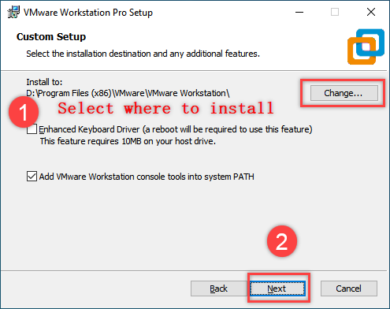


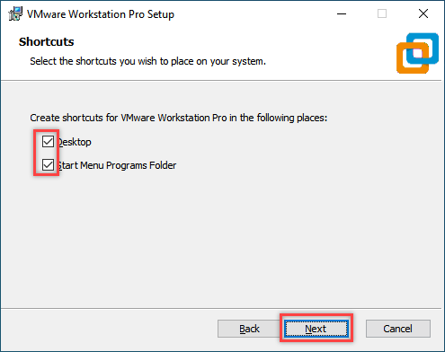

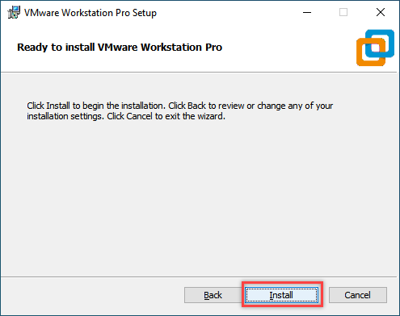


(4) VMware Workstation offers 30-day free trial. After 30-day trial, you can purchase a license key to activate this software. If you need free resource, please contact us via email.


* **VirtualBox Installation**

(1) Open the software installation package in the same directory and click **"Next"**.


(2) Modify the installation path if needed, then click **"Next"**.


(3) No changes needed, just click **"Next"**.


(4) Confirm the installation and click **"Start Installation"**.


(5) Once the installation is complete, click **"Finish"**.


### 8.1.2 Configuration

It is normal for the virtual machine to take a longer time to start for the first time.

The virtual machine interface is as below:

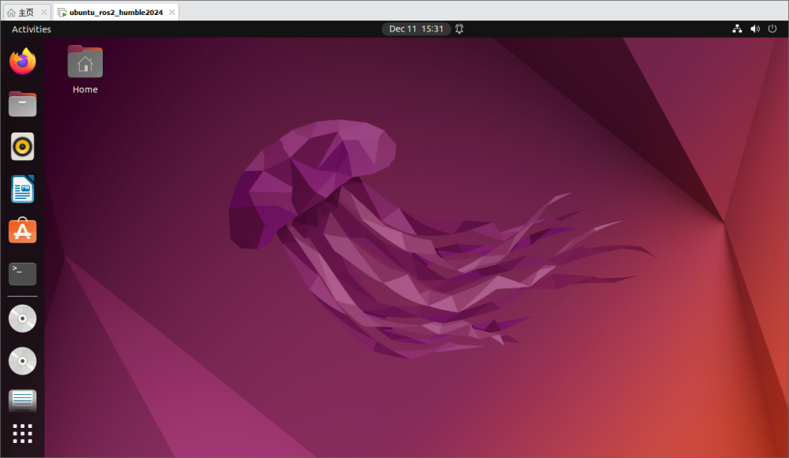

* **Package Import (Performed on Virtual Machine)**

(1) Start the virtual machine. Click the system desktop icon  to open the command-line terminal.

(2) Click the **"Home"** icon 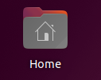 on the desktop to enter the Home directory.

(3) Locate the **"Simulations"** compressed file in the same directory. Drag the compressed file into the Home directory of the virtual machine.

:::{Note}
Only drag one file at a time.
:::

(4) Right-click in the Home directory and select **"Open in terminal"** to open the terminal.


(5) Enter the following command to create a directory:

```
mkdir -p ~/ros2_ws/src
```

(6) Execute the following commands to extract the source files and enter the source directory:

```
unzip ~/hiwonder_moveit_config.zip -d ~/ros2_ws/src
unzip ~/robot_gazebo.zip -d ~/ros2_ws/src
unzip ~/jetrover_description.zip -d ~/ros2_ws/src
```

If prompted to replace files, type `A` and press Enter.

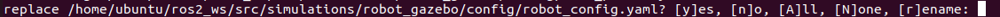

(7) Run the following command to compile the packages and wait for the process to finish:

```
cd ~/ros2_ws && colcon build --symlink-install
```

(8) Run the following command to replace the `.typerc` file:

```
mv /home/ubuntu/.typerc ~/ros2_ws/.typerc
```

(9) Check if the file move was successful by running:

```
cd ~/ros2_ws/ && ls -a
```

(10) To update the settings, reload the configuration file using:

```
source ~/.bashrc
```

* **Network Configuration (Performed in Robot System Desktop)**

To ensure proper communication between the virtual machine and the robot during future operations, we need to configure the device's network settings.

(1) Start the robot and open a terminal 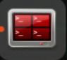 on the desktop.

(2) Enter the following command to configure the WiFi file:

```
cd ~/wifi_manager && gedit wifi_conf.py
```

(3) Modify the configuration to LAN mode and enter the WiFi name and password


(4) Press Ctrl+S to save and close the file.

(5) For subsequent connections, ensure that the device and virtual machine are on the same network segment. You can check this by running the following command in the terminal:

```
ifconfig
```

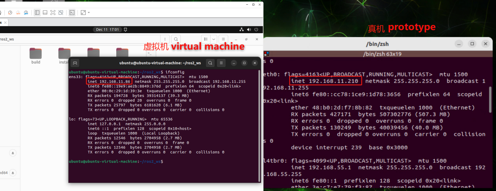

**In this example, both the virtual machine and the robot are on the 192.168.11 network segment, allowing for normal communication.**

**Common connection methods:**

① Via Router (Recommended): Connect the computer and Jetson board to the same router using an Ethernet cable.

② Via Local Area Network (LAN) (Recommended): Configure the STA (station) mode on the WiFi, then connect both the robot and computer to the same WiFi network (or mobile hotspot).

③ Direct Connection (Not Recommended): Set the robot to AP (Access Point) mode, then connect the computer directly to the robot's WiFi.

* **Device ID Configuration (To Be Performed on the Virtual Machine)**

In the previous section, we configured the network environment. However, for the virtual machine and the robot to communicate on the same network, they must have matching ID numbers. Below are the steps to configure the ID:

(1) Start the robot and open a terminal  from the desktop.

(2) The terminal will display the device's `DOMAIN_ID`, as shown below:

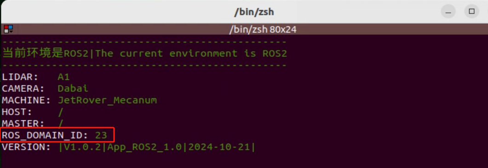

For example, if the `DOMAIN_ID` is 23, we will configure the virtual machine accordingly.

(3) Start the virtual machine and open a terminal  from the desktop.

(4) Enter the following command to open the configuration file:

```
gedit ~/ros2_ws/.typerc
```

(5) Modify the ID in the configuration file to match the robot's `DOMAIN_ID` (e.g., 23):

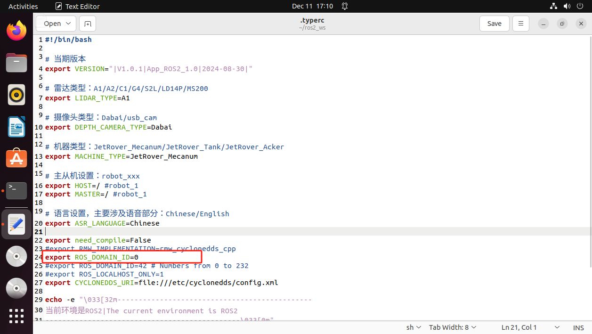

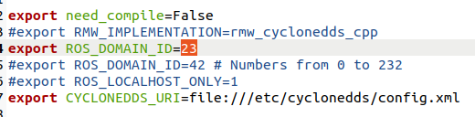

(6) Press Ctrl+S to save the changes and close the file.

(7) Close the current terminal, then open a new terminal. You will observe that the ID has been successfully updated to 23.

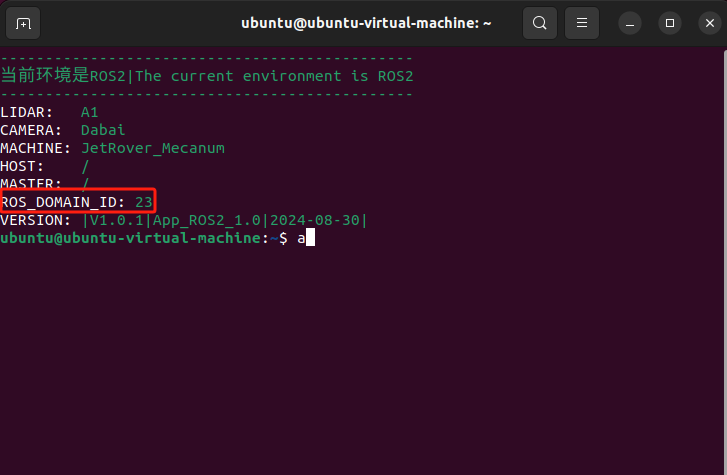

## 8.2 Introduction to URDF Models

:::{Note}
This tutorial is based on configuration and simulation within a virtual machine. If the virtual machine is not yet installed, please first refer to Section 1: Virtual Machine Installation and Configuration to complete the installation.
:::

### 8.2.1 URDF Model Introduction

The Unified Robot Description Format (URDF) is an XML file format widely used in ROS (Robot Operating System) to comprehensively describe all components of a robot.

Robots are typically composed of multiple links and joints. A link is defined as a rigid object with certain physical properties, while a joint connects two links and constrains their relative motion.

By connecting links with joints and imposing motion restrictions, a kinematic model is formed. The URDF file specifies the relationships between joints and links, their inertial properties, geometric characteristics, and collision models.

### 8.2.2 Comparison between Xacro and URDF Model

The URDF model serves as a description file for simple robot models, offering a clear and easily understandable structure. However, when it comes to describing complex robot structures, using URDF alone can result in lengthy and unclear descriptions.

To address this limitation, the xacro model extends the capabilities of URDF while maintaining its core features. The xacro format provides a more advanced approach to describe robot structures. It greatly improves code reusability and helps avoid excessive description length.

For instance, when describing the two legs of a humanoid robot, the URDF model would require separate descriptions for each leg. On the other hand, the xacro model allows for describing a single leg and reusing that description for the other leg, resulting in a more concise and efficient representation.

### 8.2.3 Install URDF Dependency

:::{Note}
The URDF and Xacro models are already pre-installed in the virtual machine, so there is no need for users to reinstall them. This section is for informational purposes only.
:::

(1) Run the following command and press Enter to update the package information:

```
sudo apt update
```


(2) Run the following command and press Enter to install the URDF dependencies:

```
sudo apt-get install ros-humble-urdf
```

When the output matches the image below, the installation is successful:

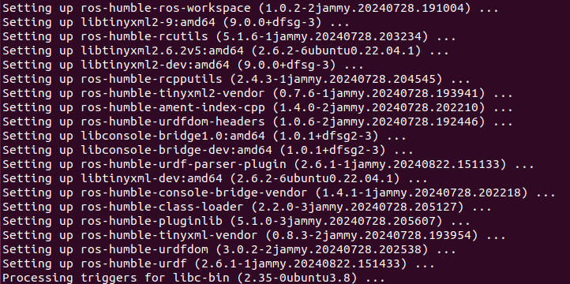

(3) Run the following command and press Enter to install the Xacro model extension for URDF:

```
sudo apt-get install ros-humble-xacro
```

When the output matches the image below, the installation is successful:


### 8.2.4 URDF Model Basic Syntax

* **XML Basic Syntax**

The URDF model is written using XML standard.

**Elements**:

An element can be defined as desired using the following formula:

```xml
<element>
</element>
```

**Properties**:

Properties are included within elements to define characteristics and parameters. Please refer to the following formula to define an element with properties:

```xml
<element
property_1="property value1"
property_2="property value2">
</element>
```

**Comments**:

Comments have no impact on the definition of other properties and elements. Please use the following formula to define a comment:

```xml
<!-- comment content -->
```

* **Link**

The Link element describes the visual and physical properties of the robot's rigid component. The following tags are commonly used to define the motion of a link:


`<visual>`: Describe the appearance of the link, such as size, color and shape.

`<inertial>`: Describe the inertia parameters of the link, which will used in dynamics calculation.

`<collision>`: Describe the collision inertia property of the link

Each tag contains the corresponding child tag. The functions of the tags are listed below.

| **Tag** | **Function** |
|:--:|:--:|
| `origin` | Describe the pose of the link. It contains two parameters, including `xyz` and `rpy`. `xyz` describes the pose of the link in the simulated map. `rpy` describes the pose of the link in the simulated map. |
| `mass` | Describe the mass of the link |
| `inertia` | Describe the inertia of the link. As the inertia matrix is symmetrical, these six parameters need to be input, `ixx`, `ixy`, `ixz`, `iyy`, `iyz` and `izz`, as properties. These parameters can be calculated. |
| `geometry` | Describe the shape of the link. It uses `mesh` parameter to load texture file, and employs `filename` parameters to load the path for texture file. It has three child tags, namely `box`, `cylinder` and `sphere`. |
| `material` | Describe the material of the link. The parameter `name` is the required field. The tag `color` can be used to change the color and transparency of the link. |

* **Joint**

The **"Joint"** tag describes the kinematic and dynamic properties of the robot's joints, including the joint's range of motion, target positions, and speed limitations. In terms of motion style, joints can be categorized into six types.


The following tags will be used to write joint motion.

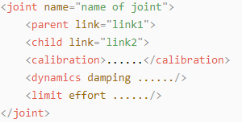

`<parent_link>`: Parent link

`<child_link>`: Child link

`<calibration>`: Calibrate the joint angle

`<dynamics>`: Describes some physical properties of motion

`<limit>`: Describes some limitations of the motion

The function of each tag is listed below. Each tag involves one or several child tags.

| **Tag** | **Function** |
|:--:|:--:|
| `origin` | Describe the pose of the parent link. It involves two parameters, including `xyz` and `rpy`. Both `xyz` and `rpy` describe the pose of the link in simulated map. |
| `axis` | Control the child link to rotate around any axis of the parent link. |
| `limit` | The motion of the child link is constrained using the `lower` and `upper` properties, which define the limits of rotation for the child link. The `effort` properties restrict the allowable force range applied during rotation (values: positive and negative; units: N). The `velocity` properties confine the rotational speed, measured in meters per second (m/s). |
| `mimic` | Describe the relationship between joints. |
| `safety_controller` | Describes the parameters of the safety controller used for protecting the joint motion of the robot. |

* **Robot Tag**

The complete top tags of a robot, including the `<link>` and `<joint>` tags, must be enclosed within the `<robot>` tag. The format is as follows:

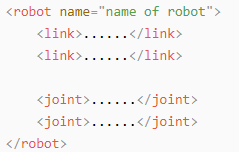

* **gazebo Tag**

This tag is used in conjunction with the Gazebo simulator. Within this tag, you can define simulation parameters and import Gazebo plugins, as well as specify Gazebo's physical properties, and more.


* **Write Simple URDF Model**

(1) Name the model of the robot

To start writing the URDF model, we need to set the name of the robot following this format: `<robot name="robot model name">`. Lastly, input `</robot>` at the end to represent that the model is written successfully.

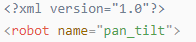

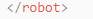

(2) Set links

① To write the first link and use indentation to indicate that it is part of the currently set model. Set the name of the link using the following format: `<link name="link name">`. Finally, conclude with `</link>` to indicate the successful completion of the link definition.

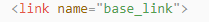

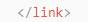

②  Write the link description and use indentation to indicate that it is part of the currently set link, and conclude with `</visual>`.

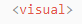

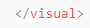

③  The `<geometry>` tag is employed to define the shape of a link. Once the description is complete, include `</geometry>`. Within the `<geometry>` tag, indentation is used to specify the detailed description of the link's shape. The following example demonstrates a link with a cylindrical shape: `<cylinder length="0.01" radius="0.2"/>`. In this instance, `length="0.01"` signifies a length of 0.01 meters for the link, while `radius="0.2"` denotes a radius of 0.2 meters, resulting in a cylindrical shape.

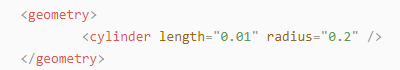

④  The `<origin>` tag is utilized to specify the position of a link, with indentation used to indicate the detailed description of the link's position. The following example demonstrates the position of a link: `<origin rpy="0 0 0" xyz="0 0 0" />`. In this example, `rpy` represents the roll, pitch, and yaw angles of the link, while `xyz` represents the coordinates of the link's position. This particular example indicates that the link is positioned at the origin of the coordinate system.


⑤  The `<material>` tag is used to define the visual appearance of a link, with indentation used to specify the detailed description of the link's color. To start describing the color, include `<material>`, and end with `</material>` when the description is complete. The following example demonstrates setting a link color to yellow: `<color rgba="1 1 0 1" />`. In this example, `rgba="1 1 0 1"` represents the color threshold for achieving a yellow color.

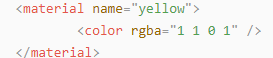

**Set joint**

(1) To write the first joint, use indentation to indicate that the joint belongs to the current model being set. Then, specify the name and type of the joint as follows: `<joint name="joint name" type="joint type">`. Finally, include `</joint>` to indicate the completion of the joint definition.

:::{Note}
To learn about the type of the joint, please refer to **"Joint"** section.
:::

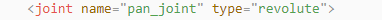

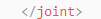

(2) Write the description section for the connection between the link and the joint. Use indentation to indicate that it is part of the currently defined joint. The parent parameter and child parameter should be set using the following format: `<parent link="parent link"/>`, and `<child link="child link" />`. With the parent link serving as the pivot, the joint rotates the child link.

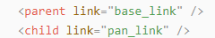

(3) `<origin>` describes the position of the joint using indention. This example describes the position of the joint: `<origin xyz="0 0 0.1" />`. `xyz` is the coordinate of the joint.

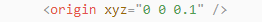

(4) `<axis>` describes the position of the joint adopting indention. `<axis xyz="0 0 1" />` describes one posture of a joint. `xyz` specifies the pose of the joint.

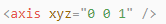

(5) `<limit>` imposes restrictions on the joint using indention. The `<limit>` tag is used to restrict the motion of a joint, with indentation indicating the specific description of the joint angle limitations. The following example describes a joint with a maximum force limit of 300 Newtons, an upper limit of 3.14 radians, and a lower limit of -3.14 radians. The settings are defined as follows: `effort="joint force (N)"`, `velocity="joint motion speed"`, `lower="lower limit in radians"`, `upper="upper limit in radians"`.


(6) `<dynamics>` describes the dynamics of the joint using indention. `<dynamics damping="50" friction="1" />` describes dynamics parameters of a joint.

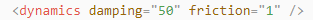

The complete codes are as below.

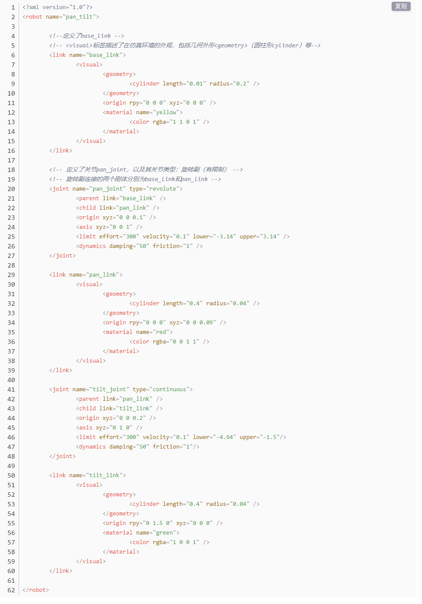

### 8.2.5 ROS Robot URDF Model Instructions

* **Preparation**

To understand the URDF model, you can refer to the **"URDF Model Basic Syntax"** section. This section provides a brief analysis of the robot model code and component models.

* **Viewing the Robot Model Code**

(1) Start the virtual machine and click the icon  to open the command-line terminal.

(2) Enter the following command and press Enter to navigate to the startup program directory:

```
cd ros2_ws/src/jetrover_description/urdf/
```

(3) Enter the following command to open the robot simulation model file:

```
vim jetrover.xacro
```

(4) Find the code section shown in the image below:

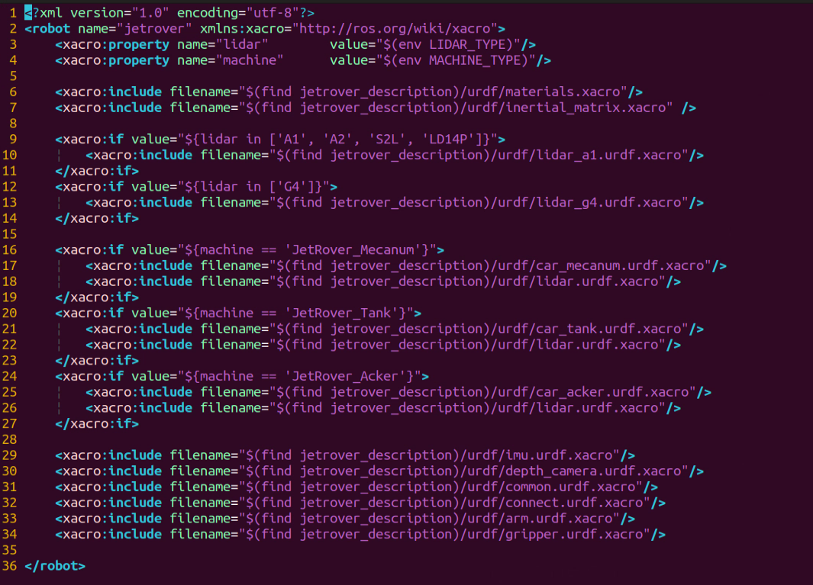

Multiple URDF models are called to form the complete robot.

| **File Name** | **Device** |
|:--:|:--:|
| `materials` | Color |
| `inertial_matrix` | Inertia Matrix |
| `lidar_a1` | A1 Lidar |
| `lidar_g4` | G4 Lidar |
| `car_mecanum` | Mecanum Wheel Chassis |
| `car_tank` | Tank Chassis |
| `car_acker` | Ackermann Chassis |
| `Imu` | Inertial Measurement Unit (IMU) |
| `depth_camera` | Depth Camera |
| `common` | Shared or Common Components/Attributes |
| `connect` | Connectors, Describing Physical Connections between Components |
| `arm` | Robotic Arm |
| `gripper` | Gripper (Claw) |
| `arm.transmission` | Robotic Arm Transmission Structure |
| `gripper.transmission` | Gripper Transmission Structure |

* **Brief Analysis of the Robot's Main Model**

The JetRover has three types of chassis: Mecanum, Tank, and Ackermann. This section explains the Ackermann chassis model, while the Mecanum and Tank chassis model files are largely the same, with differences explained later in this document.

Open a new terminal and enter the command to open the robot model file. This file contains descriptions of the various parts of the robot model.

```
vim car_acker.urdf.xacro
```

{lineno-start=2}
```xml
<robot name="jetrover" xmlns:xacro="http://ros.org/wiki/xacro" >
```

This is the beginning of the URDF file. It specifies the XML version and encoding, and defines a robot model named **"jetrover"** The `xmlns:xacro` namespace is used here to define Xacro macros that generate the URDF.

The following line of code defines a Xacro property named `M_PI` and sets its value to the constant π:

{lineno-start=3}
```xml
  <xacro:property name="M_PI"               value="3.1415926535897931"/>
```

A link named `base_footprint` is defined here, which represents the robot's chassis:

{lineno-start=4}
```xml
  <link name="base_footprint"/>
```

The robot's characteristics, such as mass, width, height, and depth, are described as properties:

{lineno-start=5}
```xml
  <xacro:property name="base_link_mass"     value="1.6" /> 
  <xacro:property name="base_link_w"        value="0.30"/>
  <xacro:property name="base_link_h"        value="0.15"/>
  <xacro:property name="base_link_d"        value="0.10"/>
```

The next section of code defines a joint called `base_joint`, which is of the **"fixed"** type, indicating that it is a fixed joint. This joint connects a parent link named `base_footprint` and a child link named `base_link`. The joint's position (origin) is specified using an `xyz` attribute, where `${0.05 + 0.0654867643253843}` is an expression representing a calculated result.

The code then defines a link named `w_link`, which represents a link component.

Finally, another fixed joint named `w_joint` is defined, connecting the `base_link` as the parent link and `w_link` as the child link. The joint's position (origin) and axis (axis) are set with some default values.

{lineno-start=53}
```xml
    <name="base_green_link">
    <inertial>
      <origin
        xyz="-0.00566619792766996 -8.64872034993854E-05 -0.0425908261638196"
        rpy="0 0 0" />
      <mass
        value="0.116775968880593" />
      <inertia
        ixx="0.000202777869278958"
        ixy="3.71841760667043E-08"
        ixz="-1.46801173735848E-10"
        iyy="0.000573255296584491"
        iyz="9.13614188570706E-11"
        izz="0.000745426117180395" />
    </inertial>
    <visual>
      <origin
        xyz="0 0 0"
        rpy="0 0 0" />
      <geometry>
        <mesh
          filename="package://jetrover_description/meshes/acker/base_green_link.stl" />
      </geometry>
      <material name="green"/>
    </visual>
    <collision>
      <origin
        xyz="0 0 0"
        rpy="0 0 0" />
      <geometry>
        <mesh
          filename="package://jetrover_description/meshes/acker/base_green_link.stl" />
      </geometry>
    </collision>
  </link>
```

The following code is an XML snippet that defines a link in a robot model. Let's break down and analyze its structure and purpose.

The code begins with the `<link>` tag, which defines a link in the robot model. The name of this link is `base_green_link`. Inside the `<link>` tag, there are three main sections: `<inertial>`, `<visual>`, and `<collision>`.

The `<inertial>` Section defines the inertial properties of the link, such as mass and inertia. It includes the `<origin>` tag, which specifies the position and orientation of the inertia coordinate system relative to the link's coordinate system. The `<mass>` tag specifies the mass of the link, and the `<inertia>` tag defines the link's moment of inertia about its principal axes.

The `<visual>` Section defines the visual representation of the link. It contains the `<origin>` tag, which specifies the position and orientation of the visual coordinate system relative to the link's coordinate system. The `<geometry>` tag defines the shape of the visual representation, in this case, a mesh. The `<mesh>` tag specifies the file name of the mesh file that represents the link's visual appearance. Finally, the `<material>` tag defines the color or texture of the visual representation, with the material here named **"green".**

The `<collision>` Section defines the collision properties of the link. This section is similar to the `<visual>` section but is used for collision detection instead of visualization. It contains the `<origin>` tag and the `<geometry>` tag, which define the position, orientation, and shape of the collision representation.

Overall, this XML code defines a link in the robot model, including its inertial properties, visual representation, and collision properties. In simulation or visualization environments, the mesh files specified in the `<visual>` and `<collision>` sections are used for rendering and collision detection.

{lineno-start=29}
```xml
  <link
    name="base_link">
    <xacro:box_inertial m="${base_link_mass}" w="${base_link_w}" h="${base_link_h}" d="${base_link_d}" x="0" y="0" z="-0.15" />
    <visual>
      <origin
        xyz="0 0 0"
        rpy="0 0 0" />
      <geometry>
        <mesh
          filename="package://jetrover_description/meshes/acker/base_link.stl" />
      </geometry>
      <material name="black"/>
    </visual>
    <collision>
      <origin
        xyz="0 0 0"
        rpy="0 0 0" />
      <geometry>
        <mesh
          filename="package://jetrover_description/meshes/acker/base_link.stl" />
      </geometry>
    </collision>
```

The following code describes a joint named `base_green_joint` with the type **"fixed"**, meaning it is a fixed joint. The parent of the joint is the link named `base_link`, and the child is the link named `base_green_link`. The joint's coordinate origin (origin) is at (0, 0, 0), with Euler angles (rpy) set to (0, 0, 0). No axis (axis) is defined for this joint.

{lineno-start=53}
```xml
    <name="base_green_link">
    <inertial>
      <origin
        xyz="-0.00566619792766996 -8.64872034993854E-05 -0.0425908261638196"
        rpy="0 0 0" />
      <mass
        value="0.116775968880593" />
      <inertia
        ixx="0.000202777869278958"
        ixy="3.71841760667043E-08"
        ixz="-1.46801173735848E-10"
        iyy="0.000573255296584491"
        iyz="9.13614188570706E-11"
        izz="0.000745426117180395" />
    </inertial>
    <visual>
      <origin
        xyz="0 0 0"
        rpy="0 0 0" />
      <geometry>
        <mesh
          filename="package://jetrover_description/meshes/acker/base_green_link.stl" />
      </geometry>
      <material name="green"/>
    </visual>
    <collision>
      <origin
        xyz="0 0 0"
        rpy="0 0 0" />
      <geometry>
        <mesh
          filename="package://jetrover_description/meshes/acker/base_green_link.stl" />
      </geometry>
    </collision>
  </link>
```

Next, let's take a look at the description of the link.

{lineno-start=101}
```xml
  <link
    name="wheel_left_front_link">
    <inertial>
      <origin
        xyz="-0.213334280297957 -0.203369638948946 -0.000334615151787748"
        rpy="0 0 0" />
      <mass
        value="0.124188560741815" />
      <inertia
        ixx="0.000108426797272382"
        ixy="4.75710998528631E-10"
        ixz="-4.51221408656634E-09"
        iyy="0.000198989755900859"
        iyz="1.62770134465076E-11"
        izz="0.000108425820065752" />
    </inertial>
    <visual>
      <origin
        xyz="0 0 0"
        rpy="0 0 0" />
      <geometry>
        <mesh
          filename="package://jetrover_description/meshes/acker/wheel_left_front_link.stl" />
      </geometry>
      <material name="black"/>
    </visual>
    <collision>
      <origin
        xyz="0 0 0"
        rpy="0 0 0" />
      <geometry>
        <mesh
          filename="package://jetrover_description/meshes/acker/wheel_left_front_link.stl" />
      </geometry>
    </collision>
  </link>
```

The code above describes a link named `wheel_left_front_link`. The link contains information on its inertia, visual appearance, and collision properties.

(1) Inertia: This section describes the link's mass and inertia matrix. The mass is 0.124188560741815, and the components of the inertia matrix are also specified with exact values. 

(2) Visual: This section defines the appearance of the link. The link's appearance is represented by a 3D model (mesh) with the file name [package://hiwonder_description/meshes/acker/wheel_left_front_link.stl](). The link also uses a material named **"black".**

(3) Collision: This section defines the collision shape of the link. The collision shape is also represented by a 3D model (mesh), and the file name is the same as that used in the visual section.

The following XML snippet defines a joint and a link in a robot model:

* **Joint Definition**:

(1) Name: `wheel_left_back_joint`

(2) Type: **"fixed"** (indicating a fixed joint)

(3) Origin: Specifies the position and orientation of the joint relative to the parent link (`base_link`).

(4) Parent Link: Specifies the parent link of the joint.

(5) Child Link: Specifies the child link of the joint.

(6) Axis: Specifies the rotation axis of the joint. In this case, the axis is set to (0, 0, 0), indicating that it is a fixed joint and does not rotate.

* **Link Definition**:

(1) Name: `wheel_left_back_link`

(2) Inertia: Specifies the inertia properties of the link, including mass, center of mass, and inertia matrix.

(3) Visual: Specifies the visual representation of the link, including its position, orientation, geometry (mesh), and material.

(4) Collision: Specifies the collision properties of the link, including its position, orientation, and geometry (mesh).

{lineno-start=150}
```xml
  <link
    name="wheel_left_back_link">
    <inertial>
      <origin
        xyz="0.213327728411634 -0.202539554308172 0.000327384188806199"
        rpy="0 0 0" />
      <mass
        value="0.132308742016336" />
      <inertia
        ixx="0.000109087078613509"
        ixy="8.99498920521203E-09"
        ixz="1.06792966043121E-08"
        iyy="0.000199665017441936"
        iyz="5.6160921837198E-09"
        izz="0.000109056977556842" />
    </inertial>
    <visual>
      <origin
        xyz="0 0 0"
        rpy="0 0 0" />
      <geometry>
        <mesh
          filename="package://jetrover_description/meshes/acker/wheel_left_back_link.stl" />
      </geometry>
      <material name="black"/>
    </visual>
    <collision>
      <origin
        xyz="0 0 0"
        rpy="0 0 0" />
      <geometry>
        <mesh
          filename="package://jetrover_description/meshes/acker/wheel_left_back_link.stl" />
      </geometry>
    </collision>
  </link>
  <joint
    name="wheel_left_back_joint"
    type="fixed">
    <origin
      xyz="0.106753653016542 -0.0920004072996187 -0.0658214520621466"
      rpy="0 0 3.14158803228829" />
    <parent
      link="base_link" />
    <child
      link="wheel_left_back_link" />
    <axis
      xyz="0 0 0" />
  </joint>
  <link
```

* **Link Definition**

(1) Name: `wheel_right_front_link`

(2) Inertia: Specifies the inertia properties of the link, including mass, center of mass, and inertia matrix. In this example, the link's mass is 0.124186629923608, and specific values are provided for the inertia matrix components (`ixx`, `ixy`, `ixz`, `iyy`, `iyz`, `izz`).

(3) Visual: Specifies the visual representation of the link, including its position, orientation, geometry (mesh), and material. The visual representation uses a mesh with the file name `package://hiwonder_description/meshes/acker/wheel_right_front_link.stl` and a material called **"black".**

(4) Collision: Specifies the collision properties of the link, including its position, orientation, and geometry (mesh). In this case, the collision properties are identical to the visual properties, both using the same mesh.

{lineno-start=1}
```xml
<?xml version="1.0" encoding="utf-8"?>
<robot name="jetrover" xmlns:xacro="http://ros.org/wiki/xacro">
    <xacro:property name="lidar"        value="$(env LIDAR_TYPE)"/>
    <xacro:property name="machine"      value="$(env MACHINE_TYPE)"/>

    <xacro:include filename="$(find jetrover_description)/urdf/materials.xacro"/>
    <xacro:include filename="$(find jetrover_description)/urdf/inertial_matrix.xacro" />

    <xacro:if value="${lidar in ['A1', 'A2', 'S2L', 'LD14P']}">
        <xacro:include filename="$(find jetrover_description)/urdf/lidar_a1.urdf.xacro"/>
    </xacro:if>
    <xacro:if value="${lidar in ['G4']}">
        <xacro:include filename="$(find jetrover_description)/urdf/lidar_g4.urdf.xacro"/>
    </xacro:if>

    <xacro:if value="${machine == 'JetRover_Mecanum'}">
        <xacro:include filename="$(find jetrover_description)/urdf/car_mecanum.urdf.xacro"/>
        <xacro:include filename="$(find jetrover_description)/urdf/lidar.urdf.xacro"/>
    </xacro:if>
    <xacro:if value="${machine == 'JetRover_Tank'}">
        <xacro:include filename="$(find jetrover_description)/urdf/car_tank.urdf.xacro"/>
        <xacro:include filename="$(find jetrover_description)/urdf/lidar.urdf.xacro"/>
    </xacro:if>
    <xacro:if value="${machine == 'JetRover_Acker'}">
        <xacro:include filename="$(find jetrover_description)/urdf/car_acker.urdf.xacro"/>
        <xacro:include filename="$(find jetrover_description)/urdf/lidar.urdf.xacro"/>
    </xacro:if>

    <xacro:include filename="$(find jetrover_description)/urdf/imu.urdf.xacro"/>
    <xacro:include filename="$(find jetrover_description)/urdf/depth_camera.urdf.xacro"/>
    <xacro:include filename="$(find jetrover_description)/urdf/common.urdf.xacro"/>
    <xacro:include filename="$(find jetrover_description)/urdf/connect.urdf.xacro"/>
    <xacro:include filename="$(find jetrover_description)/urdf/arm.urdf.xacro"/>
    <xacro:include filename="$(find jetrover_description)/urdf/gripper.urdf.xacro"/>
</robot>
```


The following code describes a fixed joint that connects two links, named `base_link` and `wheel_right_front_link`. The joint's starting position and rotation are specified using the `<origin>` tag.

(1) `name="wheel_right_front_joint"`: This attribute specifies the name of the joint, which is `wheel_right_front_joint`.

(2) `type="fixed"`: This attribute specifies the type of the joint, which is **"fixed".** This means the joint is stationary and does not allow movement.

(3) `<origin>` tag: This tag defines the joint's starting position and rotation. Specifically, it specifies the joint's xyz coordinates as **"-0.10658 0.091851 -0.065487"** and the rpy (roll, pitch, yaw) rotation angles as **"0 0 3.1416".**

(4) `<parent>` tag: This tag specifies the parent link of the joint, which is `base_link`. This means the joint is attached to the `base_link` link.

(5) `<child>` tag: This tag specifies the child link of the joint, which is `wheel_right_front_link`. This means the joint connects to the `wheel_right_front_link` link.

(6) `<axis>` tag: This tag defines the joint's axis. In this case, the axis is set to (0, 0, 0), indicating that there is no specific axis.

{lineno-start=235}
```xml
  <joint
    name="wheel_right_front_joint"
    type="fixed">
    <origin
      xyz="-0.10658 0.091851 -0.065487"
      rpy="0 0 3.1416" />
    <parent
      link="base_link" />
    <child
      link="wheel_right_front_link" />
    <axis
      xyz="0 0 0" />
  </joint>
```

The following describes a link named `wheel_right_back_link`, including its inertia, visual, and collision properties. The link's geometry is defined using a mesh file, and its visual properties specify a black material.

(1) `name="wheel_right_back_link"`: This attribute specifies the name of the link, which is `wheel_right_back_link`.

(2) `<inertial>` tag: This tag defines the link's inertia properties, including mass and inertia matrix.

(3) `<origin>` tag: This tag defines the origin of the link's inertia, specifying its position and rotation. Specifically, it sets the xyz coordinates to **"0.21333 0.20224 0.00032742"** and the rpy rotation angles to **"0 0 0".**

(4) `<mass>` tag: This tag defines the mass of the link, which is **"0.13231".**

(5) `<inertia>` tag: This tag defines the link's inertia matrix, including the values for `ixx`, `ixy`, `ixz`, `iyy`, `iyz`, and `izz`.

(6) `<visual>` tag: This tag defines the visual properties of the link, including its appearance and material.

(7) `<origin>` tag: This tag defines the origin of the link's visual properties, specifying its position and rotation. Specifically, it sets the xyz coordinates to **"0 0 0"** and the rpy rotation angles to **"0 0 0".**

(8) `<geometry>` tag: This tag defines the geometry of the link, which is specified by a mesh file.

(9) `<mesh>` tag: This tag specifies the mesh file used for the link's geometry, which is `package://hiwonder_description/meshes/acker/wheel_right_back_link.stl`.

(10) `<material>` tag: This tag defines the material of the link, which is **"black".**

(11) `<collision>` tag: This tag defines the collision properties of the link, including its geometry.

(12) `<origin>` tag: This tag defines the origin of the link's collision properties, specifying its position and rotation. Specifically, it sets the xyz coordinates to **"0 0 0"** and the rpy rotation angles to **"0 0 0".**

(13) `<geometry>` tag: This tag defines the geometry of the link for collision detection, which is specified by the same mesh file.

(14) `<mesh>` tag: This tag specifies the mesh file used for the link's collision geometry, which is `package://hiwonder_description/meshes/acker/wheel_right_back_link.stl`.

{lineno-start=248}
```xml
  <link
    name="wheel_right_back_link">
    <inertial>
      <origin
        xyz="0.21333 0.20224 0.00032742"
        rpy="0 0 0" />
      <mass
        value="0.13231" />
      <inertia
        ixx="0.00010909"
        ixy="-8.0297E-09"
        ixz="1.1828E-08"
        iyy="0.00019967"
        iyz="-6.196E-09"
        izz="0.00010906" />
    </inertial>
    <visual>
      <origin
        xyz="0 0 0"
        rpy="0 0 0" />
      <geometry>
        <mesh
          filename="package://jetrover_description/meshes/acker/wheel_right_back_link.stl" />
      </geometry>
      <material name="black"/>
    </visual>
    <collision>
      <origin
        xyz="0 0 0"
        rpy="0 0 0" />
      <geometry>
        <mesh
          filename="package://jetrover_description/meshes/acker/wheel_right_back_link.stl" />
      </geometry>
    </collision>
  </link>
```

The following code describes a joint named `wheel_right_back_joint`.

(1) `<joint>`: This is the start tag for a joint element.

(2) `name="wheel_right_back_joint"`: This attribute specifies the name of the joint, which is `wheel_right_back_joint`.

(3) `type="fixed"`: This attribute specifies the joint type as **"fixed"**, meaning it is a fixed joint and does not allow motion.

(4) `<origin>`: This is the start tag for the origin element, which defines the joint's position and orientation.

(5) `xyz="0.10675 0.091848 -0.065821"`: This attribute defines the joint's position in 3D space with coordinates (0.10675, 0.091848, -0.065821).

(6) `rpy="0 0 3.1416"`: This attribute defines the joint's orientation using Euler angles. The roll, pitch, and yaw angles are 0, 0, and 3.1416, respectively.

(7) `<parent>`: This is the start tag for the parent link element, which defines the joint's parent link.

(8) `link="base_link"`: This attribute specifies the parent link of the joint as `base_link`.

(9) `<child>`: This is the start tag for the child link element, which defines the joint's child link.

(10) `link="wheel_right_back_link"`: This attribute specifies the child link of the joint as `wheel_right_back_link`.

(11) `<axis>`: This is the start tag for the axis element, which defines the joint's axis.

(12) `xyz="0 0 0"`: This attribute specifies the joint's axis as (0, 0, 0), meaning no axis is defined.

(13) `</joint>`: This is the end tag for the joint element.

```xml
 <joint
    name="wheel_right_back_joint"
    type="fixed">
    <origin
      xyz="0.10675 0.091848 -0.065821"
      rpy="0 0 3.1416" />
    <parent
      link="base_link" />
    <child
      link="wheel_right_back_link" />
    <axis
      xyz="0 0 0" />
  </joint>
```

## 8.3 MoveIt2 Simulation

:::{Note}
This tutorial uses a virtual machine as an example for configuration and learning. If you have not installed a virtual machine, refer to section 8.1 Virtual Machine Installation and Configuration for installation instructions before proceeding.
:::

### 8.3.1 MoveIt2 Kinematics Design

* **Kinematics Introduction**

Kinematics is a branch of mechanics that describes and studies the changes in the position of an object over time from a geometric perspective, without involving the physical properties of the object or the forces applied to it. In robotics, forward kinematics and inverse kinematics are two methods used to solve the motion of robots.

Forward Kinematics involves determining the position and orientation of the end effector by knowing the values of the joint variables. In other words, it calculates the final position and orientation of the robot based on the angles of the servos.

Inverse Kinematics involves determining the required joint variables to achieve a desired position and orientation of the end effector. In this case, it calculates the angles that the servos need to rotate to achieve the final position and orientation of the robot.

* **Geometric Method**

For a robotic arm, the geometric method involves determining the rotation angles of each joint after specifying the position and orientation of the end effector. Since the 3D motion of a robotic arm is quite complex, we simplify the model by removing the rotational joint of the lower platform. This allows us to analyze the kinematics in a 2D plane.

Inverse kinematics analysis generally involves extensive matrix computations, making the process complex and computationally intensive, which can make implementation challenging. To better suit our needs, we use the geometric method for analyzing the robotic arm.


We simplify the model of the robotic arm by removing the base platform and actuator section, resulting in the main body of the arm. From the diagram above, we can see that the coordinates (x, y) of the end effector P are composed of three parts: (x1 + x2 + x3, y1 + y2 + y3).

In the diagram, θ1, θ2, and θ3 are the joint angles of the servos that we need to calculate, and α is the angle between the gripper and the horizontal plane. From the diagram, it is clear that the angle of the gripper from the top view, α, is equal to θ1 + θ2 + θ3. Using this, we can derive the following equation:

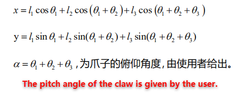

Where x and y are provided by the user, and l1, l2, and l3 are the inherent properties of the robotic arm's structure.

To simplify the calculations, we process the known parts and consider them as a whole:


Substituting m and n into the existing equation and simplifying, we get:


By solving this equation, we obtain:


This result corresponds to the quadratic formula for solving a single-variable equation, where:


From this, we can calculate the angle of θ1, and similarly, we can calculate θ2. With all three servo angles determined, we can then control the servos based on these angles to achieve the desired position.

* **DH Modelling**

The DH Parameter Table (Denavit-Hartenberg Parameter Table) is a standardized method used to describe the relative position and orientation of robotic arm joints and links. It uses four parameters to represent the relationship between each pair of adjacent joints. These four DH parameters have very clear physical meanings, as described below:

(1) Link Length: The length of the common normal between the axes of two adjacent joints (the rotation axis for rotational joints, the translation axis for prismatic joints).

(2) Link Twist: The angle by which the axis of one joint is rotated around the common normal relative to the axis of the adjacent joint.

(3) Link Offset: The distance along the axis of a joint between the common normal of the current joint and the common normal of the next joint.

(4) Joint Angle: The angle of rotation around the joint axis between the common normal of the current joint and the common normal of the next joint.

While these definitions might seem complex, they become much clearer when viewed in the context of coordinate systems.

First, you should focus on the two most important **"lines"**:

(1) The axis of a joint (axis).

(2) The common normal between the axis of one joint and the axis of the adjacent joint (common normal).

In the DH parameter system, we define the axis as the z-axis, and the common normal as the x-axis, where the direction of the x-axis is from the current joint to the next joint.

However, these two rules alone are not enough to fully determine the coordinate system of each joint. Let's now go over the detailed steps for determining the coordinate system.

In applications such as robotic arm simulations, we may use other methods to establish coordinate systems. However, understanding the method described here is crucial for grasping the mathematical expressions of robotic arms and for understanding the subsequent analyses.

The diagram below shows two typical robot joints. Although these joints and links may not resemble any specific joints or links from real robots, they are quite common and can easily represent any joint in a real robot.

This revision simplifies and clarifies the explanation, making it easier for users to understand the concepts and how they relate to the coordinate system in robotic arms.


* **Determine Coordinate System**

There are generally several steps involved in determining the coordinate system:

To model a robot using the DH (Denavit-Hartenberg) notation, the first step is to assign a reference coordinate system to each joint. For each joint, both the Z-axis and the X-axis must be specified.

(1) Defining the Z-axis:

① For a rotational joint, the Z-axis is aligned with the direction of rotation according to the right-hand rule. The joint variable is the rotation angle around the Z-axis.

② For a prismatic joint (sliding joint), the Z-axis aligns with the direction of linear motion. The joint variable is the length of travel along the Z-axis.

(2) Defining the X-axis:

① When two joints are neither parallel nor intersecting, the Z-axis is typically diagonal. However, there is always one shortest perpendicular line (common normal) between them, which is orthogonal to both Z-axes. The X-axis is defined along this common normal.

② If `a_n` represents the common normal between the Z-axes of joint `n` and joint `n+1`, then the direction of the X-axis, `X_n`, will be along `a_n`.

(3) Special Cases:

① When the Z-axes of two joints are parallel, there are infinitely many common normal lines. In this case, one can choose the common normal that is collinear with the common normal of the previous joint, simplifying the model.

② When the Z-axes of two joints intersect, there is no common normal. In this case, the X-axis can be defined along the line perpendicular to the plane formed by the two axes, simplifying the model.

Once the coordinate system is assigned to each joint, the model can be represented as shown in the diagram below:


After determining the coordinate system, we can represent the four parameters more simply:

Link Length `l_i`: Defined as the distance along the positive `X_{i-1}` axis from `Z_{i-1}` axis to `Z_i`.

Link Twist `α_i`: Defined as the angle of rotation along the positive direction `X_{i-1}` (using the left-hand or right-hand rule?) between `Z_{i-1}` and `Z_i`.

Joint Offset `d_i`: Defined as the distance along the positive `Z_{i-1}` axis from `X_{i-1}` axis to the `X_i`.

Joint Angle `θ_i`: Defined as the rotational angle between `X_{i-1}` and `X_i` along the positive direction `Z_{i-1}`, using the right-hand rule (or left-hand rule, depending on the convention).

* **Base Coordinate System**

At the position of the robotic arm's base, in the diagram below, the origin is located at the bottom servo, with the green axis representing the X-axis, the red axis representing the Y-axis, and the blue axis representing the Z-axis.

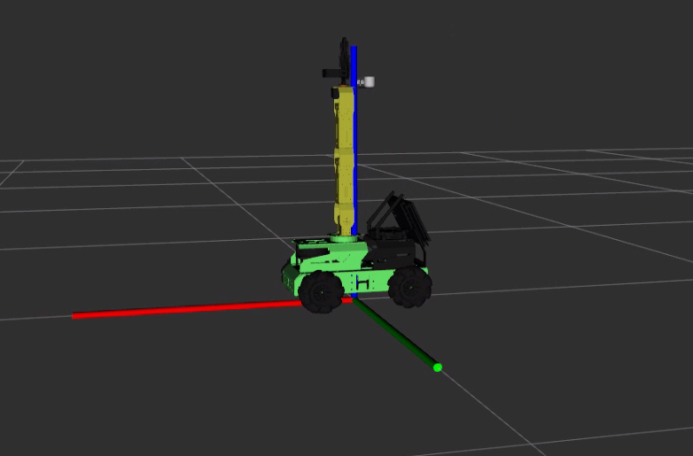

* **Joint Coordinate System**

The robotic arm consists of two key components: the rotational joints and the links. In the robotic arm model shown below, the coordinate system for each joint is represented with the origin at the position of the pink cone, where the green axis is the X-axis, the red axis is the Y-axis, and the blue axis is the Z-axis.

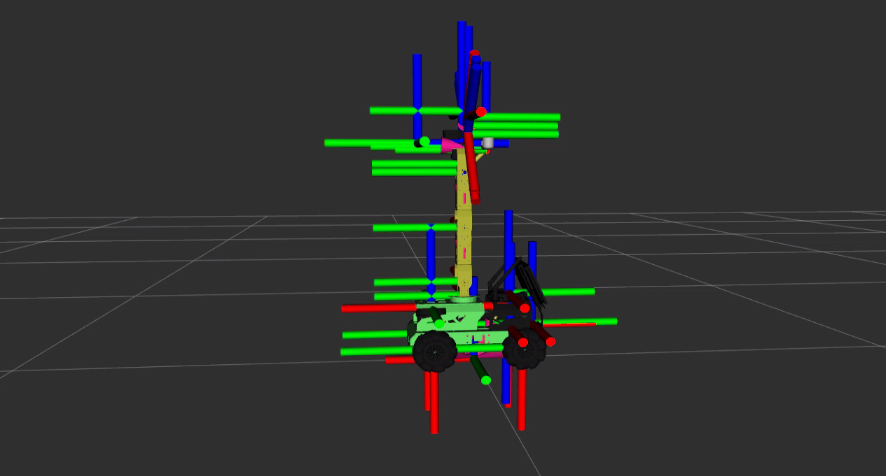

* **Tool Coordinate System**

At the end of the robotic arm, a tool is typically attached to meet the requirements of different tasks. The default tool on the robotic arm is the gripper. In the robotic arm model shown below, the coordinate system of the gripper tool has its origin at the position of the pink cone, with the green axis as the X-axis, the red axis as the Y-axis, and the blue axis as the Z-axis.

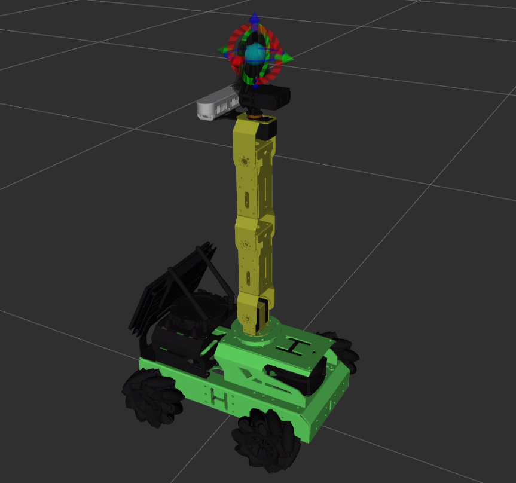

### 8.3.2 MoveIt2 Configuration

* **MoveIt2 Introduction**

MoveIt2 is an open-source robotic motion planning framework specifically designed for ROS 2. It enables complex motion control and path planning for robots and serves as the ROS 2 version of MoveIt, a highly popular motion planning framework in ROS.

Compared to MoveIt1, MoveIt2 offers enhanced support for real-time control, thanks to improvements in ROS 2. These advancements allow for more precise and reliable robot motion control. By adopting DDS (Data Distribution Service) as its communication middleware, ROS 2 enables MoveIt2 to achieve more flexible and efficient data transmission.

MoveIt2 provides a user-friendly platform for developing advanced robotic applications, evaluating new robot designs, and integrating robotic solutions into various architectures. It is widely applied across industries, commercial ventures, research, and other fields, making it one of the most popular open-source robotic software solutions available today.

Additionally, MoveIt2 offers a suite of robust plugins and tools for the quick configuration of robotic arm control. It also provides a wealth of APIs, enabling users to easily perform secondary development on MoveIt2 modules and create innovative applications.

* **Launching the Configuration Program**

:::{Note}
When entering commands, ensure case sensitivity is strictly observed. You can use the **"Tab"** key to auto-complete keywords.
:::

(1) Start the virtual machine. Click the icon  on the system desktop to open the terminal command line.

(2) Execute the following command to launch the MoveIt2 setup assistant.

```
ros2 launch moveit_setup_assistant setup_assistant.launch.py
```

(3) Click **"Edit Existing MoveIt2 Configuration Package"** to begin editing an existing configuration package.


(4) Click **"Browse"** and navigate to the following directory: **home/ubuntu/ros2_ws/src/hiwonder_moveIt_config**; Select the folder and click **"Open".**


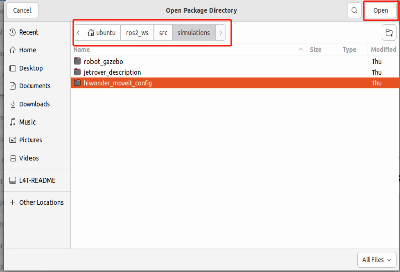

(5) Click **"Load Files"** and wait for the files to load.


Once the progress reaches 100%, the robot model will appear on the right side, indicating a successful load.

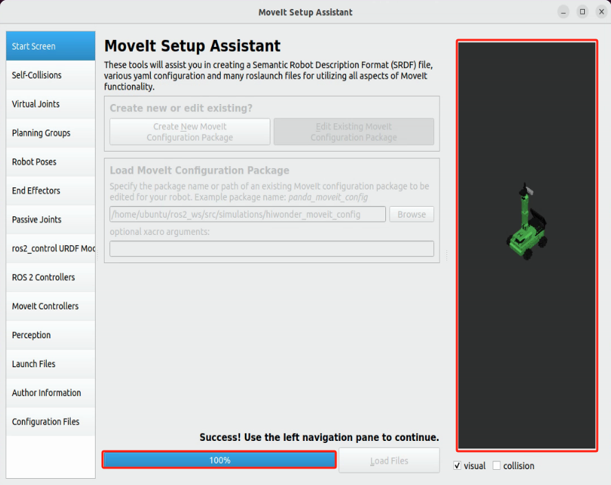

(6) Adjust settings for options such as **"Virtual Joints"** and **"Robot Pose"** in the left-hand menu.

:::{Note}
Reconfiguring will overwrite previous settings. Errors during this process may result in functionality issues.
:::

* **Configuration Introduction**

The default collision matrix generator scans all joints of the robot. This custom collision matrix can safely disable specific collision checks, thereby reducing the processing time for motion planning.

Sampling Density:

Sampling density refers to the number of random joint configurations sampled to check for collisions. Higher density increases computation time. The default value is 10,000 collision checks.

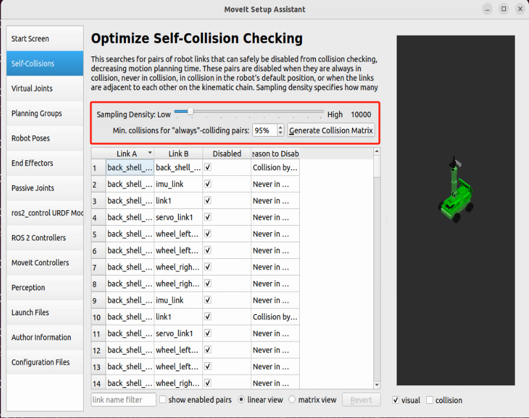

* **Virtual joints**

Virtual joints are primarily used to connect the robot to a simulation environment. In this step, a virtual joint is defined to link the `base_footprint` frame to the `world_frame`.


* **Planning Groups**

Joint groups are used to define the various joint components required to assemble the robot.

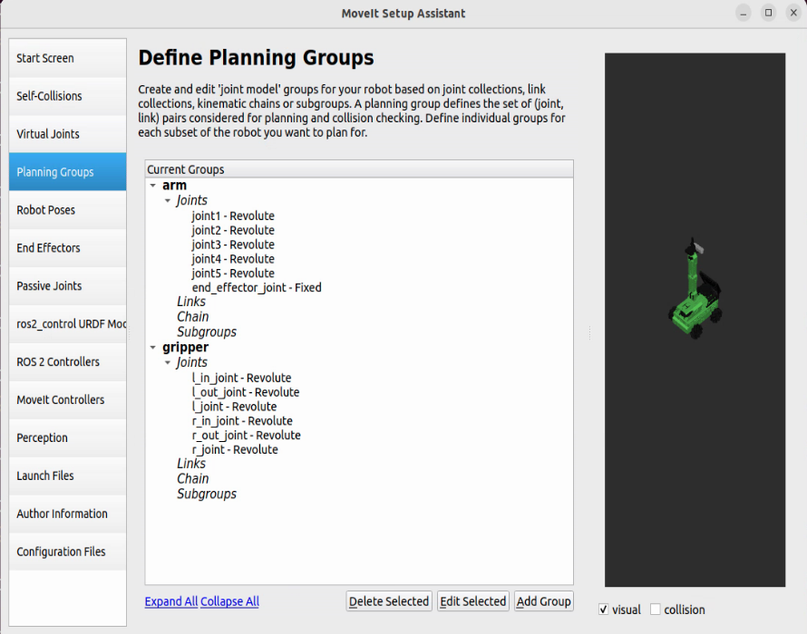

* **Robot Poses**

Define custom pose names for the robot and specify the joint groups involved in achieving each pose.

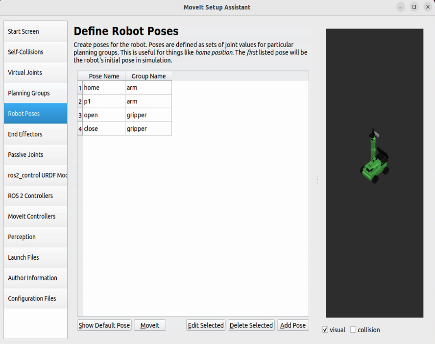

* **Passive Joints**

Defining unused joints. Specify which joints are available and which are disabled, based on the robot's configuration.

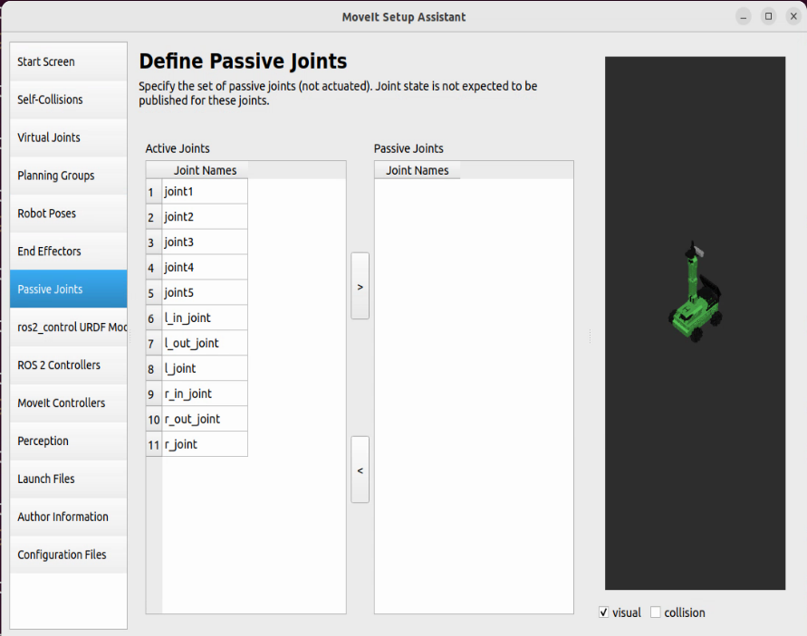

* **ROS2 Controllers**

Using the ROS2 Controllers panel, you can add simulated controllers for the joints. This enables MoveIt2 to simulate the motion of the robotic arm.

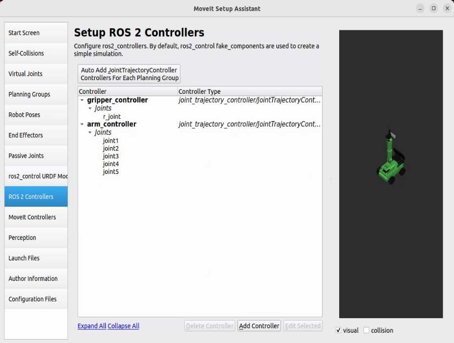

* **ros2_control URDF Modifications**

Configure the URDF file required for the simulation.

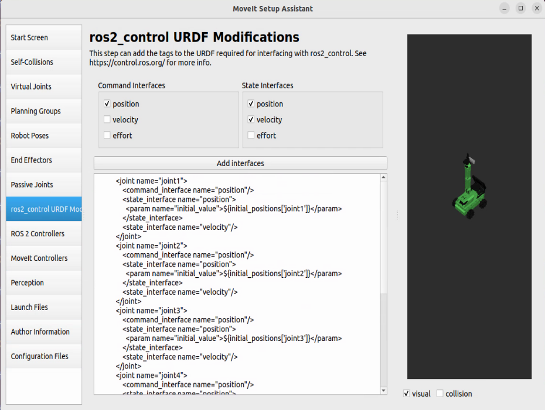

* **Author Information**

Provide the author's details for documentation purposes.

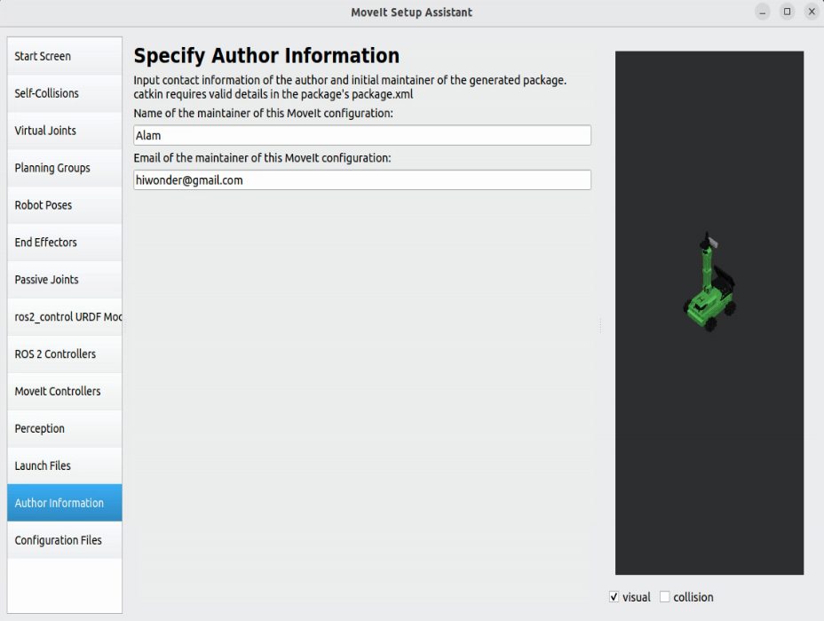

* **Configuration Files**

**Factory Configuration**

The factory configuration is pre-set, and no reconfiguration is required. If reconfiguration is needed, ensure to save the original program and compare it before making modifications.

**Generating Configuration Files**

After confirming the file path, click **"Generate Package"** to generate the configuration package.

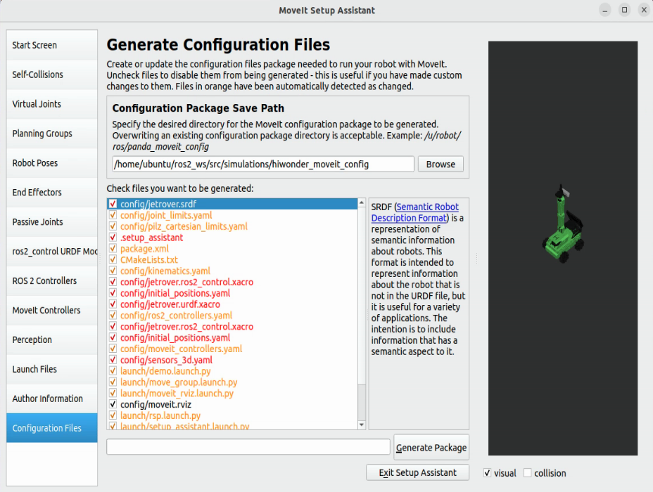

### 8.3.3 MoveIt2 Control

In this section, MoveIt2 will be used to plan the path and control the simulation model and robotic arm to move along the path to the specified position.

* **Start MoveIt2 Tool**

(1) Start a new command-line terminal, and run the following command to launch the MoveIt2 tool.

```
ros2 launch hiwonder_moveit_config demo.launch.py
```

Program Interface Overview

The program interface is shown in the image below:

Position 1: RViz Toolbar

Position 2: MoveIt Debugging Area

Position 3: Simulation Model Adjustment Area

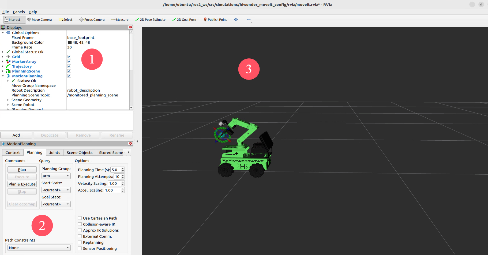

* **Control Instructions**

(1) In the MoveIt2 Debugging Area, find and click the **"Planning"** section.


(2) In the Simulation Model Adjustment Area, you will see arrows in red, green, and blue colors. Click and drag the arrows to adjust the robotic arm's pose. In the robot's first-person view:

Green represents the X-axis, with the positive direction pointing to the robot's left.

Red represents the Y-axis, with the positive direction pointing to the robot's front.

Blue represents the Z-axis, with the positive direction pointing upwards from the robot.

<p class="common_img" style="text-align:center;">


</p>

(3) Besides adjusting the pose using the arrows, you can also adjust individual joints directly. Click the triangle icon on the right and find the **"Joints"** panel.


(4) Drag the sliders for the corresponding joints to adjust their angles individually.


(5) After successfully planning the robotic arm's motion path, the new position will be highlighted in orange. If the new position causes a collision with other parts of the robot, it will be marked in red. You must adjust the configuration to avoid collisions; otherwise, the motion cannot be executed.

Orange (Executable State) is shown in the following image.


For example, if the robotic arm is planned to be in the position shown in the image, it will collide with the depth camera, turning the state red (Non-executable).


(6) After planning the path, return to the **"Planning"** section and click the **"Plan"** option. The simulation model will display the motion path from the original position to the newly planned position.


(7) Then, click the **"Execute"** option to make both the simulation model and robotic arm follow the planned motion path.


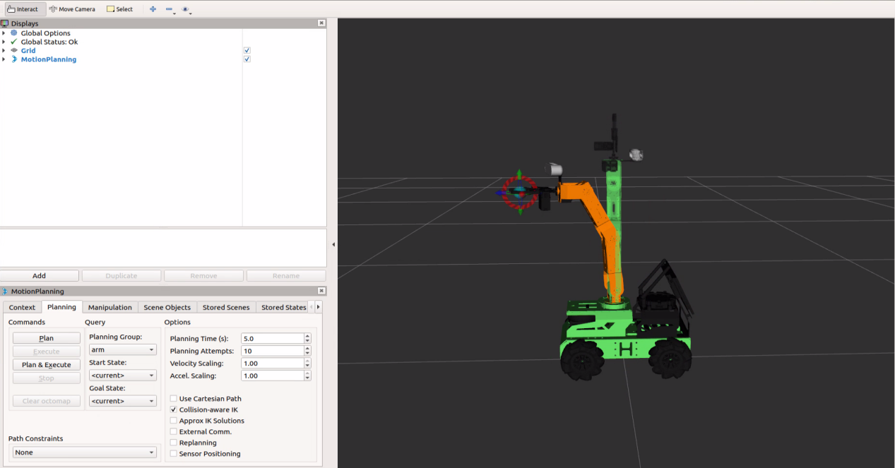

(8) Alternatively, you can click **"Plan & Execute"**, where the robotic arm will first display the new planned motion path and then execute the movement.


(9) To close this mode, press **"Ctrl+C"** in the terminal. If the process fails to stop, try again.

### 8.3.4 MoveIt2 Random Movement

In this section, MoveIt2 will be used to plan a path and control the simulation model and the real robotic arm to move to random positions.

* **Launching the MoveIt2 Tool**

(1) Start the virtual machine and click the icon  on the system desktop to open the terminal command line.

(2) Enter the following command to launch the MoveIt2 tool:

```
ros2 launch hiwonder_moveit_config demo.launch.py
```

The program interface is shown below:

Position 1: RViz Toolbar

Position 2: MoveIt Debugging Area

Position 3: Simulation Model Adjustment Area


* **Control Instructions**

(1) In the MoveIt2 Debugging Area, locate and click the **"Planning"** section.


(2) In the Simulation Model Adjustment Area, there are arrows in green, red, and blue colors. From the robot's first-person perspective:

Green represents the X-axis, with the positive direction pointing to the robot's left.

Red represents the Y-axis, with the positive direction pointing to the robot's front.

Blue represents the Z-axis, with the positive direction pointing upwards from the robot.

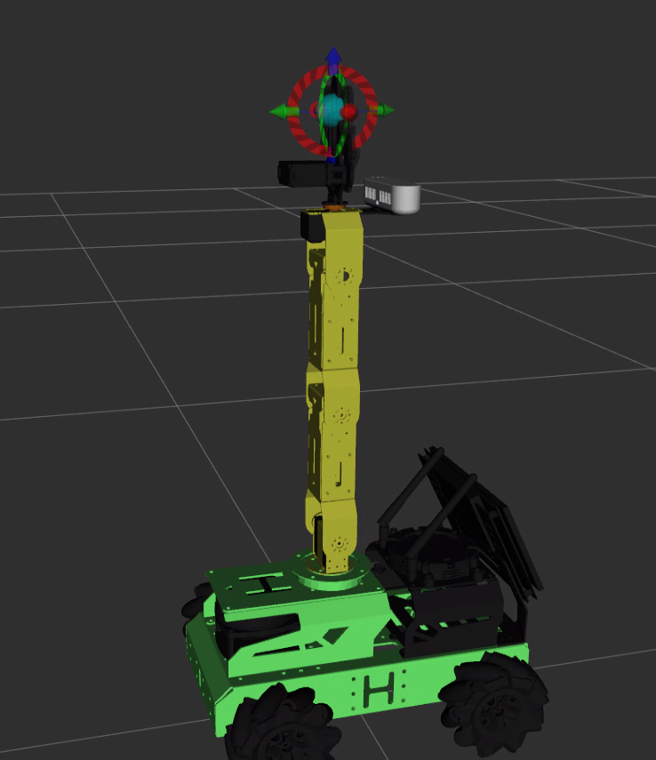

(3) In the **"Query"** category, click the dropdown menu under **"Planning Group"** and select the joint group (servo group) you wish to control. For example, the default selection is the **"arm"** group.

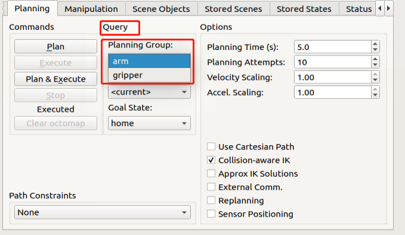

(4) Click the dropdown menu under **"Goal State"** and choose the desired target position.

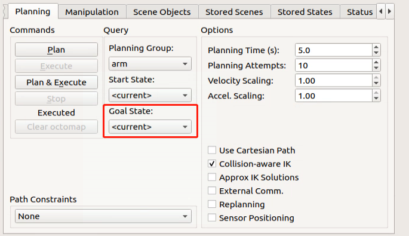

(5) The parameter list in the dropdown menu is as follows:


`random valid`: A valid random position where no collisions will occur.

`random`: A random position that may potentially result in a collision.

`current`: The current position.

`same as start`: The same as the starting position.

`previous`: The previous target position.

`home` and `p1` are the default positions set by the program.

(6) To avoid the possibility of collisions, select `random valid` to randomly generate a valid target position. Each time you click this option, a new target position will be randomly generated and displayed in the simulation model.

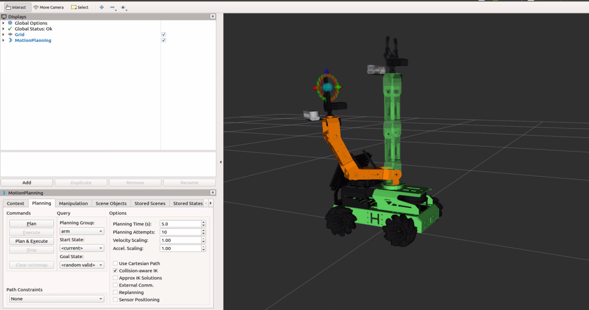

(7) Click **"Plan & Execute"**, and both the simulation model and robotic arm will perform the motion simultaneously. The simulation model will show the newly planned movement path, and the robotic arm will execute the motion.

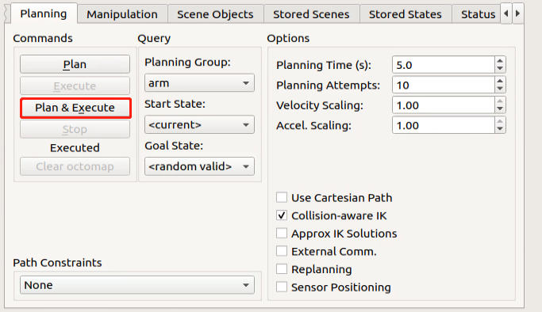

(8) To exit this mode, press **"Ctrl+C"** in the terminal. If the process fails to stop, try again.

### 8.3.5 MoveIt2 Cartesian Path

* **Overview of MoveIt2 Cartesian Path**

Cartesian path planning is a method of trajectory planning where the robot's end effector moves within Cartesian space.

In MoveIt2, Cartesian path planning allows you to specify the starting and target positions of the robot's end effector, and generates a smooth path for the end effector to move from the starting position to the target position.

* **Cartesian Coordinate System**

The Cartesian coordinate system is a general term for both orthogonal and skewed coordinate systems. It consists of two axes intersecting at the origin, forming a planar affine coordinate system. If the measurement units along both axes are equal, it is called a Cartesian coordinate system.

If the two axes are perpendicular to each other, it is known as a Cartesian orthogonal coordinate system; otherwise, it is called a Cartesian skew coordinate system.

In most cases when describing spatial position, velocity, and acceleration, we use the Cartesian coordinate system. When referring to rotations around an axis, the positive direction is determined by the right-hand rule, as shown in the diagram below:

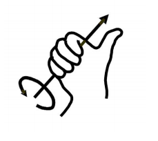

* **Cartesian Path Analysis**

Cartesian path planning can be divided into **point-to-point Cartesian path planning** and **continuous Cartesian path planning** based on the nature of the path. This involves predefining the robot's target points or target paths and using kinematic calculations to determine the joint-level trajectory, allowing the robot to follow the desired path.

In joint space (the space composed of all joint vectors), the movement of the robot's axes is controlled individually. Each axis moves independently through interpolation, without affecting the other axes. The trajectory between two points taken by the robot's end effector is an arbitrary curve.

However, in some cases, the shape of the end effector's trajectory needs to be a straight line or arc, for example. In these cases, Cartesian path planning is used to add constraints on the shape of the trajectory.

:::{Note}
Before starting, ensure that there is enough space around the robot for movement. Keep a safe distance from the robot during operation to avoid injury from collisions with the robotic arm. Also, make sure to bend the antenna backward to prevent damage to the antenna during the robot's movement.
:::

This section will add Cartesian path constraints to the path planning, restricting both the simulation model and the real robotic arm to perform linear motion.

* **Cartesian Path Planning Steps**

(1) Set Up the Motion Group: First, specify the motion group in MoveIt2. A motion group is a set of robot joints used to define the robot's degrees of freedom and controllable parts. By defining the motion group, you can limit the degrees of freedom in the planning process, allowing for better control over the robot's movement.

(2) Set Path Constraints (Optional): If you need to constrain the robot's motion path, such as keeping a specific joint's orientation fixed, you can set path constraints. These constraints ensure that certain conditions are met during the planning process.

(3) Specify the Start and Goal Poses: Define the robot's motion goal by specifying the start and goal poses of the robot's end effector. These poses can be described using the robot's coordinate system.

(4) Perform Path Planning: By calling MoveIt2's path planning interface, the robot's Cartesian path can be generated. MoveIt2 will plan the path based on the robot model, constraints, and target poses, resulting in a smooth trajectory.

(5) Execute the Path: Finally, the generated path can be sent to the robot controller to execute the motion. The robot will move step-by-step along the planned path to reach the target pose.

* **Launch MoveIt2 Tool**

(1) Start the virtual machine, and click-on  to execute the command-line terminal.

(2) Open a new command-line terminal, and run the following command to launch the MoveIt2 tool.

```
ros2 launch hiwonder_moveit_config demo.launch.py
```

The program interface is shown in the figure below:

Position 1: RVIZ Toolbar

Position 2: MoveIt2 Debug Area

Position 3: Simulation Model Adjustment Area


(3) Locate the **"Planning"** section, and tick **"Use Cartesian Path"** to enable Cartesian path planning.


(4) Next, use the mouse to drag the arrows in the **"Simulation Model Adjustment Area"** to plan the robot arm's path. From the robot's perspective, the green arrow represents the X-axis, with the positive direction to the robot's left; the red arrow represents the Y-axis, with the positive direction to the robot's front; and the blue arrow represents the Z-axis, with the positive direction upwards from the robot.

<p class="common_img" style="text-align:center;">


</p>

(5) Once the planning is complete, click **"Plan & Execute".** The simulation model will execute the action and attempt to linearly move the end effector in Cartesian space. If the action cannot be performed within the Cartesian path constraints, it will display a failure message.

(6) To exit this mode, press **"Ctrl+C"** in the terminal. If it fails to close, please try again.

### 8.3.6 MoveIt2 Collision Detection

* **MoveIt2 Collision Detection Explanation**

MoveIt2's collision detection is a critical feature that uses the robot's motion planning path and information about surrounding objects to detect potential collisions. This ensures that the robot does not collide with any objects in its environment while performing its movements.

* **Collision Detection Configuration Overview**

In MoveIt2, collision detection is configured using the `CollisionWorld` object in the planning scene. The collision detection in this configuration primarily uses the FCL (Flexible Collision Library) package, which is a key C++ library in MoveIt2.

* **Collision Object Introduction**

MoveIt2 supports collision detection for various types of objects, including:

(1) Meshes

(2) Basic Shapes – such as cuboids, cylinders, cones, spheres, and planes.

(3) Octomap – Octomap objects can be directly used for collision detection.

* **Allowed Collision Matrix (ACM)**

The Allowed Collision Matrix (ACM) encodes a binary value indicating whether collision detection is required between objects (which may be on the robot or in the robot's environment).

If the value corresponding to two objects in the ACM is set to 1, it means collision detection between these objects is not required. Otherwise, collision detection will be performed.

In this section, a collision model will be added to demonstrate the effect of collision detection for both the simulation model and the real robot arm.

This section will introduce a collision model to demonstrate the collision detection effects between the simulation model and the real robotic arm.

* **Collision Detection Steps**

(1) Robot Description: First, provide a geometric and kinematic description of the robot, typically using a URDF (Unified Robot Description Format) file to describe the robot's structure and connectivity. This description includes information about the robot's joints, links, collision bodies, and sensors.

(2) Environment Modeling: Model the environment surrounding the robot, including the geometric shape and location of obstacles. These obstacles can be either static or dynamic.

(3) Motion Planning: Using MoveIt2's motion planner, specify the robot's starting and target poses, and generate the robot's motion trajectory.

(4) Collision Detection: MoveIt2 will perform collision detection for each pose along the generated trajectory. It uses both the robot model and the environment model to check for potential collisions between the robot and obstacles.

(5) Collision Avoidance: If collisions are detected, MoveIt2 will adjust the robot's pose or path to avoid them. The system will re-plan the robot's motion trajectory until it finds a collision-free path.

* **Launch MoveIt2 Tool**

(1) Start the virtual machine, and click-on  to execute the command-line terminal.

(2) Execute the following command to initiate the MoveIt2 tool.

```
ros2 launch hiwonder_moveit_config demo.launch.py
```

The program interface is shown in the image below:

Position 1: RVIZ Toolbar

Position 2: MoveIt Debug Area

Position 3: Simulation Model Adjustment Area


(3) In the Simulation Model Adjustment Area, there are arrows in three colors: green, red, and blue. Click and drag the arrows to adjust the robot arm's posture. From the robot's perspective, the green arrow represents the X-axis (positive direction is to the left of the robot), the red arrow represents the Y-axis (positive direction is in front of the robot), and the blue arrow represents the Z-axis (positive direction is above the robot).

After planning the path, the new position will be highlighted in orange, as shown in the image below:

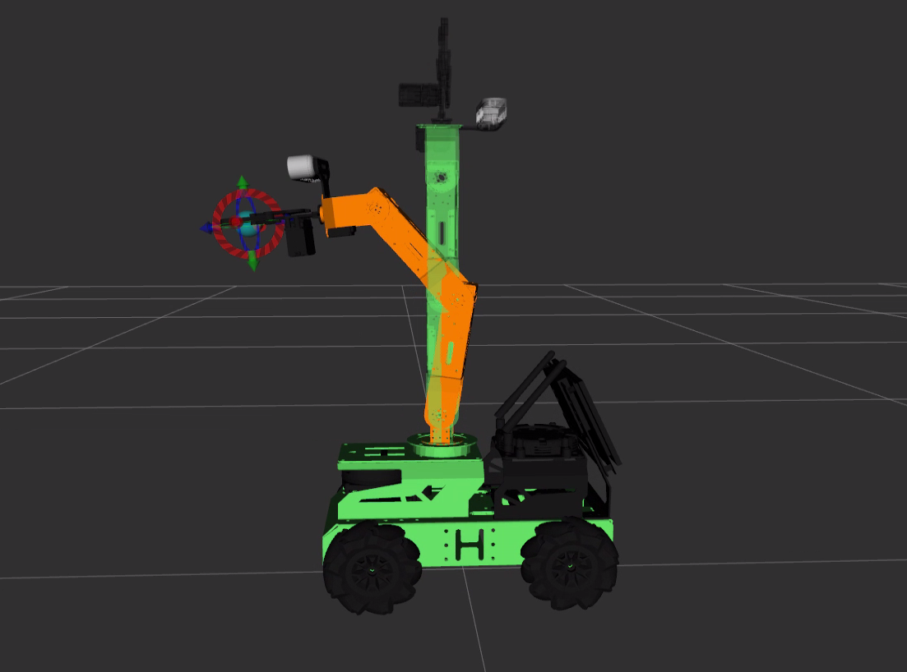

(4) Once the robot arm's path is planned, click the **"Scene Objects"** section to add a collision model.


(5) The section is divided into 4 areas, as described below:


(6) Click the **"Box"** dropdown menu and select a collision model. Here, we will use the **"Sphere"** model as an example.


(7) Click the plus icon to add the currently selected collision model.


The model will be placed at the robot's base by default, as shown in the image below:

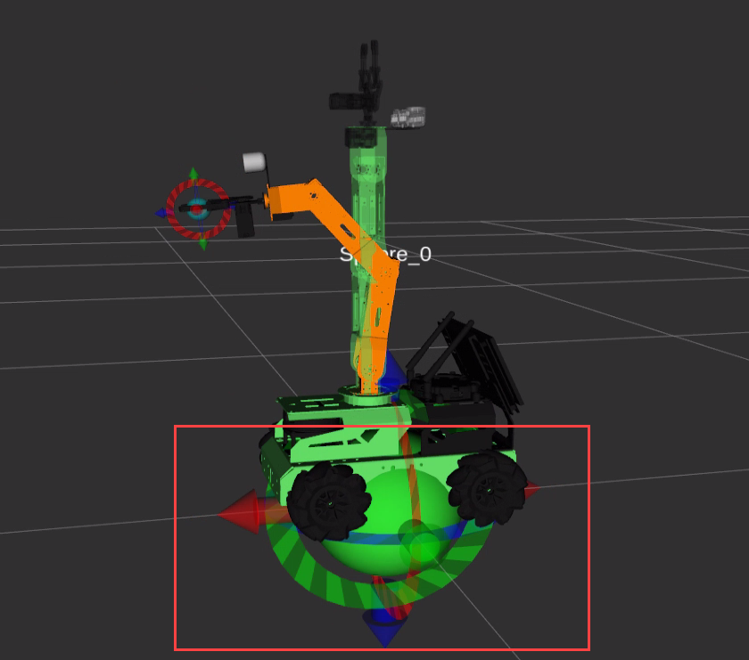

(8) Use the slider to adjust the size of the collision model. It is recommended to shrink it to about 50% of the original size.


(9) Drag the 3D arrows on the sphere to move the collision model between the start and target positions to test the collision detection effect.

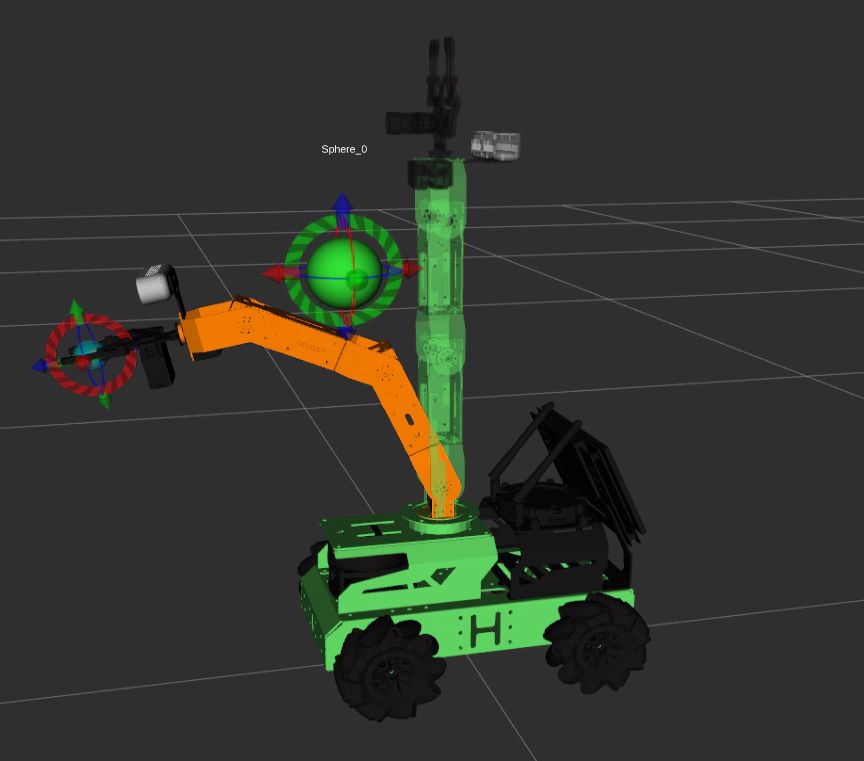

(10) Click the **"Planning"** section and check the **"Collision-aware IK"** option to enable the collision detection for the model.


(11) Next, click **"Plan & Execute"** to begin moving along the planned path. When the following prompt appears, select **"Yes".**


(12) After confirming, the robot arm will plan the movement path, avoiding any obstacles along the way to prevent collisions.

(13) If you wish to exit this mode, press **"Ctrl+C"** in the terminal. If it doesn't close successfully, please try again.

### 8.3.7 MoveIt2 Scene Design

When using MoveIt2 for scene design, you can create a virtual environment that includes the robot, obstacles, and target positions. This scene can be used for tasks such as motion planning, collision detection, and path optimization.

* **Scene Design Steps**

(1) Robot Description: The robot's structure, connections, and joint limits are typically defined using a URDF (Unified Robot Description Format) file. This description includes the robot's geometry, kinematic parameters, and sensor information.

(2) Obstacle Modeling: During scene design, obstacles can be added to simulate the robot's environment. These obstacles can be static, such as walls, tables, or boxes, or dynamic, such as moving objects or other robots.

(3) Target Position Setup: You can specify the robot's target position or desired pose within the scene. These target positions could be specific locations the robot needs to reach or tasks to perform, such as grasping an object or completing a specific action.

(4) Motion Planning: Using MoveIt2's motion planner, you can plan the robot's path. By defining the robot's starting and target positions, MoveIt2 calculates a smooth trajectory to move the robot from the start to the target.

(5) Collision Detection: During motion planning, MoveIt2 performs collision detection to ensure the robot does not collide with obstacles during movement. If a collision is detected, MoveIt2 will replan the path to avoid the obstacle and find a viable route.

* **Introduction to the Rviz Plugin**

Rviz is a 3D visualization platform in the ROS system and one of the key plugins for MoveIt2. It enables the graphical display of external information and allows the publishing of control messages to the monitored objects.

Using the MoveIt2 Rviz plugin, users can set up a virtual environment (scene), interactively configure the robot's starting and target states, test various motion planning algorithms, and visualize the results.

In this section, we will explain how to add object models to the scene.

* **Launch MoveIt2 Tool**

(1) Launch the virtual machine. Click the icon  on the system desktop to open the terminal.

(2) Open a new terminal window and enter the following command to launch the MoveIt2 tool.

```
ros2 launch hiwonder_moveit_config demo.launch.py
```

The program interface will appear as shown in the image below:

Position 1: RVIZ Toolbar

Position 2: MoveIt Debugging Area

Position 3: Simulation Model Adjustment Area


After planning the path, the new position will be highlighted in orange, as shown in the image below.


(3) In the debugging area, locate the **"Scene Objects"** section to add scene object models.


(4) This section is divided into 4 areas, as shown below.


(5) In the **"Custom Models"** section, select the required basic model. Here, we use the cube model as an example.


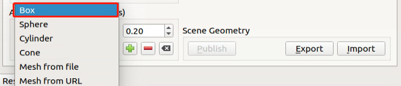

(6) Above the model selection, adjust the initial size of the object model in meters, as shown below.


(7) After adjusting, click the **"+"** button to add the currently configured object model to the scene.

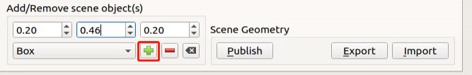

(8) Once added, the model list will be updated with the newly added model, which will appear at the center of the scene (i.e., the robot's center).

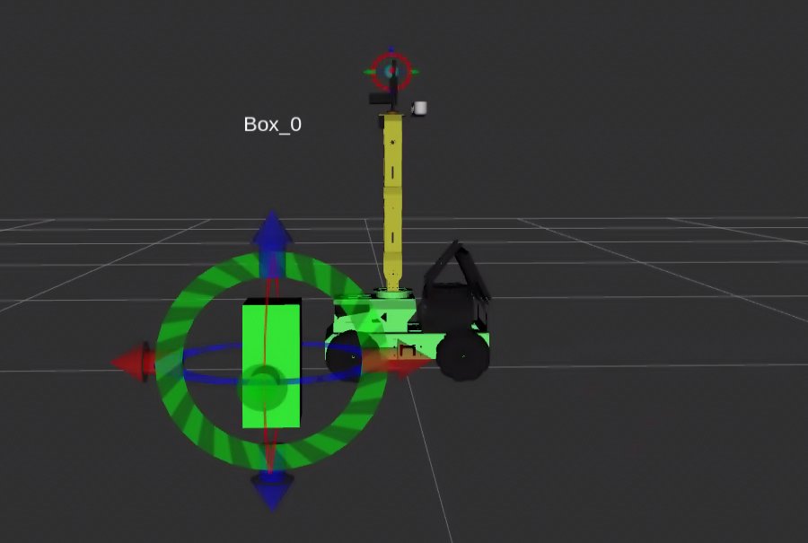

(9) In the simulation model adjustment area, there are arrows in red, green, and blue colors. Click and drag these arrows to adjust the robot's pose. In the robot's first-person view:

Green Arrow: X-axis direction, positive direction is to the left of the robot.

Red Arrow: Y-axis direction, positive direction is in front of the robot.

Blue Arrow: Z-axis direction, positive direction is above the robot.


(10) In addition to using arrow dragging, you can also make adjustments in the **"Position and Size"** adjustment area.

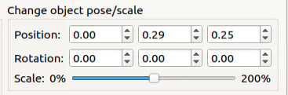

Position: Adjust the object's position on the X, Y, and Z axes.

Rotation: Adjust the object's angle along the X, Y, and Z axes.

Scale: Adjust the object's size by dragging the slider.

(11) After making adjustments, click **"Publish"** to send the model's topic message. MoveIt2 will automatically subscribe to this message.


(12) To prevent object models from colliding, go to the **"Planning"** section and check the **"Collision-aware IK"** box to enable collision detection for the model.


(13) If you wish to close this feature, press **"Ctrl+C"** in the terminal. If the closing fails, please try again.

### 8.3.8 MoveIt2 Trajectory Planning

* **Open Motion Planning Library (OMPL)**

OMPL is an open-source motion planning library based on sampling methods (written in C++). Most of the algorithms in OMPL are derived from RRT and RPM, such as RRTStar and RRT-Connect.

Due to its modular design, support for front-end GUIs, and stable updates, OMPL has become the most widely used motion planning software (OMPL is the default for ROS).

The sampling-based planning method does not consider the dimensionality of the planning target, avoiding the **"curse of dimensionality".** This makes it highly effective for path planning in high-dimensional spaces and complex constraint environments, which is a key reason OMPL is applicable to MoveIt2 robotic arm control.

For an N-degree-of-freedom robotic arm motion planning problem, OMPL can plan a trajectory for the end effector within the robot's joint space. This trajectory consists of M arrays (with M control points), each with N dimensions (representing the joint sequence for each control point). The robotic arm will follow this trajectory without colliding with obstacles in the environment.

* **Industrial Motion Planner (Pilz)**

The Pilz industrial motion planner is a deterministic generator designed for circular and linear motion. It also supports combining multiple motion segments using MoveIt2 functionality.

* **Stochastic Trajectory Optimization for Motion Planning (STOMP)**

STOMP is an optimization-based motion planner built upon the PI^2 algorithm. It is capable of planning smooth trajectories for robotic arms, avoiding obstacles, and optimizing constraints. This algorithm does not require gradients, allowing it to optimize any terms in the cost function.

* **Search-Based Planning Library (SBPL)**

The SBPL is a collection of general-purpose motion planners that use search-based methods to discretize space.

* **Covariant Hamiltonian Optimization for Motion Planning (CHOMP)**

CHOMP is an innovative gradient-based trajectory optimization program that simplifies many common motion planning problems and makes them trainable.

Most high-dimensional motion planners divide the trajectory generation process into two distinct stages: planning and optimization. In contrast, CHOMP uses covariant gradients and function gradients during the optimization stage to design a motion planning algorithm entirely based on trajectory optimization.

Given an infeasible initial trajectory, CHOMP quickly responds to the surrounding environment to avoid collisions while optimizing dynamic parameters like joint velocity and acceleration. This algorithm can rapidly converge to a smooth, collision-free trajectory, allowing the robot to efficiently execute the path.

:::{Note}
Before starting, ensure there is enough workspace around the robot. Maintain a safe distance during operation to prevent the robotic arm from colliding with your body. Also, bend the antenna backward to prevent it from being damaged by the robot's movement.
:::

This section integrates the OMPL and CHOMP planners. By default, the OMPL planner is used. Below, we will demonstrate how to switch to and use the CHOMP planner.

* **Start MoveIt2 Tool**

(1) Start the Virtual Machine: Click the system desktop icon  to open the command-line terminal.

(2) Launch MoveIt2 Tool: Enter the following command to launch the MoveIt2 tool:

```
ros2 launch hiwonder_moveit_config demo.launch.py
```

The program interface is displayed as shown below:

① Position 1: RVIZ Toolbar

② Position 2: MoveIt2 Debugging Area

③ Position 3: Simulation Model Adjustment Area


(3) Adjust Robot Pose: In the simulation model adjustment area, there are red, green, and blue arrows. Click and drag the arrows to adjust the robotic arm's pose. The robot is viewed from its first-person perspective, with:

① Green: X-axis (positive direction is to the left of the robot)

② Red: Y-axis (positive direction is in front of the robot)

③ Blue: Z-axis (positive direction is above the robot)

<p class="common_img" style="text-align:center;">


</p>

(4) Adjust Individual Joints: In addition to adjusting the pose with the arrows, you can directly adjust the individual joints. Click the triangle icon on the right side, then find and click the **"Joints"** panel.


(5) Fine-tune Joint Angles: Drag the corresponding sliders to adjust the angles of the individual joints.


(6) Path Planning and Collision Detection: After successfully planning the robotic arm's movement path, the new position will be indicated in orange. If there is a collision with other parts of the robot, the position will be marked in red. In this case, you need to adjust the pose to avoid collisions, or the action cannot be executed.

Orange indicates an executable position, as shown below:


(7) Visualize the Motion Path: In the RVIZ toolbar, click **"Motion Planning"** and **"Planned Path"**, then check the **"Show Trail"** option. This will display the visual trail of each frame of the robotic arm's movement.

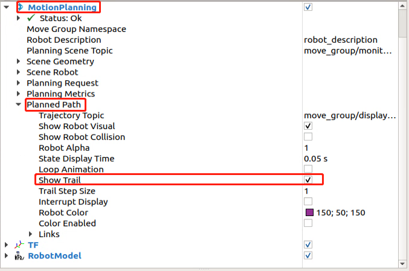

(8) Demonstrate the Movement Path: Return to the **"Planning"** section, and click the **"Plan"** button. The simulation model will demonstrate the path from the original position to the newly planned position.


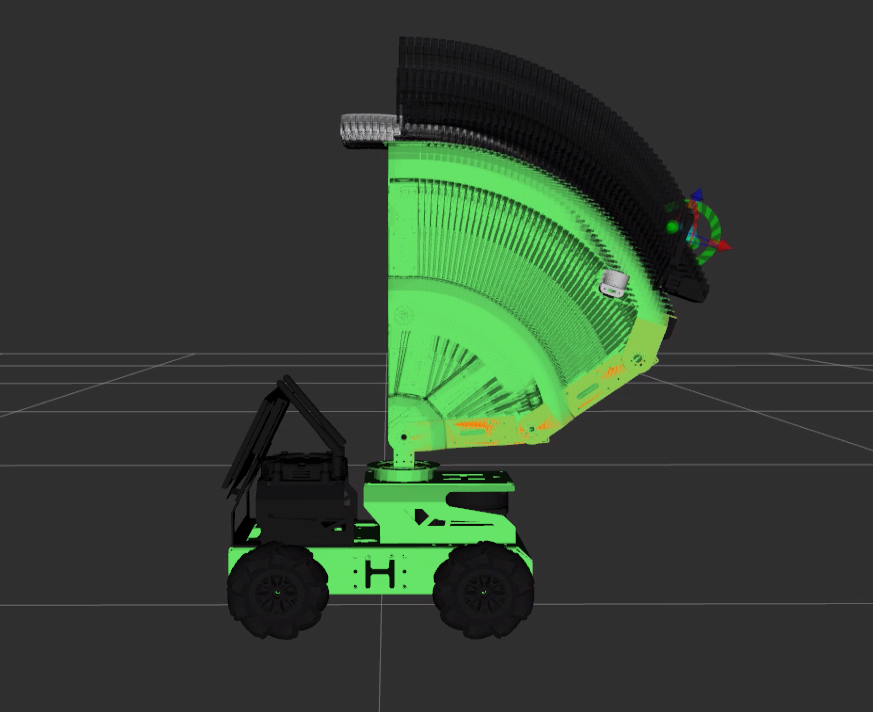

(9) Execute the Planned Path: After observing the demonstration, uncheck the **"Show Trail"** option. Then, click the **"Execute"** button. The simulation model and the robot will simultaneously execute the planned motion.


(10) To close this mode, press **"Ctrl+C"** in the terminal. If the shutdown fails, try again.

### 8.3.9 Simulation and Robotic Arm Synchronization

In this section, we will plan a motion trajectory in the simulation and execute it to synchronize the real robotic arm's movements.

* **Important Notes**

(1) Network Requirements: The virtual machine and the robot must be on the same network segment and able to communicate with each other in order to control the robot. Otherwise, only simulation is possible, and the robot will not execute the planned movements.

(2) Safety Precautions: Before starting, ensure there is enough space around the robot for movement. Maintain a safe distance from the robot during execution to prevent any collisions between the robotic arm and your body that could cause injury.

* **Starting Robot Services**

(1) Start the Robot: Click on the system desktop icon  to open the command terminal, then enter the command to disable the auto-start service:

```
sudo systemctl stop start_app_node.service
```

(2) Start the Robot Chassis Control Node: This node is responsible for enabling synchronization between the simulation and the real robotic arm.

```
ros2 launch ros_robot_controller ros_robot_controller.launch.py
```

* **Starting Services on the Virtual Machine**

(1) Start the Virtual Machine: Click the system desktop icon  to open the command terminal.

(2) Start the Servo Control Node: In the terminal, enter the following command to start the servo control node, enabling synchronization between the simulation and the real robotic arm:

```
ros2 launch servo_controller servo_controller.launch.py
```

(3) Start MoveIt2 Tool: Open a new terminal and enter the following command to launch MoveIt2:

```
ros2 launch hiwonder_moveit_config demo.launch.py
```

(4) Control Robotic Arm Movement: Use the slider to adjust the motion planning for the robotic arm, then click **"Plan & Execute".** The simulated robotic arm and the real robotic arm will execute the action synchronously.


:::{Note}
In practice, the software execution of actions may appear slower, which is normal!
:::

## 8.4 Gazebo Simulation

:::{Note}
This tutorial uses a virtual machine as an example for configuration and learning. If you have not installed a virtual machine, refer to section 8.1 Virtual Machine Installation and Configuration for installation instructions before proceeding.
:::

### 8.4.1 Introduction to Gazebo

To simulate a realistic virtual physical environment where robots can perform tasks more effectively, we use a simulation software: Gazebo.

Gazebo is standalone software and is the most commonly used simulation tool in the ROS ecosystem. It provides:

(1) High-fidelity physical simulation conditions.

(2) A comprehensive set of sensor models.

(3) A user-friendly interactive interface.

These features enable robots to function effectively even in complex environments.

Gazebo supports URDF and SDF file formats for describing simulation environments. The robot models use the URDF format. Additionally, Gazebo provides many pre-built model modules that can be used directly.

### 8.4.2 Gazebo GUI Introduction

The simulation software interface is as below:

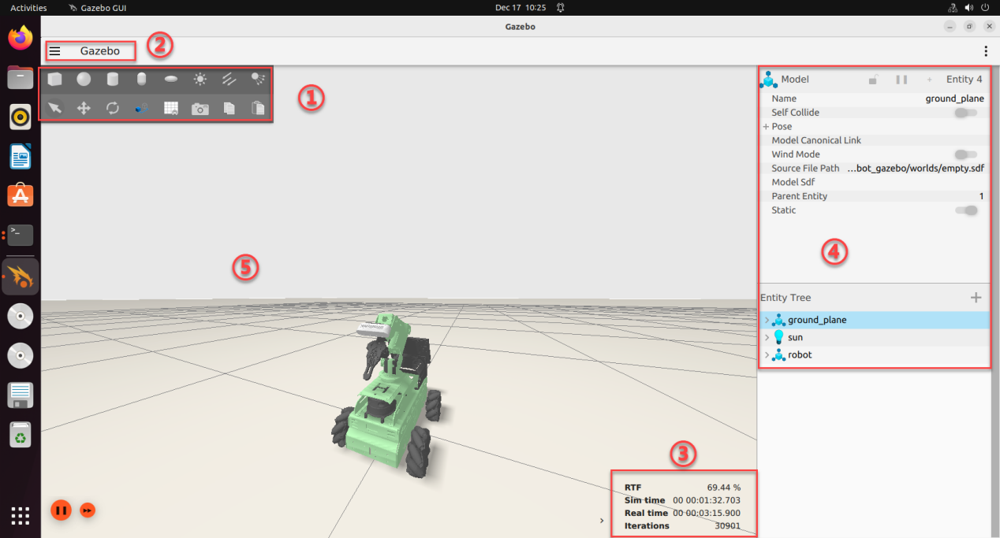

The specific functions of each position are detailed in the table below:

| **Name** | **Function** |
|:--:|:--:|
| Tool bar (1) | Provides commonly used options for interacting with the simulator. |
| Menu bar (2) | Configures or modifies simulation parameters and offers interaction features. |
| Action Bar(3) | Allows manipulation of models and adjustment of parameters. |
| Timestamp (4) | Controls the time in the virtual environment. |
| Scene (5) | The main part of the simulator where the simulation models are displayed. |

For more information about Gazebo, please visit the official website: [http://gazebosim.org/](http://gazebosim.org/).

### 8.4.3 Gazebo Learning Resources

Gazebo Official Website: [https://gazebosim.org/](https://gazebosim.org/)

Gazebo Tutorials: [https://gazebosim.org/tutorials](https://gazebosim.org/tutorials)

Gazebo GitHub Repository: [https://github.com/osrf/gazebo](https://github.com/osrf/gazebo)

Gazebo Answers Forum: [http://answers.gazebosim.org/](http://answers.gazebosim.org/)

### 8.4.4 Gazebo xacro Model Visualization

To better understand the robot's model and structure, you can use Gazebo for visualization. Follow these steps:

* **Start the Simulation**

:::{Note}
Command inputs are case-sensitive. Use the **"Tab"** key for auto-completion of keywords.
:::

(1) Start the virtual machine. Click-on the system desktop icon 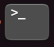 to execute the command-line terminal.

(2) Execute the command below to launch the Gazebo model.

```
ros2 launch robot_gazebo worlds.launch.py moveit_unite:=true
```

The interface below indicates successful launch.

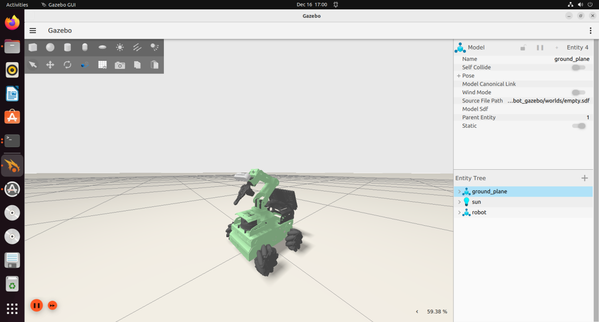

(3) Use the short-cut **"Ctrl+C"** to close the window to stop the running program.

① Introduction to Shortcuts and Tools

Here, we will introduce some commonly used shortcuts and tools in Gazebo, using mouse controls as examples:

② Mouse Shortcuts

Left Mouse Button:

Drag the Map: Press and hold the left mouse button on the map to drag it.

Select Target: Click on a model to select it.

③ Middle Mouse Button or Shift + Left Mouse Button:

Press and hold while moving the mouse to rotate the view around the current target position.

④ Right Mouse Button or Mouse Wheel:

Hold the right mouse button or scroll the wheel to zoom in and out, focusing on the point under the cursor.

* **Toolbar Tools**

We'll explain a few tools from the toolbar using the following example:

(1) Selection tool ：This is Gazebo's default tool, used to select models.

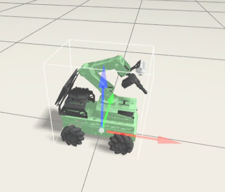

(2) Move Tool ：Use this tool to select a model and drag the three axes to control its movement.

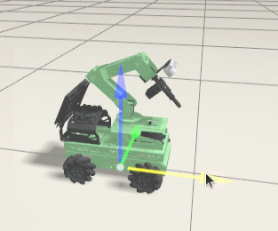

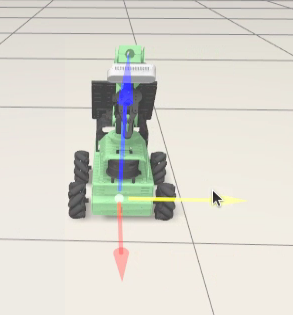

(3) Rotate Tool : Use this tool to select a model and drag the three axes to control its rotation.

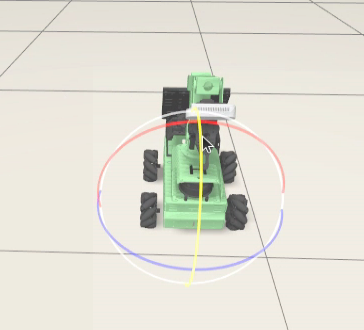


For more information about Gazebo, visit the official website: [http://gazebosim.org](http://gazebosim.org)

### 8.4.5 Hardware Simulation in Gazebo

To understand the simulation models of various extension devices on the robot, it is essential to comprehend the corresponding model code.

* **LiDAR Simulation**

:::{Note}
When entering commands, ensure correct capitalization and use the **"Tab"** key to auto-complete keywords where possible.
:::

(1) Start the VMware virtual machine.

(2) Click the terminal icon  on the desktop to open the command-line interface.

(3) Enter the following command and press Enter key to move to the relevant directory:

```
cd /home/ubuntu/ros2_ws/src/robot_gazebo/urdf
```

(4) Use the following command to open the LiDAR simulation file for editing:

```
vim lidar.gazebo.xacro
```

This file contains details about the LiDAR simulation model, including its name, detection range, position, noise reduction settings, and topic messages.

To better understand this file, refer to the **"Introduction to URDF Models"** section for learning the relevant syntax.

* **IMU Simulation**

:::{Note}
Please ensure that you enter the commands with correct capitalization. You can use the **"Tab"** key to autocomplete keywords.
:::

(1) Start the virtual machine. Click-on the icon  to initiate the command-line terminal.

(2) Run the following command and hit Enter key to navigate to navigate to the program directory:

```
cd /home/ubuntu/ros2_ws/src/robot_gazebo/urdf
```

(3) Enter the following command to open the IMU simulation model file:

```
vim imu.gazebo.xacro
```

This file defines properties of the IMU simulation model, such as name, offset settings, noise reduction settings, acceleration settings, topic messages, and more. To understand this file, please refer to the **"Introduction to URDF Models"** for relevant syntax.


### 8.4.6 Gazebo Mapping Simulation

* **Operation**

:::{Note}
When entering commands, be sure to distinguish between uppercase and lowercase letters, and use the **"Tab"** key to auto-complete keywords.
:::

If you need to perform mapping in an ideal environment but cannot do so in a real-world setting, you can create the desired scene in Gazebo for simulation-based mapping.

(1) Start the virtual machine. Click-on the icon  to launch the command-line terminal.

:::{Note}
Wait for each service to fully start before launching the next one to avoid simulation failure.
:::

(2) Enter the following command to start the Gazebo simulation:

```
ros2 launch robot_gazebo room_worlds.launch.py
```

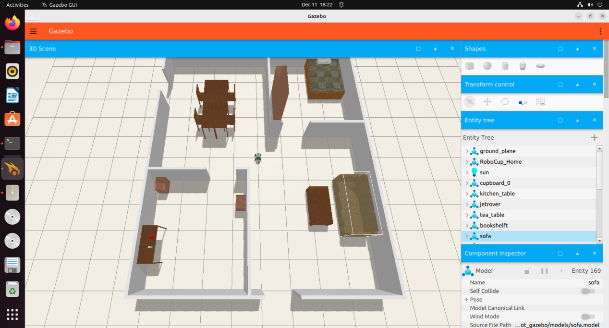

(3) Enter the following command in the new terminal  to launch the mapping service:

```
ros2 launch robot_gazebo slam.launch.py
```

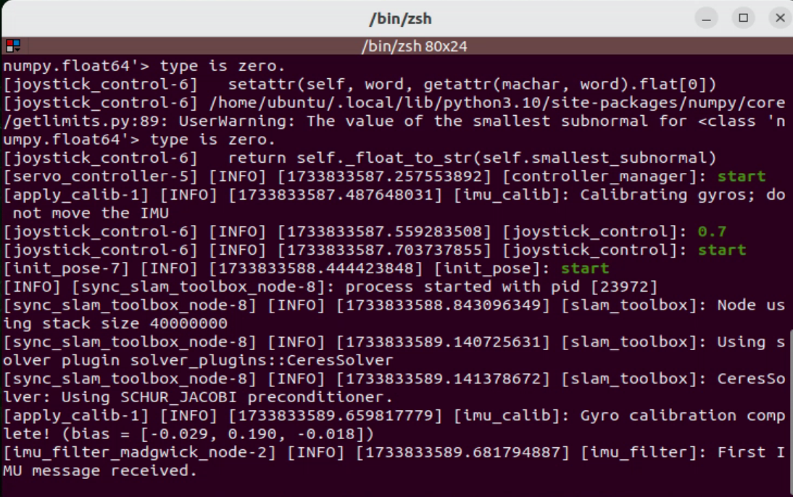

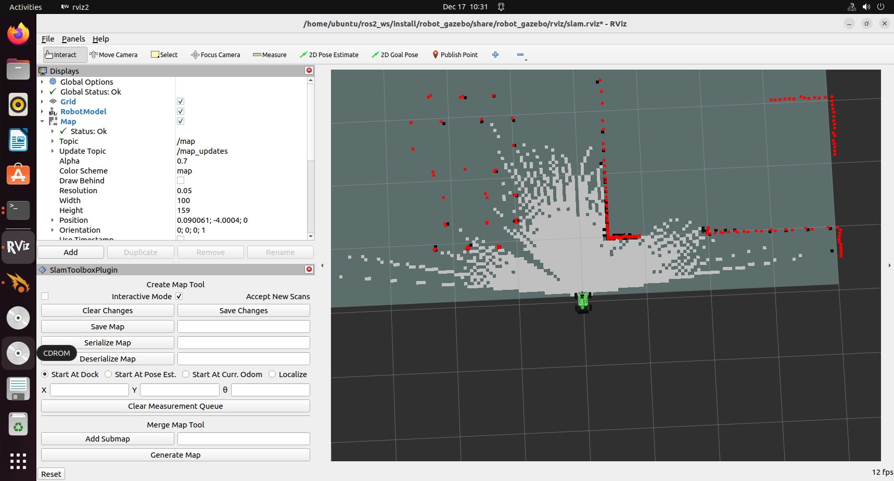

* **Mapping Instructions**

(1) Execute the following command to initiate the keyboard control.

```
ros2 run robot_gazebo teleop_key_control
```

After the following window appears, click anywhere inside the window to start controlling the robot. The specific key functions are as follows:

| **Key** | **Function** | **Description** |
|:-------:|:-------------:|:---------------:|
| w | Move forward | Click |
| s | Move backward | Click |
| a | Turn left | Hold |
| d | Turn right | Hold |

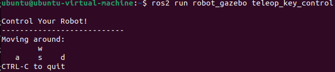

(2) The mapping process will be displayed synchronously in the RVIZ tool, as shown in the image below.


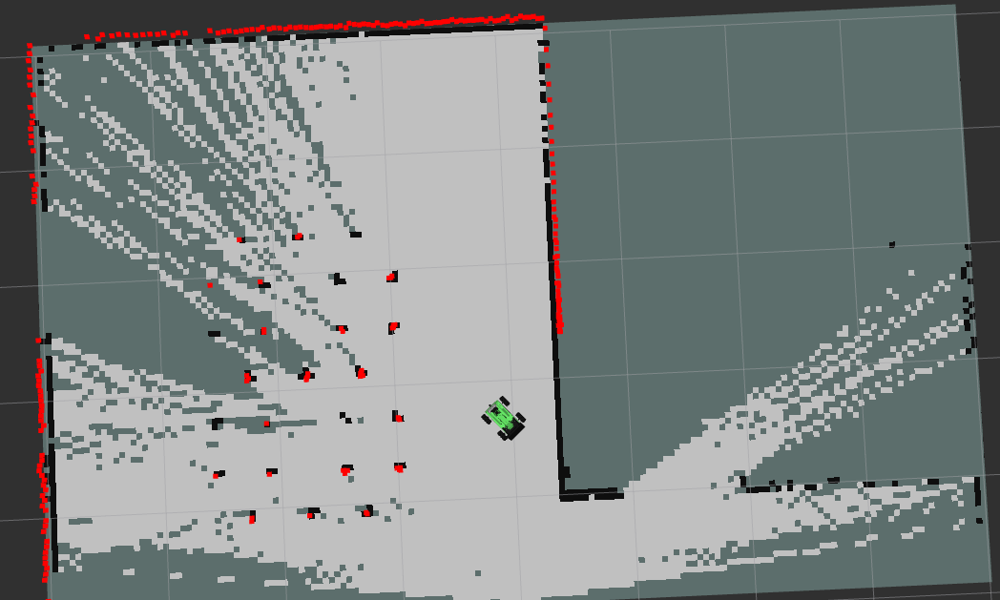

Continue the scanning until the map reaches a state similar to the one shown below.

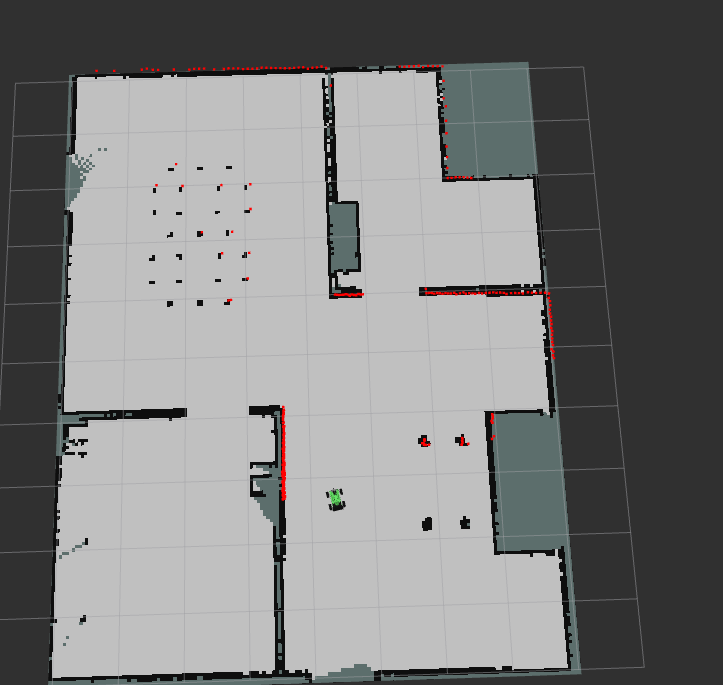

(3) Enter the directory to save the map and save the map:

```
cd ~/ros2_ws/src/robot_gazebo/maps && ros2 run nav2_map_server map_saver_cli -f "map_01" --ros-args -p map_subscribe_transient_local:=true
```

In the command, `map_01` is the name of the map. You can rename it according to your needs. If the following message appears, the map has been saved successfully.


(4) To stop the program running in the current terminal window, press the shortcut Ctrl+C.

* **FAQ**

(1) No map is displayed after opening the RVIZ simulation tool, only the robot model is shown.

A: This issue may occur if multiple services are running simultaneously, causing the robot's processes to become congested. It is recommended to stop all processes by pressing Ctrl+C in the terminal, and then restart the services in order. Wait for each service to fully start before entering the next command.

Additional Information:

Use the following two commands to forcefully kill all processes:

```
ps aux | grep ign | grep -v grep | awk '{ print "sudo kill -9", $2 }' | sh
```

```
ps aux | grep ros | grep -v grep | awk '{ print "sudo kill -9", $2 }' | sh
```

### 8.4.7 Gazebo Navigation Simulation

When using Gazebo software to complete mapping, you can also perform navigation within the software scene to achieve a simulated effect.

* **Operation**

:::{Note}
When entering commands, be sure to distinguish between uppercase and lowercase letters, and use the **"Tab"** key to auto-complete keywords.
:::

(1) Start the virtual machine. Click the system desktop icon  to open the command-line terminal.

:::{Note}
Wait for each service to fully start before launching the next one to avoid simulation failure.
:::

(2) Enter the following command to start the simulation map:

```
ros2 launch robot_gazebo room_worlds.launch.py nav:=true
```

(3) Start a new command-line terminal 

(4) Execute the command below to load the map and start the navigation

```
ros2 launch robot_gazebo navigation.launch.py map:=map_01
```

The `map_01` at the end of the command is the map name. You can modify this parameter based on your needs. The map is stored in the following path:

`/home/ubuntu/ros2_ws/src/robot_gazebo/maps`.

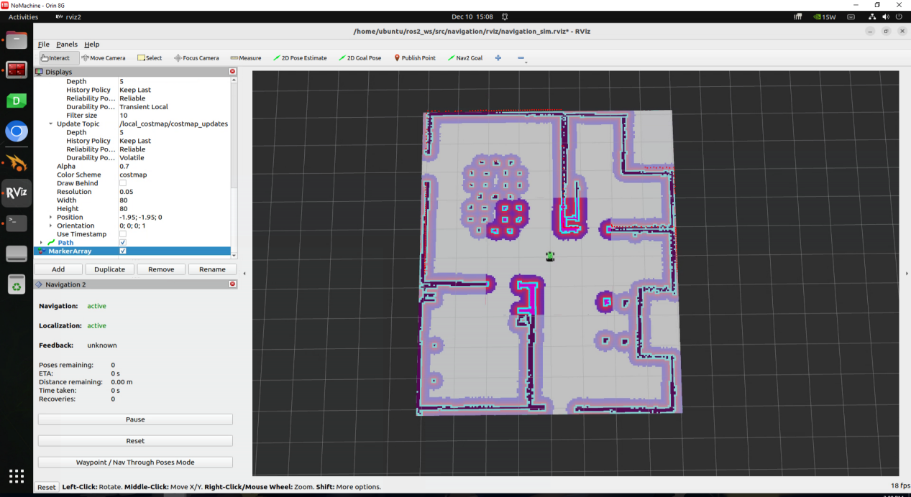

* **Start Navigation**

The software menu bar includes three tools: 2D Pose Estimate, 2D Nav Goal, and Publish Point.

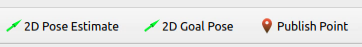

The software menu bar includes three tools: 2D Pose Estimate, 2D Nav Goal, and Publish Point.

**2D Pose Estimate** is used to set the robot's initial position.

**2D Nav Goal** is used to set a single target point for the robot.

**Publish Point** is used to set multiple target points for the robot.

(1) Click on the **2D Nav Goal** tool in the software menu bar. Then, click on the map to select a target point. If you press and hold the mouse button while dragging, you can also adjust the robot's orientation after reaching the target point. Once selected, the robot will automatically generate a route and move to the target point.

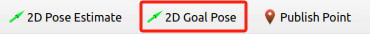

(2) After confirming the target point, the map will display the robot's planned path, and the robot's simulation model will move to the corresponding location.

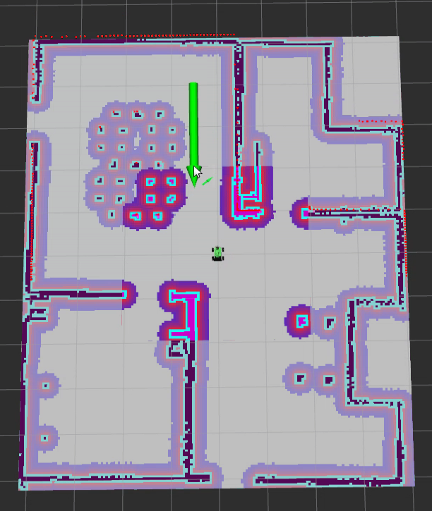

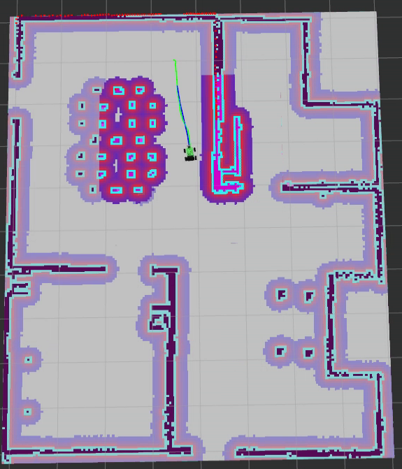

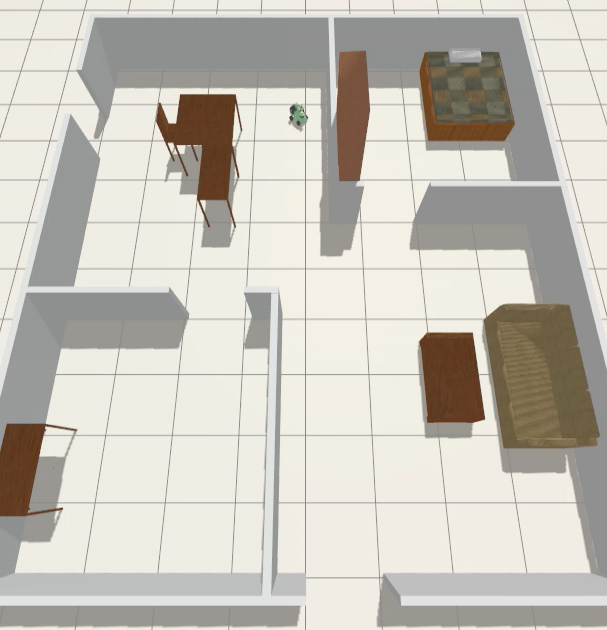

(3) To use the multi-point navigation feature, first click the button shown in the lower-left corner, as illustrated in the image.

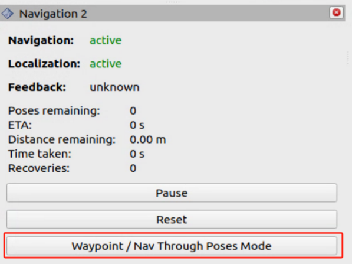

(4) Click the icon, then left-click and drag on the map at a specific point to set the direction and define a target point. To set multiple target points, repeat the above steps.

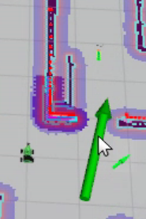

(5) Click the button shown in the lower-left corner to start navigation.


(6) To stop the navigation, return to the terminal and press Ctrl+C in each terminal window to close the running process.

### 8.4.8 Gazebo and MoveIt2 Simulation Integration

* **Enable Simulation Service**

(1) Start the virtual machine. Click-on  to initiate the command-line terminal.

(2) Execute the following command to initiate the integration of the Gazebo and MoveIt2.

```
ros2 launch robot_gazebo worlds.launch.py moveit_unite:=true
```

(3) Enter the following command to start the MoveIt2.

```
ros2 launch hiwonder_moveit_config demo.launch.py use_sim_time:=true use_gazebo:=true
```

* **Robot Arm Control**

The MoveIt2 interface is shown below:

Position 1: RVIZ toolbar

Position 2: MoveIt2 Debugging Area

Position 3: Simulation Model Adjustment Area


(1) In the MoveIt2 Debugging Area, find and click on the **"Planning"** section.


(2) In the Simulation Model Adjustment Area, there are three colored arrows: red, green, and blue. Click and drag the arrows to adjust the robotic arm's orientation. From the robot's perspective:

Green represents the X-axis (positive direction is to the left of the robot).

Red represents the Y-axis (positive direction is in front of the robot).

Blue represents the Z-axis (positive direction is above the robot).

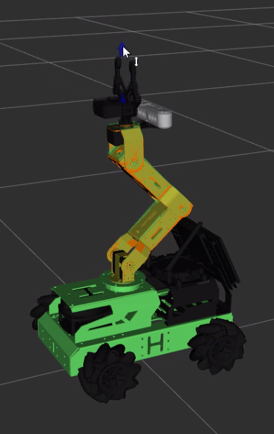

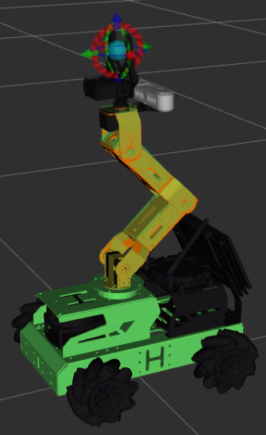

(3) After successfully planning the arm's motion path, the new position will be highlighted in orange. If the new position causes a collision with other parts of the robot, it will be marked in red. In this case, you need to adjust the position to avoid the collision; otherwise, the action cannot be executed.

Orange indicates an executable state, as shown below:


For example, if the robotic arm is positioned as shown in the image, it will collide with the depth camera, turning red (non-executable state) as shown below:

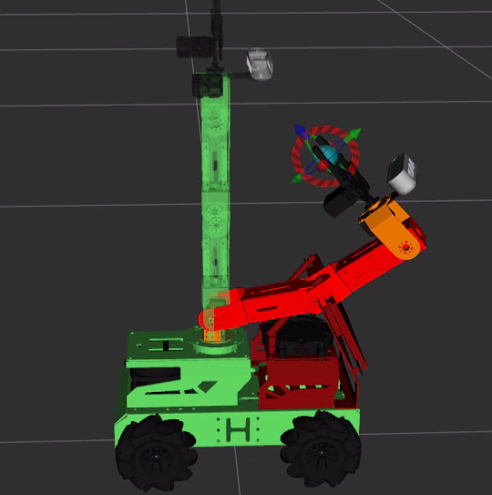

(4) Once the path is planned, return to the **"Planning"** section and click **"Plan"**. The simulation model will demonstrate the movement path from the original position to the newly planned position.

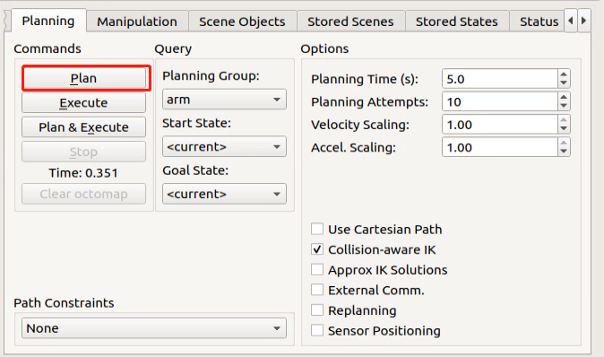

(5) Next, click **"Execute"** to make both the simulation model and the robotic arm follow the planned path.

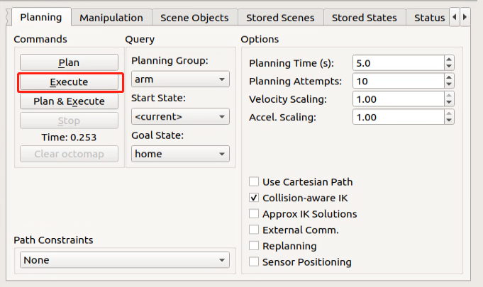


(6) Alternatively, click **"Plan & Execute"**, and the robotic arm will first display the newly planned movement path, then execute the motion.


(7) You can also observe that the path planned in MoveIt2 is synchronized with the Gazebo interface.

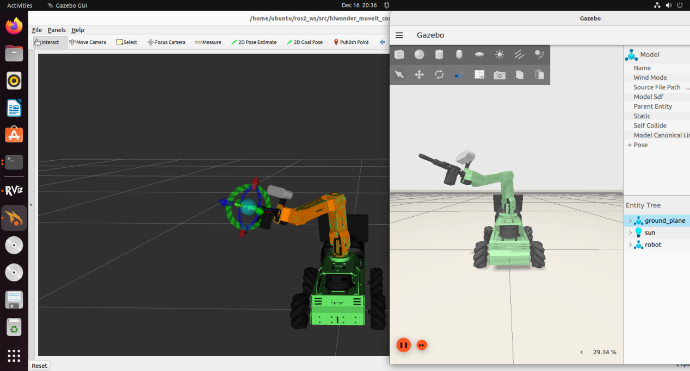

* **Gripper Control**

(1) To control the gripper movement, select `gripper` in the **"Planning Group"**.

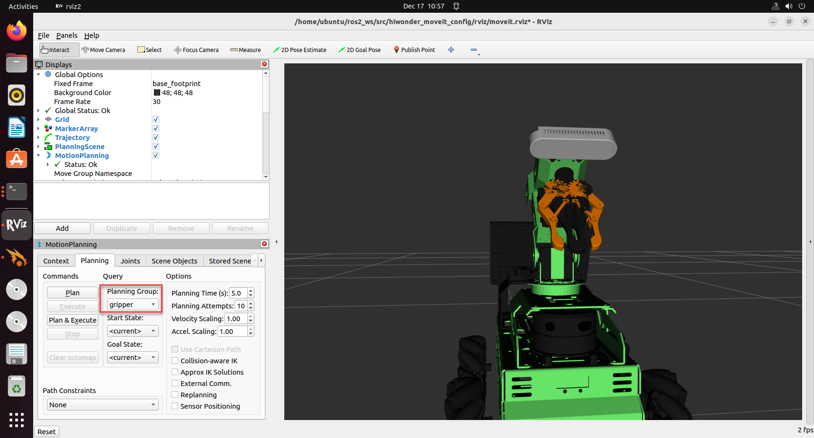

(2) Drag the **r joint** to control the gripper's rotation.


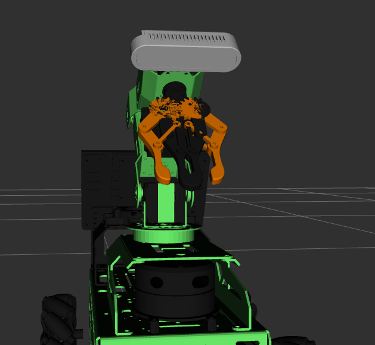

(3) Once the motion trajectory is planned, return to **"Planning"** and click **"Plan & Execute"** to execute the movement.

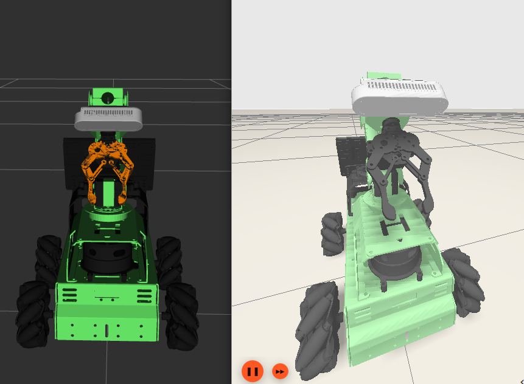