# 9 Voice Control Course

<p id="anchor_9_1"></p>

## 9.1 Voice Control Basic Lesson (Ring Microphone Array)

This document serves as an informational guide, providing an overview of the 6-channel ring microphone array, including its introduction, assembly, and debugging processes. It is specifically designed for single-module use.

### 9.1.1 R818 Noise Reduction Board

* **R818 Noise Reduction Board Introduction**

The R818 noise reduction board serves as a voice front-end solution featuring a multi-microphone array. Powered by a high-performance quad-core edge computing processor, this module internally incorporates iFLYTEK's voice algorithm. Leveraging the spatial filtering characteristics of the microphone array, it uses angle positioning to awaken individuals. This creates a directional pickup beamforming, suppressing noise outside the beam and enhancing far-field audio pickup quality. Specifically designed for human-machine interaction terminals, it integrates a high-performance echo cancellation algorithm to alleviate the challenges of speech and semantic recognition. Developers can seamlessly integrate this module to empower products with functionalities like multi-microphone audio capture, wake-up, noise reduction, and echo cancellation.

* **R818 Noise Reduction Board Specification**

The purpose of the interface on the R818 noise reduction board is outlined below:


| **Interface NO.** | **Name**                 | **Function**                           |
| :----------------: | :------------------------: | :-------------------------------------: |
| **1**              | **Serial port**          | For PC software communication          |
| **2**              | **Reference signal port** | Power amplifier/echo cancellation reference signal |
| **3**              | **Microphone port**      | Connect to 6-channel microphone array  |
| **4**              | **Independent power port** | Power input port                       |
| **5**              | **UAC port**             | Audio output port                      |

* **R818 Noise Reduction Board Parameter Description**

(1) Performance Parameter Indicator

Key parameter:

| **Microphone**         | SPA1687LR5H-1    |
| :-------------------: | :---------------: |
| **Sensitivity**       | -3dBV/Pa         |
| **Signal-to-noise ratio** | 65dB             |
| **PCB size**          | 90mm\*50mm\*1.2mm |
| **External port**     | Serial port, UAC port, independent power port, reference signal port and microphone port |

Electrical parameter:

| **Project**         | **Minimum value** | **Classic value** | **Maximum value** |
| :------------------: | :-----------: | :-----------: | :-----------: |
| **Working voltage** | 4.75V         | 5V            | 5.25V         |
| **Working current** | 250mA         | 300mA         | 400mA         |
| temperature        | -20℃          | 25℃           | 70℃           |
| relative humidness | /             | /             | 95%           |

(2) Structure & Size

Front view:


Back view:


* **6-Channel Ring Microphone Array Introduction**

The 6-Channel Ring Microphone Array is a board designed for microphone pickup, known for its heightened sensitivity and excellent signal-to-noise ratio. It incorporates six analog silicon microphones arranged in a circular pattern. When integrated with the mainboard, it excels in delivering advanced features such as Acoustic Echo Cancellation (AEC), reduction of environmental noise, and factory-level sound pickup capabilities extending up to 10 meters.

* **Ring 6-Channel Microphone Array Specification**

The structure of the ring 6-channel microphone array is as below:

Front： Back：


(1) Signal interface: connects to R818 noise reduction board.

(2) At the rear, six analog silicon microphones are strategically arranged in a circular pattern to optimize audio reception.


* **6-Channel Ring Microphone Array Parameter**

(1) Performance Parameter

Key parameter:

| **Microphone**         | SPA1687LR5H-1    |
| :-------------------: | :---------------: |
| **Sensitivity**       | -3dBV/Pa         |
| **Signal-to-noise ratio** | 65dB             |
| **PCB size**          | 115mm\*12mm\*1.2mm |
| **External port**     | Microphone signal port |

Electrical parameter:

| **Parameter**       | **Minimum value** | **Classic value** | **Maximum value** |
| :------------------: | :-----------: | :-----------: | :-----------: |
| **Working voltage** | /             | 3.3V          | /             |
| **Working current** | /             | 0.8mA         | 10mA          |
| Temperature        | -20℃          | 25℃           | 70℃           |
| Relative humidness | /             | /             | 95%           |

(2) Product Structure & Size

Front view:


Back view:

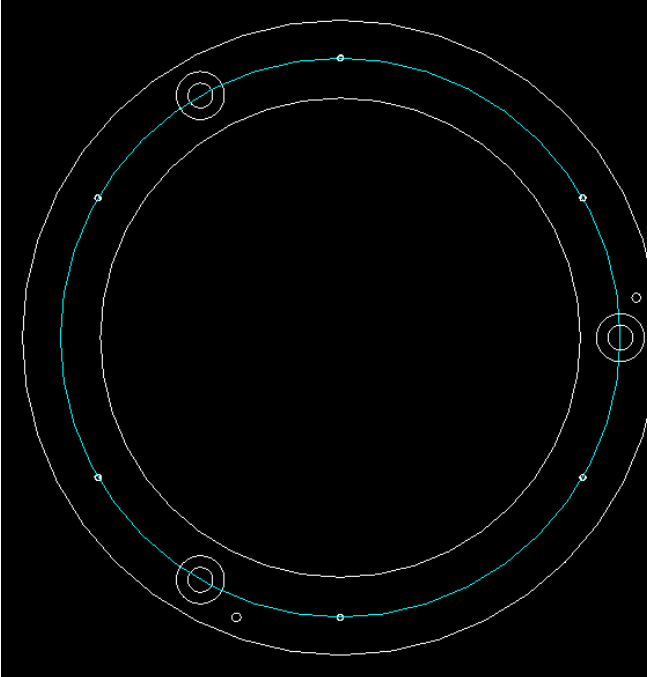

<p id="anchor_9_1_2"></p>

### 9.1.2 Testing the Microphone via Serial Port

* **Wiring**

(1) Please gather the items depicted in the picture below:


(2) Connect the microphone array to the noise reduction board. Be cautious while inserting the connection cable to avoid any forceful insertion that may lead to damage to the port.


(3) Connect the two UAC-to-USB cables to the noise deduction board as below:


(4) Connect the serial port connection cable and UAC cable to the corresponding port on the noise reduction board. First, attach the ring microphone array to the casing. Use the screws to secure it in the three holes highlighted by the red boxes in the image below. Additionally, be sure to align the signal cable connector properly, as shown in the yellow box in the image below.


(5) Next, connect the noise reduction board, which has already been wired, to the corresponding slots in the casing. Pay attention to the orientation of the noise reduction board, as shown in the image below. Use 3M adhesive to secure the signal cable in place, as indicated by the green box in the image.


Tighten the four screws:


(6) Connect the two USB cables to the laptop and run a test to check if the computer recognizes the port numbers. This completes the wiring and installation of the microphone array.


* **Install VMware Workstation Software**

A virtual machine is essentially a computer generated through software emulation, offering a usage experience similar to that of a physical computer. Popular virtual machine software options include VMware Workstation (often called VMware), VirtualBox, Microsoft Virtual PC, and more. In this section, we'll use the example of installing VMware Workstation, initiating, and configuring a virtual machine for explanation.

(1) Extract the virtual machine software package saved in **[6. Voice Environment Setup Tool->Virtual Machine Installation Pack](resources_download.md)**.


(2) Find the folder where the virtual machine was extracted, and double-click on the virtual machine executable file.


(3) Follow the images below to complete the virtual machine installation.


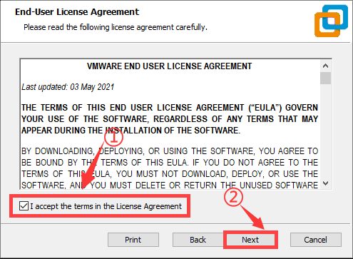


### 9.1.3 Virtual Machine Installation and Configuration

* **Import Virtual Machine**

(1) After entering the virtual machine interface, click on **"Open Virtual Machine"**.

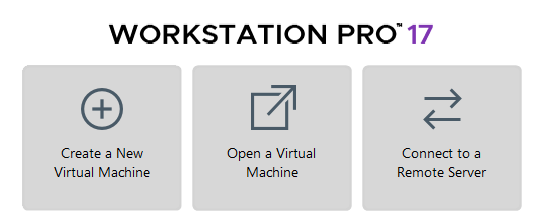

(2) In the popup window, locate the image file under the directory **"[6 Voice Recognition Environment Set Up Tool\6-Channel Microphone Array Image](resources_download.md)"**. Open the image file (the actual name of the image may vary; this image is for reference only).


(3) After opening, you can change the virtual machine's name and local storage path.


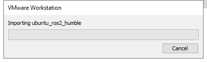

* **Upgrade Virtual Machine**

(1) If upgrading the virtual machine is available after selecting it, proceed with the upgrade; otherwise, skip this step.


(2) Pop-up with the following content, click **"Next"**.


(3) Pop-up with the following content, select **"Virtual Machine 17.5"**.


(4) Then click **"Next"**.


(5) Choose **"Modify this virtual machine"**, then click **"Next"**.


(6) Click **"Finish"**.


(7) Click **"Close"**.


* **Start Virtual Machine**

(1) Click-on **`Power on this virtual machine`**.


(2) After start-up, you will enter the desktop of the virtual machine.


* **Install Dependency**

(1) Click-on  to start the command-line, the execute the following command to install `pip`:

```bash
sudo apt install pip
```

When you encounter the prompt as shown in the following image, press **'y'**, then press Enter.


(2) Run the following command to complete the installation.

```bash
sudo apt install serial
```

### 9.1.4 6-Channel Microphone Array Configuration

* **Create Workspace**

(1) Click-on  to open the command-line terminal, and run the following command to create a folder.

```bash
sudo mkdir ros2_ws
```

When the prompt as shown in the following image appears, enter the password **'ubuntu'**.

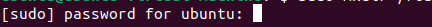

(2) Execute the following command to create a folder.

```bash
sudo mkdir ros2_ws/src
```

(3) Enter the command to grant folder permissions:

```bash
sudo chmod a+w+x+r ros2_ws/ ros2_ws/src/
```

* **Import Feature Pack**

(1) Click on the location shown in the image below to open the folder.

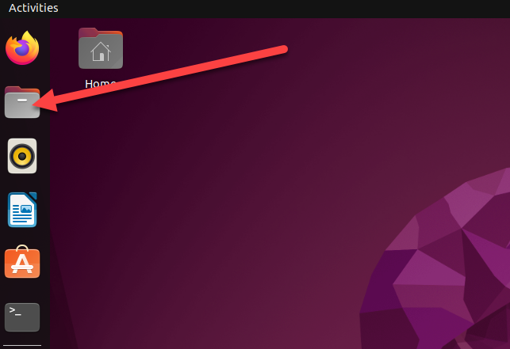

(2) Drag the files from the same directory into the virtual machine folder.


(3) Extract the two files into the current directory.


(4) Enter the extracted folder and move the three folders to `/ros2_ws/src`.


(5) Delete unnecessary files inside `/ros2_ws/src`.


(6) Exit the **'src'** folder and return to the **'ros_ws'** folder, then open the command line.


(7) Enter the command to start compiling the package:

```bash
colcon build
```

Compilation completion will be as shown below:


(8) Enter the command to add environment variables:

```bash
echo "source ~/ros2_ws/install/setup.bash" >> ~/.bashrc
```

(9) Enter the command to navigate to the microphone function package:

```bash
cd /home/ubuntu/ros2_ws/src/xf_mic_asr_offline
```

(10) Enter the command to grant permissions:

```bash
sudo find . -name "*.py" -exec chmod +x+w+r {} \;
```

* **6-Channel Microphone Array Configuration: Apply for offline voice resources and APPID**

As the robot utilizes offline voice recognition, you will require offline voice resources available exclusively on the iFLYTEC Chinese website. Please note that you need to switch the language to Chinese and follow the provided instructions for the process.

(1) Enter iFLYTEC website, <https://www.xfyun.cn/>, then click **"sign in"** to create an account.


(2) Choose **"Sign up with phone number"**, and fill in the required information. (select corresponding country code)


(3) After registration, click **'console->my application'** to add new application.


(4) Fill in the required information, and click **"Submit"**.


(5) Open the application you just added.


(6) Click **"Voice recognition->Offline voice command recognition (Latest version)"**


(7) Download Linux AIKit.


:::{Note}
Each new application offers 90-day free trial, and you will be charged if you continue to use it. When free trial expires, you can add new application again, and each person can only request 5 new applications.
:::

(8) Select the username you created and the Linux platform. After making your choices, select the **'Regular Version'** below, check **'Offline Command Word Recognition'** and **'Voice Wakeup'** options, then click **'SDK Download'**.


(9) Choose **`OK`** to start downloading.


* **Replace Offline Voice Resources and ID**

(1) Unzip the file below and locate the offline voice resource **'common.jet'**.


(2) Click the icon below.


(3) Drag the `Common.jet` file into the specified folder within the virtual machine (as illustrated in the image) to complete the replacement.


(4) Navigate to the folder **`ros_ws/src/xf_mic_asr_offline/launch`** and right click the file **`mic_init.launch`** and choose **`Open With Text Editor`**.


(5) Replace the existing `appid` with the one obtained from the iFLYTEC website. Afterward, press **'Ctrl+S'** to save the changes.

:::{Note}
The offline voice resource should be consistent with the `appid`.
If you are still unable to activate voice control for the car after following the steps above, please reach out to our technical support team at <support@hiwonder.com> for assistance.
:::


* **Import Dynamic Library**

Choose the corresponding directory based on your CPU architecture. Here, we take **'x64'** as an example.

:::{Note}
If you are using a Raspberry Pi, you need to choose the **'arm32'** folder. If you are using a Jetson Nano, choose the **'arm64'** folder. If you are using a PC with Linux or Windows, select the folder based on your system: choose the **'x64'** folder for 64-bit systems and the **'x86'** folder for 32-bit systems.
:::


(1) Enter the command to open the directory containing the dynamic link library (DLL) files for the x64 architecture:

```bash
cd /home/ubuntu/ros2_ws/src/xf_mic_asr_offline/lib/x64/
```

(2) Enter the command to copy the dynamic link libraries to the user directory:

```bash
sudo cp lib* /usr/lib
```

* **Change User Parameters**

After modifying the `APPID`, if you wish to make changes to the speech recognition threshold, recording duration, wake-up word, or wake-up speech, you can refer to the methods described below.

(1) Locate the folder **`ros_ws/src/xf_mic_asr_offline/launch`**, and right-click **`mic_init.launch`**, then select **`Open With Text Editor`**.


(2) Set confidence thresholds for speech results and the duration of each voice command entry based on the two parameters highlighted in the red box in the following diagram.


(3) Modify the parameter highlighted in the red box below to change the wake-up word.


English wakeup word format: `word1 word2 word3`

(4) To change the wakeup language, you can directly change the below parameter.


(5) After modification, press **`Ctrl+S`** to save the editing.

* **Configure Microphone Port**

(1) Start the virtual machine.


(2) Press the shortcut key **'Ctrl + Alt + T'** to open the command line terminal, then enter the following command to copy the microphone interface mapping rules into the system:

```bash
sudo cp /home/ubuntu/ros2_ws/src/xf_mic_asr_offline/xf_mic.rules /etc/udev/rules.d/
```

(3) Enter the following three commands one by one to update the USB mapping rules:

```bash
sudo udevadm control --reload-rules
sudo service udev restart
sudo udevadm trigger
```

### 9.1.5 Set Wake-Up Command

(1) Connect the microphone array to the computer according to section [9.1.2 Testing the Microphone via Serial Port -\> Wiring](#anchor_9_1_2).


(2) Connect the device to the virtual machine.


(3) Enter the command to start the initialization node of the six-channel microphone array and burn the wake-up word.

```bash
ros2 launch xf_mic_asr_offline mic_init.launch.py enable_seting:=true
```

(4) After initialization is complete, the following content will appear. The initial startup may be slightly slow, and completion will appear as shown below:

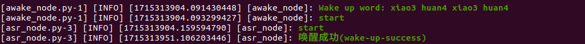

(5) If you want to close this node, use short-cut **`Ctrl+C`**.

### 9.1.6 Sound Source Localization and Speech Recognition

* **Start Node**

Enter the command to start the initialization node of the six-channel microphone array:

```bash
ros2 launch xf_mic_asr_offline mic_init.launch.py
```


(1) Voice Wake-up

After starting the microphone node, say **'Hello Hiwonder'** into the microphone. The command line will provide recognition feedback:


(2) Voice Recognition

After activating the microphone, speak the specific command to be recognized.


Command location: `ros2_ws/src/xf_mic_asr_offline/config/call.bnf`

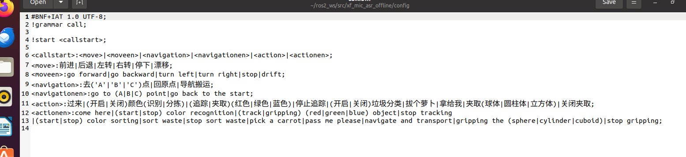

(3) Sound Source Localization

Open a new command-line terminal, and run the following command to initiate the microphone array node.

```bash
ros2 topic echo /awake_node/angle
```

After waking up the microphone, it will print the angle of the sound relative to the microphone.

* **FAQ**

(1) 10108 Error Code

Initiating the initialization service for the 6-channel microphone array multiple times may lead to the problem shown in the following image. However, this issue does not impact functionality. To restore normal operation, just repeat the wake-up words **"Hello Hiwonder"**.

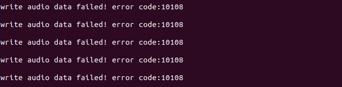


(2) Solution for Unable to Find the Microphone Device

If the error shown in the image below occurs, follow these steps to recover:


Enter the following command to clear the occupation:

```bash
sudo apt remove brltty -y
```

Enter the following three commands one by one to update the USB mapping rules:

```bash
sudo udevadm control --reload-rules
sudo service udev restart
sudo udevadm trigger
```

### 9.1.7 Sound Card Introduction and Usage Instruction

* **Sound Card Introduction**

As a fundamental component of multimedia systems, a sound card converts analog sound waves into digital signals and vice versa. The primary function of a sound card is to convert raw audio signals from sources such as microphones, tapes, and disks, and output them to various devices such as speakers, headphones, amplifiers, and recorders. Additionally, sound cards can support the playback of the converted audio signals through MIDI interfaces. Below is about the introduction to USB to audio driver-free sound card.

(1) Sound Card Interface


| **NO.** | **Name**             | **Function**                            |
| :-----: | :--------------------: | :---------------------------------------: |
| **1**   | **USB interface**    | connect to PC or embedded devices       |
| **2**   | **Right Channel Port** | Can be connected to an external speaker |
| **3**   | **Left Channel Port**  | Can be connected to an external speaker. |

* **Hardware Testing**

Follow the instruction to test sound card and speaker.

(1) Start the virtual machine. Regarding the configuration and installation method of the virtual machine, please refer to the section **'9.1.3 Virtual Machine Installation and Configuration'**.

:::{Note}
If the virtual machine is still powered on after configuration, the following prompt will pop up when you insert microphone.
:::


(2) Connect sound card and speaker to any USB interface on computer.

(3) Click the power button in the top-right corner, then click the settings icon as shown in the figure below.

 

(4) Navigate to the **Sound** tab, and under the Output section, select Speaker. By default, the output device should be listed as `Digital Output ---- USB Audio Device`. Then click **"Test"** in the configuration area below.


(5) Once opened, users should connect the wires to the **SPK-** and **SPK+** ports correctly. Since the speaker is mono, you can test it by selecting **'Front Right.'** For detailed information on wiring connections, please refer to Section **[9.1.2 Testing the Microphone via Serial Port -\> Wiring](#anchor_9_1_2)**.

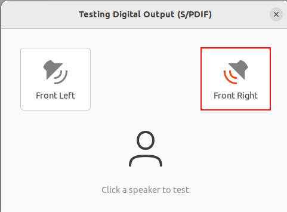

If the speaker plays English voice, it means that the speaker functions normally.

* **Import External Music File**

Virtual machine only supports audio file of the format of `wav`. Abundant materials are available on the Internet teaching you how to convert the format into `wav`.

(1) Copy the converted audio file (e.g., **'test_sound.wav'**) to the same directory as this document. You can also download WAV format files from the internet for import, which will be used as an example for demonstration.


(2) Next, switch back to the virtual machine and click on the file manager  located on the left side of the screen. Select the **'test_sound'** file by left-clicking on it, then drag it into the file manager. This will save it in the home directory of the user group.


(3) Double-click the `test_sound.wav` file to play the music.

(4) Run the following command in sequence to play music:

```bash
sudo apt-get install sox -y
play test_sound.wav
```

(5) If you want to pause the music, press **"Ctrl+C"**.

## 9.2 Six-Microphone Circular Array Installation

(1) Secure the six-microphone circular array using four M4×6 round-head Phillips screws.


(2) The image below shows the assembled six-microphone array.


(3) Connect the microphone array to Port 10 of the USB hub located at the bottom of the robot using a USB cable.


## 9.3 Voice Interaction Application

<p id="anchor_9_3_1"></p>

### 9.3.1 6-Channel Microphone Array Configuration (Must Read)

* **Apply for Offline Voice Resources and ID**

As the robot utilizes offline voice recognition, you will require offline voice resources available exclusively on the iFLYTEC Chinese website. Please note that you need to switch the language to Chinese and follow the provided instructions for the process.

(1) Enter iFLYTEC website <https://www.xfyun.cn/>, then click **"sign in"** to create an account.


(2) Choose **"Sign up with phone number"**, and fill in the required information. (select corresponding country code)


(3) After registration, click **'console->my application'** to add new application.


(4) Fill in the required information, and click **"Submit"**.

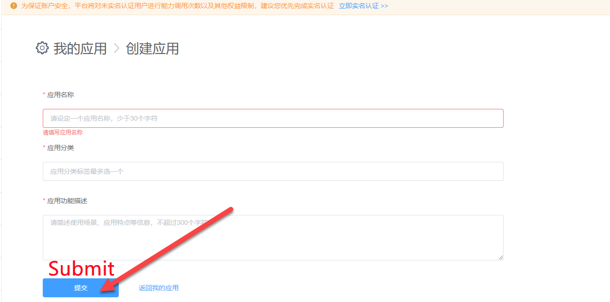

(5) Open the application you just added.


(6) Then select **Speech Recognition → Offline Command Recognition** (New Version)


(7) Download Linux AIKit.


(8) Choose **`OK`** to start downloading.


:::{Note}
Each new application can only be used for free for ninety days. Subsequent use requires payment. When our application expires, we can apply for a new one up to five times per person. The method for applying for a new application is the same as mentioned above.
:::

(9) Next, select your created username and Linux platform. After selecting, choose the **'Standard Version'** below, check **'Offline Command Recognition'** and **'Voice Wake-up'** functions, then click **'SDK Download'**.


(10) Tick `I agree` and choose `OK` to confirm the download.


* **Replace Offline Voice Resources and ID**

(1) Extract the following file.


:::{Note}
The file is downloaded to the path you have set.
:::

(2) Open the extracted folder **"Linux_aitalk_exp1227_01997b6c"** (The version ID `1227_216da28f` is not a fixed version and is distributed by the official source). Click **"\bin\msc\res\asr"** to find **"common.jet"**, then drag this file to the system image desktop.


(3) Click-on  to start the command-line terminal.

(4) Enter the command and press Enter to replace the `common.jet` file:

```bash
cp /home/ubuntu/Desktop/common.jet /home/ubuntu/ros2_ws/src/xf_mic_asr_offline/config/msc/res/asr/
```

(5) Run the following command and hit Enter key to revise `APPID`.

```bash
vim ~/ros2_ws/src/xf_mic_asr_offline/launch/mic_init.launch.py
```

(6) Locate the designated code:


(7) Press the **'i'** key to enter edit mode. Change **'01997b6c'** to the obtained `APPID`.

(8) After modifying the `APPID` and replacing the `common.jet` file, connect to the robot's remote desktop and double-click  to open it. Locate the **"Voice Function"** option and set it to **"English"** to enable English language support for subsequent voice interactions.


### 9.3.2 Voice-Controlled Car Movement

This lesson focuses on issuing voice commands to control the robot's movements. For example, you can use voice commands to make the robot move forward, backward, and perform other corresponding actions.

* **Program Logic**

In this section, the experiment utilizes the robot`s voice recognition capabilities to control its movements. For example, you can use voice commands to make the robot move forward, backward, etc.

In terms of program design, the system subscribes to the voice recognition service published by the microphone array node. It performs operations such as localization, noise reduction, and recognition to obtain the recognized phrases and the direction of the sound source. Once the robot is successfully awakened and a specific command is spoken, the robot will provide a corresponding voice response. Additionally, after recognizing specific colors, the robot can be controlled to move forward, backward, turn left, or turn right based on the issued voice commands.

* **Preparation**

(1) Please ensure the microphone array, sound card and speaker are connected to the corresponding port of USB hub.

(2) Confirm that the `APPID` in the configuration file has been modified and the `Common.jet` file has been replaced. You can refer to the document section [9.3.1 6-Channel Microphone Array Configuration (Must Read)](#anchor_9_3_1) for the application of `APPID` and file replacement process.

* **Operation Steps**

:::{Note}
The input command should be case sensitive, and keywords can complemented using Tab key.
:::

(1) Start the robot, and access the robot system desktop using remote control software NoMachine. For details you may refer to: [1.6. Development Environment Setup and Configuration](1.Quick_Start_Guide.md#development-environment-setup-and-configuration).

(2) The default system wake word is **"hello hiwonder"** in English. To switch to Chinese or flashing command words, please refer to the document under the directory of [9.4 Switching Wake Words Between Chinese and English](#anchor_9_4) for instructions.

(3) Click-on  to open the command-line terminal.

(4) Run the command, and hit Enter to disable the app auto-start service.

```bash
sudo systemctl stop start_app_node.service
```

(5) Execute the command, and hit Enter to enable the voice control function.

```bash
ros2 launch xf_mic_asr_offline voice_control_move.launch.py
```

(6) To begin by saying the wake-up word **"Hello Hiwonder"** and waiting for the speaker to play **"I`m here"** before proceeding with the next voice command. For instance, say **"go forward"**; upon recognition of the voice command by the robot, the speaker will play **"Copy that. Start moving forward"**, and then the robot will execute the command accordingly.

The following are voice commands and their corresponding control actions:

| **Voice Command** | **Control Action**             |
| :-----------------: | :----------------------------: |
| Go forward        | Control the robot car to go forward  |
| Go backward       | Control the robot car to go backward |
| Turn left         | Control the robot car to turn left   |
| Turn right        | Control the robot car to turn right  |


:::{Note}

* For a better experience, please ensure you are in a relatively quiet environment.
* Before issuing each voice command, start by saying the wake-up word.
* Speak loudly and clearly when giving voice commands.

* Give voice commands one at a time and wait for the robot to complete one feedback before giving additional commands.

:::

(7) If you want to turn off this feature, simply open a new command line terminal and enter the following command.

```bash
~/.stop_ros.sh
```

(8) Next, close all the terminals that were previously opened.

* **Program Analysis**

Voice-controlled robot movement involves establishing a connection between the voice control node and the underlying driver node of the robot. Subsequently, the car is controlled to execute corresponding actions based on the commands issued through voice input.


(1) launch File

This launch file is saved in:
[/home/ubuntu/ros2_ws/src/xf_mic_asr_offline/launch/voice_control_move.launch.py](../_static/source_code/xf_mic_asr_offline.zip)

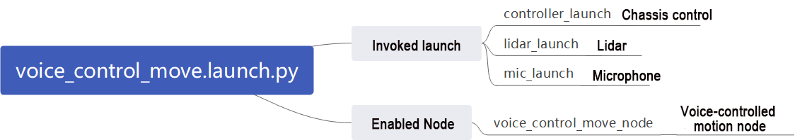

① Launch File

{lineno-start=21}

```python
  controller_launch = IncludeLaunchDescription(
      PythonLaunchDescriptionSource(
          os.path.join(controller_package_path, 'launch/controller.launch.py')),
  )

  lidar_launch = IncludeLaunchDescription(
      PythonLaunchDescriptionSource(
          os.path.join(peripherals_package_path, 'launch/lidar.launch.py')),
  )

  mic_launch = IncludeLaunchDescription(
      PythonLaunchDescriptionSource(
          os.path.join(xf_mic_asr_offline_package_path, 'launch/mic_init.launch.py')),
  )
```

`controller_launch` is used to start the chassis control node, allowing control of the servo motor after startup.

`lidar_launch` starts the radar node, which will publish radar data.

`mic_launch` activates the microphone functionality.

② Initiate the Node

{lineno-start=36}

```python
  voice_control_move_node = Node(
      package='xf_mic_asr_offline',
      executable='voice_control_move.py',
      output='screen',
  )
```

`voice_control_move_node` is used to call the voice control movement source code and start the program.

(2) Python Launch File


The source code of the program is saved in
[/home/ubuntu/ros2_ws/src/xf_mic_asr_offline/scripts/voice_control_move.py](../_static/source_code/xf_mic_asr_offline.zip)

① Function: `Main`

{lineno-start=236}

```python
def main():
  node = VoiceControMovelNode('voice_control_move')
  rclpy.spin(node)
  node.destroy_node()
  rclpy.shutdown()
```

Enable the voice-controlled motion.

② Class: `VoiceControlMoveNode`

{lineno-start=27}
```python
class VoiceControMovelNode(Node):
```

③ Init:

{lineno-start=28}

```python
  def __init__(self, name):
      rclpy.init()
      super().__init__(name)

      self.angle = None
      self.words = None
      self.running = True
      self.haved_stop = False
      self.lidar_follow = False
      self.start_follow = False
      self.last_status = Twist()
      self.threshold = 3
      self.speed = 0.3
      self.stop_dist = 0.4
      self.count = 0
      self.scan_angle = math.radians(90)

      self.pid_yaw = pid.PID(1.6, 0, 0.16)
      self.pid_dist = pid.PID(1.7, 0, 0.16)

      self.language = os.environ['ASR_LANGUAGE']
      self.lidar_type = os.environ.get('LIDAR_TYPE')
      self.machine_type = os.environ.get('MACHINE_TYPE')
      self.mecanum_pub = self.create_publisher(Twist, '/controller/cmd_vel', 1)
      self.buzzer_pub = self.create_publisher(BuzzerState, '/ros_robot_controller/set_buzzer', 1)
      qos = QoSProfile(depth=1, reliability=QoSReliabilityPolicy.BEST_EFFORT)
      self.create_subscription(LaserScan, '/scan_raw', self.lidar_callback, qos)  # Subscribe to Lidar data(订阅雷达数据)
      self.create_subscription(String, '/asr_node/voice_words', self.words_callback, 1)
      self.create_subscription(Int32, '/awake_node/angle', self.angle_callback, 1)

      self.client = self.create_client(Trigger, '/asr_node/init_finish')
      self.client.wait_for_service()  # Blocking wait(阻塞等待)
      self.declare_parameter('delay', 0)
      time.sleep(self.get_parameter('delay').value)
      self.mecanum_pub.publish(Twist())
      self.play('running')

      self.get_logger().info('唤醒口令: 小幻小幻(Wake up word: hello hiwonder)')
      self.get_logger().info('唤醒后15秒内可以不用再唤醒(No need to wake up within 15 seconds after waking up)')
      if self.machine_type == 'JetRover_Acker':
          self.get_logger().info('控制指令: 左转 右转 前进 后退(Voice command: turn left/turn right/go forward/go backward)')
      else:
          self.get_logger().info('控制指令: 左转 右转 前进 后退 过来(Voice command: turn left/turn right/go forward/go backward/come here)')
      self.time_stamp = time.time()
      self.current_time_stamp = time.time()
      threading.Thread(target=self.main, daemon=True).start()
      self.create_service(Trigger, '~/init_finish', self.get_node_state)
      self.get_logger().info('\033[1;32m%s\033[0m' % 'start')
```

Initialize various parameters, call the chassis node, buzzer node, Lidar node, and voice recognition node, and finally start the main function.

④ `get_node_state`:

{lineno-start=77}

```python
  def get_node_state(self, request, response):
      response.success = True
      return response
```

Initialize the status of the node.

⑤ `Play`:

{lineno-start=81}

```python
  def play(self, name):
      voice_play.play(name, language=self.language)
```

Play the audio

⑥ `words_callback`:

{lineno-start=84}

```python
  def words_callback(self, msg):
      self.words = json.dumps(msg.data, ensure_ascii=False)[1:-1]
      if self.language == 'Chinese':
          self.words = self.words.replace(' ', '')
      self.get_logger().info('words:%s' % self.words)
      if self.words is not None and self.words not in ['唤醒成功(wake-up-success)', '休眠(Sleep)', '失败5次(Fail-5-times)',
                                                       '失败10次(Fail-10-times']:
          pass
      elif self.words == '唤醒成功(wake-up-success)':
          self.play('awake')
      elif self.words == '休眠(Sleep)':
          msg = BuzzerState()
          msg.freq = 1000
          msg.on_time = 0.1

          msg.off_time = 0.01
          msg.repeat = 1
          self.buzzer_pub.publish(msg)
```

The voice recognition callback function reads data returned by the microphone through the node.

⑦ `angle_callback`:

{lineno-start=103}

```python
  def angle_callback(self, msg):
      self.angle = msg.data
      self.get_logger().info('angle:%s' % self.angle)
      self.start_follow = False
      self.mecanum_pub.publish(Twist())
```

The sound source recognition callback function will determine the angle of the sound source relative to the microphone based on the wake-up signal.

⑧ `lidar_callback`:

{lineno-start=109}

```python
  def lidar_callback(self, lidar_data):
      twist = Twist()
      # Data size= scanning angle/ the increased angle per scan(数据大小 = 扫描角度/每扫描一次增加的角度)
      if self.lidar_type != 'G4':
          min_index = int(math.radians(MAX_SCAN_ANGLE / 2.0) / lidar_data.angle_increment)
          max_index = int(math.radians(MAX_SCAN_ANGLE / 2.0) / lidar_data.angle_increment)
          left_ranges = lidar_data.ranges[:max_index]  #  The left data(左半边数据)
          right_ranges = lidar_data.ranges[::-1][:max_index]  #  The right data(右半边数据)
      elif self.lidar_type == 'G4':
          '''
              ranges[right...->left]

                  forward
                   lidar
               left 0 right

          '''
          min_index = int(math.radians((360 - MAX_SCAN_ANGLE) / 2.0) / lidar_data.angle_increment)
          max_index = min_index + int(math.radians(MAX_SCAN_ANGLE / 2.0) / lidar_data.angle_increment)
          left_ranges = lidar_data.ranges[::-1][min_index:max_index][::-1]  #  The left data(左半边数据)
          right_ranges = lidar_data.ranges[min_index:max_index][::-1]  #  The right data(右半边数据)
      # self.get_logger().info(self.lidar_type)
      if self.start_follow:
          #  Get the data according to the settings(根据设定取数据)
          angle = self.scan_angle / 2
          angle_index = int(angle / lidar_data.angle_increment + 0.50)
          left_range, right_range = np.array(left_ranges[:angle_index]), np.array(right_ranges[:angle_index])

          
          # self.get_logger().info(str(left_range))
          # The merged distance data from right half counterclockwise to the left half(拼合距离数据, 从右半侧逆时针到左半侧)
          ranges = np.append(right_range[::-1], left_range)
          nonzero = ranges.nonzero()
          nonan = np.isfinite(ranges[nonzero])
          dist_ = ranges[nonzero][nonan]
          # self.get_logger().info(str(dist_))
          if len(dist_) > 0:
              dist = dist_.min()
              min_index = list(ranges).index(dist)
              angle = -angle + lidar_data.angle_increment * min_index  # Calculate the angle corresponding to the minimum value(计算最小值对应的角度)
              # self.get_logger().info(str([dist, angle]))
              if dist < self.threshold and abs(math.degrees(angle)) > 8:  # Control the left and right(控制左右)
                  if self.lidar_type != 'G4':
                      self.pid_yaw.update(-angle)
                      twist.angular.z = common.set_range(self.pid_yaw.output, -self.speed * 6.0, self.speed * 6.0)
                  elif self.lidar_type == 'G4':
                      self.pid_yaw.update(angle)
                      twist.angular.z = -common.set_range(self.pid_yaw.output, -self.speed * 6.0, self.speed * 6.0)
              else:
                  twist.angular.z = 0.0
                  self.pid_yaw.clear()

              if dist < self.threshold and abs(self.stop_dist - dist) > 0.04:  # Control the front and back(控制前后)
                  self.pid_dist.update(self.stop_dist - dist)
                  twist.linear.x = common.set_range(self.pid_dist.output, -self.speed, self.speed)
              else:
                  twist.linear.x = 0.0
                  self.pid_dist.clear()

              if abs(twist.angular.z) < 0.008:
                  twist.angular.z = 0.0
              if abs(twist.linear.x) < 0.05:
                  twist.linear.x = 0.0
              if twist.linear.x == 0 and twist.angular.z == 0:
                  self.count += 1
              if self.count >= 10:
                  self.count = 0
                  self.start_follow = False
              self.mecanum_pub.publish(twist)
```

The Lidar callback function processes data based on Lidar input. The follow mode is also handled here. It calculates the angular velocity using the angle identified by the microphone sound source localization and PID. The function then begins tracking the object closest to the robot, adjusting linear and angular velocities based on the Lidar-detected object's position using PID control.

⑨ Main：

{lineno-start=179}

```python
  def main(self):
      while True:
          if self.words is not None:
              twist = Twist()
              if self.words == '前进' or self.words == 'go forward':
                  self.play('go')
                  self.time_stamp = time.time() + 2
                  twist.linear.x = 0.2
              elif self.words == '后退' or self.words == 'go backward':
                  self.play('back')
                  self.time_stamp = time.time() + 2
                  twist.linear.x = -0.2
              elif self.words == '左转' or self.words == 'turn left':
                  self.play('turn_left')
                  self.time_stamp = time.time() + 2
                  if self.machine_type == 'JetRover_Acker':
                      twist.linear.x = 0.2
                      twist.angular.z = twist.linear.x/0.5 
                  else:
                      twist.angular.z = 0.8
              elif self.words == '右转' or self.words == 'turn right':
                  self.play('turn_right')
                  self.time_stamp = time.time() + 2
                  if self.machine_type == 'JetRover_Acker':
                      twist.linear.x = 0.2
                      twist.angular.z = -twist.linear.x/0.5
                  else:
                      twist.angular.z = -0.8
              elif self.words == '过来' or self.words == 'come here' and self.machine_type != 'JetRover_Acker':
                  self.play('come')
                  if 270 > self.angle > 90:
                      twist.angular.z = -1.0
                      self.time_stamp = time.time() + abs(math.radians(self.angle - 90) / twist.angular.z)
                  else:
                      twist.angular.z = 1.0
                      if self.angle <= 90:
                          self.angle = 90 - self.angle
                      else:
                          self.angle = 450 - self.angle
                      self.time_stamp = time.time() + abs(math.radians(self.angle) / twist.angular.z)
                  # self.get_logger().info(self.angle)
                  self.lidar_follow = True
              elif self.words == '休眠(Sleep)':
                  time.sleep(0.01)
              self.words = None
              self.haved_stop = False
              self.mecanum_pub.publish(twist)
          else:
              time.sleep(0.01)
          self.current_time_stamp = time.time()
          if self.time_stamp < self.current_time_stamp and not self.haved_stop:
              self.mecanum_pub.publish(Twist())
              self.haved_stop = True
              if self.lidar_follow:
                  self.lidar_follow = False
                  self.start_follow = True
```

After receiving commands, the execution strategy adjusts the linear and angular velocities differently based on each command, thereby controlling the robot for various movements.

* **Function Extension**

(1) Change Wake-Up Command

The default wake-up command is **"Hello Hiwonder"**, which can be changed by revising the configuration file. For example, change it to **小爱小爱**.

:::{Note}
The input command should be case sensitive, and keywords can be complemented using Tab key.
:::

① Start the robot, and access the robot system using the remote control software NoMachine.

② Click-on  to initiate the command-line terminal.

③ Run the command and hit Enter to navigate to the directory containing configuration file.

```bash
vim ./ros2_ws/src/xf_mic_asr_offline/launch/mic_init.launch.py
```

④ Locate the following code.


⑤ Press `I` key to enter the editing mode, and change the vale of `chinese_awake_words` to "**xiao3 ai4 xiao3 ai4**".


⑥ After modification, press `Esc` key, and input `:wq`, then hit Enter to save and exit the file.


⑦ Run the following command to set the wake-up command:

```bash
ros2 launch xf_mic_asr_offline mic_init.launch.py enable_setting:=true
```

Setting up takes approximately 30 seconds, and next time it starts, there's no need to add the parameter **"enable_setting"**.

⑧ Restart the game according to the section **`9.3.2.3 Operation Steps`**.

### 9.3.3 Voice-Controlled Robotic Arm

* **Program Logic**

In this section, the robot uses its built-in speech recognition system in combination with a vision-enabled robotic arm to execute specific actions in response to voice commands.

The program subscribes to the microphone array node to access the voice recognition service. It performs localization, noise reduction, and speech recognition, retrieving both the recognized sentence and the direction of the sound source. Once the robot is successfully awakened, users can speak specific commands. The robot responds with voice feedback and, upon detecting certain colors, performs the corresponding arm movement based on the received command.

* **Preparation**

Please ensure the microphone array, sound card and speaker are connected to the corresponding port of USB hub.

Ensure that you have remotely modified the configuration file to replace the `APPID` and the `Common.jet` file obtained from the installation of iFlytek according to the file [9.1 Voice Control Basic Lesson (Ring Microphone Array)](#anchor_9_1).

* **Operation Steps**

:::{Note}
The input command should be case sensitive, and keywords can be complemented using Tab key.
:::

(1) Start the robot, and access the robot system desktop using remote control software NoMachine. For details you may refer to: [1.6 Development Environment Setup and Configuration](1.Quick_Start_Guide.md#development-environment-setup-and-configuration).

(2) The default system wake word is **"hello hiwonder"** in English. To switch to Chinese or flashing command words, please refer to the document under the directory of [9.4 Switching Wake Words Between Chinese and English](#anchor_9_4) for instructions.

(3) Click-on  to start the command-line terminal.

(4) Run the command, and hit Enter key to disable the app auto-start service.

```bash
sudo systemctl stop start_app_node.service
```

(5) Enter the command and press Enter key to activate the voice controll function:

```bash
ros2 launch xf_mic_asr_offline voice_control_arm.launch.py
```

(6) After the program successfully loads, first say the wake word **'Hello Hiwonder,'** and wait for the speaker to respond with **'I`m here.'** Then, say the command **'Pick a carrot,'** and the robotic arm will grasp the object directly in front of it. If you say **'Hand it to me,'** the robotic arm will pass the object to the user from the side.


:::{Note}

* For the best experience, conduct the experiment in a quiet environment.

* It`s advisable to say the wake word before each voice command.

* Speak clearly and loudly when giving voice commands.

* Issue voice commands one at a time, and wait for the robot to finish responding before giving the next command.


:::

(7) If you need to disable this feature, open a new command line terminal and enter the following command.

```bash
~/.stop_ros.sh
```

(8) Then, close all previously opened terminals.

* **Program Analysis**

This experiment establishes communication between the speech control node and the robot's lower-level control nodes. Then, control the robotic arm to execute corresponding actions according to the issued voice commands.


(1) launch File


The launch file is saved in:
[/home/ubuntu/ros2_ws/src/xf_mic_asr_offline/launch/voice_control_arm.launch.py](../_static/source_code/xf_mic_asr_offline.zip)

① Launch File

{lineno-start=19}

```python
  controller_launch = IncludeLaunchDescription(
      PythonLaunchDescriptionSource(
          os.path.join(controller_package_path, 'launch/controller.launch.py')),
  )

  mic_launch = IncludeLaunchDescription(
      PythonLaunchDescriptionSource(
          os.path.join(xf_mic_asr_offline_package_path, 'launch/mic_init.launch.py')),
  )
```

`controller_launch` is used to start the chassis control node, enabling control of the servo motor once launched.

`mic_launch` is used to start the microphone function.

② Initiate Node

{lineno-start=29}

```python
  voice_control_arm_node = Node(
      package='xf_mic_asr_offline',
      executable='voice_control_arm.py',
      output='screen',
  )
```

`voice_control_arm_node` is used to call the voice-controlled movement source code and start the program.

(2) Python Launch File


The source code of this program is saved in:
[/home/ubuntu/ros2_ws/src/xf_mic_asr_offline/scripts/voice_control_arm.py](../_static/source_code/xf_mic_asr_offline.zip)

① Function: `Main`

{lineno-start=68}

```python
def main():
  node = VoiceControlColorDetectNode('VoiceControMovelNode')
  rclpy.spin(node)
  node.destroy_node()
  rclpy.shutdown()
```

Launch Voice-Controlled Move

② Class: `VoiceControlArmNode`

{lineno-start=17}

```python
class VoiceControlColorDetectNode(Node):
```

③ Init:

{lineno-start=18}

```python
  def __init__(self, name):
      rclpy.init()
      super().__init__(name, allow_undeclared_parameters=True, automatically_declare_parameters_from_overrides=True)

      self.language = os.environ['ASR_LANGUAGE']
      self.create_subscription(String, '/asr_node/voice_words', self.words_callback, 1)
      self.buzzer_pub = self.create_publisher(BuzzerState, '/ros_robot_controller/set_buzzer', 1)
      self.controller = ActionGroupController(self.create_publisher(ServosPosition, 'servo_controller', 1), '/home/ubuntu/software/arm_pc/ActionGroups')

      self.create_client(Trigger, '/asr_node/init_finish').wait_for_service()
      self.create_client(Trigger, '/ros_robot_controller/init_finish').wait_for_service()

      self.controller.run_action('init')
      self.play('running')

      self.get_logger().info('唤醒口令: 小幻小幻(Wake up word: hello hiwonder)')
      self.get_logger().info('唤醒后15秒内可以不用再唤醒(No need to wake up within 15 seconds after waking up)')
      self.get_logger().info('控制指令: 拔个萝卜 拿给我(Voice command: pick a carrot/pass me please)')
      self.create_service(Trigger, '~/init_finish', self.get_node_state)
      self.get_logger().info('\033[1;32m%s\033[0m' % 'start')
```

Initialize various parameters, call the servo node, buzzer node, and speech recognition node, and finally start the main function.

④ `get_node_state`:

{lineno-start=39}

```python
  def get_node_state(self, request, response):
      response.success = True
      return response
```

Set the current state of the node.

⑤ `Play`:

{lineno-start=43}

```python
  def play(self, name):
      voice_play.play(name, language=self.language)
```

Play audio.

⑥ `words_callback`:

{lineno-start=46}

```python
  def words_callback(self, msg):
      words = json.dumps(msg.data, ensure_ascii=False)[1:-1]
      if self.language == 'Chinese':
          words = words.replace(' ', '')
      self.get_logger().info('words: %s'%words)
      if words is not None and words not in ['唤醒成功(wake-up-success)', '休眠(Sleep)', '失败5次(Fail-5-times)', '失败10次(Fail-10-times']:
          if words == '拔个萝卜' or words == 'pick a carrot':
              self.play('ok')
              self.controller.run_action('voice_pick')
          elif words == '拿给我' or words == 'pass me please':
              self.play('come')
              self.controller.run_action('voice_give')
      elif words == '唤醒成功(wake-up-success)':
          self.play('awake')
      elif words == '休眠(Sleep)':
          msg = BuzzerState()
          msg.freq = 1900
          msg.on_time = 0.05
          msg.off_time = 0.01
          msg.repeat = 1
          self.buzzer_pub.publish(msg)
```

The voice recognition callback function reads data from the microphone via the node and executes the corresponding action group based on the recognized speech.

### 9.3.4 Voice-Controlled Color Recognition

* **Program Logic**

This experiment demonstrates the use of the robot's voice recognition feature alongside its visual robotic arm to identify objects in three colors: red, green, and blue.

The program subscribes to the microphone array node's speech recognition service, which processes tasks like voice localization, noise reduction, and speech recognition. It captures the recognized phrases and determines the sound source's angle. Once the robot is activated and a specific phrase is spoken, the robot provides voice feedback. Simultaneously, the camera on the robot identifies objects in red, green, and blue.

* **Preparation**

(1) Please ensure the microphone array, sound card and speaker are connected to the corresponding port of USB hub.

(2) Ensure that you have remotely modified the configuration file to replace the `APPID` and the `Common.jet` file obtained from the installation of iFlytek according to [9.1 Voice Control Basic Lesson (Ring Microphone Array)](#anchor_9_1).

* **Operation Steps**


:::{Note}

* When identifying color blocks, ensure that objects with colors similar or identical to the color blocks in the background are avoided to prevent interference.

* If the recognition result is inaccurate, you need to adjust the color threshold according to the instructions provided in [6 ROS+OpenCV Course](6.ROS+Machine_Learning_Course.md).

 :::

(1) Start the robot, and access the robot system desktop using remote control software NoMachine. For details you may refer to: [1.6 Development Environment Setup and Configuration](1.Quick_Start_Guide.md#development-environment-setup-and-configuration)

(2) The default system wake word is **"hello hiwonder"** in English. To switch to Chinese or flashing command words, please refer to the document under the directory of [9.4 Switching Wake Words Between Chinese and English](#anchor_9_4) for instructions.

(3) Click-on  to open the command-line terminal.

(4) Run the command, and hit Enter to disable the app auto-start service.

```bash
sudo systemctl stop start_app_node.service
```

(5) Execute the command, and hit Enter to start the game.

```bash
ros2 launch xf_mic_asr_offline voice_control_color_detect.launch.py
```

(6) To initiate game, begin by stating the wake-up word **"Hello Hiwonder,"** followed by the command **"Start color recognition"** to prompt the robot to start recognizing colors. The recognizable colors for this activity are red, green, and blue. Upon recognizing a color, such as red, position a red square within the camera's field of view. Once the color block is identified, the robot will announce the color name, such as **"red."**

If you wish to cease color recognition, please state the wake-up word **"Hello Hiwonder"** followed by the command **"Stop recognition"**.

:::{Note}
* For optimal performance, ensure you are in a relatively quiet environment.
* Before issuing each voice command, start by saying the wake-up word.
* Speak loudly and clearly when giving voice commands.
* Give voice commands one at a time and wait for the robot to provide feedback before issuing additional commands.

:::

(7) If you need to disable this feature, open a new command line terminal and enter the following command.

```bash
~/.stop_ros.sh
```

(8) Then, close all previously opened terminals.

* **Program Analysis**

Voice-controlled color recognition enables the voice control node to establish communication with the camera node. Subsequently, it commands the robot to identify and track color blocks based on voice-issued commands.


(1) Launch File

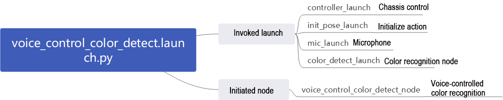

The launch file is located in:
[/home/ubuntu/ros2_ws/src/xf_mic_asr_offline/launch/voice_control_color_detect.py.launch](../_static/source_code/xf_mic_asr_offline.zip)

① Launch Files

{lineno-start=21}

```python
  controller_launch = IncludeLaunchDescription(
      PythonLaunchDescriptionSource(
          os.path.join(controller_package_path, 'launch/controller.launch.py')),
  )

  color_detect_launch = IncludeLaunchDescription(
      PythonLaunchDescriptionSource(
          os.path.join(example_package_path, 'example/color_detect/color_detect_node.launch.py')),
      launch_arguments={
          'enable_display': 'true',
      }.items(),       
  )

  mic_launch = IncludeLaunchDescription(
      PythonLaunchDescriptionSource(
          os.path.join(xf_mic_asr_offline_package_path, 'launch/mic_init.launch.py')),
  )

  voice_control_color_detect_node = Node(
      package='xf_mic_asr_offline',
      executable='voice_control_color_detect.py',
      output='screen',
  )
```

`controller_launch` starts the chassis control node, enabling control of the servo motor.

`color_detect_launch` initiates the color recognition node.

`mic_launch` activates the microphone functionality.

`init_pose_launch` initializes the movements.

② Initiate Node

{lineno-start=39}

```python
  voice_control_color_detect_node = Node(
      package='xf_mic_asr_offline',
      executable='voice_control_color_detect.py',
      output='screen',
  )
```

`voice_control_color_detect_node`: Used to invoke the voice-controlled color tracking source code and start the program.

(2) Python Program


The source code is located at:
[/home/ubuntu/ros2_ws/src/xf_mic_asr_offline/scripts/voice_control_color_detect.py](../_static/source_code/xf_mic_asr_offline.zip)

① Function: `Main`

{lineno-start=142}

```python
def main():
  node = VoiceControlColorDetectNode('voice_control_color_detect')
  executor = MultiThreadedExecutor()
  executor.add_node(node)
  executor.spin()
  node.destroy_node()
```

Start voice-controlled color recognition.

② Classes: `VoiceControlColorDetectNode`

{lineno-start=22}

```python
class VoiceControlColorDetectNode(Node):
```

③ Init：

{lineno-start=23}

```python
  def __init__(self, name):
      rclpy.init()
      super().__init__(name, allow_undeclared_parameters=True, automatically_declare_parameters_from_overrides=True)
      
      self.count = 0
      self.color = None
      self.running = True
      self.last_color = None
      signal.signal(signal.SIGINT, self.shutdown)

      self.language = os.environ['ASR_LANGUAGE']
      
      self.buzzer_pub = self.create_publisher(BuzzerState, '/ros_robot_controller/set_buzzer', 1)
      timer_cb_group = ReentrantCallbackGroup()
      self.create_subscription(String, '/asr_node/voice_words', self.words_callback, 1, callback_group=timer_cb_group)
      self.create_subscription(ColorsInfo, '/color_detect/color_info', self.get_color_callback, 1)
      self.client = self.create_client(Trigger, '/asr_node/init_finish')
      self.client.wait_for_service()
      self.client = self.create_client(Trigger, '/color_detect/init_finish')
      self.client.wait_for_service() 
      self.set_color_client = self.create_client(SetColorDetectParam, '/color_detect/set_param', callback_group=timer_cb_group)
      self.set_color_client.wait_for_service()
      self.play('running')
      self.get_logger().info('唤醒口令: 小幻小幻(Wake up word: hello hiwonder)')
      self.get_logger().info('唤醒后15秒内可以不用再唤醒(No need to wake up within 15 seconds after waking up)')
      self.get_logger().info('控制指令: 开启颜色识别 关闭颜色识别(Voice command: start color recognition/stop color recognition)')

      threading.Thread(target=self.main, daemon=True).start()
      self.create_service(Trigger, '~/init_finish', self.get_node_state)
      self.get_logger().info('\033[1;32m%s\033[0m' % 'start')
```

Initialize all parameters, invoke the chassis node, buzzer node, Lidar node, voice recognition node, and color recognition node, and finally start the main function.

④ `get_node_state`:

{lineno-start=54}

```python
  def get_node_state(self, request, response):
      response.success = True
      return response
```

Set the current node state.

⑤ `Play`:

{lineno-start=58}

```python
  def play(self, name):
      voice_play.play(name, language=self.language)
```

Play audio.

⑥ `Shutdown`

{lineno-start=61}

```python
  def shutdown(self, signum, frame):
      self.running = False
```

The callback function that executes after closing the program sets the parameter `running` to `False`, which stops the program.

⑦ `get_color_callback`:

{lineno-start=64}

```python
  def get_color_callback(self, msg):
      data = msg.data
      if data != []:
          if data[0].radius > 30:
              self.color = data[0].color
          else:
              self.color = None
      else:
          self.color = None
```

This function retrieves the current color recognition results based on the information published by the color recognition node.

⑧ `send_request`:

{lineno-start=74}

```python
  def send_request(self, client, msg):
      future = client.call_async(msg)
      while rclpy.ok():
          if future.done() and future.result():
              return future.result()
```

This function is responsible for publishing service requests.

⑨ `words_callback`:

{lineno-start=80}

```python
  def words_callback(self, msg):
      words = json.dumps(msg.data, ensure_ascii=False)[1:-1]
      if self.language == 'Chinese':
          words = words.replace(' ', '')
      self.get_logger().info('words: %s'%words)
      if words is not None and words not in ['唤醒成功(wake-up-success)', '休眠(Sleep)', '失败5次(Fail-5-times)',
                                             '失败10次(Fail-10-times']:
          if words == '开启颜色识别' or words == 'start color recognition':
              msg_red = ColorDetect()
              msg_red.color_name = 'red'
              msg_red.detect_type = 'circle'
              msg_green = ColorDetect()
              msg_green.color_name = 'green'
              msg_green.detect_type = 'circle'
              msg_blue = ColorDetect()
              msg_blue.color_name = 'blue'
              msg_blue.detect_type = 'circle'
              msg = SetColorDetectParam.Request()
              msg.data = [msg_red, msg_green, msg_blue]
              res = self.send_request(self.set_color_client, msg)
              if res.success:
                  self.play('open_success')
              else:
                  self.play('open_fail')
          elif words == '关闭颜色识别' or words == 'stop color recognition':
              msg = SetColorDetectParam.Request()
              res = self.send_request(self.set_color_client, msg)
              if res.success:
                  self.play('close_success')
              else:
                  self.play('close_fail')
      elif words == '唤醒成功(wake-up-success)':
          self.play('awake')
      elif words == '休眠(Sleep)':
          msg = BuzzerState()
          msg.freq = 1900
          msg.on_time = 0.05
          msg.off_time = 0.01
          msg.repeat = 1
          self.buzzer_pub.publish(msg)
```

This is the voice recognition callback function. It controls whether recognition is enabled based on the detected speech. If recognition is enabled, it provides feedback according to the information received from the color recognition node.

⑩ Main：

{lineno-start=121}

```python
  def main(self):
      while self.running:
          if self.color == 'red' and self.last_color != 'red':
              self.last_color = 'red'
              self.play('red')
              self.get_logger().info('\033[1;32m%s\033[0m' % 'red')
          elif self.color == 'green' and self.last_color != 'green':
              self.last_color = 'green'
              self.play('green')
              self.get_logger().info('\033[1;32m%s\033[0m' % 'green')
          elif self.color == 'blue' and self.last_color != 'blue':
              self.last_color = 'blue'
              self.play('blue')
              self.get_logger().info('\033[1;32m%s\033[0m' % 'blue')
          else:
              self.count += 1
              time.sleep(0.01)
              if self.count > 50:
                  self.count = 0
                  self.last_color = self.color
```

This function announces a voice message corresponding to the recognized color.

### 9.3.5 Voice-Controlled Color Tracking

* **Program Logic**

This experiment combines the robot's voice recognition capabilities with a visual robotic arm to identify three colors: red, green, and blue.

In the program design, it subscribes to the voice recognition service from the microphone array node. This process includes steps such as localizing the voice, reducing background noise, and recognizing the spoken input. As a result, we can obtain the recognized phrases and the direction of the sound source. After successfully waking up the robot with a specific command, it will respond with appropriate voice feedback. When the robot identifies a specific color, its camera will track the colored object.

* **Preparation**

(1) Please ensure the microphone array, sound card and speaker are connected to the corresponding port of USB hub.

(2) Ensure that you have remotely modified the configuration file to replace the `APPID` and the `Common.jet` file obtained from the installation of iFlytek according to the file [9.1 Voice Control Basic Lesson (Ring Microphone Array)](#anchor_9_1).

* **Operation Steps**


:::{Note}

* When identifying color blocks, ensure that objects with colors similar or identical to the color blocks in the background are avoided to prevent interference.

* If the recognition result is inaccurate, you need to adjust the color threshold according to the instructions provided in [6 ROS+OpenCV Course](resources_download.md).

:::

(1) Start the robot, and access the robot system desktop using remote control software NoMachine. For details you may refer to: [1.6 Development Environment Setup and Configuration](1.Quick_Start_Guide.md#development-environment-setup-and-configuration)

(2) The default system wake word is **"hello hiwonder"** in English. To switch to Chinese or flashing command words, please refer to the document under the directory of [9.4 Switching Wake Words Between Chinese and English](#anchor_9_4) for instructions.

(3) Click-on  to open the command-line terminal.

(4) Run the command, and hit Enter to disable the app auto-start service.

```bash
sudo systemctl stop start_app_node.service
```

(5) Enter the command and press Enter to activate the voice-controlled color tracking function.

```bash
ros2 launch xf_mic_asr_offline voice_control_color_track.launch.py
```

(6) Once the program is running, you can start issuing commands. The program can recognize three colors: red, green, and blue. For instance, place a red object within the camera's field of view. First, say the wake word **'Hello Hiwonder,'** then follow it with the tracking command **'Track Red'** (to track blue, say **'Track Blue'**; for green, say **'Track Green'**). After the robot recognizes red (the color linked to your command), it will rotate the pan-tilt servo. In the Pro version, the robotic arm's camera will also follow the target color in real-time. As you move the colored block, the pan-tilt will adjust to keep the object in view.

:::{Note}
* For optimal performance, ensure you are in a relatively quiet environment.
* Before issuing each voice command, start by saying the wake-up word.
* Speak loudly and clearly when giving voice commands.
* Give voice commands one at a time and wait for the robot to provide feedback before issuing additional commands.

:::

(7) If you need to terminate this program, you need to create a command-line terminal, and enter the following command:

```bash
~/.stop_ros.sh
```

(8) Terminate all the opened terminals.

* **Program Analysis**

Voice-controlled color tracking enables the voice control node to establish communication with the camera node. Subsequently, it commands the robot to identify and track color blocks based on voice-issued commands.

(1) Launch File


The launch file is located in:
[/home/ubuntu/ros2_ws/src/xf_mic_asr_offline/launch/voice_control_color_track.py.launch](../_static/source_code/xf_mic_asr_offline.zip)

① Launch Files

{lineno-start=19}

```python
  color_track_launch = IncludeLaunchDescription(
      PythonLaunchDescriptionSource(
          os.path.join(example_package_path, 'example/color_track/color_track_node.launch.py')),
      launch_arguments={'start': 'false'}.items()
  )

  mic_launch = IncludeLaunchDescription(
      PythonLaunchDescriptionSource(
          os.path.join(xf_mic_asr_offline_package_path, 'launch/mic_init.launch.py')),
  )
```

`color_track_launch`: Start the color tracking node

`mic_launch`: Start the microphone functionality

② Initiate Node

{lineno-start=30}

```python
  voice_control_color_track_node = Node(
      package='xf_mic_asr_offline',
      executable='voice_control_color_track.py',
      output='screen',
  )
```

`voice_control_color_track_node`: Used to invoke the voice-controlled color tracking source code and start the program.

(2) Python Program


The source code is located at:
[/home/ubuntu/ros2_ws/src/xf_mic_asr_offline/scripts/voice_control_color_track.py](../_static/source_code/xf_mic_asr_offline.zip)

① Function: `Main`

{lineno-start=115}

```python
def main():
  node = VoiceControlColorTrackNode('voice_control_color_track')
  executor = MultiThreadedExecutor()
  executor.add_node(node)
  executor.spin()
  node.destroy_node()
```

Start voice-controlled color tracking.

② Classes: `VoiceControlColorTrackNode`

{lineno-start=18}

```python
class VoiceControlColorTrackNode(Node):
```

③ Init：

{lineno-start=19}

```python
  def __init__(self, name):
      rclpy.init()
      super().__init__(name, allow_undeclared_parameters=True, automatically_declare_parameters_from_overrides=True)

      self.language = os.environ['ASR_LANGUAGE']
      timer_cb_group = ReentrantCallbackGroup()
      self.buzzer_pub = self.create_publisher(BuzzerState, '/ros_robot_controller/set_buzzer', 1)
      self.create_subscription(String, '/asr_node/voice_words', self.words_callback, 1, callback_group=timer_cb_group)
      self.client = self.create_client(Trigger, '/asr_node/init_finish')
      self.client.wait_for_service()
      self.client = self.create_client(Trigger, '/color_track/init_finish')
      self.client.wait_for_service()
      self.start_client = self.create_client(Trigger, '/color_track/start')
      self.start_client.wait_for_service()
      self.set_color_client = self.create_client(SetString, '/color_track/set_color', callback_group=timer_cb_group)
      self.set_color_client.wait_for_service()

      self.timer = self.create_timer(0.0, self.init_process, callback_group=timer_cb_group)
```

Initialize various parameters, invoke the buzzer node, speech recognition node, and color tracking node, and finally initialize actions.

④ `init_process`:

{lineno-start=38}

```python
  def init_process(self):
      self.timer.cancel()

      res = self.send_request(self.start_client, Trigger.Request())
      if res.success:
          self.get_logger().info('open color_track')
      else:
          self.get_logger().info('open color_track fail')
      self.play('running')
      self.get_logger().info('唤醒口令: 小幻小幻(Wake up word: hello hiwonder)')
      self.get_logger().info('唤醒后15秒内可以不用再唤醒(No need to wake up within 15 seconds after waking up)')
      self.get_logger().info('控制指令: 追踪红色 追踪绿色 追踪蓝色 停止追踪(Voice command: track red/green/blue object)')

      self.create_service(Trigger, '~/init_finish', self.get_node_state)
      self.get_logger().info('\033[1;32m%s\033[0m' % 'start')
```

Start the color tracking mode, provide command prompts, and initialize marker nodes.

⑤ `get_node_state`:

{lineno-start=54}

```python
  def get_node_state(self, request, response):
      response.success = True
      return response
```

Set the current node state.

⑥ `Play`:

{lineno-start=58}

```python
  def play(self, name):
      voice_play.play(name, language=self.language)
```

Play audio.

⑦ `send_request`:

{lineno-start=61}

```python
  def send_request(self, client, msg):
      future = client.call_async(msg)
      while rclpy.ok():
          if future.done() and future.result():
              return future.result()
```

Publish service requests.

⑧ `words_callback`:

{lineno-start=67}

```python
  def words_callback(self, msg):
      words = json.dumps(msg.data, ensure_ascii=False)[1:-1]
      if self.language == 'Chinese':
          words = words.replace(' ', '')
      self.get_logger().info('words: %s'%words)
      if words is not None and words not in ['唤醒成功(wake-up-success)', '休眠(Sleep)', '失败5次(Fail-5-times)',
                                             '失败10次(Fail-10-times']:
          if words == '追踪红色' or words == 'track red object':
              msg = SetString.Request()
              msg.data = 'red'
              res = self.send_request(self.set_color_client, msg)
              if res.success:
                  self.play('start_track_red')
              else:
                  self.play('track_fail')
          elif words == '追踪绿色' or words == 'track green object':
              msg = SetString.Request()
              msg.data = 'green'
              res = self.send_request(self.set_color_client, msg)
              if res.success:
                  self.play('start_track_green')
              else:
                  self.play('track_fail')
          elif words == '追踪蓝色' or words == 'track blue object':
              msg = SetString.Request()
              msg.data = 'blue'
              res = self.send_request(self.set_color_client, msg)
              if res.success:
                  self.play('start_track_blue')
              else:
                  self.play('track_fail')
          elif words == '停止追踪' or words == 'stop tracking':
              msg = SetString.Request()
              res = self.send_request(self.set_color_client, msg)
              if res.success:
                  self.play('stop_track')
              else:
                  self.play('stop_fail')
      elif words == '唤醒成功(wake-up-success)':
          self.play('awake')
      elif words == '休眠(Sleep)':
          msg = BuzzerState()
          msg.freq = 1900
          msg.on_time = 0.05
          msg.off_time = 0.01
          msg.repeat = 1
          self.buzzer_pub.publish(msg)
```

Speech recognition callback function. Based on recognized speech, control whether to start color tracking. Announce the corresponding voice based on the recognized result, pass the color to be tracked to the color tracking node, and the tracking is implemented within the color tracking node.

### 9.3.6 Voice-Controlled Color Sorting

* **Program Logic**

This experiment combines the robot's voice recognition capabilities with a visual robotic arm to identify three colors—red, green, and blue—and perform actions such as grasping and sorting these colored blocks.

In the program design, it subscribes to the voice recognition service from the microphone array node. This includes processes like localizing the voice, reducing background noise, and recognizing spoken input to capture the recognized phrases and the direction of the sound source. After successfully waking up the robot with a specific command, it will provide appropriate voice feedback. Once a specific color is recognized, the robotic arm will lower to the designated position to grasp the colored block and then place it in the specified location.

* **Preparation**

(1) Please ensure the microphone array, sound card and speaker are connected to the corresponding port of USB hub.

(2) Ensure that you have remotely modified the configuration file to replace the `APPID` and the `Common.jet` file obtained from the installation of iFlytek according to the file [9.1 Voice Control Basic Lesson (Ring Microphone Array)](#anchor_9_1).

* **Operation Steps**


 :::{Note}

* When identifying color blocks, ensure that objects with colors similar or identical to the color blocks in the background are avoided to prevent interference.
* If the recognition result is inaccurate, you need to adjust the color threshold according to the instructions provided in [6. ROS+OpenCV Course](6.ROS+Machine_Learning_Course.md).

 :::

(1) Start the robot, and access the robot system desktop using remote control software NoMachine. For details you may refer to: [1.6 Development Environment Setup and Configuration](1.Quick_Start_Guide.md#1development-environment-setup-and-configuration)

(2) The default system wake word is **"hello hiwonder"** in English. To switch to Chinese or flashing command words, please refer to the document under the directory of [9.4 Switching Wake Words Between Chinese and English](#anchor_9_4) for instructions.

(3) Click-on  to start the command-line terminal.

(4) Run the command, and hit Enter to disable the app auto-start service.

```bash
sudo systemctl stop start_app_node.service
```

(5) Run the command to initiate the game.

```bash
ros2 launch xf_mic_asr_offline voice_control_color_sorting.launch.py debug:=true
```

(6) After starting the program, the visual robotic arm on the robot will position itself correctly. Place the colored block to be recognized in the center of the gripper, as shown in the image below.


(7) The robotic arm will then lift upward to prepare for color recognition. During this time, there is no need to move the colored block.

(8) Once the program identifies the specific position of the colored block, the camera feed will highlight it with a yellow box. The recognition and grasping actions will be based on this highlighted position.

(9) To initiate the sorting action, say the wake word **'Hello Hiwonder,'** followed by the command **'Start Color Sorting.'** The robotic arm will then grasp the colored block.

(10) The robot will place the colored block in the corresponding color area, as shown in the image below.


| **Name**          | **Category**                |
| :--------------: | :-------------------------: |
| food_waste       | BananaPeel<br>BrokenBones<br>Ketchup |
| hazardous_waste  | Marker<br>OralLiquidBottle<br>StorageBattery |
| recyclable_waste | PlasticBottle<br>Toothbrush<br>Umbrella |
| residual_waste   | Plate<br>CigaretteEnd<br>DisposableChopsticks |

(11) After placing the block, the robotic arm will return to the waiting position as in step 6. To sort another block, simply place it within the yellow box on the camera feed for recognition.

(12) To stop the color sorting, say the wake word **'Hello Hiwonder'** followed by the command **'Stop Color Sorting.'**

(13) To disable this feature, open a new command line terminal and enter the following command:

```bash
~/.stop_ros.sh
```

(14) Then, close all previously opened terminals.

* **Program Analysis**

Voice-controlled color tracking involves establishing a connection between the voice control node and the camera node. Subsequently, it enables control over the robot's execution of game by issuing commands through voice.


(1) launch File


The launch file is saved in:
[/home/ubuntu/ros2_ws/src/xf_mic_asr_offline/launch/voice_control_color_track.launch.py](../_static/source_code/xf_mic_asr_offline.zip)

① Launch File

{lineno-start=19}

```python
  color_sorting_launch = IncludeLaunchDescription(
      PythonLaunchDescriptionSource(
          os.path.join(example_package_path, 'example/color_sorting/color_sorting_node.launch.py')),
      launch_arguments={'start': 'false',
                        'broadcast': 'true'}.items()
  )

  mic_launch = IncludeLaunchDescription(
      PythonLaunchDescriptionSource(
          os.path.join(xf_mic_asr_offline_package_path, 'launch/mic_init.launch.py')),
  )
```

`color_sorting_launch`: Start the color sorting node

`mic_launch`: Start the microphone functionality

② Initiate Node

{lineno-start=31}

```python
  voice_control_color_sorting_node = Node(
      package='xf_mic_asr_offline',
      executable='voice_control_color_sorting.py',
      output='screen',
  )
```

`voice_control_color_sorting_node`: Used to invoke the voice-controlled color sorting source code and start the program.

(2) Python Program


The source code of this program is saved in
[/home/ubuntu/ros2_ws/src/xf_mic_asr_offline/scripts/voice_control_color_detect.py](../_static/source_code/xf_mic_asr_offline.zip)

① Functions: `Main`

{lineno-start=86}

```python
def main():
  node = VoiceControlColorSortingNode('voice_control_colorsorting')
  executor = MultiThreadedExecutor()
  executor.add_node(node)
  executor.spin()
  node.destroy_node()
```

Start voice-controlled color sorting.

② Classes: `VoiceControlColorSortingNode`

{lineno-start=17}

```python
class VoiceControlColorSortingNode(Node):
```

③ Init:

{lineno-start=18}

```python
  def __init__(self, name):
      rclpy.init()
      super().__init__(name, allow_undeclared_parameters=True, automatically_declare_parameters_from_overrides=True)
      
      self.running = True
      self.language = os.environ['ASR_LANGUAGE']
      timer_cb_group = ReentrantCallbackGroup()
      self.create_subscription(String, '/asr_node/voice_words', self.words_callback, 1, callback_group=timer_cb_group)
      self.buzzer_pub = self.create_publisher(BuzzerState, '/ros_robot_controller/set_buzzer', 1)
      self.client = self.create_client(Trigger, '/asr_node/init_finish')
      self.client.wait_for_service()
      self.client = self.create_client(Trigger, '/color_sorting/init_finish')
      self.client.wait_for_service()        
      self.start_client = self.create_client(Trigger, '/color_sorting/start', callback_group=timer_cb_group)
      self.start_client.wait_for_service()
      self.stop_client = self.create_client(Trigger, '/color_sorting/stop', callback_group=timer_cb_group)
      self.stop_client.wait_for_service()
      self.play('running')

      self.get_logger().info('唤醒口令: 小幻小幻(Wake up word: hello hiwonder)')
      self.get_logger().info('唤醒后15秒内可以不用再唤醒(No need to wake up within 15 seconds after waking up)')
      self.get_logger().info('控制指令: 开启颜色分拣 关闭颜色分拣(Voice command: start color sorting/stop color sorting)')

      self.create_service(Trigger, '~/init_finish', self.get_node_state)
      self.get_logger().info('\033[1;32m%s\033[0m' % 'start')
```

Initialize various parameters, invoke the speech recognition node, and color sorting node.

④ `get_node_state`:

{lineno-start=44}

```python
  def get_node_state(self, request, response):
      response.success = True
      return response
```

Set the current node state.

⑤ `Play`:

{lineno-start=48}

```python
  def play(self, name):
      voice_play.play(name, language=self.language)
```

Play audio.

⑥ `send_request`:

{lineno-start=51}

```python
  def send_request(self, client, msg):
      future = client.call_async(msg)
      while rclpy.ok():
          if future.done() and future.result():
              return future.result()
```

Used to publish service requests.

⑦ `words_callback`:

{lineno-start=57}

```python
  def words_callback(self, msg):
      words = json.dumps(msg.data, ensure_ascii=False)[1:-1]
      if self.language == 'Chinese':
          words = words.replace(' ', '')
      self.get_logger().info('words: %s'%words)
      if words is not None and words not in ['唤醒成功(wake-up-success)', '休眠(Sleep)', '失败5次(Fail-5-times)',
                                             '失败10次(Fail-10-times']:
          if words == '开启颜色分拣' or words == 'start color sorting':
              res = self.send_request(self.start_client, Trigger.Request())
              if res.success:
                  self.play('open_success')
              else:
                  self.play('open_fail')
          elif words == '关闭颜色分拣' or words == 'stop color sorting':
              res = self.send_request(self.stop_client, Trigger.Request())
              if res.success:
                  self.play('close_success')
              else:
                  self.play('close_fail')
      elif words == '唤醒成功(wake-up-success)':
          self.play('awake')
      elif words == '休眠(Sleep)':
          msg = BuzzerState()
          msg.freq = 1900
          msg.on_time = 0.05
          msg.off_time = 0.01
          msg.repeat = 1
          self.buzzer_pub.publish(msg)
```

Speech recognition callback function. Based on recognized speech, control whether to start sorting. Announce the corresponding voice based on the recognized result, with sorting operations implemented within the color sorting node.

### 9.3.7 Voice-Controlled Waste Sorting

This lesson introduces how to control the robot using voice commands to recognize and sort trash cards.

* **Preparation**

(1) Please ensure the microphone array, sound card and speaker are connected to the corresponding port of USB hub.

(2) Ensure that you have remotely modified the configuration file to replace the `APPID` and the `Common.jet` file obtained from the installation of iFlytek according to the file [9.1 Voice Control Basic Lesson (Ring Microphone Array)](#anchor_9_1).

* **Program Logic**

First, the microphone array node's voice recognition service is subscribed to. The system performs voice localization, noise reduction, and speech recognition to obtain both the recognized sentence and the direction of the sound source.

Next, after the robot is successfully awakened, users can issue specific voice commands, and the robot will respond with appropriate voice feedback.

Finally, the system performs command matching based on the recognized sentence. According to the result, the robot will execute the corresponding sorting action.

* **Operation Steps**

:::{Note}
The input command should be case sensitive, and keywords can be complemented using Tab key.
:::

(1) Start the robot, and access the robot system desktop using remote control software NoMachine. For details you may refer to: [1.6 Development Environment Setup and Configuration](1.Quick_Start_Guide.md#development-environment-setup-and-configuration)

(2) The default system wake word is **"hello hiwonder"** in English. To switch to Chinese or flashing command words, please refer to the document under the directory of [9.4 Switching Wake Words Between Chinese and English](#anchor_9_4) for instructions.

(3) Click-on  to start the command-line terminal.

(4) Run the command, and hit Enter to disable the app auto-start service.

```bash
sudo systemctl stop start_app_node.service
```

(5) Type the command below and hit Enter key to initiate the bridge service for the garbage classification game

```bash
ros2 launch xf_mic_asr_offline voice_control_garbage_classification.launch.py debug:=true
```

(6) After starting the program, the visual robotic arm on the robot will assume a calibrated position. Place the waste block to be recognized in the center of the gripper, as shown in the image below.


(7) The robotic arm will lift to enter standby mode for recognition. After saying the wake word and issuing the command, the waste sorting process will begin. On the remote interface, the software will display a red box highlighting the current calibration and recognition area.

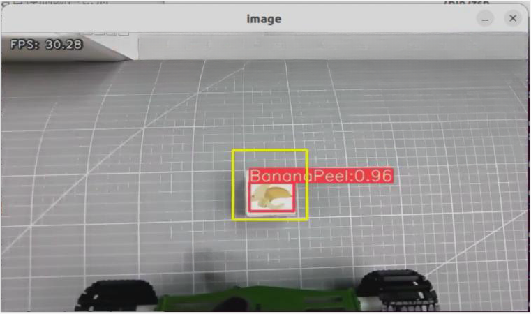

The program uses colored boxes to identify various objects and cards. Next to each name is a number less than 1 that indicates the recognition accuracy. For example, the number `0.96` next to **"BananaPeel"** represents the accuracy of the current recognition, with a range from 0 to 1. A higher number indicates a more accurate identification of the **"BananaPeel"** category. Recognition accuracy generally improves in well-lit conditions.

(8) The robot will place the waste block in the corresponding color area, as shown in the image below.


| **Name**          | **Category**                |
| :--------------: | :-------------------------: |
| food_waste       | BananaPeel<br>BrokenBones<br>Ketchup |
| hazardous_waste  | Marker<br>OralLiquidBottle<br>StorageBattery |
| recyclable_waste | PlasticBottle<br>Toothbrush<br>Umbrella |
| residual_waste   | Plate<br>CigaretteEnd<br>DisposableChopsticks |

(9) Once calibration is complete, the red box in the image will change to yellow, marking the recognition area. The waste card or wood block will only be identified and grasped if it is within this yellow area.


(10) To disable this feature entirely, open a new command line terminal and enter the following command:

```bash
~/.stop_ros.sh
```

(11) Then, close all previously opened terminals.

* **Program Analysis**

(1) launch File

Voice-controlled garbage sorting establishes communication between the voice control node and the camera node. Commands are issued through sound to control whether the robot starts or stops this gameplay. After grasping the corresponding garbage card, the robot announces its classification.

The launch file for this setup is located at:
[/home/ubuntu/ros2_ws/src/xf_mic_asr_offline/launch/voice_control_garbage_classification.launch.py](../_static/source_code/xf_mic_asr_offline.zip)


① Launch File

{lineno-start=19}

```python
    garbage_classification_launch = IncludeLaunchDescription(
        PythonLaunchDescriptionSource(
            os.path.join(example_package_path, 'example/garbage_classification/garbage_classification.launch.py')),
        launch_arguments={'start': 'false',
                          'broadcast': 'true'}.items()
    )

    mic_launch = IncludeLaunchDescription(
        PythonLaunchDescriptionSource(
            os.path.join(xf_mic_asr_offline_package_path, 'launch/mic_init.launch.py')),
    )
```

`garbage_classification_launch`: Start the garbage classification node

`mic_launch`: Start the microphone functionality

② Initiate Node

{lineno-start=31}

```python
    voice_control_garbage_classification_node = Node(
        package='xf_mic_asr_offline',
        executable='voice_control_garbage_classification.py',
        output='screen',
    )
```

`voice_control_garbage_classification_node`: Used to invoke the voice-controlled garbage classification source code and start the program.

(2) Python Program

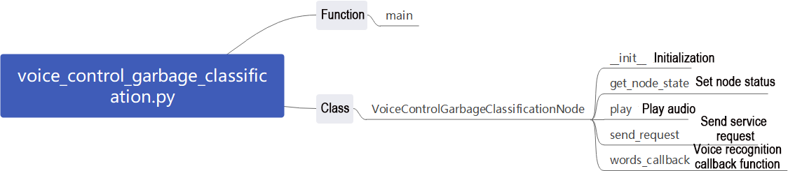

The source code is located at:
[/home/ubuntu/ros2_ws/src/xf_mic_asr_offline/scripts/voice_control_garbage_classification.py](../_static/source_code/xf_mic_asr_offline.zip)

① Function: `Main`

{lineno-start=80}

```python
def main():
    node = VoiceControlGarbageClassificationNode('voice_control_garbage_classification')
    executor = MultiThreadedExecutor()
    executor.add_node(node)
    executor.spin()
    node.destroy_node()
```

Start voice-controlled garbage classification.

② Class: `VoiceControlGarbageClassificationNode`

{lineno-start=17}

```python
class VoiceControlGarbageClassificationNode(Node):
```

③ Init:

{lineno-start=18}

```python
    def __init__(self, name):
        rclpy.init()
        super().__init__(name, allow_undeclared_parameters=True, automatically_declare_parameters_from_overrides=True)
        self.running = True
        self.language = os.environ['ASR_LANGUAGE']
        timer_cb_group = ReentrantCallbackGroup()
        self.buzzer_pub = self.create_publisher(BuzzerState, '/ros_robot_controller/set_buzzer', 1)
        self.create_subscription(String, '/asr_node/voice_words', self.words_callback, 1, callback_group=timer_cb_group)
        self.client = self.create_client(Trigger, '/asr_node/init_finish')
        self.client.wait_for_service()
        self.start_client = self.create_client(Trigger, '/garbage_classification/start', callback_group=timer_cb_group)
        self.start_client.wait_for_service()
        self.play('running')

        self.get_logger().info('唤醒口令: 小幻小幻(Wake up word: hello hiwonder)')
        self.get_logger().info('唤醒后15秒内可以不用再唤醒(No need to wake up within 15 seconds after waking up)')
        self.get_logger().info('控制指令: 开启垃圾分类 关闭垃圾分类(Voice command: sort waste/stop sort waste)')
        self.create_service(Trigger, '~/init_finish', self.get_node_state)
        self.get_logger().info('\033[1;32m%s\033[0m' % 'start')
```

Initialize various parameters, invoke the buzzer node, speech recognition node, and garbage classification node.

④ `get_node_state`:

{lineno-start=38}

```python
    def get_node_state(self, request, response):
        response.success = True
        return response
```

Set the current node state.

⑤ `Play`:

{lineno-start=42}

```python
    def play(self, name):
        voice_play.play(name, language=self.language)
```

Play audio.

⑥ `send_request`:

{lineno-start=45}

```python
    def send_request(self, client, msg):
        future = client.call_async(msg)
        while rclpy.ok():
            if future.done() and future.result():
                return future.result()
```

Used to publish service requests.

⑦ `words_callback`:

{lineno-start=51}

```python
    def words_callback(self, msg):
        words = json.dumps(msg.data, ensure_ascii=False)[1:-1]
        if self.language == 'Chinese':
            words = words.replace(' ', '')
        self.get_logger().info('words: %s'%words)
        if words is not None and words not in ['唤醒成功(wake-up-success)', '休眠(Sleep)', '失败5次(Fail-5-times)',
                                               '失败10次(Fail-10-times']:
            if words == '开启垃圾分类' or words == 'sort waste':
                res = self.send_request(self.start_client, Trigger.Request())
                if res.success:
                    self.play('open_success')
                else:
                    self.play('open_fail')
            elif words == '关闭垃圾分类' or words == 'stop sort waste':
                res = self.send_request(self.start_client, Trigger.Request())
                if res.success:
                    self.play('close_success')
                else:
                    self.play('close_fail')
        elif words == '唤醒成功(wake-up-success)':
            self.play('awake')
        elif words == '休眠(Sleep)':
            msg = BuzzerState()
            msg.freq = 1900
            msg.on_time = 0.05
            msg.off_time = 0.01
            msg.repeat = 1
            self.buzzer_pub.publish(msg)
```

Speech recognition callback function. Based on recognized speech, control whether to start garbage classification. Announce the corresponding voice based on the recognized result, with classification operations implemented within the garbage classification node.

### 9.3.8 Voice-Controlled Multi-Point Navigation

This lesson involves utilizing voice-controlled robots to navigate on an existing map.

* **Preparation**

(1) Please ensure the microphone array, sound card and speaker are connected to the corresponding port of USB hub.

(2) Ensure that you have remotely modified the configuration file to replace the `APPID` and the `Common.jet` file obtained from the installation of iFlytek according to the file [9.1 Voice Control Basic Lesson (Ring Microphone Array)](#anchor_9_1).

(3) Construct a map of the area where the robot is currently located. If you need guidance on how to build a map, refer to the documents under the [4. Mapping & Navigation Course](4.Mapping_Navigation_Course.md) section.

(4) Place the robot on an open platform and ensure that there is sufficient movement range within 3 meters around the robot.

* **Program Logic**

First, start the robot navigation service and load the map, then launch the multi-point navigation service.

Next, subscribe to the voice recognition service published by the microphone array node to perform sound source localization, noise reduction, and speech recognition, obtaining both the recognized sentence and the sound source angle.

Then, voice input is processed through the microphone. Once the wake word and control command are recognized and meet the preset confidence threshold, the robot will respond with a corresponding voice reply.

Finally, based on the recognized command, the robot will navigate to the corresponding location on the map. During navigation, a global path will be planned first, and if obstacles are encountered, local path planning will be performed accordingly.

* **Operation Steps**

:::{Note}
The input command should be case sensitive, and keywords can be complemented using Tab key.
:::

(1) Start the robot, and access the robot system desktop using remote control software NoMachine. For details you may refer to: [1.6 Development Environment Setup and Configuration](1.Quick_Start_Guide.md#development-environment-setup-and-configuration)

(2) The default system wake word is **"hello hiwonder"** in English. To switch to Chinese or flashing command words, please refer to the document under the directory of [9.4 Switching Wake Words Between Chinese and English](#anchor_9_4) for instructions.

(3) Click-on  to start the command-line terminal.

(4) Run the command, and hit Enter to disable the app auto-start service.

```bash
sudo systemctl stop start_app_node.service
```

(5) Type the command to initiate the game.

```bash
ros2 launch xf_mic_asr_offline voice_control_navigation.launch.py map:=map_01
```

The **"map_01"** at the end of the command is the name of the map, which users can modify according to their needs. The map is stored at the path: `/home/ubuntu/ros2_ws/src/slam/maps`.

(6) To disable this feature, open a new command line terminal and enter the following command:

```bash
~/.stop_ros.sh
```

(7) Then, close all previously opened terminals.

* **Project Outcome**

After initiating the game, begin by saying the wake-up word **"Hello Hiwonder,"** followed by the command statement to control the robot's movement.

For instance, start by saying **"Hello Hiwonder"** and the robot will respond with **"I`m here."** Then, proceed to announce **"Go to A point,"** and the robot will navigate to the upper right of the starting position.

Below are the command statements and their corresponding functions with the robot as the first perspective:

| **Voice command** | **Function**                                          |
| :---------------: | :---------------------------------------------------: |
| Go to A point   | Control the robot to move to point A: Upper right of the starting position |
| Go to B point   | Control the robot to move to point B: Upper left of the starting position |
| Go to C point   | Control the robot to move to point C: Below point A   |
| Go back to the start | Control the robot to move to the origin point: Starting position |

* **Program Analysis**

(1) launch File


The launch file is saved in:
[/home/ubuntu/ros2_ws/src/xf_mic_asr_offline/launch/voice_control_navigation.launch.py](../_static/source_code/xf_mic_asr_offline.zip)

① Launch File

{lineno-start=34}

```python
    navigation_launch = IncludeLaunchDescription(
        PythonLaunchDescriptionSource(
            os.path.join(navigation_package_path, 'launch/navigation.launch.py')),
        launch_arguments={
            'map': map_name,
            'master_name': master_name,
            'robot_name': robot_name
        }.items(),
    )

    mic_launch = IncludeLaunchDescription(
        PythonLaunchDescriptionSource(
            os.path.join(xf_mic_asr_offline_package_path, 'launch/mic_init.launch.py')),
    )
```

`navigation_launch`: Start navigation

`mic_launch`: Start microphone functionality

② Initiate Node

{lineno-start=49}

```python
    voice_control_navigation_node = Node(
        package='xf_mic_asr_offline',
        executable='voice_control_navigation.py',
        output='screen',
        parameters=[{
            'map_frame': map_frame,
            'costmap': cosmap,
            'cmd_vel': cmd_vel,
            'goal': goal,
        }]
    )
```

`voice_control_navigation_node`: Used to invoke the voice-controlled multi-point navigation source code and start the program.

(2) Python Program


The source code of the program is saved in:
[/home/ubuntu/ros2_ws/src/xf_mic_asr_offline/scripts/voice_control_navigation.py](../_static/source_code/xf_mic_asr_offline.zip)

① Function: `Main`

{lineno-start=128}

```python
def main():
    node = VoiceControlNavNode('voice_control_nav')
    rclpy.spin(node)
    node.destroy_node()
    rclpy.shutdown()
```

Start voice-controlled multi-point navigation.

② Class: `VoiceControlNavNode`

{lineno-start=18}

```python
class VoiceControlNavNode(Node):
```

③ Init:

{lineno-start=19}

```python
    def __init__(self, name):
        rclpy.init()
        super().__init__(name)

        self.angle = None
        self.words = None
        self.running = True
        self.haved_stop = False
        self.last_status = Twist()

        self.language = os.environ['ASR_LANGUAGE']
        self.declare_parameter('costmap', '/local_costmap/costmap')
        self.declare_parameter('map_frame', 'map')
        self.declare_parameter('goal_pose', '/goal_pose')
        self.declare_parameter('cmd_vel', '/controller/cmd_vel')

        self.costmap = self.get_parameter('costmap').value
        self.map_frame = self.get_parameter('map_frame').value
        self.goal_pose = self.get_parameter('goal_pose').value
        self.cmd_vel = self.get_parameter('cmd_vel').value

        self.clock = self.get_clock()
        self.mecanum_pub = self.create_publisher(Twist, self.cmd_vel, 1)
        self.goal_pub = self.create_publisher(PoseStamped, self.goal_pose, 1)
        self.create_subscription(String, '/asr_node/voice_words', self.words_callback, 1)
        self.create_subscription(Int32, '/awake_node/angle', self.angle_callback, 1)
        
        self.client = self.create_client(Trigger, '/asr_node/init_finish')
        self.client.wait_for_service()

        self.mecanum_pub.publish(Twist())
        self.buzzer_pub = self.create_publisher(BuzzerState, '/ros_robot_controller/set_buzzer', 1)
        self.play('running')

        self.get_logger().info('唤醒口令: 小幻小幻(Wake up word: hello hiwonder)')
        self.get_logger().info('唤醒后15秒内可以不用再唤醒(No need to wake up within 15 seconds after waking up)')
        self.get_logger().info('控制指令: 去A点 去B点 去C点 回原点(Voice command: go to A/B/C point go back to the start')

        threading.Thread(target=self.main, daemon=True).start()
        self.create_service(Trigger, '~/init_finish', self.get_node_state)
        self.get_logger().info('\033[1;32m%s\033[0m' % 'start')
```

Initialize various parameters, set parameters required for navigation, call speech recognition node, buzzer node, and start the main function.

④ `get_node_state`:

{lineno-start=61}

```python
    def get_node_state(self, request, response):
        response.success = True
        return response
```

Set the current node state.

⑤ `Play`:

{lineno-start=65}

```python
    def play(self, name):
        voice_play.play(name, language=self.language)
```

Play audio

⑥ `words_callback`:

{lineno-start=68}

```python
    def words_callback(self, msg):
        self.words = json.dumps(msg.data, ensure_ascii=False)[1:-1]
        if self.language == 'Chinese':
            self.words = self.words.replace(' ', '')
        self.get_logger().info('words:%s' % self.words)
        if self.words is not None and self.words not in ['唤醒成功(wake-up-success)', '休眠(Sleep)', '失败5次(Fail-5-times)',
                                                         '失败10次(Fail-10-times']:
            pass
        elif self.words == '唤醒成功(wake-up-success)':
            self.play('awake')
        elif self.words == '休眠(Sleep)':
            msg = BuzzerState()
            msg.freq = 1000
            msg.on_time = 0.1
            msg.off_time = 0.01
            msg.repeat = 1
            self.buzzer_pub.publish(msg)
```

Speech recognition callback function. Control whether garbage classification is activated based on recognized speech. Announce corresponding speech based on recognition result, with classification handled within garbage classification node.

⑦ `angle_callback`:

{lineno-start=86}

```python
    def angle_callback(self, msg):
        self.angle = msg.data
        self.get_logger().info('angle:%s' % self.angle)
```

Sound source recognition callback function. Handle sound sources awakened relative to microphone angle.

⑧ Main:

{lineno-start=90}

```python
    def main(self):
        while True:
            if self.words is not None:
                pose = PoseStamped()
                pose.header.frame_id = self.map_frame
                pose.header.stamp = self.clock.now().to_msg()
                if self.words == '去\'A\'点' or self.words == 'go to A point':
                    self.get_logger().info('>>>>>> go a')
                    pose.pose.position.x = 1.0
                    pose.pose.position.y = -1.0
                    pose.pose.orientation.w = 1.0
                    self.play('go_a')
                    self.goal_pub.publish(pose)
                elif self.words == '去\'B\'点' or self.words == 'go to B point':
                    self.get_logger().info('>>>>>> go b')
                    pose.pose.position.x = 2.0
                    pose.pose.position.y = 0.0
                    pose.pose.orientation.w = 1.0
                    self.play('go_b')
                    self.goal_pub.publish(pose)
                elif self.words == '去\'C\'点' or self.words == 'go to C point':
                    self.get_logger().info('>>>>>> go c')
                    pose.pose.position.x = 1.0
                    pose.pose.position.y = 1.0
                    pose.pose.orientation.w = 1.0
                    self.play('go_c')
                    self.goal_pub.publish(pose)
                elif self.words == '回原点' or self.words == 'go back to the start':
                    self.get_logger().info('>>>>>> go origin')
                    pose.pose.position.x = 0.0
                    pose.pose.position.y = 0.0
                    pose.pose.orientation.w = 1.0
                    self.play('go_origin')
                    self.goal_pub.publish(pose)
                self.words = None
            else:
                time.sleep(0.01)
```

Publish navigation points to navigation node based on voice-recognized nodes and announce through audio.

* **Function Expansion**

The default point A in the program corresponds to the upper right corner of the robot's starting position map, with coordinates `(1, -1)` in meters. To change the position of point A, follow these steps, using the example of relocating point A to the lower right of the starting position:

(1) Modify the coordinate values to reflect the new position of point A. For instance, if you want point A to be at the lower right corner, adjust the coordinates accordingly.

(2) Save the changes and ensure the modifications are correctly applied.

By following these steps, you can effectively relocate point A to the desired position.

:::{Note}

* Users can refer to this section to adjust the positions of point B and point C as needed.

* Please ensure strict case sensitivity when entering commands, and feel free to use the **"Tab"** key for auto-completion of keywords.

:::

① Start the robot, and access the robot system desktop using the remote control software NoMachine.

② Click-on  to start the command-line terminal.

③ Execute the following command to disable the app auto-start service.

```bash
sudo systemctl stop start_app_node.service
```

④ Execute the command, and hit Enter to navigate to the directory containing program files.

```bash
vim ./ros2_ws/src/xf_mic_asr_offline/scripts/voice_control_navigation.py
```

⑤ Find the code indicated in the image below.


⑥ Press the **"i"** key to enter edit mode and change the value from **"1"** to **"-1."**


In the robot's first-person view, the positive direction of the X-axis points forward, and the positive direction of the Y-axis points to the left. Changing point A's X-axis coordinate from a positive to a negative value will position it in the robot's lower right area.

⑦ After making the changes, press the **"Esc"** key, type **":wq,"** and hit Enter to save and exit the file.


### 9.3.9 Voice-Controlled Navigation and Transport

In this lesson, the robot car is controlled by voice to perform navigation and transport tasks on a pre-built map.

* **Preparation**

(1) Please ensure the microphone array, sound card and speaker are connected to the corresponding port of USB hub.

(2) Ensure that you have remotely modified the configuration file to replace the `APPID` and the `Common.jet` file obtained from the installation of iFlytek according to the file [9.1 Voice Control Basic Lesson (Ring Microphone Array)](#anchor_9_1).

(3) Construct a map of the area where the robot is currently located. If you need guidance on how to build a map, refer to the documents under the [4. Mapping & Navigation Course](4.Mapping_Navigation_Course.md) section.

(4) Place the robot on an open platform and ensure that there is sufficient movement range within 3 meters around the robot.

* **Program Logic**

First, the robot`s navigation service is launched and the map is loaded, followed by the startup of the multi-point navigation service.

Next, the microphone array node`s voice recognition service is subscribed to, enabling sound source localization, noise reduction, and speech recognition, which provides both the recognized command and the angle of the sound source.

Once the wake word and control command are recognized through the microphone and meet the configured confidence threshold, the robot responds with a corresponding voice reply.

Finally, based on the recognized voice command, the robot navigates to the corresponding location on the map. Global path planning is performed first, and local path planning is used if obstacles are encountered during movement.

When the robot reaches the first point, it triggers the alignment and gripping service; at the second point, it triggers the placement service.

* **Operation Steps**

:::{Note}
When entering commands, please pay careful attention to case sensitivity, and you can use the **"Tab"** key to autocomplete keywords.
:::

(1) Start the robot, and access the robot system desktop using remote control software NoMachine. For details you may refer to: [1.6 Development Environment Setup and Configuration](1.Quick_Start_Guide.md#development-environment-setup-and-configuration)

(2) The default system wake word is **"hello hiwonder"** in English. To switch to Chinese or flashing command words, please refer to the document under the directory of [9.4 Switching Wake Words Between Chinese and English](#anchor_9_4) for instructions.

(3) Click  on the system desktop to open the command line terminal.

(4) Enter the following command to stop the app's auto-start service:

```bash
sudo systemctl stop start_app_node.service
```

(5) To enable the voice-controlled car feature, enter the following command and press Enter:

```bash
ros2 launch xf_mic_asr_offline voice_control_navigation_transport.launch.py map:=map_01
```

The **"map_01"** at the end of the command is the map name, which you can modify as needed. The map is stored at the following path: `/home/ubuntu/ros2_ws/src/slam/maps`.

(6) To disable this function, open a new command line terminal and enter the following command:

```bash
~/.stop_ros.sh
```

(7) Afterward, you can close all previously opened terminals.

* **Project Outcome**

Once the program starts, you can control the robot to move. First say **"Hello Hiwonder"** and the robot will respond with "**I am here**." Next, issue the command **"Start Navigation and transport,"** and the robot will navigate to the coordinates `(0, 0.5, 0)` on the map to grasp an object. After grasping, it will proceed to the coordinates `(1.5, 0, 0)` to place the object.

* **Program Analysis**

(1) launch File


The path for the launch file is located at:
[/home/ubuntu/ros2_ws/src/xf_mic_asr_offline/launch/voice_control_navigation_transport.launch.py](../_static/source_code/xf_mic_asr_offline.zip)

① Launch Files

{lineno-start=23}

```py
    navigation_transport_launch = IncludeLaunchDescription(
        PythonLaunchDescriptionSource(
            os.path.join(example_package_path, 'example/navigation_transport/navigation_transport.launch.py')),
        launch_arguments={
            'map': map_name,
            'broadcast': 'true',
            'place_position': "[0.0, 0.5, 0.0, 0.0, 0.0]",
        }.items(),
    )

    mic_launch = IncludeLaunchDescription(
        PythonLaunchDescriptionSource(
            os.path.join(xf_mic_asr_offline_package_path, 'launch/mic_init.launch.py')),
    )
```

`navigation_transport_launch`: Starts the navigation and transportation feature

`mic_launch`: Activates the microphone functionality

② Launch Nodes

{lineno-start=38}

```python
    voice_control_navigation_transport_node = Node(
        package='xf_mic_asr_offline',
        executable='voice_control_navigation_transport.py',
        output='screen',
        parameters=[{
            'pick_position': [1.5, 0, 0.0, 0.0, 0.0],
        }]
    )
```

`voice_control_navigation_transport_node`: Invokes the source code for voice-controlled navigation and transportation and starts the program.

(2) Python Program

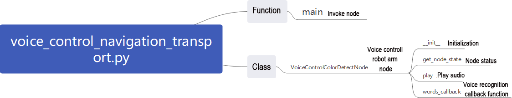

The source code is saved in
[/home/ubuntu/ros2_ws/src/xf_mic_asr_offline/scripts/voice_control_navigation_transport.py](../_static/source_code/xf_mic_asr_offline.zip)

① Function: `Main`

{lineno-start=84}

```python
def main():
    node = VoiceControlNavigationTransportNode('voice_control_navigation_transport')
    executor = MultiThreadedExecutor()
    executor.add_node(node)
    executor.spin()
    node.destroy_node()
```

Start voice-controlled multi-point navigation.

② Class: `VoiceControlNavigationTransportNode`

{lineno-start=18}

```python
class VoiceControlNavigationTransportNode(Node):
```

③ Init:

{lineno-start=19}

```python
    def __init__(self, name):
        rclpy.init()
        super().__init__(name, allow_undeclared_parameters=True, automatically_declare_parameters_from_overrides=True)
        self.running = True

        self.language = os.environ['ASR_LANGUAGE']
        self.pick_position = self.get_parameter('pick_position').value
        timer_cb_group = ReentrantCallbackGroup()
        self.buzzer_pub = self.create_publisher(BuzzerState, '/ros_robot_controller/set_buzzer', 1)
        self.create_subscription(String, '/asr_node/voice_words', self.words_callback, 1, callback_group=timer_cb_group)
        self.set_pose_client = self.create_client(SetPose2D, '/navigation_transport/pick', callback_group=timer_cb_group)
        self.set_pose_client.wait_for_service()
        self.client = self.create_client(Trigger, '/asr_node/init_finish')
        self.client.wait_for_service()
        self.play('running')

        self.get_logger().info('唤醒口令: 小幻小幻(Wake up word: hello hiwonder)')
        self.get_logger().info('唤醒后15秒内可以不用再唤醒(No need to wake up within 15 seconds after waking up)')
        self.get_logger().info('控制指令: 导航搬运(Voice command: navigate and transport)')
        self.create_service(Trigger, '~/init_finish', self.get_node_state)
        self.get_logger().info('\033[1;32m%s\033[0m' % 'start')
```

Initialize the necessary parameters for navigation and transportation, invoke the speech recognition node and the navigation transportation node, and start the main function.

④ `get_node_state`:

{lineno-start=41}

```python
    def get_node_state(self, request, response):
        response.success = True
        return response
```

Set the current status of the node

⑤ `send_request`:

{lineno-start=48}

```python
    def send_request(self, client, msg):
        future = client.call_async(msg)
        while rclpy.ok():
            if future.done() and future.result():
                return future.result()
```

This section is used to publish service requests.

⑥ `Play`:

{lineno-start=45}

```python
    def play(self, name):
        voice_play.play(name, language=self.language)
```

Play audio

⑦ `words_callback`:

{lineno-start=54}

```python
    def words_callback(self, msg):
        words = json.dumps(msg.data, ensure_ascii=False)[1:-1]
        if self.language == 'Chinese':
            words = words.replace(' ', '')
        self.get_logger().info('words: %s'%words)
        if words is not None and words not in ['唤醒成功(wake-up-success)', '休眠(Sleep)', '失败5次(Fail-5-times)',
                                               '失败10次(Fail-10-times']:
            if words == '导航搬运' or words == 'navigate and transport':
                msg = SetPose2D.Request()
                msg.data.x = self.pick_position[0]
                msg.data.y = self.pick_position[1]
                msg.data.roll = self.pick_position[2]
                msg.data.pitch = self.pick_position[3]
                msg.data.yaw = self.pick_position[4]
                self.get_logger().info(str(msg))
                res = self.send_request(self.set_pose_client, msg)
                if res.success:
                    self.play('start_navigating')
                else:
                    self.play('open_fail')
        elif words == '唤醒成功(wake-up-success)':
            self.play('awake')
        elif words == '休眠(Sleep)':
            msg = BuzzerState()
            msg.freq = 1900
            msg.on_time = 0.05
            msg.off_time = 0.01
            msg.repeat = 1
            self.buzzer_pub.publish(msg)
```

The speech recognition callback function determines whether to initiate navigation based on the recognized speech.

* **Gripping Calibration**

The program is set to recognize and grasp objects in the center of the frame by default, so adjustments are typically unnecessary. However, if the robotic arm has difficulty grasping the colored blocks during operation, you can modify the recognition area using program commands. Follow these steps:

(1) Start the robot and connect it to the remote control software, NoMachine.

(2) Click  on the system desktop to open the command line terminal.

(3) Enter the following command to stop the app's auto-start service:

```bash
sudo systemctl stop start_app_node.service
```

(4) Enter the command to begin calibrating the grasping position

```bash
ros2 launch example automatic_pick.launch.py debug:=true
```

(5) Once the robotic arm reaches the grasping position, place the colored block in the center of the robotic claw. Wait for the arm to reset and attempt to grasp the block again. Calibration is complete when the terminal displays the pixel coordinates of the colored block along with a completion message.


The data from the automatic calibration will be saved in the file: [/home/ros2_ws/src/example/config/automatic_pick_roi.yaml](../_static/source_code/automatic_pick_roi.zip).

The `pick_stop_pixel_coordinate` refers to the pixel coordinates of the grasping position in the frame. The first value is the X-axis coordinate: decreasing this value shifts the grasping position to the left, while increasing it shifts the position to the right. The second value is the Y-axis coordinate: decreasing this value moves the grasping position closer, while increasing it moves the position farther away. You can generally use the automatic calibration results but feel free to adjust them based on your needs.

The `place_stop_pixel_coordinate` indicates the pixel coordinates of the placement position in the frame. The first value is the X-axis coordinate: decreasing it shifts the position to the left, and increasing it shifts to the right. The second value is the Y-axis coordinate: decreasing it moves the position closer, while increasing it moves it farther away.

:::{Note}
Automatic calibration only adjusts the grasping position; the placement position coordinates will not be automatically calibrated. If you have set a placement target and the results are unsatisfactory, manual adjustment will be necessary.
:::


(6) After making these modifications, refer to section **9.3.9.3 Operation Steps** for the operating steps to test the functionality.

<p id="anchor_9_4"></p>

## 9.4 Switching Wake Words Between Chinese and English

(1) By default, the system uses the English wake word **"hello hiwonder"**. If you want to switch to Chinese wake words or commands, follow the steps below.


(2) On the desktop, double-click the Tool icon  to open the configuration tool.

(3) Set the language to **Chinese**, then click **Save -> Quit**.


(4) After restarting the robot, the wake word will be successfully switched.